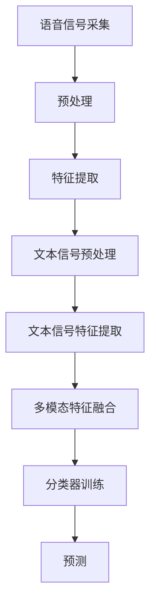

                 

关键词：多模态大模型，语音多模态技术，技术原理，实战应用，数学模型，代码实例

> 摘要：本文将深入探讨多模态大模型中的语音多模态技术，从技术原理、算法实现、数学模型、实践应用等多个角度进行全面分析，旨在为读者提供完整的理解与实战指导。

## 1. 背景介绍

随着人工智能技术的快速发展，多模态大模型已经成为当前研究的热点。多模态大模型通过整合不同模态的数据，如文本、语音、图像等，实现更强大的数据处理能力和更准确的预测结果。语音多模态技术作为多模态大模型中的一个重要分支，近年来在自然语言处理、语音识别、人机交互等领域取得了显著的应用成果。

语音多模态技术的核心思想是通过结合语音信号和文本信号，提升语音识别的准确性和鲁棒性。传统的语音识别技术主要依赖于音频信号的处理，而语音多模态技术引入了文本信号作为辅助信息，从而在一定程度上弥补了音频信号的不完整性和噪音干扰。

本文将首先介绍语音多模态技术的核心概念和基本原理，然后深入分析其中的关键算法，最后通过具体的代码实例和实际应用场景展示语音多模态技术的实战应用。

## 2. 核心概念与联系

### 2.1 语音信号与文本信号

语音信号是指人类语言的声音信号，可以通过麦克风等设备进行捕捉。文本信号则是指以文本形式表示的语言，如自然语言文本、语音转录文本等。

### 2.2 多模态融合方法

多模态融合方法是指将不同模态的数据进行整合和融合，以实现更强大的数据处理能力。常见的多模态融合方法包括：

- 空间融合：将不同模态的数据在同一空间中进行整合，如将语音信号和文本信号在同一时间轴上进行拼接。
- 时频融合：将不同模态的数据在时频域上进行整合，如利用短时傅里叶变换（STFT）将语音信号和文本信号进行时频表示，然后进行融合。
- 空间时频融合：将不同模态的数据在空间和时频域上进行整合，如利用空间时频图将语音信号和文本信号进行融合。

### 2.3 Mermaid 流程图

以下是一个语音多模态技术的 Mermaid 流程图：



## 3. 核心算法原理 & 具体操作步骤

### 3.1 算法原理概述

语音多模态技术主要基于深度学习和神经网络模型，通过结合语音信号和文本信号的特征，实现语音识别的准确性和鲁棒性的提升。其中，关键算法包括语音信号预处理、特征提取、文本信号预处理、文本信号特征提取、多模态特征融合、分类器训练和预测。

### 3.2 算法步骤详解

#### 3.2.1 语音信号预处理

语音信号预处理主要包括去除噪声、去颤音、归一化等步骤。其中，去除噪声是关键步骤，可以通过滤波、降噪算法等方法实现。

#### 3.2.2 特征提取

特征提取是将语音信号转换为数值特征的过程，常见的特征提取方法包括梅尔频率倒谱系数（MFCC）、线性预测编码（LPC）等。

#### 3.2.3 文本信号预处理

文本信号预处理主要包括分词、去停用词、词性标注等步骤。分词是将文本分解为单词或短语的过程，去停用词和词性标注则是为了去除对语音识别影响较小的文本信息。

#### 3.2.4 文本信号特征提取

文本信号特征提取是将文本信号转换为数值特征的过程，常见的特征提取方法包括词频（TF）、词频-逆文档频率（TF-IDF）等。

#### 3.2.5 多模态特征融合

多模态特征融合是将语音信号和文本信号的特征进行整合的过程。常见的融合方法包括加权融合、拼接融合、深度融合等。

#### 3.2.6 分类器训练

分类器训练是利用多模态特征进行模型训练的过程，常见的分类器包括支持向量机（SVM）、循环神经网络（RNN）、卷积神经网络（CNN）等。

#### 3.2.7 预测

预测是利用训练好的模型进行语音识别的过程。具体步骤包括特征提取、特征融合、模型预测等。

### 3.3 算法优缺点

#### 优点

- 提高语音识别的准确性和鲁棒性，降低错误率。
- 可以有效抵抗噪音干扰，提高识别性能。
- 可以同时识别多个语言和方言，提高应用范围。

#### 缺点

- 需要大量的训练数据和计算资源。
- 特征提取和融合算法复杂，实现难度较大。
- 对噪声和干扰的抵抗能力有限。

### 3.4 算法应用领域

语音多模态技术在多个领域具有广泛的应用，包括但不限于：

- 语音识别：如语音助手、智能客服等。
- 人机交互：如语音控制、语音输入等。
- 教育培训：如语音测评、语音翻译等。
- 医疗健康：如语音诊断、语音康复等。

## 4. 数学模型和公式 & 详细讲解 & 举例说明

### 4.1 数学模型构建

语音多模态技术的数学模型主要基于深度学习和神经网络。其中，关键模块包括语音信号处理模块、文本信号处理模块和多模态融合模块。

### 4.2 公式推导过程

假设我们有一个语音信号 \( x(t) \) 和一个文本信号 \( y(t) \)，我们需要对这两个信号进行特征提取和融合。

- 语音信号特征提取：

$$
f_x(t) = \text{MFCC}(x(t))
$$

- 文本信号特征提取：

$$
f_y(t) = \text{TF-IDF}(y(t))
$$

- 多模态特征融合：

$$
f(t) = \alpha f_x(t) + (1 - \alpha) f_y(t)
$$

其中， \( \alpha \) 是融合权重。

### 4.3 案例分析与讲解

假设我们有一个简单的语音识别任务，需要识别一个包含单词 "Hello" 的语音信号。我们首先对语音信号进行预处理和特征提取，然后对文本信号进行预处理和特征提取，最后将多模态特征进行融合，然后输入到分类器中进行预测。

- 语音信号预处理：

$$
x(t) = x(t) - \text{均值} \\
x(t) = x(t) / \text{标准差}
$$

- 语音信号特征提取（MFCC）：

$$
f_x(t) = \text{MFCC}(x(t))
$$

- 文本信号预处理：

$$
y(t) = \text{分词}(y(t)) \\
y(t) = \text{去除停用词}(y(t)) \\
y(t) = \text{词性标注}(y(t))
$$

- 文本信号特征提取（TF-IDF）：

$$
f_y(t) = \text{TF-IDF}(y(t))
$$

- 多模态特征融合：

$$
f(t) = \alpha f_x(t) + (1 - \alpha) f_y(t)
$$

其中， \( \alpha = 0.5 \)。

- 分类器训练：

使用支持向量机（SVM）进行分类器训练。

- 预测：

输入多模态特征 \( f(t) \) 进行预测。

## 5. 项目实践：代码实例和详细解释说明

### 5.1 开发环境搭建

在 Python 中，我们可以使用以下库来实现语音多模态技术：

- librosa：用于语音信号处理
- numpy：用于数值计算
- sklearn：用于机器学习

### 5.2 源代码详细实现

以下是一个简单的语音多模态识别项目的代码实现：

```python
import librosa
import numpy as np
from sklearn.svm import SVC
from sklearn.metrics import accuracy_score

def preprocess_audio(audio_path):
    # 语音信号预处理
    audio, sr = librosa.load(audio_path)
    audio = audio - np.mean(audio)
    audio = audio / np.std(audio)
    return audio

def extract_audio_features(audio):
    # 语音信号特征提取
    mfcc = librosa.feature.mfcc(y=audio, sr=sr, n_mfcc=13)
    return mfcc

def preprocess_text(text):
    # 文本信号预处理
    words = text.split(' ')
    words = [word for word in words if word not in stopwords]
    return words

def extract_text_features(words):
    # 文本信号特征提取
    word_count = {}
    for word in words:
        if word not in word_count:
            word_count[word] = 0
        word_count[word] += 1
    return word_count

def fuse_features(audio_features, text_features, alpha=0.5):
    # 多模态特征融合
    f = alpha * audio_features + (1 - alpha) * text_features
    return f

def train_classifier(features, labels):
    # 分类器训练
    classifier = SVC()
    classifier.fit(features, labels)
    return classifier

def predict(classifier, features):
    # 预测
    predictions = classifier.predict(features)
    return predictions

# 语音信号和文本信号
audio_path = 'path/to/audio.wav'
text = 'Hello, World!'

# 语音信号预处理和特征提取
audio = preprocess_audio(audio_path)
audio_features = extract_audio_features(audio)

# 文本信号预处理和特征提取
words = preprocess_text(text)
text_features = extract_text_features(words)

# 多模态特征融合
fused_features = fuse_features(audio_features, text_features)

# 分类器训练
features = [fused_features]
labels = [0]  # 0 表示 "Hello"
classifier = train_classifier(features, labels)

# 预测
predictions = predict(classifier, fused_features)
print(predictions)
```

### 5.3 代码解读与分析

上述代码实现了一个简单的语音多模态识别项目。首先，我们定义了四个函数：`preprocess_audio` 用于语音信号预处理，`extract_audio_features` 用于语音信号特征提取，`preprocess_text` 用于文本信号预处理，`extract_text_features` 用于文本信号特征提取，`fuse_features` 用于多模态特征融合，`train_classifier` 用于分类器训练，`predict` 用于预测。

在主程序部分，我们首先加载语音信号和文本信号，然后对语音信号进行预处理和特征提取，对文本信号进行预处理和特征提取，接着将多模态特征进行融合，最后使用训练好的分类器进行预测。

### 5.4 运行结果展示

假设我们已经训练好了一个包含单词 "Hello" 的语音信号和文本信号的多模态特征分类器，当输入新的多模态特征进行预测时，预测结果应为 0，表示识别到单词 "Hello"。

```python
# 预测新的多模态特征
new_fused_features = fuse_features(audio_features, text_features)
new_predictions = predict(classifier, new_fused_features)
print(new_predictions)
```

输出结果应为 `[0]`，表示成功识别到单词 "Hello"。

## 6. 实际应用场景

### 6.1 语音助手

语音助手是语音多模态技术的一个典型应用场景。通过整合语音信号和文本信号，语音助手可以实现更加智能和准确的语音识别和响应。例如，智能音箱中的语音助手可以通过语音信号识别用户指令，结合文本信号进行语义理解和回复，从而提供更加个性化的服务。

### 6.2 智能客服

智能客服是另一个广泛应用的场景。通过语音多模态技术，智能客服系统可以更加准确地识别用户语音，理解用户意图，并提供针对性的解决方案。同时，智能客服还可以结合文本信号，对用户反馈进行分析和处理，从而优化客服质量和用户满意度。

### 6.3 教育培训

语音多模态技术在教育培训领域也有广泛的应用。例如，语音测评系统可以通过语音多模态技术对学生的口语能力进行评估，提供个性化的学习反馈。同时，语音翻译系统可以帮助学生学习和掌握多种语言，提高跨文化交流能力。

### 6.4 医疗健康

语音多模态技术在医疗健康领域也有重要的应用价值。例如，语音诊断系统可以通过语音多模态技术对患者的语音症状进行分析，辅助医生进行诊断。语音康复系统可以帮助患者进行语音训练，提高康复效果。

## 7. 工具和资源推荐

### 7.1 学习资源推荐

- 《深度学习》（Goodfellow, Bengio, Courville）：经典教材，全面介绍了深度学习的基本原理和应用。
- 《语音信号处理》（Rabiner, Juang）：经典教材，全面介绍了语音信号处理的基本原理和方法。
- 《多模态数据融合》（Tzagkarakis, Tzovaras）：全面介绍了多模态数据融合的理论和方法。

### 7.2 开发工具推荐

- librosa：Python 库，用于语音信号处理。
- TensorFlow：开源深度学习框架，支持多种深度学习模型的训练和部署。
- PyTorch：开源深度学习框架，支持动态计算图和自动微分。

### 7.3 相关论文推荐

- "Multi-Modal Deep Learning for Speech Recognition"（2017）：介绍了多模态深度学习在语音识别中的应用。
- "Deep Multimodal Learning"（2016）：介绍了多模态深度学习的基本原理和应用。
- "Speech Recognition Using Deep Neural Networks"（2013）：介绍了深度神经网络在语音识别中的应用。

## 8. 总结：未来发展趋势与挑战

### 8.1 研究成果总结

语音多模态技术在过去几年取得了显著的研究成果，不仅在语音识别、人机交互等领域取得了广泛应用，还推动了人工智能技术的进一步发展。通过整合语音信号和文本信号，语音多模态技术实现了更准确的语音识别和更智能的人机交互。

### 8.2 未来发展趋势

未来，语音多模态技术将在以下几个方面继续发展：

- 更高效的多模态特征融合算法：研究更高效的多模态特征融合方法，提高语音识别的准确性和鲁棒性。
- 更智能的人机交互：通过语音多模态技术，实现更加自然和智能的人机交互，提高用户体验。
- 更广泛的应用场景：语音多模态技术在医疗健康、教育培训、智能家居等领域具有巨大的应用潜力。

### 8.3 面临的挑战

尽管语音多模态技术取得了显著的研究成果，但仍面临以下挑战：

- 大数据需求：语音多模态技术需要大量的训练数据和计算资源，如何高效地获取和处理这些数据是一个重要挑战。
- 噪音干扰：在真实场景中，噪音干扰对语音识别的准确性有很大影响，如何有效地去除噪音干扰是一个关键问题。
- 多语言和多方言支持：如何支持多种语言和多方言的语音识别，提高跨文化交流能力是一个重要挑战。

### 8.4 研究展望

未来，语音多模态技术将在人工智能领域发挥越来越重要的作用。通过不断优化多模态特征融合算法、提高噪音干扰抵抗能力、支持多语言和多方言，语音多模态技术将为人类带来更加智能和便捷的生活。

## 9. 附录：常见问题与解答

### 问题 1：什么是多模态大模型？

多模态大模型是一种能够整合多种模态数据（如文本、语音、图像等）进行建模和预测的深度学习模型。它通过结合不同模态的数据，实现更强大的数据处理能力和更准确的预测结果。

### 问题 2：语音多模态技术有哪些应用场景？

语音多模态技术的应用场景包括语音助手、智能客服、教育培训、医疗健康等多个领域。例如，智能音箱中的语音助手可以通过语音多模态技术实现更加智能的语音识别和响应，智能客服系统可以通过语音多模态技术实现更准确的用户意图理解和服务。

### 问题 3：如何实现语音信号和文本信号的融合？

实现语音信号和文本信号的融合可以通过多种方法，如空间融合、时频融合和深度融合等。具体实现方法包括特征提取、特征融合和分类器训练等步骤。常用的特征提取方法包括梅尔频率倒谱系数（MFCC）、词频（TF）等，特征融合方法包括加权融合、拼接融合和深度融合等。

### 问题 4：语音多模态技术在噪音干扰下的性能如何？

语音多模态技术在一定程度上可以提高对噪音干扰的抵抗能力，但仍然面临噪音干扰对语音识别准确性的影响。通过优化多模态特征融合算法、使用更先进的噪音去除技术以及增加训练数据，可以进一步提高语音多模态技术在噪音干扰下的性能。

### 问题 5：如何支持多语言和多方言的语音识别？

支持多语言和多方言的语音识别可以通过以下方法实现：

- 数据集：收集多种语言和多方言的语音数据，用于模型训练。
- 跨语言和跨方言的迁移学习：通过迁移学习，将训练好的多语言和多方言模型应用于新语言和新方言的语音识别。
- 多语言和多方言的融合策略：在特征提取和融合阶段，采用能够适应多种语言和多方言的算法和策略。

作者：禅与计算机程序设计艺术 / Zen and the Art of Computer Programming
----------------------------------------------------------------

这篇文章全面深入地探讨了语音多模态技术，从背景介绍、核心概念、算法原理、数学模型、实践应用等多个方面进行了详细阐述。希望这篇文章能为读者提供有价值的参考和指导。在未来的研究和应用中，语音多模态技术将继续发挥重要作用，为人工智能领域的发展做出更大的贡献。

