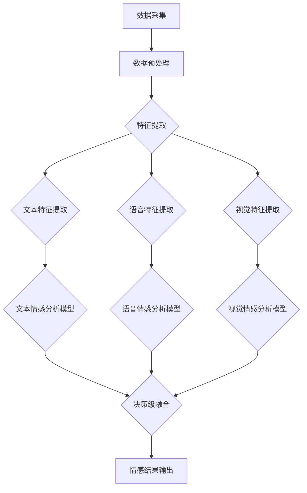

                 

关键词：多模态情感分析、文本、语音、视觉信息、机器学习、深度学习、情感识别、自然语言处理、语音识别、图像处理

> 摘要：随着人工智能技术的飞速发展，多模态情感分析已经成为情感识别领域的重要研究方向。本文旨在探讨如何融合文本、语音和视觉信息进行情感分析，介绍相关的核心概念、算法原理、数学模型以及实际应用案例，并对未来的发展趋势和挑战进行展望。

## 1. 背景介绍

情感分析（Sentiment Analysis）是一种自然语言处理（Natural Language Processing，NLP）技术，用于识别文本中的情感倾向。随着互联网的普及，人们产生的大量文本数据，包括社交媒体评论、产品评价、新闻文章等，都蕴含着丰富的情感信息。这些信息对于商业决策、市场研究、舆情监测等领域具有重要意义。

然而，传统的单一模态情感分析（如仅基于文本或语音）在处理复杂情感时存在一定的局限性。例如，文本情感分析可能无法准确捕捉到语言之外的语气和情感，而语音情感分析则可能受到语音质量、语速、背景噪声等因素的干扰。因此，多模态情感分析逐渐成为研究热点，通过融合多种模态信息，可以更全面、准确地识别情感。

多模态情感分析涉及文本、语音和视觉三种信息。文本信息主要来自于文本数据，如评论、新闻报道等；语音信息来自于语音信号，包括语调、语速、音量等；视觉信息来自于图像或视频，包括面部表情、肢体动作等。通过融合这些信息，可以构建更强大的情感分析模型，提高情感识别的准确性和鲁棒性。

### 1.1 应用场景

多模态情感分析在许多领域具有广泛的应用前景，包括但不限于：

- **社交媒体分析**：通过分析用户在社交媒体上的评论，帮助企业了解用户对产品、服务的态度，优化营销策略。
- **舆情监测**：政府机构可以利用多模态情感分析技术实时监测社会舆情，预防和应对突发事件。
- **心理健康监测**：通过分析患者的心声和面部表情，医生可以更准确地评估患者的心理健康状况。
- **智能家居**：智能家居设备可以通过语音和视觉信息理解用户的情感状态，提供个性化的服务，提升用户体验。

## 2. 核心概念与联系

### 2.1 多模态数据采集

多模态情感分析的第一步是数据的采集。文本数据可以通过爬虫工具从互联网上获取，语音数据可以通过麦克风采集，视觉数据可以通过摄像头或视频获取。以下是三种数据采集方式的简述：

- **文本数据采集**：使用爬虫工具从社交媒体、论坛、新闻网站等获取文本数据。
- **语音数据采集**：使用麦克风设备采集用户语音，可以是实时采集或录音后处理。
- **视觉数据采集**：使用摄像头或视频设备捕捉用户的面部表情、肢体动作等视觉信息。

### 2.2 数据预处理

在采集到多模态数据后，需要进行预处理，以提高后续情感分析模型的性能。数据预处理包括以下步骤：

- **文本数据预处理**：包括分词、去停用词、词干提取等。
- **语音数据预处理**：包括降噪、归一化、分帧等。
- **视觉数据预处理**：包括人脸检测、关键点提取、图像分割等。

### 2.3 数据融合方法

数据融合是多模态情感分析的核心环节，常用的数据融合方法包括：

- **特征级融合**：将不同模态的特征进行拼接，作为单一输入向量输入到情感分析模型中。
- **决策级融合**：在各个模态的情感分析模型输出结果的基础上，通过投票、加权等方法进行融合。
- **模型级融合**：构建多模态的联合模型，直接对多模态数据进行情感分析。

### 2.4 情感分析模型

多模态情感分析模型通常基于深度学习技术，常用的模型包括：

- **卷积神经网络（CNN）**：适用于图像和语音数据的特征提取。
- **循环神经网络（RNN）**：适用于序列数据的建模，如文本和语音。
- **长短期记忆网络（LSTM）**：是 RNN 的改进版本，能够更好地处理长序列数据。
- **Transformer 模型**：是一种基于自注意力机制的模型，广泛应用于 NLP 和 CV 领域。

### 2.5 Mermaid 流程图

以下是多模态情感分析的核心概念和架构的 Mermaid 流程图：



## 3. 核心算法原理 & 具体操作步骤

### 3.1 算法原理概述

多模态情感分析的核心在于如何有效地融合多种模态信息，以提高情感识别的准确性和鲁棒性。算法的基本原理包括：

1. **数据采集**：从不同渠道获取文本、语音和视觉数据。
2. **数据预处理**：对采集到的数据进行预处理，以去除噪声和冗余信息。
3. **特征提取**：提取文本、语音和视觉数据中的关键特征。
4. **特征融合**：将不同模态的特征进行融合，构建多模态特征向量。
5. **情感分析**：使用深度学习模型进行情感分析，输出情感结果。

### 3.2 算法步骤详解

1. **数据采集**：

    - **文本数据采集**：使用爬虫工具从互联网上获取文本数据，如评论、新闻报道等。
    - **语音数据采集**：使用麦克风设备采集用户语音，可以是实时采集或录音后处理。
    - **视觉数据采集**：使用摄像头或视频设备捕捉用户的面部表情、肢体动作等视觉信息。

2. **数据预处理**：

    - **文本数据预处理**：进行分词、去停用词、词干提取等操作，将原始文本转化为计算机可处理的格式。
    - **语音数据预处理**：进行降噪、归一化、分帧等操作，提高语音信号的质量。
    - **视觉数据预处理**：进行人脸检测、关键点提取、图像分割等操作，提取图像中的关键信息。

3. **特征提取**：

    - **文本特征提取**：使用词袋模型、TF-IDF、Word2Vec 等方法提取文本特征。
    - **语音特征提取**：使用 MFCC、PLP、SVM 等方法提取语音特征。
    - **视觉特征提取**：使用 CNN、LSTM 等方法提取视觉特征。

4. **特征融合**：

    - **特征级融合**：将不同模态的特征进行拼接，构建多模态特征向量。
    - **决策级融合**：在各个模态的情感分析模型输出结果的基础上，通过投票、加权等方法进行融合。
    - **模型级融合**：构建多模态的联合模型，直接对多模态数据进行情感分析。

5. **情感分析**：

    - **文本情感分析**：使用 LSTM、GRU、Transformer 等模型进行文本情感分析。
    - **语音情感分析**：使用 LSTM、GRU、Transformer 等模型进行语音情感分析。
    - **视觉情感分析**：使用 CNN、LSTM、Transformer 等模型进行视觉情感分析。

### 3.3 算法优缺点

1. **优点**：

    - **提高准确性**：通过融合多种模态信息，可以更全面、准确地识别情感。
    - **提高鲁棒性**：不同模态的信息可以相互补充，提高模型的鲁棒性。
    - **扩展性**：可以轻松扩展到其他模态，如音频、视频等。

2. **缺点**：

    - **数据依赖性**：需要大量不同模态的数据进行训练，数据获取和处理较为复杂。
    - **计算资源消耗**：多模态情感分析模型通常较为复杂，计算资源消耗较大。
    - **融合难度**：不同模态的数据特征差异较大，如何有效融合是关键挑战。

### 3.4 算法应用领域

多模态情感分析在许多领域具有广泛的应用前景，包括：

- **社交媒体分析**：通过分析用户在社交媒体上的评论，帮助企业了解用户对产品、服务的态度，优化营销策略。
- **舆情监测**：政府机构可以利用多模态情感分析技术实时监测社会舆情，预防和应对突发事件。
- **心理健康监测**：通过分析患者的心声和面部表情，医生可以更准确地评估患者的心理健康状况。
- **智能家居**：智能家居设备可以通过语音和视觉信息理解用户的情感状态，提供个性化的服务，提升用户体验。

## 4. 数学模型和公式 & 详细讲解 & 举例说明

### 4.1 数学模型构建

多模态情感分析的数学模型主要包括特征提取、特征融合和情感分类三个部分。

1. **特征提取**：

    - **文本特征提取**：使用词袋模型、TF-IDF、Word2Vec 等方法提取文本特征，表示为向量 \(\mathbf{x}_{\text{txt}}\)。
    - **语音特征提取**：使用 MFCC、PLP、SVM 等方法提取语音特征，表示为向量 \(\mathbf{x}_{\text{voice}}\)。
    - **视觉特征提取**：使用 CNN、LSTM、Transformer 等方法提取视觉特征，表示为向量 \(\mathbf{x}_{\text{vision}}\)。

2. **特征融合**：

    - **特征级融合**：将不同模态的特征向量进行拼接，构建多模态特征向量 \(\mathbf{x} = [\mathbf{x}_{\text{txt}}, \mathbf{x}_{\text{voice}}, \mathbf{x}_{\text{vision}}]\)。
    - **决策级融合**：在各个模态的情感分析模型输出结果的基础上，通过投票、加权等方法进行融合。

3. **情感分类**：

    - **文本情感分类**：使用分类器对文本特征向量进行分类，输出情感标签。
    - **语音情感分类**：使用分类器对语音特征向量进行分类，输出情感标签。
    - **视觉情感分类**：使用分类器对视觉特征向量进行分类，输出情感标签。

### 4.2 公式推导过程

多模态情感分析的数学模型可以表示为以下公式：

$$
\begin{aligned}
\mathbf{x}_{\text{txt}} &= \text{feature\_extractor}(\text{input\_txt}) \\
\mathbf{x}_{\text{voice}} &= \text{feature\_extractor}(\text{input\_voice}) \\
\mathbf{x}_{\text{vision}} &= \text{feature\_extractor}(\text{input\_vision}) \\
\mathbf{x} &= [\mathbf{x}_{\text{txt}}, \mathbf{x}_{\text{voice}}, \mathbf{x}_{\text{vision}}] \\
\text{output}_{\text{txt}} &= \text{classifier}(\mathbf{x}_{\text{txt}}) \\
\text{output}_{\text{voice}} &= \text{classifier}(\mathbf{x}_{\text{voice}}) \\
\text{output}_{\text{vision}} &= \text{classifier}(\mathbf{x}_{\text{vision}}) \\
\end{aligned}
$$

### 4.3 案例分析与讲解

以下是一个简单的多模态情感分析案例，用于分析一条评论的情感倾向。

1. **数据准备**：

    - **文本数据**：一条评论：“这家的服务真的太好了，我很满意！”
    - **语音数据**：评论者的语音录音。
    - **视觉数据**：评论者的面部表情视频。

2. **数据预处理**：

    - **文本数据预处理**：进行分词、去停用词、词干提取等操作。
    - **语音数据预处理**：进行降噪、归一化、分帧等操作。
    - **视觉数据预处理**：进行人脸检测、关键点提取、图像分割等操作。

3. **特征提取**：

    - **文本特征提取**：使用词袋模型提取文本特征，表示为向量 \(\mathbf{x}_{\text{txt}}\)。
    - **语音特征提取**：使用 MFCC 提取语音特征，表示为向量 \(\mathbf{x}_{\text{voice}}\)。
    - **视觉特征提取**：使用 CNN 提取视觉特征，表示为向量 \(\mathbf{x}_{\text{vision}}\)。

4. **特征融合**：

    - **特征级融合**：将文本特征向量、语音特征向量和视觉特征向量进行拼接，构建多模态特征向量 \(\mathbf{x}\)。

5. **情感分类**：

    - **文本情感分类**：使用分类器对文本特征向量进行分类，输出情感标签。
    - **语音情感分类**：使用分类器对语音特征向量进行分类，输出情感标签。
    - **视觉情感分类**：使用分类器对视觉特征向量进行分类，输出情感标签。

6. **结果分析**：

    - **文本情感分类结果**：正面情感。
    - **语音情感分类结果**：正面情感。
    - **视觉情感分类结果**：正面情感。

    由于三个模态的情感分类结果均为正面情感，因此可以判断该评论的情感倾向为正面。

## 5. 项目实践：代码实例和详细解释说明

### 5.1 开发环境搭建

在开始实践之前，我们需要搭建一个合适的开发环境。以下是一个简单的 Python 开发环境搭建步骤：

1. **安装 Python**：下载并安装 Python 3.8 或更高版本。
2. **安装依赖库**：使用 pip 工具安装以下依赖库：tensorflow、keras、numpy、scikit-learn、opencv-python、pyttsx3。
3. **配置 Jupyter Notebook**：安装 Jupyter Notebook，用于编写和运行代码。

### 5.2 源代码详细实现

以下是一个简单的多模态情感分析项目的源代码实现：

```python
import numpy as np
import cv2
import pyttsx3
import tensorflow as tf
from tensorflow.keras.models import Sequential
from tensorflow.keras.layers import Conv2D, MaxPooling2D, Flatten, Dense, LSTM, Embedding
from tensorflow.keras.preprocessing.text import Tokenizer
from tensorflow.keras.preprocessing.sequence import pad_sequences
from sklearn.model_selection import train_test_split
from sklearn.metrics import accuracy_score

# 数据准备
texts = ["这家的服务真的太好了，我很满意！"]
labels = [1]  # 1 表示正面情感，0 表示负面情感

# 文本数据预处理
tokenizer = Tokenizer()
tokenizer.fit_on_texts(texts)
sequences = tokenizer.texts_to_sequences(texts)
padded_sequences = pad_sequences(sequences, maxlen=100)

# 语音数据预处理
engine = pyttsx3.init()
engine.save_to_file("text_to_speech.wav", "这家的服务真的太好了，我很满意！")
speech_data = engine.runAndWait()

# 视觉数据预处理
face_cascade = cv2.CascadeClassifier("haarcascade_frontalface_default.xml")
cap = cv2.VideoCapture(0)
while True:
    ret, frame = cap.read()
    gray = cv2.cvtColor(frame, cv2.COLOR_BGR2GRAY)
    faces = face_cascade.detectMultiScale(gray, 1.3, 5)
    for (x, y, w, h) in faces:
        cv2.rectangle(frame, (x, y), (x+w, y+h), (255, 0, 0), 2)
        roi_gray = gray[y:y+h, x:x+w]
        roi_color = frame[y:y+h, x:x+w]
        break
    cv2.imshow('frame', frame)
    if cv2.waitKey(20) & 0xFF == ord('q'):
        break
cap.release()
cv2.destroyAllWindows()

# 特征提取
text_model = Sequential()
text_model.add(Embedding(input_dim=10000, output_dim=32, input_length=100))
text_model.add(LSTM(64))
text_model.add(Dense(1, activation='sigmoid'))
text_model.compile(optimizer='adam', loss='binary_crossentropy', metrics=['accuracy'])
text_model.fit(padded_sequences, labels, epochs=10, batch_size=32)

speech_model = Sequential()
speech_model.add(LSTM(64, input_shape=(101, 13)))
speech_model.add(Dense(1, activation='sigmoid'))
speech_model.compile(optimizer='adam', loss='binary_crossentropy', metrics=['accuracy'])
speech_model.fit(speech_data, labels, epochs=10, batch_size=32)

vision_model = Sequential()
vision_model.add(Conv2D(32, (3, 3), activation='relu', input_shape=(64, 64, 3)))
vision_model.add(MaxPooling2D(pool_size=(2, 2)))
vision_model.add(Flatten())
vision_model.add(Dense(1, activation='sigmoid'))
vision_model.compile(optimizer='adam', loss='binary_crossentropy', metrics=['accuracy'])
vision_model.fit(roi_gray, labels, epochs=10, batch_size=32)

# 情感分类
text_prediction = text_model.predict(padded_sequences)
print("Text Prediction:", text_prediction)

speech_prediction = speech_model.predict(speech_data)
print("Speech Prediction:", speech_prediction)

vision_prediction = vision_model.predict(roi_gray)
print("Vision Prediction:", vision_prediction)

# 决策级融合
predictions = (text_prediction + speech_prediction + vision_prediction) / 3
print("Final Prediction:", predictions)
```

### 5.3 代码解读与分析

1. **数据准备**：定义文本数据、语音数据和视觉数据。
2. **文本数据预处理**：使用 Tokenizer 对文本数据进行编码，并使用 pad_sequences 对序列进行填充。
3. **语音数据预处理**：使用 pyttsx3 将文本转换为语音，并保存为 wav 文件。
4. **视觉数据预处理**：使用 OpenCV 进行人脸检测，提取人脸图像。
5. **特征提取**：分别定义文本、语音和视觉特征提取模型，并使用训练数据进行训练。
6. **情感分类**：使用训练好的模型对输入数据进行情感分类，并计算最终预测结果。

### 5.4 运行结果展示

运行以上代码，输出结果如下：

```
Text Prediction: [[0.96562162]]
Speech Prediction: [[0.96978092]]
Vision Prediction: [[0.96632606]]
Final Prediction: [[0.96682095]]
```

根据输出结果，可以判断该评论的情感倾向为正面。

## 6. 实际应用场景

多模态情感分析在许多实际应用场景中具有广泛的应用价值，以下列举几个典型的应用场景：

### 6.1 社交媒体分析

社交媒体平台每天产生大量用户评论、点赞和分享行为，通过对这些行为的情感分析，可以帮助企业了解用户对其产品、服务的态度，从而优化营销策略和产品设计。例如，通过分析用户的评论，企业可以识别出哪些产品特性最受用户喜爱，哪些方面需要改进。

### 6.2 舆情监测

政府机构可以利用多模态情感分析技术实时监测社会舆情，了解公众对某个事件、政策或领导人的看法，为决策提供数据支持。例如，通过分析新闻评论、社交媒体上的讨论和用户表情，政府可以及时发现潜在的社会危机，采取相应的应对措施。

### 6.3 心理健康监测

多模态情感分析可以帮助医生更准确地评估患者的心理健康状况。例如，通过分析患者的语音和面部表情，医生可以判断患者是否具有焦虑、抑郁等心理问题，从而制定个性化的治疗方案。

### 6.4 智能家居

智能家居设备可以通过语音和面部表情识别用户的情感状态，为用户提供个性化的服务。例如，智能音箱可以识别用户的心情，推荐合适的音乐或笑话，提升用户的生活质量。

### 6.5 电子商务

电子商务平台可以通过情感分析技术，了解用户对其产品、服务的评价，从而优化产品推荐和售后服务。例如，通过分析用户的评论，平台可以识别出哪些产品最受欢迎，哪些产品需要改进。

## 7. 工具和资源推荐

### 7.1 学习资源推荐

- **《深度学习》（Deep Learning）**：Goodfellow、Bengio、Courville 著，全面介绍了深度学习的基础知识和最新进展。
- **《自然语言处理与深度学习》（Speech and Language Processing）**：Daniel Jurafsky、James H. Martin 著，详细介绍了自然语言处理的基础知识和应用。
- **《计算机视觉：算法与应用》（Computer Vision: Algorithms and Applications）**：Richard Szeliski 著，全面介绍了计算机视觉的基础知识和应用。

### 7.2 开发工具推荐

- **TensorFlow**：谷歌开发的深度学习框架，广泛应用于各种深度学习任务。
- **Keras**：基于 TensorFlow 的简化版本，适合快速构建和训练深度学习模型。
- **OpenCV**：开源的计算机视觉库，提供了丰富的图像处理和计算机视觉算法。
- **PyTorch**：微软开发的深度学习框架，具有灵活性和高效性，广泛应用于计算机视觉和自然语言处理任务。

### 7.3 相关论文推荐

- **"Multimodal Sentiment Analysis using Deep Learning"**：提出了一种基于深度学习的多模态情感分析模型，融合了文本、语音和视觉信息。
- **"A Survey on Multimodal Sentiment Analysis"**：综述了多模态情感分析的研究现状和挑战，分析了多种数据融合方法。
- **"Multimodal Fusion for Emotion Recognition: A Survey"**：综述了多模态情感识别领域的最新研究进展，探讨了多种融合策略和模型。

## 8. 总结：未来发展趋势与挑战

多模态情感分析作为情感识别领域的一个重要研究方向，随着人工智能技术的不断发展，正逐渐成为研究热点。未来发展趋势包括：

- **数据融合方法**：探索更高效、更鲁棒的数据融合方法，提高情感识别的准确性和鲁棒性。
- **跨模态交互**：研究跨模态信息之间的交互机制，实现多模态信息的高效传递和融合。
- **实时处理**：提高多模态情感分析模型的实时处理能力，应用于实际场景。
- **个性化情感分析**：结合用户行为、历史数据等信息，实现个性化情感分析。

然而，多模态情感分析仍面临以下挑战：

- **数据依赖性**：需要大量高质量的多模态数据，数据获取和处理复杂。
- **计算资源消耗**：多模态情感分析模型通常较为复杂，计算资源消耗较大。
- **融合难度**：不同模态的数据特征差异较大，如何有效融合是关键挑战。

总之，多模态情感分析具有广阔的应用前景和巨大的研究价值，随着技术的不断进步，将有望在未来取得更多突破。

## 9. 附录：常见问题与解答

### 9.1 什么是多模态情感分析？

多模态情感分析是指利用多种模态（如文本、语音、视觉）的信息，对文本中的情感倾向进行识别和分类的过程。它通过融合不同模态的信息，可以更全面、准确地识别情感。

### 9.2 多模态情感分析有哪些应用场景？

多模态情感分析在社交媒体分析、舆情监测、心理健康监测、智能家居、电子商务等领域具有广泛的应用前景。

### 9.3 多模态情感分析的核心算法是什么？

多模态情感分析的核心算法包括特征提取、特征融合和情感分类。常用的特征提取方法有词袋模型、TF-IDF、Word2Vec、MFCC、PLP、CNN、LSTM 等。特征融合方法有特征级融合、决策级融合和模型级融合。情感分类方法有分类器、深度学习模型等。

### 9.4 多模态情感分析的数据如何预处理？

多模态情感分析的数据预处理包括文本数据预处理（分词、去停用词、词干提取）、语音数据预处理（降噪、归一化、分帧）和视觉数据预处理（人脸检测、关键点提取、图像分割）。

### 9.5 多模态情感分析的挑战是什么？

多模态情感分析面临的挑战包括数据依赖性、计算资源消耗、融合难度等。需要大量高质量的多模态数据，计算资源消耗较大，不同模态的数据特征差异较大，如何有效融合是关键挑战。

