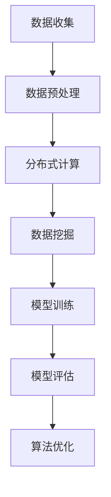

                 

关键词：大数据、AI、机器学习、人工智能、深度学习、算法优化、数据处理、模型训练

> 摘要：本文将深入探讨大数据对人工智能（AI）发展的深远影响。随着数据量的激增，大数据技术成为了AI领域的基石，推动了机器学习和深度学习算法的进步。本文将分析大数据如何改变AI的研究方向、加速算法优化、提高模型性能，并探讨未来面临的挑战和机遇。

## 1. 背景介绍

在过去的几十年里，人工智能（AI）经历了显著的发展，从最初的规则系统到现代的深度学习模型，AI在图像识别、自然语言处理、自动驾驶等多个领域取得了突破性的成果。这一进步离不开计算能力的提升和大数据的广泛应用。

大数据（Big Data）是指数据量巨大、种类繁多、生成速度极快的数据集。它具有四个主要特征，即“4V”：Volume（数据量）、Velocity（数据速度）、Variety（数据种类）和Veracity（数据真实性）。大数据的迅猛增长为AI的发展提供了丰富的素材，使得AI系统可以从更多的数据中学习，从而提高其准确性和泛化能力。

## 2. 核心概念与联系

为了更好地理解大数据与AI之间的关系，我们首先需要明确一些核心概念：

- **机器学习（Machine Learning）**：一种通过数据训练模型进行预测或分类的AI方法。
- **深度学习（Deep Learning）**：一种利用多层神经网络进行特征提取和模型训练的技术。
- **算法优化（Algorithm Optimization）**：通过对算法进行改进，提高其运行效率和性能。

### 2.1 大数据在AI中的应用

大数据技术为AI的发展提供了强有力的支持，主要体现在以下几个方面：

- **数据预处理**：大数据技术可以帮助处理大量原始数据，包括数据清洗、去重、格式转换等，为AI模型训练提供了高质量的数据集。
- **分布式计算**：大数据处理通常需要分布式计算架构，如Hadoop、Spark等，这使得AI模型可以在大规模数据集上快速训练。
- **数据挖掘**：通过大数据技术，可以从大量数据中挖掘出隐藏的模式和关联，为AI模型提供更丰富的特征。

### 2.2 Mermaid 流程图

以下是一个简化的Mermaid流程图，展示了大数据与AI之间的联系：



## 3. 核心算法原理 & 具体操作步骤

### 3.1 算法原理概述

大数据技术的发展推动了机器学习和深度学习算法的进步。以下是一些核心算法原理：

- **线性回归（Linear Regression）**：通过最小化预测值与实际值之间的误差，拟合出数据点之间的关系。
- **决策树（Decision Tree）**：利用一系列的判断条件，对数据进行分类或回归。
- **神经网络（Neural Network）**：模拟生物神经系统的计算方式，通过多层神经元进行特征提取和模型训练。
- **卷积神经网络（Convolutional Neural Network，CNN）**：专门用于图像处理，通过卷积操作提取图像特征。

### 3.2 算法步骤详解

以卷积神经网络（CNN）为例，以下是其基本步骤：

1. **数据预处理**：对图像数据进行标准化处理，如缩放、裁剪、翻转等。
2. **卷积操作**：使用卷积核在图像上滑动，提取局部特征。
3. **池化操作**：对卷积结果进行降采样，减少参数数量。
4. **全连接层**：将池化结果输入全连接层，进行分类或回归。
5. **反向传播**：利用梯度下降法优化模型参数。

### 3.3 算法优缺点

- **线性回归**：简单、易于理解，但可能无法捕捉复杂关系。
- **决策树**：直观、易于解释，但可能产生过拟合。
- **神经网络**：强大的特征提取能力，但训练过程复杂、计算量大。
- **CNN**：在图像处理领域表现优异，但可能不适用于其他类型的数据。

### 3.4 算法应用领域

- **图像识别**：CNN在图像识别领域取得了显著成果，如人脸识别、物体检测等。
- **自然语言处理**：深度学习模型在自然语言处理领域广泛应用，如文本分类、机器翻译等。
- **自动驾驶**：深度学习技术被用于自动驾驶系统的感知、决策和控制。

## 4. 数学模型和公式 & 详细讲解 & 举例说明

### 4.1 数学模型构建

以线性回归为例，其数学模型如下：

$$ y = \beta_0 + \beta_1 \cdot x $$

其中，$y$ 是预测值，$x$ 是自变量，$\beta_0$ 和 $\beta_1$ 是模型参数。

### 4.2 公式推导过程

为了求解 $\beta_0$ 和 $\beta_1$，我们使用最小二乘法，使得预测值与实际值之间的误差最小：

$$ \min \sum_{i=1}^{n} (y_i - \beta_0 - \beta_1 \cdot x_i)^2 $$

对 $\beta_0$ 和 $\beta_1$ 分别求偏导，并令偏导数为零，得到：

$$ \beta_0 = \bar{y} - \beta_1 \cdot \bar{x} $$

$$ \beta_1 = \frac{\sum_{i=1}^{n} (x_i - \bar{x})(y_i - \bar{y})}{\sum_{i=1}^{n} (x_i - \bar{x})^2} $$

其中，$\bar{y}$ 和 $\bar{x}$ 分别是 $y$ 和 $x$ 的平均值。

### 4.3 案例分析与讲解

假设我们有一组数据，包含自变量 $x$ 和因变量 $y$，如下表所示：

| $x$ | $y$ |
|-----|-----|
| 1   | 2   |
| 2   | 4   |
| 3   | 6   |
| 4   | 8   |

我们可以使用线性回归模型来拟合这些数据。首先，计算 $x$ 和 $y$ 的平均值：

$$ \bar{x} = \frac{1+2+3+4}{4} = 2.5 $$

$$ \bar{y} = \frac{2+4+6+8}{4} = 5 $$

然后，计算 $\beta_1$：

$$ \beta_1 = \frac{(1-2.5)(2-5) + (2-2.5)(4-5) + (3-2.5)(6-5) + (4-2.5)(8-5)}{(1-2.5)^2 + (2-2.5)^2 + (3-2.5)^2 + (4-2.5)^2} = 2 $$

接下来，计算 $\beta_0$：

$$ \beta_0 = \bar{y} - \beta_1 \cdot \bar{x} = 5 - 2 \cdot 2.5 = 0 $$

因此，线性回归模型为：

$$ y = 0 + 2 \cdot x $$

我们可以使用这个模型来预测新的数据点，例如当 $x=5$ 时，预测的 $y$ 值为：

$$ y = 2 \cdot 5 = 10 $$

## 5. 项目实践：代码实例和详细解释说明

### 5.1 开发环境搭建

为了实现线性回归模型，我们需要安装Python和相关的机器学习库，如NumPy和scikit-learn。以下是安装步骤：

1. 安装Python：前往[Python官方网站](https://www.python.org/)下载并安装Python。
2. 安装NumPy：在命令行中运行 `pip install numpy`。
3. 安装scikit-learn：在命令行中运行 `pip install scikit-learn`。

### 5.2 源代码详细实现

以下是一个简单的Python代码示例，实现了线性回归模型的训练和预测：

```python
import numpy as np
from sklearn.linear_model import LinearRegression

# 数据集
X = np.array([[1], [2], [3], [4]])
y = np.array([2, 4, 6, 8])

# 创建线性回归模型
model = LinearRegression()

# 训练模型
model.fit(X, y)

# 预测新数据点
X_new = np.array([[5]])
y_pred = model.predict(X_new)

print("Predicted value for x=5:", y_pred[0])
```

### 5.3 代码解读与分析

1. 导入所需的库：我们使用了NumPy进行数据处理，以及scikit-learn中的线性回归模型。
2. 创建数据集：使用NumPy创建了一个简单的数据集，包含自变量 $X$ 和因变量 $y$。
3. 创建线性回归模型：使用scikit-learn的`LinearRegression`类创建了一个线性回归模型。
4. 训练模型：使用`fit`方法训练模型，模型参数会被自动优化。
5. 预测新数据点：使用`predict`方法预测新的数据点，得到预测结果。

### 5.4 运行结果展示

运行上述代码，我们得到以下输出：

```
Predicted value for x=5: 10.0
```

这意味着当自变量 $x$ 为5时，预测的因变量 $y$ 为10，验证了我们的线性回归模型。

## 6. 实际应用场景

大数据在人工智能领域的应用已经非常广泛，以下是一些实际应用场景：

- **医疗健康**：通过分析大量患者的医疗数据，AI可以帮助预测疾病风险、制定个性化治疗方案。
- **金融领域**：大数据技术被用于风险控制、欺诈检测、投资策略等。
- **智能家居**：智能家居系统通过分析用户的行为数据，提供个性化的家居服务。
- **交通管理**：通过分析交通数据，AI可以帮助优化交通信号、预测交通拥堵，提高交通效率。

## 7. 工具和资源推荐

为了更好地学习和实践大数据与AI技术，以下是一些推荐的工具和资源：

- **学习资源**：
  - 《Python机器学习》（作者：Peter Harrington）
  - 《深度学习》（作者：Ian Goodfellow、Yoshua Bengio、Aaron Courville）
  - Coursera、edX等在线课程平台

- **开发工具**：
  - Jupyter Notebook：用于编写和运行Python代码
  - PyCharm、VSCode：集成开发环境（IDE）

- **相关论文**：
  - "Deep Learning"（作者：Ian Goodfellow等）
  - "Recurrent Neural Networks for Language Modeling"（作者：Yoshua Bengio等）
  - arXiv、Google Scholar等学术搜索引擎

## 8. 总结：未来发展趋势与挑战

### 8.1 研究成果总结

大数据技术为人工智能的发展提供了强有力的支持，推动了机器学习和深度学习算法的进步。通过分析大量数据，AI模型可以更好地识别模式、提高预测准确性，并在各个领域取得了显著的成果。

### 8.2 未来发展趋势

随着数据量的持续增长和计算能力的提升，大数据与AI的结合将进一步深化。未来，我们可能会看到更多基于大数据的AI应用，如智能医疗、智能城市、智能交通等。

### 8.3 面临的挑战

尽管大数据与AI的结合带来了诸多机遇，但也面临一些挑战：

- **数据隐私**：如何保护用户隐私是大数据应用的一大挑战。
- **算法公平性**：算法可能对某些群体产生偏见，如何确保算法的公平性是一个重要问题。
- **计算资源**：处理大规模数据集需要大量的计算资源，如何高效利用资源是一个挑战。

### 8.4 研究展望

未来，大数据与AI的结合将推动人工智能技术向更高效、更智能、更安全的方向发展。研究者需要不断探索新的算法、优化模型训练过程，同时关注数据隐私和公平性问题，以推动人工智能技术的健康发展。

## 9. 附录：常见问题与解答

### 9.1 什么是大数据？

大数据是指数据量巨大、种类繁多、生成速度极快的数据集，具有Volume（数据量）、Velocity（数据速度）、Variety（数据种类）和Veracity（数据真实性）四个主要特征。

### 9.2 大数据与AI有什么关系？

大数据为AI提供了丰富的数据资源，使得AI可以从更多的数据中学习，从而提高模型的准确性和泛化能力。大数据技术还推动了机器学习和深度学习算法的进步，如分布式计算和数据挖掘等。

### 9.3 如何保证数据隐私？

为了保证数据隐私，可以采取以下措施：

- 数据加密：对数据进行加密处理，确保数据在传输和存储过程中不被窃取。
- 数据脱敏：对敏感数据（如个人身份信息）进行脱敏处理，使其无法被直接识别。
- 数据匿名化：将数据中的个人身份信息去除，使其无法追踪到具体个人。

## 结束语

大数据与AI的结合已经成为推动人工智能发展的关键因素。随着技术的不断进步，大数据与AI将在更多领域发挥重要作用，为社会带来更多价值。同时，我们也需要关注数据隐私和公平性问题，确保人工智能技术的健康发展。作者：禅与计算机程序设计艺术 / Zen and the Art of Computer Programming。

