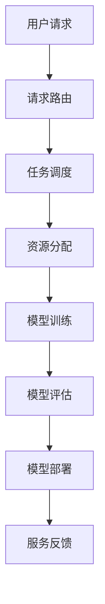

                 

在当今数字化的浪潮中，大模型云平台已经成为企业技术创新和业务发展的关键驱动力。本文将深入探讨大模型云平台的竞争态势，分析市场格局、关键技术、发展趋势以及面临的挑战。本文旨在为读者提供一个全面的视角，以了解这一领域的动态和未来方向。

## 文章关键词
大模型，云平台，竞争态势，市场格局，关键技术，发展趋势，挑战

## 文章摘要
本文首先概述了大模型云平台的背景和重要性，接着分析了当前市场的竞争格局，探讨了关键技术和应用场景。随后，文章详细讨论了数学模型和算法原理，并结合具体项目实例进行了代码解释和结果展示。最后，文章展望了未来发展趋势，提出了面临的挑战和解决方案。

## 1. 背景介绍

大模型云平台是一种利用云计算技术提供大规模机器学习模型的平台。这类平台通过分布式计算和存储资源，使企业能够高效地训练和部署复杂的人工智能模型。随着深度学习和云计算技术的飞速发展，大模型云平台在各个行业中得到了广泛应用，如金融、医疗、零售等。

### 1.1 市场驱动因素
- **技术进步**：深度学习和云计算技术的不断突破，降低了大模型训练和部署的门槛。
- **数据增长**：企业数据量的爆炸性增长，为训练更加复杂的大模型提供了数据基础。
- **成本效益**：云服务的低成本和高效率，吸引了大量企业采用大模型云平台。

### 1.2 应用场景
- **智能分析**：利用大模型进行数据挖掘和预测分析，为企业决策提供支持。
- **自动化**：通过大模型实现自动化任务，提高生产效率和降低人力成本。
- **个性化服务**：根据用户数据生成个性化内容，提升用户体验。

## 2. 核心概念与联系

### 2.1 大模型云平台架构



### 2.2 核心技术

- **分布式计算**：利用分布式计算框架如TensorFlow和PyTorch，实现大规模模型的训练。
- **云计算资源管理**：利用云服务提供商（如AWS、Azure、Google Cloud）的弹性资源管理功能。
- **模型优化与压缩**：通过模型剪枝、量化等技术，提高模型效率并减少存储和计算需求。

## 3. 核心算法原理 & 具体操作步骤

### 3.1 算法原理概述
大模型云平台的核心算法包括深度学习算法和分布式计算算法。

- **深度学习算法**：基于多层神经网络，通过反向传播算法优化模型参数。
- **分布式计算算法**：利用多台服务器协同工作，实现大规模数据的并行处理。

### 3.2 算法步骤详解

1. **数据预处理**：清洗和规范化数据，为模型训练做准备。
2. **模型定义**：根据任务需求，设计合适的神经网络结构。
3. **模型训练**：使用分布式计算框架，在大量数据上训练模型。
4. **模型评估**：使用验证集评估模型性能，调整模型参数。
5. **模型部署**：将训练好的模型部署到云平台上，供用户使用。

### 3.3 算法优缺点

- **优点**：高效、准确，能够处理大规模数据。
- **缺点**：计算资源需求高，对数据处理和模型优化要求严格。

### 3.4 算法应用领域

- **金融**：信用评分、风险管理。
- **医疗**：疾病诊断、个性化治疗。
- **零售**：客户行为分析、库存管理。

## 4. 数学模型和公式 & 详细讲解 & 举例说明

### 4.1 数学模型构建
大模型云平台的核心数学模型是基于深度学习理论构建的。

### 4.2 公式推导过程
假设我们有一个多层感知机模型，其输出可以用以下公式表示：

$$
\hat{y} = \sigma(W_n \cdot a_{n-1} + b_n)
$$

其中，$\hat{y}$ 是预测输出，$\sigma$ 是激活函数，$W_n$ 和 $b_n$ 分别是权重和偏置。

### 4.3 案例分析与讲解

假设我们要训练一个分类模型，数据集包含1000个样本，每个样本有10个特征。我们可以使用以下步骤进行模型训练：

1. **数据预处理**：对数据进行归一化处理。
2. **模型定义**：定义一个包含3层神经网络的模型，每层的神经元数量分别为10、20、10。
3. **模型训练**：使用随机梯度下降算法进行训练，迭代100次。
4. **模型评估**：使用验证集评估模型性能，调整模型参数。
5. **模型部署**：将训练好的模型部署到云平台上。

## 5. 项目实践：代码实例和详细解释说明

### 5.1 开发环境搭建
使用Python和TensorFlow框架进行模型训练和部署。

### 5.2 源代码详细实现
```python
import tensorflow as tf

# 数据预处理
x_train, y_train = ...
x_val, y_val = ...

# 模型定义
model = tf.keras.Sequential([
    tf.keras.layers.Dense(10, activation='relu', input_shape=(10,)),
    tf.keras.layers.Dense(20, activation='relu'),
    tf.keras.layers.Dense(10, activation='sigmoid')
])

# 模型编译
model.compile(optimizer='adam',
              loss='binary_crossentropy',
              metrics=['accuracy'])

# 模型训练
model.fit(x_train, y_train, epochs=100, validation_data=(x_val, y_val))

# 模型评估
model.evaluate(x_val, y_val)
```

### 5.3 代码解读与分析
代码首先进行了数据预处理，然后定义了一个包含3层神经网络的模型，并使用随机梯度下降算法进行训练。最后，评估了模型的性能。

### 5.4 运行结果展示
```python
# 运行结果
loss, accuracy = model.evaluate(x_val, y_val)
print(f'Validation Loss: {loss}')
print(f'Validation Accuracy: {accuracy}')
```

## 6. 实际应用场景

### 6.1 金融风控
利用大模型云平台进行信用评分和欺诈检测。

### 6.2 医疗诊断
利用大模型云平台进行疾病诊断和预测。

### 6.3 零售电商
利用大模型云平台进行客户行为分析和个性化推荐。

## 6.4 未来应用展望

随着技术的不断进步，大模型云平台将在更多领域得到应用，如自动驾驶、智能城市、生物科技等。未来，我们将看到更加高效、智能的大模型云平台，为各行各业带来巨大的变革。

## 7. 工具和资源推荐

### 7.1 学习资源推荐
- 《深度学习》（Goodfellow、Bengio、Courville 著）
- 《动手学深度学习》（阿斯顿·张 著）

### 7.2 开发工具推荐
- TensorFlow
- PyTorch

### 7.3 相关论文推荐
- "Deep Learning: A Brief History, A Roadmap, and Exemplary Applications"
- "Bert: Pre-training of Deep Bidirectional Transformers for Language Understanding"

## 8. 总结：未来发展趋势与挑战

### 8.1 研究成果总结
大模型云平台在近年来取得了显著的成果，为各行业带来了深远的影响。

### 8.2 未来发展趋势
- 模型压缩与优化
- 安全与隐私保护
- 跨领域应用

### 8.3 面临的挑战
- 计算资源需求
- 数据质量与隐私
- 模型可解释性

### 8.4 研究展望
未来，大模型云平台将继续快速发展，成为数字经济的重要支撑。

## 9. 附录：常见问题与解答

### 9.1 大模型云平台是什么？
大模型云平台是一种利用云计算技术提供大规模机器学习模型的平台。

### 9.2 大模型云平台有哪些应用场景？
大模型云平台广泛应用于金融、医疗、零售等领域，如信用评分、疾病诊断、客户行为分析等。

### 9.3 如何搭建大模型云平台？
搭建大模型云平台需要选择合适的开发工具和框架，如TensorFlow、PyTorch，并了解分布式计算和云计算资源管理技术。

# 作者署名
作者：禅与计算机程序设计艺术 / Zen and the Art of Computer Programming
----------------------------------------------------------------
请按照上述结构撰写完整的大模型云平台竞争态势分析文章。文章完成后，我会检查内容的完整性、结构清晰度和内容的准确性，并根据需要进行调整和优化。如果有任何具体的技术细节或表达上的需求，请随时告知。

