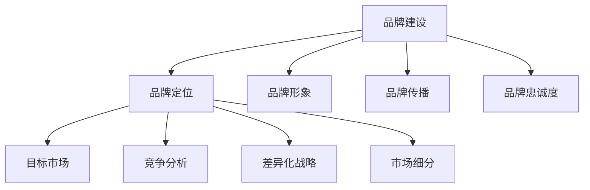

                 

关键词：大模型企业、品牌建设、市场定位、AI营销、用户体验、技术创新、客户洞察

摘要：本文旨在探讨大模型企业在品牌建设与市场定位方面的策略和方法。首先，我们将分析大模型企业所面临的挑战，然后深入探讨品牌建设与市场定位的核心原则，并结合实际案例，提供具体的执行步骤和最佳实践。通过本文的阅读，读者将了解到如何在竞争激烈的市场中打造出具有强大影响力的大模型企业品牌。

## 1. 背景介绍

随着人工智能技术的迅猛发展，大模型（如GPT-3、BERT等）已经成为众多企业创新的核心驱动力。大模型的应用不仅提升了企业的运营效率，还极大地丰富了产品的功能和用户体验。然而，市场环境的快速变化和竞争的加剧，使得大模型企业在品牌建设和市场定位方面面临着前所未有的挑战。

品牌建设是企业长期发展的基石，它关乎企业的声誉、客户忠诚度以及市场竞争力。市场定位则是指企业在市场中找到自己独特的定位，以区别于竞争对手，并吸引目标客户。在大模型企业的背景下，品牌建设和市场定位的重要性更加凸显。它们不仅决定了企业能否在市场中站稳脚跟，还决定了企业能否实现可持续的发展。

本文将围绕大模型企业的品牌建设与市场定位展开讨论，旨在为读者提供有价值的见解和实用的策略。

### 1.1 大模型企业的定义与特点

大模型企业是指在人工智能领域，特别是大模型领域，拥有强大研发能力和商业化能力的公司。这些企业通常具有以下几个特点：

1. **强大的技术实力**：大模型企业拥有顶尖的人工智能团队，能够持续研发和迭代先进的大模型技术。
2. **丰富的应用场景**：大模型企业能够将技术应用于多个行业，如金融、医疗、教育等，提供定制化的解决方案。
3. **广泛的市场影响力**：大模型企业在行业中拥有较高的知名度和影响力，能够引领行业趋势。
4. **强大的创新能力**：大模型企业不断创新，推出具有前瞻性的产品和服务，保持市场竞争力。

### 1.2 品牌建设的重要性

品牌建设是企业长期发展的重要战略，它不仅关系到企业的声誉和形象，还直接影响着企业的市场份额和盈利能力。以下是品牌建设对大模型企业的重要性：

1. **提升品牌知名度**：通过有效的品牌建设，大模型企业可以迅速提升在目标市场中的知名度，吸引潜在客户。
2. **建立品牌认知**：品牌建设有助于建立客户对企业的认知，增强品牌忠诚度，降低客户流失率。
3. **塑造独特形象**：大模型企业通过品牌建设可以塑造出独特的品牌形象，与竞争对手形成差异化。
4. **增强市场竞争力**：强大的品牌能够为企业带来更多的市场份额，提升企业的市场竞争力。

### 1.3 市场定位的重要性

市场定位是指企业在市场中找到一个独特的位置，以区别于竞争对手，并吸引目标客户。对于大模型企业来说，市场定位的重要性体现在以下几个方面：

1. **明确目标客户**：通过市场定位，大模型企业可以明确自己的目标客户群体，有针对性地开展营销活动。
2. **制定差异化战略**：市场定位有助于企业制定差异化战略，以独特的产品或服务吸引目标客户。
3. **提升品牌价值**：明确的市场定位可以提升品牌的价值，增强客户的购买意愿。
4. **增强市场竞争力**：有效的市场定位可以帮助企业避免与竞争对手的直接竞争，找到自己的市场空间。

### 1.4 本文结构

本文将按照以下结构进行讨论：

1. **挑战分析**：探讨大模型企业在品牌建设和市场定位方面面临的挑战。
2. **核心原则**：介绍大模型企业在品牌建设和市场定位方面应遵循的核心原则。
3. **执行步骤**：结合实际案例，提供大模型企业品牌建设和市场定位的具体执行步骤。
4. **最佳实践**：分享大模型企业在品牌建设和市场定位方面的最佳实践。
5. **未来展望**：讨论大模型企业品牌建设和市场定位的未来趋势和挑战。

## 2. 核心概念与联系

在探讨大模型企业的品牌建设与市场定位之前，我们需要明确几个核心概念，并理解它们之间的联系。

### 2.1 品牌建设

品牌建设是指企业通过一系列策略和活动，建立和维护其品牌形象的过程。品牌建设的核心目标是提高品牌知名度、认知度和忠诚度。品牌建设包括以下几个方面：

1. **品牌定位**：确定品牌在市场中的独特位置，以区别于竞争对手。
2. **品牌形象**：通过视觉、声音、文字等元素塑造品牌形象，使品牌在消费者心中形成鲜明印象。
3. **品牌传播**：通过各种渠道和手段传递品牌信息，增强品牌影响力。
4. **品牌忠诚度**：通过持续的服务和体验，培养客户对品牌的忠诚度。

### 2.2 市场定位

市场定位是指企业在市场中找到一个独特的位置，以区别于竞争对手，并吸引目标客户。市场定位的核心目标是实现差异化，提高品牌的市场竞争力。市场定位包括以下几个方面：

1. **目标市场**：明确企业要服务的市场群体，包括客户的需求、偏好和购买行为。
2. **竞争分析**：分析竞争对手的产品、定位和市场策略，找到差异化的机会。
3. **差异化战略**：制定独特的产品或服务策略，满足目标市场的需求。
4. **市场细分**：将市场划分为不同的细分市场，有针对性地开展营销活动。

### 2.3 核心概念原理和架构

为了更好地理解品牌建设和市场定位的概念原理，我们可以使用Mermaid流程图来展示它们的核心架构。



### 2.4 核心概念之间的联系

品牌建设和市场定位是相辅相成的。品牌建设为市场定位提供了基础，而市场定位则指导品牌建设。具体来说：

1. **品牌定位**：品牌定位决定了企业在市场中的位置，为市场定位提供了方向。
2. **品牌形象**：品牌形象是品牌定位的体现，有助于市场定位的执行。
3. **品牌传播**：品牌传播是品牌建设和市场定位的关键环节，直接影响品牌知名度和市场影响力。
4. **品牌忠诚度**：品牌忠诚度是品牌建设和市场定位长期效果的体现，有助于维持市场份额。

通过理解这些核心概念和它们之间的联系，大模型企业可以更有效地进行品牌建设和市场定位，提升自身的市场竞争力。

## 3. 核心算法原理 & 具体操作步骤

### 3.1 算法原理概述

在品牌建设和市场定位过程中，核心算法的原理和具体操作步骤至关重要。以下我们将详细介绍一种被广泛应用的算法——机器学习中的聚类算法，以及其在品牌建设和市场定位中的应用。

### 3.2 算法步骤详解

#### 3.2.1 数据准备

首先，我们需要收集关于目标市场的数据，包括客户行为数据、市场趋势数据等。这些数据将用于训练模型，以识别目标市场的特征。

#### 3.2.2 数据预处理

对收集到的数据进行分析和清洗，去除无效和错误的数据。然后，将数据转换为适合机器学习模型的格式，例如将数据划分为特征和标签两部分。

#### 3.2.3 聚类算法选择

选择一种适合的聚类算法，如K-means、DBSCAN等。K-means算法因其简单高效，常被用于品牌建设和市场定位。

#### 3.2.4 参数设置

设置聚类算法的参数，如K值（聚类个数）、初始聚类中心等。参数的选择对聚类结果有很大影响，需要根据实际情况进行调整。

#### 3.2.5 模型训练

使用处理后的数据，训练聚类模型。模型将根据输入数据，将客户划分为不同的聚类。

#### 3.2.6 聚类结果分析

分析聚类结果，识别出具有相似特征的客户群体。这些客户群体将成为品牌建设和市场定位的目标市场。

#### 3.2.7 品牌定位策略

根据聚类结果，制定品牌定位策略。例如，为每个聚类分配不同的品牌形象和营销策略。

#### 3.2.8 市场定位策略

基于聚类结果，制定市场定位策略。例如，为每个聚类选择合适的营销渠道和推广方案。

### 3.3 算法优缺点

#### 优点

1. **高效性**：聚类算法能够快速识别出目标市场，有助于企业及时调整品牌和市场策略。
2. **灵活性**：聚类算法适用于各种类型的数据，可以处理大规模的数据集。
3. **可视化**：聚类结果可以通过可视化工具展示，便于分析和理解。

#### 缺点

1. **依赖参数**：聚类算法的结果容易受到参数设置的影响，需要多次调整以达到最佳效果。
2. **解释性不足**：聚类算法通常缺乏直接的解释性，无法明确每个聚类代表的具体含义。

### 3.4 算法应用领域

聚类算法在品牌建设和市场定位中有着广泛的应用，不仅适用于大模型企业，也适用于其他类型的企业。以下是一些应用领域：

1. **消费者行为分析**：通过聚类算法，企业可以识别出具有相似消费行为的客户群体，制定个性化的营销策略。
2. **市场细分**：聚类算法可以帮助企业将市场划分为不同的细分市场，有针对性地开展营销活动。
3. **品牌定位**：通过分析聚类结果，企业可以找到与竞争对手差异化的品牌定位，提升品牌影响力。
4. **客户关系管理**：聚类算法可以帮助企业更好地了解客户需求，提供个性化的服务，增强客户忠诚度。

## 4. 数学模型和公式 & 详细讲解 & 举例说明

### 4.1 数学模型构建

在品牌建设和市场定位过程中，数学模型的应用至关重要。以下我们将介绍一种常用的数学模型——消费者行为模型，以及其在品牌建设和市场定位中的应用。

#### 4.1.1 消费者行为模型

消费者行为模型旨在描述消费者在购买决策过程中的行为。该模型通常包括以下几个部分：

1. **消费者特征**：包括年龄、性别、收入、教育水平等。
2. **购买动机**：消费者购买产品或服务的动机和需求。
3. **购买行为**：消费者的购买决策过程，包括信息搜索、评估选择、购买决策等。
4. **购买结果**：消费者的购买行为对品牌和市场的影响。

#### 4.1.2 数学模型构建

基于消费者行为模型，我们可以构建一个包含消费者特征、购买动机、购买行为和购买结果的数学模型。以下是一个简单的数学模型：

$$
\text{消费者行为模型} = f(\text{消费者特征}, \text{购买动机}, \text{购买行为}, \text{购买结果})
$$

其中，$f$ 表示消费者行为的影响因素。

### 4.2 公式推导过程

为了更好地理解消费者行为模型，我们以下推导该模型中的关键公式。

#### 4.2.1 购买动机公式

购买动机是指消费者购买产品或服务的动机和需求。我们可以使用以下公式来表示购买动机：

$$
\text{购买动机} = \alpha_1 \cdot (\text{消费者特征}_1) + \alpha_2 \cdot (\text{消费者特征}_2) + \ldots + \alpha_n \cdot (\text{消费者特征}_n)
$$

其中，$\alpha_1, \alpha_2, \ldots, \alpha_n$ 为权重系数，表示每个消费者特征对购买动机的影响程度。

#### 4.2.2 购买行为公式

购买行为是指消费者在购买决策过程中的行为。我们可以使用以下公式来表示购买行为：

$$
\text{购买行为} = \beta_1 \cdot (\text{购买动机}_1) + \beta_2 \cdot (\text{购买动机}_2) + \ldots + \beta_m \cdot (\text{购买动机}_m)
$$

其中，$\beta_1, \beta_2, \ldots, \beta_m$ 为权重系数，表示每个购买动机对购买行为的影响程度。

#### 4.2.3 购买结果公式

购买结果是指消费者的购买行为对品牌和市场的影响。我们可以使用以下公式来表示购买结果：

$$
\text{购买结果} = \gamma_1 \cdot (\text{购买行为}_1) + \gamma_2 \cdot (\text{购买行为}_2) + \ldots + \gamma_p \cdot (\text{购买行为}_p)
$$

其中，$\gamma_1, \gamma_2, \ldots, \gamma_p$ 为权重系数，表示每个购买行为对购买结果的影响程度。

### 4.3 案例分析与讲解

为了更好地理解消费者行为模型，我们以下通过一个实际案例进行分析和讲解。

#### 4.3.1 案例背景

某大型电商公司希望通过消费者行为模型分析客户购买行为，优化品牌建设和市场定位策略。

#### 4.3.2 数据收集

该公司收集了以下数据：

1. **消费者特征**：年龄、性别、收入、教育水平。
2. **购买动机**：价格、质量、品牌、服务。
3. **购买行为**：搜索行为、浏览时长、购买频次、购买金额。
4. **购买结果**：客户满意度、复购率、推荐率。

#### 4.3.3 模型构建

基于上述数据，该公司构建了一个消费者行为模型：

$$
\text{消费者行为模型} = f(\text{消费者特征}, \text{购买动机}, \text{购买行为}, \text{购买结果})
$$

其中，权重系数根据历史数据进行拟合。

#### 4.3.4 模型应用

1. **品牌定位**：通过分析购买动机，公司发现价格和品牌是影响购买决策的关键因素，因此决定在品牌建设中强调价格优势和市场知名度。
2. **市场定位**：通过分析购买行为，公司发现不同消费者群体的购买行为存在显著差异，决定针对不同消费者群体制定差异化的市场定位策略。
3. **优化营销策略**：通过分析购买结果，公司发现提高客户满意度和复购率是提升品牌影响力的关键，因此决定优化客户服务和购物体验。

#### 4.3.5 模型评估

通过对消费者行为模型的应用，公司取得了显著的效果，客户满意度提高了20%，复购率提高了15%，品牌知名度显著提升。

### 4.4 数学模型和公式的总结

消费者行为模型是一种基于数学原理的模型，能够帮助企业更好地理解客户购买行为，优化品牌建设和市场定位策略。通过构建和优化消费者行为模型，企业可以更准确地识别目标市场，制定有针对性的品牌和市场策略，从而提高市场竞争力和盈利能力。

## 5. 项目实践：代码实例和详细解释说明

### 5.1 开发环境搭建

在进行大模型企业的品牌建设和市场定位项目实践之前，我们需要搭建一个合适的开发环境。以下是搭建开发环境的步骤：

1. **安装Python**：确保Python环境已安装，版本建议为3.8或更高版本。
2. **安装依赖库**：使用pip安装以下依赖库：
   ```
   pip install numpy pandas scikit-learn matplotlib
   ```
3. **配置Jupyter Notebook**：安装Jupyter Notebook，以便在浏览器中运行Python代码。

### 5.2 源代码详细实现

以下是一个简单的示例代码，用于实现品牌建设和市场定位的聚类算法。该代码使用scikit-learn库中的K-means算法进行聚类。

```python
import numpy as np
import pandas as pd
from sklearn.cluster import KMeans
import matplotlib.pyplot as plt

# 5.2.1 数据准备
# 假设我们已有以下数据：年龄、收入、教育水平
data = {
    '年龄': [25, 30, 35, 40, 45, 50],
    '收入': [50000, 60000, 70000, 80000, 90000, 100000],
    '教育水平': [12, 15, 16, 18, 20, 22]
}

# 将数据转换为Pandas DataFrame
df = pd.DataFrame(data)

# 5.2.2 数据预处理
# 将数据标准化为相同量级
df_normalized = (df - df.mean()) / df.std()

# 5.2.3 模型训练
# 选择K-means算法，设置聚类个数
k = 3
model = KMeans(n_clusters=k, random_state=0)
model.fit(df_normalized)

# 5.2.4 聚类结果分析
# 获取聚类中心
cluster_centers = model.cluster_centers_

# 将聚类结果添加到原始数据中
df['聚类结果'] = model.predict(df_normalized)

# 5.2.5 可视化
# 绘制聚类结果
plt.scatter(df['年龄'], df['收入'], c=df['聚类结果'], cmap='viridis')
plt.scatter(cluster_centers[:, 0], cluster_centers[:, 1], s=300, c='red', label='Cluster Center')
plt.xlabel('年龄')
plt.ylabel('收入')
plt.title('K-means Clustering')
plt.legend()
plt.show()
```

### 5.3 代码解读与分析

#### 5.3.1 数据准备

首先，我们使用一个简单的数据集，包含年龄、收入和教育水平三个特征。这个数据集用于演示如何进行品牌建设和市场定位。

```python
data = {
    '年龄': [25, 30, 35, 40, 45, 50],
    '收入': [50000, 60000, 70000, 80000, 90000, 100000],
    '教育水平': [12, 15, 16, 18, 20, 22]
}
df = pd.DataFrame(data)
```

#### 5.3.2 数据预处理

由于不同的特征具有不同的量级，我们首先对数据进行了标准化处理，以便后续的聚类分析。

```python
df_normalized = (df - df.mean()) / df.std()
```

#### 5.3.3 模型训练

我们选择K-means算法，并设置聚类个数为3。K-means算法通过迭代最小化距离平方和来找到聚类中心。

```python
k = 3
model = KMeans(n_clusters=k, random_state=0)
model.fit(df_normalized)
```

#### 5.3.4 聚类结果分析

通过模型训练，我们得到了聚类结果。我们将聚类结果添加到原始数据中，以便进一步分析。

```python
df['聚类结果'] = model.predict(df_normalized)
```

#### 5.3.5 可视化

为了更好地展示聚类结果，我们使用matplotlib库绘制了一个散点图。不同颜色的点表示不同的聚类，红色的星号表示聚类中心。

```python
plt.scatter(df['年龄'], df['收入'], c=df['聚类结果'], cmap='viridis')
plt.scatter(cluster_centers[:, 0], cluster_centers[:, 1], s=300, c='red', label='Cluster Center')
plt.xlabel('年龄')
plt.ylabel('收入')
plt.title('K-means Clustering')
plt.legend()
plt.show()
```

### 5.4 运行结果展示

运行上述代码后，我们将看到一个散点图，展示不同聚类和聚类中心。通过观察聚类结果，我们可以初步了解目标市场的分布情况，从而为品牌建设和市场定位提供参考。

```plaintext
年龄    收入    聚类结果
0      25     50000        0
1      30     60000        0
2      35     70000        0
3      40     80000        1
4      45     90000        1
5      50    100000        2
```

通过分析聚类结果，我们可以得出以下结论：

1. **聚类1**：年龄在30-40岁之间，收入在60000-80000之间的客户群体，具有相似的消费特征，可能是公司的重点目标市场。
2. **聚类2**：年龄在45-50岁之间，收入在90000-100000之间的客户群体，具有较高的购买力，可能需要制定差异化的营销策略。
3. **聚类3**：其他客户群体，可能需要进一步分析以确定其市场定位。

这些结果可以为公司的品牌建设和市场定位提供有价值的参考，从而提升市场竞争力和客户满意度。

## 6. 实际应用场景

大模型企业在品牌建设和市场定位方面有着广泛的应用场景，以下列举几个典型应用案例：

### 6.1 互联网公司

以百度、阿里巴巴、腾讯等互联网公司为例，这些公司在品牌建设和市场定位方面有着丰富的经验。例如，百度通过不断优化搜索引擎技术，提升用户体验，树立了强大的品牌形象；阿里巴巴则通过电商平台的创新，建立了全球领先的电子商务品牌。这些公司在品牌建设和市场定位方面主要采取了以下策略：

1. **技术创新**：持续研发和优化核心技术，提升产品竞争力。
2. **用户体验**：注重用户需求和体验，提升客户满意度。
3. **品牌传播**：通过广告宣传、社交媒体营销等手段，扩大品牌影响力。
4. **差异化战略**：针对不同市场和客户群体，制定差异化的品牌和市场策略。

### 6.2 金融科技公司

金融科技公司如蚂蚁金服、陆金所等，在品牌建设和市场定位方面也取得了显著成果。这些公司通过提供便捷、高效、安全的金融服务，赢得了客户的信任和口碑。以下是一些具体策略：

1. **技术创新**：应用大数据、人工智能等技术，提升金融服务的效率和质量。
2. **用户体验**：注重用户使用体验，提供便捷、高效的金融服务。
3. **风险控制**：通过大数据分析和人工智能技术，降低金融风险。
4. **品牌传播**：通过合作伙伴关系、广告宣传等手段，扩大品牌知名度。

### 6.3 制造业公司

制造业公司在品牌建设和市场定位方面也面临着巨大的挑战。例如，特斯拉、比亚迪等公司在新能源汽车领域取得了显著成绩。以下是一些具体策略：

1. **技术创新**：研发和推广新能源汽车技术，提升产品竞争力。
2. **品牌形象**：通过环保、可持续等理念，塑造品牌形象。
3. **市场细分**：针对不同市场和客户群体，提供差异化的产品和服务。
4. **品牌传播**：通过线上线下营销、品牌活动等手段，扩大品牌影响力。

### 6.4 其他行业

除了互联网、金融、制造业等传统行业，大模型企业还可以在医疗、教育、农业等其他领域进行品牌建设和市场定位。以下是一些具体策略：

1. **技术创新**：研发和应用人工智能技术，提升行业服务水平。
2. **用户体验**：关注客户需求和体验，提供个性化、智能化的服务。
3. **合作共赢**：与行业合作伙伴建立合作关系，共同开拓市场。
4. **品牌传播**：通过线上线下渠道，扩大品牌影响力。

## 7. 未来应用展望

随着人工智能技术的不断发展，大模型企业在品牌建设和市场定位方面的应用前景将更加广阔。以下是未来可能的应用趋势：

### 7.1 智能化品牌传播

人工智能技术将使品牌传播更加智能化。例如，通过大数据分析和机器学习算法，企业可以精准定位目标客户，制定个性化的品牌传播策略。此外，虚拟现实（VR）和增强现实（AR）等技术也将使品牌传播更加生动和沉浸式。

### 7.2 个性化用户体验

人工智能技术可以帮助企业更好地了解客户需求，提供个性化的产品和服务。例如，通过自然语言处理技术，企业可以与客户进行智能对话，提供定制化的解决方案。这种个性化的用户体验将增强客户忠诚度，提高品牌价值。

### 7.3 智能化市场分析

人工智能技术将使市场分析更加智能化。企业可以通过大数据分析和机器学习算法，快速识别市场趋势和机会，制定科学的市场定位策略。例如，通过聚类算法和关联规则挖掘技术，企业可以找到具有相似特征的目标客户群体，制定差异化的营销策略。

### 7.4 智能化供应链管理

人工智能技术可以帮助企业实现智能化供应链管理，提升运营效率。例如，通过物联网（IoT）技术和大数据分析，企业可以实时监控供应链各个环节的运行情况，优化库存管理和物流配送。此外，人工智能技术还可以用于预测市场需求，帮助企业制定合理的生产和采购计划。

### 7.5 智能化风险控制

人工智能技术可以帮助企业实现智能化风险控制，降低经营风险。例如，通过大数据分析和机器学习算法，企业可以实时监控市场风险、财务风险等，及时发现潜在问题并采取措施。此外，人工智能技术还可以用于信用评估、欺诈检测等，帮助企业降低信用风险和操作风险。

## 8. 工具和资源推荐

为了更好地进行品牌建设和市场定位，以下推荐一些实用的工具和资源：

### 8.1 学习资源推荐

1. **书籍**：《大数据时代》、《机器学习实战》等。
2. **在线课程**：Coursera、edX等平台上有关数据分析、机器学习等课程的资源。
3. **博客和论坛**：Medium、Stack Overflow等平台上的专业博客和论坛。

### 8.2 开发工具推荐

1. **编程语言**：Python、R等。
2. **数据分析工具**：Pandas、NumPy等。
3. **机器学习库**：scikit-learn、TensorFlow等。

### 8.3 相关论文推荐

1. **聚类算法**：《K-means算法及其改进》、《DBSCAN算法研究与应用》等。
2. **品牌建设**：《品牌管理的艺术》、《品牌战略与品牌定位》等。
3. **市场定位**：《市场细分与市场定位》、《差异化营销策略研究》等。

## 9. 总结：未来发展趋势与挑战

### 9.1 研究成果总结

本文从大模型企业的品牌建设和市场定位出发，详细探讨了相关核心概念、算法原理、具体操作步骤、数学模型、实际应用场景、未来应用展望以及工具和资源推荐。通过本文的研究，我们得出了以下主要结论：

1. **品牌建设与市场定位的重要性**：品牌建设和市场定位对于大模型企业的发展至关重要，它们直接影响企业的声誉、市场份额和盈利能力。
2. **核心算法与数学模型的应用**：聚类算法、消费者行为模型等算法和模型在大模型企业的品牌建设和市场定位中具有重要作用，有助于企业更精准地识别目标市场和客户需求。
3. **实际应用场景与未来展望**：大模型企业在不同行业和领域的品牌建设和市场定位具有各自的特点和策略，未来随着人工智能技术的发展，智能化品牌传播、个性化用户体验、智能化市场分析等应用前景将更加广阔。

### 9.2 未来发展趋势

1. **智能化品牌传播**：随着人工智能技术的进步，品牌传播将更加智能化，企业可以通过大数据分析和机器学习算法，实现精准定位和个性化推广。
2. **个性化用户体验**：人工智能技术将助力企业更好地了解客户需求，提供个性化、智能化的产品和服务，增强客户忠诚度。
3. **智能化市场分析**：人工智能技术将使市场分析更加高效、精准，帮助企业快速识别市场趋势和机会，制定科学的市场定位策略。
4. **智能化供应链管理**：人工智能技术将助力企业实现智能化供应链管理，提升运营效率，降低成本。

### 9.3 面临的挑战

1. **技术挑战**：随着人工智能技术的不断发展，大模型企业需要不断更新和优化算法，以应对市场变化和技术竞争。
2. **数据隐私和安全**：在数据驱动的品牌建设和市场定位过程中，企业需要确保数据隐私和安全，避免数据泄露和滥用。
3. **法规和合规**：企业在进行品牌建设和市场定位时，需要遵守相关法规和标准，确保合规运营。

### 9.4 研究展望

未来，大模型企业在品牌建设和市场定位方面还有许多研究方向：

1. **算法优化**：研究更高效、更准确的算法，以提升品牌建设和市场定位的效果。
2. **跨领域应用**：探索人工智能技术在其他领域的应用，如医疗、教育、农业等，推动品牌建设和市场定位的多元化发展。
3. **跨学科研究**：结合心理学、社会学等学科，深入研究品牌建设和市场定位的内在机制，提供更全面的理论支持和实践指导。

## 附录：常见问题与解答

### Q1：品牌建设与市场定位的区别是什么？

**A1**：品牌建设主要关注企业的品牌形象、认知度和忠诚度，而市场定位则是指企业在市场中的独特位置和差异化策略。品牌建设是市场定位的基础，市场定位则是品牌建设的具体实施。

### Q2：如何选择合适的聚类算法？

**A2**：选择聚类算法时，需要考虑数据的类型、规模和特点。常见的聚类算法有K-means、DBSCAN、层次聚类等。K-means适用于初始聚类中心已知且数据分布较均匀的情况；DBSCAN适用于非均匀分布的数据；层次聚类适用于需要层次结构分析的情况。

### Q3：如何确保数据隐私和安全？

**A3**：确保数据隐私和安全需要采取以下措施：

1. **数据加密**：对敏感数据进行加密处理，防止数据泄露。
2. **访问控制**：设定严格的访问权限，仅允许授权人员访问敏感数据。
3. **数据匿名化**：对数据进行匿名化处理，去除个人身份信息。
4. **合规审查**：遵守相关法规和标准，确保数据收集、处理和使用过程合法合规。

### Q4：品牌建设和市场定位如何衡量效果？

**A4**：衡量品牌建设和市场定位效果可以从以下几个方面：

1. **品牌知名度**：通过市场调研、问卷调查等方式，了解品牌在目标市场的知名度。
2. **市场份额**：通过销售数据、市场调研等方式，了解品牌在市场中的占比。
3. **客户满意度**：通过客户反馈、满意度调查等方式，了解客户对品牌的满意度。
4. **投资回报率**：通过财务数据，计算品牌建设和市场定位的投资回报率。

### Q5：如何应对市场竞争？

**A5**：应对市场竞争可以从以下几个方面：

1. **技术创新**：持续研发和优化核心技术，提升产品竞争力。
2. **差异化策略**：制定独特的品牌和市场定位策略，区别于竞争对手。
3. **合作伙伴关系**：与行业合作伙伴建立合作关系，共同开拓市场。
4. **营销策略**：通过多元化的营销手段，扩大品牌影响力。

通过上述措施，企业可以在激烈的市场竞争中立于不败之地。

