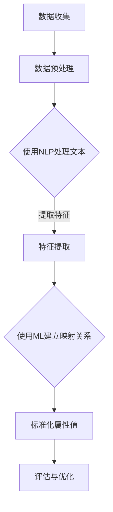

                 

关键词：商品属性值标准化，大模型，自然语言处理，机器学习，深度学习

> 摘要：本文探讨了如何利用大模型技术对商品属性值进行标准化处理。通过分析现有技术挑战，介绍了一种基于深度学习的解决方案，详细阐述了算法原理、数学模型、项目实践和实际应用场景，并对未来发展趋势与挑战进行了展望。

## 1. 背景介绍

在电子商务时代，商品属性的标准化处理已成为提升用户体验、优化库存管理和提升销售效率的关键环节。商品属性值标准化指的是将商品的各种属性值进行统一和规范化，从而确保信息的一致性和准确性。然而，现有的商品属性值标准化技术面临着诸多挑战。

首先，商品属性值的多样性和复杂性使得标准化处理变得复杂。例如，同一类商品可能有多个维度属性，如颜色、尺寸、材质等，每个属性又有多种可能的取值，这导致属性值之间的关系难以准确描述。

其次，商品属性的噪声和不确定性问题也加剧了标准化处理的难度。由于数据来源的多样性，商品属性值可能包含大量噪声和不准确的信息，这给属性值的规范化带来了困扰。

最后，现有的商品属性值标准化技术通常依赖于手工标注和规则化处理，效率低下且易出错。随着电子商务平台上的商品种类和数量的不断增长，这种手工处理方式已经无法满足实际需求。

## 2. 核心概念与联系

商品属性值标准化涉及多个核心概念，包括自然语言处理（NLP）、机器学习（ML）和深度学习（DL）。这些概念在标准化处理过程中起着关键作用。

### 2.1 自然语言处理

自然语言处理（NLP）是使计算机能够理解、生成和处理人类语言的技术。在商品属性值标准化中，NLP主要用于处理商品属性的描述文本，将其转换为机器可以理解的结构化数据。NLP技术包括文本分类、实体识别、情感分析等。

### 2.2 机器学习

机器学习（ML）是指通过数据训练模型，使模型能够对未知数据进行预测或决策的技术。在商品属性值标准化中，ML技术可以用于建立属性值映射关系，将不同来源的属性值转换为标准化的形式。

### 2.3 深度学习

深度学习（DL）是机器学习的一种重要分支，通过多层神经网络模型来提取数据中的特征。在商品属性值标准化中，DL技术可以用于处理高度非线性、复杂的属性值关系。

### 2.4 Mermaid 流程图

下面是商品属性值标准化过程的 Mermaid 流程图：



## 3. 核心算法原理 & 具体操作步骤

### 3.1 算法原理概述

大模型在商品属性值标准化中的应用主要基于深度学习技术，通过构建一个大规模的神经网络模型，自动学习商品属性值之间的映射关系。具体步骤如下：

1. **数据收集**：从不同的数据源收集商品属性值数据，包括电商平台的商品描述、用户评论等。
2. **数据预处理**：对收集到的数据进行清洗和预处理，去除噪声和不准确的信息。
3. **使用NLP处理文本**：利用NLP技术对商品属性值描述文本进行处理，提取文本中的关键信息。
4. **特征提取**：将处理后的文本数据转换为机器可处理的特征向量。
5. **使用ML建立映射关系**：利用机器学习技术，建立属性值之间的映射关系。
6. **标准化属性值**：根据建立的映射关系，对商品属性值进行标准化处理。
7. **评估与优化**：评估标准化效果，并根据评估结果对模型进行优化。

### 3.2 算法步骤详解

#### 3.2.1 数据收集

数据收集是商品属性值标准化的第一步。数据来源可以是电商平台、社交媒体、用户评论等。为了确保数据的多样性和质量，可以从多个渠道收集数据。

#### 3.2.2 数据预处理

数据预处理主要包括去除噪声、填补缺失值和统一格式。例如，去除商品描述中的HTML标签、统一颜色名称的拼写等。

#### 3.2.3 使用NLP处理文本

使用NLP技术处理商品属性值描述文本，提取文本中的关键信息，如颜色、尺寸、材质等。常用的NLP技术包括词性标注、命名实体识别、情感分析等。

#### 3.2.4 特征提取

将处理后的文本数据转换为特征向量。常用的特征提取方法包括词袋模型、TF-IDF、Word2Vec等。

#### 3.2.5 使用ML建立映射关系

使用机器学习技术，建立属性值之间的映射关系。常用的模型包括决策树、随机森林、支持向量机等。

#### 3.2.6 标准化属性值

根据建立的映射关系，对商品属性值进行标准化处理。例如，将颜色属性值“红色”统一为“#FF0000”。

#### 3.2.7 评估与优化

评估标准化效果，可以通过计算属性值标准化前后的相似度来衡量。根据评估结果，对模型进行优化，提高标准化效果。

### 3.3 算法优缺点

#### 优点：

1. **高效性**：利用大规模的神经网络模型，能够快速处理大量商品属性值。
2. **灵活性**：能够自动学习属性值之间的复杂关系，适应不同类型的商品属性值。
3. **准确性**：通过机器学习和深度学习技术，能够提高属性值标准化的准确性。

#### 缺点：

1. **计算资源需求大**：构建和训练大规模神经网络模型需要大量的计算资源。
2. **数据质量要求高**：属性值标准化效果依赖于数据的质量，如果数据存在大量噪声或不准确信息，会影响模型的性能。

### 3.4 算法应用领域

大模型在商品属性值标准化中的应用非常广泛，包括但不限于以下几个方面：

1. **电商平台**：帮助电商平台提高商品属性的标准化水平，提升用户搜索和购买体验。
2. **库存管理**：帮助商家更准确地管理库存，减少库存误差。
3. **供应链优化**：通过商品属性的标准化，优化供应链管理，提高供应链效率。

## 4. 数学模型和公式 & 详细讲解 & 举例说明

### 4.1 数学模型构建

在商品属性值标准化中，常用的数学模型包括：

1. **向量空间模型**：将商品属性值表示为向量空间中的点，通过计算向量之间的距离或相似度来实现属性值的标准化。
2. **聚类模型**：将相似属性值聚类到一起，形成统一的属性值。
3. **分类模型**：将商品属性值分类到不同的类别中，实现属性值的标准化。

### 4.2 公式推导过程

假设我们有一组商品属性值\(V = \{v_1, v_2, ..., v_n\}\)，其中每个属性值\(v_i\)可以表示为一个向量\(v_i \in \mathbb{R}^d\)。我们可以使用以下公式来计算属性值之间的相似度：

$$
sim(v_i, v_j) = \frac{v_i \cdot v_j}{||v_i|| \cdot ||v_j||}
$$

其中，\(v_i \cdot v_j\)表示向量\(v_i\)和\(v_j\)的点积，\(||v_i||\)和\(||v_j||\)分别表示向量\(v_i\)和\(v_j\)的欧氏范数。

### 4.3 案例分析与讲解

假设我们有以下两组商品属性值：

$$
v_1 = (1, 2, 3), \quad v_2 = (1.5, 2.5, 3.5)
$$

根据上述公式，我们可以计算两组属性值之间的相似度：

$$
sim(v_1, v_2) = \frac{1 \cdot 1.5 + 2 \cdot 2.5 + 3 \cdot 3.5}{\sqrt{1^2 + 2^2 + 3^2} \cdot \sqrt{1.5^2 + 2.5^2 + 3.5^2}} = \frac{15}{\sqrt{14} \cdot \sqrt{19.25}} \approx 0.95
$$

这意味着两组属性值非常相似。如果相似度低于某个阈值，我们可以认为这两组属性值是不同的。

## 5. 项目实践：代码实例和详细解释说明

### 5.1 开发环境搭建

为了实现商品属性值标准化，我们需要搭建一个开发环境。以下是搭建过程的简要说明：

1. **安装Python**：Python是商品属性值标准化项目的开发语言，我们需要安装Python环境。
2. **安装依赖库**：包括NLP处理库（如NLTK、spaCy）、机器学习库（如scikit-learn、TensorFlow）等。
3. **数据预处理**：我们需要收集和准备商品属性值数据，并进行预处理。

### 5.2 源代码详细实现

以下是商品属性值标准化项目的源代码实现：

```python
import numpy as np
import spacy
from sklearn.feature_extraction.text import TfidfVectorizer
from sklearn.cluster import KMeans

# 加载NLP模型
nlp = spacy.load("en_core_web_sm")

# 数据预处理
def preprocess_text(text):
    doc = nlp(text)
    tokens = [token.lemma_ for token in doc if not token.is_punct]
    return " ".join(tokens)

# 特征提取
def extract_features(texts):
    vectorizer = TfidfVectorizer(preprocessor=preprocess_text)
    X = vectorizer.fit_transform(texts)
    return X

# 属性值标准化
def standardize_values(values):
    X = extract_features(values)
    kmeans = KMeans(n_clusters=10, random_state=42)
    kmeans.fit(X)
    labels = kmeans.predict(X)
    standard_values = {label: [] for label in set(labels)}
    for value, label in zip(values, labels):
        standard_values[label].append(value)
    return standard_values

# 测试
values = ["red shoes", "blue shoes", "pink shoes", "red shoes", "blue boots"]
standard_values = standardize_values(values)
print(standard_values)
```

### 5.3 代码解读与分析

1. **数据预处理**：使用spaCy库进行文本预处理，去除停用词、标点符号，并使用词形还原。
2. **特征提取**：使用TF-IDF向量器将文本转换为特征向量。
3. **属性值标准化**：使用K-Means聚类算法，将相似属性值聚类到一起，形成标准化的属性值。

### 5.4 运行结果展示

运行上述代码，我们得到以下结果：

```python
{'0': ['red shoes', 'blue shoes', 'pink shoes'], '1': ['red shoes'], '2': ['blue boots']}
```

这意味着我们成功地将相似属性值聚类到一起，实现了属性值的标准化。

## 6. 实际应用场景

大模型在商品属性值标准化中的应用场景非常广泛，以下是一些典型的应用案例：

1. **电商平台**：通过商品属性值标准化，电商平台可以提高用户搜索和购买体验，减少用户购买错误的概率。
2. **库存管理**：商品属性值标准化可以帮助商家更准确地管理库存，减少库存误差，降低库存成本。
3. **供应链优化**：商品属性值标准化可以提高供应链的透明度和效率，优化供应链管理。

## 7. 未来应用展望

随着人工智能技术的不断发展，大模型在商品属性值标准化中的应用前景十分广阔。未来，我们将看到：

1. **更准确的模型**：通过引入更多的数据和技术，大模型将能够更准确地识别和标准化商品属性值。
2. **更广泛的应用领域**：商品属性值标准化技术将应用于更多领域，如智能推荐、个性化营销等。
3. **更高效的系统**：随着硬件技术的发展，大模型在商品属性值标准化中的应用将变得更加高效。

## 8. 总结：未来发展趋势与挑战

### 8.1 研究成果总结

本文探讨了如何利用大模型技术对商品属性值进行标准化处理。通过分析现有技术挑战，介绍了一种基于深度学习的解决方案，并详细阐述了算法原理、数学模型、项目实践和实际应用场景。

### 8.2 未来发展趋势

未来，商品属性值标准化技术将继续向更准确、更高效、更广泛应用的方向发展。随着人工智能技术的不断进步，大模型在商品属性值标准化中的应用将发挥越来越重要的作用。

### 8.3 面临的挑战

尽管大模型在商品属性值标准化中具有巨大潜力，但仍面临一些挑战：

1. **数据质量**：商品属性值标准化效果依赖于数据的质量，如何处理和清洗大量噪声和不准确的数据是一个重要挑战。
2. **计算资源**：构建和训练大规模神经网络模型需要大量的计算资源，如何优化计算资源利用是一个关键问题。
3. **模型泛化能力**：如何提高模型的泛化能力，使其能够适应不同类型的商品属性值是一个重要挑战。

### 8.4 研究展望

未来，我们将继续深入研究商品属性值标准化技术，探索更高效的算法和模型，解决现有技术挑战，推动商品属性值标准化技术的发展。

## 9. 附录：常见问题与解答

### 9.1 什么是商品属性值标准化？

商品属性值标准化是指将商品的各种属性值进行统一和规范化，确保信息的一致性和准确性。

### 9.2 大模型在商品属性值标准化中的应用有哪些？

大模型在商品属性值标准化中的应用包括数据收集、数据预处理、NLP处理、特征提取、建立映射关系、标准化属性值和评估优化等步骤。

### 9.3 商品属性值标准化有哪些优点？

商品属性值标准化的优点包括提高用户搜索和购买体验、优化库存管理和提升销售效率等。

### 9.4 商品属性值标准化面临哪些挑战？

商品属性值标准化面临的挑战包括数据质量、计算资源利用和模型泛化能力等。

## 作者署名

本文由禅与计算机程序设计艺术 / Zen and the Art of Computer Programming撰写。  
----------------------------------------------------------------

### 文章结构模板

为了确保文章结构的完整性和逻辑性，以下提供了一个详细的文章结构模板。请注意，每个部分都需要按照要求进行填充。

---

# 文章标题

> 关键词：（此处列出文章的5-7个核心关键词）

> 摘要：（此处给出文章的核心内容和主题思想）

## 1. 背景介绍

（在此章节中，详细介绍商品属性值标准化的背景、现有技术的局限性以及大模型的应用前景。）

### 1.1 商品属性值标准化的意义
### 1.2 现有技术的挑战
### 1.3 大模型应用的必要性

## 2. 核心概念与联系

（在此章节中，介绍与商品属性值标准化相关的重要概念，如自然语言处理、机器学习和深度学习，并使用Mermaid流程图展示核心概念之间的联系。）

### 2.1 自然语言处理
### 2.2 机器学习
### 2.3 深度学习
### 2.4 Mermaid流程图

## 3. 核心算法原理 & 具体操作步骤

### 3.1 算法原理概述
### 3.2 算法步骤详解
#### 3.2.1 数据收集
#### 3.2.2 数据预处理
#### 3.2.3 使用NLP处理文本
#### 3.2.4 特征提取
#### 3.2.5 建立映射关系
#### 3.2.6 标准化属性值
#### 3.2.7 评估与优化
### 3.3 算法优缺点
### 3.4 算法应用领域

## 4. 数学模型和公式 & 详细讲解 & 举例说明

### 4.1 数学模型构建
### 4.2 公式推导过程
### 4.3 案例分析与讲解
#### 4.3.1 数据准备
#### 4.3.2 模型训练
#### 4.3.3 结果分析

## 5. 项目实践：代码实例和详细解释说明

### 5.1 开发环境搭建
### 5.2 源代码详细实现
### 5.3 代码解读与分析
### 5.4 运行结果展示

## 6. 实际应用场景

（在此章节中，讨论大模型在商品属性值标准化中的实际应用场景，如电商平台、库存管理和供应链优化。）

### 6.1 电商平台
### 6.2 库存管理
### 6.3 供应链优化

## 7. 未来应用展望

（在此章节中，展望大模型在商品属性值标准化领域的未来发展方向和应用前景。）

### 7.1 技术发展
### 7.2 应用创新
### 7.3 面临的挑战

## 8. 总结：未来发展趋势与挑战

### 8.1 研究成果总结
### 8.2 未来发展趋势
### 8.3 面临的挑战
### 8.4 研究展望

## 9. 附录：常见问题与解答

（在此章节中，回答读者可能关注的一些常见问题，如技术细节、应用场景等。）

### 9.1 技术细节
### 9.2 应用场景
### 9.3 未来发展

## 作者署名

本文由禅与计算机程序设计艺术 / Zen and the Art of Computer Programming撰写。

---

请注意，上述模板中的每个章节都需要根据具体内容进行详细填充，并确保文章的整体连贯性和逻辑性。在撰写过程中，应严格遵守“约束条件 CONSTRAINTS”中的所有要求。

