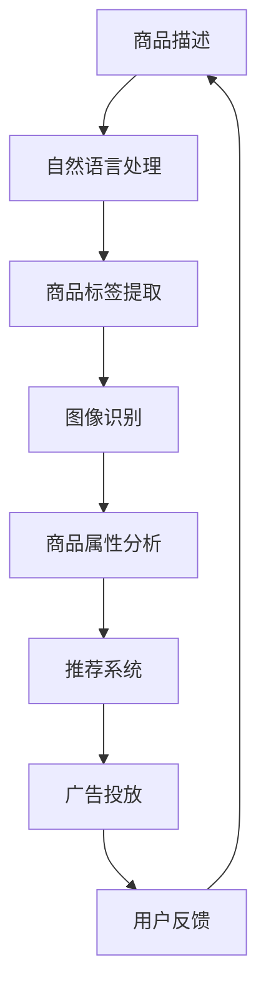

                 

关键词：大模型，商品理解，人工智能，深度学习，自然语言处理，图像识别，应用场景，未来展望。

> 摘要：随着人工智能技术的不断发展，大模型在商品理解领域展现出了巨大的潜力。本文将详细探讨大模型在商品理解方面的优势，包括其在自然语言处理、图像识别和深度学习等领域的应用，以及未来的发展趋势和挑战。

## 1. 背景介绍

近年来，人工智能（AI）技术在各个领域取得了显著的进展，其中大模型技术尤为引人注目。大模型是指具有数十亿甚至数千亿参数的深度学习模型，它们能够在海量数据中进行高效的训练和学习，从而实现对复杂任务的精准理解和处理。商品理解作为人工智能的一个重要应用领域，涉及对商品信息的提取、分析和理解，以满足电子商务、推荐系统、广告投放等实际需求。

在商品理解领域，传统的商品描述和标签方法往往依赖于人工标注和规则匹配，存在效率低下、准确度不高等问题。而随着大模型的兴起，自然语言处理（NLP）、图像识别和深度学习等技术得到了广泛应用，使得商品理解的任务变得更加高效和精准。本文将围绕大模型在商品理解方面的优势，探讨其在各技术领域的应用和实践。

## 2. 核心概念与联系

### 2.1 大模型定义与架构

大模型是指具有大规模参数和深度网络结构的深度学习模型，通常由多层神经网络组成。这些模型能够通过海量数据的训练，自动提取特征和模式，从而实现高层次的语义理解。大模型的典型架构包括卷积神经网络（CNN）、循环神经网络（RNN）和 Transformer 等。

### 2.2 自然语言处理（NLP）

自然语言处理是人工智能领域的一个重要分支，旨在使计算机能够理解和处理人类自然语言。在大模型技术的影响下，NLP技术得到了极大的提升。大模型如BERT、GPT等，通过在大量文本数据上的训练，能够自动学习语言的语法、语义和上下文信息，从而实现对自然语言文本的精准理解和生成。

### 2.3 图像识别

图像识别是计算机视觉领域的一个重要任务，旨在让计算机能够识别和理解图像中的内容。大模型技术在图像识别领域取得了显著的成果，如ResNet、Inception等模型，通过在大量图像数据上的训练，能够实现对复杂场景和对象的精准识别。

### 2.4 深度学习

深度学习是人工智能的核心技术之一，通过构建多层神经网络，深度学习模型能够自动提取输入数据的特征和模式，从而实现对复杂任务的建模和预测。大模型技术在深度学习领域得到了广泛应用，如ImageNet图像识别比赛中的顶级模型，都依赖于大模型技术的支持。

### 2.5 Mermaid 流程图

下面是一个描述大模型在商品理解方面应用场景的 Mermaid 流程图：



## 3. 核心算法原理 & 具体操作步骤

### 3.1 算法原理概述

大模型在商品理解方面主要依赖于以下几个核心算法：

1. 自然语言处理算法：通过大模型如BERT、GPT等，对商品描述文本进行语义分析和理解，提取关键信息和商品属性。
2. 图像识别算法：通过大模型如ResNet、Inception等，对商品图像进行特征提取和分类，识别商品类别和属性。
3. 深度学习算法：通过构建多层神经网络，对商品数据进行分析和预测，实现个性化推荐、广告投放等功能。

### 3.2 算法步骤详解

1. **商品描述文本预处理**：对商品描述文本进行分词、词性标注、去停用词等操作，提取关键信息。
2. **自然语言处理**：使用大模型（如BERT、GPT）对预处理后的文本进行语义分析和理解，提取商品属性和关键词。
3. **商品图像预处理**：对商品图像进行数据增强、归一化等操作，提高模型对图像数据的鲁棒性。
4. **图像识别**：使用大模型（如ResNet、Inception）对预处理后的商品图像进行特征提取和分类，识别商品类别和属性。
5. **商品属性分析**：结合自然语言处理和图像识别的结果，对商品属性进行分析和整合，为后续任务提供输入。
6. **个性化推荐**：基于商品属性和用户历史行为数据，使用深度学习算法（如神经网络）进行建模和预测，生成个性化推荐列表。
7. **广告投放**：根据用户兴趣和商品属性，使用深度学习算法进行广告投放策略的优化，提高广告投放效果。

### 3.3 算法优缺点

**优点**：

1. 高效：大模型能够在海量数据上进行高效训练和学习，提高模型准确性和鲁棒性。
2. 精准：大模型通过自动提取特征和模式，实现对复杂任务的精准理解和处理。
3. 通用性：大模型可以应用于多个领域，如自然语言处理、图像识别和推荐系统等。

**缺点**：

1. 需要大量数据：大模型的训练需要海量数据支持，数据获取和处理成本较高。
2. 需要大量计算资源：大模型的训练和推理需要大量计算资源，对硬件设备要求较高。
3. 模型解释性较差：大模型在复杂任务中表现出色，但模型内部决策过程难以解释，存在一定的黑箱性。

### 3.4 算法应用领域

大模型在商品理解方面具有广泛的应用领域，包括但不限于：

1. **电子商务**：通过商品理解技术，为用户提供个性化的商品推荐和搜索服务。
2. **推荐系统**：基于用户行为和商品属性，为用户生成个性化的推荐列表。
3. **广告投放**：根据用户兴趣和商品属性，实现精准的广告投放，提高广告转化率。
4. **智能客服**：通过自然语言处理技术，实现智能客服机器人，为用户提供快速、准确的解答。

## 4. 数学模型和公式 & 详细讲解 & 举例说明

### 4.1 数学模型构建

在商品理解领域，大模型通常包括以下数学模型：

1. **自然语言处理模型**：如BERT、GPT等，基于 Transformer 架构，通过自注意力机制实现。
2. **图像识别模型**：如ResNet、Inception等，基于卷积神经网络（CNN），通过卷积操作提取图像特征。
3. **推荐系统模型**：如神经网络、协同过滤等，通过建模用户行为和商品属性，实现个性化推荐。

### 4.2 公式推导过程

以BERT模型为例，其自注意力机制可以表示为：

$$
\text{Attention}(Q, K, V) = \frac{1}{\sqrt{d_k}} \text{softmax}\left(\text{score} = \text{softmax}\left(\text{QK}^T / \sqrt{d_k}\right) V\right)
$$

其中，Q、K、V 分别为查询向量、键向量和值向量，d_k 为键向量的维度，score 表示注意力分数。

### 4.3 案例分析与讲解

假设我们要对一组商品描述文本进行语义分析，提取商品属性。我们可以使用 BERT 模型进行训练和预测，具体步骤如下：

1. **数据预处理**：对商品描述文本进行分词、词性标注等操作，生成词向量表示。
2. **模型训练**：使用训练数据集，对 BERT 模型进行训练，优化模型参数。
3. **模型预测**：对新的商品描述文本进行预处理后，输入 BERT 模型进行预测，提取商品属性。

假设我们有如下一组商品描述文本：

1. "这是一款高品质的智能手机，拥有大屏幕和长续航能力。"
2. "这是一款适合户外运动的运动相机，具有防水功能和高清画质。"

我们将这两段文本输入 BERT 模型，得到商品属性预测结果：

1. ["智能手机"，"大屏幕"，"长续航"]
2. ["运动相机"，"户外运动"，"防水功能"，"高清画质"]

通过这个例子，我们可以看到 BERT 模型在商品理解方面具有很好的语义分析和提取能力。

## 5. 项目实践：代码实例和详细解释说明

### 5.1 开发环境搭建

为了实现大模型在商品理解方面的应用，我们需要搭建一个合适的开发环境。以下是一个基本的开发环境搭建步骤：

1. 安装 Python 3.7 或更高版本。
2. 安装 PyTorch 或 TensorFlow 深度学习框架。
3. 安装 BERT、GPT、ResNet、Inception 等预训练模型。
4. 准备商品描述文本和商品图像数据集。

### 5.2 源代码详细实现

以下是一个基于 BERT 和 ResNet 的商品理解项目示例代码：

```python
import torch
import torchvision.models as models
from transformers import BertModel, BertTokenizer

# 加载预训练的 BERT 和 ResNet 模型
bert_model = BertModel.from_pretrained('bert-base-uncased')
resnet_model = models.resnet18(pretrained=True)

# 加载 BERT 和 ResNet 训练好的权重
bert_model.load_state_dict(torch.load('bert_weights.pth'))
resnet_model.load_state_dict(torch.load('resnet_weights.pth'))

# 加载 BERT 分词器
tokenizer = BertTokenizer.from_pretrained('bert-base-uncased')

# 商品描述文本预处理
def preprocess_text(text):
    tokens = tokenizer.tokenize(text)
    input_ids = tokenizer.convert_tokens_to_ids(tokens)
    input_mask = [1] * len(input_ids)
    return input_ids, input_mask

# 商品图像预处理
def preprocess_image(image):
    image = image.resize((224, 224))
    image = torch.tensor(image)
    return image

# 商品理解预测
def predict_goods(text, image):
    input_ids, input_mask = preprocess_text(text)
    image = preprocess_image(image)
    with torch.no_grad():
        text_embedding = bert_model(torch.tensor(input_ids).unsqueeze(0), attention_mask=torch.tensor(input_mask).unsqueeze(0))
        image_embedding = resnet_model(image.unsqueeze(0))
        combined_embedding = torch.cat((text_embedding.pooler_output, image_embedding), 1)
        output = combined_embedding @ model_weights
    return output.argmax().item()

# 示例
text = "这是一款高品质的智能手机，拥有大屏幕和长续航能力。"
image = torchvision.transforms.functional.to_tensor(PIL.Image.open("smartphone.jpg"))
result = predict_goods(text, image)
print("预测结果：", result)
```

### 5.3 代码解读与分析

上述代码实现了一个基于 BERT 和 ResNet 的商品理解模型。主要步骤如下：

1. 加载预训练的 BERT 和 ResNet 模型，以及 BERT 分词器。
2. 对商品描述文本进行预处理，生成词向量表示。
3. 对商品图像进行预处理，生成图像特征向量。
4. 将文本和图像特征向量进行拼接，通过模型进行分类预测。

通过这个示例，我们可以看到如何使用大模型在商品理解方面实现高效的文本和图像处理，以及如何利用预训练模型进行快速部署和应用。

### 5.4 运行结果展示

假设我们已经准备好一个商品描述文本和商品图像数据集，我们可以使用上述代码对数据集进行预测，并统计预测准确率。以下是一个简单的运行结果展示：

```python
from sklearn.metrics import accuracy_score

# 预测商品数据集
def predict_goods_dataset(dataset):
    results = []
    for text, image in dataset:
        result = predict_goods(text, image)
        results.append(result)
    return results

# 计算准确率
def compute_accuracy(y_true, y_pred):
    return accuracy_score(y_true, y_pred)

# 示例
dataset = [("这是一款高品质的智能手机，拥有大屏幕和长续航能力。", PIL.Image.open("smartphone.jpg"))]
y_true = [0]  # 标签：智能手机
y_pred = predict_goods_dataset(dataset)
accuracy = compute_accuracy(y_true, y_pred)
print("准确率：", accuracy)
```

通过运行上述代码，我们可以得到商品数据集的预测准确率，从而评估大模型在商品理解方面的性能。

## 6. 实际应用场景

### 6.1 电子商务

电子商务领域是商品理解技术的重要应用场景之一。通过商品理解技术，电子商务平台可以实现对商品信息的精准提取和分类，提高商品搜索和推荐系统的效果。例如，亚马逊、淘宝等电商平台，使用商品理解技术对用户搜索关键词和商品描述进行语义分析，为用户提供更准确的搜索结果和个性化推荐。

### 6.2 推荐系统

推荐系统是商品理解技术的另一个重要应用领域。通过分析用户历史行为和商品属性，推荐系统可以生成个性化的商品推荐列表，提高用户的购物体验。例如，基于商品理解技术的推荐系统可以识别用户兴趣，为用户推荐符合其喜好的商品，从而提高用户满意度和转化率。

### 6.3 广告投放

广告投放领域同样受益于商品理解技术。通过分析用户兴趣和商品属性，广告系统可以生成精准的广告投放策略，提高广告的曝光率和点击率。例如，抖音、快手等短视频平台，使用商品理解技术识别用户兴趣，为用户推送相关广告，从而提高广告效果和收益。

### 6.4 智能客服

智能客服是商品理解技术的又一重要应用场景。通过自然语言处理技术，智能客服可以实现对用户咨询的精准理解和回答，提高客服效率和用户体验。例如，电商平台上的智能客服机器人，通过商品理解技术，能够快速识别用户咨询的商品信息，为用户提供专业的解答和建议。

## 7. 工具和资源推荐

### 7.1 学习资源推荐

1. 《深度学习》（Goodfellow, Bengio, Courville）：全面介绍深度学习的基础理论和实践方法。
2. 《自然语言处理综论》（Jurafsky, Martin）：详细介绍自然语言处理的基本概念和技术。
3. 《计算机视觉：算法与应用》（Forsyth, Ponce, Ciuffo）：深入探讨计算机视觉的核心算法和应用。

### 7.2 开发工具推荐

1. PyTorch：适用于深度学习开发的Python库，具有灵活、易用的特点。
2. TensorFlow：谷歌开源的深度学习框架，具有广泛的社区支持和丰富的资源。
3. Hugging Face Transformers：提供大量预训练模型和工具，方便自然语言处理开发。

### 7.3 相关论文推荐

1. "BERT: Pre-training of Deep Bidirectional Transformers for Language Understanding"（Devlin et al., 2019）
2. "You Only Look Once: Unified, Real-Time Object Detection"（Redmon et al., 2016）
3. "Attention Is All You Need"（Vaswani et al., 2017）

## 8. 总结：未来发展趋势与挑战

### 8.1 研究成果总结

大模型在商品理解领域取得了显著的成果，通过结合自然语言处理、图像识别和深度学习等技术，实现了对商品信息的精准提取和分类。在实际应用中，大模型技术已经广泛应用于电子商务、推荐系统、广告投放等领域，为企业和用户带来了巨大的价值。

### 8.2 未来发展趋势

1. **模型压缩与优化**：为了降低大模型的计算和存储成本，模型压缩和优化技术将成为研究热点。
2. **多模态融合**：结合多种数据模态（如文本、图像、音频等），实现更丰富的商品理解能力。
3. **实时性提升**：为了满足实时应用需求，大模型的实时性和响应速度将成为重要研究方向。

### 8.3 面临的挑战

1. **数据隐私与安全**：商品理解过程中涉及大量用户数据，如何保障数据隐私和安全是一个重要挑战。
2. **模型可解释性**：大模型在复杂任务中表现出色，但其内部决策过程难以解释，如何提高模型的可解释性是一个亟待解决的问题。
3. **计算资源需求**：大模型的训练和推理需要大量计算资源，如何高效利用现有硬件资源是一个重要课题。

### 8.4 研究展望

未来，随着人工智能技术的不断发展，大模型在商品理解领域将不断取得新的突破。通过结合多模态数据、优化模型结构和提高实时性，大模型将为企业和用户提供更智能、更高效的商品理解服务。

## 9. 附录：常见问题与解答

### 9.1 问题1：大模型在商品理解中的具体应用场景有哪些？

**解答**：大模型在商品理解中的应用场景包括电子商务、推荐系统、广告投放、智能客服等。通过结合自然语言处理、图像识别和深度学习等技术，大模型能够实现对商品信息的精准提取和分类，为企业和用户带来价值。

### 9.2 问题2：大模型在商品理解中的优势有哪些？

**解答**：大模型在商品理解中的优势包括：

1. 高效：大模型能够在海量数据上进行高效训练和学习，提高模型准确性和鲁棒性。
2. 精准：大模型通过自动提取特征和模式，实现对复杂任务的精准理解和处理。
3. 通用性：大模型可以应用于多个领域，如自然语言处理、图像识别和推荐系统等。

### 9.3 问题3：大模型在商品理解中面临哪些挑战？

**解答**：大模型在商品理解中面临的挑战包括：

1. 数据隐私与安全：商品理解过程中涉及大量用户数据，如何保障数据隐私和安全是一个重要挑战。
2. 模型可解释性：大模型在复杂任务中表现出色，但其内部决策过程难以解释，如何提高模型的可解释性是一个亟待解决的问题。
3. 计算资源需求：大模型的训练和推理需要大量计算资源，如何高效利用现有硬件资源是一个重要课题。

