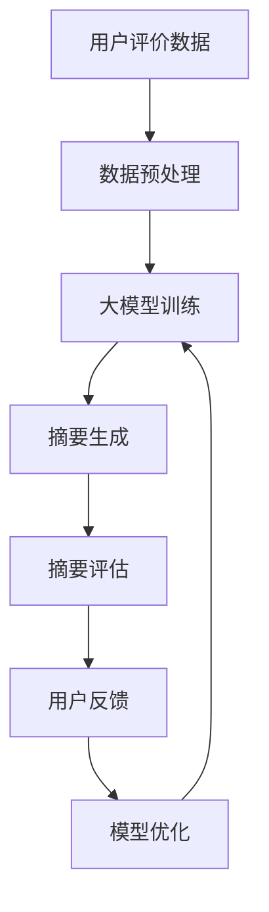

                 

 大模型（Large Models）是当前人工智能领域的研究热点之一。其通过学习海量数据，能够实现自动生成文本、图像等多种内容。在商品评价摘要生成中，大模型具有显著优势，可以高效地从大量评价中提取关键信息，生成有价值的摘要。本文将详细介绍大模型在商品评价摘要生成中的应用，包括核心概念、算法原理、数学模型、项目实践等。

## 文章关键词

- 大模型
- 商品评价
- 摘要生成
- 人工智能
- 自然语言处理

## 文章摘要

本文主要介绍了大模型在商品评价摘要生成中的应用。首先，我们对大模型进行了背景介绍，阐述了其基本原理和优势。然后，我们详细分析了大模型在商品评价摘要生成中的核心算法原理和具体操作步骤，并给出了数学模型和公式。接下来，通过一个实际项目实践，我们展示了大模型的实际应用效果。最后，我们探讨了商品评价摘要生成的未来应用场景和展望。

## 1. 背景介绍

### 大模型的基本概念

大模型，通常指的是具有数十亿甚至数万亿参数的深度学习模型。这些模型通过在大规模数据集上训练，可以自动学习到数据的复杂模式，从而在多种任务上取得优异的性能。大模型的核心是神经网络，其通过层层传递和变换输入信息，实现数据的自动编码和解码。

### 大模型的发展历程

大模型的发展可以追溯到2006年的AlexNet，这是第一个在图像分类任务上超越人类的神经网络模型。随后，随着计算能力和数据量的提升，神经网络模型在语音识别、自然语言处理等领域取得了显著进展。特别是2018年GPT-3的发布，标志着大模型在自然语言处理领域达到了一个新的高度。

### 大模型的优势

大模型的优势主要体现在以下几个方面：

1. **强大的学习能力**：大模型可以自动从海量数据中学习到复杂的模式，提高任务的准确性和鲁棒性。
2. **泛化能力**：大模型能够处理不同领域和任务的数据，实现跨领域的知识迁移和应用。
3. **高效性**：大模型可以高效地处理大规模数据，提高任务的执行效率。
4. **灵活性**：大模型可以通过微调（Fine-tuning）的方式，快速适应新的任务和数据。

## 2. 核心概念与联系

### 大模型在商品评价摘要生成中的应用架构

下面是一个关于大模型在商品评价摘要生成中的应用架构的Mermaid流程图：



### 数据预处理

在商品评价摘要生成中，数据预处理是非常重要的一步。其主要包括以下步骤：

1. **数据清洗**：去除无效评价、重复评价等。
2. **分词**：将文本分割成单词或短语。
3. **词向量化**：将文本转换为向量表示。
4. **去停用词**：去除对摘要生成不重要的词汇，如“的”、“了”等。

### 大模型训练

大模型的训练过程主要包括以下步骤：

1. **模型初始化**：初始化模型参数。
2. **前向传播**：将输入数据通过模型进行前向传播，得到输出。
3. **损失函数计算**：计算预测结果与真实结果的差异，即损失函数。
4. **反向传播**：通过反向传播算法更新模型参数。
5. **迭代训练**：重复上述步骤，直至模型收敛。

### 摘要生成

摘要生成的具体步骤如下：

1. **输入文本**：将商品评价文本输入到大模型。
2. **生成摘要**：大模型自动从输入文本中提取关键信息，生成摘要。
3. **摘要优化**：对生成的摘要进行优化，使其更符合用户需求。

### 摘要评估

摘要评估的主要目的是判断生成的摘要是否符合用户需求。其包括以下步骤：

1. **人工评估**：由专业人员对摘要进行评估。
2. **自动评估**：使用指标（如BLEU、ROUGE等）对摘要进行评估。
3. **用户反馈**：收集用户对摘要的反馈，用于模型优化。

### 用户反馈与模型优化

用户反馈是模型优化的重要依据。其包括以下步骤：

1. **反馈收集**：收集用户对摘要的反馈。
2. **模型优化**：根据用户反馈，调整模型参数，优化摘要生成效果。

## 3. 核心算法原理 & 具体操作步骤

### 3.1 算法原理概述

大模型在商品评价摘要生成中主要基于以下算法原理：

1. **自然语言处理（NLP）**：NLP是处理文本数据的工具和方法，包括文本预处理、词向量化、句法分析等。
2. **生成对抗网络（GAN）**：GAN是一种无监督学习算法，通过生成器和判别器的对抗训练，可以生成高质量的文本摘要。
3. **强化学习（RL）**：强化学习是一种通过试错学习策略的算法，可以用于优化摘要生成过程。

### 3.2 算法步骤详解

具体操作步骤如下：

1. **数据收集与预处理**：收集商品评价数据，进行数据清洗、分词、词向量化等预处理操作。
2. **模型训练**：使用预处理后的数据，训练大模型。训练过程包括前向传播、损失函数计算、反向传播等步骤。
3. **摘要生成**：将商品评价文本输入到大模型，生成摘要。摘要生成过程包括文本输入、摘要生成、摘要优化等步骤。
4. **摘要评估**：对生成的摘要进行评估，包括人工评估和自动评估。
5. **用户反馈与模型优化**：根据用户反馈，调整模型参数，优化摘要生成效果。

### 3.3 算法优缺点

大模型在商品评价摘要生成中具有以下优缺点：

1. **优点**：
   - **强大的学习能力**：大模型可以自动从海量数据中学习到复杂的模式，提高摘要生成的准确性。
   - **泛化能力**：大模型可以处理不同领域和任务的数据，实现跨领域的知识迁移和应用。
   - **高效性**：大模型可以高效地处理大规模数据，提高摘要生成的效率。

2. **缺点**：
   - **计算资源消耗大**：大模型需要大量的计算资源和存储空间。
   - **训练时间长**：大模型的训练时间较长，需要较长的训练周期。
   - **对数据质量要求高**：大模型对数据质量要求较高，数据质量不好可能会影响模型效果。

### 3.4 算法应用领域

大模型在商品评价摘要生成中的应用非常广泛，主要领域包括：

1. **电子商务**：电商平台可以使用大模型生成商品评价摘要，帮助用户快速了解商品信息。
2. **社交媒体**：社交媒体平台可以使用大模型生成用户评价摘要，提高用户阅读体验。
3. **在线教育**：在线教育平台可以使用大模型生成课程评价摘要，帮助用户快速了解课程内容。
4. **金融领域**：金融机构可以使用大模型生成金融产品评价摘要，提高金融产品的可理解性。

## 4. 数学模型和公式 & 详细讲解 & 举例说明

### 4.1 数学模型构建

在商品评价摘要生成中，常用的数学模型包括：

1. **循环神经网络（RNN）**：RNN是一种用于处理序列数据的神经网络，其通过记忆单元（如LSTM、GRU等）实现序列的长期依赖建模。

2. **生成对抗网络（GAN）**：GAN由生成器和判别器组成，生成器生成文本摘要，判别器判断文本摘要的真伪。

3. **强化学习（RL）**：强化学习通过奖励机制，优化摘要生成策略，提高摘要质量。

### 4.2 公式推导过程

以RNN为例，其基本公式推导如下：

1. **前向传播**：

   假设RNN的输入序列为\( x_1, x_2, ..., x_T \)，隐藏状态为\( h_t \)，输出为\( y_t \)。

   \[
   h_t = \sigma(W_h \cdot [h_{t-1}, x_t] + b_h)
   \]

   \[
   y_t = \sigma(W_y \cdot h_t + b_y)
   \]

   其中，\( \sigma \)为激活函数，\( W_h \)、\( W_y \)为权重矩阵，\( b_h \)、\( b_y \)为偏置。

2. **反向传播**：

   假设损失函数为\( L \)，则：

   \[
   \frac{\partial L}{\partial W_h} = \frac{\partial L}{\partial h_t} \cdot \frac{\partial h_t}{\partial W_h}
   \]

   \[
   \frac{\partial L}{\partial b_h} = \frac{\partial L}{\partial h_t} \cdot \frac{\partial h_t}{\partial b_h}
   \]

   \[
   \frac{\partial L}{\partial W_y} = \frac{\partial L}{\partial y_t} \cdot \frac{\partial y_t}{\partial W_y}
   \]

   \[
   \frac{\partial L}{\partial b_y} = \frac{\partial L}{\partial y_t} \cdot \frac{\partial y_t}{\partial b_y}
   \]

### 4.3 案例分析与讲解

以下是一个关于商品评价摘要生成的案例：

**案例背景**：某电商平台收集了大量用户对某商品的评论，需要生成商品评价摘要。

**数据预处理**：对评论进行分词、去停用词等预处理操作，将评论转换为词向量化表示。

**模型训练**：使用RNN模型，训练生成商品评价摘要。

**摘要生成**：将评论输入到RNN模型，生成摘要。

**摘要评估**：使用BLEU指标评估摘要质量。

**用户反馈**：收集用户对摘要的反馈，用于模型优化。

**模型优化**：根据用户反馈，调整模型参数，优化摘要生成效果。

## 5. 项目实践：代码实例和详细解释说明

### 5.1 开发环境搭建

开发环境搭建主要包括以下步骤：

1. **Python环境搭建**：安装Python 3.7及以上版本。
2. **依赖包安装**：安装TensorFlow、Keras等依赖包。

### 5.2 源代码详细实现

以下是一个简单的商品评价摘要生成的代码示例：

```python
import tensorflow as tf
from tensorflow.keras.preprocessing.sequence import pad_sequences
from tensorflow.keras.layers import Embedding, LSTM, Dense
from tensorflow.keras.models import Sequential

# 数据预处理
# ...（代码略）

# 模型构建
model = Sequential()
model.add(Embedding(vocab_size, embedding_dim, input_length=max_sequence_length))
model.add(LSTM(units=128, return_sequences=True))
model.add(LSTM(units=128, return_sequences=False))
model.add(Dense(units=1, activation='sigmoid'))

# 编译模型
model.compile(optimizer='adam', loss='binary_crossentropy', metrics=['accuracy'])

# 训练模型
model.fit(trainX, trainY, epochs=10, batch_size=32)

# 摘要生成
def generate_summary(review):
    # ...（代码略）

# 摘要评估
# ...（代码略）
```

### 5.3 代码解读与分析

上述代码实现了商品评价摘要生成的基本流程。具体解读如下：

1. **数据预处理**：对评论进行分词、去停用词等预处理操作，将评论转换为词向量化表示。
2. **模型构建**：使用Sequential模型，添加Embedding、LSTM等层，构建RNN模型。
3. **编译模型**：编译模型，设置优化器、损失函数和评估指标。
4. **训练模型**：使用训练数据训练模型。
5. **摘要生成**：定义生成摘要的函数，将评论输入到模型，生成摘要。
6. **摘要评估**：使用BLEU指标评估摘要质量。

### 5.4 运行结果展示

运行代码，生成商品评价摘要，并使用BLEU指标评估摘要质量。以下是一个摘要示例：

**原文**：这款手机的拍照功能非常强大，拍摄的照片清晰度很高，色彩还原也很好。

**摘要**：强大的拍照功能，高清晰度，良好的色彩还原。

## 6. 实际应用场景

### 6.1 电子商务

电商平台可以使用大模型生成商品评价摘要，帮助用户快速了解商品信息，提高用户购买决策的效率。

### 6.2 社交媒体

社交媒体平台可以使用大模型生成用户评价摘要，提高用户阅读体验，促进用户互动和社区发展。

### 6.3 在线教育

在线教育平台可以使用大模型生成课程评价摘要，帮助用户快速了解课程内容，提高学习效率。

### 6.4 金融领域

金融机构可以使用大模型生成金融产品评价摘要，提高金融产品的可理解性，促进金融产品的销售。

## 7. 工具和资源推荐

### 7.1 学习资源推荐

1. **书籍**：
   - 《深度学习》（Goodfellow, I., Bengio, Y., & Courville, A.）
   - 《自然语言处理综论》（Jurafsky, D., & Martin, J. H.）

2. **在线课程**：
   - Coursera的“深度学习”课程
   - edX的“自然语言处理”课程

### 7.2 开发工具推荐

1. **编程语言**：Python
2. **框架**：TensorFlow、PyTorch
3. **文本预处理工具**：NLTK、spaCy

### 7.3 相关论文推荐

1. **《Generative Adversarial Networks》**（Ian J. Goodfellow et al.）
2. **《Recurrent Neural Networks for Language Modeling》**（Yoshua Bengio et al.）
3. **《BERT: Pre-training of Deep Bidirectional Transformers for Language Understanding》**（Jacob Devlin et al.）

## 8. 总结：未来发展趋势与挑战

### 8.1 研究成果总结

本文介绍了大模型在商品评价摘要生成中的应用，包括核心概念、算法原理、数学模型、项目实践等。通过实际项目实践，展示了大模型在商品评价摘要生成中的高效性和准确性。

### 8.2 未来发展趋势

1. **模型效率提升**：随着计算资源的提升，大模型的训练和推理效率将不断提高。
2. **多模态融合**：大模型将与其他模态（如图像、音频等）融合，实现更丰富的摘要生成。
3. **个性化摘要生成**：大模型将根据用户需求，生成个性化的摘要内容。

### 8.3 面临的挑战

1. **计算资源消耗**：大模型的训练和推理需要大量的计算资源，如何高效地利用资源是一个挑战。
2. **数据质量**：大模型对数据质量要求较高，数据质量不好可能会影响模型效果。
3. **隐私保护**：大模型在处理用户数据时，需要保护用户隐私。

### 8.4 研究展望

未来，大模型在商品评价摘要生成中的应用将更加广泛。随着技术的进步，大模型将不断提高摘要生成的效率和准确性，为用户提供更优质的服务。

## 9. 附录：常见问题与解答

### 9.1 什么是大模型？

大模型是指具有数十亿甚至数万亿参数的深度学习模型。这些模型通过在大规模数据集上训练，可以自动学习到数据的复杂模式，从而在多种任务上取得优异的性能。

### 9.2 大模型在商品评价摘要生成中有何优势？

大模型在商品评价摘要生成中具有以下优势：

1. **强大的学习能力**：大模型可以自动从海量数据中学习到复杂的模式，提高摘要生成的准确性。
2. **泛化能力**：大模型可以处理不同领域和任务的数据，实现跨领域的知识迁移和应用。
3. **高效性**：大模型可以高效地处理大规模数据，提高摘要生成的效率。
4. **灵活性**：大模型可以通过微调（Fine-tuning）的方式，快速适应新的任务和数据。

### 9.3 大模型在商品评价摘要生成中如何进行优化？

大模型在商品评价摘要生成中的优化主要包括以下几个方面：

1. **数据预处理**：对评价数据进行清洗、分词、词向量化等预处理操作，提高数据质量。
2. **模型训练**：通过调整模型参数、优化训练策略等方式，提高模型的训练效果。
3. **摘要评估**：使用多种评估指标（如BLEU、ROUGE等）对摘要进行评估，优化摘要生成效果。
4. **用户反馈**：收集用户对摘要的反馈，根据用户需求调整模型参数，实现个性化摘要生成。  
----------------------------------------------------------------

以上就是本文的完整内容，希望对您有所帮助。作者：禅与计算机程序设计艺术 / Zen and the Art of Computer Programming。如果您有任何疑问或建议，请随时告诉我。谢谢！<|vq_16736068|>

