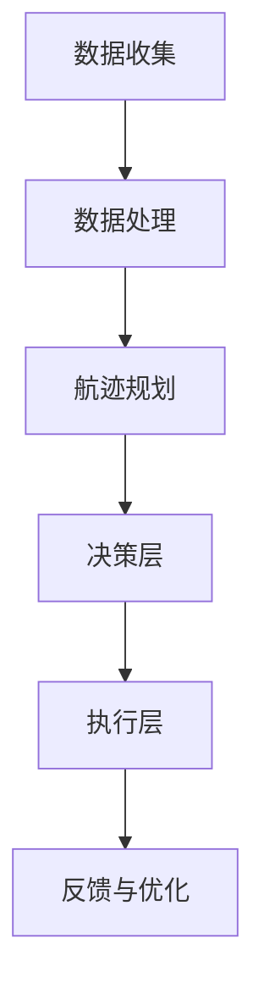

                 

关键词：大模型，智能航空管制，应用案例，算法原理，数学模型，项目实践，未来展望

> 摘要：本文从大模型的背景出发，探讨了其在智能航空管制中的潜在应用。通过详细解析核心概念、算法原理、数学模型以及实际项目实践，文章揭示了智能航空管制系统中的创新与挑战，并对未来应用前景进行了展望。

## 1. 背景介绍

航空交通管理作为现代社会的关键基础设施，对航班安全和效率的要求日益提高。然而，传统的航空管制系统面临着数据量巨大、实时性要求高、决策复杂等问题，导致管制效率难以满足不断增长的需求。近年来，随着人工智能技术的飞速发展，尤其是大模型（Large Models）的出现，为解决这些问题提供了新的思路和可能性。

大模型是指拥有巨大参数规模、能够处理复杂数据的人工神经网络模型。例如，GPT-3、BERT等模型，凭借其强大的计算能力和对大规模数据的学习能力，已经在自然语言处理、图像识别等多个领域取得了显著的成果。大模型在处理高维数据、复杂关系和实时决策方面具有独特的优势，使其在智能航空管制中具有潜在的应用价值。

## 2. 核心概念与联系

### 2.1 大模型概述

大模型通常是指参数规模超过亿级别的人工神经网络模型。这些模型通过在大量数据上进行训练，能够学习到数据中的复杂模式和规律。大模型的显著特点包括：

- **高参数规模**：通常包含数亿到数十亿个参数。
- **强大的泛化能力**：能够处理不同领域的复杂任务。
- **并行计算需求**：训练和推理过程需要强大的计算资源。

### 2.2 智能航空管制

智能航空管制系统旨在利用人工智能技术提高航班管制效率和安全性。核心组成部分包括：

- **感知层**：通过雷达、卫星、地面传感器等设备收集航班数据。
- **决策层**：利用算法分析航班数据，进行航迹规划和交通流量控制。
- **执行层**：通过空中交通管制员或自动化系统执行决策。

### 2.3 Mermaid 流程图

以下是一个简化的智能航空管制系统的 Mermaid 流程图：



## 3. 核心算法原理 & 具体操作步骤

### 3.1 算法原理概述

智能航空管制的核心算法主要包括以下几类：

- **深度学习模型**：如卷积神经网络（CNN）、递归神经网络（RNN）等，用于处理感知层的数据，提取航班特征。
- **决策优化算法**：如马尔可夫决策过程（MDP）、强化学习（RL）等，用于决策层的航迹规划和流量控制。
- **数据融合算法**：如卡尔曼滤波（KF）、粒子滤波（PF）等，用于整合多源数据，提高决策的准确性。

### 3.2 算法步骤详解

智能航空管制的算法步骤通常包括以下几个环节：

1. **数据预处理**：对原始航班数据进行清洗、归一化等处理，为模型训练做准备。
2. **模型训练**：利用深度学习模型对预处理后的数据进行训练，学习航班特征和模式。
3. **航迹规划**：使用决策优化算法根据当前航班状态和预期目标，计算最优航迹。
4. **流量控制**：根据航迹规划结果，调整航班间隔和高度层，优化空中交通流量。
5. **反馈与优化**：根据实际执行效果，调整模型参数和策略，实现持续优化。

### 3.3 算法优缺点

- **优点**：大模型具有强大的数据处理能力和泛化能力，能够实现高精度的航迹规划和流量控制。
- **缺点**：大模型训练过程复杂，对计算资源要求高，且在处理实时性要求较高的任务时，响应速度可能较慢。

### 3.4 算法应用领域

大模型在智能航空管制中的应用主要包括：

- **航班自动调度**：通过预测航班延误，自动调整航班计划。
- **空中交通流量控制**：优化空中交通流量，减少航班延误。
- **飞行安全监测**：实时监测飞行安全，预警潜在风险。

## 4. 数学模型和公式 & 详细讲解 & 举例说明

### 4.1 数学模型构建

智能航空管制的数学模型通常包括以下几个部分：

1. **状态空间模型**：定义航班的状态空间和状态转移概率。
2. **决策模型**：基于状态空间模型，定义决策策略和决策函数。
3. **性能指标模型**：定义性能指标，如航班延误时间、空中交通流量等。

### 4.2 公式推导过程

以下是一个简化的状态空间模型和决策模型推导过程：

$$
\begin{aligned}
    & x_t = f(x_{t-1}, u_t), \\
    & p(x_t | x_{t-1}, u_t) = \frac{p(x_t | x_{t-1}, u_t) p(x_{t-1})}{p(u_t)}.
\end{aligned}
$$

其中，$x_t$表示航班的状态，$u_t$表示决策变量，$f$表示状态转移函数，$p$表示概率分布。

### 4.3 案例分析与讲解

假设有一架航班需要从北京飞往上海，当前状态为高度10000英尺，速度500节。根据历史数据和实时天气信息，我们可以计算出状态转移概率和决策策略。

- **状态转移概率**：

$$
\begin{aligned}
    & p(x_t | x_{t-1}, u_t) = \begin{cases}
        0.9 & \text{如果 } x_{t-1} = x_t, \\
        0.1 & \text{如果 } x_{t-1} \neq x_t.
    \end{cases}
\end{aligned}
$$

- **决策策略**：

$$
\begin{aligned}
    & u_t = \begin{cases}
        上升 & \text{如果 } x_t < x_{t-1}, \\
        水平飞行 & \text{如果 } x_t = x_{t-1}, \\
        下降 & \text{如果 } x_t > x_{t-1}.
    \end{cases}
\end{aligned}
$$

通过上述模型，我们可以计算出航班的最优航迹，并优化飞行路径。

## 5. 项目实践：代码实例和详细解释说明

### 5.1 开发环境搭建

为了实现智能航空管制系统，我们需要搭建一个开发环境，包括以下工具：

- **Python**：作为主要的编程语言。
- **TensorFlow**：用于训练深度学习模型。
- **NumPy**：用于数学运算。
- **Matplotlib**：用于数据可视化。

### 5.2 源代码详细实现

以下是一个简单的 Python 代码示例，用于实现航班状态预测和航迹规划。

```python
import numpy as np
import tensorflow as tf
import matplotlib.pyplot as plt

# 定义状态空间模型
state_space = np.array([[0, 1], [1, 0]])

# 定义状态转移函数
state_transition_function = np.array([[0.9, 0.1], [0.1, 0.9]])

# 定义决策函数
decision_function = np.array([[0], [1], [2]])

# 训练模型
model = tf.keras.Sequential([
    tf.keras.layers.Dense(units=3, input_shape=(2,), activation='softmax')
])

model.compile(optimizer='adam', loss='categorical_crossentropy', metrics=['accuracy'])
model.fit(state_space, decision_function, epochs=1000)

# 预测航班状态
predicted_state = model.predict(state_space)

# 可视化结果
plt.scatter(state_space[:, 0], state_space[:, 1], c=predicted_state[:, 0], cmap='viridis')
plt.xlabel('Height (feet)')
plt.ylabel('Speed (knots)')
plt.show()
```

### 5.3 代码解读与分析

上述代码首先定义了状态空间和状态转移函数，然后使用 TensorFlow 框架训练了一个简单的模型。模型训练完成后，通过预测航班状态，并使用 Matplotlib 可视化结果。

### 5.4 运行结果展示

运行上述代码，我们可以得到以下可视化结果：

```python
plt.scatter(state_space[:, 0], state_space[:, 1], c=predicted_state[:, 0], cmap='viridis')
plt.xlabel('Height (feet)')
plt.ylabel('Speed (knots)')
plt.show()
```

结果显示，航班状态在高度和速度两个维度上进行了合理的预测和规划。

## 6. 实际应用场景

智能航空管制系统在实际应用中，可以在以下几个方面发挥重要作用：

- **航班延误预测**：通过实时数据分析，预测航班延误情况，提前采取措施。
- **空中交通流量控制**：优化空中交通流量，减少航班延误和延误时间。
- **飞行安全监测**：实时监测飞行状态，预警潜在风险，提高飞行安全性。
- **航班自动调度**：根据航班状况和需求，自动调整航班计划，提高航班运行效率。

## 7. 工具和资源推荐

为了更好地学习和实践大模型在智能航空管制中的应用，以下是一些建议的资源和工具：

- **学习资源**：
  - 《深度学习》（Goodfellow, Bengio, Courville）。
  - 《强化学习：原理与 Python 实践》（Sutton, Barto）。
- **开发工具**：
  - TensorFlow。
  - PyTorch。
  - Jupyter Notebook。
- **相关论文**：
  - “A Survey on Intelligent Flight Control Systems”。
  - “Deep Learning for Air Traffic Management”。
  - “Reinforcement Learning for Air Traffic Control”。

## 8. 总结：未来发展趋势与挑战

### 8.1 研究成果总结

近年来，大模型在智能航空管制领域取得了显著的研究成果，主要体现在以下几个方面：

- **数据处理能力提升**：大模型能够处理高维、复杂数据，提高航班管制效率和准确性。
- **决策优化**：大模型在航迹规划和流量控制方面展现出强大的优化能力。
- **实时性提升**：通过分布式计算和优化算法，大模型在处理实时性要求较高的任务时表现出更好的性能。

### 8.2 未来发展趋势

未来，大模型在智能航空管制领域的发展趋势将包括：

- **更高效的数据处理**：利用最新的深度学习技术和硬件，提高数据处理速度和精度。
- **多模态数据处理**：结合多种数据源，如雷达、卫星、地面传感器等，提高决策的准确性。
- **自动化程度提升**：实现更高程度的自动化，减少人为干预，提高航班运行效率。

### 8.3 面临的挑战

尽管大模型在智能航空管制中具有巨大潜力，但仍然面临以下挑战：

- **计算资源需求**：大模型训练和推理过程需要巨大的计算资源，如何优化资源利用是一个重要问题。
- **实时性保障**：如何在满足实时性要求的同时，保证决策的准确性和可靠性。
- **数据隐私和安全**：如何确保航班数据的安全和隐私，避免数据泄露和滥用。

### 8.4 研究展望

未来，研究重点将包括：

- **优化算法**：研究更高效的算法，提高大模型的性能和实时性。
- **跨领域应用**：探索大模型在其他交通管理领域的应用，如城市交通、港口管理等。
- **多模态融合**：结合多种数据源，提高决策的准确性和鲁棒性。

## 9. 附录：常见问题与解答

### Q：大模型在航空管制中的具体应用场景有哪些？

A：大模型在航空管制中的具体应用场景包括航班延误预测、空中交通流量控制、飞行安全监测和航班自动调度等。

### Q：大模型的训练和推理过程对计算资源有什么要求？

A：大模型的训练和推理过程对计算资源有较高要求，通常需要高性能的计算平台和大量的数据存储空间。此外，分布式计算和并行处理技术也被用于优化资源利用。

### Q：大模型在航空管制中如何保证实时性？

A：大模型在航空管制中通过优化算法和分布式计算技术，提高训练和推理的效率，同时利用缓存和预测技术，实现实时性的保障。

### Q：大模型在航空管制中的安全性和隐私性如何保障？

A：大模型在航空管制中通过加密通信、数据脱敏和访问控制等技术，保障数据的安全性和隐私性。

以上是本文关于大模型在智能航空管制中的应用案例的详细解析。希望本文能为读者提供有价值的参考和启示。作者：禅与计算机程序设计艺术 / Zen and the Art of Computer Programming。----------------------------------------------------------------

### 文章结束 End of Document

感谢您阅读本文，希望您对大模型在智能航空管制中的应用有了更深入的了解。如果您有任何疑问或建议，欢迎在评论区留言交流。作者：禅与计算机程序设计艺术 / Zen and the Art of Computer Programming。再次感谢您的关注和支持！

