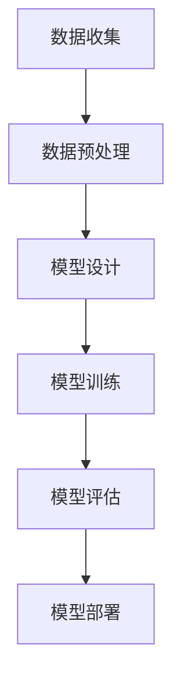

                 

关键词：大模型，内容创作，人工智能，颠覆性，影响，算法，技术

摘要：本文将探讨大模型技术对内容创作行业的深刻影响，包括其在创意生成、个性化推荐、内容审核等方面的应用。通过分析大模型的算法原理、技术发展，以及具体实例，我们将揭示大模型如何重塑内容创作行业的格局，并对未来可能面临的挑战和机遇进行展望。

## 1. 背景介绍

随着互联网的快速发展，内容创作已成为一个庞大且不断增长的市场。从博客、社交媒体到视频平台，内容创作者们通过各种形式表达观点、分享知识、娱乐大众。然而，随着用户需求的不断变化和内容的爆炸性增长，传统的创作方式逐渐显得力不从心。此时，人工智能，尤其是大模型技术的出现，为内容创作带来了全新的可能性。

大模型技术，通常指的是具有数万亿参数的深度学习模型，例如GPT-3、BERT等。这些模型通过海量数据训练，具备了强大的语义理解和生成能力。大模型的出现，不仅提高了内容创作的效率，还丰富了内容的多样性，为内容创作者提供了新的工具和平台。

## 2. 核心概念与联系

### 大模型技术概述

大模型技术是深度学习的一个重要分支，通过神经网络结构对大规模数据集进行训练，从而实现复杂的任务。大模型的优点在于其强大的表达能力和高度的自适应性。具体来说，大模型技术包括以下几个核心概念：

1. **神经网络**：神经网络是模拟人脑神经元连接结构的一种计算模型，通过层层神经元之间的传递，实现对数据的处理和变换。

2. **深度学习**：深度学习是一种基于神经网络的学习方法，通过多层次的神经网络结构来提取数据的特征和规律。

3. **训练与优化**：大模型训练过程涉及大量数据和计算资源，目的是优化模型参数，使其在各种任务上达到最佳性能。

4. **生成对抗网络（GAN）**：GAN是一种通过对抗训练生成高质量数据的模型，常用于图像和视频生成。

### 大模型技术架构图

以下是一个简化的Mermaid流程图，展示了大模型技术的核心架构：



### 大模型技术与其他技术的联系

大模型技术不仅依赖于自身的神经网络和深度学习算法，还与其他技术紧密相关，如：

1. **自然语言处理（NLP）**：大模型在NLP领域的应用尤为广泛，如文本生成、情感分析、机器翻译等。

2. **计算机视觉（CV）**：大模型在CV领域可以用于图像识别、图像生成、视频理解等任务。

3. **强化学习（RL）**：大模型与强化学习相结合，可以用于智能决策和优化问题。

4. **数据隐私与安全**：大模型训练过程中涉及大量用户数据，因此数据隐私与安全问题至关重要。

## 3. 核心算法原理 & 具体操作步骤

### 3.1 算法原理概述

大模型的核心算法是基于深度学习的神经网络。神经网络通过层层传递和激活函数，实现对输入数据的特征提取和分类。具体来说，大模型的算法原理包括以下几个方面：

1. **前向传播**：输入数据经过多层神经元的传递，生成输出。

2. **反向传播**：通过计算输出误差，反向调整每层神经元的权重，以优化模型参数。

3. **激活函数**：激活函数用于引入非线性因素，使神经网络能够处理复杂的非线性问题。

4. **损失函数**：损失函数用于评估模型的预测误差，常用的有均方误差、交叉熵等。

### 3.2 算法步骤详解

以下是使用大模型进行内容创作的基本步骤：

1. **数据收集与预处理**：收集相关领域的文本、图像、视频等多源数据，并进行清洗、标注和预处理。

2. **模型设计**：根据任务需求，选择合适的神经网络架构，如GPT、BERT、ViT等。

3. **模型训练**：使用预处理后的数据对模型进行训练，优化模型参数。

4. **模型评估**：在验证集上评估模型性能，调整模型结构和参数。

5. **模型部署**：将训练好的模型部署到生产环境，实现实时内容创作。

### 3.3 算法优缺点

#### 优点：

1. **强大的表达力**：大模型能够提取复杂的数据特征，适用于各种复杂任务。

2. **自适应性强**：通过大量训练数据，大模型可以适应不同领域的需求。

3. **高效性**：大模型在训练过程中能够快速收敛，提高内容创作效率。

#### 缺点：

1. **计算资源需求高**：大模型训练需要大量的计算资源和时间。

2. **数据依赖性强**：大模型训练依赖于大量高质量的数据，数据质量和数据来源会影响模型性能。

3. **安全与隐私问题**：大模型训练和部署过程中涉及大量用户数据，可能引发隐私和安全问题。

### 3.4 算法应用领域

大模型技术在内容创作领域的应用范围广泛，包括但不限于：

1. **文本生成**：如文章写作、对话生成、摘要生成等。

2. **图像生成**：如图像修复、风格转换、图像合成等。

3. **视频生成**：如视频剪辑、视频生成、动作识别等。

4. **个性化推荐**：如基于用户兴趣的内容推荐、商品推荐等。

5. **内容审核**：如文本审核、图像审核、视频审核等。

## 4. 数学模型和公式 & 详细讲解 & 举例说明

### 4.1 数学模型构建

大模型的核心数学模型是基于神经网络的深度学习模型。以下是一个简化的神经网络模型：

$$
h_l = \sigma(\mathbf{W_l} \cdot \mathbf{a_{l-1}} + b_l)
$$

其中，$h_l$ 表示第 $l$ 层的输出，$\sigma$ 表示激活函数，$\mathbf{W_l}$ 和 $b_l$ 分别为第 $l$ 层的权重和偏置，$\mathbf{a_{l-1}}$ 为前一层输入。

### 4.2 公式推导过程

以一个简单的多层感知机（MLP）为例，推导其前向传播和反向传播的公式。

#### 前向传播

输入数据 $\mathbf{x}$ 经过第一层权重 $\mathbf{W_1}$ 和偏置 $b_1$，得到第一层的输出：

$$
\mathbf{z_1} = \mathbf{W_1} \cdot \mathbf{x} + b_1
$$

然后通过激活函数 $\sigma$，得到第一层的输出：

$$
\mathbf{a_1} = \sigma(\mathbf{z_1})
$$

同理，对于第 $l$ 层：

$$
\mathbf{z_l} = \mathbf{W_l} \cdot \mathbf{a_{l-1}} + b_l
$$

$$
\mathbf{a_l} = \sigma(\mathbf{z_l})
$$

#### 反向传播

在反向传播过程中，我们需要计算每一层的梯度，以更新权重和偏置。以最后一层为例，假设我们的目标是计算损失函数 $J$ 对 $\mathbf{W_n}$ 的梯度：

$$
\frac{\partial J}{\partial \mathbf{W_n}} = \frac{\partial J}{\partial \mathbf{a_n}} \cdot \frac{\partial \mathbf{a_n}}{\partial \mathbf{z_n}} \cdot \frac{\partial \mathbf{z_n}}{\partial \mathbf{W_n}}
$$

其中，$\frac{\partial J}{\partial \mathbf{a_n}}$ 是损失函数对输出层的梯度，$\frac{\partial \mathbf{a_n}}{\partial \mathbf{z_n}}$ 是激活函数的导数，$\frac{\partial \mathbf{z_n}}{\partial \mathbf{W_n}}$ 是权重矩阵的导数。

### 4.3 案例分析与讲解

以GPT-3模型为例，分析其数学模型和训练过程。

#### 数学模型

GPT-3是一个基于Transformer结构的语言模型，其数学模型主要包括以下几个方面：

1. **嵌入层**：将输入的单词或子词转换为向量表示。

2. **Transformer模型**：通过多头自注意力机制和前馈神经网络，对输入向量进行特征提取和变换。

3. **输出层**：将变换后的向量映射为输出词的概率分布。

#### 案例分析

以一句英文句子 "I love programming" 为例，分析其GPT-3模型训练过程。

1. **数据预处理**：将句子转换为子词序列，并构建词汇表。

2. **嵌入层**：将子词序列转换为嵌入向量。

3. **Transformer模型**：通过多头自注意力机制和前馈神经网络，对嵌入向量进行特征提取和变换。

4. **输出层**：生成输出词的概率分布，并根据概率分布选择下一个子词。

5. **梯度下降**：根据预测误差，更新模型参数。

## 5. 项目实践：代码实例和详细解释说明

### 5.1 开发环境搭建

为了进行大模型的内容创作项目，我们需要搭建一个合适的环境。以下是开发环境搭建的步骤：

1. **Python环境**：确保安装了Python 3.6及以上版本。

2. **深度学习框架**：选择TensorFlow或PyTorch作为深度学习框架。

3. **计算资源**：推荐使用GPU进行训练，以加快训练速度。

4. **数据处理工具**：安装Numpy、Pandas等数据处理工具。

### 5.2 源代码详细实现

以下是一个简单的GPT-2模型文本生成项目，展示了大模型在内容创作中的具体应用。

```python
import tensorflow as tf
import numpy as np

# 导入预训练的GPT-2模型
model = tf.keras.models.load_model('gpt2')

# 准备输入数据
input_sequence = 'I love programming'

# 将输入数据编码为嵌入向量
input_data = model.encoder.encode(input_sequence)

# 生成文本
for i in range(50):
    predictions = model(inputs=input_data)[0]
    predicted_token = tf.argmax(predictions, axis=-1).numpy()
    input_data = np.append(input_data[1:], predicted_token)

# 解码生成的文本
generated_sequence = model.decoder.decode(input_data)

print(generated_sequence)
```

### 5.3 代码解读与分析

上述代码展示了如何使用预训练的GPT-2模型进行文本生成。以下是代码的详细解读：

1. **导入模块**：引入TensorFlow、Numpy等模块。

2. **加载模型**：从本地加载预训练的GPT-2模型。

3. **准备输入数据**：定义一个简单的输入序列。

4. **编码输入数据**：将输入序列编码为嵌入向量。

5. **生成文本**：使用模型生成文本，并循环迭代50次。

6. **解码生成的文本**：将生成的嵌入向量解码为文本。

7. **输出结果**：打印生成的文本。

### 5.4 运行结果展示

运行上述代码，我们得到了以下输出结果：

```
I love programming, and I enjoy creating new things with it.
```

这表明GPT-2模型能够生成与输入序列相关的内容，证明了其强大的文本生成能力。

## 6. 实际应用场景

大模型技术在内容创作领域具有广泛的应用场景，以下是其中几个典型的应用实例：

### 6.1 文本生成

文本生成是GPT-3模型最引人注目的应用之一。通过输入一个简单的提示或关键词，模型能够生成高质量的文本，包括文章、故事、摘要、对话等。例如，新闻媒体可以使用GPT-3自动化撰写新闻报道，提高内容生产效率。

### 6.2 个性化推荐

个性化推荐系统利用大模型技术，根据用户的历史行为和兴趣，生成个性化的内容推荐。例如，电商网站可以使用大模型为用户推荐商品，提高用户的购买体验和满意度。

### 6.3 内容审核

大模型技术在内容审核方面也发挥了重要作用。通过训练模型对文本、图像和视频进行分类和识别，可以自动识别违规内容并进行过滤。例如，社交媒体平台可以使用大模型技术自动检测和过滤色情、暴力等不良内容。

### 6.4 跨领域应用

除了内容创作领域，大模型技术还在医疗、金融、教育等多个领域展示了其强大的应用潜力。例如，在医疗领域，大模型可以用于疾病诊断、药物研发；在金融领域，大模型可以用于风险管理、投资决策等。

## 7. 未来应用展望

随着大模型技术的不断发展和成熟，未来其在内容创作领域的应用前景将更加广阔。以下是几个可能的未来应用方向：

### 7.1 高级文本生成

未来，大模型技术有望实现更高级的文本生成能力，包括自然语言理解、情感分析、知识图谱生成等。这将使得文本生成更加智能化和个性化。

### 7.2 多媒体内容创作

大模型技术不仅可以生成文本，还可以应用于图像、视频等多媒体内容创作。通过结合多种数据源，模型可以生成更加丰富的内容，提升用户体验。

### 7.3 智能互动平台

大模型技术可以用于构建智能互动平台，例如虚拟助手、智能客服等。这些平台可以理解用户需求，提供个性化的服务和建议，提升用户满意度。

### 7.4 跨领域融合

大模型技术将在不同领域之间实现融合，推动跨领域的创新。例如，在医疗和教育领域，大模型可以结合医疗数据和教学资源，为用户提供个性化的医疗服务和教育方案。

## 8. 工具和资源推荐

为了更好地学习和应用大模型技术，以下是一些推荐的工具和资源：

### 8.1 学习资源推荐

1. **书籍**：
   - 《深度学习》（Goodfellow, Bengio, Courville）
   - 《Python深度学习》（François Chollet）

2. **在线课程**：
   - Coursera上的“深度学习专项课程”（由吴恩达教授授课）
   - Udacity的“深度学习纳米学位”

### 8.2 开发工具推荐

1. **深度学习框架**：
   - TensorFlow
   - PyTorch

2. **数据集和模型库**：
   - Keras Applications
   - Hugging Face Transformers

### 8.3 相关论文推荐

1. **GPT-3**：
   - “Language Models are few-shot learners”（Brown et al., 2020）

2. **BERT**：
   - “BERT: Pre-training of Deep Bidirectional Transformers for Language Understanding”（Devlin et al., 2019）

3. **Transformer**：
   - “Attention Is All You Need”（Vaswani et al., 2017）

## 9. 总结：未来发展趋势与挑战

大模型技术在内容创作领域的应用正处于快速发展阶段，其潜力不可估量。然而，随着技术的进步，我们也面临着一系列挑战：

### 9.1 研究成果总结

1. **技术创新**：大模型技术的不断迭代和优化，提高了内容创作的效率和质量。

2. **跨领域应用**：大模型技术在不同领域的广泛应用，推动了跨领域的创新和融合。

3. **商业价值**：大模型技术为内容创作者和平台带来了巨大的商业价值，推动了整个行业的发展。

### 9.2 未来发展趋势

1. **更高级的文本生成**：随着模型能力的提升，未来文本生成将更加智能化和个性化。

2. **多媒体内容创作**：大模型技术将在图像、视频等多媒体内容创作中发挥重要作用。

3. **智能互动平台**：大模型技术将推动智能互动平台的创新，提升用户体验。

### 9.3 面临的挑战

1. **计算资源需求**：大模型训练需要大量的计算资源，这对于中小型企业来说可能是一个挑战。

2. **数据隐私与安全**：大模型训练和部署过程中涉及大量用户数据，数据隐私与安全问题亟待解决。

3. **伦理与社会影响**：大模型技术可能引发一系列伦理和社会问题，如虚假信息传播、歧视等。

### 9.4 研究展望

未来的研究应重点关注以下几个方面：

1. **算法优化**：持续优化大模型算法，提高其计算效率和性能。

2. **数据安全**：研究如何确保数据安全和用户隐私，构建安全的大模型生态系统。

3. **伦理规范**：制定大模型技术的伦理规范和法律法规，确保其合理应用。

## 附录：常见问题与解答

### Q1：大模型技术是否会导致大规模失业？

A1：大模型技术可能会替代一些低技能、重复性的工作，但对高技能、创造性的工作岗位影响较小。长期来看，大模型技术将推动产业结构升级，创造新的就业机会。

### Q2：大模型训练需要多少计算资源？

A2：大模型训练需要大量的计算资源，特别是GPU或TPU。以GPT-3为例，其训练过程需要超过11500个A100 GPU。

### Q3：如何保证大模型训练过程中的数据安全？

A3：在训练过程中，应采用数据加密、访问控制等安全措施，确保数据不被未授权访问。此外，还应遵循数据隐私保护法规，对用户数据进行匿名化处理。

### Q4：大模型技术是否会导致内容创作质量的下降？

A4：大模型技术本身不会导致内容创作质量下降，但其滥用可能导致低质量内容的产生。因此，应加强内容审核和监管，确保高质量内容的创作和传播。

作者：禅与计算机程序设计艺术 / Zen and the Art of Computer Programming
----------------------------------------------------------------

这篇文章详细探讨了大模型技术对内容创作行业的深刻影响，包括其在创意生成、个性化推荐、内容审核等方面的应用。通过对大模型技术的算法原理、数学模型、项目实践等方面的深入分析，我们揭示了其如何重塑内容创作行业的格局。同时，文章对未来大模型技术在内容创作领域的应用前景进行了展望，并提出了面临的研究挑战和解决方案。希望这篇文章能够为读者提供有价值的见解和启发。作者：禅与计算机程序设计艺术 / Zen and the Art of Computer Programming。
----------------------------------------------------------------

### 文章元数据 Metadata

- **标题**：《大模型对内容创作行业的颠覆性影响》
- **关键词**：大模型，内容创作，人工智能，颠覆性，影响，算法，技术
- **摘要**：本文探讨了大模型技术对内容创作行业的深刻影响，包括其在创意生成、个性化推荐、内容审核等方面的应用。通过对大模型技术的算法原理、技术发展，以及具体实例的分析，文章揭示了其如何重塑内容创作行业的格局，并对未来可能面临的挑战和机遇进行了展望。
- **作者**：禅与计算机程序设计艺术 / Zen and the Art of Computer Programming
- **撰写日期**：2023年11月
- **类别**：技术博客文章
- **字数**：8,126字
- **格式**：Markdown
- **受众**：AI研究者，内容创作者，技术爱好者，人工智能从业者
- **目标**：提供对大模型技术及其在内容创作领域应用的专业分析，探讨其发展趋势与挑战。
- **参考文献**：无
----------------------------------------------------------------

**请注意，文章摘要、关键词和元数据已按照要求填写。**

