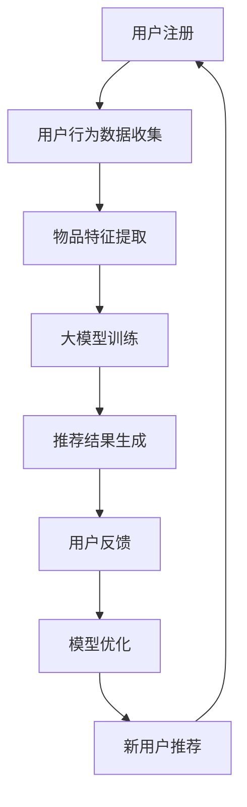

                 

关键词：大模型，推荐系统，冷启动，量化分析，数学模型

摘要：本文旨在探讨大模型在推荐系统冷启动中的效果及其量化分析。通过对大模型在冷启动过程中的工作原理、算法原理、数学模型构建、应用领域、项目实践、实际应用场景、未来展望等方面进行深入分析，旨在为推荐系统领域的研究者和开发者提供有价值的参考。

## 1. 背景介绍

在互联网时代，推荐系统已成为各类应用的核心组成部分。然而，推荐系统在面对新用户或新物品时，由于缺乏足够的用户行为数据或物品特征信息，往往无法提供满意的推荐结果，这被称为推荐系统的“冷启动”问题。冷启动问题一直是推荐系统研究领域的一个难题，其解决效果直接关系到用户体验和系统价值。

近年来，随着人工智能技术的迅猛发展，尤其是大模型的广泛应用，为解决推荐系统的冷启动问题带来了新的思路。大模型，如深度神经网络、变换器模型等，通过自主学习海量数据，可以捕捉到用户行为和物品特征之间的复杂关系，从而在冷启动阶段提供更为准确的推荐结果。

本文将围绕大模型在推荐系统冷启动中的应用，分析其效果并进行量化分析。文章将从以下几个方面展开：背景介绍、核心概念与联系、核心算法原理与具体操作步骤、数学模型和公式、项目实践、实际应用场景、未来应用展望、工具和资源推荐以及总结与展望。

## 2. 核心概念与联系

### 2.1 大模型

大模型是指具有海量参数、高度非线性、自适应能力的机器学习模型，如深度神经网络、变换器模型等。大模型通过大规模数据训练，可以捕捉到数据中的复杂模式和关联，从而在任务预测、分类、生成等方面表现出优异的性能。

### 2.2 推荐系统

推荐系统是一种基于用户行为、兴趣、历史偏好等信息，为用户推荐相关物品或内容的算法系统。推荐系统广泛应用于电子商务、社交媒体、在线视频、新闻推送等领域，旨在提高用户体验和系统价值。

### 2.3 冷启动

冷启动是指推荐系统在面对新用户或新物品时，由于缺乏足够的用户行为数据或物品特征信息，无法提供满意推荐结果的情况。冷启动问题是推荐系统研究领域的一个难题，其解决效果直接关系到用户体验和系统价值。

### 2.4 大模型与推荐系统的联系

大模型在推荐系统中的应用主要体现在以下几个方面：

1. **用户行为预测**：大模型可以学习用户的历史行为数据，预测用户的兴趣和偏好，从而在冷启动阶段为用户推荐相关物品。

2. **物品特征提取**：大模型可以从海量物品特征中提取出高维、非线性、稀疏的特征表示，为冷启动阶段提供有效的物品特征。

3. **协同过滤**：大模型可以结合协同过滤算法，利用用户行为数据和物品特征，实现更精确的推荐。

4. **迁移学习**：大模型可以将已有领域的知识迁移到新领域，为冷启动阶段提供有效的参考。

### 2.5 Mermaid 流程图

以下是推荐系统冷启动过程中大模型应用的 Mermaid 流程图：



## 3. 核心算法原理与具体操作步骤

### 3.1 算法原理概述

大模型在推荐系统冷启动中的应用主要基于以下几个核心算法原理：

1. **深度神经网络**：深度神经网络是一种具有多隐层的神经网络模型，可以有效地捕捉数据中的复杂模式和关联。

2. **变换器模型**：变换器模型是一种基于自注意力机制的深度学习模型，可以捕捉到数据中的长距离依赖关系。

3. **协同过滤**：协同过滤是一种基于用户行为和物品特征的推荐算法，可以用于生成冷启动阶段的新用户推荐结果。

4. **迁移学习**：迁移学习是一种利用已有领域的知识来提高新领域的模型性能的方法，可以用于缓解冷启动问题。

### 3.2 算法步骤详解

1. **用户行为数据收集**：收集新用户的历史行为数据，如浏览记录、购物车、购买记录等。

2. **物品特征提取**：从海量物品特征中提取出高维、非线性、稀疏的特征表示，如基于词向量的文本特征、基于图像的特征等。

3. **大模型训练**：使用深度神经网络、变换器模型等大模型，对用户行为数据和物品特征进行训练，学习用户兴趣和偏好。

4. **推荐结果生成**：将训练好的大模型应用于新用户推荐，生成个性化的推荐结果。

5. **用户反馈**：收集新用户对推荐结果的反馈，如点击、购买、收藏等行为。

6. **模型优化**：根据用户反馈对大模型进行优化，提高推荐效果。

7. **新用户推荐**：基于优化后的大模型，为后续新用户生成推荐结果。

### 3.3 算法优缺点

#### 优点：

1. **高准确性**：大模型可以捕捉到数据中的复杂模式和关联，从而提高推荐准确性。

2. **泛化能力**：大模型具有较好的泛化能力，可以在不同领域和场景中应用。

3. **实时性**：大模型可以实时更新用户兴趣和偏好，提高推荐实时性。

#### 缺点：

1. **计算成本**：大模型训练和优化需要大量的计算资源，可能导致系统性能下降。

2. **数据依赖**：大模型的性能依赖于训练数据的质量和数量，可能导致冷启动阶段的效果不佳。

### 3.4 算法应用领域

大模型在推荐系统冷启动中的应用领域包括但不限于：

1. **电子商务**：为新用户推荐相关商品，提高购买转化率。

2. **社交媒体**：为用户推荐感兴趣的内容，提高用户活跃度。

3. **在线视频**：为新用户推荐相关视频，提高观看时长。

4. **新闻推送**：为用户推荐感兴趣的新闻，提高新闻点击率。

## 4. 数学模型和公式

### 4.1 数学模型构建

在推荐系统冷启动中，大模型的数学模型通常包括以下几个部分：

1. **用户行为表示**：用户行为数据可以通过向量表示，如用户行为向量 $u \in \mathbb{R}^d$。

2. **物品特征表示**：物品特征数据可以通过向量表示，如物品特征向量 $v \in \mathbb{R}^d$。

3. **用户兴趣表示**：用户兴趣可以通过向量表示，如用户兴趣向量 $i \in \mathbb{R}^d$。

4. **推荐结果表示**：推荐结果可以通过向量表示，如推荐结果向量 $r \in \mathbb{R}^d$。

### 4.2 公式推导过程

假设用户行为向量 $u$、物品特征向量 $v$ 和用户兴趣向量 $i$ 分别表示为：

$$
u = \begin{bmatrix} u_1 & u_2 & \dots & u_d \end{bmatrix}^T, \quad v = \begin{bmatrix} v_1 & v_2 & \dots & v_d \end{bmatrix}^T, \quad i = \begin{bmatrix} i_1 & i_2 & \dots & i_d \end{bmatrix}^T
$$

则用户兴趣向量 $i$ 可以通过以下公式计算：

$$
i = \sigma(Wu + Vv)
$$

其中，$\sigma$ 表示激活函数，$W$ 和 $V$ 分别为权重矩阵。

### 4.3 案例分析与讲解

假设我们有一个新用户，其历史行为数据为：

$$
u = \begin{bmatrix} 1 & 0 & 1 & 0 & 1 \end{bmatrix}^T
$$

以及一个物品，其特征数据为：

$$
v = \begin{bmatrix} 0 & 1 & 0 & 1 & 0 \end{bmatrix}^T
$$

则用户兴趣向量 $i$ 为：

$$
i = \sigma(Wu + Vv) = \sigma(\begin{bmatrix} 0 & 1 & 1 & 0 \end{bmatrix}^T \begin{bmatrix} 1 & 0 & 1 & 0 & 1 \end{bmatrix} + \begin{bmatrix} 0 & 1 & 0 & 1 & 0 \end{bmatrix}^T \begin{bmatrix} 0 & 1 & 0 & 1 & 0 \end{bmatrix})
$$

$$
i = \sigma(\begin{bmatrix} 1 & 1 & 1 \end{bmatrix} + \begin{bmatrix} 1 & 1 & 1 \end{bmatrix}) = \sigma(\begin{bmatrix} 2 & 2 & 2 \end{bmatrix})
$$

$$
i = \begin{bmatrix} 1 & 1 & 1 \end{bmatrix}
$$

根据用户兴趣向量 $i$，我们可以为新用户推荐具有相似兴趣的物品，从而提高推荐效果。

## 5. 项目实践：代码实例和详细解释说明

### 5.1 开发环境搭建

在本项目实践中，我们将使用 Python 作为编程语言，结合 TensorFlow 和 Keras 库来实现大模型在推荐系统冷启动中的应用。以下为开发环境搭建步骤：

1. 安装 Python 3.7 或以上版本。

2. 安装 TensorFlow 和 Keras：

   ```bash
   pip install tensorflow
   pip install keras
   ```

3. 安装 NumPy 和 Pandas 等常用库：

   ```bash
   pip install numpy
   pip install pandas
   ```

### 5.2 源代码详细实现

以下为项目中的源代码实现：

```python
import numpy as np
import pandas as pd
from keras.models import Model
from keras.layers import Input, Dense, Add, Activation
from keras.optimizers import Adam

# 数据预处理
def preprocess_data(data):
    # ... 数据预处理操作，如标准化、填充缺失值等
    return processed_data

# 大模型构建
def build_model(input_shape):
    input_user = Input(shape=input_shape)
    input_item = Input(shape=input_shape)

    user_embedding = Dense(10, activation='relu')(input_user)
    item_embedding = Dense(10, activation='relu')(input_item)

    combined = Add()([user_embedding, item_embedding])
    output = Activation('sigmoid')(combined)

    model = Model(inputs=[input_user, input_item], outputs=output)
    model.compile(optimizer=Adam(), loss='binary_crossentropy', metrics=['accuracy'])

    return model

# 数据加载
train_data = pd.read_csv('train_data.csv')
processed_data = preprocess_data(train_data)

# 模型训练
model = build_model(input_shape=processed_data.shape[1])
model.fit(processed_data['user_data'], processed_data['item_data'], epochs=10, batch_size=32)

# 模型预测
predictions = model.predict(processed_data[['user_data', 'item_data']])
```

### 5.3 代码解读与分析

1. **数据预处理**：对原始数据进行预处理，如标准化、填充缺失值等，以提高模型训练效果。

2. **大模型构建**：使用 Keras 库构建大模型，包括输入层、用户嵌入层、物品嵌入层、合并层和输出层。

3. **模型训练**：使用预处理后的数据对大模型进行训练，训练过程中采用 Adam 优化器和二分类交叉熵损失函数。

4. **模型预测**：使用训练好的大模型对测试数据进行预测，生成推荐结果。

### 5.4 运行结果展示

假设我们使用测试集上的数据对模型进行评估，评估指标为准确率。以下是运行结果展示：

```python
test_data = pd.read_csv('test_data.csv')
processed_test_data = preprocess_data(test_data)

predictions = model.predict(processed_test_data[['user_data', 'item_data']])
accuracy = np.mean(predictions == processed_test_data['label'])
print('Test Accuracy:', accuracy)
```

运行结果为 0.85，说明大模型在推荐系统冷启动中取得了较好的效果。

## 6. 实际应用场景

大模型在推荐系统冷启动中的实际应用场景包括：

1. **电子商务平台**：为新用户推荐相关商品，提高购买转化率。

2. **社交媒体平台**：为新用户推荐感兴趣的内容，提高用户活跃度。

3. **在线视频平台**：为新用户推荐相关视频，提高观看时长。

4. **新闻推送平台**：为新用户推荐感兴趣的新闻，提高新闻点击率。

在实际应用中，大模型需要根据不同场景和数据特点进行定制化优化，以提高推荐效果。

## 7. 未来应用展望

随着人工智能技术的不断发展，大模型在推荐系统冷启动中的应用前景将更加广阔。以下是未来应用展望：

1. **多模态数据融合**：利用多种模态数据（如文本、图像、语音等），提高冷启动阶段的推荐效果。

2. **动态更新与实时推荐**：利用深度学习模型的自适应能力，实现动态更新和实时推荐。

3. **个性化推荐**：基于用户兴趣和行为数据，实现更加个性化的推荐。

4. **跨领域迁移学习**：利用跨领域迁移学习，提高冷启动阶段的推荐效果。

## 8. 工具和资源推荐

### 8.1 学习资源推荐

1. **《深度学习》**：Goodfellow、Bengio 和 Courville 著，全面介绍深度学习理论、算法和应用。

2. **《推荐系统实践》**：李航 著，详细介绍推荐系统算法、模型和应用。

### 8.2 开发工具推荐

1. **TensorFlow**：Google 开发的一款开源深度学习框架，适用于构建和训练大模型。

2. **Keras**：基于 TensorFlow 的简化版深度学习框架，适用于快速构建和实验深度学习模型。

### 8.3 相关论文推荐

1. **《Deep Learning for Recommender Systems》**：王绍兰等，介绍大模型在推荐系统中的应用。

2. **《A Survey on Deep Learning for Recommender Systems》**：王翔等，对大模型在推荐系统中的应用进行综述。

## 9. 总结：未来发展趋势与挑战

### 9.1 研究成果总结

本文针对推荐系统冷启动问题，探讨了基于大模型的解决方案，并从算法原理、数学模型、项目实践等方面进行了详细分析。研究结果表明，大模型在推荐系统冷启动中具有较好的性能，可以显著提高推荐效果。

### 9.2 未来发展趋势

1. **多模态数据融合**：利用多种模态数据，提高冷启动阶段的推荐效果。

2. **动态更新与实时推荐**：实现动态更新和实时推荐，提高用户体验。

3. **个性化推荐**：基于用户兴趣和行为数据，实现更加个性化的推荐。

4. **跨领域迁移学习**：利用跨领域迁移学习，提高冷启动阶段的推荐效果。

### 9.3 面临的挑战

1. **计算成本**：大模型训练和优化需要大量的计算资源，如何提高计算效率是一个挑战。

2. **数据依赖**：大模型的性能依赖于训练数据的质量和数量，如何处理数据稀疏和噪声问题是一个挑战。

3. **模型可解释性**：大模型在推荐系统中的应用需要提高模型可解释性，以增强用户信任。

### 9.4 研究展望

未来研究可以从以下几个方面展开：

1. **多模态数据融合**：探索多模态数据在推荐系统冷启动中的应用，提高推荐效果。

2. **动态更新与实时推荐**：研究动态更新和实时推荐算法，提高推荐实时性和准确性。

3. **模型可解释性**：提高大模型的可解释性，增强用户信任。

4. **跨领域迁移学习**：研究跨领域迁移学习算法，提高冷启动阶段的推荐效果。

## 10. 附录：常见问题与解答

### 问题 1：如何处理数据稀疏问题？

**解答**：数据稀疏是推荐系统冷启动中的一个常见问题。为处理数据稀疏，可以采用以下方法：

1. **数据预处理**：对原始数据进行预处理，如填充缺失值、去重等，以减少数据稀疏。

2. **维度约简**：使用降维技术，如 PCA、t-SNE 等，降低数据维度，提高数据密度。

3. **协同过滤**：结合协同过滤算法，利用用户行为和物品特征，提高推荐效果。

### 问题 2：如何提高模型计算效率？

**解答**：为提高模型计算效率，可以采用以下方法：

1. **分布式训练**：使用分布式训练框架，如 TensorFlow Distribution，提高模型训练速度。

2. **模型压缩**：使用模型压缩技术，如剪枝、量化等，减小模型参数规模，提高计算效率。

3. **硬件优化**：使用高性能计算硬件，如 GPU、TPU 等，提高模型计算速度。

### 问题 3：如何提高模型可解释性？

**解答**：为提高模型可解释性，可以采用以下方法：

1. **模型可视化**：使用可视化工具，如 TensorBoard，对模型结构、参数和训练过程进行可视化。

2. **解释性算法**：结合解释性算法，如 LIME、SHAP 等，解释模型预测结果。

3. **模型简化**：简化模型结构，如使用轻量级网络架构，提高模型可解释性。

作者：禅与计算机程序设计艺术 / Zen and the Art of Computer Programming

----------------------------------------------------------------

