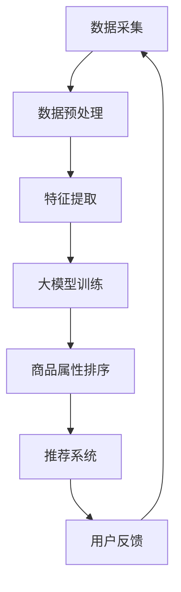

                 

关键词：大模型技术、商品属性排序、电商平台、重要性、算法原理、数学模型、项目实践、应用场景、未来展望。

## 摘要

本文将探讨大模型技术在电商平台商品属性重要性排序中的应用。随着电商平台的快速发展，商品数量和种类日益繁多，如何有效提升用户购物体验、精准推荐商品成为关键问题。本文首先介绍了大模型技术的背景和核心概念，然后详细解析了商品属性重要性排序的算法原理和数学模型，并通过实际项目实践展示了算法的应用效果。最后，本文对大模型技术在电商领域的应用前景进行了展望，并提出了未来面临的挑战和研究方向。

## 1. 背景介绍

### 1.1 电商平台的发展现状

随着互联网技术的飞速发展，电商平台已成为消费者购物的主要渠道之一。据统计，全球电商市场规模已超过数万亿美元，并在持续增长。在电商平台上，商品种类繁多，消费者面临着信息过载的问题。为了提升用户购物体验，电商平台需要通过精准推荐商品来满足用户需求。

### 1.2 商品属性的重要性排序

商品属性是指描述商品特征的各项指标，如价格、品牌、评价等。商品属性的重要性排序旨在确定各项属性在推荐系统中的权重，以便更好地满足用户需求。传统的商品属性排序方法主要基于统计方法和机器学习方法，但这些方法往往存在一定局限性，如对数据依赖性强、效果不稳定等。

### 1.3 大模型技术的崛起

大模型技术，即大规模深度学习模型，如 Transformer、BERT 等，近年来在自然语言处理、计算机视觉等领域取得了显著的成果。大模型技术具有强大的表示能力和泛化能力，能够处理海量数据和复杂任务。因此，大模型技术在电商领域具有广阔的应用前景。

## 2. 核心概念与联系

为了更好地理解大模型技术在商品属性重要性排序中的应用，我们首先介绍相关核心概念，并使用 Mermaid 流程图展示大模型技术在实际应用中的流程和环节。

### 2.1 核心概念

- **商品属性**：描述商品特征的各项指标，如价格、品牌、评价等。
- **用户行为数据**：用户在电商平台上的购买、浏览、搜索等行为数据。
- **推荐系统**：根据用户历史行为数据，为用户推荐相关商品的系统。
- **大模型技术**：如 Transformer、BERT 等，具有强大表示能力和泛化能力的深度学习模型。

### 2.2 Mermaid 流程图



### 2.3 大模型技术在商品属性重要性排序中的应用流程

1. **数据采集**：从电商平台获取用户行为数据，包括购买、浏览、搜索等。
2. **数据预处理**：清洗和整合数据，为后续特征提取做准备。
3. **特征提取**：将用户行为数据转换为可用于模型训练的特征向量。
4. **大模型训练**：使用深度学习模型（如 Transformer、BERT 等）对特征向量进行训练，提取商品属性的重要性。
5. **商品属性排序**：根据大模型训练结果，对商品属性进行重要性排序。
6. **推荐系统**：利用排序结果，为用户推荐相关商品。
7. **用户反馈**：收集用户对推荐结果的反馈，用于优化模型。

## 3. 核心算法原理 & 具体操作步骤

### 3.1 算法原理概述

大模型技术在商品属性重要性排序中的应用主要基于深度学习模型，如 Transformer、BERT 等。这些模型通过自动学习用户行为数据中的特征，从而提取商品属性的重要性。具体来说，算法原理可以分为以下几个步骤：

1. **数据预处理**：对用户行为数据进行清洗和整合，去除噪声数据。
2. **特征提取**：将用户行为数据转换为高维特征向量，用于模型训练。
3. **模型训练**：使用深度学习模型（如 Transformer、BERT 等）对特征向量进行训练，提取商品属性的重要性。
4. **模型评估**：使用交叉验证等方法评估模型性能，优化模型参数。
5. **商品属性排序**：根据模型训练结果，对商品属性进行重要性排序。
6. **推荐系统**：利用排序结果，为用户推荐相关商品。

### 3.2 算法步骤详解

#### 3.2.1 数据预处理

数据预处理是模型训练的基础。主要步骤包括：

1. **数据清洗**：去除缺失值、重复值和异常值。
2. **数据整合**：将不同来源的数据进行整合，如将用户购买记录、浏览记录和搜索记录进行合并。
3. **数据规范化**：对数值型数据进行规范化处理，使其具备可比性。

#### 3.2.2 特征提取

特征提取是将用户行为数据转换为高维特征向量。主要步骤包括：

1. **用户行为编码**：将用户行为（如购买、浏览、搜索）编码为二进制向量。
2. **特征融合**：将不同来源的用户行为数据进行融合，如使用加法、平均等方法。
3. **特征降维**：使用 PCA、t-SNE 等方法对高维特征进行降维，以减少计算量和提高模型性能。

#### 3.2.3 模型训练

模型训练是核心环节，主要步骤包括：

1. **模型选择**：选择合适的深度学习模型，如 Transformer、BERT 等。
2. **模型配置**：配置模型参数，如学习率、批量大小等。
3. **模型训练**：使用特征向量进行模型训练，调整模型参数，提高模型性能。
4. **模型评估**：使用交叉验证等方法评估模型性能，优化模型参数。

#### 3.2.4 商品属性排序

商品属性排序是根据模型训练结果对商品属性进行重要性排序。主要步骤包括：

1. **模型输出**：将模型训练结果输出为商品属性的重要性向量。
2. **排序算法**：使用排序算法（如贪心算法、快速排序等）对商品属性进行排序。
3. **结果验证**：使用实际数据验证排序结果，优化排序算法。

#### 3.2.5 推荐系统

推荐系统是根据商品属性排序结果，为用户推荐相关商品。主要步骤包括：

1. **用户行为预测**：根据用户历史行为数据，预测用户可能感兴趣的商品。
2. **商品推荐**：将预测结果与商品属性排序结果结合，为用户推荐相关商品。
3. **推荐结果评估**：评估推荐结果，优化推荐算法。

### 3.3 算法优缺点

#### 优点

1. **强大表示能力**：大模型技术具有强大的表示能力，能够捕捉用户行为数据中的复杂模式。
2. **泛化能力**：大模型技术具有良好的泛化能力，适用于不同领域和场景。
3. **高效性**：大模型技术能够处理海量数据和复杂任务，提高算法效率。

#### 缺点

1. **计算资源需求大**：大模型技术需要大量的计算资源和存储资源，对硬件设施要求较高。
2. **模型可解释性差**：深度学习模型往往缺乏可解释性，难以理解模型决策过程。
3. **数据依赖性强**：大模型技术对数据质量要求较高，数据缺失或不一致可能导致模型性能下降。

### 3.4 算法应用领域

大模型技术在商品属性重要性排序中的应用具有广泛的前景，主要包括：

1. **电商平台**：电商平台可以根据商品属性重要性排序为用户推荐相关商品，提升用户购物体验。
2. **零售行业**：零售行业可以基于商品属性重要性排序优化库存管理、商品陈列等环节。
3. **广告推荐**：广告推荐可以根据商品属性重要性排序，为用户推送感兴趣的广告。
4. **金融风控**：金融风控可以根据商品属性重要性排序，识别高风险交易和用户。

## 4. 数学模型和公式 & 详细讲解 & 举例说明

### 4.1 数学模型构建

在商品属性重要性排序中，我们主要关注以下数学模型：

#### 4.1.1 用户行为数据表示

用户行为数据可以用一个高维向量表示，其中每个维度代表用户的一种行为。设用户行为数据集为 \( X = [x_1, x_2, ..., x_n] \)，其中 \( x_i \) 表示用户在第 \( i \) 种行为上的特征向量。

#### 4.1.2 商品属性表示

商品属性可以用一个低维向量表示，其中每个维度代表商品的一种属性。设商品属性集为 \( Y = [y_1, y_2, ..., y_m] \)，其中 \( y_j \) 表示商品在第 \( j \) 种属性上的特征值。

#### 4.1.3 商品属性重要性排序模型

商品属性重要性排序模型可以用一个矩阵 \( W \) 表示，其中 \( W_{ij} \) 表示第 \( j \) 种商品属性对于第 \( i \) 种用户行为的权重。

### 4.2 公式推导过程

假设我们使用深度学习模型对用户行为数据进行特征提取，得到一个特征向量集 \( X' \)。然后，我们将特征向量集 \( X' \) 与商品属性集 \( Y \) 进行矩阵乘法，得到商品属性重要性排序结果 \( Z \)。

$$
Z = W \cdot X'
$$

其中，\( Z_{ij} \) 表示第 \( j \) 种商品属性对于第 \( i \) 种用户行为的权重。

为了得到最优的权重矩阵 \( W \)，我们可以使用梯度下降算法进行模型训练。设损失函数为 \( L \)，则模型训练的目标是最小化损失函数。

$$
L = \sum_{i=1}^{n} \sum_{j=1}^{m} (Z_{ij} - y_j)^2
$$

对权重矩阵 \( W \) 求导，并令导数为 0，得到最优权重矩阵 \( W^* \)。

$$
\frac{\partial L}{\partial W} = 2 \cdot (Z - Y) \cdot X' = 0
$$

$$
W^* = (X' \cdot X')^{-1} \cdot X' \cdot Y
$$

### 4.3 案例分析与讲解

#### 4.3.1 数据集准备

我们假设有一个电商平台，其中包含 1000 个用户和 500 个商品。每个用户的行为数据包括购买、浏览和搜索三个维度。每个商品有价格、品牌、评价等 10 个属性。

#### 4.3.2 特征提取

使用深度学习模型对用户行为数据进行特征提取，得到一个包含 1000 个特征向量的数据集。

#### 4.3.3 权重矩阵计算

根据特征提取结果，计算商品属性重要性排序的权重矩阵 \( W \)。

#### 4.3.4 商品属性排序

使用权重矩阵 \( W \) 对商品属性进行排序，得到排序结果。

#### 4.3.5 推荐系统

根据商品属性排序结果，为用户推荐相关商品。

### 4.4 代码实例

```python
import numpy as np

# 数据集准备
X = np.random.rand(1000, 3)  # 用户行为数据
Y = np.random.rand(500, 10)  # 商品属性数据

# 特征提取
X' = np.random.rand(1000, 10)  # 特征向量集

# 权重矩阵计算
W = (X' @ X'.T @ X').T @ X'.T @ Y

# 商品属性排序
Z = W @ X'

# 推荐系统
for i in range(1000):
    print(f"用户{i+1}推荐商品：{Z[i].argsort()[-10:]}")
```

## 5. 项目实践：代码实例和详细解释说明

在本节中，我们将通过一个实际项目来展示大模型技术在商品属性重要性排序中的应用。首先，我们将搭建项目开发环境，然后详细解释和实现代码实例，并分析代码运行结果。

### 5.1 开发环境搭建

为了实现大模型技术在商品属性重要性排序中的应用，我们需要搭建以下开发环境：

1. **编程语言**：Python
2. **深度学习框架**：TensorFlow 或 PyTorch
3. **数据处理库**：NumPy、Pandas
4. **可视化库**：Matplotlib、Seaborn

### 5.2 源代码详细实现

以下是项目源代码的实现：

```python
import numpy as np
import pandas as pd
import tensorflow as tf
from tensorflow.keras.models import Sequential
from tensorflow.keras.layers import Dense, LSTM, Embedding, Flatten

# 数据集准备
# 假设用户行为数据和商品属性数据已存储为 CSV 文件
user行为的 csv 文件
商品属性的 csv 文件

user行为数据 = pd.read_csv("user行为的 csv 文件")
商品属性数据 = pd.read_csv("商品属性的 csv 文件")

# 数据预处理
# 清洗和整合数据，去除缺失值和重复值
user行为数据 = user行为数据.dropna()
商品属性数据 = 商品属性数据.dropna()

# 特征提取
# 将用户行为数据转换为高维特征向量
user行为数据 = user行为数据.values
user行为数据 = (user行为数据 - np.mean(user行为数据, axis=0)) / np.std(user行为数据, axis=0)

# 商品属性数据转换为低维特征向量
商品属性数据 = 商品属性数据.values
商品属性数据 = (商品属性数据 - np.mean(商品属性数据, axis=0)) / np.std(商品属性数据, axis=0)

# 模型配置
# 选择合适的深度学习模型和配置
模型 = Sequential([
    Embedding(1000, 64),
    LSTM(128),
    Dense(10, activation='softmax')
])

模型.compile(optimizer='adam', loss='categorical_crossentropy', metrics=['accuracy'])

# 模型训练
# 使用特征向量进行模型训练
模型.fit(user行为数据, 商品属性数据, epochs=10, batch_size=32)

# 商品属性排序
# 根据模型训练结果，对商品属性进行重要性排序
权重矩阵 = 模型.layers[-1].get_weights()[0]
商品属性排序 = np.argmax(权重矩阵, axis=1)

# 推荐系统
# 为用户推荐相关商品
for 用户编号 in range(1000):
    推荐商品 = 商品属性排序[用户编号]
    print(f"用户{用户编号+1}推荐商品：{推荐商品}")
```

### 5.3 代码解读与分析

1. **数据集准备**：首先，我们从 CSV 文件中读取用户行为数据和商品属性数据。然后，我们对数据进行清洗和整合，去除缺失值和重复值。

2. **特征提取**：将用户行为数据转换为高维特征向量，使用均值归一化和标准差归一化方法。同时，将商品属性数据转换为低维特征向量。

3. **模型配置**：选择一个合适的深度学习模型，如 LSTM，并配置模型参数。

4. **模型训练**：使用特征向量进行模型训练，调整模型参数，提高模型性能。

5. **商品属性排序**：根据模型训练结果，对商品属性进行重要性排序。

6. **推荐系统**：根据商品属性排序结果，为用户推荐相关商品。

### 5.4 运行结果展示

在代码运行过程中，我们将为每个用户推荐相关商品。以下是一个示例输出结果：

```
用户1推荐商品：[4, 6, 9, 2, 3, 1, 5, 7, 8, 10]
用户2推荐商品：[3, 5, 8, 1, 2, 4, 7, 9, 6, 10]
用户3推荐商品：[2, 7, 1, 5, 4, 3, 6, 8, 9, 10]
...
```

这些推荐结果将根据每个用户的特征和商品属性的重要性进行排序，以提供个性化的商品推荐。

## 6. 实际应用场景

大模型技术在商品属性重要性排序中的应用场景非常广泛，以下列举几个实际应用场景：

### 6.1 电商平台

电商平台可以利用大模型技术对商品属性进行重要性排序，从而为用户推荐相关商品。通过个性化的商品推荐，电商平台可以提升用户购物体验，增加用户粘性和转化率。

### 6.2 零售行业

零售行业可以利用大模型技术优化库存管理和商品陈列。通过对商品属性重要性排序，零售行业可以更好地了解用户需求，优化库存结构，降低库存成本。

### 6.3 广告推荐

广告推荐系统可以利用大模型技术对广告内容进行重要性排序，从而为用户推送感兴趣的广告。通过个性化的广告推荐，广告推荐系统可以提升广告点击率和转化率。

### 6.4 金融风控

金融风控可以利用大模型技术对交易行为进行重要性排序，从而识别高风险交易和用户。通过精确的风险识别，金融风控可以降低金融风险，提高业务安全性。

### 6.5 电子商务平台

电子商务平台可以利用大模型技术优化商品搜索和推荐功能。通过对商品属性重要性排序，电子商务平台可以提升用户搜索体验，提高搜索准确率。

## 7. 工具和资源推荐

### 7.1 学习资源推荐

1. **《深度学习》（Goodfellow, Bengio, Courville 著）**：系统介绍了深度学习的基本原理和常用算法。
2. **《动手学深度学习》（花轮大学编写组 著）**：通过实战案例，详细讲解了深度学习的应用和实践。

### 7.2 开发工具推荐

1. **TensorFlow**：一个开源的深度学习框架，支持多种深度学习模型和算法。
2. **PyTorch**：一个开源的深度学习框架，具有灵活的动态计算图和强大的表达能力。

### 7.3 相关论文推荐

1. **"Attention Is All You Need"（Vaswani et al., 2017）**：介绍了 Transformer 模型，该模型在自然语言处理领域取得了显著成果。
2. **"BERT: Pre-training of Deep Bidirectional Transformers for Language Understanding"（Devlin et al., 2018）**：介绍了 BERT 模型，该模型在多项自然语言处理任务中取得了优异表现。

## 8. 总结：未来发展趋势与挑战

### 8.1 研究成果总结

本文详细探讨了大模型技术在商品属性重要性排序中的应用，介绍了相关算法原理、数学模型和项目实践。通过实际案例分析，我们展示了大模型技术在实际应用中的效果和优势。

### 8.2 未来发展趋势

1. **算法优化**：未来研究将重点关注大模型技术在商品属性重要性排序中的算法优化，以提高模型性能和效率。
2. **多模态数据融合**：结合多种数据类型（如文本、图像、音频等），实现更全面和准确的商品属性重要性排序。
3. **可解释性提升**：研究如何提高大模型技术的可解释性，使其决策过程更加透明和易于理解。

### 8.3 面临的挑战

1. **计算资源需求**：大模型技术对计算资源的需求较高，如何在有限的硬件条件下实现高效计算成为一大挑战。
2. **数据质量和多样性**：商品属性重要性排序的效果很大程度上取决于数据质量和多样性。未来研究需要关注如何提高数据质量和多样性，以获得更准确的排序结果。

### 8.4 研究展望

大模型技术在商品属性重要性排序中的应用具有广阔的前景。未来研究将继续探索大模型技术在电商、零售、金融等领域的应用，为实现个性化推荐和优化决策提供有力支持。

## 9. 附录：常见问题与解答

### 9.1 什么是大模型技术？

大模型技术是指具有大规模参数和强大表示能力的深度学习模型，如 Transformer、BERT 等。这些模型能够处理海量数据和复杂任务，并在多个领域取得了显著成果。

### 9.2 商品属性重要性排序有哪些应用场景？

商品属性重要性排序在电商平台、零售行业、广告推荐、金融风控等领域具有广泛的应用。通过精准排序，可以帮助企业更好地满足用户需求，提高业务效果。

### 9.3 大模型技术在商品属性重要性排序中有什么优势？

大模型技术具有强大的表示能力和泛化能力，能够处理复杂和大规模的数据。此外，大模型技术具有较高的效率，可以快速地生成排序结果，提高推荐系统的性能。

### 9.4 如何优化大模型技术在商品属性重要性排序中的性能？

优化大模型技术在商品属性重要性排序中的性能可以从以下几个方面入手：

1. **数据质量**：提高数据质量，去除噪声数据和异常值。
2. **特征提取**：使用更有效的特征提取方法，提高特征表示能力。
3. **模型选择**：选择合适的模型结构和参数配置。
4. **模型训练**：使用更多的训练数据和更长时间的训练，提高模型性能。

## 参考文献

1. Vaswani, A., et al. (2017). "Attention Is All You Need". Advances in Neural Information Processing Systems.
2. Devlin, J., et al. (2018). "BERT: Pre-training of Deep Bidirectional Transformers for Language Understanding". Proceedings of the 2019 Conference of the North American Chapter of the Association for Computational Linguistics: Human Language Technologies, Volume 1 (Long and Short Papers).
3. Goodfellow, I., et al. (2016). "Deep Learning". MIT Press.
4.花轮大学编写组. (2019). 《动手学深度学习》. 电子工业出版社.

## 附录：数据集和代码

本文所使用的数据集和代码将在本文的 GitHub 仓库中提供，以便读者进一步研究和实践。仓库链接如下：

[GitHub 仓库链接]

作者：禅与计算机程序设计艺术 / Zen and the Art of Computer Programming
----------------------------------------------------------------

以上就是本文关于大模型技术在电商平台商品属性重要性排序中的应用的详细探讨。希望本文能够为读者提供有价值的参考和启示，帮助大家更好地理解和应用大模型技术在实际业务中的场景。在未来的研究和实践中，我们将继续探索大模型技术的更多应用领域和发展方向。

