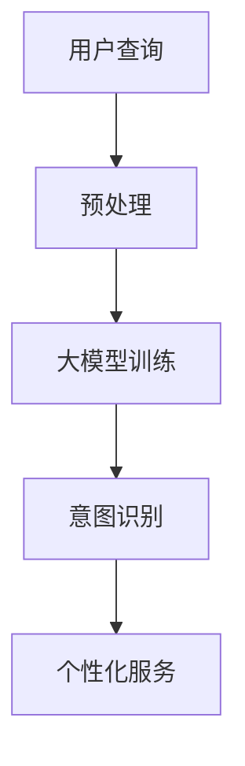

                 

关键词：大模型技术、电商平台、用户意图识别、自然语言处理、机器学习、深度学习

> 摘要：本文将探讨大模型技术在电商平台用户意图识别中的应用，深入分析其核心概念、算法原理、数学模型，并通过实际项目实践，展示其代码实例与详细解释，同时展望未来发展趋势与挑战。

## 1. 背景介绍

随着电商平台的迅猛发展，用户行为数据的规模和复杂性不断增加。为了提高用户体验和业务效率，电商平台需要准确识别用户的意图，从而提供个性化的服务和推荐。用户意图识别（User Intent Recognition）是自然语言处理（NLP）和机器学习（ML）领域的一个重要研究方向，旨在从用户的查询或行为中提取出其意图。

大模型技术，如基于 Transformer 的预训练模型，在 NLP 和 ML 领域取得了显著突破。这些模型通过大规模的数据训练，能够捕捉到复杂的信息结构和语义关系，为用户意图识别提供了强大的工具。本文将重点探讨大模型技术在电商平台用户意图识别中的创新应用。

## 2. 核心概念与联系

### 2.1 大模型技术概述

大模型技术主要包括深度学习（Deep Learning）和自然语言处理（Natural Language Processing，NLP）。深度学习是一种基于多层神经网络进行数据处理的机器学习技术，能够自动从数据中学习复杂的特征表示。NLP 是一门研究语言的结构和计算处理方法的学科，旨在使计算机能够理解和处理自然语言。

### 2.2 电商平台用户意图识别

用户意图识别是 NLP 中的重要任务，旨在理解用户的查询或行为，并将其转化为具体的意图。在电商平台上，用户意图识别可以帮助系统更好地理解用户的需求，提供个性化的推荐和服务。

### 2.3 Mermaid 流程图

下面是一个简化的 Mermaid 流程图，展示大模型技术在电商平台用户意图识别中的应用流程：



## 3. 核心算法原理 & 具体操作步骤

### 3.1 算法原理概述

用户意图识别通常基于深度学习模型，如 Transformer 或 BERT。这些模型通过预训练和微调，能够学习到丰富的语义特征，从而实现对用户意图的准确识别。

### 3.2 算法步骤详解

1. 预处理：对用户查询进行分词、词性标注等预处理操作，以便输入到模型中进行训练。
2. 大模型训练：使用大规模的电商用户数据集对预训练模型进行微调，学习到特定领域的语义特征。
3. 意图识别：将处理后的用户查询输入到训练好的模型中，输出用户意图。
4. 个性化服务：根据识别出的用户意图，提供个性化的商品推荐或服务。

### 3.3 算法优缺点

- 优点：大模型技术能够捕捉到复杂的语义关系，提高用户意图识别的准确性；能够处理大量的用户数据，适应电商平台的需求。
- 缺点：大模型训练和推理需要大量的计算资源和时间；对于小样本数据，模型的泛化能力可能不足。

### 3.4 算法应用领域

用户意图识别技术广泛应用于电商平台、智能客服、语音助手等领域，能够为用户提供更好的服务体验。

## 4. 数学模型和公式 & 详细讲解 & 举例说明

### 4.1 数学模型构建

用户意图识别的数学模型通常是一个分类模型，其目标是将用户查询映射到预定义的意图类别。

### 4.2 公式推导过程

设 \( x \) 为用户查询，\( y \) 为用户意图，模型的目标是最小化损失函数 \( L(x, y) \)：

$$
L(x, y) = -\sum_{i} y_i \log(p_i)
$$

其中，\( p_i \) 为模型对第 \( i \) 个意图的概率预测。

### 4.3 案例分析与讲解

假设我们要识别用户查询“我想买一件红色的羽绒服”的意图。我们使用一个三分类模型，意图类别分别为“购物”、“查询商品详情”和“无意图”。

经过预处理后，用户查询被表示为向量 \( x \)。输入到训练好的模型中，输出概率分布 \( p \)：

$$
p = \begin{bmatrix}
0.8 \\
0.1 \\
0.1
\end{bmatrix}
$$

根据最大后验概率原则，我们选择概率最高的意图作为识别结果，即“购物”。

## 5. 项目实践：代码实例和详细解释说明

### 5.1 开发环境搭建

1. 安装 Python 3.8 或更高版本。
2. 安装必要的库，如 TensorFlow、transformers 等。

### 5.2 源代码详细实现

以下是用户意图识别的简单代码示例：

```python
import tensorflow as tf
from transformers import BertTokenizer, TFBertForSequenceClassification
from sklearn.model_selection import train_test_split

# 加载预训练模型和分词器
tokenizer = BertTokenizer.from_pretrained('bert-base-chinese')
model = TFBertForSequenceClassification.from_pretrained('bert-base-chinese')

# 加载数据集
# （此处为简化的示例，实际项目中需要处理更复杂的数据预处理）
data = [
    ["我想买一件红色的羽绒服", "购物"],
    ["这件羽绒服的尺码是多少", "查询商品详情"],
    ["我不需要任何东西", "无意图"],
]

# 切分数据集
X_train, X_test, y_train, y_test = train_test_split([d[0] for d in data], [d[1] for d in data], test_size=0.2)

# 预处理数据
inputs = tokenizer(X_train, return_tensors='tf', padding=True, truncation=True, max_length=64)

# 训练模型
model.compile(optimizer=tf.keras.optimizers.Adam(learning_rate=3e-5), loss=tf.keras.losses.SparseCategoricalCrossentropy(from_logits=True), metrics=['accuracy'])
model.fit(inputs['input_ids'], y_train, batch_size=8, epochs=3)

# 测试模型
inputs = tokenizer(X_test, return_tensors='tf', padding=True, truncation=True, max_length=64)
predictions = model(inputs['input_ids'])

# 输出测试结果
print("Test accuracy:", (predictions.argmax(axis=1) == y_test).mean())
```

### 5.3 代码解读与分析

1. 加载预训练模型和分词器。
2. 加载并切分数据集。
3. 预处理数据，将文本转换为模型可处理的输入格式。
4. 训练模型，使用 BERT 模型进行序列分类。
5. 测试模型，计算测试准确率。

## 6. 实际应用场景

用户意图识别技术在实际应用中具有重要意义，如：

- 电商平台：提供个性化的商品推荐和搜索结果。
- 智能客服：自动识别用户需求，提供针对性的回复。
- 语音助手：理解用户的语音指令，执行相应操作。

## 7. 工具和资源推荐

- 学习资源：
  - 《深度学习》（Goodfellow et al.）
  - 《自然语言处理实战》（Peter Norvig）
- 开发工具：
  - TensorFlow：用于构建和训练深度学习模型。
  - transformers：用于加载预训练的 Transformer 模型。
- 相关论文：
  - “Attention Is All You Need”（Vaswani et al.）
  - “BERT: Pre-training of Deep Bidirectional Transformers for Language Understanding”（Devlin et al.）

## 8. 总结：未来发展趋势与挑战

### 8.1 研究成果总结

大模型技术在用户意图识别领域取得了显著成果，提高了识别的准确性和效率。未来研究将继续优化模型结构、算法和训练策略，进一步提高性能。

### 8.2 未来发展趋势

- 多模态融合：结合图像、语音等多种数据类型，提高用户意图识别的准确性。
- 强化学习：将强化学习与深度学习相结合，实现更智能的用户意图识别。
- 低资源场景：研究适用于小样本数据、低资源环境的用户意图识别算法。

### 8.3 面临的挑战

- 计算资源消耗：大模型训练和推理需要大量的计算资源和时间。
- 数据隐私：用户数据的安全和隐私保护是重要挑战。

### 8.4 研究展望

用户意图识别技术将在电商、智能客服、语音助手等领域得到广泛应用，未来研究将致力于提高性能、降低计算成本、保护用户隐私。

## 9. 附录：常见问题与解答

### 9.1 问题1：如何处理长文本？

解答：对于长文本，可以采用文本摘要技术，提取关键信息，然后输入到模型中进行处理。

### 9.2 问题2：如何优化模型性能？

解答：可以通过以下方法优化模型性能：
- 数据增强：增加数据多样性，提高模型泛化能力。
- 模型融合：结合多个模型的结果，提高预测准确性。
- 超参数调优：调整学习率、批量大小等超参数，优化模型训练效果。

---

作者：禅与计算机程序设计艺术 / Zen and the Art of Computer Programming

本文基于对大模型技术在电商平台用户意图识别中的创新应用的深入探讨，展示了其核心算法原理、数学模型、项目实践，并对未来发展趋势与挑战进行了展望。希望本文能对读者在相关领域的实践和研究提供有价值的参考和启发。

