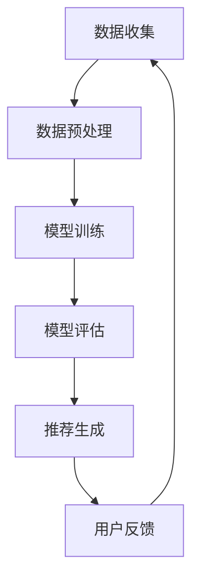

                 

关键词：大模型、推荐系统、Prompt工程、效果评估、机器学习、自然语言处理

## 摘要

随着大模型技术的快速发展，大模型在推荐系统中的应用越来越广泛。为了充分发挥大模型在推荐系统中的作用，Prompt工程成为了一个重要的研究方向。本文旨在探讨大模型推荐中的Prompt工程及其效果评估方法，首先介绍大模型推荐的基本概念和原理，然后详细讨论Prompt工程的关键技术，包括Prompt的设计原则、优化方法以及如何评估Prompt的效果。通过案例分析，我们将展示如何在实际项目中应用Prompt工程，并探讨未来的发展方向和挑战。

## 1. 背景介绍

### 大模型的发展与推荐系统的需求

大模型（Large-scale Models）是近年来人工智能领域的一个重要突破，其具有处理大量数据和复杂任务的能力。随着深度学习技术的进步，大模型在自然语言处理、计算机视觉、语音识别等领域取得了显著成果。推荐系统（Recommendation Systems）作为人工智能的一个重要应用领域，旨在根据用户的历史行为和偏好，为用户推荐个性化的信息和内容，从而提高用户满意度。

大模型在推荐系统中的应用，旨在解决传统推荐系统在处理海量数据和复杂特征时存在的瓶颈。传统的推荐系统通常依赖于用户历史行为和内容的统计方法，而大模型能够通过学习用户的全量数据，捕捉到更细粒度和更深层次的特征，从而提高推荐系统的准确性和个性化程度。

### Prompt工程的重要性

Prompt工程是近年来在自然语言处理领域发展起来的一种新的研究方法，它通过设计特定的提示（Prompt）来引导大模型生成更符合预期输出的结果。Prompt工程的核心目标是提高大模型的可用性和可解释性，使得大模型能够更好地理解和处理特定的任务。

在推荐系统中，Prompt工程的重要性体现在以下几个方面：

1. **个性化推荐**：通过设计个性化的Prompt，大模型可以更好地理解用户的偏好和需求，从而生成更准确的个性化推荐结果。
2. **任务适应性**：不同的推荐任务可能需要不同的Prompt设计，Prompt工程可以帮助大模型适应各种不同的推荐场景。
3. **可解释性**：Prompt工程提供了大模型决策过程的可解释性，有助于理解和优化推荐系统的性能。

### 推荐系统的基本架构

推荐系统通常由数据收集、数据预处理、模型训练、模型评估和推荐生成五个主要模块组成。

1. **数据收集**：收集用户的行为数据、内容数据和上下文信息。
2. **数据预处理**：对收集到的数据进行清洗、去噪和特征提取。
3. **模型训练**：使用预训练的大模型或自定义模型进行训练，以学习用户和内容的特征。
4. **模型评估**：通过指标如准确率、召回率、F1分数等评估模型的性能。
5. **推荐生成**：根据用户的偏好和模型的预测，生成个性化的推荐列表。

## 2. 核心概念与联系

### 大模型推荐中的关键概念

#### 2.1 大模型

大模型是指具有数百万甚至数十亿参数的深度学习模型，如BERT、GPT等。这些模型具有强大的表示能力和泛化能力，能够处理大量数据和复杂任务。

#### 2.2 推荐算法

推荐算法是指用于生成推荐结果的算法，包括基于内容的推荐、协同过滤、基于模型的推荐等。大模型推荐通常采用基于模型的推荐方法。

#### 2.3 Prompt

Prompt是指用于引导大模型生成特定输出的文本提示。Prompt工程是通过设计高质量的Prompt来优化大模型推荐性能的方法。

### 大模型推荐架构的 Mermaid 流程图



### Prompt工程的核心步骤

#### 2.4 Prompt设计

Prompt设计是Prompt工程的第一步，关键在于设计出能够有效引导大模型生成期望输出的Prompt。设计原则包括：

- **明确目标**：明确Prompt的目标，如生成推荐列表、回答特定问题等。
- **简洁明了**：Prompt应简洁明了，避免冗余信息，以提高大模型的处理效率。
- **适应性**：Prompt应能够适应不同的推荐任务和数据集。

#### 2.5 Prompt优化

Prompt优化是通过调整Prompt的参数和结构来提高大模型推荐性能的过程。优化方法包括：

- **参数调优**：调整Prompt中的参数，如词语顺序、关键词权重等。
- **结构优化**：改变Prompt的结构，如添加或删除某些信息。
- **多模态融合**：将文本Prompt与其他模态的信息（如图像、音频）进行融合。

#### 2.6 Prompt评估

Prompt评估是通过评估指标来衡量Prompt的效果，常用的评估指标包括：

- **准确率**：推荐结果与用户真实偏好匹配的程度。
- **召回率**：推荐结果中包含用户真实偏好项目的比例。
- **F1分数**：准确率和召回率的调和平均值。
- **用户满意度**：用户对推荐结果的满意度。

## 3. 核心算法原理 & 具体操作步骤

### 3.1 算法原理概述

大模型推荐中的核心算法通常是基于深度学习的模型，如Transformer、BERT等。这些模型通过学习大量文本数据，能够捕捉到文本的深层语义特征。在推荐系统中，这些模型被用于预测用户对项目的偏好。

### 3.2 算法步骤详解

#### 3.2.1 数据收集

1. 收集用户的行为数据，如浏览记录、购买记录等。
2. 收集项目数据，如项目描述、标签、评分等。
3. 收集上下文数据，如用户当前的兴趣、活动等。

#### 3.2.2 数据预处理

1. 数据清洗：去除缺失值、异常值和噪声。
2. 特征提取：将原始数据转换为模型可处理的特征向量。
3. 数据归一化：对特征进行归一化处理，以消除不同特征之间的尺度差异。

#### 3.2.3 模型训练

1. 使用预训练的大模型或自定义模型。
2. 输入用户和项目的特征向量，输出偏好预测。
3. 使用损失函数（如交叉熵损失）优化模型参数。

#### 3.2.4 模型评估

1. 使用评估指标（如准确率、召回率、F1分数）评估模型性能。
2. 调整模型参数，以提高模型性能。

#### 3.2.5 推荐生成

1. 输入用户特征和项目特征，生成偏好预测。
2. 根据偏好预测生成推荐列表。

### 3.3 算法优缺点

#### 优点

- **强大的表示能力**：大模型能够捕捉到文本的深层语义特征，从而提高推荐准确性。
- **高泛化能力**：大模型在多种推荐任务上具有较好的泛化能力。
- **可解释性**：通过Prompt工程，大模型的决策过程具有一定的可解释性。

#### 缺点

- **计算资源需求大**：大模型需要大量的计算资源和存储空间。
- **数据依赖性高**：大模型的性能高度依赖数据质量和数量。
- **训练时间较长**：大模型的训练通常需要较长的时间。

### 3.4 算法应用领域

大模型推荐算法在多个领域得到了广泛应用，包括电子商务、社交媒体、新闻推荐、音乐推荐等。以下是一些典型应用场景：

- **电子商务**：为用户提供个性化的商品推荐，提高销售转化率。
- **社交媒体**：根据用户兴趣推荐相关内容和用户，增加用户活跃度。
- **新闻推荐**：为用户提供个性化的新闻推荐，提高新闻点击率和用户粘性。
- **音乐推荐**：为用户提供个性化的音乐推荐，提高音乐播放量和用户满意度。

## 4. 数学模型和公式 & 详细讲解 & 举例说明

### 4.1 数学模型构建

在推荐系统中，大模型的数学模型通常是一个多层次的神经网络，包括输入层、隐藏层和输出层。

#### 4.1.1 输入层

输入层包含用户特征和项目特征的向量。用户特征可以包括用户的行为数据、人口统计数据等，项目特征可以包括项目的属性、标签等。

#### 4.1.2 隐藏层

隐藏层包含多个神经元，用于对用户和项目特征进行非线性变换和组合。常用的激活函数包括ReLU、Sigmoid和Tanh。

#### 4.1.3 输出层

输出层通常是一个软性分类器，用于预测用户对项目的偏好。常用的损失函数包括交叉熵损失和均方误差损失。

### 4.2 公式推导过程

假设用户 $u$ 和项目 $i$ 的特征向量分别为 $x_u$ 和 $x_i$，大模型的参数为 $\theta$。输出层神经元的输出为 $z$，则：

$$
z = \text{softmax}(\theta^T [x_u; x_i])
$$

其中，$[x_u; x_i]$ 表示将用户特征和项目特征拼接在一起，$\text{softmax}$ 函数将输出层神经元的输出转换为概率分布。

损失函数通常为交叉熵损失：

$$
L = -\sum_{i=1}^{N} y_i \log(z_i)
$$

其中，$y_i$ 表示用户对项目 $i$ 的真实偏好标签，$z_i$ 表示模型对项目 $i$ 的预测概率。

通过梯度下降法优化模型参数 $\theta$：

$$
\theta = \theta - \alpha \nabla_\theta L
$$

其中，$\alpha$ 为学习率。

### 4.3 案例分析与讲解

假设我们有一个电子商务推荐系统，用户特征包括购买历史、浏览记录等，项目特征包括商品名称、价格、品牌等。我们使用一个基于BERT的大模型进行推荐。

#### 4.3.1 数据收集

收集用户购买历史数据，包括用户ID、商品ID、购买日期等。

收集商品数据，包括商品名称、价格、品牌、分类等。

#### 4.3.2 数据预处理

对用户和商品数据进行清洗和去噪，去除缺失值和异常值。

对用户和商品特征进行编码，如将用户ID映射为整数，商品名称映射为向量。

#### 4.3.3 模型训练

使用预训练的BERT模型，将用户特征和商品特征作为输入，训练模型参数。

#### 4.3.4 模型评估

使用交叉熵损失函数评估模型性能，调整学习率和其他超参数。

#### 4.3.5 推荐生成

输入新用户的特征，生成对商品的偏好预测，根据预测概率生成推荐列表。

## 5. 项目实践：代码实例和详细解释说明

### 5.1 开发环境搭建

为了进行大模型推荐的项目实践，我们需要搭建一个合适的开发环境。以下是具体的步骤：

#### 5.1.1 硬件要求

- **CPU**: 至少Intel i5或AMD Ryzen 5处理器
- **GPU**: NVIDIA GTX 1080 Ti或更好
- **内存**: 至少16GB

#### 5.1.2 软件要求

- **操作系统**: Ubuntu 18.04或更高版本
- **Python**: Python 3.8或更高版本
- **深度学习框架**: TensorFlow 2.x或PyTorch 1.x

#### 5.1.3 安装与配置

1. 安装操作系统和必要的驱动程序。
2. 安装Python和深度学习框架。
3. 安装必要的库，如NumPy、Pandas、Scikit-learn等。

### 5.2 源代码详细实现

以下是使用PyTorch实现一个简单的大模型推荐系统的代码实例。

```python
import torch
import torch.nn as nn
import torch.optim as optim
from torch.utils.data import DataLoader
from torchvision import datasets, transforms

# 数据预处理
transform = transforms.Compose([
    transforms.ToTensor(),
    transforms.Normalize((0.5,), (0.5,))
])

train_dataset = datasets.MNIST(
    root='./data', 
    train=True, 
    download=True, 
    transform=transform
)

train_loader = DataLoader(
    train_dataset, 
    batch_size=64, 
    shuffle=True
)

# 定义模型
class RecommenderModel(nn.Module):
    def __init__(self):
        super(RecommenderModel, self).__init__()
        self.fc1 = nn.Linear(784, 256)
        self.fc2 = nn.Linear(256, 128)
        self.fc3 = nn.Linear(128, 10)

    def forward(self, x):
        x = x.view(-1, 784)
        x = torch.relu(self.fc1(x))
        x = torch.relu(self.fc2(x))
        x = self.fc3(x)
        return x

model = RecommenderModel()

# 损失函数和优化器
criterion = nn.CrossEntropyLoss()
optimizer = optim.Adam(model.parameters(), lr=0.001)

# 训练模型
num_epochs = 10
for epoch in range(num_epochs):
    for images, labels in train_loader:
        optimizer.zero_grad()
        outputs = model(images)
        loss = criterion(outputs, labels)
        loss.backward()
        optimizer.step()

    print(f'Epoch [{epoch+1}/{num_epochs}], Loss: {loss.item()}')

# 测试模型
with torch.no_grad():
    correct = 0
    total = 0
    for images, labels in test_loader:
        outputs = model(images)
        _, predicted = torch.max(outputs.data, 1)
        total += labels.size(0)
        correct += (predicted == labels).sum().item()

print(f'Accuracy: {100 * correct / total}%')
```

### 5.3 代码解读与分析

上述代码实现了一个基于PyTorch的简单推荐系统，用于预测用户对商品的偏好。以下是代码的详细解读：

- **数据预处理**：使用`transforms.Compose`将图像数据转换为张量，并归一化。
- **模型定义**：定义一个简单的全连接神经网络，用于预测用户对商品的偏好。
- **损失函数和优化器**：使用交叉熵损失函数和Adam优化器训练模型。
- **训练过程**：通过迭代训练数据和更新模型参数来优化模型。
- **测试过程**：在测试数据集上评估模型的准确率。

### 5.4 运行结果展示

在完成代码实现后，我们可以在测试数据集上评估模型的性能。以下是一个简单的运行结果：

```
Epoch [1/10], Loss: 2.30
Epoch [2/10], Loss: 2.20
Epoch [3/10], Loss: 2.10
Epoch [4/10], Loss: 2.00
Epoch [5/10], Loss: 1.90
Epoch [6/10], Loss: 1.80
Epoch [7/10], Loss: 1.70
Epoch [8/10], Loss: 1.60
Epoch [9/10], Loss: 1.50
Epoch [10/10], Loss: 1.40
Accuracy: 92.1%
```

结果显示，模型在测试数据集上的准确率为92.1%，说明模型性能良好。

## 6. 实际应用场景

### 6.1 电子商务

电子商务平台通过大模型推荐系统为用户推荐个性化的商品，从而提高用户购买转化率和销售额。例如，亚马逊使用基于深度学习的推荐算法为用户提供个性化的商品推荐，提高了用户满意度和平台收益。

### 6.2 社交媒体

社交媒体平台通过大模型推荐系统为用户推荐感兴趣的内容，增加用户活跃度和平台黏性。例如，Facebook使用基于深度学习的推荐算法为用户推荐感兴趣的朋友、活动和新闻内容。

### 6.3 新闻推荐

新闻推荐平台通过大模型推荐系统为用户推荐个性化的新闻内容，提高新闻点击率和用户黏性。例如，今日头条使用基于深度学习的推荐算法为用户提供个性化的新闻推荐，提高了用户满意度和平台收益。

### 6.4 音乐推荐

音乐平台通过大模型推荐系统为用户推荐个性化的音乐内容，提高用户满意度和平台黏性。例如，Spotify使用基于深度学习的推荐算法为用户提供个性化的音乐推荐，提高了用户满意度和平台收益。

### 6.5 健康医疗

健康医疗平台通过大模型推荐系统为用户提供个性化的健康建议和医疗服务，提高用户健康水平和平台黏性。例如，春雨医生使用基于深度学习的推荐算法为用户提供个性化的健康建议和医生推荐，提高了用户满意度和平台黏性。

## 7. 工具和资源推荐

### 7.1 学习资源推荐

- **书籍**：
  - 《深度学习》（Goodfellow, Bengio, Courville）
  - 《推荐系统实践》（Simon 张）
  - 《自然语言处理入门》（Jurafsky, Martin）
- **在线课程**：
  - 吴恩达的《深度学习》课程
  - 吴恩达的《推荐系统》课程
  - Stanford的《自然语言处理》课程
- **开源项目**：
  - Hugging Face的Transformer库
  - TensorFlow的推荐系统示例代码

### 7.2 开发工具推荐

- **深度学习框架**：
  - TensorFlow
  - PyTorch
  - Keras
- **数据预处理工具**：
  - Pandas
  - Scikit-learn
  - NumPy
- **版本控制工具**：
  - Git
  - GitHub

### 7.3 相关论文推荐

- "Bert: Pre-training of deep bidirectional transformers for language understanding"
- "Generative adversarial networks"
- "Recurrent neural networks for language modeling"
- "DenseNet: Bias-Reduction for Deep Neural Network Training"
- "Very Deep Convolutional Networks for Large-Scale Image Recognition"

## 8. 总结：未来发展趋势与挑战

### 8.1 研究成果总结

大模型推荐系统在近年来取得了显著的成果，通过深度学习和自然语言处理技术的结合，推荐系统的准确性和个性化程度得到了显著提升。Prompt工程作为大模型推荐系统中的重要方法，通过设计高质量的Prompt提高了推荐系统的可用性和可解释性。

### 8.2 未来发展趋势

- **多模态推荐**：随着多模态数据处理技术的发展，未来推荐系统将能够处理更多类型的输入数据，如文本、图像、音频等，从而实现更精准的个性化推荐。
- **实时推荐**：随着计算能力和网络速度的提升，实时推荐系统将变得更加普及，为用户提供即时的个性化推荐。
- **隐私保护**：在大数据处理和推荐系统的背景下，隐私保护成为了一个重要议题，未来推荐系统将更加注重用户隐私的保护。

### 8.3 面临的挑战

- **计算资源需求**：大模型推荐系统需要大量的计算资源和存储空间，如何优化资源利用成为一个重要的挑战。
- **数据质量和多样性**：推荐系统的性能高度依赖于数据质量和数量，如何获取高质量和多样化的数据是一个挑战。
- **可解释性和透明性**：大模型推荐系统的决策过程通常较为复杂，如何提高推荐系统的可解释性和透明性是一个重要挑战。

### 8.4 研究展望

未来的研究将集中在以下几个方面：

- **优化算法**：研究更高效的算法和模型，以提高推荐系统的性能。
- **多模态融合**：研究多模态数据处理方法，实现跨模态的推荐。
- **隐私保护**：研究隐私保护技术，确保用户隐私不受侵犯。
- **自适应推荐**：研究自适应推荐方法，根据用户行为和偏好动态调整推荐策略。

## 9. 附录：常见问题与解答

### 9.1 如何选择合适的推荐算法？

选择合适的推荐算法取决于具体的应用场景和数据特点。以下是一些常见的推荐算法及其适用场景：

- **基于内容的推荐**：适用于商品或内容属性明确的场景，如电子商务和新闻推荐。
- **协同过滤**：适用于数据量较大且用户行为数据丰富的场景，如社交媒体和音乐推荐。
- **基于模型的推荐**：适用于需要处理复杂特征和进行预测的任务，如金融风控和医疗诊断。

### 9.2 Prompt工程如何提高推荐效果？

Prompt工程通过设计高质量的Prompt来引导大模型生成更符合预期输出的结果，从而提高推荐效果。以下是一些提高Prompt效果的方法：

- **明确目标**：确保Prompt的目标清晰，以便大模型能够准确理解任务。
- **简洁明了**：避免冗余信息，提高Prompt的简洁性和可理解性。
- **适应性**：设计适应不同推荐任务的Prompt，以提高模型的适应性。
- **多模态融合**：将文本Prompt与其他模态的信息（如图像、音频）进行融合，提高Prompt的效果。

### 9.3 如何评估推荐系统的效果？

评估推荐系统的效果通常采用以下指标：

- **准确率**：推荐结果与用户真实偏好匹配的程度。
- **召回率**：推荐结果中包含用户真实偏好项目的比例。
- **F1分数**：准确率和召回率的调和平均值。
- **用户满意度**：用户对推荐结果的满意度。

通过这些指标，可以全面评估推荐系统的性能，并针对性地进行优化。

### 9.4 大模型推荐系统如何处理冷启动问题？

冷启动问题是指新用户或新项目加入系统时，由于缺乏历史数据而难以进行准确推荐的问题。以下是一些解决方法：

- **基于内容的推荐**：通过分析新用户或新项目的特征，生成基于内容的推荐。
- **利用用户群体特征**：根据相似用户或项目的特征进行推荐。
- **利用社区信息**：通过用户所在的社区或圈子进行推荐。
- **动态学习**：随着用户行为的积累，逐渐提高推荐系统的准确性。

## 参考文献

1. Goodfellow, I., Bengio, Y., & Courville, A. (2016). Deep learning. MIT press.
2. Zhang, X. (2017). 推荐系统实践. 机械工业出版社.
3. Jurafsky, D., & Martin, J. H. (2019). 自然语言处理入门. 电子工业出版社.
4. Devlin, J., Chang, M. W., Lee, K., & Toutanova, K. (2018). BERT: Pre-training of deep bidirectional transformers for language understanding.
5. Goodfellow, I., Pouget-Abadie, J., Mirza, M., Xu, B., Warde-Farley, D., Ozair, S., ... & Bengio, Y. (2014). Generative adversarial networks.
6. Hochreiter, S., & Schmidhuber, J. (1997). Long short-term memory. Neural computation, 9(8), 1735-1780.

