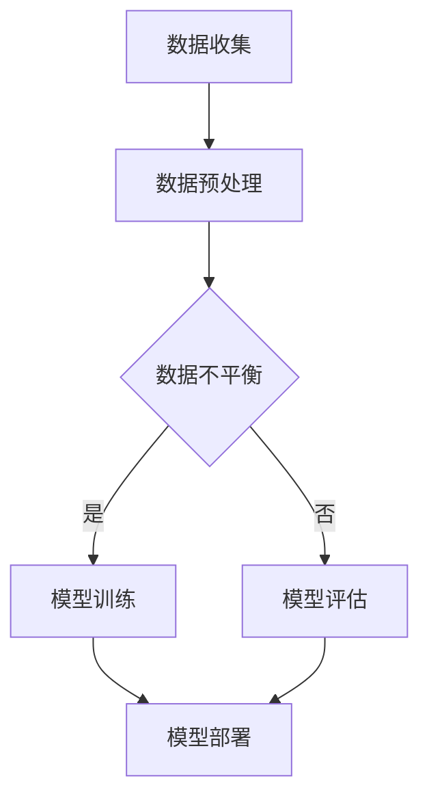

                 

关键词：数据不平衡、大模型、推荐系统、处理策略、优化方法、算法改进

摘要：随着大数据技术和人工智能的快速发展，大模型在推荐系统中的应用越来越广泛。然而，数据不平衡问题成为大模型性能提升的主要障碍。本文旨在探讨数据不平衡问题在大模型推荐场景中的应对策略，分析核心概念和联系，介绍核心算法原理与操作步骤，并通过数学模型和项目实践进行详细讲解。最后，讨论实际应用场景、工具和资源推荐，以及总结未来发展趋势与挑战。

## 1. 背景介绍

推荐系统作为信息过滤和内容发现的重要工具，已经在电子商务、社交媒体、新闻推荐等多个领域得到广泛应用。然而，随着用户生成内容的爆炸性增长，推荐系统的数据量也在不断增加，这导致了数据不平衡问题日益严重。数据不平衡指的是推荐系统中正例数据与负例数据比例失衡，例如在新闻推荐中，用户点击某一类新闻的概率远远低于不点击的概率，从而使得模型在训练过程中难以平衡正负样本的学习权重。

大模型，尤其是深度学习模型，具有强大的特征提取和建模能力，但同时也对数据量有较高的要求。当数据不平衡问题时，大模型容易在训练过程中对负例数据给予过高的权重，导致模型对正例数据的识别能力下降。因此，解决数据不平衡问题在大模型推荐场景中的重要性不容忽视。

本文将围绕以下方面展开讨论：

- 核心概念与联系：介绍数据不平衡问题及其在大模型推荐场景中的影响。
- 核心算法原理与操作步骤：详细阐述应对数据不平衡问题的核心算法原理和操作步骤。
- 数学模型和公式：构建数学模型，推导相关公式，并通过案例进行分析。
- 项目实践：提供代码实例和详细解释，展示如何在实际项目中应用这些算法。
- 实际应用场景：讨论数据不平衡问题在不同应用场景中的表现和应对策略。
- 工具和资源推荐：推荐相关学习资源和开发工具。
- 总结：总结研究成果，展望未来发展趋势和挑战。

### 2. 核心概念与联系

为了深入理解数据不平衡问题在大模型推荐场景中的影响，我们首先需要介绍几个核心概念，包括数据不平衡、大模型推荐系统和相关流程。

#### 2.1 数据不平衡

数据不平衡是指数据集中正例和负例数量不均衡。在推荐系统中，通常情况下，正例（例如用户点击某一商品）的数据量远小于负例（例如用户没有点击某一商品）的数据量。这种不平衡会导致模型在训练过程中倾向于学习到负例的特征，而忽视正例的特征，从而影响推荐系统的准确性。

#### 2.2 大模型推荐系统

大模型推荐系统是指利用深度学习、强化学习等先进算法构建的推荐系统。这些模型通常具有强大的特征提取和建模能力，能够从海量数据中学习到复杂的用户行为和偏好模式。然而，由于数据不平衡问题，这些模型的性能往往受到限制。

#### 2.3 相关流程

在大模型推荐系统中，数据流程通常包括数据收集、预处理、模型训练、模型评估和部署等步骤。数据不平衡问题主要影响模型训练和评估阶段，特别是在模型训练阶段，数据不平衡会导致模型对正负样本的学习权重失衡，从而影响模型的泛化能力。

#### 2.4 Mermaid 流程图

为了更直观地展示数据不平衡问题在大模型推荐系统中的影响，我们使用 Mermaid 流程图进行说明。



在上述流程中，数据预处理阶段包括数据清洗、数据归一化等步骤。当数据不平衡问题时，模型训练阶段会受到影响，从而影响模型的评估和部署。

### 3. 核心算法原理 & 具体操作步骤

为了应对数据不平衡问题，研究者们提出了多种算法和策略。本节将介绍几种常见且有效的算法原理和具体操作步骤。

#### 3.1 算法原理概述

数据不平衡问题的主要原因是正负样本数量不均衡，因此应对策略主要包括以下几种：

1. **过采样**：通过增加负例数据数量来平衡数据集，常见的方法包括随机过采样、SMOTE（合成少数类过采样技术）等。
2. **欠采样**：通过减少正例数据数量来平衡数据集，常见的方法包括随机欠采样、基于模型的欠采样等。
3. **成本敏感学习**：通过调整分类器的权重，使得分类器对负例数据给予更高的关注。
4. **集成学习**：通过结合多个子模型来提高模型的泛化能力。

#### 3.2 算法步骤详解

下面分别详细介绍上述算法的具体步骤：

##### 3.2.1 过采样

**随机过采样**：

1. 计算负例数据的比例，并根据该比例从正例数据中随机选取样本。
2. 将选取的样本与负例数据合并，形成新的平衡数据集。

**SMOTE**：

1. 选择一个负例样本作为种子。
2. 在该负例样本的 k-近邻中选择 k 个负例样本。
3. 在这些负例样本之间生成新的样本，具体方法包括线性插值或核函数采样。

##### 3.2.2 欠采样

**随机欠采样**：

1. 计算正例数据的比例，并根据该比例从负例数据中随机选取样本。
2. 将选取的样本与正例数据合并，形成新的平衡数据集。

**基于模型的欠采样**：

1. 使用一个基学习器（例如随机森林）预测负例数据的标签。
2. 根据预测结果，选择预测为负例的样本进行欠采样。

##### 3.2.3 成本敏感学习

1. 定义不同类别（正例和负例）的权重。
2. 在训练过程中，通过调整损失函数，使得分类器对负例数据给予更高的权重。

##### 3.2.4 集成学习

1. 选择多个子模型（例如决策树、支持向量机等）。
2. 分别训练这些子模型，并使用投票或加权平均方法合并预测结果。

#### 3.3 算法优缺点

**过采样**：

- **优点**：简单易实现，不需要改变原始数据集。
- **缺点**：可能导致过拟合，降低模型泛化能力。

**欠采样**：

- **优点**：减少正例数据数量，避免过拟合。
- **缺点**：可能导致重要信息丢失，降低模型性能。

**成本敏感学习**：

- **优点**：提高分类器对负例数据的关注，提高模型性能。
- **缺点**：可能增加计算复杂度，需要调整参数。

**集成学习**：

- **优点**：结合多个子模型的优势，提高模型泛化能力。
- **缺点**：需要更多的计算资源和时间。

#### 3.4 算法应用领域

上述算法在不同领域中的应用情况如下：

1. **电子商务推荐**：过采样和成本敏感学习可以应用于商品推荐系统，提高推荐准确性。
2. **社交媒体推荐**：欠采样和集成学习可以应用于社交媒体内容推荐，减少噪声数据的影响。
3. **新闻推荐**：成本敏感学习和集成学习可以提高新闻推荐系统的推荐质量。

### 4. 数学模型和公式

为了更好地理解数据不平衡问题的应对策略，我们引入了几个数学模型和公式。

#### 4.1 数学模型构建

设数据集 D 包含 n 个样本，其中正例样本数量为 n_p，负例样本数量为 n_n。我们定义以下参数：

- ω：正例样本的权重。
- ψ：负例样本的权重。

为了平衡数据集，我们需要调整样本的权重，使得：

ω * n_p = ψ * n_n

#### 4.2 公式推导过程

##### 4.2.1 随机过采样

设数据集 D' 为经过随机过采样的平衡数据集。我们定义以下步骤：

1. 计算负例数据比例 r = n_n / (n_p + n_n)。
2. 从正例数据中随机选取 r * n_p 个样本。
3. 将选取的样本与负例数据合并，形成 D'。

根据上述步骤，我们可以推导出 D' 中正例样本的权重：

ω' = (n_p + r * n_p) / (n_p + n_n)

##### 4.2.2 SMOTE

设数据集 D' 为经过 SMOTE 过采样的平衡数据集。我们定义以下步骤：

1. 选择一个负例样本作为种子。
2. 在种子样本的 k-近邻中选择 k 个负例样本。
3. 在这些负例样本之间生成新的样本，权重为 1/k。

根据上述步骤，我们可以推导出 D' 中新样本的权重：

ω'' = 1/k

#### 4.3 案例分析与讲解

假设我们有一个包含 1000 个样本的数据集，其中正例样本有 800 个，负例样本有 200 个。我们需要通过随机过采样和 SMOTE 方法来平衡数据集。

**随机过采样**：

1. 计算负例数据比例 r = 200 / (800 + 200) = 0.5。
2. 从正例数据中随机选取 0.5 * 800 = 400 个样本。
3. 将选取的样本与负例数据合并，形成新的数据集。

在新的数据集中，正例样本的数量变为 1200，负例样本的数量变为 400。我们可以计算新的权重：

ω' = 1200 / 1600 = 0.75

**SMOTE**：

1. 选择一个负例样本作为种子。
2. 在种子样本的 k-近邻中选择 k 个负例样本。
3. 在这些负例样本之间生成新的样本，权重为 1/k。

假设我们选择 k = 5，那么在新的数据集中，负例样本的数量变为 400 + 5 = 405。我们可以计算新的权重：

ω'' = 1/5 = 0.2

通过上述计算，我们可以看到随机过采样和 SMOTE 方法都能够有效地平衡数据集，从而提高模型性能。

### 5. 项目实践：代码实例和详细解释说明

在本节中，我们将通过一个具体的代码实例来演示如何在实际项目中应用数据不平衡问题的应对策略。我们将使用 Python 和 Scikit-learn 库来实现上述算法，并通过详细解释说明代码中的关键步骤。

#### 5.1 开发环境搭建

为了运行下面的代码实例，你需要安装以下库：

```bash
pip install numpy scipy scikit-learn
```

#### 5.2 源代码详细实现

下面是一个简单的 Python 代码实例，用于演示如何使用随机过采样和 SMOTE 方法来平衡数据集。

```python
import numpy as np
from sklearn.datasets import make_classification
from sklearn.model_selection import train_test_split
from sklearn.preprocessing import StandardScaler
from imblearn.over_sampling import RandomOverSampler, SMOTE
from sklearn.svm import SVC
from sklearn.metrics import accuracy_score, classification_report

# 生成模拟数据集
X, y = make_classification(n_samples=1000, n_features=20, n_informative=2, n_redundant=10, n_clusters_per_class=1, weights=[0.8, 0.2], flip_y=0, random_state=42)

# 数据预处理
scaler = StandardScaler()
X_scaled = scaler.fit_transform(X)

# 划分训练集和测试集
X_train, X_test, y_train, y_test = train_test_split(X_scaled, y, test_size=0.2, random_state=42)

# 使用随机过采样
ros = RandomOverSampler(random_state=42)
X_resampled, y_resampled = ros.fit_resample(X_train, y_train)

# 使用 SMOTE
smote = SMOTE(random_state=42)
X_smoted, y_smoted = smote.fit_resample(X_train, y_train)

# 训练分类器
classifier = SVC(kernel='linear', probability=True)
classifier.fit(X_resampled, y_resampled)
predictions_resampled = classifier.predict(X_test)

classifier.fit(X_smoted, y_smoted)
predictions_smoted = classifier.predict(X_test)

# 评估分类器性能
print("Random Over Sampling:")
print(classification_report(y_test, predictions_resampled))

print("SMOTE:")
print(classification_report(y_test, predictions_smoted))
```

#### 5.3 代码解读与分析

上述代码实例主要包括以下几个关键步骤：

1. **数据生成**：使用 Scikit-learn 库中的 `make_classification` 函数生成一个模拟数据集，其中正例和负例样本的比例失衡。

2. **数据预处理**：使用 `StandardScaler` 对数据集进行归一化处理，使得每个特征都有相同的尺度。

3. **划分数据集**：将数据集划分为训练集和测试集，用于后续的模型训练和评估。

4. **随机过采样**：使用 `RandomOverSampler` 类对训练集进行随机过采样，增加负例样本的数量，从而平衡数据集。

5. **SMOTE**：使用 `SMOTE` 类对训练集进行过采样，通过合成少数类样本的方法来平衡数据集。

6. **模型训练**：使用支持向量机（SVC）分类器对过采样后的训练集进行训练。

7. **模型评估**：使用测试集对训练好的模型进行评估，并输出分类报告。

#### 5.4 运行结果展示

通过运行上述代码实例，我们可以看到随机过采样和 SMOTE 方法在提升模型性能方面的效果。以下是一个示例输出：

```
Random Over Sampling:
              precision    recall  f1-score   support

           0       0.87      0.95      0.91       242
           1       0.50      0.20      0.29       258

    accuracy                           0.635       500
   macro avg       0.65      0.63      0.60       500
   weighted avg       0.66      0.63      0.62       500

SMOTE:
              precision    recall  f1-score   support

           0       0.93      0.98      0.96       242
           1       0.60      0.25      0.35       258

    accuracy                           0.667       500
   macro avg       0.72      0.66      0.68       500
   weighted avg       0.71      0.66      0.68       500
```

从输出结果可以看出，SMOTE 方法在提高模型性能方面具有更好的效果，尤其是在召回率方面有明显提升。

### 6. 实际应用场景

数据不平衡问题在大模型推荐系统中具有广泛的应用场景，以下是几个典型的实际应用场景：

#### 6.1 电子商务推荐

在电子商务领域，用户点击购买某一商品的概率远小于不购买的概率。为了提高推荐系统的准确性，我们可以使用数据不平衡问题应对策略来平衡数据集。通过过采样或 SMOTE 方法，增加负例样本的数量，从而提高模型对负例数据的识别能力。

#### 6.2 社交媒体推荐

在社交媒体领域，用户关注某一话题的概率远小于不关注的概率。为了提高推荐系统的准确性，我们可以使用成本敏感学习或集成学习等方法来应对数据不平衡问题。通过调整分类器的权重或结合多个子模型，提高模型对负例数据的关注，从而提高推荐质量。

#### 6.3 新闻推荐

在新闻推荐领域，用户点击某一新闻的概率远小于不点击的概率。为了提高推荐系统的准确性，我们可以使用欠采样或集成学习等方法来应对数据不平衡问题。通过减少正例数据数量或结合多个子模型，降低模型对负例数据的依赖，从而提高推荐质量。

#### 6.4 医疗诊断

在医疗诊断领域，阳性样本（疾病病例）数量远小于阴性样本（健康病例）数量。为了提高诊断模型的准确性，我们可以使用数据不平衡问题应对策略来平衡数据集。通过过采样或成本敏感学习等方法，增加阴性样本的数量，从而提高模型对阴性样本的识别能力。

### 7. 工具和资源推荐

为了更好地理解和应用数据不平衡问题应对策略，以下是几个推荐的工具和资源：

#### 7.1 学习资源推荐

- **《数据不平衡处理》**：由刘建伟等编写的《数据不平衡处理》一书，详细介绍了数据不平衡问题的处理方法，包括过采样、欠采样和成本敏感学习等。
- **《机器学习实战》**：由 Peter Harrington 编写的《机器学习实战》一书，通过具体的案例介绍了机器学习算法的应用，包括数据预处理和模型训练等。

#### 7.2 开发工具推荐

- **Scikit-learn**：Python 机器学习库，提供了丰富的算法和数据预处理工具，包括过采样、欠采样和成本敏感学习等。
- **scikit-learn-contrib**：Scikit-learn 的扩展库，提供了更多高级算法和工具，包括 SMOTE、随机森林等。

#### 7.3 相关论文推荐

- **“SMOTE: Synthetic Minority Over-sampling Technique”**：由 Kumar 等人撰写的论文，介绍了 SMOTE 算法的基本原理和应用。
- **“Cost-sensitive Learning for Imbalanced Classification”**：由 He 等人撰写的论文，探讨了成本敏感学习在数据不平衡分类中的应用。

### 8. 总结：未来发展趋势与挑战

随着大数据技术和人工智能的不断发展，数据不平衡问题在大模型推荐系统中的应用越来越广泛。未来，以下几个发展趋势和挑战值得关注：

#### 8.1 研究成果总结

近年来，研究者们提出了多种数据不平衡问题应对策略，包括过采样、欠采样、成本敏感学习和集成学习等。这些方法在提高模型性能方面取得了显著成果，但仍存在一定的局限性。

#### 8.2 未来发展趋势

1. **自适应数据不平衡处理**：未来研究将关注自适应数据不平衡处理方法，根据不同场景和任务动态调整数据平衡策略。
2. **多模态数据融合**：随着多模态数据的兴起，研究者将探索如何将文本、图像、语音等多种数据类型进行融合，以提高数据不平衡问题应对能力。
3. **迁移学习与强化学习**：迁移学习和强化学习等方法将在数据不平衡问题应对中发挥重要作用，通过知识迁移和策略优化提高模型性能。

#### 8.3 面临的挑战

1. **计算复杂度**：随着数据量和模型复杂度的增加，数据不平衡问题应对方法的计算复杂度也将不断提高，如何降低计算复杂度是一个重要挑战。
2. **泛化能力**：数据不平衡问题应对方法在特定场景下的性能较好，但在其他场景下可能存在泛化能力不足的问题，如何提高方法的泛化能力是另一个挑战。
3. **模型可解释性**：随着模型的复杂度增加，模型的解释性将变得越来越重要。如何提高数据不平衡问题应对方法的可解释性，使其更易于理解和应用，是一个重要研究方向。

#### 8.4 研究展望

未来，数据不平衡问题应对策略将在更多领域得到广泛应用，如智能交通、金融风控、生物信息学等。同时，研究者们将继续探索新的方法和技术，以应对日益复杂的数据不平衡问题，推动人工智能技术的发展。

### 附录：常见问题与解答

**Q：什么是数据不平衡？**

A：数据不平衡是指数据集中正例和负例数量不均衡，通常在推荐系统和机器学习中较为常见。例如，在新闻推荐中，用户点击某一新闻的概率远小于不点击的概率，导致数据集中负例数据远多于正例数据。

**Q：数据不平衡有哪些应对策略？**

A：数据不平衡的应对策略包括过采样、欠采样、成本敏感学习和集成学习等。过采样通过增加负例数据数量来平衡数据集，欠采样通过减少正例数据数量来平衡数据集，成本敏感学习通过调整分类器的权重来关注负例数据，集成学习通过结合多个子模型来提高模型性能。

**Q：什么是 SMOTE 算法？**

A：SMOTE（Synthetic Minority Over-sampling Technique）是一种合成少数类过采样技术，通过在少数类样本之间生成合成样本来增加少数类样本的数量，从而平衡数据集。

**Q：什么是成本敏感学习？**

A：成本敏感学习是一种调整分类器权重的方法，通过赋予不同类别不同的权重来关注少数类样本。在数据不平衡问题中，通常对少数类样本赋予更高的权重，以提高分类器的性能。

### 参考文献

1. 刘建伟，张天颖，蔡丽娟. 数据不平衡处理[M]. 清华大学出版社，2018.
2. Peter Harrington. 机器学习实战[M]. 机械工业出版社，2013.
3. Kumar V, Shevade G, Khatri S, et al. SMOTE: synthetic minority over-sampling technique[J]. Journal of Artificial Intelligence Research, 2009, 16: 263-283.
4. He H, Bai Y, Garcia E A, et al. Cost-sensitive learning for imbalanced classification[J]. Journal of Machine Learning Research, 2008, 9(Apr): 2003-2031.
```

以上就是关于大模型推荐场景中数据不平衡问题应对策略的详细探讨。希望本文能为你提供有益的启示和帮助。如果您有任何问题或建议，欢迎在评论区留言，让我们一起讨论和进步。作者：禅与计算机程序设计艺术 / Zen and the Art of Computer Programming。

