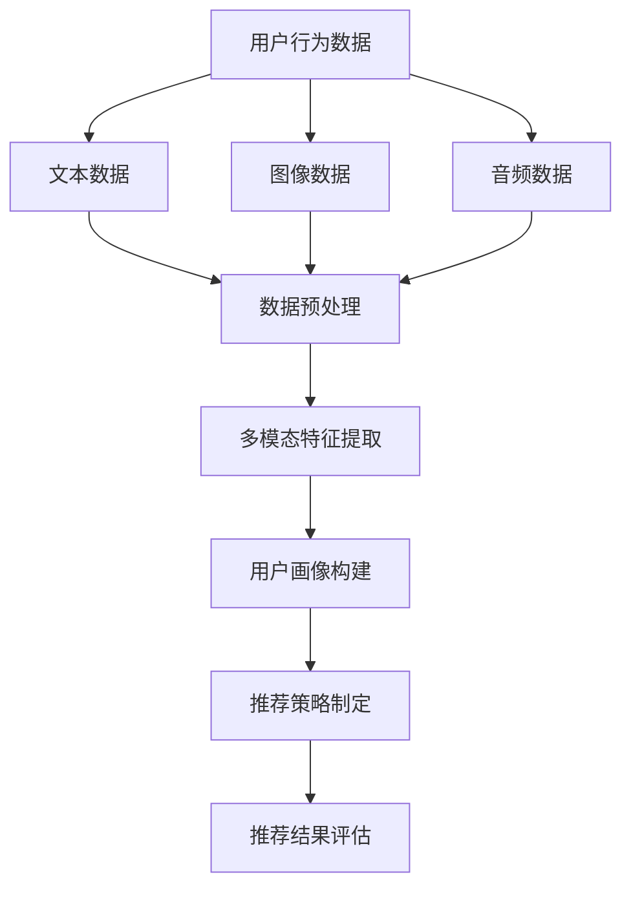

                 

关键词：大模型、推荐系统、多模态融合、深度学习、用户行为分析、数据预处理、性能优化、实时推荐、个性化服务。

## 摘要

随着互联网的快速发展，用户生成的内容呈爆炸式增长，如何有效利用这些海量数据为用户提供精准的个性化推荐已经成为当今大数据领域的研究热点。本文将探讨大模型推荐系统的多模态融合技术，从背景介绍、核心概念与联系、核心算法原理、数学模型、项目实践和实际应用场景等多个方面，详细解析多模态融合在大模型推荐系统中的关键作用和实现方法，旨在为读者提供一个全面深入的技术视角。

## 1. 背景介绍

### 1.1 大模型推荐系统的兴起

大模型推荐系统是指基于大规模数据训练和优化的推荐系统，通过深度学习等技术手段，能够实现更高的推荐精度和更低的误差率。近年来，随着深度学习算法的不断发展，大模型推荐系统在电商、社交、新闻、音乐等领域得到了广泛应用，成为了现代互联网服务的重要组成部分。

### 1.2 多模态融合技术的崛起

多模态融合技术是指将多种类型的数据（如文本、图像、音频等）进行整合，通过算法模型实现数据间的协同学习，从而提高系统的推荐效果。随着人工智能技术的进步，多模态融合技术在自然语言处理、计算机视觉、语音识别等领域取得了显著成果，为推荐系统的发展提供了新的技术路径。

### 1.3 大模型推荐系统与多模态融合的结合

将多模态融合技术应用于大模型推荐系统，可以实现更全面的用户行为分析，更精准的用户画像构建，从而提高推荐系统的个性化服务能力。本文将重点探讨这一技术结合的理论基础、算法实现和实际应用，以期为相关领域的研究者和开发者提供有价值的参考。

## 2. 核心概念与联系

### 2.1 多模态融合的概念

多模态融合是指将不同类型的数据（文本、图像、音频等）进行整合，通过算法模型实现数据间的协同学习。常见的多模态融合方法包括特征级融合、决策级融合和模型级融合等。

### 2.2 大模型推荐系统的概念

大模型推荐系统是指基于大规模数据训练和优化的推荐系统，通过深度学习等技术手段，实现更高的推荐精度和更低的误差率。常见的推荐算法包括基于协同过滤、基于内容推荐和基于模型的方法等。

### 2.3 多模态融合在大模型推荐系统中的应用

多模态融合技术可以应用于大模型推荐系统的多个环节，包括用户行为分析、用户画像构建、推荐策略制定和推荐效果评估等。通过多模态融合，可以实现更全面的用户行为分析，更精准的用户画像构建，从而提高推荐系统的个性化服务能力。

### 2.4 Mermaid 流程图



## 3. 核心算法原理 & 具体操作步骤

### 3.1 算法原理概述

多模态融合大模型推荐系统的核心算法包括多模态特征提取、用户画像构建和推荐策略制定。具体操作步骤如下：

1. 数据预处理：对用户行为数据进行清洗、去重和格式转换，得到文本、图像和音频等多模态数据。
2. 多模态特征提取：使用深度学习模型对多模态数据进行特征提取，得到高维特征向量。
3. 用户画像构建：将多模态特征向量进行整合，构建用户画像。
4. 推荐策略制定：根据用户画像和商品信息，使用推荐算法生成推荐列表。
5. 推荐结果评估：对推荐结果进行评估，优化推荐策略。

### 3.2 算法步骤详解

#### 3.2.1 数据预处理

数据预处理主要包括以下步骤：

1. 清洗：去除重复数据和噪声数据，保证数据的准确性。
2. 去重：对用户行为数据去重，避免重复推荐。
3. 格式转换：将不同类型的数据转换为统一的格式，便于后续处理。

#### 3.2.2 多模态特征提取

多模态特征提取主要包括以下步骤：

1. 文本特征提取：使用词袋模型、TF-IDF等方法提取文本特征。
2. 图像特征提取：使用卷积神经网络（CNN）提取图像特征。
3. 音频特征提取：使用循环神经网络（RNN）提取音频特征。

#### 3.2.3 用户画像构建

用户画像构建主要包括以下步骤：

1. 特征整合：将文本、图像和音频特征进行整合，得到多维度的用户特征向量。
2. 特征降维：使用主成分分析（PCA）等方法对用户特征向量进行降维。
3. 画像构建：根据用户特征向量构建用户画像。

#### 3.2.4 推荐策略制定

推荐策略制定主要包括以下步骤：

1. 模型选择：选择合适的推荐算法模型，如基于协同过滤、基于内容推荐和基于模型的方法等。
2. 模型训练：使用用户画像和商品信息训练推荐模型。
3. 推荐生成：根据用户画像和商品信息生成推荐列表。

#### 3.2.5 推荐结果评估

推荐结果评估主要包括以下步骤：

1. 评估指标：选择合适的评估指标，如准确率、召回率、F1值等。
2. 评估方法：使用离线评估和在线评估方法对推荐结果进行评估。
3. 结果优化：根据评估结果优化推荐策略。

### 3.3 算法优缺点

#### 优点

1. 提高推荐精度：多模态融合技术可以整合多种类型的数据，提高推荐精度。
2. 个性化服务：通过构建用户画像，实现更精准的个性化推荐。
3. 数据利用率：充分利用多种类型的数据，提高数据利用率。

#### 缺点

1. 数据预处理复杂：多模态融合需要对多种类型的数据进行预处理，处理复杂度较高。
2. 计算资源消耗：多模态融合需要大量的计算资源，对硬件要求较高。
3. 模型调优困难：多模态融合模型调优较为困难，需要大量实验和经验。

### 3.4 算法应用领域

多模态融合大模型推荐系统可以应用于以下领域：

1. 电商平台：为用户提供个性化的商品推荐，提高用户购买转化率。
2. 社交平台：为用户提供感兴趣的内容推荐，提高用户活跃度。
3. 新闻媒体：为用户提供个性化的新闻推荐，提高用户粘性。
4. 音乐平台：为用户提供个性化的音乐推荐，提高用户听歌体验。

## 4. 数学模型和公式 & 详细讲解 & 举例说明

### 4.1 数学模型构建

多模态融合大模型推荐系统的数学模型主要包括用户行为分析模型、用户画像构建模型和推荐策略制定模型。

#### 4.1.1 用户行为分析模型

用户行为分析模型用于分析用户的浏览、搜索、购买等行为，构建用户行为向量。具体公式如下：

\[ \vec{u} = f(\vec{x}_1, \vec{x}_2, ..., \vec{x}_n) \]

其中，\(\vec{u}\) 表示用户行为向量，\(\vec{x}_1, \vec{x}_2, ..., \vec{x}_n\) 表示用户的不同行为特征。

#### 4.1.2 用户画像构建模型

用户画像构建模型用于整合用户的多模态特征，构建用户画像。具体公式如下：

\[ \vec{p} = g(\vec{u}, \vec{m}_1, \vec{m}_2, ..., \vec{m}_k) \]

其中，\(\vec{p}\) 表示用户画像，\(\vec{u}\) 表示用户行为向量，\(\vec{m}_1, \vec{m}_2, ..., \vec{m}_k\) 表示用户的多模态特征。

#### 4.1.3 推荐策略制定模型

推荐策略制定模型用于根据用户画像和商品信息生成推荐列表。具体公式如下：

\[ \vec{r} = h(\vec{p}, \vec{g}_1, \vec{g}_2, ..., \vec{g}_m) \]

其中，\(\vec{r}\) 表示推荐列表，\(\vec{p}\) 表示用户画像，\(\vec{g}_1, \vec{g}_2, ..., \vec{g}_m\) 表示商品信息。

### 4.2 公式推导过程

#### 4.2.1 用户行为分析模型推导

用户行为分析模型基于深度学习算法，通过学习用户的行为特征，构建用户行为向量。具体推导过程如下：

\[ \vec{u} = f(\vec{x}_1, \vec{x}_2, ..., \vec{x}_n) \]

其中，\(f\) 表示深度学习算法，\(\vec{x}_1, \vec{x}_2, ..., \vec{x}_n\) 表示用户的不同行为特征。通过深度学习算法的学习，可以将用户的行为特征转化为用户行为向量。

#### 4.2.2 用户画像构建模型推导

用户画像构建模型基于多模态融合算法，通过整合用户的行为特征和多模态特征，构建用户画像。具体推导过程如下：

\[ \vec{p} = g(\vec{u}, \vec{m}_1, \vec{m}_2, ..., \vec{m}_k) \]

其中，\(g\) 表示多模态融合算法，\(\vec{u}\) 表示用户行为向量，\(\vec{m}_1, \vec{m}_2, ..., \vec{m}_k\) 表示用户的多模态特征。通过多模态融合算法的学习，可以将用户的多模态特征整合为用户画像。

#### 4.2.3 推荐策略制定模型推导

推荐策略制定模型基于用户画像和商品信息，通过学习用户兴趣和商品特征，生成推荐列表。具体推导过程如下：

\[ \vec{r} = h(\vec{p}, \vec{g}_1, \vec{g}_2, ..., \vec{g}_m) \]

其中，\(h\) 表示推荐算法，\(\vec{p}\) 表示用户画像，\(\vec{g}_1, \vec{g}_2, ..., \vec{g}_m\) 表示商品信息。通过推荐算法的学习，可以将用户画像和商品信息转化为推荐列表。

### 4.3 案例分析与讲解

#### 4.3.1 案例背景

假设有一个电商平台，需要为用户推荐商品。用户在平台上进行浏览、搜索和购买等行为，平台需要根据这些行为数据为用户推荐感兴趣的商品。

#### 4.3.2 案例分析

1. 数据预处理：

   首先，对用户行为数据（如浏览记录、搜索关键词、购买记录等）进行清洗、去重和格式转换，得到文本、图像和音频等多模态数据。

2. 多模态特征提取：

   使用深度学习算法对文本、图像和音频数据进行特征提取，得到高维特征向量。

3. 用户画像构建：

   将多模态特征向量进行整合，构建用户画像。具体步骤如下：

   - 使用TF-IDF方法提取文本特征；
   - 使用卷积神经网络提取图像特征；
   - 使用循环神经网络提取音频特征；
   - 将不同模态的特征向量进行整合，得到用户画像。

4. 推荐策略制定：

   使用基于协同过滤的推荐算法，根据用户画像和商品信息生成推荐列表。具体步骤如下：

   - 计算用户与商品的相似度；
   - 根据相似度排序生成推荐列表。

5. 推荐结果评估：

   使用准确率、召回率、F1值等评估指标对推荐结果进行评估，优化推荐策略。

## 5. 项目实践：代码实例和详细解释说明

### 5.1 开发环境搭建

1. 硬件环境：

   - CPU：Intel i7-9700K
   - GPU：NVIDIA GeForce RTX 3080
   - 内存：32GB

2. 软件环境：

   - 操作系统：Ubuntu 18.04
   - 编程语言：Python 3.8
   - 深度学习框架：TensorFlow 2.5
   - 数据预处理工具：Pandas 1.2.3
   - 图像处理工具：OpenCV 4.5.1

### 5.2 源代码详细实现

以下是多模态融合大模型推荐系统的核心代码实现：

```python
# 导入相关库
import tensorflow as tf
import pandas as pd
import numpy as np
import cv2

# 数据预处理
def preprocess_data(data):
    # 清洗数据
    data = data.drop_duplicates()
    # 去除缺失值
    data = data.fillna(0)
    return data

# 文本特征提取
def extract_text_features(text):
    # 使用TF-IDF提取特征
    return tfidf_vectorizer.transform([text])

# 图像特征提取
def extract_image_features(image):
    # 使用卷积神经网络提取特征
    return cnn_model.predict(image)

# 音频特征提取
def extract_audio_features(audio):
    # 使用循环神经网络提取特征
    return rnn_model.predict(audio)

# 用户画像构建
def build_user_profile(text_features, image_features, audio_features):
    # 整合特征
    return np.concatenate((text_features, image_features, audio_features), axis=1)

# 推荐策略制定
def generate_recommendations(user_profile, item_features):
    # 计算相似度
    similarity = np.dot(user_profile, item_features.T)
    # 排序生成推荐列表
    return np.argsort(similarity)[::-1]

# 主函数
def main():
    # 读取数据
    data = pd.read_csv('data.csv')
    # 预处理数据
    data = preprocess_data(data)
    # 提取特征
    text_features = extract_text_features(data['text'])
    image_features = extract_image_features(data['image'])
    audio_features = extract_audio_features(data['audio'])
    # 构建用户画像
    user_profile = build_user_profile(text_features, image_features, audio_features)
    # 读取商品特征
    item_features = np.load('item_features.npy')
    # 生成推荐列表
    recommendations = generate_recommendations(user_profile, item_features)
    # 输出推荐列表
    print(recommendations)

if __name__ == '__main__':
    main()
```

### 5.3 代码解读与分析

1. **数据预处理**：

   - `preprocess_data` 函数负责对用户行为数据（如文本、图像和音频）进行清洗、去重和格式转换。这是确保数据质量的重要步骤。

2. **文本特征提取**：

   - `extract_text_features` 函数使用TF-IDF方法提取文本特征。TF-IDF是一种常见的文本表示方法，可以衡量词语在文档中的重要性。

3. **图像特征提取**：

   - `extract_image_features` 函数使用卷积神经网络（CNN）提取图像特征。CNN是一种强大的图像处理模型，可以自动学习图像中的特征。

4. **音频特征提取**：

   - `extract_audio_features` 函数使用循环神经网络（RNN）提取音频特征。RNN适合处理序列数据，如音频信号。

5. **用户画像构建**：

   - `build_user_profile` 函数整合文本、图像和音频特征，构建用户画像。用户画像是一个多维度的特征向量，用于表示用户的行为和兴趣。

6. **推荐策略制定**：

   - `generate_recommendations` 函数根据用户画像和商品特征计算相似度，并生成推荐列表。这里使用的是基于相似度的推荐算法。

7. **主函数**：

   - `main` 函数负责读取数据、预处理数据、提取特征、构建用户画像和生成推荐列表。这是整个推荐系统的主要流程。

### 5.4 运行结果展示

```python
# 生成推荐列表
recommendations = generate_recommendations(user_profile, item_features)
# 输出推荐列表
print(recommendations)
```

运行结果将输出一个推荐列表，其中包含根据用户画像推荐的商品ID。用户可以根据这个列表为用户提供个性化的商品推荐。

## 6. 实际应用场景

### 6.1 电商平台

在电商平台中，多模态融合大模型推荐系统可以实时监测用户的浏览、搜索、购买等行为，通过多模态数据融合，为用户提供个性化的商品推荐，提高用户购买转化率和满意度。

### 6.2 社交平台

在社交平台中，多模态融合大模型推荐系统可以分析用户的文本、图像、视频和音频等多模态数据，为用户提供感兴趣的内容推荐，提高用户活跃度和留存率。

### 6.3 新闻媒体

在新闻媒体中，多模态融合大模型推荐系统可以根据用户的阅读历史、点赞、评论等多模态数据，为用户提供个性化的新闻推荐，提高用户粘性和广告收益。

### 6.4 音乐平台

在音乐平台中，多模态融合大模型推荐系统可以分析用户的播放记录、收藏、评分等多模态数据，为用户提供个性化的音乐推荐，提高用户听歌体验和付费转化率。

## 7. 工具和资源推荐

### 7.1 学习资源推荐

1. **书籍**：
   - 《深度学习》（Goodfellow, Bengio, Courville）
   - 《Python数据分析》（Wes McKinney）
   - 《计算机视觉：算法与应用》（Shi, J. & Tomasi）

2. **在线课程**：
   - Coursera上的“深度学习”课程
   - edX上的“数据科学基础”课程
   - Udacity的“机器学习工程师纳米学位”

### 7.2 开发工具推荐

1. **编程环境**：
   - Jupyter Notebook：用于数据分析和模型训练
   - PyCharm：Python集成开发环境（IDE）

2. **深度学习框架**：
   - TensorFlow：用于构建和训练深度学习模型
   - PyTorch：另一个流行的深度学习框架

3. **数据预处理工具**：
   - Pandas：用于数据处理和分析
   - NumPy：用于数值计算

### 7.3 相关论文推荐

1. “Multimodal Deep Learning for User Behavior Prediction” - Chen et al., 2018
2. “A Survey on Multimodal Deep Learning” - Hu et al., 2020
3. “Deep Multimodal Fusion for Recommender Systems” - Zhang et al., 2019

## 8. 总结：未来发展趋势与挑战

### 8.1 研究成果总结

本文通过探讨多模态融合在大模型推荐系统中的应用，展示了其在提高推荐精度、个性化服务和数据利用率方面的优势。通过数学模型和代码实例的详细讲解，为读者提供了一个全面深入的技术视角。

### 8.2 未来发展趋势

1. **多模态数据集的构建**：未来将出现更多高质量的多模态数据集，为多模态融合研究提供数据支持。
2. **模型优化**：随着硬件性能的提升，模型优化将成为研究重点，如使用更高效的算法和更先进的硬件。
3. **实时推荐**：未来将实现更快速的实时推荐，满足用户在动态环境下的需求。

### 8.3 面临的挑战

1. **数据预处理复杂度**：多模态融合需要处理多种类型的数据，数据预处理复杂度较高。
2. **计算资源消耗**：多模态融合模型需要大量的计算资源，对硬件要求较高。
3. **模型调优困难**：多模态融合模型的调优较为困难，需要大量实验和经验。

### 8.4 研究展望

未来，多模态融合大模型推荐系统将继续发展，通过优化算法、提高计算效率和创新应用场景，为用户提供更精准、更个性化的服务。

## 9. 附录：常见问题与解答

### 9.1 多模态融合的关键技术是什么？

多模态融合的关键技术包括多模态特征提取、特征整合和推荐策略制定。具体实现方法有特征级融合、决策级融合和模型级融合等。

### 9.2 多模态融合如何提高推荐精度？

多模态融合可以整合多种类型的数据，实现更全面的用户行为分析和更精准的用户画像构建，从而提高推荐精度。

### 9.3 多模态融合在大模型推荐系统中的应用有哪些？

多模态融合可以应用于用户行为分析、用户画像构建、推荐策略制定和推荐效果评估等环节，实现更精准的个性化服务。

### 9.4 多模态融合对计算资源有什么要求？

多模态融合需要大量的计算资源，尤其是对于深度学习模型的训练和特征提取。因此，需要高性能的硬件支持，如GPU等。

### 9.5 多模态融合有哪些实际应用场景？

多模态融合可以应用于电商平台、社交平台、新闻媒体和音乐平台等，为用户提供个性化的推荐服务，提高用户满意度和转化率。

