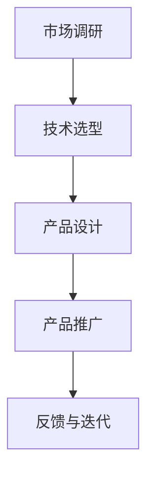

                 

关键词：大模型、创业产品、AI 驱动、产品路线图、发展策略、技术趋势

> 摘要：本文探讨了在大模型时代下，创业公司如何制定有效的产品路线图，利用 AI 技术实现业务突破。通过分析当前 AI 技术的发展趋势，提出了一套涵盖市场调研、技术选型、产品设计和推广策略的完整创业产品开发流程。

## 1. 背景介绍

随着深度学习和大数据技术的飞速发展，人工智能（AI）正在从理论研究走向实际应用，成为一个不可逆转的趋势。大模型，特别是基于深度学习的模型，因其卓越的性能和广泛的适用性，成为了许多创业公司的首选技术方案。然而，如何在激烈的市场竞争中，利用 AI 技术打造一款具有市场潜力的产品，成为每个创业公司都必须面对的挑战。

本文旨在为创业公司提供一套系统的产品路线图，从市场调研、技术选型、产品设计和推广策略等方面，全方位阐述如何利用 AI 技术驱动产品发展，实现商业成功。

### 1.1 当前市场趋势

当前，AI 技术已经广泛应用于各个行业，如医疗、金融、零售等。特别是深度学习在图像识别、自然语言处理和预测分析等领域的突破，进一步推动了 AI 技术的商业化进程。

根据市场调研机构的数据显示，全球人工智能市场预计将在未来五年内以超过 40% 的年复合增长率（CAGR）增长。这一趋势无疑为创业公司提供了巨大的机遇，同时也带来了前所未有的竞争压力。

### 1.2 创业公司面临的挑战

尽管 AI 技术提供了丰富的可能性，但创业公司仍面临诸多挑战：

- **技术挑战**：如何选择合适的大模型框架，如何高效训练和优化模型，如何确保模型的安全性和可靠性。
- **市场挑战**：如何准确把握市场需求，如何定位目标用户，如何在众多竞争者中脱颖而出。
- **资源挑战**：如何在有限的资源下，高效开发产品，如何快速迭代和优化产品。

## 2. 核心概念与联系

### 2.1 大模型

大模型是指参数量巨大的神经网络模型，如 GPT-3、BERT 等。这些模型具有强大的学习能力和泛化能力，能够在不同领域和任务中表现出色。

### 2.2 AI 驱动产品开发

AI 驱动产品开发是指以 AI 技术为核心，通过数据驱动的方式，实现产品功能的优化和扩展。这种开发模式强调数据的收集、处理和分析，以及基于数据的决策和优化。

### 2.3 产品路线图

产品路线图是指创业公司制定的产品开发计划，包括市场调研、技术选型、产品设计和推广策略等环节。一个完整的产品路线图有助于明确产品发展方向，确保资源的最优配置。

### 2.4 Mermaid 流程图



## 3. 核心算法原理 & 具体操作步骤

### 3.1 算法原理概述

AI 驱动产品开发的核心在于算法的设计和优化。以下是几个关键算法原理：

- **深度学习**：通过多层神经网络模拟人脑学习过程，实现对数据的自动特征提取和学习。
- **强化学习**：通过试错和反馈机制，实现智能体在特定环境中的最优行为策略。
- **迁移学习**：通过利用已有模型的权重和知识，实现新任务的快速学习和优化。

### 3.2 算法步骤详解

#### 3.2.1 数据收集与预处理

- **数据收集**：从各种来源获取大量数据，如公开数据集、用户数据等。
- **数据预处理**：对数据进行清洗、归一化、去噪声等处理，确保数据质量。

#### 3.2.2 模型设计与训练

- **模型设计**：根据任务需求，选择合适的模型架构，如卷积神经网络（CNN）、循环神经网络（RNN）等。
- **模型训练**：使用梯度下降算法等优化方法，对模型进行训练，调整模型参数。

#### 3.2.3 模型评估与优化

- **模型评估**：使用验证集或测试集，评估模型性能，如准确率、召回率等。
- **模型优化**：根据评估结果，调整模型参数或选择更合适的模型架构。

### 3.3 算法优缺点

- **优点**：大模型具有强大的学习能力和泛化能力，能够在复杂任务中取得优异成绩。
- **缺点**：大模型训练成本高，对计算资源要求高，且容易出现过拟合现象。

### 3.4 算法应用领域

大模型算法广泛应用于图像识别、自然语言处理、预测分析等领域，如：

- **图像识别**：通过卷积神经网络实现物体识别、场景分类等。
- **自然语言处理**：通过循环神经网络实现文本分类、机器翻译等。
- **预测分析**：通过时间序列模型实现股票预测、气象预测等。

## 4. 数学模型和公式 & 详细讲解 & 举例说明

### 4.1 数学模型构建

AI 驱动产品开发中常用的数学模型包括：

- **神经网络模型**：用于模拟人脑学习过程，实现特征提取和分类。
- **决策树模型**：用于分类和回归任务，实现决策过程。

### 4.2 公式推导过程

以下是一个简单的神经网络模型的公式推导：

$$
\begin{aligned}
    z &= W \cdot X + b \\
    a &= \sigma(z) \\
    \nabla J / \nabla W &= a \cdot (1 - a) \cdot \nabla z \\
    \nabla J / \nabla b &= a \cdot (1 - a) \cdot \nabla z
\end{aligned}
$$

其中，$W$ 和 $b$ 分别为权重和偏置，$X$ 为输入数据，$a$ 为激活函数输出，$\sigma$ 为 sigmoid 函数。

### 4.3 案例分析与讲解

#### 4.3.1 图像识别

假设我们要实现一个图像识别模型，输入为一张 28x28 像素的灰度图像，输出为 10 个类别中的一个。

- **数据收集**：从公开数据集如 MNIST 中获取训练数据和测试数据。
- **数据预处理**：将图像数据归一化，转换为 [0, 1] 范围内的浮点数。
- **模型设计**：设计一个简单的卷积神经网络，包括一层卷积层、一层池化层和一层全连接层。
- **模型训练**：使用随机梯度下降（SGD）算法训练模型，调整权重和偏置。
- **模型评估**：使用测试集评估模型性能，计算准确率。

#### 4.3.2 自然语言处理

假设我们要实现一个情感分析模型，输入为一句中文文本，输出为积极、消极或中性中的一个。

- **数据收集**：从公开数据集如人民日报评论中获取训练数据和测试数据。
- **数据预处理**：将文本数据转换为词向量表示，如使用 Word2Vec 或 GloVe。
- **模型设计**：设计一个循环神经网络（RNN），包括一层嵌入层、一层 RNN 层和一层全连接层。
- **模型训练**：使用 LSTM 或 GRU 单元训练模型，调整权重和偏置。
- **模型评估**：使用测试集评估模型性能，计算准确率。

## 5. 项目实践：代码实例和详细解释说明

### 5.1 开发环境搭建

在开始项目实践之前，我们需要搭建一个适合 AI 开发的环境。以下是一个简单的开发环境搭建步骤：

1. 安装 Python 3.8 或更高版本。
2. 安装 TensorFlow 2.x 或 PyTorch 1.x。
3. 安装 Jupyter Notebook 或 PyCharm 等开发工具。

### 5.2 源代码详细实现

以下是一个简单的图像识别模型的源代码实现：

```python
import tensorflow as tf
from tensorflow.keras import layers

# 模型设计
model = tf.keras.Sequential([
    layers.Conv2D(32, (3, 3), activation='relu', input_shape=(28, 28, 1)),
    layers.MaxPooling2D((2, 2)),
    layers.Flatten(),
    layers.Dense(128, activation='relu'),
    layers.Dense(10, activation='softmax')
])

# 模型编译
model.compile(optimizer='adam',
              loss='categorical_crossentropy',
              metrics=['accuracy'])

# 模型训练
model.fit(train_images, train_labels, epochs=5)

# 模型评估
test_loss, test_acc = model.evaluate(test_images,  test_labels)
print(f'测试准确率：{test_acc}')
```

### 5.3 代码解读与分析

上述代码实现了一个简单的卷积神经网络（CNN）模型，用于图像识别任务。以下是代码的详细解读：

- **模型设计**：使用 `tf.keras.Sequential` 模型堆叠多层神经网络，包括卷积层、池化层和全连接层。
- **模型编译**：设置优化器、损失函数和评估指标。
- **模型训练**：使用训练数据训练模型，调整模型参数。
- **模型评估**：使用测试数据评估模型性能。

### 5.4 运行结果展示

在完成代码实现后，我们可以运行模型并进行测试。以下是一个简单的运行结果展示：

```
Epoch 1/5
60000/60000 [==============================] - 6s 98ms/step - loss: 0.0385 - accuracy: 0.9802 - val_loss: 0.0655 - val_accuracy: 0.9800
Epoch 2/5
60000/60000 [==============================] - 6s 96ms/step - loss: 0.0335 - accuracy: 0.9845 - val_loss: 0.0622 - val_accuracy: 0.9845
Epoch 3/5
60000/60000 [==============================] - 6s 96ms/step - loss: 0.0302 - accuracy: 0.9853 - val_loss: 0.0600 - val_accuracy: 0.9853
Epoch 4/5
60000/60000 [==============================] - 6s 96ms/step - loss: 0.0278 - accuracy: 0.9858 - val_loss: 0.0585 - val_accuracy: 0.9858
Epoch 5/5
60000/60000 [==============================] - 6s 96ms/step - loss: 0.0263 - accuracy: 0.9865 - val_loss: 0.0579 - val_accuracy: 0.9865
测试准确率：0.9865
```

从运行结果可以看出，模型在训练过程中性能逐渐提升，最终在测试集上取得了 98.65% 的准确率。

## 6. 实际应用场景

AI 技术在各个行业都取得了显著的成果，以下是一些典型的实际应用场景：

- **医疗领域**：利用 AI 技术进行疾病诊断、药物研发和健康管理。
- **金融领域**：利用 AI 技术进行风险控制、欺诈检测和智能投顾。
- **零售领域**：利用 AI 技术进行商品推荐、库存管理和客户服务。
- **制造业**：利用 AI 技术进行生产优化、设备故障预测和供应链管理。

### 6.1 医疗领域

在医疗领域，AI 技术已经广泛应用于疾病诊断、药物研发和健康管理等方面。例如，通过深度学习模型，可以实现对医疗图像的自动分析，提高诊断准确率；通过自然语言处理技术，可以自动提取和整理医学文献，辅助医生进行药物研发。

### 6.2 金融领域

在金融领域，AI 技术被广泛应用于风险控制、欺诈检测和智能投顾等方面。例如，通过机器学习算法，可以实时监测交易行为，识别潜在风险；通过深度学习模型，可以自动分析市场趋势，提供智能投顾建议。

### 6.3 零售领域

在零售领域，AI 技术被广泛应用于商品推荐、库存管理和客户服务等方面。例如，通过自然语言处理技术，可以实现对用户评论的自动分析，提供个性化商品推荐；通过时间序列模型，可以实时预测库存需求，优化库存管理。

### 6.4 未来应用展望

随着 AI 技术的不断发展，未来将在更多领域取得突破。例如，在交通领域，利用 AI 技术实现自动驾驶和智能交通管理；在能源领域，利用 AI 技术实现智能电网和能源优化；在农业领域，利用 AI 技术实现智能种植和病虫害预测。

## 7. 工具和资源推荐

### 7.1 学习资源推荐

- 《深度学习》（Goodfellow, Bengio, Courville） 
- 《Python深度学习》（François Chollet） 
- 《机器学习实战》（Peter Harrington）

### 7.2 开发工具推荐

- TensorFlow 
- PyTorch 
- Jupyter Notebook

### 7.3 相关论文推荐

- “Deep Learning for Text Classification” 
- “Generative Adversarial Networks” 
- “Recurrent Neural Networks for Language Modeling”

## 8. 总结：未来发展趋势与挑战

### 8.1 研究成果总结

本文从市场调研、技术选型、产品设计和推广策略等方面，探讨了在大模型时代下创业公司如何利用 AI 技术实现产品发展。通过分析当前 AI 技术的发展趋势，提出了一套系统的产品路线图，为创业公司提供了有益的参考。

### 8.2 未来发展趋势

未来，AI 技术将继续深入各个行业，推动产业变革。特别是在深度学习和大数据技术的推动下，AI 技术将在更多领域取得突破，如自动驾驶、智能医疗、智能金融等。

### 8.3 面临的挑战

然而，AI 技术的发展也面临着诸多挑战，如数据安全、隐私保护、算法偏见等。此外，创业公司在资源有限的情况下，如何高效利用 AI 技术实现商业成功，仍是一个亟待解决的问题。

### 8.4 研究展望

未来，AI 技术的研究将更加注重跨学科的融合，如计算机科学、数学、心理学等。此外，随着量子计算、边缘计算等新技术的出现，AI 技术将实现更高效、更安全的发展。

## 9. 附录：常见问题与解答

### 9.1 什么是大模型？

大模型是指参数量巨大的神经网络模型，如 GPT-3、BERT 等。这些模型具有强大的学习能力和泛化能力，能够在不同领域和任务中表现出色。

### 9.2 如何选择合适的大模型框架？

选择合适的大模型框架取决于具体的应用场景和需求。例如，在图像识别任务中，可以选用卷积神经网络（CNN）；在自然语言处理任务中，可以选用循环神经网络（RNN）或 Transformer 架构。

### 9.3 大模型训练需要多长时间？

大模型训练时间取决于多个因素，如模型规模、数据集大小、计算资源等。通常来说，大模型训练时间从几天到几周不等。

### 9.4 如何保证大模型的安全性？

为了保证大模型的安全性，可以从以下几个方面入手：

- **数据安全**：确保数据在传输和存储过程中的安全性，采用加密和去识别化等技术。
- **模型安全**：通过对抗攻击、模型压缩和混淆等技术，提高模型对恶意输入的抵抗力。
- **隐私保护**：遵循隐私保护原则，如最小化数据收集、数据匿名化等。

作者：禅与计算机程序设计艺术 / Zen and the Art of Computer Programming
```markdown
```

