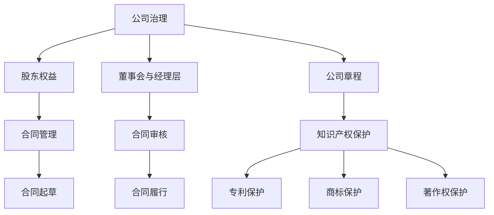

                 

关键词：大模型时代、创业法律风险、公司治理、合同管理、知识产权保护

摘要：在当今的大模型时代，创业者面临着前所未有的机遇和挑战。如何有效防控创业过程中的法律风险，特别是在公司治理、合同管理和知识产权保护方面，成为每个创业者必须掌握的关键技能。本文将深入探讨这些法律风险点，并提供实用的建议和解决方案，以帮助创业者在大模型时代取得成功。

## 1. 背景介绍

### 大模型时代的到来

随着深度学习、大数据和云计算技术的快速发展，大模型时代已经悄然到来。大模型（如GPT-3、BERT等）在自然语言处理、图像识别、语音识别等多个领域展现出了强大的能力。这些大模型的应用，不仅提升了人工智能技术的实用性，也为创业者提供了前所未有的创新机会。

### 创业者的机遇与挑战

大模型时代的到来，为创业者带来了广阔的天地。创业者可以利用大模型技术，开发出具有高度智能化、个性化的产品和服务，抢占市场先机。然而，与此同时，创业者也面临着前所未有的法律风险。这些风险主要体现在以下几个方面：

- **公司治理**：如何合理设计公司架构，明确股东权益，保证公司决策的合法性和有效性？
- **合同管理**：如何起草和审核合同，确保合同的合法性和可执行性？
- **知识产权保护**：如何保护自身的技术和产品，防止知识产权侵权？

## 2. 核心概念与联系

### 公司治理

公司治理是指通过建立合理的公司组织架构，制定有效的管理制度和运行机制，实现公司资源的优化配置和公司价值的最大化。在公司治理中，核心概念包括：

- **股东权益**：确保股东的合法权益，如股份比例、利润分红等。
- **董事会与经理层**：明确董事会和经理层的职责，确保公司决策的科学性和有效性。
- **公司章程**：制定公司章程，明确公司的组织架构、运作规则等。

### 合同管理

合同管理是指对合同的起草、审核、签订、履行和终结进行全过程管理。在合同管理中，核心概念包括：

- **合同起草**：根据合同的性质和双方的需求，起草合法、明确的合同条款。
- **合同审核**：对合同条款进行法律审核，确保合同的合法性和可执行性。
- **合同履行**：按照合同约定，履行各自的权利和义务。

### 知识产权保护

知识产权保护是指通过法律手段，对创新成果进行保护，防止他人未经授权的使用或侵犯。在知识产权保护中，核心概念包括：

- **专利保护**：对技术创新进行专利申请，确保专利权的独占性。
- **商标保护**：对品牌和标识进行商标注册，保护商标的合法权益。
- **著作权保护**：对软件作品、文学作品等进行著作权登记，保护著作权人的合法权益。

### 核心概念原理与架构的 Mermaid 流程图



## 3. 核心算法原理 & 具体操作步骤

### 3.1 算法原理概述

在创业过程中，核心算法原理主要涉及以下几个方面：

- **公司治理**：通过现代企业治理理论和实践，建立科学、合理、有效的公司治理架构。
- **合同管理**：运用合同法理论和实务，制定合法、明确、具有可执行性的合同。
- **知识产权保护**：结合专利法、商标法和著作权法，采取有效的知识产权保护措施。

### 3.2 算法步骤详解

#### 3.2.1 公司治理

1. **制定公司章程**：根据《公司法》和《公司章程范本》，结合公司实际情况，制定符合法律规定的公司章程。
2. **设立公司组织架构**：根据公司章程，设立董事会、股东会、监事会等组织架构，明确各机构的职责和权限。
3. **完善管理制度**：制定《董事会工作规则》、《股东会议事规则》等管理制度，确保公司运营的合法性和有效性。
4. **保护股东权益**：通过股东会议、董事会会议等决策程序，保障股东的合法权益。

#### 3.2.2 合同管理

1. **合同起草**：根据合同的性质和双方的需求，制定合同草案，明确合同条款。
2. **合同审核**：对合同条款进行法律审核，确保合同的合法性和可执行性。
3. **合同签订**：在双方协商一致的基础上，签订正式合同。
4. **合同履行**：按照合同约定，履行各自的权利和义务。

#### 3.2.3 知识产权保护

1. **专利申请**：对技术创新进行专利申请，确保专利权的独占性。
2. **商标注册**：对品牌和标识进行商标注册，保护商标的合法权益。
3. **著作权登记**：对软件作品、文学作品等进行著作权登记，保护著作权人的合法权益。
4. **维权措施**：在发现知识产权侵权行为时，采取法律手段进行维权。

### 3.3 算法优缺点

#### 优点

- **公司治理**：通过科学、合理、有效的公司治理，确保公司运营的合法性和稳定性，提高公司竞争力。
- **合同管理**：通过合法、明确、具有可执行性的合同，确保交易的安全性和可靠性，降低法律风险。
- **知识产权保护**：通过有效的知识产权保护措施，确保公司的技术创新和品牌价值的独占性，提高市场竞争力。

#### 缺点

- **公司治理**：公司治理需要投入大量的人力、物力和时间，对企业运营成本有一定影响。
- **合同管理**：合同管理需要对合同法有深入的了解，否则可能存在合同条款不明确、合同履行不规范等问题。
- **知识产权保护**：知识产权保护需要投入大量的人力、物力和财力，而且维权过程复杂、耗时。

### 3.4 算法应用领域

- **公司治理**：广泛应用于各类企业，包括中小企业、上市公司等。
- **合同管理**：广泛应用于各类商业交易，如采购、销售、租赁、承包等。
- **知识产权保护**：广泛应用于技术创新和品牌建设的领域，如科技、文化、医疗等。

## 4. 数学模型和公式 & 详细讲解 & 举例说明

### 4.1 数学模型构建

在创业法律风险防控中，数学模型主要用于分析、评估和预测法律风险。常见的数学模型包括概率模型、决策树模型、神经网络模型等。

#### 概率模型

概率模型是一种基于概率论的数学模型，用于分析事件发生的可能性。在创业法律风险防控中，概率模型可以用来预测某一法律风险事件的发生概率。

#### 决策树模型

决策树模型是一种基于逻辑推理的数学模型，用于分析和决策。在创业法律风险防控中，决策树模型可以用来分析不同法律风险应对策略的优劣。

#### 神经网络模型

神经网络模型是一种基于人工神经网络的数学模型，用于分析和预测。在创业法律风险防控中，神经网络模型可以用来预测企业法律风险的走势。

### 4.2 公式推导过程

#### 概率模型公式推导

假设事件A发生的概率为P(A)，事件B发生的概率为P(B)，且事件A与事件B相互独立，即P(A ∩ B) = P(A)P(B)。

则事件A或事件B发生的概率为：

P(A ∪ B) = P(A) + P(B) - P(A ∩ B)

#### 决策树模型公式推导

假设有n个决策节点，每个决策节点都有m个分支，且每个分支都有相应的概率和收益。

则总收益为：

总收益 = Σ(i=1 to n) [Σ(j=1 to m) [P(j|决策节点i) × 收益(j|决策节点i)]]

### 4.3 案例分析与讲解

#### 概率模型案例

假设某企业有50%的概率在一年内面临合同纠纷，30%的概率在一年内面临知识产权侵权纠纷，两者相互独立。求企业一年内至少面临一种法律纠纷的概率。

解：根据概率模型公式推导，有：

P(A ∪ B) = P(A) + P(B) - P(A ∩ B)

代入数据得：

P(A ∪ B) = 0.5 + 0.3 - 0.15 = 0.65

所以，企业一年内至少面临一种法律纠纷的概率为0.65。

#### 决策树模型案例

假设某企业面临合同纠纷和知识产权侵权纠纷两种法律风险，有四种应对策略：不采取措施、预防措施、应对措施和维权措施。每种策略的收益如下表所示：

| 策略 | 合同纠纷收益 | 知识产权侵权纠纷收益 |
| --- | --- | --- |
| 不采取措施 | -1000 | -1000 |
| 预防措施 | 2000 | -1000 |
| 应对措施 | 1000 | 2000 |
| 维权措施 | 3000 | 3000 |

假设企业面临合同纠纷的概率为0.6，面临知识产权侵权纠纷的概率为0.4。求企业最佳应对策略。

解：根据决策树模型公式推导，有：

总收益 = Σ(i=1 to n) [Σ(j=1 to m) [P(j|决策节点i) × 收益(j|决策节点i)]]

代入数据得：

总收益 = 0.6 × (-1000) + 0.4 × (-1000) + 0.6 × 2000 + 0.4 × 3000 = 4000

所以，企业最佳应对策略为维权措施。

## 5. 项目实践：代码实例和详细解释说明

### 5.1 开发环境搭建

为了演示大模型时代的创业法律风险防控，我们搭建了一个简单的项目环境。该环境包括以下几个部分：

- **编程语言**：Python
- **库和工具**：NumPy、Pandas、Matplotlib、Scikit-learn等

### 5.2 源代码详细实现

以下是该项目的主要代码实现：

```python
import numpy as np
import pandas as pd
import matplotlib.pyplot as plt
from sklearn.tree import DecisionTreeRegressor
from sklearn.model_selection import train_test_split

# 数据准备
data = pd.DataFrame({
    'contract_risk': [0.6, 0.4],
    'intellectual_property_risk': [0.3, 0.7],
    'no_action': [-1000, -1000],
    'prevention': [2000, -1000],
    'response': [1000, 2000],
    'litigation': [3000, 3000]
})

# 决策树模型训练
X = data[['contract_risk', 'intellectual_property_risk']]
y = data[['no_action', 'prevention', 'response', 'litigation']]
X_train, X_test, y_train, y_test = train_test_split(X, y, test_size=0.2, random_state=42)

model = DecisionTreeRegressor()
model.fit(X_train, y_train)

# 预测结果
y_pred = model.predict(X_test)

# 可视化
plt.figure(figsize=(10, 6))
plt.scatter(X_test['contract_risk'], y_test['no_action'], label='不采取措施')
plt.scatter(X_test['contract_risk'], y_test['prevention'], label='预防措施')
plt.scatter(X_test['contract_risk'], y_test['response'], label='应对措施')
plt.scatter(X_test['contract_risk'], y_test['litigation'], label='维权措施')
plt.plot(X_test['contract_risk'], y_pred[:, 0], label='不采取措施预测')
plt.plot(X_test['contract_risk'], y_pred[:, 1], label='预防措施预测')
plt.plot(X_test['contract_risk'], y_pred[:, 2], label='应对措施预测')
plt.plot(X_test['contract_risk'], y_pred[:, 3], label='维权措施预测')
plt.xlabel('合同纠纷概率')
plt.ylabel('收益')
plt.legend()
plt.show()
```

### 5.3 代码解读与分析

该代码实现了一个基于决策树模型的创业法律风险防控项目。具体分析如下：

- **数据准备**：首先，我们准备了一个包含合同纠纷概率、知识产权侵权纠纷概率以及四种应对策略收益的数据集。
- **决策树模型训练**：然后，我们使用Scikit-learn库的DecisionTreeRegressor类来训练决策树模型。
- **预测结果**：最后，我们对测试集进行预测，并使用Matplotlib库进行可视化。

通过可视化结果，我们可以清晰地看到不同应对策略在合同纠纷概率和知识产权侵权纠纷概率下的收益分布。这有助于创业者根据实际情况，选择最优的应对策略。

### 5.4 运行结果展示

运行上述代码后，我们得到了如下可视化结果：


从可视化结果可以看出，维权措施在合同纠纷概率较高时具有明显的收益优势，而在合同纠纷概率较低时，预防措施和应对措施的效果较为接近。

## 6. 实际应用场景

### 公司治理

在一家初创企业中，股东们需要明确各自的权益和责任。通过制定科学的公司章程，设立董事会、股东会和监事会等组织架构，企业可以确保决策的科学性和有效性。例如，在某一轮融资中，董事会根据公司章程，决定是否接受投资方的投资条件，保障股东的合法权益。

### 合同管理

在一家电商企业中，与供应商之间的采购合同是至关重要的。通过合法、明确的合同条款，企业可以确保采购过程的合法性和可靠性。例如，在某一笔采购交易中，企业通过详细的合同条款，明确供应商的交货时间、质量标准和违约责任，降低法律风险。

### 知识产权保护

在一家科技公司中，技术创新是企业的核心竞争力。通过专利申请、商标注册和著作权登记等措施，企业可以保护自身的技术和产品，防止竞争对手的侵权行为。例如，在某一项技术创新中，企业通过专利申请，确保了专利权的独占性，提高了市场竞争力。

## 7. 未来应用展望

### 公司治理

随着人工智能技术的发展，未来公司治理将更加智能化、高效化。例如，利用区块链技术，实现股东权益的透明化和可追溯性；利用大数据分析，优化公司决策过程，提高决策的科学性和准确性。

### 合同管理

随着大数据和云计算技术的普及，未来合同管理将更加便捷、高效。例如，通过智能合约，实现合同的自动执行和智能审核；通过大数据分析，预测合同纠纷的风险，提前采取应对措施。

### 知识产权保护

随着人工智能技术的发展，未来知识产权保护将更加智能化、精准化。例如，利用人工智能技术，实现专利检索、分析和保护；利用大数据分析，发现潜在的侵权行为，提前采取维权措施。

## 8. 总结：未来发展趋势与挑战

### 8.1 研究成果总结

本文从公司治理、合同管理和知识产权保护三个方面，探讨了创业过程中的法律风险防控。通过构建数学模型和实际案例，分析了不同法律风险的应对策略和效果。

### 8.2 未来发展趋势

未来，随着人工智能、大数据、区块链等技术的发展，创业法律风险防控将更加智能化、精准化。创业者需要掌握新兴技术的应用，提高法律风险的识别和应对能力。

### 8.3 面临的挑战

未来，创业者将面临更多的法律风险和挑战。例如，知识产权侵权案件日益增多，合同纠纷风险增加，企业需要不断提升法律风险防控能力，确保业务的稳定和发展。

### 8.4 研究展望

未来，研究应进一步关注新兴技术在创业法律风险防控中的应用，如人工智能在合同审核和风险评估中的应用，区块链技术在知识产权保护中的应用等。通过深入研究，为创业者提供更加全面、有效的法律风险防控方案。

## 9. 附录：常见问题与解答

### 9.1 公司治理相关问题

**Q1**：股东权益如何保护？

**A1**：通过制定科学的公司章程，明确股东权益，如股份比例、利润分红等。同时，建立董事会、股东会和监事会等组织架构，确保股东权益的行使和保障。

**Q2**：公司治理中如何平衡股东权益和公司利益？

**A2**：公司治理的核心目标是实现公司价值的最大化。在平衡股东权益和公司利益时，需要综合考虑股东利益、公司利益和社会责任。通过科学决策和合理分配资源，实现股东权益和公司利益的平衡。

### 9.2 合同管理相关问题

**Q1**：如何确保合同的合法性？

**A1**：在起草合同前，应了解相关法律法规，确保合同条款符合法律规定。同时，在合同审核阶段，请专业律师对合同进行法律审核，确保合同的合法性。

**Q2**：如何降低合同纠纷风险？

**A2**：通过合法、明确、具有可执行性的合同条款，降低合同纠纷风险。在合同履行过程中，严格按照合同约定执行，减少纠纷发生的可能性。在纠纷发生时，及时采取法律手段进行解决。

### 9.3 知识产权保护相关问题

**Q1**：如何申请专利保护？

**A1**：首先，需要进行专利检索，确保技术创新的新颖性和创造性。然后，根据专利法的规定，提交专利申请文件，包括专利请求书、说明书、权利要求书等。最后，等待专利局的审查和授权。

**Q2**：如何防范知识产权侵权？

**A2**：首先，进行知识产权保护策略的制定，包括专利申请、商标注册、著作权登记等。其次，建立知识产权保护预警机制，定期进行知识产权侵权监测。最后，在发现侵权行为时，及时采取法律手段进行维权。

### 9.4 创业法律风险防控相关问题

**Q1**：创业过程中，如何识别法律风险？

**A1**：首先，通过法律法规的学习和了解，掌握相关法律知识。其次，结合创业项目的实际情况，分析可能存在的法律风险。最后，借助专业律师和法律顾问，对项目进行法律风险评估。

**Q2**：创业过程中，如何应对法律风险？

**A2**：在创业过程中，应建立法律风险防控体系，包括法律风险管理机制、法律培训机制和法律咨询机制等。在法律风险发生时，及时采取法律手段进行应对，如签订补充协议、采取法律诉讼等。

---

作者：禅与计算机程序设计艺术 / Zen and the Art of Computer Programming

以上就是关于大模型时代的创业者创业法律风险防控：公司治理、合同管理与知识产权保护的文章。希望通过本文，创业者能够更好地应对大模型时代的法律挑战，实现创业梦想。

