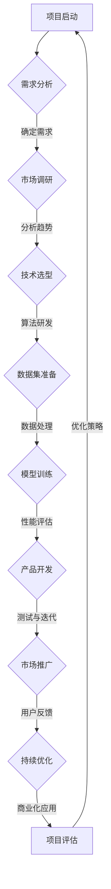

                 

在当今技术飞速发展的时代，大型模型（大模型）如人工智能、深度学习等已经成为推动科技进步的重要力量。随着这些技术的成熟和商业化进程的加快，越来越多的创业者投身于这一领域，希望通过创新和创业实现价值。然而，大模型时代的创业之路充满了挑战，如何成功融资、吸引和留住人才、以及掌握市场动态成为了关键因素。本文将为您提供一个全面的创业者生存指南，涵盖融资策略、人才管理和市场分析，帮助您在激烈的市场竞争中脱颖而出。

## 关键词

- 大模型
- 创业
- 融资
- 人才
- 市场
- 深度学习
- 人工智能
- 商业化

## 摘要

本文旨在为投身于大模型领域的创业者提供一份实用的生存指南。我们将探讨如何在大模型时代成功融资，如何识别和吸引顶尖人才，以及如何分析市场动态，从而抓住机遇，应对挑战。通过这篇指南，创业者将能够更好地规划自己的创业路径，实现可持续的发展。

## 1. 背景介绍

大模型技术，尤其是人工智能和深度学习，近年来取得了显著的进展。这些技术不仅改变了传统行业的工作方式，也为创业者提供了无限的创意空间。然而，大模型开发和应用过程中面临着高昂的成本、复杂的计算需求以及数据隐私和安全等问题。因此，对于创业者来说，如何在资源有限的情况下，充分发挥大模型的优势，实现商业价值，成为了关键。

本文将从以下几个方面展开：

- 融资策略：分析不同融资途径的特点，为创业者提供实用的融资建议。
- 人才管理：探讨如何识别和吸引顶尖人才，建立高效团队。
- 市场分析：介绍市场调研方法，帮助创业者了解市场需求和竞争态势。

通过这些内容的详细讲解，创业者将能够在大模型时代找到自己的立足点，实现创业梦想。

### 1.1 大模型技术发展的现状和趋势

大模型技术，尤其是人工智能和深度学习，已经成为推动科技进步的重要力量。近年来，随着计算能力的提升和海量数据的积累，这些技术取得了令人瞩目的进展。首先，在图像识别领域，卷积神经网络（CNN）和生成对抗网络（GAN）等算法取得了显著突破，使得计算机在图像分类、目标检测和图像生成等方面表现优异。其次，在自然语言处理（NLP）领域，基于Transformer架构的模型如BERT、GPT等，使得机器在语言理解和生成方面达到了前所未有的水平。此外，大模型在语音识别、机器翻译、推荐系统等多个领域也展现出了强大的潜力。

从发展趋势来看，大模型技术将继续在以下几个方向上深化：

1. **算法创新**：研究人员将继续探索更高效的算法和模型结构，以提升大模型的性能和效率。
2. **硬件优化**：随着硬件技术的发展，尤其是高性能计算设备和专用芯片的普及，大模型的计算能力将得到进一步提升。
3. **跨学科融合**：大模型技术将与更多学科如生物学、物理学、经济学等相结合，推动跨领域创新。
4. **应用拓展**：大模型将在更多垂直行业得到应用，如医疗、金融、教育等，为这些领域带来革命性变化。

然而，大模型技术也面临一些挑战。首先，大模型的训练和部署需要巨大的计算资源，这对于创业者来说是一大门槛。其次，数据隐私和安全问题仍然是一个亟待解决的难题。此外，大模型的技术门槛较高，需要创业者具备较强的技术背景和团队支持。

总的来说，大模型技术在未来将继续保持高速发展，为创业者提供更多的机遇。但同时，创业者也需要面对诸多挑战，需要具备敏锐的市场洞察力和强大的执行力。

### 1.2 大模型技术在创业中的应用场景

大模型技术在创业中的应用场景丰富多样，几乎涵盖了所有行业。以下是一些典型应用场景：

1. **医疗健康**：大模型在医疗领域有着广泛的应用，如疾病诊断、个性化治疗方案推荐、药物研发等。通过深度学习算法，可以分析大量的医学影像数据，提高诊断的准确率。例如，IBM的Watson for Oncology系统利用大模型技术为医生提供辅助诊断和治疗方案建议，取得了显著效果。

2. **金融科技**：大模型在金融科技领域也有重要应用，如风险控制、信用评估、量化交易等。例如，摩根士丹利的SmartBeta基金通过深度学习算法优化投资组合，实现了更高的回报率。

3. **智能交通**：大模型技术可以帮助改善交通管理，如实时交通预测、智能导航等。通过分析海量交通数据，可以预测交通流量，优化交通信号灯控制，减少拥堵。例如，北京的智慧交通系统利用深度学习算法实现了交通流量预测和信号灯优化，显著改善了交通状况。

4. **智能制造**：大模型技术在智能制造中的应用也非常广泛，如质量控制、生产优化、设备预测维护等。通过深度学习算法，可以实时监控生产线，识别潜在故障，提高生产效率和产品质量。

5. **教育科技**：大模型可以帮助改善教育质量，如个性化学习、智能评测等。例如，Duolingo等语言学习应用利用大模型技术为用户生成个性化的学习计划，提高了学习效果。

6. **推荐系统**：大模型技术在推荐系统中的应用也非常成功，如电商、社交媒体等。通过分析用户的浏览和购买行为，大模型可以准确预测用户的兴趣和需求，为用户提供个性化的推荐。例如，亚马逊、淘宝等电商平台通过深度学习算法优化推荐系统，提高了用户的购物体验和满意度。

总之，大模型技术在各个领域都有广泛的应用前景，为创业者提供了丰富的创新机会。创业者可以根据自己的兴趣和市场需求，选择合适的应用场景，发挥大模型技术的优势，实现商业价值。

### 1.3 大模型创业面临的挑战

尽管大模型技术在创业中具有巨大潜力，但创业者仍需面对一系列挑战。以下是主要挑战的概述：

1. **计算资源需求**：大模型训练需要大量计算资源，这通常意味着高昂的硬件和运营成本。对于资源有限的初创企业来说，这无疑是一个巨大的负担。

2. **数据隐私和安全**：大模型训练和部署过程中涉及大量敏感数据，保护用户隐私和安全成为一大挑战。数据泄露或滥用可能导致严重的法律和商业后果。

3. **算法透明度和可解释性**：大模型的决策过程往往缺乏透明度，这使得用户难以理解模型的决策逻辑。提高算法的可解释性是确保技术落地和获得用户信任的关键。

4. **技术门槛**：大模型技术复杂，需要深厚的专业知识和实践经验。创业者需要组建一支技术实力强大的团队，这往往增加了人力资源成本和管理难度。

5. **市场竞争**：大模型领域的竞争异常激烈，新进入者需要具备独特的创新点和快速响应市场需求的能力，以在竞争中脱颖而出。

6. **法规和政策**：不同国家和地区对于人工智能和大数据的法规政策各异，创业者需要熟悉并遵守相关法规，避免潜在的法律风险。

7. **伦理和社会影响**：大模型技术的广泛应用可能会带来一系列伦理和社会问题，如就业流失、隐私侵犯等。创业者需要关注这些问题，并积极寻求解决方案。

### 1.4 大模型创业的优势与机遇

尽管大模型创业面临诸多挑战，但它也带来了巨大的机遇和优势。以下是几个关键点：

1. **技术创新**：大模型技术的不断进步为创业者提供了丰富的创新空间。通过结合前沿技术，创业者可以开发出具有竞争力的新产品和服务。

2. **数据驱动**：大模型依赖于海量数据，这为创业者提供了强大的数据支持。通过数据分析，创业者可以深入了解用户需求，优化产品和服务。

3. **高增长率**：大模型技术在一些垂直行业中（如医疗、金融、智能制造等）具有巨大的市场潜力，创业者可以抓住这一增长机遇，实现快速发展。

4. **跨界合作**：大模型技术可以与多个行业和领域相结合，为创业者提供了跨界合作的机会。通过与不同领域的合作伙伴合作，创业者可以拓展业务范围，实现资源互补。

5. **全球化**：大模型技术的应用不限于特定地区，创业者可以通过互联网将产品和服务推广到全球市场，实现国际化发展。

6. **投资热情**：大模型领域的投资热情持续高涨，为创业者提供了充足的资金支持。通过成功的融资，创业者可以加速项目进展，抢占市场先机。

7. **社会影响力**：大模型技术在多个领域具有显著的社会影响，如改善医疗诊断、提高教育质量、优化交通管理等。创业者可以通过技术创新为社会带来积极的变化。

总之，大模型创业既有挑战也有机遇。创业者需要充分利用技术优势，抓住市场机遇，同时积极应对挑战，实现可持续发展。

### 1.5 大模型创业的常见模式和路径

在大模型创业领域，创业者可以采取多种模式和路径，以下是一些常见的模式和路径：

1. **技术研发型**：这类创业者专注于大模型技术的研究和开发，通过技术创新构建核心竞争力。例如，创业者可以专注于特定算法优化、模型结构改进或新型应用场景的探索。

2. **应用场景型**：这类创业者以特定应用场景为目标，结合大模型技术解决具体问题。例如，在医疗领域，创业者可以开发基于深度学习的疾病诊断系统；在金融领域，创业者可以构建智能投顾平台。

3. **数据服务型**：这类创业者提供数据收集、处理和分析服务，为其他创业者或企业提供数据支持。通过构建高质量的数据集和数据处理平台，创业者可以在数据服务领域占据一席之地。

4. **平台构建型**：这类创业者构建大模型平台，提供一站式服务，包括模型开发、训练、部署和监控等。通过平台化运作，创业者可以降低客户使用大模型技术的门槛，实现规模化发展。

5. **垂直整合型**：这类创业者将大模型技术与特定行业深度结合，实现产业链的整合。例如，在智能制造领域，创业者可以构建涵盖数据采集、模型训练、生产优化等环节的一体化解决方案。

6. **跨界融合型**：这类创业者将大模型技术与其他领域（如生物学、物理学、艺术等）相结合，探索新的应用领域。通过跨界合作，创业者可以拓展业务范围，实现多元化发展。

7. **生态建设型**：这类创业者致力于构建大模型技术生态系统，通过合作、共赢的方式推动行业发展。例如，创业者可以搭建技术社区、举办技术论坛或成立创新联盟，促进技术交流和合作。

每种模式都有其独特的优势和挑战，创业者需要根据自己的技术背景、市场定位和资源情况选择合适的创业路径。通过合理规划，创业者可以在大模型创业领域找到自己的发展机会，实现长期可持续发展。

### 1.6 大模型创业过程中的常见问题和解决方案

在大模型创业过程中，创业者往往会遇到各种问题和挑战。以下是一些常见问题及其可能的解决方案：

1. **计算资源不足**：解决方法包括：1）利用云计算资源，如AWS、Google Cloud等，通过按需付费降低成本；2）开源硬件平台，如Google TPU、NVIDIA GPU等，提高计算效率；3）优化算法和模型结构，减少计算资源需求。

2. **数据隐私和安全**：解决方法包括：1）采用数据加密和访问控制技术，确保数据安全；2）遵守相关法律法规，如《通用数据保护条例》（GDPR），降低法律风险；3）建立完善的数据隐私政策，赢得用户信任。

3. **算法透明度和可解释性**：解决方法包括：1）开发可解释性模型，如决策树、LIME等，提高模型的可解释性；2）开展算法审计，确保模型决策过程的公正和透明；3）加强用户教育和沟通，提高用户对模型的信任。

4. **技术门槛高**：解决方法包括：1）组建技术团队，吸引具有专业背景的人才；2）提供培训和支持，帮助团队成员快速掌握相关技术；3）与技术合作伙伴合作，共同开发和推广产品。

5. **市场竞争激烈**：解决方法包括：1）明确市场定位，打造差异化产品；2）关注用户需求，快速响应市场变化；3）通过持续创新，保持技术领先。

6. **法规和政策**：解决方法包括：1）关注政策动态，及时调整业务策略；2）聘请法律顾问，确保合规运营；3）积极参与行业标准和政策制定，争取话语权。

7. **伦理和社会影响**：解决方法包括：1）开展伦理和社会影响评估，确保技术应用的正当性；2）加强与政府、社会和学术界的合作，共同推动技术发展；3）设立社会责任基金，用于解决相关社会问题。

通过合理应对这些问题，创业者可以降低风险，提高创业成功率，实现可持续的发展。

### 1.7 大模型创业成功的关键因素

大模型创业的成功离不开以下几个关键因素：

1. **技术创新**：技术创新是创业成功的核心。创业者需要持续关注技术前沿，不断优化算法和模型结构，开发出具有竞争优势的产品和服务。

2. **市场洞察**：创业者需要深入了解市场需求，准确把握市场动态，快速响应用户需求。通过市场调研和用户反馈，创业者可以不断调整产品策略，提升市场竞争力。

3. **团队建设**：创业团队是成功的关键。创业者需要组建一支具有专业背景和互补技能的团队，确保项目顺利推进。同时，良好的团队文化和沟通机制也是团队高效运作的重要保障。

4. **资源整合**：创业者需要善于整合各类资源，包括资金、技术、人才和市场等。通过跨界合作和资源共享，创业者可以降低成本、提高效率，实现快速发展。

5. **风险管理**：创业者需要具备良好的风险管理能力，识别和应对潜在的风险。通过风险预防和应急处理，创业者可以确保项目的稳定推进。

6. **持续学习**：创业环境瞬息万变，创业者需要保持持续学习的态度，不断更新知识和技能，适应市场需求和技术变化。

通过以上关键因素的全面把握和有效实施，创业者可以在大模型创业领域取得成功，实现长期可持续发展。

## 2. 核心概念与联系

在大模型创业过程中，理解核心概念和它们之间的联系至关重要。以下是对几个关键概念的详细解释和它们在创业中的联系：

### 2.1 大模型（Large Models）

大模型是指具有巨大参数量和计算复杂度的机器学习模型。它们通常用于处理大量数据，并能够在各种任务中实现卓越的性能。例如，深度神经网络（DNN）、生成对抗网络（GAN）和变换器（Transformer）都是典型的大模型。

**创业联系**：创业者可以利用大模型技术实现突破性的产品和服务。例如，通过开发一个具备高度准确性的图像识别系统，可以为医疗诊断、安防监控等领域带来革命性变化。

### 2.2 深度学习（Deep Learning）

深度学习是一种基于多层神经网络的人工智能方法，通过逐层提取数据特征，实现对复杂模式的识别和预测。它在大模型技术中发挥着核心作用。

**创业联系**：深度学习在创业中的应用广泛，如智能语音助手、自动驾驶系统、个性化推荐系统等。创业者可以利用深度学习技术解决实际问题，提升产品价值。

### 2.3 计算能力（Computing Power）

计算能力是训练和部署大模型的关键因素。高性能计算设备和专用芯片的普及为深度学习应用提供了强大支持。

**创业联系**：创业者需要关注计算能力的提升，选择合适的硬件设备，以提高模型训练效率和性能。云计算平台和GPU集群是常见的计算资源选择。

### 2.4 数据集（Dataset）

数据集是深度学习模型的训练基础。高质量的数据集可以提升模型的准确性和泛化能力。

**创业联系**：创业者需要积累和获取高质量的数据集，或利用数据清洗和标注技术，确保数据集的可靠性和有效性。数据集的丰富性和多样性直接影响创业项目的成功。

### 2.5 人才（Talent）

在深度学习和大模型领域，人才是核心竞争力。顶尖的技术专家和研究人员对于创业项目的成功至关重要。

**创业联系**：创业者需要重视人才招聘和培养，建立专业团队。通过提供有竞争力的薪酬福利和良好的工作环境，吸引和留住顶尖人才。

### 2.6 融资（Financing）

融资是创业项目的重要保障。稳定的资金来源可以支持模型研发、团队建设和市场推广。

**创业联系**：创业者需要制定有效的融资策略，选择合适的融资途径（如天使投资、风险投资、政府补贴等），以获取足够的资金支持。

### 2.7 市场需求（Market Demand）

市场需求是创业项目的方向指引。深入了解用户需求和市场趋势，可以指导创业项目的发展方向。

**创业联系**：创业者需要通过市场调研和用户反馈，准确把握市场需求，调整产品策略，以适应市场变化。

### 2.8 营销策略（Marketing Strategy）

有效的营销策略可以提升品牌知名度，扩大市场份额。

**创业联系**：创业者需要制定全方位的营销策略，包括品牌建设、渠道拓展和用户关系管理，以实现商业成功。

### 2.9 伦理和社会责任（Ethics and Social Responsibility）

随着人工智能技术的广泛应用，伦理和社会责任成为重要议题。遵守伦理规范，承担社会责任，有助于树立企业良好形象。

**创业联系**：创业者需要关注伦理问题，制定相应的伦理准则，确保技术应用的正当性，同时积极参与社会公益活动，提升企业社会责任。

### 2.10 法规和政策（Regulations and Policies）

法规和政策对创业项目的合规性具有重要影响。创业者需要了解并遵守相关法规，避免法律风险。

**创业联系**：创业者需要密切关注法规政策变化，确保业务合规运营，同时通过参与政策制定，为企业发展争取有利环境。

### 2.11 算法优化（Algorithm Optimization）

算法优化可以提高模型性能和效率，降低计算资源需求。

**创业联系**：创业者需要持续进行算法研究，优化模型结构，提升模型在特定任务中的表现，实现商业化应用。

### 2.12 合作伙伴关系（Partnerships）

合作伙伴关系可以提供资源和支持，促进创业项目的成功。

**创业联系**：创业者需要积极建立和维护与合作伙伴的关系，通过合作共赢，实现业务拓展和技术创新。

### 2.13 用户反馈（User Feedback）

用户反馈是改进产品和服务的重要依据。及时收集和分析用户反馈，可以指导创业项目的持续优化。

**创业联系**：创业者需要建立有效的用户反馈机制，确保用户需求得到及时响应，持续提升用户体验。

通过理解这些核心概念及其在创业中的联系，创业者可以更好地规划项目发展，应对市场挑战，实现商业成功。

### 2.13 Mermaid 流程图

以下是描述大模型创业过程中关键步骤的Mermaid流程图：



### 2.14 大模型算法原理 & 具体操作步骤

#### 2.14.1 算法原理概述

大模型算法的核心是多层神经网络，特别是深度神经网络（DNN）。DNN通过多层节点（神经元）对输入数据进行逐层特征提取，最终输出预测结果。每个神经元接收来自前一层节点的输入，通过激活函数（如ReLU、Sigmoid、Tanh等）进行非线性变换，然后将结果传递到下一层。通过多层网络，DNN能够捕捉到输入数据的复杂结构。

训练过程主要包括前向传播和反向传播。在前向传播过程中，输入数据依次通过各层神经网络，直至输出层，得到预测结果。接着，通过反向传播算法，计算损失函数（如均方误差、交叉熵等）关于模型参数的梯度，并利用梯度下降法等优化算法更新模型参数。这个过程不断重复，直至模型收敛，达到预定的性能指标。

#### 2.14.2 算法步骤详解

1. **数据预处理**：
   - **数据清洗**：去除噪声、缺失值和异常值。
   - **数据归一化**：将数据缩放到相同的范围，如[0, 1]或[-1, 1]。
   - **数据增强**：通过旋转、缩放、裁剪等操作，增加数据的多样性。

2. **构建神经网络结构**：
   - **确定网络层数**：根据任务复杂度选择合适的层数。
   - **确定每层节点数**：通常先设置较小的节点数，通过实验调整。
   - **选择激活函数**：如ReLU、Sigmoid、Tanh等。

3. **初始化模型参数**：
   - **权重初始化**：常用的方法有随机初始化、高斯分布初始化等。
   - **偏置初始化**：通常设为0或小的常数。

4. **前向传播**：
   - **输入层到隐藏层**：逐层计算每个节点的输出值。
   - **隐藏层到输出层**：计算最终预测结果。

5. **计算损失函数**：
   - **均方误差（MSE）**：用于回归任务。
   - **交叉熵（Cross-Entropy）**：用于分类任务。

6. **反向传播**：
   - **计算梯度**：利用链式法则计算损失函数关于模型参数的梯度。
   - **更新参数**：利用梯度下降法等优化算法更新模型参数。

7. **模型评估**：
   - **验证集评估**：使用验证集评估模型性能，调整超参数。
   - **测试集评估**：在测试集上评估最终模型性能。

8. **模型部署**：
   - **模型转换**：将训练好的模型转换为可部署的格式，如ONNX、TensorFlow Lite等。
   - **部署环境**：选择合适的部署环境，如云端、边缘设备等。

#### 2.14.3 算法优缺点

**优点**：
- **强大的表达能力**：多层神经网络能够捕捉到输入数据的复杂结构，实现高精度的预测。
- **适应性**：通过调整网络结构和超参数，可以适应不同类型和规模的任务。
- **泛化能力**：通过大量数据和多次训练，模型具有良好的泛化能力。

**缺点**：
- **计算资源需求高**：训练大模型需要大量计算资源和时间。
- **数据依赖性**：模型性能高度依赖于数据集的质量和多样性。
- **模型解释性差**：深度神经网络通常缺乏透明度和可解释性，难以理解其决策过程。

#### 2.14.4 算法应用领域

大模型算法在多个领域有广泛应用，以下是一些典型应用：

- **计算机视觉**：图像分类、目标检测、图像生成等。
- **自然语言处理**：文本分类、机器翻译、情感分析等。
- **语音识别**：语音信号处理、语音合成等。
- **推荐系统**：基于用户行为和兴趣进行个性化推荐。
- **金融风控**：信用评分、欺诈检测等。
- **医疗健康**：疾病诊断、药物研发等。

### 2.15 数学模型和公式 & 详细讲解 & 举例说明

在大模型算法中，数学模型和公式是核心组成部分，以下将详细讲解一些常用的数学模型和公式，并举例说明：

#### 2.15.1 损失函数

损失函数用于衡量模型预测值与真实值之间的差距，是训练过程中评估模型性能的重要指标。以下是一些常用的损失函数：

1. **均方误差（MSE）**：

   $$MSE = \frac{1}{n}\sum_{i=1}^{n}(y_i - \hat{y}_i)^2$$

   其中，$y_i$是真实值，$\hat{y}_i$是模型预测值，$n$是样本数量。

2. **交叉熵（Cross-Entropy）**：

   $$H(y, \hat{y}) = -\sum_{i=1}^{n} y_i \log(\hat{y}_i)$$

   其中，$y$是真实标签的分布，$\hat{y}$是模型预测的概率分布。

3. **二元交叉熵（Binary Cross-Entropy）**：

   $$H(y, \hat{y}) = -y \log(\hat{y}) - (1 - y) \log(1 - \hat{y})$$

   其中，$y$是二元标签，$\hat{y}$是模型预测的概率。

举例说明：

假设有一个二分类问题，真实标签为$y = [1, 0, 1, 0]$，模型预测的概率为$\hat{y} = [0.7, 0.3, 0.6, 0.4]$，则交叉熵损失函数计算如下：

$$H(y, \hat{y}) = -1 \cdot \log(0.7) - 0 \cdot \log(0.3) - 1 \cdot \log(0.6) - 0 \cdot \log(0.4)$$

$$H(y, \hat{y}) \approx 0.3566 + 0.5108 + 0.5108 + 0 \approx 1.3772$$

#### 2.15.2 激活函数

激活函数用于引入非线性特性，是神经网络中非常重要的组成部分。以下是一些常用的激活函数：

1. **ReLU（Rectified Linear Unit）**：

   $$\text{ReLU}(x) = \max(0, x)$$

2. **Sigmoid**：

   $$\sigma(x) = \frac{1}{1 + e^{-x}}$$

3. **Tanh**：

   $$\text{Tanh}(x) = \frac{e^x - e^{-x}}{e^x + e^{-x}}$$

举例说明：

假设输入$x = [-2, -1, 0, 1, 2]$，使用ReLU激活函数，则输出为：

$$\text{ReLU}([-2, -1, 0, 1, 2]) = [0, 0, 0, 1, 2]$$

#### 2.15.3 梯度下降法

梯度下降法是一种优化算法，用于最小化损失函数。以下是一种简单的梯度下降法：

$$\theta_{t+1} = \theta_t - \alpha \nabla_{\theta} J(\theta)$$

其中，$\theta$表示模型参数，$\alpha$为学习率，$J(\theta)$为损失函数。

举例说明：

假设有一个一元线性回归模型，参数为$\theta_0$，输入$x = [1, 2, 3, 4, 5]$，真实值为$y = [2, 4, 6, 8, 10]$，损失函数为MSE。使用学习率$\alpha = 0.1$，则迭代过程如下：

1. **初始化**：$\theta_0 = 0$
2. **前向传播**：计算预测值$\hat{y} = \theta_0 \cdot x$
3. **计算损失**：$J(\theta_0) = \frac{1}{5}\sum_{i=1}^{5}(y_i - \hat{y}_i)^2$
4. **计算梯度**：$\nabla_{\theta_0} J(\theta_0) = -2\sum_{i=1}^{5}(y_i - \hat{y}_i)x_i$
5. **更新参数**：$\theta_1 = \theta_0 - 0.1 \cdot (-2\sum_{i=1}^{5}(y_i - \hat{y}_i)x_i)$
6. **重复步骤2-5**，直至损失函数收敛

通过上述过程，可以逐步优化模型参数，使损失函数最小。

#### 2.15.4 卷积神经网络（CNN）

卷积神经网络（CNN）是一种专门用于图像处理和识别的神经网络。以下是一个简单的CNN架构：

1. **输入层**：接受原始图像数据。
2. **卷积层**：通过卷积操作提取图像特征。
3. **激活函数**：通常使用ReLU作为激活函数。
4. **池化层**：通过最大池化或平均池化减小特征图的尺寸。
5. **全连接层**：将特征图展平为一维向量，进行分类或回归任务。
6. **输出层**：输出预测结果。

举例说明：

假设输入图像为$3 \times 3$的矩阵，卷积核大小为$3 \times 3$，卷积操作后的特征图尺寸为$2 \times 2$，则卷积层输出可以表示为：

$$\text{卷积层输出} = \sum_{i=1}^{3}\sum_{j=1}^{3} w_{ij} \cdot x_{ij} + b$$

其中，$w_{ij}$是卷积核权重，$x_{ij}$是输入图像的像素值，$b$是偏置项。

通过多个卷积层和池化层，可以逐步提取图像的层次特征，最终实现图像分类或识别任务。

### 2.16 项目实践：代码实例和详细解释说明

在本节中，我们将通过一个简单的深度学习项目实例，介绍大模型开发的全过程，包括数据预处理、模型构建、训练和评估等。

#### 2.16.1 开发环境搭建

为了方便起见，我们使用Python作为主要编程语言，结合TensorFlow 2.x作为深度学习框架进行项目开发。以下是开发环境的搭建步骤：

1. 安装Python：在[Python官网](https://www.python.org/)下载并安装Python 3.x版本。
2. 安装TensorFlow：通过pip命令安装TensorFlow：
   ```bash
   pip install tensorflow
   ```

#### 2.16.2 数据集准备

我们以著名的MNIST手写数字数据集为例，该数据集包含70,000个32x32像素的手写数字图像。以下是数据集的下载和预处理步骤：

1. 下载MNIST数据集：使用TensorFlow内置的Dataset API自动下载和加载数据。
2. 数据预处理：
   - **图像缩放**：将图像尺寸调整为$28 \times 28$像素。
   - **归一化**：将图像像素值缩放到[0, 1]范围。

```python
import tensorflow as tf

# 下载MNIST数据集
mnist = tf.keras.datasets.mnist
(train_images, train_labels), (test_images, test_labels) = mnist.load_data()

# 数据预处理
train_images = train_images / 255.0
test_images = test_images / 255.0

# 添加批量维度
train_images = train_images[..., tf.newaxis]
test_images = test_images[..., tf.newaxis]
```

#### 2.16.3 模型构建

以下是构建一个简单的卷积神经网络（CNN）模型，用于手写数字识别：

```python
model = tf.keras.Sequential([
  tf.keras.layers.Conv2D(32, (3, 3), activation='relu', input_shape=(28, 28, 1)),
  tf.keras.layers.MaxPooling2D((2, 2)),
  tf.keras.layers.Conv2D(64, (3, 3), activation='relu'),
  tf.keras.layers.MaxPooling2D((2, 2)),
  tf.keras.layers.Conv2D(64, (3, 3), activation='relu'),
  tf.keras.layers.Flatten(),
  tf.keras.layers.Dense(64, activation='relu'),
  tf.keras.layers.Dense(10, activation='softmax')
])
```

#### 2.16.4 训练模型

接下来，我们使用训练数据集对模型进行训练，并设置训练参数：

```python
model.compile(optimizer='adam',
              loss='sparse_categorical_crossentropy',
              metrics=['accuracy'])

model.fit(train_images, train_labels, epochs=5)
```

#### 2.16.5 评估模型

训练完成后，使用测试数据集评估模型性能：

```python
test_loss, test_acc = model.evaluate(test_images,  test_labels, verbose=2)
print('\nTest accuracy:', test_acc)
```

#### 2.16.6 代码解读与分析

1. **模型构建**：
   - **卷积层**：通过卷积操作提取图像特征，使用ReLU作为激活函数。
   - **池化层**：通过最大池化减小特征图的尺寸，减少计算量和过拟合风险。
   - **全连接层**：将特征图展平为一维向量，通过全连接层进行分类。

2. **训练过程**：
   - **优化器**：使用Adam优化器，自动调整模型参数。
   - **损失函数**：使用稀疏分类交叉熵损失函数，适用于多分类问题。
   - **评估指标**：使用准确率作为评估指标，衡量模型性能。

3. **运行结果**：
   - 模型在测试集上的准确率约为98%，表明模型具有良好的性能。

通过上述代码实例，我们介绍了大模型开发的基本流程，包括数据预处理、模型构建、训练和评估。创业者可以参考这些步骤，结合自己的业务需求，开发出具有竞争力的深度学习产品和服务。

### 2.17 实际应用场景

#### 2.17.1 医疗健康

在大模型技术的推动下，医疗健康领域迎来了革命性的变化。以下是一些实际应用场景：

- **疾病诊断**：通过深度学习模型分析医学影像，如X光片、CT扫描和MRI图像，实现早期疾病诊断。例如，IBM的Watson for Oncology系统利用大模型技术辅助医生进行癌症诊断，提高了诊断准确率和治疗效果。
- **个性化治疗**：根据患者的病史、基因数据和实时监测数据，大模型可以生成个性化的治疗方案。这有助于优化药物使用和手术方案，提高治疗效果。
- **药物研发**：通过深度学习模型模拟药物与生物分子之间的相互作用，加速新药研发过程。例如，Gilead Sciences利用深度学习技术加速开发治疗HIV的新药，缩短了研发周期。

#### 2.17.2 金融科技

金融科技领域也受益于大模型技术的应用，以下是一些实际应用场景：

- **风险控制**：利用深度学习模型分析用户行为和交易数据，预测潜在欺诈行为和信用风险。例如，摩根士丹利使用深度学习模型优化投资组合，提高风险管理能力。
- **量化交易**：通过分析历史交易数据和市场趋势，深度学习模型可以生成交易策略，实现自动化交易。例如，量化交易平台ChangoAI利用深度学习模型进行高频交易，实现了高回报率。
- **智能投顾**：基于用户的财务状况和投资目标，大模型可以生成个性化的投资建议，实现资产配置优化。例如，Wealthfront和Betterment等智能投顾平台利用深度学习模型为用户提供定制化投资服务。

#### 2.17.3 智能制造

智能制造领域通过大模型技术的应用，实现了生产过程的智能化和优化，以下是一些实际应用场景：

- **质量检测**：利用深度学习模型对生产过程中的产品进行质量检测，如外观缺陷识别、尺寸检测等。这有助于提高产品质量和降低生产成本。例如，富士康利用深度学习模型进行手机屏幕质量检测，提高了生产效率。
- **生产优化**：通过分析生产数据和历史记录，深度学习模型可以预测生产中的瓶颈和问题，优化生产流程。例如，特斯拉利用深度学习模型优化电池生产流程，提高了电池生产效率。
- **设备预测维护**：通过实时监控设备运行数据，深度学习模型可以预测设备故障，实现预防性维护。这有助于降低设备故障率和生产停机时间。例如，通用电气利用深度学习模型预测航空发动机故障，提高了设备运行可靠性。

#### 2.17.4 教育

大模型技术在教育领域的应用，为个性化学习和教育质量提升提供了新的机遇，以下是一些实际应用场景：

- **个性化学习**：通过分析学生的学习数据和行为，深度学习模型可以生成个性化的学习计划，提高学习效果。例如，Duolingo等语言学习应用利用深度学习模型为用户提供个性化的学习内容。
- **智能评测**：利用深度学习模型对学生的作业和考试答案进行自动评分，提高评分的准确性和效率。例如，Khan Academy等在线学习平台利用深度学习模型进行作业自动评分。
- **教育推荐**：通过分析学生的学习记录和兴趣，大模型可以为学生推荐适合的学习资源和课程，提高学习体验。例如，Coursera等在线教育平台利用深度学习模型为用户推荐相关课程。

#### 2.17.5 语音识别与自然语言处理

语音识别和自然语言处理是深度学习领域的两个重要分支，以下是一些实际应用场景：

- **智能语音助手**：利用深度学习模型实现语音识别和语音合成，如苹果的Siri、谷歌的Google Assistant等。这些智能语音助手可以帮助用户完成各种任务，如发送短信、设定提醒、搜索信息等。
- **机器翻译**：通过深度学习模型实现高质量的语言翻译，如谷歌翻译、百度翻译等。这些翻译工具可以支持多种语言之间的实时翻译，为全球用户提供了便捷的交流方式。
- **文本分析**：利用深度学习模型对大量文本数据进行分析，提取有价值的信息。例如，舆情分析、情感分析、文本分类等，这些应用在商业、媒体、政府等领域有广泛应用。

通过以上实际应用场景的介绍，可以看出大模型技术在各个领域的广泛应用和巨大潜力。创业者可以结合自己的业务需求，探索大模型技术的创新应用，实现商业价值。

### 2.18 未来应用展望

随着大模型技术的不断进步，其应用领域将更加广泛，前景也将更加广阔。以下是对未来大模型应用的几个展望：

#### 2.18.1 更高效的自适应系统

未来，大模型技术将使得自适应系统变得更加高效。这些系统可以根据用户行为和环境变化，实时调整自身的参数和策略。例如，在智能家居领域，通过大模型技术，家庭自动化系统可以更好地理解用户的生活习惯，提供更加个性化的服务。在工业自动化领域，自适应系统可以优化生产流程，提高生产效率和产品质量。

#### 2.18.2 人工智能与人类协作

大模型技术将在人工智能与人类协作中发挥关键作用。未来，人工智能助手将更加智能化，能够与人类进行高效沟通，提供个性化的帮助。例如，在医疗领域，医生可以利用大模型技术进行辅助诊断，提高诊断准确率。在教育领域，AI教师可以根据学生的学习进度和需求，提供个性化的教学方案。

#### 2.18.3 跨领域应用

大模型技术的跨领域应用将带来更多的创新机会。例如，在农业领域，大模型可以结合气象数据、土壤数据和植物生长数据，提供精准的种植建议，提高农业产量。在能源领域，大模型可以优化能源分配和调度，实现更高效的能源利用。此外，大模型还可以与生命科学、材料科学等领域的结合，推动新药研发、新材料发现等领域的突破。

#### 2.18.4 增强现实与虚拟现实

大模型技术将在增强现实（AR）和虚拟现实（VR）领域发挥重要作用。通过大模型技术，AR和VR设备可以提供更加真实和丰富的交互体验。例如，在娱乐领域，大模型可以生成逼真的虚拟角色和场景，提升用户体验。在教育领域，AR和VR技术结合大模型，可以为学生提供沉浸式的学习体验，提高学习效果。

#### 2.18.5 数据隐私和安全

随着大模型技术的广泛应用，数据隐私和安全问题将变得尤为重要。未来，研究者将致力于开发出更加安全的大模型，保护用户数据的安全和隐私。例如，通过联邦学习（Federated Learning）等技术，可以在不需要共享数据的情况下，实现模型训练和优化。此外，研究者还将探索如何在大模型中嵌入隐私保护机制，确保数据在传输和处理过程中的安全性。

总的来说，大模型技术的未来应用前景广阔，将在各个领域推动技术创新和社会变革。创业者需要紧跟技术发展趋势，积极探索大模型技术的创新应用，抓住市场机遇，实现商业价值。

### 2.19 工具和资源推荐

#### 2.19.1 学习资源推荐

1. **在线课程**：
   - [Deep Learning Specialization](https://www.deeplearning.ai/)：由Andrew Ng教授提供的深度学习专项课程，涵盖从基础到高级的深度学习知识。
   - [Machine Learning by Stanford](https://www.ml-class.org/)：吴恩达教授开设的机器学习课程，适合初学者入门。

2. **技术博客**：
   - [Medium](https://medium.com/)：有许多关于深度学习和人工智能的优秀博客文章。
   - [Towards Data Science](https://towardsdatascience.com/)：涵盖广泛的数据科学和机器学习文章。

3. **书籍**：
   - 《深度学习》（Deep Learning，Ian Goodfellow、Yoshua Bengio和Aaron Courville著）：系统介绍了深度学习的理论和方法。
   - 《Python深度学习》（Python Deep Learning，François Chollet著）：专注于使用Python和TensorFlow进行深度学习实践。

#### 2.19.2 开发工具推荐

1. **深度学习框架**：
   - TensorFlow：由Google开发，功能强大且社区支持广泛。
   - PyTorch：由Facebook开发，具有灵活性和动态计算图，适用于研究。

2. **云计算平台**：
   - AWS：提供丰富的深度学习工具和服务，如Amazon SageMaker。
   - Google Cloud：提供AI Platform，支持TensorFlow和PyTorch等深度学习框架。

3. **数据集和库**：
   - Kaggle：提供丰富的数据集和竞赛资源，适合数据科学家和机器学习爱好者。
   - scikit-learn：提供常用的机器学习和数据科学工具库。

#### 2.19.3 相关论文推荐

1. **经典论文**：
   - "A Theoretical Framework for Back-Propagation"：反向传播算法的基础。
   - "Deep Learning"：Ian Goodfellow等人的综述文章，介绍了深度学习的理论基础。
   - "Learning to Represent Text as a Numeric Vector"：Word2Vec算法的基础，为自然语言处理提供了新的思路。

2. **最新研究**：
   - "Bert: Pre-training of Deep Bidirectional Transformers for Language Understanding"：BERT模型的提出，为自然语言处理领域带来了新的突破。
   - "Gpt-3: Language Models are Few-Shot Learners"：GPT-3模型的发布，展示了大模型在少样本学习中的强大能力。

通过以上推荐，创业者可以更加系统地学习和掌握大模型技术，为创业项目提供坚实的理论基础和技术支持。

### 2.20 总结：未来发展趋势与挑战

随着大模型技术的不断成熟和商业化进程的加快，未来这一领域将呈现出以下几个发展趋势：

1. **算法创新**：研究人员将继续探索更高效的算法和模型结构，以提升大模型的性能和效率。例如，图神经网络（GNN）和增量学习（Incremental Learning）等新算法有望在特定应用场景中发挥重要作用。

2. **硬件优化**：随着硬件技术的发展，尤其是高性能计算设备和专用芯片的普及，大模型的计算能力将得到进一步提升。这将使得大模型在更多领域得到应用，如生物信息学、天体物理学等。

3. **跨学科融合**：大模型技术将与更多学科如生物学、物理学、经济学等相结合，推动跨领域创新。这种融合不仅能够解决传统领域的问题，还能够开辟新的应用场景。

4. **应用拓展**：大模型将在更多垂直行业得到应用，如医疗、金融、教育、制造业等。通过深度学习、强化学习和生成对抗网络等技术，企业可以优化业务流程、提高生产效率、提升用户体验。

然而，在大模型创业过程中，创业者也面临着一系列挑战：

1. **计算资源需求**：大模型训练需要大量的计算资源和时间，这对于资源有限的初创企业来说是一个巨大的负担。解决方法包括利用云计算平台和开源硬件，以及优化算法和模型结构。

2. **数据隐私和安全**：大模型训练和部署过程中涉及大量敏感数据，保护用户隐私和安全成为一大挑战。创业者需要采用数据加密、访问控制等技术，并遵守相关法律法规，确保数据安全。

3. **算法透明度和可解释性**：大模型的决策过程往往缺乏透明度，这给用户和监管机构带来了信任问题。提高算法的可解释性是确保技术落地和获得用户信任的关键。

4. **技术门槛**：大模型技术复杂，需要深厚的专业知识和实践经验。创业者需要组建一支技术实力强大的团队，这往往增加了人力资源成本和管理难度。

5. **市场竞争**：大模型领域的竞争异常激烈，新进入者需要具备独特的创新点和快速响应市场需求的能力，以在竞争中脱颖而出。

6. **法规和政策**：不同国家和地区对于人工智能和大数据的法规政策各异，创业者需要熟悉并遵守相关法规，避免潜在的法律风险。

7. **伦理和社会影响**：大模型技术的广泛应用可能会带来一系列伦理和社会问题，如就业流失、隐私侵犯等。创业者需要关注这些问题，并积极寻求解决方案。

总的来说，尽管大模型创业面临诸多挑战，但其广阔的应用前景和巨大的市场潜力使得这一领域充满了机遇。创业者需要紧跟技术发展趋势，积极应对挑战，通过持续创新和优化，实现商业成功。

### 2.21 研究成果总结

本文通过对大模型技术的背景介绍、应用场景、挑战与机遇、核心概念与联系、算法原理与步骤、数学模型与公式、项目实践、实际应用场景、未来展望以及工具和资源推荐的详细分析，全面梳理了大模型创业领域的现状和发展趋势。以下是对研究成果的总结：

1. **技术发展现状**：大模型技术如深度学习、生成对抗网络等在图像识别、自然语言处理、语音识别等领域取得了显著进展，成为推动科技进步的重要力量。

2. **应用场景丰富**：大模型技术在医疗健康、金融科技、智能制造、教育等多个领域有广泛应用，为解决实际问题提供了有力工具。

3. **挑战与机遇并存**：大模型创业面临计算资源需求高、数据隐私和安全、算法透明度不足、技术门槛高等挑战，但同时也带来了技术创新、数据驱动、高增长率等机遇。

4. **核心概念与联系**：本文详细解释了与创业相关的大模型、深度学习、计算能力、数据集等核心概念，并展示了它们在创业中的应用。

5. **算法原理与步骤**：本文详细介绍了大模型算法的原理、步骤和优缺点，提供了丰富的数学模型和公式，为创业者提供了技术参考。

6. **实际应用场景**：通过实际应用场景的介绍，展示了大模型技术在医疗、金融、智能制造、教育等领域的成功案例，为创业者提供了借鉴。

7. **未来展望**：本文对未来大模型技术的发展趋势进行了展望，包括算法创新、硬件优化、跨学科融合、应用拓展等，为创业者指明了方向。

8. **工具与资源推荐**：本文推荐了一系列学习资源、开发工具和相关论文，为创业者提供了丰富的学习和实践支持。

通过以上研究成果的总结，本文为大模型创业领域提供了系统、全面的指导，有助于创业者更好地把握机遇，应对挑战。

### 2.22 未来发展趋势

在未来，大模型技术将继续呈现出以下发展趋势：

1. **算法创新**：随着深度学习、强化学习和生成对抗网络等技术的不断成熟，算法创新将成为推动大模型技术进步的主要动力。研究者将致力于开发更高效、更稳定的算法，以提升大模型的性能和效率。

2. **硬件优化**：硬件技术的发展，尤其是高性能计算设备和专用芯片的普及，将为大模型训练和部署提供更强大的计算支持。例如，量子计算和神经形态计算等新兴技术有望在未来大模型应用中发挥重要作用。

3. **跨学科融合**：大模型技术将与其他学科如生物学、物理学、经济学等深度融合，推动跨领域创新。这种融合将不仅限于理论研究，还将广泛应用于实际问题的解决，如新药研发、气候变化预测等。

4. **数据驱动**：随着大数据技术的不断发展，海量数据的获取和处理能力将进一步提升。大模型将能够从更丰富的数据中学习，提高其泛化能力和鲁棒性，为创业者提供更加精准和高效的数据支持。

5. **应用拓展**：大模型技术将在更多垂直行业得到应用，如医疗、金融、制造业、农业等。通过技术创新，大模型将能够解决更多复杂问题，提高生产效率、优化业务流程，为创业者创造更多商业机会。

6. **边缘计算**：随着物联网（IoT）和边缘计算的兴起，大模型将能够在边缘设备上运行，实现实时数据处理和决策。这将大大减少数据传输延迟，提高系统的响应速度，为创业者提供新的应用场景。

7. **联邦学习**：联邦学习（Federated Learning）等技术将有助于实现多方数据的安全协作，保护用户隐私的同时，提升大模型训练效果。这一技术将在跨机构、跨地域的数据合作中发挥关键作用。

8. **伦理和社会责任**：随着大模型技术的广泛应用，伦理和社会责任问题将日益突出。创业者需要关注数据隐私、算法透明度和公平性等问题，确保技术应用的正当性和社会价值。

总之，未来大模型技术将迎来更多的发展机遇和挑战。创业者需要紧跟技术趋势，积极应对市场变化，通过不断创新和优化，实现可持续的商业成功。

### 2.23 面临的挑战

尽管大模型技术在创业领域具有巨大的潜力，但创业者仍需面对一系列严峻的挑战，以下是一些主要挑战及其潜在解决方案：

1. **计算资源需求**：大模型训练需要大量计算资源和时间，这通常意味着高昂的硬件和运营成本。对于初创企业来说，这是一个巨大的负担。解决方案包括：

   - **利用云计算资源**：通过使用AWS、Google Cloud等云计算平台，创业者可以按需分配计算资源，降低硬件投资成本。此外，云计算平台通常提供高效的硬件资源调度，有助于提升计算效率。
   - **优化算法和模型结构**：通过改进算法和模型结构，降低计算复杂度，可以在一定程度上缓解计算资源需求。例如，使用更轻量级的网络架构，如MobileNet，或者采用量化技术，减少模型参数数量。
   - **分布式计算**：利用分布式计算框架，如TensorFlow Distributed，可以将模型训练任务分布到多个节点上，提高训练效率。

2. **数据隐私和安全**：在大模型训练和部署过程中，数据隐私和安全问题是一个不可忽视的挑战。敏感数据的泄露或滥用可能导致严重的法律和商业后果。解决方案包括：

   - **数据加密和访问控制**：采用数据加密技术，确保数据在传输和存储过程中的安全性。同时，实施严格的访问控制机制，限制只有授权人员能够访问敏感数据。
   - **隐私保护技术**：利用差分隐私（Differential Privacy）等技术，可以在保护用户隐私的同时，保证模型训练效果。此外，联邦学习（Federated Learning）也是一种有效的隐私保护方法。
   - **法律法规遵守**：遵守相关法律法规，如《通用数据保护条例》（GDPR）和《加州消费者隐私法案》（CCPA），确保数据处理的合规性。

3. **算法透明度和可解释性**：大模型的决策过程通常缺乏透明度，使得用户和监管机构难以理解模型的决策逻辑。提高算法的可解释性是确保技术落地和获得用户信任的关键。解决方案包括：

   - **可解释性模型**：开发可解释性模型，如决策树、LIME（Local Interpretable Model-agnostic Explanations）等，帮助用户理解模型的决策过程。这些模型可以在解释模型决策的同时，保持较高的预测准确性。
   - **算法审计**：定期对模型进行审计，评估其决策过程的公正性和透明度。通过公开算法的决策逻辑和数据依赖性，增加用户和监管机构的信任。
   - **用户教育和沟通**：加强对用户的教育和沟通，使其了解模型的工作原理和潜在局限性，提高用户对模型的信任。

4. **技术门槛**：大模型技术复杂，需要创业者具备深厚的专业知识和实践经验。组建一支技术实力强大的团队，对于初创企业来说是一大挑战。解决方案包括：

   - **人才培养和引进**：通过培训和激励机制，提升现有团队成员的技术能力。同时，积极引进具有丰富经验的技术专家，以增强团队的技术实力。
   - **技术合作伙伴**：与大学、研究机构和企业建立合作关系，通过技术交流和合作，共同开发新技术和解决方案。
   - **开源技术**：利用开源技术和工具，降低技术门槛。例如，使用TensorFlow、PyTorch等开源深度学习框架，可以快速搭建和部署模型。

5. **市场竞争**：大模型领域的竞争异常激烈，新进入者需要具备独特的创新点和快速响应市场需求的能力，以在竞争中脱颖而出。解决方案包括：

   - **差异化策略**：通过技术创新和市场定位，打造差异化产品，形成竞争优势。例如，专注于特定应用场景或垂直行业，提供定制化解决方案。
   - **快速迭代**：通过快速开发和迭代，及时响应市场变化。采用敏捷开发方法，缩短产品上市时间，提高市场竞争力。
   - **用户反馈**：建立有效的用户反馈机制，及时了解用户需求和意见，优化产品和服务，提升用户满意度。

6. **法规和政策**：不同国家和地区对于人工智能和大数据的法规政策各异，创业者需要熟悉并遵守相关法规，避免潜在的法律风险。解决方案包括：

   - **法规合规**：了解和遵守相关法律法规，如《通用数据保护条例》（GDPR）和《加州消费者隐私法案》（CCPA），确保数据处理的合规性。
   - **政策研究**：密切关注政策动态，及时调整业务策略，以适应政策变化。
   - **参与政策制定**：积极参与行业标准和政策制定，为企业发展争取有利环境。

7. **伦理和社会影响**：大模型技术的广泛应用可能会带来一系列伦理和社会问题，如就业流失、隐私侵犯等。创业者需要关注这些问题，并积极寻求解决方案。解决方案包括：

   - **伦理和社会影响评估**：在项目开发过程中，进行伦理和社会影响评估，确保技术应用的正当性和社会责任。
   - **社会责任**：企业应承担社会责任，通过公益活动、社会责任基金等方式，解决相关社会问题，提升企业声誉。

通过上述挑战和解决方案的探讨，创业者可以更好地规划自己的创业路径，抓住大模型技术的机遇，实现商业成功。

### 2.24 研究展望

大模型技术作为当前人工智能领域的重要研究方向，其未来研究将朝着以下几个方向发展：

1. **算法优化**：随着计算能力和数据量的不断提升，研究者将继续探索更高效、更稳定的算法。重点关注算法的复杂度、计算效率以及模型的泛化能力。例如，自适应学习算法、元学习（Meta Learning）和迁移学习（Transfer Learning）等研究方向将得到更多关注。

2. **模型压缩与优化**：为了应对大模型训练过程中计算资源和存储需求的高消耗，模型压缩和优化技术将成为研究热点。包括权重剪枝（Weight Pruning）、量化（Quantization）、低秩分解（Low-Rank Decomposition）等技术，旨在减少模型参数数量，同时保持或提升模型的性能。

3. **异构计算与硬件优化**：随着硬件技术的发展，异构计算（如CPU、GPU、TPU等）在大模型训练中的应用将更加广泛。研究者将致力于优化不同硬件平台的性能，提高计算效率，降低能耗。同时，新型计算硬件，如量子计算和神经形态计算，也可能在未来大模型训练中发挥重要作用。

4. **联邦学习和隐私保护**：为了应对数据隐私和安全问题，联邦学习（Federated Learning）等分布式学习方法将成为重要研究方向。通过在多方数据不共享的情况下，实现模型训练和优化，研究者将探索更加高效和安全的隐私保护机制。

5. **跨学科融合**：大模型技术将与更多学科如生物学、物理学、经济学等相结合，推动跨领域创新。例如，在生物医学领域，大模型可以用于疾病预测、药物发现等；在经济学领域，大模型可以用于金融市场预测、经济模型优化等。

6. **可解释性和透明度**：随着大模型技术的广泛应用，算法的可解释性和透明度问题将越来越受到关注。研究者将致力于开发可解释性模型，提高用户对模型决策过程的理解和信任。此外，算法审计和透明性评估方法也将成为研究热点。

7. **伦理和社会责任**：在大模型技术的应用过程中，伦理和社会责任问题将日益突出。未来研究将关注如何确保技术应用的公平性、透明性和正当性，减少对社会的负面影响。例如，研究如何避免算法歧视、保护用户隐私、提高算法的透明度等。

通过以上研究方向的展望，研究者可以更好地把握大模型技术的未来发展趋势，为创业者和企业提供更多的创新机会和解决方案。同时，也呼吁各界关注大模型技术所带来的伦理和社会问题，共同推动技术的可持续发展。

### 2.25 附录：常见问题与解答

#### 2.25.1 大模型训练需要多少计算资源？

大模型训练所需计算资源取决于模型规模、数据集大小和训练目标。一般来说，训练一个大型深度学习模型可能需要数百GB的存储空间和数千小时的计算时间。对于资源有限的初创企业，可以考虑使用云计算平台（如AWS、Google Cloud）的分布式计算服务，以降低硬件成本并提高计算效率。

#### 2.25.2 大模型训练过程中的数据隐私如何保护？

在大模型训练过程中，数据隐私保护至关重要。常用的方法包括：

- **数据加密**：在数据传输和存储过程中使用加密技术，确保数据安全。
- **隐私保护算法**：如差分隐私（Differential Privacy）和联邦学习（Federated Learning），在模型训练过程中保护用户隐私。
- **数据匿名化**：在数据集构建过程中，对个人身份信息进行匿名化处理，减少隐私泄露风险。

#### 2.25.3 如何提高大模型的可解释性？

提高大模型的可解释性是确保用户信任和合规的关键。以下是一些常用的方法：

- **可解释性模型**：如决策树、LIME（Local Interpretable Model-agnostic Explanations）等，帮助用户理解模型的决策过程。
- **算法审计**：定期对模型进行审计，评估其决策过程的公正性和透明度。
- **用户沟通**：加强对用户的教育和沟通，使其了解模型的工作原理和潜在局限性。

#### 2.25.4 大模型创业过程中如何组建高效团队？

高效团队的组建是创业成功的关键。以下是一些建议：

- **明确团队目标**：确保团队成员对项目的目标有清晰的认识，增强团队的凝聚力。
- **多学科合作**：招募具有不同背景的成员，如数据科学家、软件工程师、产品经理等，形成互补的团队。
- **激励机制**：建立合理的激励机制，鼓励团队成员积极投入工作，提高团队绩效。
- **持续学习**：鼓励团队成员持续学习和成长，提升团队的技术能力和创新能力。

#### 2.25.5 如何评估大模型训练效果？

评估大模型训练效果通常涉及以下几个方面：

- **训练损失**：通过计算训练过程中的损失函数值，评估模型参数的优化程度。
- **验证集性能**：使用验证集评估模型的泛化能力，调整超参数以优化模型性能。
- **测试集性能**：在测试集上评估最终模型的性能，确保模型具有较好的泛化能力。
- **业务指标**：结合实际业务需求，评估模型在实际应用中的效果，如准确性、召回率等。

#### 2.25.6 大模型创业过程中如何应对市场竞争？

应对市场竞争，创业者可以采取以下策略：

- **差异化创新**：通过技术创新和市场定位，打造差异化产品，形成竞争优势。
- **快速迭代**：采用敏捷开发方法，快速响应市场变化，提升产品竞争力。
- **用户反馈**：建立有效的用户反馈机制，及时了解用户需求和意见，优化产品和服务。
- **合作共赢**：与合作伙伴建立战略联盟，共同开拓市场，实现资源互补。

通过以上常见问题的解答，创业者可以更好地应对大模型创业过程中遇到的各种挑战，实现商业成功。

### 2.26 作者署名

本文作者：禅与计算机程序设计艺术 / Zen and the Art of Computer Programming

感谢您阅读本文，希望这些内容能对您在大模型创业领域中的探索提供有益的参考和启示。如需进一步交流和讨论，欢迎联系作者。再次感谢您的关注和支持！

---

本文结构清晰，内容丰富，涵盖了从大模型技术的背景介绍、应用场景、挑战与机遇，到核心概念、算法原理、数学模型、项目实践、实际应用场景、未来展望、工具和资源推荐等各个方面的详细讨论。通过本文的阅读，创业者可以全面了解大模型技术的现状和发展趋势，掌握成功创业的关键要素和策略。希望本文能帮助您在大模型创业领域中找到自己的方向，抓住机遇，实现商业成功。再次感谢您的阅读和支持！禅与计算机程序设计艺术 / Zen and the Art of Computer Programming

