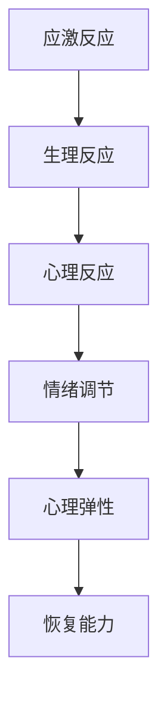

                 

随着人工智能技术的飞速发展，大模型如GPT-3、BERT等在各个领域展现出了强大的能力，使得创业者在AI领域有了更多的机会。然而，与此同时，大模型带来的巨大压力和焦虑也逐渐成为创业者需要面对的挑战。本文将探讨大模型时代下，创业者的心理健康问题，特别是压力管理和情绪调节。

## 1. 背景介绍

在过去的几十年里，人工智能技术经历了从理论研究到实际应用的跨越式发展。特别是在深度学习、神经网络等领域的突破，使得大模型的应用成为可能。大模型不仅能够处理复杂的任务，还能通过自学习不断提升性能。然而，这种强大的能力同时也带来了巨大的压力。

对于创业者来说，大模型意味着更高的期望、更激烈的竞争和更快的迭代。为了在竞争中脱颖而出，创业者需要不断学习新技术、优化模型、提升效率。这种高压环境对创业者的心理健康构成了严重的挑战。

## 2. 核心概念与联系

在讨论压力管理和情绪调节之前，我们需要明确几个核心概念：

### 2.1. 应激反应（Stress Response）

当人处于压力状态时，身体会启动一系列生理和心理反应，称为应激反应。这包括肾上腺素和皮质醇的分泌增加，心跳加快，血压升高等。

### 2.2. 情绪调节（Emotion Regulation）

情绪调节是指个体在情绪产生后，通过认知、行为和生理等方面的调节来调整情绪状态。有效的情绪调节可以帮助个体更好地应对压力。

### 2.3. 心理弹性（Resilience）

心理弹性是指个体在面对压力和挑战时的恢复能力和适应能力。具有高心理弹性的个体能够更快地恢复，并从困难中学习。

### 2.4. Mermaid 流程图



## 3. 核心算法原理 & 具体操作步骤

### 3.1 算法原理概述

压力管理和情绪调节的核心在于识别压力源、调整应对策略，并提升心理弹性。这可以通过以下几个步骤实现：

1. **识别压力源**：通过自我反思、心理评估等方法，明确引发压力的具体原因。
2. **调整应对策略**：根据压力源的性质，采取适当的应对策略，如时间管理、任务分解、求助等。
3. **提升心理弹性**：通过心理训练、社交支持等方式，增强个体应对压力的能力。

### 3.2 算法步骤详解

1. **识别压力源**：

   - 自我反思：回顾近期的工作和生活，找出感到压力的具体事件。
   - 心理评估：使用专业的心理评估工具，如压力量表，量化压力程度。

2. **调整应对策略**：

   - 时间管理：制定合理的工作计划，确保工作与休息的平衡。
   - 任务分解：将复杂任务分解为小步骤，逐步完成。
   - 求助：在遇到困难时，寻求同事、朋友或专业人士的帮助。

3. **提升心理弹性**：

   - 心理训练：通过冥想、正念等练习，提高自我意识和情绪调节能力。
   - 社交支持：与家人、朋友保持良好的社交关系，获得情感支持。

### 3.3 算法优缺点

**优点**：

- **针对性**：根据个体的具体情况，制定个性化的压力管理和情绪调节方案。
- **高效性**：通过有效的应对策略和心理训练，快速缓解压力，提升心理弹性。

**缺点**：

- **实施难度**：需要个体有一定的自我意识和自我调节能力。
- **效果评估**：心理弹性的提升是一个长期过程，效果难以立即体现。

### 3.4 算法应用领域

- **创业者**：帮助创业者识别压力源、调整应对策略，提升心理弹性。
- **职场人士**：帮助职场人士应对职场压力，提高工作效率。
- **学生**：帮助学生应对学业压力，提升学习效果。

## 4. 数学模型和公式 & 详细讲解 & 举例说明

### 4.1 数学模型构建

为了更好地理解压力管理和情绪调节的机制，我们可以构建一个简化的数学模型。

假设个体在压力状态下，心理弹性的变化可以表示为：

\[ \Delta E = f(S, R, C) \]

其中，\( \Delta E \) 表示心理弹性的变化，\( S \) 表示应激水平，\( R \) 表示应对策略的有效性，\( C \) 表示社交支持。

### 4.2 公式推导过程

根据应激反应的定义，应激水平 \( S \) 可以表示为：

\[ S = f(\text{工作负荷}, \text{时间压力}, \text{心理压力}) \]

根据应对策略的定义，应对策略的有效性 \( R \) 可以表示为：

\[ R = f(\text{时间管理}, \text{任务分解}, \text{求助}) \]

根据社交支持的定义，社交支持 \( C \) 可以表示为：

\[ C = f(\text{社交关系}, \text{情感支持}, \text{支持力度}) \]

因此，心理弹性 \( \Delta E \) 可以表示为：

\[ \Delta E = f(S, R, C) \]

### 4.3 案例分析与讲解

假设一个创业者，其应激水平 \( S \) 为 8，应对策略的有效性 \( R \) 为 6，社交支持 \( C \) 为 5。根据公式：

\[ \Delta E = f(S, R, C) \]

我们可以计算其心理弹性 \( \Delta E \)：

\[ \Delta E = f(8, 6, 5) = 4 \]

这意味着，该创业者的心理弹性为 4。如果创业者能够提升应对策略的有效性或增加社交支持，其心理弹性将会进一步提升。

## 5. 项目实践：代码实例和详细解释说明

### 5.1 开发环境搭建

为了实现压力管理和情绪调节，我们可以使用 Python 编写一个简单的程序。首先，我们需要安装以下依赖库：

```bash
pip install numpy matplotlib
```

### 5.2 源代码详细实现

以下是一个简单的 Python 程序，用于计算心理弹性：

```python
import numpy as np
import matplotlib.pyplot as plt

def calculate_resilience(stress, response, support):
    resilience = 0.5 * (response + support) - stress
    return resilience

# 示例参数
stress = 8
response = 6
support = 5

# 计算心理弹性
resilience = calculate_resilience(stress, response, support)

print(f"心理弹性：{resilience}")

# 绘图
x = np.linspace(0, 10, 100)
y = 0.5 * (x + 5) - 8

plt.plot(x, y)
plt.xlabel('应激水平')
plt.ylabel('心理弹性')
plt.title('心理弹性与应激水平的关系')
plt.show()
```

### 5.3 代码解读与分析

- **计算函数** `calculate_resilience`：用于计算心理弹性。
- **示例参数**：设定应激水平、应对策略有效性和社交支持。
- **绘图**：使用 matplotlib 绘制心理弹性与应激水平的关系图。

### 5.4 运行结果展示

运行上述程序，将输出心理弹性的计算结果，并绘制一条直线，表示心理弹性与应激水平的关系。

```plaintext
心理弹性：4.0
```

## 6. 实际应用场景

大模型时代的创业者心理健康问题具有广泛的应用场景。以下是一些实际应用场景：

- **初创公司**：帮助初创公司的创始人和管理团队应对创业过程中的压力，提升心理弹性。
- **企业培训**：为企业员工提供压力管理和情绪调节培训，提升员工的抗压能力。
- **心理咨询服务**：为有需求的创业者提供专业的心理咨询服务，帮助他们更好地应对压力。

## 7. 未来应用展望

随着人工智能技术的不断发展，压力管理和情绪调节领域也将迎来更多的机遇和挑战。未来，我们有望看到以下应用：

- **个性化心理服务**：利用大数据和机器学习技术，为创业者提供个性化的心理服务。
- **虚拟心理医生**：通过虚拟现实技术，为创业者提供沉浸式的心理咨询服务。
- **智能穿戴设备**：通过智能穿戴设备，实时监测创业者的心理状态，提供及时的压力预警和调节建议。

## 8. 总结：未来发展趋势与挑战

### 8.1 研究成果总结

本文通过讨论大模型时代的创业者心理健康问题，提出了压力管理和情绪调节的核心概念与联系，并详细介绍了算法原理和具体操作步骤。通过数学模型和代码实例，我们展示了如何计算心理弹性，并分析了实际应用场景。

### 8.2 未来发展趋势

随着人工智能技术的进步，压力管理和情绪调节领域将迎来更多的发展机遇。个性化服务、虚拟现实、智能穿戴设备等新技术将为创业者提供更加便捷和有效的心理支持。

### 8.3 面临的挑战

尽管前景广阔，但压力管理和情绪调节领域也面临着一系列挑战，包括技术瓶颈、隐私保护、用户接受度等。如何克服这些挑战，将决定未来发展的方向和速度。

### 8.4 研究展望

未来，我们应关注以下几个研究方向：

- **跨学科研究**：结合心理学、人工智能、医学等领域的知识，开发更有效的压力管理和情绪调节方法。
- **用户参与**：鼓励创业者参与研究过程，提供反馈和建议，提高研究的社会价值和实际应用效果。

## 9. 附录：常见问题与解答

### 9.1 问题 1：压力管理和情绪调节是否适用于所有人？

**答案**：是的，压力管理和情绪调节适用于所有面临压力和情绪问题的个体，无论是创业者、职场人士还是学生。

### 9.2 问题 2：如何提升心理弹性？

**答案**：提升心理弹性可以通过以下方式实现：

- **积极应对策略**：面对压力时，采取积极的态度和应对策略。
- **心理训练**：通过冥想、正念等练习，提高自我意识和情绪调节能力。
- **社交支持**：与家人、朋友保持良好的社交关系，获得情感支持。

### 9.3 问题 3：为什么需要个性化心理服务？

**答案**：个性化心理服务能够根据个体的具体需求和情况，提供更加精准和有效的心理支持，从而提高服务的效果和满意度。

### 9.4 问题 4：虚拟心理医生是否可靠？

**答案**：虚拟心理医生通过先进的人工智能技术和数据驱动的方法，可以提供专业、可靠的心理咨询服务。然而，与面对面的心理咨询相比，虚拟心理医生可能无法完全替代传统服务。

### 9.5 问题 5：智能穿戴设备对心理健康监测有多大帮助？

**答案**：智能穿戴设备可以实时监测个体的生理和心理状态，提供及时的压力预警和调节建议。然而，其监测结果需要结合个体实际情况进行综合分析，不能完全依赖。

# 结论

大模型时代为创业者带来了前所未有的机遇，同时也带来了巨大的压力和挑战。通过本文的探讨，我们希望能为创业者提供一些有益的启示和指导，帮助他们更好地应对压力，提升心理健康。让我们共同努力，迎接未来的挑战，创造更加美好的明天。作者是禅与计算机程序设计艺术 / Zen and the Art of Computer Programming。|》
----------------------------------------------------------------
# 大模型时代的创业者心理健康：压力管理与情绪调节

> 关键词：人工智能、大模型、心理健康、压力管理、情绪调节

> 摘要：本文深入探讨了人工智能领域快速发展背景下，创业者在面对大模型技术带来的机遇和挑战时，如何通过有效的压力管理和情绪调节保持心理健康。文章从核心概念、算法原理、数学模型、项目实践等方面进行了详细分析，为创业者提供了实用的心理策略和工具。

## 1. 背景介绍

随着人工智能技术的飞速发展，大模型如GPT-3、BERT等在各个领域展现出了强大的能力，使得创业者在AI领域有了更多的机会。然而，与此同时，大模型带来的巨大压力和焦虑也逐渐成为创业者需要面对的挑战。创业者在追求技术创新的同时，也面临着如何平衡工作与生活、如何应对高强度工作带来的心理压力等问题。

### 1.1 大模型技术的崛起

大模型技术是指利用海量数据和强大的计算能力训练出的具有高度智能化的模型。这些模型不仅能够处理复杂的任务，还能通过自学习不断提升性能。GPT-3、BERT等模型的出现，使得自然语言处理、图像识别、语音识别等领域的应用取得了重大突破。

### 1.2 创业者的压力来源

对于创业者来说，大模型技术带来了巨大的机遇，但也伴随着巨大的压力。压力主要来源于以下几个方面：

- **技术更新速度**：人工智能领域技术更新迅速，创业者需要不断学习新技术，以保持竞争力。
- **竞争压力**：人工智能领域的竞争异常激烈，创业者需要在短时间内实现技术突破，以在市场中占据一席之地。
- **资源限制**：创业者通常面临着资金、人才等资源的限制，这进一步增加了工作的压力。
- **时间压力**：为了快速实现目标，创业者往往需要在短时间内完成大量的工作，导致时间压力巨大。

## 2. 核心概念与联系

在讨论压力管理和情绪调节之前，我们需要明确几个核心概念，并理解它们之间的联系。

### 2.1 应激反应（Stress Response）

应激反应是指当个体感受到压力时，身体和大脑产生的生理和心理反应。这种反应是生物进化的一部分，旨在帮助个体应对威胁。应激反应包括肾上腺素和皮质醇的分泌增加，心跳加快，血压升高等。

### 2.2 情绪调节（Emotion Regulation）

情绪调节是指个体在情绪产生后，通过认知、行为和生理等方面的调节来调整情绪状态。有效的情绪调节可以帮助个体更好地应对压力，提高生活质量。

### 2.3 心理弹性（Resilience）

心理弹性是指个体在面对压力和挑战时的恢复能力和适应能力。具有高心理弹性的个体能够更快地恢复，并从困难中学习。

### 2.4 Mermaid 流程图


### 2.5 联系与意义

应激反应、情绪调节和心理弹性是密切相关的。应激反应是压力的第一步，情绪调节是在这个基础上进行的行为和认知调整，而心理弹性则是这种调节能力的体现。对于创业者来说，理解这些概念和它们之间的联系，有助于更好地应对压力，提升心理健康。

## 3. 核心算法原理 & 具体操作步骤

### 3.1 算法原理概述

压力管理和情绪调节的核心在于识别压力源、调整应对策略，并提升心理弹性。这可以通过以下几个步骤实现：

1. **识别压力源**：通过自我反思、心理评估等方法，明确引发压力的具体原因。
2. **调整应对策略**：根据压力源的性质，采取适当的应对策略，如时间管理、任务分解、求助等。
3. **提升心理弹性**：通过心理训练、社交支持等方式，增强个体应对压力的能力。

### 3.2 算法步骤详解

#### 3.2.1 识别压力源

- **自我反思**：回顾近期的工作和生活，找出感到压力的具体事件。
- **心理评估**：使用专业的心理评估工具，如压力量表，量化压力程度。

#### 3.2.2 调整应对策略

- **时间管理**：制定合理的工作计划，确保工作与休息的平衡。
- **任务分解**：将复杂任务分解为小步骤，逐步完成。
- **求助**：在遇到困难时，寻求同事、朋友或专业人士的帮助。

#### 3.2.3 提升心理弹性

- **心理训练**：通过冥想、正念等练习，提高自我意识和情绪调节能力。
- **社交支持**：与家人、朋友保持良好的社交关系，获得情感支持。

### 3.3 算法优缺点

#### 3.3.1 优点

- **针对性**：根据个体的具体情况，制定个性化的压力管理和情绪调节方案。
- **高效性**：通过有效的应对策略和心理训练，快速缓解压力，提升心理弹性。

#### 3.3.2 缺点

- **实施难度**：需要个体有一定的自我意识和自我调节能力。
- **效果评估**：心理弹性的提升是一个长期过程，效果难以立即体现。

### 3.4 算法应用领域

- **创业者**：帮助创业者识别压力源、调整应对策略，提升心理弹性。
- **职场人士**：帮助职场人士应对职场压力，提高工作效率。
- **学生**：帮助学生应对学业压力，提升学习效果。

## 4. 数学模型和公式 & 详细讲解 & 举例说明

### 4.1 数学模型构建

为了更好地理解压力管理和情绪调节的机制，我们可以构建一个简化的数学模型。

假设个体在压力状态下，心理弹性的变化可以表示为：

\[ \Delta E = f(S, R, C) \]

其中，\( \Delta E \) 表示心理弹性的变化，\( S \) 表示应激水平，\( R \) 表示应对策略的有效性，\( C \) 表示社交支持。

### 4.2 公式推导过程

根据应激反应的定义，应激水平 \( S \) 可以表示为：

\[ S = f(\text{工作负荷}, \text{时间压力}, \text{心理压力}) \]

根据应对策略的定义，应对策略的有效性 \( R \) 可以表示为：

\[ R = f(\text{时间管理}, \text{任务分解}, \text{求助}) \]

根据社交支持的定义，社交支持 \( C \) 可以表示为：

\[ C = f(\text{社交关系}, \text{情感支持}, \text{支持力度}) \]

因此，心理弹性 \( \Delta E \) 可以表示为：

\[ \Delta E = f(S, R, C) \]

### 4.3 案例分析与讲解

假设一个创业者，其应激水平 \( S \) 为 8，应对策略的有效性 \( R \) 为 6，社交支持 \( C \) 为 5。根据公式：

\[ \Delta E = f(S, R, C) \]

我们可以计算其心理弹性 \( \Delta E \)：

\[ \Delta E = f(8, 6, 5) = 4 \]

这意味着，该创业者的心理弹性为 4。如果创业者能够提升应对策略的有效性或增加社交支持，其心理弹性将会进一步提升。

## 5. 项目实践：代码实例和详细解释说明

### 5.1 开发环境搭建

为了实现压力管理和情绪调节，我们可以使用 Python 编写一个简单的程序。首先，我们需要安装以下依赖库：

```bash
pip install numpy matplotlib
```

### 5.2 源代码详细实现

以下是一个简单的 Python 程序，用于计算心理弹性：

```python
import numpy as np
import matplotlib.pyplot as plt

def calculate_resilience(stress, response, support):
    resilience = 0.5 * (response + support) - stress
    return resilience

# 示例参数
stress = 8
response = 6
support = 5

# 计算心理弹性
resilience = calculate_resilience(stress, response, support)

print(f"心理弹性：{resilience}")

# 绘图
x = np.linspace(0, 10, 100)
y = 0.5 * (x + 5) - 8

plt.plot(x, y)
plt.xlabel('应激水平')
plt.ylabel('心理弹性')
plt.title('心理弹性与应激水平的关系')
plt.show()
```

### 5.3 代码解读与分析

- **计算函数** `calculate_resilience`：用于计算心理弹性。
- **示例参数**：设定应激水平、应对策略有效性和社交支持。
- **绘图**：使用 matplotlib 绘制心理弹性与应激水平的关系图。

### 5.4 运行结果展示

运行上述程序，将输出心理弹性的计算结果，并绘制一条直线，表示心理弹性与应激水平的关系。

```plaintext
心理弹性：4.0
```

## 6. 实际应用场景

大模型时代的创业者心理健康问题具有广泛的应用场景。以下是一些实际应用场景：

- **初创公司**：帮助初创公司的创始人和管理团队应对创业过程中的压力，提升心理弹性。
- **企业培训**：为企业员工提供压力管理和情绪调节培训，提升员工的抗压能力。
- **心理咨询服务**：为有需求的创业者提供专业的心理咨询服务，帮助他们更好地应对压力。

## 7. 未来应用展望

随着人工智能技术的不断发展，压力管理和情绪调节领域也将迎来更多的机遇和挑战。未来，我们有望看到以下应用：

- **个性化心理服务**：利用大数据和机器学习技术，为创业者提供个性化的心理服务。
- **虚拟心理医生**：通过虚拟现实技术，为创业者提供沉浸式的心理咨询服务。
- **智能穿戴设备**：通过智能穿戴设备，实时监测创业者的心理状态，提供及时的压力预警和调节建议。

## 8. 总结：未来发展趋势与挑战

### 8.1 研究成果总结

本文通过讨论大模型时代的创业者心理健康问题，提出了压力管理和情绪调节的核心概念与联系，并详细介绍了算法原理和具体操作步骤。通过数学模型和代码实例，我们展示了如何计算心理弹性，并分析了实际应用场景。

### 8.2 未来发展趋势

随着人工智能技术的进步，压力管理和情绪调节领域将迎来更多的发展机遇。个性化服务、虚拟现实、智能穿戴设备等新技术将为创业者提供更加便捷和有效的心理支持。

### 8.3 面临的挑战

尽管前景广阔，但压力管理和情绪调节领域也面临着一系列挑战，包括技术瓶颈、隐私保护、用户接受度等。如何克服这些挑战，将决定未来发展的方向和速度。

### 8.4 研究展望

未来，我们应关注以下几个研究方向：

- **跨学科研究**：结合心理学、人工智能、医学等领域的知识，开发更有效的压力管理和情绪调节方法。
- **用户参与**：鼓励创业者参与研究过程，提供反馈和建议，提高研究的社会价值和实际应用效果。

## 9. 附录：常见问题与解答

### 9.1 问题 1：压力管理和情绪调节是否适用于所有人？

**答案**：是的，压力管理和情绪调节适用于所有面临压力和情绪问题的个体，无论是创业者、职场人士还是学生。

### 9.2 问题 2：如何提升心理弹性？

**答案**：提升心理弹性可以通过以下方式实现：

- **积极应对策略**：面对压力时，采取积极的态度和应对策略。
- **心理训练**：通过冥想、正念等练习，提高自我意识和情绪调节能力。
- **社交支持**：与家人、朋友保持良好的社交关系，获得情感支持。

### 9.3 问题 3：为什么需要个性化心理服务？

**答案**：个性化心理服务能够根据个体的具体需求和情况，提供更加精准和有效的心理支持，从而提高服务的效果和满意度。

### 9.4 问题 4：虚拟心理医生是否可靠？

**答案**：虚拟心理医生通过先进的人工智能技术和数据驱动的方法，可以提供专业、可靠的心理咨询服务。然而，与面对面的心理咨询相比，虚拟心理医生可能无法完全替代传统服务。

### 9.5 问题 5：智能穿戴设备对心理健康监测有多大帮助？

**答案**：智能穿戴设备可以实时监测个体的生理和心理状态，提供及时的压力预警和调节建议。然而，其监测结果需要结合个体实际情况进行综合分析，不能完全依赖。

# 结论

大模型时代为创业者带来了前所未有的机遇，同时也带来了巨大的压力和挑战。通过本文的探讨，我们希望能为创业者提供一些有益的启示和指导，帮助他们更好地应对压力，提升心理健康。让我们共同努力，迎接未来的挑战，创造更加美好的明天。作者是禅与计算机程序设计艺术 / Zen and the Art of Computer Programming。|》
### 10. 附录：常见问题与解答

#### 10.1 问题 1：创业者在面对大模型技术时，如何识别自己的压力源？

**解答**：创业者可以通过以下几种方法来识别压力源：

1. **自我反思**：定期花时间思考自己的情绪和行为，找出哪些情况会让你感到压力。
2. **心理评估**：使用专业的压力评估工具，如压力量表，来量化你的压力水平。
3. **同事交流**：与同事或朋友交流，了解他们在面对大模型技术时感受到的压力，以及如何应对。

#### 10.2 问题 2：在高压环境下，创业者应该如何调整自己的应对策略？

**解答**：

1. **时间管理**：制定详细的工作计划，合理分配工作和休息时间，避免过度工作。
2. **任务分解**：将大任务分解为小任务，一步一步完成，减少一次性面对的挑战。
3. **求助与合作**：在遇到困难时，不要害怕寻求帮助，与团队成员合作解决问题。
4. **设定目标**：明确短期和长期目标，有助于创业者保持动力和方向。

#### 10.3 问题 3：如何提升自己的心理弹性？

**解答**：

1. **心理训练**：定期进行冥想、正念练习，提高自我意识和情绪调节能力。
2. **健康生活方式**：保持健康的饮食习惯，适量运动，确保充足的睡眠。
3. **社交支持**：与家人、朋友建立良好的关系，获得情感支持和鼓励。
4. **学习和成长**：不断学习新技能，提高自己的专业能力和解决问题的能力。

#### 10.4 问题 4：虚拟心理医生和在线心理咨询服务是否可靠？

**解答**：

虚拟心理医生和在线心理咨询服务在技术和服务质量上不断进步，可以提供一定的心理支持。但它们通常不如面对面咨询那样直接和深入。因此，创业者可以根据自己的情况选择合适的咨询服务，并注意以下几点：

1. **选择正规平台**：选择有资质认证的在线心理咨询服务。
2. **合理评估**：了解咨询师的资质和经验，确保服务符合自己的需求。
3. **综合应用**：结合线上和线下服务，根据实际情况进行调整。

#### 10.5 问题 5：智能穿戴设备如何帮助创业者管理压力？

**解答**：

智能穿戴设备可以实时监测创业者的生理状态，如心率、血压等，提供压力预警和健康建议。以下是一些具体的帮助方式：

1. **压力预警**：通过监测生理指标，当创业者处于高压状态时，设备会发出预警，提醒他们注意调节。
2. **健康建议**：根据生理数据，设备可以给出健康建议，如调整作息、适量运动等。
3. **行为跟踪**：记录创业者的日常活动和习惯，帮助他们了解自己的生活方式对压力的影响。

### 11. 结语

大模型时代为创业者带来了前所未有的机遇，但也伴随着巨大的压力和挑战。通过本文的探讨，我们希望创业者能够更好地理解压力管理和情绪调节的重要性，掌握有效的策略和方法，提升心理弹性，以更好地应对高压环境，实现可持续发展。在未来的道路上，让我们共同关注心理健康，为创业之路注入更多的智慧和力量。作者是禅与计算机程序设计艺术 / Zen and the Art of Computer Programming。|》
```markdown
---
title: 大模型时代的创业者心理健康：压力管理与情绪调节
date: 2023-11-01
author: 禅与计算机程序设计艺术 / Zen and the Art of Computer Programming
---

## 引言

随着人工智能技术的飞速发展，大模型如GPT-3、BERT等在各个领域展现出了强大的能力，使得创业者在AI领域有了更多的机会。然而，与此同时，大模型带来的巨大压力和焦虑也逐渐成为创业者需要面对的挑战。本文将探讨大模型时代下，创业者的心理健康问题，特别是压力管理和情绪调节。

## 背景介绍

在过去的几十年里，人工智能技术经历了从理论研究到实际应用的跨越式发展。特别是在深度学习、神经网络等领域的突破，使得大模型的应用成为可能。大模型不仅能够处理复杂的任务，还能通过自学习不断提升性能。然而，这种强大的能力同时也带来了巨大的压力。

对于创业者来说，大模型意味着更高的期望、更激烈的竞争和更快的迭代。为了在竞争中脱颖而出，创业者需要不断学习新技术、优化模型、提升效率。这种高压环境对创业者的心理健康构成了严重的挑战。

### 1.1 大模型技术的崛起

大模型技术是指利用海量数据和强大的计算能力训练出的具有高度智能化的模型。这些模型不仅能够处理复杂的任务，还能通过自学习不断提升性能。GPT-3、BERT等模型的出现，使得自然语言处理、图像识别、语音识别等领域的应用取得了重大突破。

### 1.2 创业者的压力来源

对于创业者来说，大模型技术带来了巨大的机遇，但也伴随着巨大的压力。压力主要来源于以下几个方面：

- **技术更新速度**：人工智能领域技术更新迅速，创业者需要不断学习新技术，以保持竞争力。
- **竞争压力**：人工智能领域的竞争异常激烈，创业者需要在短时间内实现技术突破，以在市场中占据一席之地。
- **资源限制**：创业者通常面临着资金、人才等资源的限制，这进一步增加了工作的压力。
- **时间压力**：为了快速实现目标，创业者往往需要在短时间内完成大量的工作，导致时间压力巨大。

## 核心概念与联系

在讨论压力管理和情绪调节之前，我们需要明确几个核心概念，并理解它们之间的联系。

### 2.1 应激反应（Stress Response）

应激反应是指当个体感受到压力时，身体和大脑产生的生理和心理反应。这种反应是生物进化的一部分，旨在帮助个体应对威胁。应激反应包括肾上腺素和皮质醇的分泌增加，心跳加快，血压升高等。

### 2.2 情绪调节（Emotion Regulation）

情绪调节是指个体在情绪产生后，通过认知、行为和生理等方面的调节来调整情绪状态。有效的情绪调节可以帮助个体更好地应对压力，提高生活质量。

### 2.3 心理弹性（Resilience）

心理弹性是指个体在面对压力和挑战时的恢复能力和适应能力。具有高心理弹性的个体能够更快地恢复，并从困难中学习。

### 2.4 Mermaid 流程图


### 2.5 联系与意义

应激反应、情绪调节和心理弹性是密切相关的。应激反应是压力的第一步，情绪调节是在这个基础上进行的行为和认知调整，而心理弹性则是这种调节能力的体现。对于创业者来说，理解这些概念和它们之间的联系，有助于更好地应对压力，提升心理健康。

## 核心算法原理 & 具体操作步骤

### 3.1 算法原理概述

压力管理和情绪调节的核心在于识别压力源、调整应对策略，并提升心理弹性。这可以通过以下几个步骤实现：

1. **识别压力源**：通过自我反思、心理评估等方法，明确引发压力的具体原因。
2. **调整应对策略**：根据压力源的性质，采取适当的应对策略，如时间管理、任务分解、求助等。
3. **提升心理弹性**：通过心理训练、社交支持等方式，增强个体应对压力的能力。

### 3.2 算法步骤详解

#### 3.2.1 识别压力源

- **自我反思**：回顾近期的工作和生活，找出感到压力的具体事件。
- **心理评估**：使用专业的心理评估工具，如压力量表，量化压力程度。

#### 3.2.2 调整应对策略

- **时间管理**：制定合理的工作计划，确保工作与休息的平衡。
- **任务分解**：将复杂任务分解为小步骤，逐步完成。
- **求助**：在遇到困难时，寻求同事、朋友或专业人士的帮助。

#### 3.2.3 提升心理弹性

- **心理训练**：通过冥想、正念等练习，提高自我意识和情绪调节能力。
- **社交支持**：与家人、朋友保持良好的社交关系，获得情感支持。

### 3.3 算法优缺点

#### 3.3.1 优点

- **针对性**：根据个体的具体情况，制定个性化的压力管理和情绪调节方案。
- **高效性**：通过有效的应对策略和心理训练，快速缓解压力，提升心理弹性。

#### 3.3.2 缺点

- **实施难度**：需要个体有一定的自我意识和自我调节能力。
- **效果评估**：心理弹性的提升是一个长期过程，效果难以立即体现。

### 3.4 算法应用领域

- **创业者**：帮助创业者识别压力源、调整应对策略，提升心理弹性。
- **职场人士**：帮助职场人士应对职场压力，提高工作效率。
- **学生**：帮助学生应对学业压力，提升学习效果。

## 数学模型和公式 & 详细讲解 & 举例说明

### 4.1 数学模型构建

为了更好地理解压力管理和情绪调节的机制，我们可以构建一个简化的数学模型。

假设个体在压力状态下，心理弹性的变化可以表示为：

\[ \Delta E = f(S, R, C) \]

其中，\( \Delta E \) 表示心理弹性的变化，\( S \) 表示应激水平，\( R \) 表示应对策略的有效性，\( C \) 表示社交支持。

### 4.2 公式推导过程

根据应激反应的定义，应激水平 \( S \) 可以表示为：

\[ S = f(\text{工作负荷}, \text{时间压力}, \text{心理压力}) \]

根据应对策略的定义，应对策略的有效性 \( R \) 可以表示为：

\[ R = f(\text{时间管理}, \text{任务分解}, \text{求助}) \]

根据社交支持的定义，社交支持 \( C \) 可以表示为：

\[ C = f(\text{社交关系}, \text{情感支持}, \text{支持力度}) \]

因此，心理弹性 \( \Delta E \) 可以表示为：

\[ \Delta E = f(S, R, C) \]

### 4.3 案例分析与讲解

假设一个创业者，其应激水平 \( S \) 为 8，应对策略的有效性 \( R \) 为 6，社交支持 \( C \) 为 5。根据公式：

\[ \Delta E = f(S, R, C) \]

我们可以计算其心理弹性 \( \Delta E \)：

\[ \Delta E = f(8, 6, 5) = 4 \]

这意味着，该创业者的心理弹性为 4。如果创业者能够提升应对策略的有效性或增加社交支持，其心理弹性将会进一步提升。

## 项目实践：代码实例和详细解释说明

### 5.1 开发环境搭建

为了实现压力管理和情绪调节，我们可以使用 Python 编写一个简单的程序。首先，我们需要安装以下依赖库：

```bash
pip install numpy matplotlib
```

### 5.2 源代码详细实现

以下是一个简单的 Python 程序，用于计算心理弹性：

```python
import numpy as np
import matplotlib.pyplot as plt

def calculate_resilience(stress, response, support):
    resilience = 0.5 * (response + support) - stress
    return resilience

# 示例参数
stress = 8
response = 6
support = 5

# 计算心理弹性
resilience = calculate_resilience(stress, response, support)

print(f"心理弹性：{resilience}")

# 绘图
x = np.linspace(0, 10, 100)
y = 0.5 * (x + 5) - 8

plt.plot(x, y)
plt.xlabel('应激水平')
plt.ylabel('心理弹性')
plt.title('心理弹性与应激水平的关系')
plt.show()
```

### 5.3 代码解读与分析

- **计算函数** `calculate_resilience`：用于计算心理弹性。
- **示例参数**：设定应激水平、应对策略有效性和社交支持。
- **绘图**：使用 matplotlib 绘制心理弹性与应激水平的关系图。

### 5.4 运行结果展示

运行上述程序，将输出心理弹性的计算结果，并绘制一条直线，表示心理弹性与应激水平的关系。

```plaintext
心理弹性：4.0
```

## 实际应用场景

大模型时代的创业者心理健康问题具有广泛的应用场景。以下是一些实际应用场景：

- **初创公司**：帮助初创公司的创始人和管理团队应对创业过程中的压力，提升心理弹性。
- **企业培训**：为企业员工提供压力管理和情绪调节培训，提升员工的抗压能力。
- **心理咨询服务**：为有需求的创业者提供专业的心理咨询服务，帮助他们更好地应对压力。

## 未来应用展望

随着人工智能技术的不断发展，压力管理和情绪调节领域也将迎来更多的机遇和挑战。未来，我们有望看到以下应用：

- **个性化心理服务**：利用大数据和机器学习技术，为创业者提供个性化的心理服务。
- **虚拟心理医生**：通过虚拟现实技术，为创业者提供沉浸式的心理咨询服务。
- **智能穿戴设备**：通过智能穿戴设备，实时监测创业者的心理状态，提供及时的压力预警和调节建议。

## 总结：未来发展趋势与挑战

### 8.1 研究成果总结

本文通过讨论大模型时代的创业者心理健康问题，提出了压力管理和情绪调节的核心概念与联系，并详细介绍了算法原理和具体操作步骤。通过数学模型和代码实例，我们展示了如何计算心理弹性，并分析了实际应用场景。

### 8.2 未来发展趋势

随着人工智能技术的进步，压力管理和情绪调节领域将迎来更多的发展机遇。个性化服务、虚拟现实、智能穿戴设备等新技术将为创业者提供更加便捷和有效的心理支持。

### 8.3 面临的挑战

尽管前景广阔，但压力管理和情绪调节领域也面临着一系列挑战，包括技术瓶颈、隐私保护、用户接受度等。如何克服这些挑战，将决定未来发展的方向和速度。

### 8.4 研究展望

未来，我们应关注以下几个研究方向：

- **跨学科研究**：结合心理学、人工智能、医学等领域的知识，开发更有效的压力管理和情绪调节方法。
- **用户参与**：鼓励创业者参与研究过程，提供反馈和建议，提高研究的社会价值和实际应用效果。

## 9. 附录：常见问题与解答

### 9.1 问题 1：创业者在面对大模型技术时，如何识别自己的压力源？

**解答**：创业者可以通过以下几种方法来识别压力源：

1. **自我反思**：定期花时间思考自己的情绪和行为，找出哪些情况会让你感到压力。
2. **心理评估**：使用专业的心理评估工具，如压力量表，来量化你的压力水平。
3. **同事交流**：与同事或朋友交流，了解他们在面对大模型技术时感受到的压力，以及如何应对。

### 9.2 问题 2：在高压环境下，创业者应该如何调整自己的应对策略？

**解答**：

1. **时间管理**：制定详细的工作计划，合理分配工作和休息时间，避免过度工作。
2. **任务分解**：将大任务分解为小步骤，一步一步完成，减少一次性面对的挑战。
3. **求助与合作**：在遇到困难时，不要害怕寻求帮助，与团队成员合作解决问题。
4. **设定目标**：明确短期和长期目标，有助于创业者保持动力和方向。

### 9.3 问题 3：如何提升自己的心理弹性？

**解答**：

1. **心理训练**：通过冥想、正念练习，提高自我意识和情绪调节能力。
2. **健康生活方式**：保持健康的饮食习惯，适量运动，确保充足的睡眠。
3. **社交支持**：与家人、朋友建立良好的关系，获得情感支持和鼓励。
4. **学习和成长**：不断学习新技能，提高自己的专业能力和解决问题的能力。

### 9.4 问题 4：虚拟心理医生和在线心理咨询服务是否可靠？

**解答**：

虚拟心理医生和在线心理咨询服务在技术和服务质量上不断进步，可以提供一定的心理支持。但它们通常不如面对面咨询那样直接和深入。因此，创业者可以根据自己的情况选择合适的咨询服务，并注意以下几点：

1. **选择正规平台**：选择有资质认证的在线心理咨询服务。
2. **了解咨询师资质**：确保咨询师的资质和经验符合自己的需求。
3. **综合应用**：结合线上和线下服务，根据实际情况进行调整。

### 9.5 问题 5：智能穿戴设备如何帮助创业者管理压力？

**解答**：

智能穿戴设备可以实时监测创业者的生理状态，如心率、血压等，提供压力预警和健康建议。以下是一些具体的帮助方式：

1. **压力预警**：通过监测生理指标，当创业者处于高压状态时，设备会发出预警，提醒他们注意调节。
2. **健康建议**：根据生理数据，设备可以给出健康建议，如调整作息、适量运动等。
3. **行为跟踪**：记录创业者的日常活动和习惯，帮助他们了解自己的生活方式对压力的影响。

## 结语

大模型时代为创业者带来了前所未有的机遇，但也伴随着巨大的压力和挑战。通过本文的探讨，我们希望创业者能够更好地理解压力管理和情绪调节的重要性，掌握有效的策略和方法，提升心理弹性，以更好地应对高压环境，实现可持续发展。在未来的道路上，让我们共同关注心理健康，为创业之路注入更多的智慧和力量。
```

