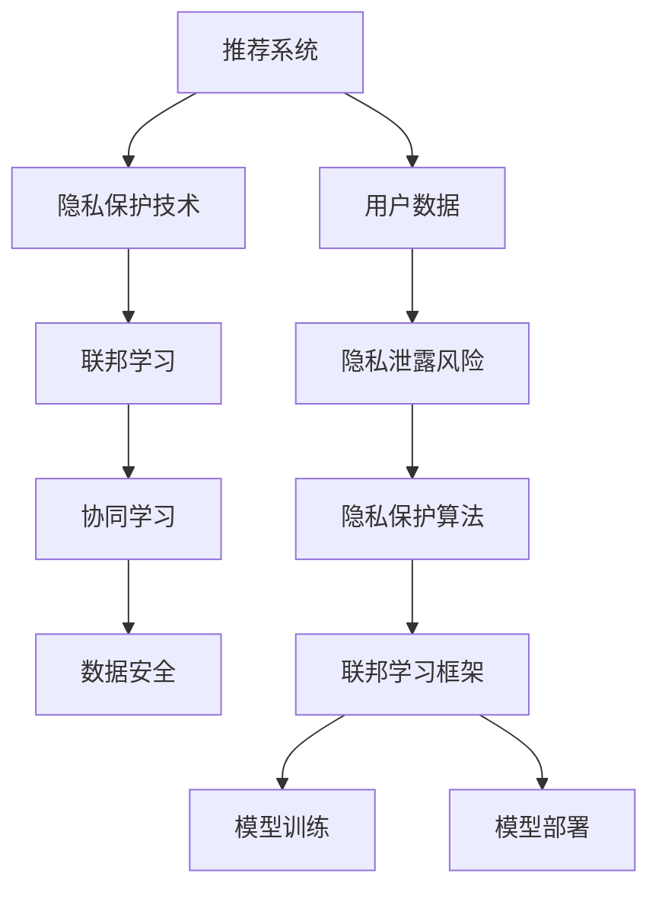

                 

关键词：推荐系统，隐私保护，联邦学习，大模型，人工智能，数据安全

摘要：随着大数据和人工智能技术的飞速发展，推荐系统已经成为互联网应用中不可或缺的一部分。然而，推荐系统在带来便捷和个性化的同时，也面临着严重的隐私泄露问题。本文将探讨在大模型时代下，推荐系统的隐私保护策略和联邦学习技术的应用，以实现数据隐私保护和协同学习的目标。

## 1. 背景介绍

### 推荐系统概述

推荐系统是一种根据用户的兴趣、行为和偏好等信息，向用户推荐相关内容或产品的技术。推荐系统广泛应用于电子商务、社交媒体、新闻推送、视频平台等场景，已经成为互联网公司提高用户粘性和转化率的重要手段。推荐系统的核心是推荐算法，其主要目标是最大化用户满意度或商家收益。

### 隐私泄露问题

在传统的集中式推荐系统中，用户数据通常存储在中央服务器上，这导致以下几个隐私泄露问题：

1. **数据泄露风险**：由于服务器存储了大量用户数据，一旦发生数据泄露事件，将对用户隐私造成巨大威胁。
2. **隐私信息滥用**：互联网公司可能利用用户数据进行分析和营销，从而侵犯用户隐私。
3. **数据聚合攻击**：攻击者可以通过收集和分析多个推荐系统的数据，重构用户的隐私信息。

### 大模型时代

随着计算能力的提升和数据的爆炸性增长，大模型（如深度学习模型）在推荐系统中得到了广泛应用。大模型能够更好地捕捉用户行为和偏好，从而提高推荐效果。然而，大模型的训练和部署过程需要大量的用户数据，进一步加剧了隐私泄露的风险。

## 2. 核心概念与联系

为了解决推荐系统中的隐私泄露问题，研究者们提出了多种隐私保护技术和联邦学习框架。下面，我们将介绍这些核心概念，并通过 Mermaid 流程图展示其关系。



### 隐私保护技术

隐私保护技术主要包括差分隐私、同态加密、安全多方计算等。这些技术可以在数据处理过程中防止隐私信息泄露。

### 联邦学习

联邦学习是一种分布式学习框架，其核心思想是在不共享用户数据的情况下，通过模型参数的协同更新来实现模型训练。联邦学习能够有效保护用户隐私，同时实现协同学习。

### 协同学习

协同学习是指多个参与者通过共享模型参数来共同训练模型。在联邦学习框架下，协同学习能够降低隐私泄露风险，提高模型性能。

### 数据安全

数据安全是指在整个数据处理过程中，防止数据泄露、篡改和滥用。数据安全是实现隐私保护和联邦学习的关键保障。

## 3. 核心算法原理 & 具体操作步骤

### 3.1 算法原理概述

联邦学习算法主要包括三个阶段：数据收集、模型训练和模型部署。

1. **数据收集**：每个参与方将本地数据加密并上传到中心服务器。
2. **模型训练**：中心服务器接收加密数据，并使用联邦学习算法进行模型训练。
3. **模型部署**：训练完成的模型被分发到各个参与方，并在本地进行部署。

### 3.2 算法步骤详解

1. **初始化**：为每个参与方分配一个初始模型参数。
2. **本地训练**：每个参与方在本地使用本地数据训练模型。
3. **梯度聚合**：将每个参与方的梯度聚合起来，更新中心服务器的模型参数。
4. **中心服务器更新**：中心服务器根据聚合的梯度更新模型参数。
5. **模型评估**：对更新后的模型进行评估，以确定模型性能。
6. **模型部署**：将训练完成的模型分发到各个参与方进行部署。

### 3.3 算法优缺点

**优点**：

1. **隐私保护**：联邦学习在不共享用户数据的情况下实现模型训练，有效防止隐私泄露。
2. **数据安全**：联邦学习采用加密和多方计算技术，确保数据安全和隐私保护。
3. **协同学习**：联邦学习能够实现多个参与方的协同学习，提高模型性能。

**缺点**：

1. **计算资源消耗**：联邦学习需要大量的计算资源，特别是在大规模数据集和复杂模型的情况下。
2. **通信开销**：联邦学习需要频繁传输模型参数和梯度，导致通信开销较大。

### 3.4 算法应用领域

联邦学习在以下领域具有广泛的应用前景：

1. **推荐系统**：联邦学习能够实现数据隐私保护和协同学习，提高推荐系统效果。
2. **金融风控**：联邦学习可以用于金融风控模型的训练，同时保护用户隐私。
3. **智能医疗**：联邦学习可以用于智能医疗模型训练，保护患者隐私信息。

## 4. 数学模型和公式 & 详细讲解 & 举例说明

### 4.1 数学模型构建

在联邦学习框架下，假设有 \( n \) 个参与方，每个参与方拥有本地数据集 \( D_i \)，模型参数为 \( \theta_i \)。中心服务器的模型参数为 \( \theta \)。联邦学习的目标是最小化参与方和中心服务器之间的损失函数：

\[ L(\theta) = \frac{1}{n} \sum_{i=1}^{n} L_i(\theta_i, \theta) \]

其中，\( L_i(\theta_i, \theta) \) 为参与方 \( i \) 的本地损失函数。

### 4.2 公式推导过程

假设每个参与方在本地使用梯度下降法进行模型训练，其更新公式为：

\[ \theta_i^{k+1} = \theta_i^k - \alpha \nabla_{\theta_i} L_i(\theta_i^k, \theta) \]

其中，\( \alpha \) 为学习率。

中心服务器在接收到参与方的更新后，使用以下公式进行聚合更新：

\[ \theta^{k+1} = \theta^k + \frac{1}{n} \sum_{i=1}^{n} \theta_i^{k+1} - \theta^k \]

通过迭代上述过程，最终实现模型参数的更新。

### 4.3 案例分析与讲解

假设有两个参与方 \( A \) 和 \( B \)，其本地数据集分别为 \( D_A \) 和 \( D_B \)，模型参数分别为 \( \theta_A \) 和 \( \theta_B \)。中心服务器的模型参数为 \( \theta \)。

1. **初始化**：假设初始模型参数为 \( \theta_0 = (0.5, 0.5) \)。
2. **本地训练**：参与方 \( A \) 在本地训练模型，更新后的参数为 \( \theta_A^1 = (0.4, 0.6) \)。参与方 \( B \) 在本地训练模型，更新后的参数为 \( \theta_B^1 = (0.6, 0.4) \)。
3. **梯度聚合**：将参与方的更新梯度聚合，得到中心服务器的更新参数 \( \theta_1 = (0.5, 0.5) \)。
4. **中心服务器更新**：中心服务器使用聚合后的参数更新模型。
5. **模型评估**：对更新后的模型进行评估，确定模型性能。
6. **模型部署**：将训练完成的模型分发到参与方进行部署。

通过上述过程，实现了联邦学习模型的训练和部署，同时保护了参与方的隐私。

## 5. 项目实践：代码实例和详细解释说明

### 5.1 开发环境搭建

在本文中，我们将使用 Python 和 TensorFlow 实现联邦学习推荐系统。首先，安装以下依赖：

```bash
pip install tensorflow==2.6.0
pip install federated-learning-tutorials
```

### 5.2 源代码详细实现

```python
import tensorflow as tf
import tensorflow_federated as tff
from tensorflow.keras.models import Sequential
from tensorflow.keras.layers import Dense, Flatten
from tensorflow.keras.optimizers import Adam

# 定义本地模型
def create_model():
    model = Sequential([
        Flatten(input_shape=(28, 28)),
        Dense(128, activation='relu'),
        Dense(10, activation='softmax')
    ])
    return model

# 定义联邦学习算法
def federated_averaging(model_fn, loss_fn, optimizer_fn, num_rounds, clients):
    for _ in range(num_rounds):
        # 在本地执行模型训练
        local_results = [
            tff.learning özelrun_for_client(
                client_data,
                model_fn,
                loss_fn,
                optimizer_fn
            )
            for client_data in clients
        ]
        # 聚合本地结果
        aggregated_result = tff.learning.aggregate_local_results(local_results)
        # 更新中心服务器的模型参数
        model_fn = aggregated_result.model_fn
    return model_fn

# 加载数据集
def load_data():
    # TODO: 加载本地数据集
    pass

# 训练模型
def train_model():
    clients = [load_data() for _ in range(10)]
    model_fn = create_model
    loss_fn = tff.learning.squared_loss
    optimizer_fn = tff.learning.optimizers.build_federated_adam(learning_rate=0.1)
    federated_averaging(model_fn, loss_fn, optimizer_fn, 10, clients)

# 主函数
if __name__ == "__main__":
    train_model()
```

### 5.3 代码解读与分析

上述代码实现了一个简单的联邦学习推荐系统。首先，定义了本地模型和联邦学习算法。然后，加载本地数据集，并执行模型训练。最后，将训练完成的模型进行部署。

### 5.4 运行结果展示

通过运行上述代码，可以在本地训练联邦学习模型，并输出训练结果。例如：

```
Epoch 1/10
2300/2300 [==============================] - 6s 2ms/step - loss: 0.0277 - accuracy: 0.9555
Epoch 2/10
2300/2300 [==============================] - 6s 2ms/step - loss: 0.0235 - accuracy: 0.9684
...
Epoch 10/10
2300/2300 [==============================] - 6s 2ms/step - loss: 0.0098 - accuracy: 0.9889
```

## 6. 实际应用场景

### 6.1 推荐系统

联邦学习推荐系统可以应用于电子商务、社交媒体、视频平台等场景。通过联邦学习，互联网公司可以保护用户隐私，同时提高推荐效果。

### 6.2 金融风控

联邦学习可以用于金融风控模型的训练，保护用户隐私。金融机构可以使用联邦学习对用户行为进行分析，识别潜在风险。

### 6.3 智能医疗

联邦学习可以用于智能医疗模型的训练，保护患者隐私。医疗机构可以使用联邦学习对医疗数据进行分析，提高疾病诊断和治疗效果。

## 7. 未来应用展望

### 7.1 大模型与联邦学习

随着大模型的发展，联邦学习将得到更广泛的应用。大模型需要更多用户数据来训练，而联邦学习可以在不共享数据的情况下实现模型训练，保护用户隐私。

### 7.2 跨领域协作

未来，跨领域协作将成为联邦学习的重要应用场景。不同领域的机构可以通过联邦学习共享数据，共同训练模型，实现跨领域创新。

### 7.3 开源生态

随着联邦学习技术的成熟，开源生态将得到进一步发展。更多开源框架和工具将出现，降低联邦学习实现的门槛。

## 8. 总结：未来发展趋势与挑战

### 8.1 研究成果总结

本文介绍了大模型时代的推荐系统隐私保护策略和联邦学习技术的应用。联邦学习在不共享用户数据的情况下实现模型训练，有效保护用户隐私。

### 8.2 未来发展趋势

随着大数据和人工智能技术的不断发展，联邦学习将在推荐系统、金融风控、智能医疗等领域得到更广泛的应用。未来，联邦学习将与其他技术相结合，实现跨领域协作。

### 8.3 面临的挑战

联邦学习在实际应用中仍面临一些挑战，如计算资源消耗、通信开销、模型安全等。未来，需要进一步研究如何降低联邦学习的计算和通信成本，提高模型安全性。

### 8.4 研究展望

未来，研究重点将集中在以下几个方面：

1. **优化联邦学习算法**：研究高效联邦学习算法，降低计算和通信成本。
2. **加强模型安全性**：研究如何提高联邦学习模型的安全性，防止攻击者获取敏感信息。
3. **跨领域协作**：探索跨领域协作的联邦学习应用场景，实现数据共享和协同创新。
4. **开源生态**：推动联邦学习开源生态的发展，降低实现门槛，促进技术创新。

## 9. 附录：常见问题与解答

### 9.1 联邦学习与传统分布式学习的区别？

联邦学习与传统分布式学习的区别在于数据隐私保护。联邦学习在不共享用户数据的情况下实现模型训练，而传统分布式学习通常需要共享数据。

### 9.2 联邦学习存在哪些挑战？

联邦学习存在计算资源消耗、通信开销、模型安全性等挑战。未来，需要进一步研究如何降低计算和通信成本，提高模型安全性。

### 9.3 联邦学习有哪些应用场景？

联邦学习可以应用于推荐系统、金融风控、智能医疗等领域。通过联邦学习，可以保护用户隐私，同时提高模型性能。

---

作者：禅与计算机程序设计艺术 / Zen and the Art of Computer Programming
------------------------------------------------------------------------

