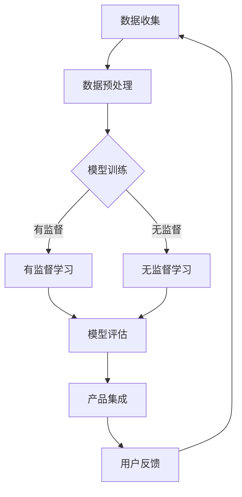

                 

关键词：大模型、创业产品、AI、赋能、趋势

> 摘要：本文将探讨大模型技术在创业产品中的应用趋势，分析AI时代所带来的机遇与挑战，为创业者提供指导。

## 1. 背景介绍

近年来，人工智能（AI）技术的发展速度迅猛，其中大模型（Large Models）如GPT、BERT等取得了显著突破。这些模型通过处理海量数据，学习到了丰富的知识，为各行各业提供了强大的支持。与此同时，创业环境也在不断优化，使得更多有才华的创业者能够投身于创新领域。在这种背景下，大模型赋能下的创业产品呈现出新的趋势，本文将对这一趋势进行分析。

## 2. 核心概念与联系

### 大模型技术概述

大模型是指具有大规模参数和庞大计算能力的机器学习模型。这些模型通过深度神经网络（DNN）架构，能够处理海量数据，学习到复杂的特征和模式。大模型的训练通常需要大量的计算资源和时间，但随着硬件性能的提升和分布式计算技术的发展，这一瓶颈正在逐步克服。

### 大模型与创业产品的联系

大模型技术为创业产品提供了前所未有的赋能。创业者可以利用大模型进行数据分析、智能推荐、自然语言处理等任务，从而提高产品竞争力。例如，在金融领域，大模型可以帮助进行风险管理、投资决策等；在医疗领域，大模型可以辅助诊断、治疗方案设计等。

### Mermaid 流程图

下面是一个简化的 Mermaid 流程图，描述大模型技术在创业产品中的应用过程：



## 3. 核心算法原理 & 具体操作步骤

### 3.1 算法原理概述

大模型的核心是深度神经网络，其原理是通过层层提取特征，将输入数据映射到输出结果。在训练过程中，模型通过反向传播算法不断调整参数，以降低损失函数的值，达到最优解。

### 3.2 算法步骤详解

1. **数据收集**：从各种渠道获取原始数据，包括公开数据集、企业内部数据等。

2. **数据预处理**：清洗数据，去除噪声和异常值，并进行特征工程，为模型训练做准备。

3. **模型训练**：使用训练数据对模型进行训练，通过多层神经网络提取特征。

4. **模型评估**：使用验证数据集评估模型性能，根据评估结果调整模型参数。

5. **产品集成**：将训练好的模型集成到产品中，提供实时服务。

6. **用户反馈**：收集用户反馈，优化产品功能和用户体验。

### 3.3 算法优缺点

**优点**：
- 高效的数据处理能力，能够处理海量数据。
- 强大的特征提取能力，能够发现复杂的模式和关系。
- 易于集成到各种产品中，提高产品竞争力。

**缺点**：
- 训练成本高，需要大量的计算资源和时间。
- 需要大量的高质量数据，否则模型性能会受到影响。

### 3.4 算法应用领域

- 自然语言处理：文本分类、机器翻译、情感分析等。
- 计算机视觉：图像分类、目标检测、人脸识别等。
- 金融：风险管理、投资决策、信用评估等。
- 医疗：疾病诊断、治疗方案设计、药物研发等。

## 4. 数学模型和公式 & 详细讲解 & 举例说明

### 4.1 数学模型构建

大模型通常基于深度神经网络架构，其数学模型可以表示为：

$$
\begin{align*}
\hat{y} &= f(W^{L} \cdot \sigma(W^{L-1} \cdot \sigma(...\sigma(W^{1} \cdot x + b^{1}) + b^{L-1}) + b^{L}) \\
f &= \text{激活函数} \\
\sigma &= \text{非线性变换} \\
W, b &= \text{权重和偏置}
\end{align*}
$$

### 4.2 公式推导过程

大模型的推导过程涉及多层神经网络的构建和反向传播算法。具体推导过程较为复杂，这里不一一赘述。

### 4.3 案例分析与讲解

以文本分类任务为例，我们使用预训练的大模型（如BERT）进行分类。首先，我们需要将文本数据进行预处理，将其转换为模型可接受的输入格式。然后，将预处理后的文本输入到模型中，得到输出概率分布，最后根据概率分布选择分类结果。

## 5. 项目实践：代码实例和详细解释说明

### 5.1 开发环境搭建

- Python环境：Python 3.8及以上版本
- 库：TensorFlow、PyTorch、Scikit-learn等

### 5.2 源代码详细实现

以下是使用TensorFlow和BERT实现文本分类的示例代码：

```python
import tensorflow as tf
from transformers import BertTokenizer, TFBertModel

# 加载预训练的BERT模型和分词器
model = TFBertModel.from_pretrained('bert-base-chinese')
tokenizer = BertTokenizer.from_pretrained('bert-base-chinese')

# 准备数据集
train_data = ...
test_data = ...

# 预处理数据
def preprocess_data(data):
    # 实现数据处理逻辑
    pass

# 构建模型
def build_model():
    # 实现模型构建逻辑
    pass

# 训练模型
def train_model(model, train_data, epochs=3):
    # 实现训练逻辑
    pass

# 评估模型
def evaluate_model(model, test_data):
    # 实现评估逻辑
    pass

# 主函数
if __name__ == '__main__':
    # 实现主函数逻辑
    pass
```

### 5.3 代码解读与分析

该示例代码首先加载预训练的BERT模型和分词器，然后准备数据集并进行预处理。接着，构建基于BERT的文本分类模型，并使用训练数据对模型进行训练。最后，使用测试数据评估模型性能。

### 5.4 运行结果展示

运行示例代码后，可以得到模型的训练和评估结果。根据结果，可以调整模型参数，优化模型性能。

## 6. 实际应用场景

### 6.1 金融领域

在金融领域，大模型技术可以用于风险管理、投资决策、信用评估等。例如，通过分析客户的历史交易数据和行为特征，大模型可以预测客户的风险等级，为银行提供信用评估依据。

### 6.2 医疗领域

在医疗领域，大模型技术可以用于疾病诊断、治疗方案设计、药物研发等。例如，通过分析大量医学影像数据和病历数据，大模型可以辅助医生进行疾病诊断，提高诊断准确率。

### 6.3 零售领域

在零售领域，大模型技术可以用于商品推荐、价格预测、库存管理等。例如，通过分析用户的购买历史和行为特征，大模型可以推荐用户感兴趣的商品，提高销售转化率。

## 7. 未来应用展望

随着大模型技术的不断发展，未来它将在更多领域发挥重要作用。例如，在智能制造领域，大模型可以用于设备故障预测、生产优化等；在交通领域，大模型可以用于交通流量预测、智能导航等。

## 8. 工具和资源推荐

### 8.1 学习资源推荐

- 《深度学习》（Ian Goodfellow、Yoshua Bengio、Aaron Courville 著）
- 《Python机器学习》（Sebastian Raschka 著）
- 《自然语言处理与深度学习》（Yoav Goldberg 著）

### 8.2 开发工具推荐

- TensorFlow
- PyTorch
- Scikit-learn

### 8.3 相关论文推荐

- "Bert: Pre-training of deep bidirectional transformers for language understanding"（Jacob Devlin、Ming-Wei Chang、Kai Liu、Quoc V. Le 著）
- "Gpt-3: Language models are few-shot learners"（Tom B. Brown、Benjamin Mann、Nicholas Ryder、Mark Subbiah、Jaime Leite、Christopher Hesse、Michael M. Askell、Sandhini Agarwal、Amanpreet Singh、Navdeep Jaitly 著）
- "Massively scaled linguistically informed spatial tangents for sentiment analysis, named entity recognition and natural language inference"（Dhruv Batra、Devendra Singh Chaplot 著）

## 9. 总结：未来发展趋势与挑战

### 9.1 研究成果总结

近年来，大模型技术在各个领域取得了显著突破，为创业产品提供了强大的赋能。同时，深度学习、自然语言处理等技术的快速发展，也为大模型的应用提供了更多可能性。

### 9.2 未来发展趋势

1. **计算能力提升**：随着硬件性能的提升和分布式计算技术的发展，大模型的计算能力将进一步提高。

2. **领域特定模型**：针对不同领域，开发更高效的领域特定模型，提高模型性能和应用范围。

3. **模型压缩与优化**：研究模型压缩与优化技术，降低模型训练和部署的成本。

### 9.3 面临的挑战

1. **数据隐私与安全**：在大模型训练和应用过程中，如何保护用户数据隐私和安全是一个重要挑战。

2. **模型可解释性**：如何提高大模型的可解释性，使其更容易被人理解和信任。

3. **算法公平性**：如何避免大模型在训练和应用过程中出现偏见和歧视。

### 9.4 研究展望

未来，大模型技术将在更多领域发挥作用，推动人工智能技术的发展。同时，如何解决数据隐私、模型可解释性和算法公平性等挑战，也将成为研究的重要方向。

## 10. 附录：常见问题与解答

### 10.1 大模型训练需要多少数据？

大模型的训练通常需要大量的数据，具体数据量取决于任务和应用领域。一般来说，至少需要几千到几百万的数据样本。

### 10.2 大模型训练需要多少时间？

大模型的训练时间取决于模型规模、数据量、计算资源等因素。通常，小规模的模型训练时间在几天到几周，而大规模的模型训练时间可能在几个月到几年。

### 10.3 大模型是否会导致失业？

大模型技术的发展确实可能对某些行业和岗位产生冲击，但它也会创造新的就业机会。因此，关键在于如何适应和利用这一技术，提升自身竞争力。

## 11. 结语

大模型技术在创业产品中的应用趋势日益明显，为创业者提供了前所未有的机遇。然而，这一技术也面临着诸多挑战。希望本文能为创业者提供有益的指导，助力他们在AI时代取得成功。

> 作者：禅与计算机程序设计艺术 / Zen and the Art of Computer Programming
```

