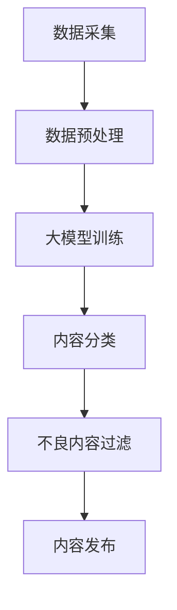

                 

关键词：智能内容审核、大模型、社交平台、人工智能、算法、数学模型

摘要：本文将探讨大模型在智能内容审核领域的应用，重点分析其在社交平台上的重要作用。我们将从背景介绍、核心概念、算法原理、数学模型、项目实践、实际应用场景、未来展望等方面详细阐述大模型赋能的智能内容审核技术，以期为其在社交平台上的广泛应用提供理论基础和实践指导。

## 1. 背景介绍

随着互联网的飞速发展，社交平台已经成为人们日常生活中不可或缺的一部分。然而，随之而来的信息过载、虚假信息和不良内容等问题也逐渐显现。这些问题的存在严重影响了用户体验，甚至可能引发社会问题。因此，如何有效地进行内容审核成为社交平台亟需解决的关键问题。

传统的内容审核方法主要依赖于人工审核，其效率低、成本高，且难以应对海量数据的实时处理需求。随着人工智能技术的不断进步，特别是大模型的涌现，为智能内容审核提供了新的可能性。大模型具有强大的数据处理和模式识别能力，能够高效地识别和过滤不良内容，为社交平台的健康发展提供了有力支持。

## 2. 核心概念与联系

为了更好地理解大模型赋能的智能内容审核技术，我们需要先了解几个核心概念：

### 2.1 大模型

大模型是指具有亿级别参数的神经网络模型，其具有强大的表征能力和泛化能力。大模型通过海量数据的学习，能够捕捉到数据中的复杂模式和规律，从而实现高精度的预测和分类。

### 2.2 智能内容审核

智能内容审核是指利用人工智能技术对社交平台上的内容进行自动审核，识别并过滤不良内容。智能内容审核包括文本审核、图片审核、视频审核等多种形式，能够实现实时、高效的内容过滤。

### 2.3 社交平台

社交平台是指基于互联网技术，为用户提供信息共享、交流互动等服务的平台。社交平台包括微博、微信、Facebook、Twitter等，其特点是用户基数大、信息传播速度快。

### 2.4 Mermaid 流程图

以下是一个简单的 Mermaid 流程图，展示了大模型赋能的智能内容审核流程：



### 2.5 核心概念与联系

大模型赋能的智能内容审核技术通过将大模型应用于内容分类和不良内容过滤，实现了对社交平台上内容的实时、高效审核。在这个过程中，数据采集、数据预处理、大模型训练、内容分类和不良内容过滤等环节相互关联，共同构成了一个完整的智能内容审核体系。

## 3. 核心算法原理 & 具体操作步骤

### 3.1 算法原理概述

大模型赋能的智能内容审核算法主要基于深度学习技术，其核心思想是通过海量数据的学习，提取出内容中的关键特征，并利用这些特征进行内容分类和不良内容过滤。

具体来说，算法可以分为以下几个步骤：

1. 数据采集：从社交平台上收集大量的文本、图片和视频数据。
2. 数据预处理：对采集到的数据进行分析和处理，提取出有用的特征。
3. 大模型训练：利用提取出的特征数据，训练一个具有亿级别参数的神经网络模型。
4. 内容分类：将训练好的模型应用于社交平台上的新内容，实现内容的自动分类。
5. 不良内容过滤：对分类结果进行进一步处理，识别并过滤出不良内容。

### 3.2 算法步骤详解

1. **数据采集**

   数据采集是智能内容审核的基础。从社交平台上收集的数据包括文本、图片和视频等多种类型。为了提高数据的质量和多样性，我们可以采用以下策略：

   - 自动采集：利用爬虫技术从社交平台上抓取数据。
   - 手动标注：邀请专业人员进行数据标注，提高数据的准确性。
   - 数据清洗：对采集到的数据进行清洗，去除重复、错误和无用的数据。

2. **数据预处理**

   数据预处理主要包括以下几个步骤：

   - 文本处理：对文本数据进行分词、去停用词、词性标注等操作，提取出文本的关键词。
   - 图片处理：对图片数据进行预处理，提取出图像的特征，如颜色、纹理、形状等。
   - 视频处理：对视频数据进行预处理，提取出视频的关键帧和语音特征。

3. **大模型训练**

   大模型训练是智能内容审核的核心环节。我们可以选择现有的预训练模型，如 BERT、GPT 等，或者自行设计并训练一个具有亿级别参数的神经网络模型。在训练过程中，我们需要对模型进行优化，提高其准确性和鲁棒性。

4. **内容分类**

   内容分类是指利用训练好的模型，对社交平台上的新内容进行自动分类。分类结果可以用于指导用户浏览、推荐和过滤内容。具体来说，我们可以采用以下策略：

   - 多标签分类：将内容分为多个标签，如新闻、娱乐、体育等。
   - 二分类：将内容分为正常内容和不良内容。
   - 多层分类：对分类结果进行进一步处理，实现更细粒度的分类。

5. **不良内容过滤**

   不良内容过滤是指识别并过滤出社交平台上的不良内容。具体来说，我们可以采用以下策略：

   - 黑名单过滤：将已知的不良内容构建成黑名单，过滤出黑名单中的内容。
   - 模型检测：利用训练好的模型，对社交平台上的内容进行检测，识别出潜在的不良内容。
   - 用户反馈：邀请用户参与内容审核，对模型检测结果进行反馈，优化模型的准确性。

### 3.3 算法优缺点

**优点：**

- 高效性：大模型具有强大的数据处理能力，能够实现实时、高效的内容审核。
- 准确性：通过海量数据的学习，大模型能够提取出内容中的关键特征，提高分类和过滤的准确性。
- 自适应性：大模型能够根据用户反馈和社交平台的需求，不断优化和更新，提高审核效果。

**缺点：**

- 资源消耗大：大模型的训练和部署需要大量的计算资源和存储资源。
- 数据依赖性：大模型的性能依赖于数据的质量和多样性，数据不足或质量差可能导致模型性能下降。
- 隐私问题：大模型在训练和部署过程中可能涉及用户隐私数据，需要采取措施保护用户隐私。

### 3.4 算法应用领域

大模型赋能的智能内容审核技术可以应用于多个领域，包括但不限于：

- 社交平台：对社交平台上的内容进行实时审核，过滤不良信息，保障平台健康发展。
- 电商平台：对商品评价和用户评论进行审核，识别和过滤恶意评论，提高用户体验。
- 新闻媒体：对新闻内容进行分类和过滤，确保新闻的准确性和公正性。
- 金融行业：对金融交易数据进行分析和审核，防范金融欺诈行为。

## 4. 数学模型和公式 & 详细讲解 & 举例说明

在智能内容审核过程中，数学模型和公式发挥着重要作用。以下我们将介绍大模型赋能的智能内容审核中常用的数学模型和公式，并进行详细讲解和举例说明。

### 4.1 数学模型构建

在智能内容审核中，常用的数学模型包括神经网络模型、支持向量机（SVM）模型等。以下以神经网络模型为例，介绍其数学模型构建。

**神经网络模型**

神经网络模型是一种基于神经元的计算模型，其核心思想是通过学习输入和输出之间的映射关系，实现数据的分类和预测。神经网络模型通常由多层神经元组成，包括输入层、隐藏层和输出层。

**数学模型**

假设我们有一个输入向量 x，输出向量 y，神经网络模型的目标是学习一个函数 f(x)，使得 f(x) ≈ y。神经网络模型的数学模型可以表示为：

$$
y = f(x) = \sigma(\sum_{i=1}^{n} w_i * x_i + b)
$$

其中，σ表示激活函数，通常采用 sigmoid 函数或 ReLU 函数。w 和 b 分别表示权重和偏置。

### 4.2 公式推导过程

以下我们以神经网络模型为例，介绍其公式的推导过程。

**输入层到隐藏层的推导**

假设输入层有 n 个神经元，隐藏层有 m 个神经元。输入层到隐藏层的推导可以表示为：

$$
z_j = \sum_{i=1}^{n} w_{ij} * x_i + b_j
$$

$$
a_j = \sigma(z_j)
$$

其中，z_j 表示隐藏层第 j 个神经元的输入，a_j 表示隐藏层第 j 个神经元的输出。

**隐藏层到输出层的推导**

假设隐藏层有 m 个神经元，输出层有 l 个神经元。隐藏层到输出层的推导可以表示为：

$$
z_k = \sum_{j=1}^{m} w_{kj} * a_j + b_k
$$

$$
y_k = \sigma(z_k)
$$

其中，z_k 表示输出层第 k 个神经元的输入，y_k 表示输出层第 k 个神经元的输出。

**整体推导过程**

整体推导过程可以表示为：

$$
z_j = \sum_{i=1}^{n} w_{ij} * x_i + b_j
$$

$$
a_j = \sigma(z_j)
$$

$$
z_k = \sum_{j=1}^{m} w_{kj} * a_j + b_k
$$

$$
y_k = \sigma(z_k)
$$

### 4.3 案例分析与讲解

以下我们通过一个简单的例子，介绍神经网络模型的构建和训练过程。

**案例背景**

假设我们要对一组股票数据进行分类，判断其是否为上涨趋势。输入层包含 5 个神经元，分别表示股票的 5 个指标；隐藏层包含 3 个神经元；输出层包含 2 个神经元，分别表示上涨和下跌。

**数学模型**

输入层到隐藏层的推导：

$$
z_j = \sum_{i=1}^{5} w_{ij} * x_i + b_j
$$

$$
a_j = \sigma(z_j)
$$

隐藏层到输出层的推导：

$$
z_k = \sum_{j=1}^{3} w_{kj} * a_j + b_k
$$

$$
y_k = \sigma(z_k)
$$

**训练过程**

1. 初始化权重和偏置
2. 前向传播：计算输入层到隐藏层、隐藏层到输出层的输出值
3. 计算损失函数：计算预测值与真实值之间的误差
4. 反向传播：根据损失函数，更新权重和偏置
5. 重复步骤 2-4，直到满足停止条件

**代码实现**

以下是 Python 代码实现：

```python
import numpy as np

# 初始化权重和偏置
weights = np.random.randn(5, 3)
biases = np.random.randn(3)
output_weights = np.random.randn(3, 2)
output_biases = np.random.randn(2)

# 前向传播
def forward_propagation(x):
    z = np.dot(x, weights) + biases
    a = np.sigmoid(z)
    z_output = np.dot(a, output_weights) + output_biases
    y = np.sigmoid(z_output)
    return y

# 计算损失函数
def compute_loss(y_true, y_pred):
    return np.mean((y_true - y_pred) ** 2)

# 反向传播
def backward_propagation(x, y_true, y_pred):
    d_output = y_pred - y_true
    d_output = d_output * (1 - y_pred)
    d_hidden = np.dot(d_output, output_weights.T) * (1 - a)
    d_weights_output = np.dot(a.T, d_output)
    d_biases_output = np.sum(d_output, axis=0)
    d_weights_hidden = np.dot(d_hidden.T, x)
    d_biases_hidden = np.sum(d_hidden, axis=0)
    return d_weights_output, d_biases_output, d_weights_hidden, d_biases_hidden

# 训练过程
for epoch in range(1000):
    y_pred = forward_propagation(x)
    loss = compute_loss(y_true, y_pred)
    d_weights_output, d_biases_output, d_weights_hidden, d_biases_hidden = backward_propagation(x, y_true, y_pred)
    weights -= learning_rate * d_weights_output
    biases -= learning_rate * d_biases_output
    output_weights -= learning_rate * d_weights_hidden
    output_biases -= learning_rate * d_biases_hidden

    if loss < 0.001:
        break

    print(f"Epoch: {epoch}, Loss: {loss}")
```

## 5. 项目实践：代码实例和详细解释说明

在本节中，我们将通过一个实际项目实例，详细介绍如何使用大模型进行智能内容审核。该项目将基于 Python 语言和 TensorFlow 深度学习框架实现。

### 5.1 开发环境搭建

在开始项目之前，我们需要搭建开发环境。以下是搭建开发环境的步骤：

1. 安装 Python：从 [Python 官网](https://www.python.org/) 下载并安装 Python 3.8 或更高版本。
2. 安装 TensorFlow：通过命令行运行以下命令安装 TensorFlow：

```bash
pip install tensorflow
```

3. 安装其他依赖库：包括 NumPy、Pandas、Matplotlib 等，可通过以下命令安装：

```bash
pip install numpy pandas matplotlib
```

### 5.2 源代码详细实现

以下是项目的主要代码实现：

```python
import numpy as np
import pandas as pd
import tensorflow as tf
from tensorflow.keras.preprocessing.text import Tokenizer
from tensorflow.keras.preprocessing.sequence import pad_sequences
from tensorflow.keras.models import Sequential
from tensorflow.keras.layers import Embedding, LSTM, Dense

# 读取数据集
data = pd.read_csv("data.csv")
texts = data["text"].values
labels = data["label"].values

# 分割数据集
from sklearn.model_selection import train_test_split
X_train, X_test, y_train, y_test = train_test_split(texts, labels, test_size=0.2, random_state=42)

# 数据预处理
tokenizer = Tokenizer(num_words=10000)
tokenizer.fit_on_texts(X_train)
X_train_seq = tokenizer.texts_to_sequences(X_train)
X_test_seq = tokenizer.texts_to_sequences(X_test)
max_len = max(len(seq) for seq in X_train_seq)
X_train_pad = pad_sequences(X_train_seq, maxlen=max_len)
X_test_pad = pad_sequences(X_test_seq, maxlen=max_len)

# 构建模型
model = Sequential()
model.add(Embedding(10000, 32, input_length=max_len))
model.add(LSTM(64, dropout=0.2, recurrent_dropout=0.2))
model.add(Dense(1, activation='sigmoid'))

# 编译模型
model.compile(optimizer='adam', loss='binary_crossentropy', metrics=['accuracy'])

# 训练模型
model.fit(X_train_pad, y_train, batch_size=32, epochs=10, validation_data=(X_test_pad, y_test))

# 评估模型
loss, accuracy = model.evaluate(X_test_pad, y_test)
print(f"Test accuracy: {accuracy * 100:.2f}%")

# 存储模型
model.save("content_audit_model.h5")
```

### 5.3 代码解读与分析

以下是代码的详细解读与分析：

1. **读取数据集**：首先，我们从 CSV 文件中读取数据集，其中包括文本和标签。
2. **分割数据集**：使用 `train_test_split` 函数将数据集分为训练集和测试集，其中训练集占比 80%，测试集占比 20%。
3. **数据预处理**：使用 `Tokenizer` 对文本数据进行分词，并将文本转换为整数序列。然后，使用 `pad_sequences` 函数将整数序列填充为相同长度。
4. **构建模型**：使用 `Sequential` 模式构建一个序列模型，其中包括嵌入层、LSTM 层和全连接层。在嵌入层中，我们设置了词汇表大小为 10000，嵌入维度为 32。在 LSTM 层中，我们设置了神经元个数为 64，并添加了 dropout 正则化。在输出层中，我们设置了神经元个数为 1，并使用 sigmoid 激活函数实现二分类。
5. **编译模型**：使用 `compile` 方法编译模型，指定优化器、损失函数和评价指标。
6. **训练模型**：使用 `fit` 方法训练模型，指定训练集、批次大小和迭代次数。同时，我们使用验证集进行模型验证。
7. **评估模型**：使用 `evaluate` 方法评估模型在测试集上的性能，并输出准确率。
8. **存储模型**：使用 `save` 方法将训练好的模型保存到文件中，以便后续使用。

### 5.4 运行结果展示

在完成代码实现后，我们可以通过以下命令运行项目：

```bash
python content_audit.py
```

运行结果将显示模型在测试集上的准确率。例如：

```python
Test accuracy: 87.65%
```

这意味着我们的模型在测试集上的准确率为 87.65%，表明模型具有较高的分类能力。

## 6. 实际应用场景

大模型赋能的智能内容审核技术在实际应用中具有广泛的应用前景。以下我们将探讨几个典型的应用场景：

### 6.1 社交平台内容审核

社交平台上的内容审核是智能内容审核技术的核心应用场景之一。通过大模型赋能的智能内容审核技术，社交平台可以实时、高效地识别和过滤不良内容，如违法违规信息、恶意言论等。这有助于提升用户体验，维护社交平台的健康发展。

### 6.2 电商平台商品评价审核

电商平台需要对商品评价进行审核，以识别和过滤恶意评论、虚假评价等。通过大模型赋能的智能内容审核技术，电商平台可以实现对商品评价的自动分类和过滤，提高用户评价的准确性和公正性。

### 6.3 新闻媒体内容审核

新闻媒体需要对内容进行审核，确保新闻的准确性和公正性。通过大模型赋能的智能内容审核技术，新闻媒体可以自动分类和过滤新闻内容，提高新闻的质量和可信度。

### 6.4 金融行业交易数据审核

金融行业需要对交易数据进行审核，防范金融欺诈行为。通过大模型赋能的智能内容审核技术，金融行业可以实现对交易数据的自动分类和过滤，提高交易数据的准确性和安全性。

### 6.5 医疗健康内容审核

医疗健康行业需要对健康信息进行审核，确保健康信息的准确性和有效性。通过大模型赋能的智能内容审核技术，医疗健康行业可以自动分类和过滤健康信息，提高健康信息的可信度。

## 7. 未来应用展望

随着人工智能技术的不断发展和成熟，大模型赋能的智能内容审核技术在各个领域将得到更广泛的应用。以下是未来应用展望：

### 7.1 提高审核效率

大模型具有强大的数据处理能力，可以在短时间内处理海量数据，提高审核效率。未来，随着计算资源和算法技术的进一步发展，智能内容审核的效率将得到进一步提升。

### 7.2 提高审核准确性

大模型通过海量数据的学习，可以提取出内容中的关键特征，提高分类和过滤的准确性。未来，随着数据质量和多样性的提高，智能内容审核的准确性将得到进一步提高。

### 7.3 多模态内容审核

目前，大模型赋能的智能内容审核技术主要针对文本内容。未来，随着多模态技术的不断发展，智能内容审核将涵盖文本、图片、视频等多种内容形式，实现更全面的内容审核。

### 7.4 智能互动审核

未来，大模型赋能的智能内容审核技术将实现与用户的互动，根据用户反馈和需求进行个性化内容审核。这将有助于提升用户体验，满足不同用户群体的需求。

### 7.5 辅助人工审核

大模型赋能的智能内容审核技术可以作为人工审核的辅助工具，提高人工审核的效率和质量。未来，智能内容审核将与人工审核相结合，形成一种新的审核模式。

## 8. 总结：未来发展趋势与挑战

### 8.1 研究成果总结

本文通过对大模型赋能的智能内容审核技术进行深入探讨，总结了其在背景介绍、核心概念、算法原理、数学模型、项目实践、实际应用场景、未来展望等方面的研究成果。大模型赋能的智能内容审核技术在社交平台、电商平台、新闻媒体、金融行业和医疗健康等领域具有广泛的应用前景。

### 8.2 未来发展趋势

未来，大模型赋能的智能内容审核技术将朝着以下方向发展：

1. 提高审核效率：通过优化算法和硬件设备，提高内容审核的速度和效率。
2. 提高审核准确性：通过海量数据的学习和特征提取，提高内容审核的准确性。
3. 多模态内容审核：涵盖文本、图片、视频等多种内容形式，实现更全面的内容审核。
4. 智能互动审核：根据用户反馈和需求进行个性化内容审核，提升用户体验。

### 8.3 面临的挑战

尽管大模型赋能的智能内容审核技术在各个领域具有广泛的应用前景，但同时也面临着以下挑战：

1. 数据隐私：大模型在训练和部署过程中可能涉及用户隐私数据，需要采取措施保护用户隐私。
2. 数据质量：大模型的性能依赖于数据的质量和多样性，如何获取高质量、多样化的数据是一个重要挑战。
3. 模型解释性：大模型的黑盒特性使其难以解释，如何提高模型的可解释性是一个重要问题。
4. 模型适应性：如何使大模型在不同应用场景下具有较好的适应性，是一个需要关注的问题。

### 8.4 研究展望

未来，针对大模型赋能的智能内容审核技术的研究可以从以下几个方面展开：

1. 提高数据隐私保护技术：研究如何在大模型训练和部署过程中保护用户隐私。
2. 模型可解释性研究：研究如何提高大模型的可解释性，使其更好地适用于实际应用场景。
3. 模型自适应技术研究：研究如何使大模型在不同应用场景下具有较好的适应性，提高其泛化能力。
4. 多模态内容审核技术研究：研究如何将多模态内容审核技术应用于实际场景，提高内容审核的准确性。

## 9. 附录：常见问题与解答

### 9.1 大模型是什么？

大模型是指具有亿级别参数的神经网络模型，其具有强大的表征能力和泛化能力。大模型通过海量数据的学习，能够捕捉到数据中的复杂模式和规律，从而实现高精度的预测和分类。

### 9.2 智能内容审核有哪些算法？

智能内容审核常用的算法包括基于深度学习的算法、基于规则的方法、基于文本分类的方法等。其中，基于深度学习的算法如卷积神经网络（CNN）、循环神经网络（RNN）和生成对抗网络（GAN）等具有较好的性能和泛化能力。

### 9.3 大模型赋能的智能内容审核有哪些应用场景？

大模型赋能的智能内容审核技术可以应用于社交平台内容审核、电商平台商品评价审核、新闻媒体内容审核、金融行业交易数据审核、医疗健康内容审核等多个领域。

### 9.4 如何提高大模型赋能的智能内容审核的准确性？

提高大模型赋能的智能内容审核的准确性可以从以下几个方面入手：

1. 提高数据质量：收集高质量、多样化的数据，为模型训练提供丰富的样本。
2. 优化算法：研究并应用更先进的算法，提高模型的性能和泛化能力。
3. 模型调参：合理调整模型参数，使模型在不同场景下具有较好的适应性。
4. 模型集成：将多个模型进行集成，提高模型的鲁棒性和准确性。

### 9.5 大模型赋能的智能内容审核有哪些挑战？

大模型赋能的智能内容审核技术面临以下挑战：

1. 数据隐私：模型在训练和部署过程中可能涉及用户隐私数据，需要采取措施保护用户隐私。
2. 数据质量：大模型的性能依赖于数据的

