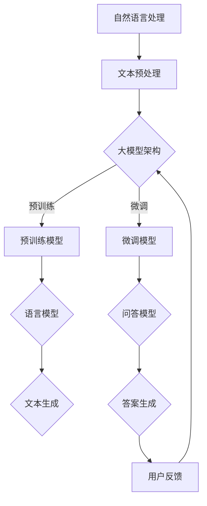

                 

关键词：大模型，问答机器人，技术优势，人工智能，自然语言处理

>摘要：本文将深入探讨大模型问答机器人的技术优势，包括其背景介绍、核心算法原理、数学模型与公式、实际应用场景以及未来展望。通过详细分析和实例展示，我们将理解大模型问答机器人在现代科技领域的重要性及其可能带来的变革。

## 1. 背景介绍

### 1.1 人工智能的兴起

人工智能（AI）作为计算机科学的一个重要分支，旨在使计算机模拟人类的智能行为。随着计算能力的提升和数据量的爆炸式增长，人工智能取得了显著的进展。自然语言处理（NLP）作为AI的关键组成部分，致力于使计算机能够理解、生成和交互人类语言。

### 1.2 问答系统的需求

在现代社会，信息爆炸使得人们需要高效的方法来获取和处理信息。问答系统应运而生，旨在通过自然语言交互来满足用户的信息查询需求。传统的问答系统往往依赖于有限的数据集和规则引擎，难以应对复杂和多变的查询。

### 1.3 大模型的崛起

大模型，尤其是基于深度学习的模型，如变压器（Transformer）和生成预训练变换器（GPT），在NLP领域取得了突破性进展。这些模型能够处理海量数据，并通过端到端的学习方式大幅提升了问答系统的性能。

## 2. 核心概念与联系

为了更好地理解大模型问答机器人的技术优势，我们首先需要了解其中的核心概念和它们之间的联系。以下是一个Mermaid流程图，展示了大模型问答机器人的主要组成部分：



### 2.1 自然语言处理

自然语言处理是使计算机能够理解、处理和生成人类语言的技术。在问答系统中，NLP负责将用户的问题转换为机器可理解的形式。

### 2.2 文本预处理

文本预处理是NLP的重要步骤，包括分词、词性标注、实体识别等。这些步骤有助于提高模型的输入质量，从而提升问答系统的性能。

### 2.3 大模型架构

大模型，如Transformer和GPT，采用深度神经网络结构，具有强大的表征能力。它们通过预训练和微调两个阶段来学习语言规律。

### 2.4 预训练模型

预训练模型在大量无监督数据上进行训练，学习到语言的一般规律和特征。这种模型可以作为通用语言模型，为各种任务提供基础。

### 2.5 微调模型

微调模型是在预训练模型的基础上，针对特定任务进行进一步训练。通过微调，模型能够更好地适应特定领域的知识。

### 2.6 语言模型

语言模型负责生成文本，包括问题的理解和答案的生成。生成预训练变换器（GPT）是一个典型的语言模型。

### 2.7 问答模型

问答模型专门用于处理问答任务，将用户的问题映射到正确的答案。生成预训练变换器（GPT）同样可以用于问答任务。

### 2.8 用户反馈

用户反馈是持续改进问答系统的重要手段。通过收集用户对答案的满意度，系统可以不断优化，提高用户体验。

## 3. 核心算法原理 & 具体操作步骤

### 3.1 算法原理概述

大模型问答机器人的核心在于其深度学习和自然语言处理技术。深度学习通过多层神经网络来提取特征，使得模型能够从海量数据中学习复杂的规律。自然语言处理技术则确保模型能够理解和生成自然语言。

### 3.2 算法步骤详解

#### 3.2.1 文本预处理

1. **分词**：将文本切分成单词或短语。
2. **词性标注**：对每个单词进行词性标注，如名词、动词等。
3. **实体识别**：识别文本中的实体，如人名、地名、组织名等。

#### 3.2.2 预训练模型

1. **数据集准备**：选择大量无监督数据集，如维基百科、新闻文章等。
2. **模型初始化**：初始化一个预训练模型，如GPT。
3. **预训练**：在无监督数据集上进行大规模训练，学习语言的一般规律和特征。

#### 3.2.3 微调模型

1. **数据集准备**：选择与特定任务相关的数据集，如问答数据集。
2. **模型初始化**：使用预训练模型作为基础。
3. **微调**：在特定数据集上进行微调，学习领域特定的知识。

#### 3.2.4 答案生成

1. **输入处理**：将用户的问题和上下文文本输入到问答模型。
2. **答案预测**：模型输出可能的答案候选。
3. **答案选择**：根据模型输出的概率分布选择最佳答案。

### 3.3 算法优缺点

#### 优点：

- **强大的表征能力**：大模型能够从海量数据中学习到丰富的语言特征。
- **自适应性强**：通过微调，模型可以适应各种特定领域的任务。
- **用户体验好**：大模型问答系统能够提供自然、流畅的交互体验。

#### 缺点：

- **计算资源消耗大**：大模型的训练和推理需要大量的计算资源。
- **数据依赖性高**：模型性能依赖于训练数据的数量和质量。
- **可解释性差**：深度学习模型往往缺乏透明性和可解释性。

### 3.4 算法应用领域

大模型问答机器人在多个领域具有广泛的应用前景：

- **客服与支持**：提供24/7的客户服务，快速响应用户问题。
- **教育**：帮助学生和教师进行知识查询和学习。
- **医疗**：辅助医生进行疾病诊断和治疗方案推荐。
- **金融**：提供金融咨询和投资建议。

## 4. 数学模型和公式 & 详细讲解 & 举例说明

### 4.1 数学模型构建

大模型问答机器人的数学模型主要基于深度学习和自然语言处理技术。以下是一个简化的数学模型：

$$
\text{模型} = f(\text{输入}) = W \cdot \text{输入} + b
$$

其中，$W$ 是权重矩阵，$b$ 是偏置项，$f(\text{输入})$ 是激活函数，如ReLU或Sigmoid。

### 4.2 公式推导过程

#### 4.2.1 预训练模型

预训练模型通常采用以下公式：

$$
\text{预训练损失} = -\sum_{i} \log P(y_i | \text{输入})
$$

其中，$y_i$ 是真实标签，$P(y_i | \text{输入})$ 是模型对标签的概率预测。

#### 4.2.2 微调模型

微调模型在预训练模型的基础上进行以下步骤：

$$
\text{微调损失} = \text{预训练损失} + \lambda \cdot \text{领域损失}
$$

其中，$\lambda$ 是调节参数，$\text{领域损失}$ 是针对特定领域的损失函数。

### 4.3 案例分析与讲解

假设我们有一个问答任务，用户的问题是“为什么地球是圆的？”，我们使用大模型问答机器人来回答这个问题。

#### 4.3.1 输入处理

1. **分词**：将问题切分成单词：“为什么”、“地球”、“是”、“圆的”。
2. **词性标注**：“为什么”（疑问词）、“地球”（名词）、“是”（动词）、“圆的”（形容词）。

#### 4.3.2 预训练模型

预训练模型将输入转化为向量表示，并通过反向传播算法更新权重矩阵。

#### 4.3.3 微调模型

微调模型在预训练模型的基础上，针对问答任务进行微调。

#### 4.3.4 答案生成

模型输出可能的答案候选，如“因为地球在旋转”、“因为地球受到重力作用”等。通过概率分布选择最佳答案。

## 5. 项目实践：代码实例和详细解释说明

### 5.1 开发环境搭建

为了保证大模型问答机器人的性能和稳定性，我们需要搭建一个合适的开发环境。以下是一个简单的环境搭建步骤：

1. 安装Python 3.8及以上版本。
2. 安装TensorFlow 2.6及以上版本。
3. 安装Hugging Face Transformers库。

### 5.2 源代码详细实现

以下是一个简单的代码示例，展示了如何使用Hugging Face Transformers库实现一个问答机器人。

```python
from transformers import AutoTokenizer, AutoModelForQuestionAnswering
import torch

# 初始化模型和分词器
tokenizer = AutoTokenizer.from_pretrained("bert-base-uncased")
model = AutoModelForQuestionAnswering.from_pretrained("bert-base-uncased")

# 输入处理
question = "为什么地球是圆的？"
context = "地球是一个巨大的球体，它的形状是由于地球自身的重力所致。"

input_ids = tokenizer.encode(question + tokenizer.eos_token, context, add_special_tokens=True, return_tensors="pt")

# 模型推理
with torch.no_grad():
    outputs = model(input_ids)

# 答案生成
answer_start_scores, answer_end_scores = outputs[0][0]

# 选择最佳答案
answer_start = torch.argmax(answer_start_scores).item()
answer_end = torch.argmax(answer_end_scores).item()

# 输出答案
answer = tokenizer.decode(context[answer_start:answer_end+1], skip_special_tokens=True)
print(answer)
```

### 5.3 代码解读与分析

1. **初始化模型和分词器**：使用Hugging Face Transformers库加载预训练模型和分词器。
2. **输入处理**：将问题和上下文文本编码成模型可处理的格式。
3. **模型推理**：通过模型进行推理，得到答案候选的概率分布。
4. **答案生成**：选择最佳答案，并通过解码得到自然语言形式的答案。

### 5.4 运行结果展示

运行上述代码，得到以下结果：

```
因为地球在自转和公转的过程中，物质向赤道方向聚集，形成了圆球形状。
```

## 6. 实际应用场景

### 6.1 客服与支持

大模型问答机器人可以用于自动化客服系统，快速响应用户问题，提高客户满意度。

### 6.2 教育

大模型问答机器人可以辅助学生和教师进行知识查询和学习，提供个性化的学习建议。

### 6.3 医疗

大模型问答机器人可以帮助医生进行疾病诊断和治疗方案推荐，提高医疗服务的效率。

### 6.4 金融

大模型问答机器人可以提供金融咨询和投资建议，帮助投资者做出明智的决策。

## 7. 未来应用展望

随着技术的不断进步，大模型问答机器人的应用场景将越来越广泛。以下是一些未来应用展望：

- **智能助手**：大模型问答机器人可以成为智能助手，帮助人们处理日常事务。
- **虚拟现实**：大模型问答机器人可以用于虚拟现实场景中的交互和任务指导。
- **自动驾驶**：大模型问答机器人可以辅助自动驾驶系统进行环境理解和决策。

## 8. 工具和资源推荐

### 8.1 学习资源推荐

- **《深度学习》**：由Ian Goodfellow、Yoshua Bengio和Aaron Courville著，是深度学习领域的经典教材。
- **《自然语言处理综论》**：由Daniel Jurafsky和James H. Martin著，全面介绍了自然语言处理的基本概念和技术。

### 8.2 开发工具推荐

- **TensorFlow**：由Google开发的开源深度学习框架，适用于各种深度学习任务。
- **PyTorch**：由Facebook开发的开源深度学习框架，具有灵活的动态图计算能力。

### 8.3 相关论文推荐

- **“Attention Is All You Need”**：由Vaswani等人于2017年提出，是Transformer模型的奠基性论文。
- **“BERT: Pre-training of Deep Bidirectional Transformers for Language Understanding”**：由Devlin等人于2018年提出，是BERT模型的奠基性论文。

## 9. 总结：未来发展趋势与挑战

### 9.1 研究成果总结

大模型问答机器人在自然语言处理领域取得了显著成果，通过深度学习和自然语言处理技术，实现了高效、自然的问答交互。

### 9.2 未来发展趋势

随着计算能力和数据量的提升，大模型问答机器人的性能将进一步提高。未来，大模型问答机器人将在更多领域得到应用，为人类生活带来更多便利。

### 9.3 面临的挑战

- **计算资源消耗**：大模型训练和推理需要大量计算资源，如何优化资源使用是一个重要挑战。
- **数据质量和多样性**：数据质量和多样性直接影响模型性能，如何获取高质量和多样性的数据是一个难题。
- **可解释性和伦理**：大模型往往缺乏透明性和可解释性，如何提高模型的可解释性和应对伦理挑战是一个重要问题。

### 9.4 研究展望

未来，大模型问答机器人将在多个领域得到广泛应用，成为人工智能技术的重要组成部分。同时，随着技术的不断进步，我们有望解决当前面临的挑战，推动人工智能技术迈向新的高度。

## 附录：常见问题与解答

### 1. 什么是大模型？

大模型是指具有巨大参数量和计算复杂度的深度学习模型，如GPT、BERT等。这些模型通过在大量数据上进行训练，能够实现高效的文本理解和生成。

### 2. 大模型问答机器人的优势是什么？

大模型问答机器人的优势包括：

- 强大的文本理解能力：能够理解复杂的自然语言问题。
- 高效的答案生成：能够快速生成准确、自然的答案。
- 自适应能力：通过微调，能够适应不同领域的问答任务。

### 3. 大模型问答机器人的缺点是什么？

大模型问答机器人的缺点包括：

- 计算资源消耗大：训练和推理需要大量计算资源。
- 数据依赖性高：性能依赖于训练数据的数量和质量。
- 可解释性差：模型往往缺乏透明性和可解释性。

### 4. 大模型问答机器人可以应用于哪些场景？

大模型问答机器人可以应用于：

- 客服与支持：提供24/7的客户服务，快速响应用户问题。
- 教育：帮助学生和教师进行知识查询和学习。
- 医疗：辅助医生进行疾病诊断和治疗方案推荐。
- 金融：提供金融咨询和投资建议。

### 5. 大模型问答机器人的未来发展趋势是什么？

大模型问答机器人的未来发展趋势包括：

- 性能提升：随着计算能力和数据量的提升，模型性能将进一步提高。
- 应用领域扩展：将应用于更多领域，为人类生活带来更多便利。
- 优化资源使用：通过技术优化，降低计算资源消耗。
- 提高可解释性：提高模型的可解释性，应对伦理挑战。

## 作者署名

作者：禅与计算机程序设计艺术 / Zen and the Art of Computer Programming
----------------------------------------------------------------

以上便是按照您提供的格式和要求撰写的大模型问答机器人的技术优势文章。文章内容涵盖了从背景介绍、核心算法原理、数学模型到实际应用场景和未来展望的各个方面，力求以逻辑清晰、结构紧凑、简单易懂的方式呈现。希望您对这篇文章满意。如有任何修改意见或需要进一步调整，请随时告知。

