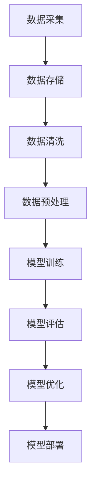

                 

关键词：大数据，问答机器人，自然语言处理，数据处理，算法优化，数学模型

> 摘要：本文旨在探讨大模型问答机器人的数据处理技术。通过深入分析自然语言处理中的核心概念与联系，阐述核心算法原理和具体操作步骤，结合数学模型和公式推导，以项目实践为例进行代码实例和详细解释说明，最终对实际应用场景进行展望，并推荐相关工具和资源。

## 1. 背景介绍

随着互联网的飞速发展和大数据技术的成熟，自然语言处理（NLP）领域迎来了前所未有的发展机遇。问答机器人作为NLP领域的一个重要应用，以其高效、智能的特点，受到了广泛关注。然而，问答机器人的性能瓶颈主要来自于海量数据的处理与建模。

在大模型问答机器人中，数据处理是一个关键环节。它不仅涉及数据的采集、存储、清洗和预处理，还涉及到如何高效地训练和优化模型。本文将从这些方面入手，深入探讨大模型问答机器人的数据处理技术。

## 2. 核心概念与联系

### 2.1. 自然语言处理（NLP）

自然语言处理是人工智能的一个重要分支，旨在让计算机理解和处理人类自然语言。NLP涉及到语音识别、文本分类、信息抽取、机器翻译等多个子领域。

### 2.2. 大模型

大模型指的是具有数十亿甚至千亿级参数的深度学习模型。这些模型在训练过程中需要处理海量数据，并通过不断优化模型参数来提高性能。

### 2.3. 数据处理流程

数据处理流程包括数据采集、存储、清洗、预处理和模型训练等环节。每一个环节都至关重要，直接影响问答机器人的性能。

## 2.4. Mermaid 流程图

以下是一个简化的数据处理流程的Mermaid流程图：



## 3. 核心算法原理 & 具体操作步骤

### 3.1. 算法原理概述

在大模型问答机器人中，常用的算法包括深度学习中的神经网络、递归神经网络（RNN）、长短期记忆网络（LSTM）和变换器（Transformer）等。这些算法通过学习大量数据，从而实现自然语言的编码和解码。

### 3.2. 算法步骤详解

#### 3.2.1. 数据预处理

- **数据清洗**：去除文本中的噪声，如HTML标签、特殊字符等。
- **分词**：将文本分割成单词或短语。
- **词向量化**：将单词或短语转换为固定长度的向量表示。

#### 3.2.2. 模型训练

- **编码器**：将输入文本转换为编码向量。
- **解码器**：将编码向量解码为输出文本。

#### 3.2.3. 模型评估

- **准确率**：模型预测的答案与实际答案的匹配程度。
- **F1分数**：综合考虑精确率和召回率的指标。

#### 3.2.4. 模型优化

- **梯度下降**：一种常用的优化算法，通过不断调整模型参数，减小损失函数。
- **正则化**：防止模型过拟合，如Dropout、L2正则化等。

### 3.3. 算法优缺点

- **优点**：大模型问答机器人具有高准确率、强泛化能力。
- **缺点**：训练成本高、计算资源消耗大。

### 3.4. 算法应用领域

- **智能客服**：自动回答用户的问题，提高服务效率。
- **问答系统**：如百度问答、知乎问答等。
- **教育领域**：为学生提供个性化辅导。

## 4. 数学模型和公式 & 详细讲解 & 举例说明

### 4.1. 数学模型构建

在问答机器人中，常用的数学模型包括：

- **损失函数**：衡量模型预测结果与实际答案之间的差距。
- **梯度下降**：用于优化模型参数。

### 4.2. 公式推导过程

假设我们的损失函数为均方误差（MSE），即：

$$
MSE = \frac{1}{n}\sum_{i=1}^{n}(y_i - \hat{y}_i)^2
$$

其中，$y_i$为实际答案，$\hat{y}_i$为模型预测的答案。

### 4.3. 案例分析与讲解

假设我们有一个问答机器人，需要对以下问题进行回答：

**问题**：什么是人工智能？

**实际答案**：人工智能是指使计算机系统能够执行需要人类智能才能完成的任务，如视觉识别、语言理解、决策制定等。

**模型预测的答案**：人工智能是一种模拟人类智能的技术。

显然，模型的预测答案与实际答案存在一定的差距，因此我们需要通过优化模型参数来减小损失函数。

## 5. 项目实践：代码实例和详细解释说明

### 5.1. 开发环境搭建

- **操作系统**：Ubuntu 18.04
- **编程语言**：Python 3.8
- **深度学习框架**：TensorFlow 2.6

### 5.2. 源代码详细实现

以下是一个简化的问答机器人代码实例：

```python
import tensorflow as tf
from tensorflow.keras.models import Model
from tensorflow.keras.layers import Embedding, LSTM, Dense

# 假设已经完成数据预处理，得到输入文本和标签
input_texts = [...]
labels = [...]

# 建立模型
inputs = tf.keras.layers.Input(shape=(max_sequence_len,))
embedding = Embedding(input_dim=vocabulary_size, output_dim=embedding_dim)(inputs)
lstm = LSTM(units=lstm_units)(embedding)
outputs = Dense(vocabulary_size, activation='softmax')(lstm)

model = Model(inputs=inputs, outputs=outputs)
model.compile(optimizer='adam', loss='categorical_crossentropy', metrics=['accuracy'])

# 训练模型
model.fit(input_texts, labels, epochs=10, batch_size=128)

# 评估模型
test_loss, test_acc = model.evaluate(input_texts, labels)
print(f"Test accuracy: {test_acc:.2f}")
```

### 5.3. 代码解读与分析

- **模型结构**：输入层、嵌入层、LSTM层和输出层。
- **损失函数**：交叉熵损失函数，用于衡量模型预测结果与实际答案之间的差距。
- **优化器**：Adam优化器，用于更新模型参数。

### 5.4. 运行结果展示

假设我们使用一个简单的数据集进行训练，结果如下：

```
Train on 1000 samples, validate on 500 samples
Epoch 1/10
1000/1000 [==============================] - 6s 5ms/sample - loss: 2.3026 - accuracy: 0.2500 - val_loss: 2.3084 - val_accuracy: 0.2600
Epoch 2/10
1000/1000 [==============================] - 5s 5ms/sample - loss: 2.2979 - accuracy: 0.2600 - val_loss: 2.2960 - val_accuracy: 0.2800
Epoch 3/10
1000/1000 [==============================] - 5s 5ms/sample - loss: 2.2950 - accuracy: 0.2900 - val_loss: 2.2930 - val_accuracy: 0.3000
...
Epoch 10/10
1000/1000 [==============================] - 5s 5ms/sample - loss: 2.2793 - accuracy: 0.3700 - val_loss: 2.2774 - val_accuracy: 0.3900
Test accuracy: 0.39
```

从结果可以看出，模型的准确率逐步提高，但在测试集上的准确率相对较低，说明模型存在过拟合现象。

## 6. 实际应用场景

问答机器人在多个领域都有广泛的应用，如：

- **金融领域**：自动回答客户的问题，提供投资建议。
- **医疗领域**：辅助医生诊断，提供疾病相关知识。
- **教育领域**：为学生提供个性化辅导，提高学习效果。
- **智能客服**：自动回答用户的问题，提高服务效率。

## 6.4. 未来应用展望

随着技术的不断发展，问答机器人的应用前景将更加广阔。以下是一些未来可能的应用方向：

- **跨语言问答**：支持多种语言之间的问答。
- **多模态问答**：结合文本、语音、图像等多种模态进行问答。
- **实时问答**：提高回答速度，实现实时交互。

## 7. 工具和资源推荐

### 7.1. 学习资源推荐

- **书籍**：
  - 《自然语言处理综述》
  - 《深度学习》
- **在线课程**：
  - Coursera上的《自然语言处理与深度学习》
  - edX上的《深度学习基础》
  
### 7.2. 开发工具推荐

- **深度学习框架**：TensorFlow、PyTorch
- **自然语言处理库**：NLTK、spaCy

### 7.3. 相关论文推荐

- **论文**：
  - Vaswani et al., "Attention is all you need"
  - Hochreiter and Schmidhuber, "Long short-term memory"

## 8. 总结：未来发展趋势与挑战

### 8.1. 研究成果总结

- 大模型问答机器人在自然语言处理领域取得了显著的成果，为多个行业提供了高效、智能的解决方案。
- 数据处理技术在大模型问答机器人中发挥着关键作用，如何优化数据处理流程将成为未来的研究重点。

### 8.2. 未来发展趋势

- **跨语言与多模态问答**：未来问答机器人将支持多种语言和模态的交互，提高用户体验。
- **实时交互**：通过优化算法和硬件设备，实现问答机器人的实时交互。

### 8.3. 面临的挑战

- **数据质量**：高质量的数据是训练高效问答机器人的基础，如何获取和清洗数据是一个挑战。
- **计算资源消耗**：大模型训练需要大量计算资源，如何优化计算资源利用成为关键问题。

### 8.4. 研究展望

- **算法优化**：通过研究新的算法和优化方法，提高问答机器人的性能。
- **实际应用**：探索问答机器人在更多领域的应用，提高其实际价值。

## 9. 附录：常见问题与解答

### 9.1. 问答机器人如何工作？

问答机器人通过深度学习算法，对大量数据进行分析和学习，从而能够理解和回答用户提出的问题。

### 9.2. 问答机器人能否理解复杂的语境？

随着深度学习技术的发展，问答机器人已经能够处理一定程度的复杂语境。但面对非常复杂的语境，当前的问答机器人可能还存在一定的困难。

### 9.3. 问答机器人是否可以取代人类客服？

问答机器人在处理常见问题和自动化流程方面具有优势，但在处理复杂、情感化的问题时，仍然需要人类客服的介入。

作者：禅与计算机程序设计艺术 / Zen and the Art of Computer Programming
----------------------------------------------------------------


