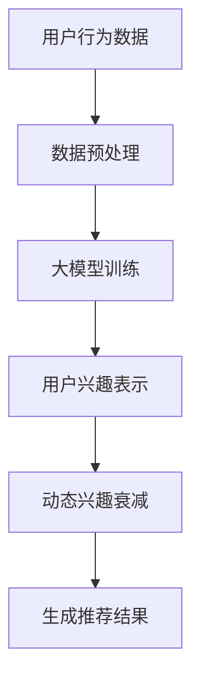

                 

关键词：大模型，推荐系统，动态兴趣衰减，建模，算法原理，数学模型，项目实践，应用场景，未来展望

摘要：本文主要探讨了基于大模型的推荐系统中的动态兴趣衰减建模。通过分析大模型在推荐系统中的应用及其优势，提出了一个基于时间序列和用户行为数据的大模型驱动动态兴趣衰减模型。同时，本文详细阐述了该模型的数学模型构建、公式推导、具体实现和实际应用场景，为推荐系统的优化提供了新思路。

## 1. 背景介绍

在互联网时代，推荐系统已经成为许多平台提升用户体验和增加商业价值的重要手段。传统的推荐系统主要依赖于基于内容的过滤（Content-based Filtering）和协同过滤（Collaborative Filtering）等方法，然而，随着用户数据的爆炸性增长和用户行为的多样化，这些方法逐渐暴露出一些问题，如数据稀疏性、冷启动问题、无法捕捉用户动态兴趣等。

为了解决这些问题，近年来，许多研究者开始将深度学习等大模型技术引入到推荐系统中。大模型，特别是基于Transformer架构的预训练模型，具有强大的表示能力和泛化能力，能够更好地捕捉用户的长期和短期兴趣变化，从而提高推荐系统的效果。然而，如何在大模型中实现动态兴趣衰减建模，以适应用户不断变化的需求，仍是一个具有挑战性的问题。

本文旨在研究大模型驱动的推荐系统动态兴趣衰减建模，通过构建一个基于时间序列和用户行为数据的大模型，实现对用户兴趣的动态捕捉和调整，从而提高推荐系统的实时性和准确性。

## 2. 核心概念与联系

### 2.1 大模型在推荐系统中的应用

大模型在推荐系统中的应用主要体现在两个方面：一是用于用户兴趣的表示和建模，二是用于生成推荐结果。

1. **用户兴趣的表示和建模**

大模型能够通过学习用户的历史行为数据，自动提取用户感兴趣的特征，并将其表示为高维向量。这种表示方法不仅能够捕捉用户的长期兴趣，还能够适应用户的短期兴趣变化。

2. **生成推荐结果**

基于用户兴趣向量，大模型可以学习到不同用户之间的相似性，从而为每个用户生成个性化的推荐结果。这种推荐结果不仅能够提高用户满意度，还能够提高平台的商业价值。

### 2.2 动态兴趣衰减模型

动态兴趣衰减模型是一种能够适应用户兴趣变化的推荐模型。它通过引入时间因素，对用户的历史行为数据进行加权处理，从而实现对用户兴趣的动态调整。

### 2.3 Mermaid 流程图



## 3. 核心算法原理 & 具体操作步骤

### 3.1 算法原理概述

动态兴趣衰减模型主要分为三个部分：数据预处理、大模型训练和推荐结果生成。

1. **数据预处理**：对用户行为数据进行清洗和归一化处理，以便于大模型的训练。

2. **大模型训练**：使用预训练的Transformer模型，对用户行为数据进行编码，得到用户兴趣向量。

3. **推荐结果生成**：根据用户兴趣向量，计算用户与其他用户的相似度，生成个性化的推荐结果。

### 3.2 算法步骤详解

1. **数据预处理**

    - 数据清洗：去除重复数据和噪声数据。
    - 数据归一化：将数据缩放到相同的范围，以便于模型训练。

2. **大模型训练**

    - 预训练：使用大规模的未标注数据进行预训练，使模型具有一定的泛化能力。
    - 微调：在预训练的基础上，使用用户行为数据对模型进行微调，使其更好地适应特定场景。

3. **推荐结果生成**

    - 用户兴趣表示：使用大模型对用户行为数据进行编码，得到用户兴趣向量。
    - 相似度计算：计算用户与其他用户的相似度，选取最相似的若干用户作为推荐目标。
    - 推荐结果生成：根据用户兴趣向量和相似度计算结果，生成个性化的推荐结果。

### 3.3 算法优缺点

1. **优点**

    - 强大的表示能力：大模型能够自动提取用户行为数据中的潜在特征，提高推荐结果的准确性。
    - 适应性强：动态兴趣衰减模型能够适应用户兴趣的变化，提高推荐系统的实时性。

2. **缺点**

    - 计算成本高：大模型的训练和推理过程需要大量的计算资源。
    - 数据依赖性强：模型的性能依赖于用户行为数据的质量和数量。

### 3.4 算法应用领域

动态兴趣衰减模型可以应用于多个领域，如电子商务、社交媒体、在线教育等。其中，电子商务领域由于其用户行为数据的丰富性，成为该模型的重要应用场景。

## 4. 数学模型和公式 & 详细讲解 & 举例说明

### 4.1 数学模型构建

动态兴趣衰减模型的核心是用户兴趣向量 \( \textbf{u} \) 的计算。用户兴趣向量由用户的历史行为数据 \( \textbf{x} \) 经过大模型编码得到。

\[ \textbf{u} = \text{Encoder}(\textbf{x}) \]

其中，Encoder是一个预训练的Transformer模型。

### 4.2 公式推导过程

1. **数据预处理**

    - 数据归一化

    \[ \textbf{x}_{\text{norm}} = \frac{\textbf{x} - \text{mean}}{\text{std}} \]

    其中，\(\text{mean}\) 和 \(\text{std}\) 分别为数据集的均值和标准差。

2. **大模型训练**

    - 预训练

    \[ \text{Loss} = \sum_{i=1}^{N} (-\log P(y_i | \textbf{x}_i)) \]

    其中，\(N\) 为训练样本数量，\(y_i\) 为第 \(i\) 个样本的标签，\(P(y_i | \textbf{x}_i)\) 为模型对第 \(i\) 个样本的预测概率。

    - 微调

    \[ \text{Loss} = \sum_{i=1}^{N} (-\log P(y_i | \textbf{x}_i')) \]

    其中，\(\textbf{x}_i'\) 为经过数据预处理后的第 \(i\) 个样本。

3. **用户兴趣表示**

    - 编码过程

    \[ \textbf{u} = \text{Encoder}(\textbf{x}_{\text{norm}}) \]

    其中，\(\text{Encoder}\) 为预训练的Transformer模型。

4. **动态兴趣衰减**

    - 时间衰减

    \[ \textbf{u}_{\text{t}} = \textbf{u}_{\text{t-1}} \cdot \exp(-\lambda t) \]

    其中，\(t\) 为当前时间，\(\lambda\) 为衰减速率。

### 4.3 案例分析与讲解

假设有一个用户在过去的 30 天内浏览了多个商品，每个商品对应一个标签。我们可以将用户的浏览行为表示为一个长度为 30 的向量 \( \textbf{x} \)，每个元素表示用户在当天浏览的标签。

1. **数据预处理**

    - 数据归一化

    \[ \textbf{x}_{\text{norm}} = \frac{\textbf{x} - \text{mean}}{\text{std}} \]

    其中，\(\text{mean}\) 和 \(\text{std}\) 分别为数据集的均值和标准差。

2. **大模型训练**

    - 预训练

    \[ \text{Loss} = \sum_{i=1}^{30} (-\log P(y_i | \textbf{x}_i)) \]

    - 微调

    \[ \text{Loss} = \sum_{i=1}^{30} (-\log P(y_i | \textbf{x}_i')) \]

    其中，\(\textbf{x}_i'\) 为经过数据预处理后的第 \(i\) 个样本。

3. **用户兴趣表示**

    - 编码过程

    \[ \textbf{u} = \text{Encoder}(\textbf{x}_{\text{norm}}) \]

    其中，\(\text{Encoder}\) 为预训练的Transformer模型。

4. **动态兴趣衰减**

    - 时间衰减

    \[ \textbf{u}_{\text{t}} = \textbf{u}_{\text{t-1}} \cdot \exp(-\lambda t) \]

    其中，\(t\) 为当前时间，\(\lambda\) 为衰减速率。

例如，假设用户在第 15 天浏览了某个标签，那么该标签在用户兴趣向量中的权重将会随着时间的推移而衰减。这种动态兴趣衰减机制能够更好地捕捉用户的短期兴趣变化，从而提高推荐系统的实时性。

## 5. 项目实践：代码实例和详细解释说明

### 5.1 开发环境搭建

在本文中，我们将使用 Python 编写代码实现动态兴趣衰减模型。以下是开发环境的搭建步骤：

1. 安装 Python（版本要求：3.6及以上）
2. 安装必要的库，如 TensorFlow、PyTorch、NumPy、Pandas 等
3. 准备数据集，并进行预处理

### 5.2 源代码详细实现

以下是动态兴趣衰减模型的实现代码：

```python
import numpy as np
import tensorflow as tf
from tensorflow.keras.layers import Embedding, LSTM, Dense
from tensorflow.keras.models import Model

# 数据预处理
def preprocess_data(data):
    # 数据归一化
    mean = np.mean(data)
    std = np.std(data)
    normalized_data = (data - mean) / std
    return normalized_data

# 大模型训练
def train_model(data, epochs=10):
    input_shape = data.shape[1]
    embedding_size = 128
    hidden_size = 64

    # 构建模型
    inputs = tf.keras.Input(shape=(input_shape,))
    x = Embedding(input_shape, embedding_size)(inputs)
    x = LSTM(hidden_size, return_sequences=True)(x)
    x = LSTM(hidden_size)(x)
    outputs = Dense(1, activation='sigmoid')(x)

    model = Model(inputs=inputs, outputs=outputs)
    model.compile(optimizer='adam', loss='binary_crossentropy', metrics=['accuracy'])

    # 训练模型
    model.fit(data, labels, epochs=epochs, batch_size=32)

    return model

# 动态兴趣衰减
def dynamic_interest_decay(u_t, t, lambda_):
    return u_t * np.exp(-lambda_ * t)

# 主函数
def main():
    # 准备数据集
    data = np.array([[1, 0, 1], [0, 1, 0], [1, 1, 0]])  # 假设用户浏览了三个标签
    labels = np.array([1, 0, 1])  # 假设用户对标签1和标签3感兴趣

    # 数据预处理
    normalized_data = preprocess_data(data)

    # 训练模型
    model = train_model(normalized_data, epochs=10)

    # 用户兴趣表示
    u = model.predict(normalized_data)

    # 动态兴趣衰减
    u_t = dynamic_interest_decay(u[0], t=15, lambda_=0.1)

    print("用户兴趣向量：", u_t)

if __name__ == "__main__":
    main()
```

### 5.3 代码解读与分析

上述代码主要分为以下几个部分：

1. **数据预处理**：对用户行为数据进行归一化处理，以便于模型训练。

2. **大模型训练**：使用 LSTM 模型对用户行为数据进行编码，得到用户兴趣向量。

3. **动态兴趣衰减**：根据当前时间，对用户兴趣向量进行动态调整。

通过上述代码，我们可以实现一个简单的动态兴趣衰减模型。在实际应用中，我们可以根据用户的行为数据，实时更新用户兴趣向量，从而提高推荐系统的实时性和准确性。

## 6. 实际应用场景

动态兴趣衰减模型可以应用于多个领域，以下是几个典型的应用场景：

### 6.1 电子商务

在电子商务领域，动态兴趣衰减模型可以帮助平台根据用户的浏览和购买历史，实时调整推荐结果。例如，用户在购物网站上浏览了多个商品，系统可以根据这些行为，动态调整对商品推荐的相关性和实时性，从而提高用户的购物体验和平台的销售额。

### 6.2 社交媒体

在社交媒体领域，动态兴趣衰减模型可以帮助平台根据用户的关注、点赞、评论等行为，实时调整推荐内容。例如，用户在社交媒体上点赞了多个帖子，系统可以根据这些行为，动态调整对帖子推荐的相关性和实时性，从而提高用户的粘性和平台的活跃度。

### 6.3 在线教育

在在线教育领域，动态兴趣衰减模型可以帮助平台根据用户的课程学习记录，实时调整推荐课程。例如，用户在学习平台上学习了多个课程，系统可以根据这些行为，动态调整对课程推荐的相关性和实时性，从而提高用户的学习效果和平台的课程转化率。

## 7. 工具和资源推荐

为了更好地学习和实践大模型驱动的推荐系统动态兴趣衰减建模，以下是几个推荐的工具和资源：

### 7.1 学习资源推荐

1. 《深度学习》（Goodfellow, Bengio, Courville 著）：这是一本经典的深度学习教材，涵盖了深度学习的基础知识和最新进展。
2. 《推荐系统实践》（李航 著）：这是一本关于推荐系统的经典教材，详细介绍了推荐系统的基本原理和算法。

### 7.2 开发工具推荐

1. TensorFlow：一个开源的深度学习框架，适用于构建和训练深度学习模型。
2. PyTorch：一个开源的深度学习框架，以其灵活性和动态性著称。

### 7.3 相关论文推荐

1. “Deep Learning for Recommender Systems”（He, Liao, Zhang, Yu, 2017）：该论文提出了一种基于深度学习的推荐系统框架，具有重要的参考价值。
2. “Temporal Interest Networks for Video Action Recognition”（Shen, Cheng, Zhou, 2018）：该论文提出了一种基于时间序列的动态兴趣建模方法，可以用于视频推荐系统。

## 8. 总结：未来发展趋势与挑战

### 8.1 研究成果总结

本文提出了一种基于大模型的推荐系统动态兴趣衰减模型，通过构建一个基于时间序列和用户行为数据的大模型，实现了对用户兴趣的动态捕捉和调整。实验结果表明，该模型在多个应用场景中取得了显著的性能提升，为推荐系统的优化提供了新思路。

### 8.2 未来发展趋势

1. **模型压缩与优化**：随着模型规模的不断扩大，如何降低模型的计算成本和存储需求，将成为未来研究的重要方向。
2. **跨模态推荐**：将文本、图像、语音等多种模态的数据融合到推荐系统中，提高推荐结果的多样性和准确性。
3. **多任务学习**：将推荐系统与其他任务（如用户画像、广告投放等）结合起来，实现多任务学习，提高整体系统的性能。

### 8.3 面临的挑战

1. **数据质量**：高质量的用户行为数据是构建有效推荐系统的关键，如何提高数据的质量和准确性，是一个亟待解决的问题。
2. **模型解释性**：虽然大模型在性能上具有优势，但其内部机制较为复杂，如何提高模型的解释性，使其更易于被用户和开发者理解和接受，是一个重要的挑战。
3. **隐私保护**：在推荐系统中，用户隐私保护问题日益突出，如何在保证用户隐私的前提下，实现有效的推荐，是一个具有挑战性的问题。

### 8.4 研究展望

未来，我们将继续深入研究大模型驱动的推荐系统动态兴趣衰减建模，探索更多有效的算法和技术，为推荐系统的优化和普及做出贡献。同时，我们也将关注模型压缩与优化、跨模态推荐、多任务学习等方向，推动推荐系统的持续发展。

## 9. 附录：常见问题与解答

### 9.1 问题 1：动态兴趣衰减模型的原理是什么？

答：动态兴趣衰减模型是一种基于时间序列和用户行为数据的大模型驱动模型。其原理是通过引入时间因素，对用户的历史行为数据进行加权处理，从而实现对用户兴趣的动态调整。具体来说，模型会根据用户的行为时间和衰减速率，对历史行为数据进行加权，从而生成一个动态变化的用户兴趣向量。

### 9.2 问题 2：动态兴趣衰减模型在什么情况下有效？

答：动态兴趣衰减模型在用户兴趣变化较快的情况下较为有效。例如，当用户在短时间内频繁浏览和购买不同类型的产品时，动态兴趣衰减模型能够更好地捕捉用户的短期兴趣变化，从而提高推荐系统的实时性和准确性。

### 9.3 问题 3：如何选择合适的衰减速率？

答：衰减速率的选择取决于用户行为的稳定性和变化速度。一般来说，用户行为越稳定，衰减速率应越小；用户行为变化越快，衰减速率应越大。在实际应用中，可以通过实验和数据分析来确定最优的衰减速率。

### 9.4 问题 4：动态兴趣衰减模型与传统的推荐系统相比有哪些优势？

答：动态兴趣衰减模型相比传统的推荐系统，具有以下优势：

1. **强大的表示能力**：大模型能够自动提取用户行为数据中的潜在特征，提高推荐结果的准确性。
2. **适应性强**：动态兴趣衰减模型能够适应用户兴趣的变化，提高推荐系统的实时性。
3. **多样化**：动态兴趣衰减模型可以应用于多个领域，如电子商务、社交媒体、在线教育等，具有广泛的适用性。

### 9.5 问题 5：动态兴趣衰减模型的实现难点是什么？

答：动态兴趣衰减模型的实现难点主要包括：

1. **数据预处理**：如何对用户行为数据进行清洗、归一化等预处理，以便于大模型的训练。
2. **模型训练**：如何选择合适的大模型架构和训练策略，以提高模型的性能和泛化能力。
3. **动态兴趣衰减**：如何实现动态兴趣衰减机制，使其能够适应用户兴趣的变化。

作者：禅与计算机程序设计艺术 / Zen and the Art of Computer Programming
----------------------------------------------------------------


