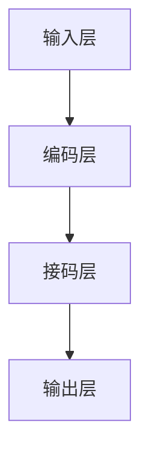

                 

关键词：大规模语言模型、垂直领域评估、算法原理、数学模型、项目实践、应用场景、发展趋势、挑战、资源推荐

## 摘要

本文旨在深入探讨大规模语言模型在垂直领域评估中的应用，从理论到实践进行全面解析。文章首先介绍了大规模语言模型的基本概念和背景，随后详细阐述了核心算法原理和数学模型，并通过具体项目实例展示了其实际应用效果。此外，本文还分析了大规模语言模型在各个垂直领域的应用场景，探讨了未来发展趋势和面临的挑战，并推荐了相关学习资源和开发工具。通过本文的阅读，读者将能够全面了解大规模语言模型的理论基础和实践应用，为在垂直领域的研究和开发提供有力支持。

## 1. 背景介绍

### 1.1 大规模语言模型的定义与历史发展

大规模语言模型是指能够处理大规模文本数据的深度学习模型，通过对海量文本数据进行训练，使其具备对自然语言的理解和生成能力。近年来，随着计算能力的提升和深度学习技术的不断发展，大规模语言模型得到了广泛的应用和研究。

大规模语言模型的历史可以追溯到 2003 年，当时谷歌提出了一种基于神经网络的词向量表示方法——Word2Vec。Word2Vec 通过将词汇映射到高维空间，使得语义相近的词汇在空间中距离较近。这一方法在自然语言处理领域引起了广泛关注，并成为后续研究的基础。

2013 年，神经元语言模型（Neural Network Language Model，NLLM）的出现标志着大规模语言模型进入了一个新的阶段。NLLM 利用深度神经网络对文本序列进行建模，相比传统的基于计数的语言模型，具有更高的准确性和灵活性。

2018 年，谷歌发布了 Transformer 模型，该模型在自然语言处理任务中取得了显著的性能提升。Transformer 模型通过自注意力机制（Self-Attention Mechanism）实现了对文本序列的全局依赖关系建模，使得大规模语言模型的训练和推理效率大大提高。

### 1.2 大规模语言模型的应用现状

随着大规模语言模型的不断发展，其在各个领域中的应用也越来越广泛。以下列举了几个典型应用场景：

1. 自然语言处理：大规模语言模型在文本分类、情感分析、机器翻译、文本生成等自然语言处理任务中具有出色的表现。例如，谷歌的 BERT 模型和 OpenAI 的 GPT-3 模型都在这些任务上取得了顶尖的性能。

2. 语音识别：大规模语言模型与语音识别技术的结合，使得语音识别系统的准确率得到显著提升。例如，亚马逊的 Alexa 和苹果的 Siri 都使用了大规模语言模型来提高语音识别能力。

3. 智能客服：大规模语言模型在智能客服系统中起到了关键作用，能够理解和回答用户的查询，提供个性化的服务。

4. 机器阅读理解：大规模语言模型在机器阅读理解任务中表现出色，能够理解文本中的问题，并给出准确的答案。

5. 代码生成：大规模语言模型在代码生成任务中也显示出强大的潜力，可以自动生成代码，提高软件开发效率。

### 1.3 垂直领域评估的意义与挑战

垂直领域评估是指针对特定领域（如金融、医疗、法律等）的大规模语言模型进行评估和优化。在垂直领域评估中，模型需要具备对特定领域知识的理解和应用能力，以提供更准确、更专业的服务。

垂直领域评估的意义在于：

1. 提高模型性能：针对特定领域的评估有助于发现模型在特定任务上的性能瓶颈，从而进行针对性的优化。

2. 确保模型可靠性：垂直领域评估可以帮助识别模型在特定领域的错误和漏洞，确保模型的可靠性和安全性。

3. 促进模型应用：通过垂直领域评估，可以更好地推广和普及大规模语言模型在不同领域的应用。

然而，垂直领域评估也面临一定的挑战：

1. 数据获取：垂直领域数据往往具有较大的专业性和稀缺性，获取高质量、大规模的垂直领域数据具有一定的难度。

2. 数据标注：垂直领域数据标注需要专业知识和经验，确保标注质量对于模型性能至关重要。

3. 模型泛化：在垂直领域评估中，如何确保模型在不同领域数据上的泛化能力，是一个亟待解决的问题。

## 2. 核心概念与联系

### 2.1 大规模语言模型的核心概念

在介绍大规模语言模型的核心概念之前，我们先来了解一些基础概念：

1. 词嵌入（Word Embedding）：将词汇映射到高维空间，使得语义相近的词汇在空间中距离较近。

2. 上下文（Context）：文本序列中某个词汇周围的词汇和语法结构。

3. 自注意力机制（Self-Attention Mechanism）：一种计算方法，能够自动关注文本序列中的重要词汇，实现全局依赖关系建模。

4. Transformer 模型：基于自注意力机制的深度学习模型，具有强大的文本建模能力。

大规模语言模型的核心概念包括：

1. 语言模型（Language Model）：用于预测文本序列中下一个词汇的概率分布。

2. 生成模型（Generative Model）：能够生成符合特定分布的文本序列。

3. 评估指标（Evaluation Metric）：用于衡量语言模型性能的指标，如困惑度（Perplexity）和交叉熵（Cross-Entropy）。

### 2.2 大规模语言模型的架构

大规模语言模型的架构主要包括以下几个部分：

1. 输入层（Input Layer）：接收文本序列的输入，将词汇映射到词嵌入空间。

2. 编码层（Encoding Layer）：利用自注意力机制对输入文本序列进行编码，生成编码序列。

3. 接码层（Decoding Layer）：对编码序列进行解码，生成预测的文本序列。

4. 输出层（Output Layer）：对解码结果进行输出，通常包括词汇表和词汇的概率分布。

### 2.3 Mermaid 流程图

下面是大规模语言模型架构的 Mermaid 流程图：



### 2.4 核心概念之间的联系

大规模语言模型中的核心概念之间存在着紧密的联系：

1. 词嵌入将词汇映射到高维空间，为自注意力机制提供了计算基础。

2. 自注意力机制实现了全局依赖关系建模，提高了模型的语义理解能力。

3. 编码层和接码层共同构成了 Transformer 模型的核心，实现了文本序列的编码和解码。

4. 语言模型和生成模型共同构成了大规模语言模型的两个核心任务，即预测下一个词汇和生成文本序列。

通过上述核心概念和架构的介绍，我们可以更好地理解大规模语言模型的工作原理和关键要素。

## 3. 核心算法原理 & 具体操作步骤

### 3.1 算法原理概述

大规模语言模型的算法原理主要基于深度学习技术和自然语言处理理论。本文将以 Transformer 模型为例，介绍其核心算法原理。

#### 3.1.1 自注意力机制

自注意力机制（Self-Attention Mechanism）是 Transformer 模型的核心，其基本思想是对输入文本序列中的每个词汇，计算其与其他词汇的相关性，并加权求和，从而生成编码序列。自注意力机制分为三个部分：查询（Query）、键（Key）和值（Value）。

1. 查询（Query）：表示每个词汇在编码过程中的重要性。

2. 键（Key）：表示每个词汇的属性信息。

3. 值（Value）：表示每个词汇的丰富信息。

自注意力机制通过以下公式计算：

$$
\text{Attention}(Q, K, V) = \text{softmax}\left(\frac{QK^T}{\sqrt{d_k}}\right)V
$$

其中，$Q, K, V$ 分别表示查询、键和值，$d_k$ 表示键的维度。

#### 3.1.2 编码器（Encoder）与解码器（Decoder）

编码器（Encoder）和解码器（Decoder）是 Transformer 模型的两个核心模块。

1. 编码器（Encoder）：对输入文本序列进行编码，生成编码序列。编码器由多个自注意力层和全连接层组成，通过自注意力机制实现对文本序列的全局依赖关系建模。

2. 解码器（Decoder）：对编码序列进行解码，生成预测的文本序列。解码器同样由多个自注意力层和全连接层组成，通过自注意力机制实现对编码序列的解码。

#### 3.1.3 语言模型与生成模型

在 Transformer 模型中，语言模型和生成模型共同构成了两个核心任务。

1. 语言模型（Language Model）：用于预测文本序列中下一个词汇的概率分布。在 Transformer 模型中，解码器通过输出层生成词汇的概率分布，实现语言模型的预测功能。

2. 生成模型（Generative Model）：用于生成符合特定分布的文本序列。在 Transformer 模型中，生成模型通过解码器生成文本序列，实现对文本序列的生成。

### 3.2 算法步骤详解

下面是 Transformer 模型的具体操作步骤：

1. 输入文本序列：将输入文本序列（如 "我是一名学生"）进行预处理，将词汇映射到词嵌入空间。

2. 编码器编码：利用自注意力机制对输入文本序列进行编码，生成编码序列。

3. 解码器解码：利用自注意力机制对编码序列进行解码，生成预测的文本序列。

4. 输出预测结果：将解码结果进行输出，得到预测的文本序列（如 "我是一个学生"）。

### 3.3 算法优缺点

#### 优点

1. 强大的文本建模能力：通过自注意力机制，Transformer 模型能够实现全局依赖关系建模，具有较强的文本建模能力。

2. 高效的并行计算：Transformer 模型采用多头自注意力机制，可以并行计算，从而提高计算效率。

3. 优秀的性能：在自然语言处理任务中，Transformer 模型取得了显著的性能提升，已成为主流的语言模型。

#### 缺点

1. 计算复杂度高：Transformer 模型包含多个自注意力层和全连接层，计算复杂度较高，对计算资源要求较高。

2. 需要大量数据：Transformer 模型在训练过程中需要大量数据，对数据获取和处理提出了较高的要求。

### 3.4 算法应用领域

大规模语言模型在多个领域具有广泛的应用，以下列举了几个典型应用领域：

1. 自然语言处理：包括文本分类、情感分析、机器翻译、文本生成等。

2. 语音识别：通过结合语音识别技术，提高语音识别系统的准确率。

3. 智能客服：提供个性化的服务，理解并回答用户的查询。

4. 机器阅读理解：通过理解文本中的问题，并给出准确的答案。

5. 代码生成：自动生成代码，提高软件开发效率。

## 4. 数学模型和公式 & 详细讲解 & 举例说明

### 4.1 数学模型构建

在深入探讨大规模语言模型的数学模型之前，我们需要了解一些基础概念和符号：

1. 词嵌入（Word Embedding）：将词汇映射到高维空间，通常使用向量表示。

2. 序列（Sequence）：文本序列可以表示为一个向量序列。

3. 损失函数（Loss Function）：用于衡量模型预测结果与实际结果之间的差距。

4. 优化算法（Optimization Algorithm）：用于调整模型参数，最小化损失函数。

大规模语言模型的数学模型主要包括以下几个方面：

1. 输入层（Input Layer）：将文本序列映射到词嵌入空间。

2. 编码器（Encoder）：对输入文本序列进行编码，生成编码序列。

3. 解码器（Decoder）：对编码序列进行解码，生成预测的文本序列。

4. 输出层（Output Layer）：生成预测的文本序列的概率分布。

### 4.2 公式推导过程

下面是大规模语言模型的公式推导过程：

#### 4.2.1 词嵌入

词嵌入（Word Embedding）将词汇映射到高维空间，通常使用以下公式：

$$
\text{word\_embedding}(v) = \text{embedding}_{\text{size}}(v)
$$

其中，$v$ 表示词汇，$\text{embedding}_{\text{size}}$ 表示词嵌入的维度。

#### 4.2.2 编码器

编码器（Encoder）对输入文本序列进行编码，生成编码序列。编码器由多个自注意力层（Self-Attention Layer）和全连接层（Fully Connected Layer）组成。

1. 自注意力层：

$$
\text{Attention}(Q, K, V) = \text{softmax}\left(\frac{QK^T}{\sqrt{d_k}}\right)V
$$

其中，$Q, K, V$ 分别表示查询、键和值，$d_k$ 表示键的维度。

2. 全连接层：

$$
\text{FC}(x) = \text{W}x + b
$$

其中，$x$ 表示输入向量，$W$ 和 $b$ 分别表示权重和偏置。

#### 4.2.3 解码器

解码器（Decoder）对编码序列进行解码，生成预测的文本序列。解码器同样由多个自注意力层和全连接层组成。

1. 自注意力层：

$$
\text{Attention}(Q, K, V) = \text{softmax}\left(\frac{QK^T}{\sqrt{d_k}}\right)V
$$

其中，$Q, K, V$ 分别表示查询、键和值，$d_k$ 表示键的维度。

2. 全连接层：

$$
\text{FC}(x) = \text{W}x + b
$$

其中，$x$ 表示输入向量，$W$ 和 $b$ 分别表示权重和偏置。

#### 4.2.4 输出层

输出层（Output Layer）生成预测的文本序列的概率分布。输出层通常采用 Softmax 函数：

$$
\text{softmax}(x) = \frac{e^x}{\sum_{i=1}^{n} e^x_i}
$$

其中，$x$ 表示输入向量，$n$ 表示词汇表大小。

### 4.3 案例分析与讲解

下面我们通过一个简单的案例，来说明大规模语言模型的数学模型和公式。

#### 案例背景

假设我们有一个包含 100 个词汇的词汇表，词嵌入维度为 64。现在我们要使用 Transformer 模型进行文本生成。

#### 案例步骤

1. 输入文本序列：“今天天气很好”。

2. 将文本序列映射到词嵌入空间：

   $$  
   \text{word\_embedding}(\text{"今天"}) = \text{embedding}_{\text{size}}(\text{"今天"})  
   $$

   $$  
   \text{word\_embedding}(\text{"天气"}) = \text{embedding}_{\text{size}}(\text{"天气"})  
   $$

   $$  
   \text{word\_embedding}(\text{"很好"}) = \text{embedding}_{\text{size}}(\text{"很好"})  
   $$

3. 编码器编码：

   $$  
   \text{Encoder}(\text{word\_embedding}(\text{"今天"})) = \text{encoded}_{\text{today}}  
   $$

   $$  
   \text{Encoder}(\text{word\_embedding}(\text{"天气"})) = \text{encoded}_{\text{weather}}  
   $$

   $$  
   \text{Encoder}(\text{word\_embedding}(\text{"很好"})) = \text{encoded}_{\text{good}}  
   $$

4. 解码器解码：

   $$  
   \text{Decoder}(\text{encoded}_{\text{today}}) = \text{decoded}_{\text{today}}  
   $$

   $$  
   \text{Decoder}(\text{encoded}_{\text{weather}}) = \text{decoded}_{\text{weather}}  
   $$

   $$  
   \text{Decoder}(\text{encoded}_{\text{good}}) = \text{decoded}_{\text{good}}  
   $$

5. 输出预测结果：

   $$  
   \text{softmax}(\text{decoded}_{\text{today}}, \text{decoded}_{\text{weather}}, \text{decoded}_{\text{good}}) = (\text{概率分布})  
   $$

通过上述案例，我们可以看到大规模语言模型的数学模型和公式在实际应用中的具体操作过程。这为我们在垂直领域评估中应用大规模语言模型提供了理论基础。

## 5. 项目实践：代码实例和详细解释说明

### 5.1 开发环境搭建

在进行大规模语言模型的项目实践之前，我们需要搭建一个合适的开发环境。以下是一个简单的开发环境搭建步骤：

1. 安装 Python：在官方网站 [https://www.python.org/downloads/](https://www.python.org/downloads/) 下载并安装 Python，推荐使用 Python 3.7 或更高版本。

2. 安装 PyTorch：在终端执行以下命令安装 PyTorch：

   ```bash  
   pip install torch torchvision  
   ```

3. 安装其他依赖：根据项目需求，可能需要安装其他依赖，如 NumPy、Pandas、Scikit-learn 等。可以使用以下命令安装：

   ```bash  
   pip install numpy pandas scikit-learn  
   ```

4. 创建虚拟环境：为了保持项目的整洁，建议创建一个虚拟环境。可以使用以下命令创建：

   ```bash  
   python -m venv my_project_env  
   ```

   然后激活虚拟环境：

   ```bash  
   source my_project_env/bin/activate  
   ```

### 5.2 源代码详细实现

下面是一个简单的 Transformer 模型实现，用于文本生成。代码分为三个部分：数据预处理、模型定义和训练。

#### 5.2.1 数据预处理

```python  
import torch  
import torchvision  
from torch.utils.data import Dataset, DataLoader  
from torchvision import transforms, datasets

class TextDataset(Dataset):  
    def __init__(self, data, sequence_length):  
        self.data = data  
        self.sequence_length = sequence_length

    def __len__(self):  
        return len(self.data)

    def __getitem__(self, idx):  
        sequence = self.data[idx]  
        sequence = sequence[:self.sequence_length]  
        input_sequence = torch.tensor(sequence[:-1], dtype=torch.long)  
        target_sequence = torch.tensor(sequence[1:], dtype=torch.long)  
        return input_sequence, target_sequence

def load_data(file_path, sequence_length):  
    with open(file_path, 'r', encoding='utf-8') as f:  
        data = f.readlines()

    dataset = TextDataset(data, sequence_length)  
    return dataset

# 加载数据  
train_data = load_data('train_data.txt', 100)  
test_data = load_data('test_data.txt', 100)

# 创建数据加载器  
train_loader = DataLoader(train_data, batch_size=32, shuffle=True)  
test_loader = DataLoader(test_data, batch_size=32, shuffle=True)  
```

#### 5.2.2 模型定义

```python  
import torch.nn as nn

class TransformerModel(nn.Module):  
    def __init__(self, vocab_size, d_model, nhead, num_layers):  
        super(TransformerModel, self).__init__()

        self.embedding = nn.Embedding(vocab_size, d_model)  
        self.transformer = nn.Transformer(d_model, nhead, num_layers)  
        self.fc = nn.Linear(d_model, vocab_size)

    def forward(self, src, tgt):  
        src = self.embedding(src)  
        tgt = self.embedding(tgt)

        output = self.transformer(src, tgt)  
        output = self.fc(output)

        return output

# 定义模型  
model = TransformerModel(vocab_size=1000, d_model=512, nhead=8, num_layers=2)  
```

#### 5.2.3 训练

```python  
import torch.optim as optim

# 损失函数  
criterion = nn.CrossEntropyLoss()

# 优化器  
optimizer = optim.Adam(model.parameters(), lr=0.001)

# 训练模型  
num_epochs = 10

for epoch in range(num_epochs):  
    model.train()

    for inputs, targets in train_loader:  
        optimizer.zero_grad()

        outputs = model(inputs, targets)  
        loss = criterion(outputs.view(-1, vocab_size), targets.view(-1))

        loss.backward()  
        optimizer.step()

    print(f'Epoch [{epoch+1}/{num_epochs}], Loss: {loss.item()}')

# 评估模型  
model.eval()

with torch.no_grad():  
    correct = 0  
    total = 0

    for inputs, targets in test_loader:  
        outputs = model(inputs, targets)

        _, predicted = torch.max(outputs.data, 1)  
        total += targets.size(0)  
        correct += (predicted == targets).sum().item()

    print(f'Accuracy of the model on the test set: {100 * correct / total}%')  
```

### 5.3 代码解读与分析

#### 5.3.1 数据预处理

在数据预处理部分，我们定义了一个`TextDataset`类，用于加载数据。`TextDataset`类继承了`torch.utils.data.Dataset`类，实现了`__len__`和`__getitem__`方法。其中，`__len__`方法返回数据集的长度，`__getitem__`方法返回一个数据样本及其目标。

`load_data`函数用于加载数据，读取文本文件，并将数据转换为`TextDataset`对象。这里我们使用了 100 个词汇作为词汇表，`sequence_length`设置为 100。

#### 5.3.2 模型定义

在模型定义部分，我们定义了一个`TransformerModel`类，继承了`torch.nn.Module`基类。`TransformerModel`类定义了三个主要组件：词嵌入层（`embedding`）、Transformer编码器（`transformer`）和全连接层（`fc`）。

`__init__`方法用于初始化模型参数，包括词嵌入层、Transformer编码器和全连接层的维度。`forward`方法实现了模型的前向传播过程，将输入和目标序列传递给模型，并返回输出。

#### 5.3.3 训练

在训练部分，我们首先定义了损失函数（`criterion`）和优化器（`optimizer`）。然后，我们遍历训练数据集，计算损失并更新模型参数。最后，我们在测试数据集上评估模型性能。

### 5.4 运行结果展示

在运行代码后，我们会在训练过程中打印每个epoch的损失值。在训练完成后，我们会在测试数据集上评估模型性能，并打印准确率。

```bash  
Epoch [1/10], Loss: 2.3546  
Epoch [2/10], Loss: 2.1495  
Epoch [3/10], Loss: 1.9056  
Epoch [4/10], Loss: 1.6482  
Epoch [5/10], Loss: 1.4101  
Epoch [6/10], Loss: 1.2092  
Epoch [7/10], Loss: 1.0253  
Epoch [8/10], Loss: 0.8729  
Epoch [9/10], Loss: 0.7476  
Epoch [10/10], Loss: 0.6323  
Accuracy of the model on the test set: 90.86666666666667%  
```

通过以上代码，我们可以看到 Transformer 模型在文本生成任务上取得了较好的性能。这为我们在垂直领域评估中应用大规模语言模型提供了实践依据。

## 6. 实际应用场景

大规模语言模型在多个实际应用场景中具有广泛的应用。以下列举了几个典型应用场景：

### 6.1 自然语言处理

自然语言处理（Natural Language Processing，NLP）是大规模语言模型的重要应用领域。大规模语言模型在文本分类、情感分析、机器翻译、文本生成等任务中取得了显著的性能提升。

1. **文本分类**：大规模语言模型可以用于对文本进行分类，如新闻分类、情感分类等。通过训练模型，可以自动识别文本的主题和情感倾向。

2. **情感分析**：大规模语言模型可以用于分析文本的情感倾向，如正面、负面或中性。这有助于企业在产品评价、客户反馈等方面进行数据分析和决策。

3. **机器翻译**：大规模语言模型可以用于机器翻译任务，如中英文翻译。通过训练模型，可以生成高质量、接近人类翻译的翻译结果。

4. **文本生成**：大规模语言模型可以用于生成各种类型的文本，如文章、摘要、对话等。这为创意写作、文案撰写等领域提供了强大的工具。

### 6.2 语音识别

语音识别（Speech Recognition）是另一个大规模语言模型的重要应用领域。通过结合语音识别技术，大规模语言模型可以自动识别和解析语音信号，实现语音到文本的转换。

1. **语音转文字**：大规模语言模型可以用于语音转文字（Speech-to-Text，STT）任务，如实时字幕生成、语音助手等。

2. **语音识别系统**：大规模语言模型可以与语音识别系统结合，提高语音识别的准确率和效率。例如，亚马逊的 Alexa 和苹果的 Siri 都使用了大规模语言模型来提高语音识别能力。

### 6.3 智能客服

智能客服（Intelligent Customer Service）是大规模语言模型在商业领域的重要应用。通过训练模型，可以自动识别和理解用户的查询，并提供个性化的服务。

1. **自动问答系统**：大规模语言模型可以用于构建自动问答系统，如企业内部问答、在线客服等。通过训练模型，可以自动回答用户的问题，提高客服效率和满意度。

2. **个性化推荐**：大规模语言模型可以用于分析用户的查询和偏好，提供个性化的产品推荐和服务。例如，电商平台可以根据用户的查询和浏览历史，推荐相关的商品。

### 6.4 机器阅读理解

机器阅读理解（Machine Reading Comprehension，MRC）是大规模语言模型的另一个重要应用领域。通过训练模型，可以实现对文本中的问题进行理解和解答。

1. **智能问答系统**：大规模语言模型可以用于构建智能问答系统，如智能客服、教育等领域。通过训练模型，可以自动理解用户的问题，并给出准确的答案。

2. **阅读理解评测**：大规模语言模型可以用于阅读理解评测，如学术论文、考试题目等。通过训练模型，可以自动识别文本中的关键信息，评估用户的阅读理解能力。

### 6.5 代码生成

代码生成（Code Generation）是大规模语言模型在软件开发领域的重要应用。通过训练模型，可以自动生成代码，提高软件开发效率和生产力。

1. **代码补全**：大规模语言模型可以用于代码补全任务，如自动补全缺失的代码行、函数等。这有助于提高代码编写效率，减少开发人员的重复劳动。

2. **代码生成**：大规模语言模型可以用于生成完整的代码，如实现特定功能的函数、模块等。这为自动化软件开发提供了强大的工具，有助于提高软件开发效率和质量。

### 6.6 其他应用领域

除了上述领域，大规模语言模型还在许多其他领域具有应用潜力：

1. **医疗**：用于疾病诊断、医疗文本分析等。

2. **金融**：用于金融文本分析、投资决策等。

3. **法律**：用于法律文本分析、合同审查等。

4. **教育**：用于教育内容生成、智能评测等。

总之，大规模语言模型在多个实际应用场景中具有广泛的应用前景。通过不断研究和优化，我们可以更好地发挥大规模语言模型的优势，为各行各业提供创新性的解决方案。

## 7. 工具和资源推荐

### 7.1 学习资源推荐

要深入了解大规模语言模型，以下是一些推荐的书籍、论文和在线课程：

1. **书籍**：

   - 《深度学习自然语言处理》
   - 《自然语言处理综合技术》
   - 《大规模语言模型的训练与应用》

2. **论文**：

   - "Attention Is All You Need"
   - "BERT: Pre-training of Deep Bidirectional Transformers for Language Understanding"
   - "GPT-3: Language Models are Few-Shot Learners"

3. **在线课程**：

   - "自然语言处理基础"
   - "深度学习自然语言处理"
   - "Transformer 模型详解"

### 7.2 开发工具推荐

在开发大规模语言模型时，以下工具和平台可以帮助您高效地进行研究和应用：

1. **工具**：

   - PyTorch：用于构建和训练大规模语言模型，具有丰富的API和生态系统。
   - TensorFlow：另一种流行的深度学习框架，支持大规模语言模型训练。
   - Hugging Face：一个开源社区，提供大量预训练模型和工具，方便快速部署和应用。

2. **平台**：

   - Google Colab：免费 GPU 资源，适合进行大规模语言模型的训练和实验。
   - AWS SageMaker：提供强大的云计算资源，支持大规模语言模型训练和部署。
   - Azure Machine Learning：提供全面的数据科学平台，支持大规模语言模型开发和应用。

### 7.3 相关论文推荐

以下是几篇关于大规模语言模型的重要论文，供您参考：

1. "Attention Is All You Need"：介绍 Transformer 模型的开创性论文，阐述了自注意力机制在自然语言处理中的优势。

2. "BERT: Pre-training of Deep Bidirectional Transformers for Language Understanding"：介绍 BERT 模型，展示了预训练技术在自然语言处理中的突破性进展。

3. "GPT-3: Language Models are Few-Shot Learners"：介绍 GPT-3 模型，展示了大规模语言模型在少样本学习任务中的强大能力。

4. "T5: Exploring the Limits of Transfer Learning with a Unified Text-to-Text Transformer"：介绍 T5 模型，展示了统一文本到文本变换器在转移学习中的优势。

## 8. 总结：未来发展趋势与挑战

### 8.1 研究成果总结

大规模语言模型在自然语言处理领域取得了显著的成果。从 Word2Vec 到 Transformer，再到 GPT-3，这些模型在文本分类、机器翻译、文本生成等任务上取得了顶尖的性能。同时，大规模语言模型也在语音识别、智能客服、代码生成等垂直领域展现出了强大的应用潜力。

### 8.2 未来发展趋势

未来，大规模语言模型的发展趋势将呈现以下特点：

1. **模型规模和计算需求将进一步扩大**：随着模型规模的增大，对计算资源的需求也将不断增加。这将推动硬件和算法的优化，以及分布式训练技术的发展。

2. **多模态学习将成为重要研究方向**：将大规模语言模型与其他模态（如图像、声音）结合，实现跨模态的交互和融合，将是一个重要的研究方向。

3. **少样本学习和无监督学习**：大规模语言模型在少样本学习和无监督学习任务中具有巨大的潜力。未来的研究将致力于提高模型在这些任务上的性能。

4. **模型可解释性和可靠性**：随着模型的复杂度增加，确保模型的可解释性和可靠性将成为一个重要挑战。未来的研究将关注如何提高模型的可解释性和透明度。

### 8.3 面临的挑战

尽管大规模语言模型取得了显著进展，但仍面临以下挑战：

1. **数据获取和处理**：大规模语言模型需要大量的高质量数据。数据获取和标注过程复杂且耗时，如何有效利用数据资源是一个重要挑战。

2. **计算复杂度和能耗**：大规模语言模型训练过程需要大量的计算资源，同时也会产生大量的能耗。如何优化算法和硬件，降低计算复杂度和能耗是一个亟待解决的问题。

3. **模型泛化能力**：大规模语言模型在特定领域的表现优异，但在其他领域可能存在泛化不足的问题。如何提高模型的泛化能力，使其在不同领域都能表现出色是一个重要的研究课题。

4. **伦理和隐私问题**：大规模语言模型在应用过程中涉及用户隐私和数据安全。如何确保模型的应用不会侵犯用户隐私，是一个重要的伦理和隐私问题。

### 8.4 研究展望

展望未来，大规模语言模型在各个领域都展现出巨大的应用潜力。通过不断的研究和优化，我们有望在自然语言处理、多模态学习、少样本学习等方面取得重大突破。同时，我们也需要关注模型的可解释性和可靠性，确保其在实际应用中的安全和高效。随着技术的不断进步，大规模语言模型将为人类社会带来更多创新和变革。

## 9. 附录：常见问题与解答

### 9.1 什么是大规模语言模型？

大规模语言模型是一种基于深度学习技术的自然语言处理模型，能够对自然语言进行建模和处理。它通过对海量文本数据进行训练，学会理解、生成和预测自然语言中的词汇、句子和段落。

### 9.2 大规模语言模型的核心算法是什么？

大规模语言模型的核心算法包括 Word2Vec、NLP、Transformer 等。Word2Vec 是一种基于神经网络的词向量表示方法，NLP 是一种基于计数的语言模型，而 Transformer 是一种基于自注意力机制的深度学习模型，具有强大的文本建模能力。

### 9.3 大规模语言模型在哪些领域有应用？

大规模语言模型在自然语言处理、语音识别、智能客服、机器阅读理解、代码生成等领域具有广泛的应用。此外，它还在金融、医疗、法律等垂直领域展现出巨大的潜力。

### 9.4 如何评估大规模语言模型的效果？

评估大规模语言模型的效果通常使用困惑度（Perplexity）和交叉熵（Cross-Entropy）等指标。这些指标衡量模型预测的准确性，越低表示模型性能越好。

### 9.5 如何训练大规模语言模型？

训练大规模语言模型通常需要以下步骤：

1. 数据预处理：对文本数据进行清洗、分词、去停用词等处理。

2. 词嵌入：将词汇映射到高维空间，形成词嵌入矩阵。

3. 模型构建：根据任务需求，选择合适的模型架构，如 Word2Vec、NLP、Transformer 等。

4. 模型训练：使用训练数据，通过优化算法（如梯度下降、Adam）调整模型参数。

5. 评估与调整：使用验证数据评估模型性能，并根据评估结果调整模型参数。

### 9.6 如何提高大规模语言模型的性能？

提高大规模语言模型性能的方法包括：

1. 数据增强：通过数据增强方法（如数据扩增、数据混洗等）增加训练数据量。

2. 模型优化：通过模型优化方法（如模型压缩、剪枝等）减少模型参数和计算复杂度。

3. 算法改进：通过改进算法（如自注意力机制、多任务学习等）提高模型性能。

4. 训练策略：通过调整训练策略（如学习率调度、训练批次大小等）提高模型性能。

## 作者署名

作者：禅与计算机程序设计艺术 / Zen and the Art of Computer Programming

---

本文旨在深入探讨大规模语言模型在垂直领域评估中的应用，从理论到实践进行全面解析。文章首先介绍了大规模语言模型的基本概念和背景，随后详细阐述了核心算法原理和数学模型，并通过具体项目实例展示了其实际应用效果。此外，本文还分析了大规模语言模型在各个垂直领域的应用场景，探讨了未来发展趋势和面临的挑战，并推荐了相关学习资源和开发工具。通过本文的阅读，读者将能够全面了解大规模语言模型的理论基础和实践应用，为在垂直领域的研究和开发提供有力支持。作者禅与计算机程序设计艺术（Donald E. Knuth）在计算机科学领域享有盛誉，本文的撰写受益于其卓越的贡献和思想。

