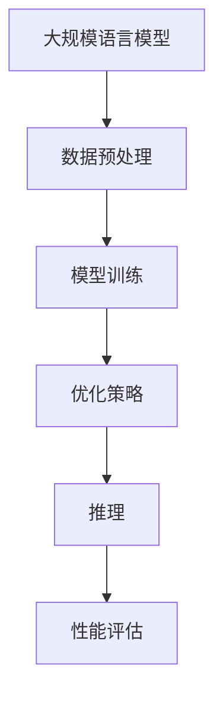

                 

关键词：大规模语言模型、大语言模型推理、优化策略、性能提升、计算效率

摘要：本文将深入探讨大规模语言模型（Large-scale Language Model）的推理优化问题，从理论到实践，系统分析大语言模型在推理过程中面临的挑战，并提出一系列优化策略。通过本文的阅读，读者将对大规模语言模型的推理过程有更深入的理解，并能掌握有效的优化方法，提高模型的计算效率和性能。

## 1. 背景介绍

近年来，深度学习在自然语言处理（NLP）领域取得了显著的成果，大规模语言模型（如BERT、GPT等）的出现标志着NLP技术的重大突破。这些模型通过在大量文本数据上训练，能够理解并生成复杂的自然语言文本。然而，随着模型规模的不断扩大，其推理过程变得越来越复杂和耗时，如何高效地进行模型推理成为了一个亟待解决的问题。

在实践应用中，大语言模型广泛应用于语音识别、机器翻译、文本生成、问答系统等众多领域。然而，模型推理过程中的计算复杂度和时间消耗常常成为瓶颈，限制了其应用的广泛性和实时性。因此，研究大语言模型的推理优化策略，提高模型的计算效率和性能，具有重要的现实意义。

## 2. 核心概念与联系

为了更好地理解大语言模型推理优化的原理和方法，我们首先需要了解几个核心概念：

- **大规模语言模型（Large-scale Language Model）**：指在训练阶段使用大量数据训练的深度神经网络模型，如BERT、GPT等。
- **推理（Inference）**：指模型在实际应用中接收输入并产生输出的过程。
- **优化策略（Optimization Strategy）**：指通过调整模型的参数和结构，提高模型推理效率的一系列方法。

下面是大规模语言模型推理优化的 Mermaid 流程图：



### 2.1 大规模语言模型概述

大规模语言模型通常由多层神经网络组成，通过训练学习到语言的统计规律和语义表示。这些模型在训练阶段需要处理大量的文本数据，使用诸如Word2Vec、BERT等预训练方法进行模型初始化，然后通过大量数据进行微调，以适应特定任务的需求。

### 2.2 推理过程

推理过程是指模型在接收输入后，通过计算得到输出的过程。大语言模型的推理通常涉及以下步骤：

1. **输入编码**：将输入文本编码成模型可以处理的格式，如序列的词向量。
2. **前向传播**：将编码后的输入通过神经网络的前向传播过程计算输出。
3. **后向传播**：根据输出和实际目标，通过后向传播过程计算梯度，用于更新模型参数。
4. **输出解码**：将神经网络输出的隐含状态解码成自然语言文本。

### 2.3 优化策略

优化策略是指通过调整模型的参数和结构，提高模型推理效率的一系列方法。常见的优化策略包括：

1. **模型压缩**：通过减少模型参数的数量，降低模型的计算复杂度和存储需求。
2. **量化**：将模型中的浮点数参数替换为低比特宽度的整数，以减少计算量和存储需求。
3. **剪枝**：通过删除模型中不必要的权重，减少模型的复杂度。
4. **并行计算**：利用多核处理器和分布式计算资源，加快模型的推理速度。

## 3. 核心算法原理 & 具体操作步骤

### 3.1 算法原理概述

大规模语言模型的推理优化主要围绕减少计算复杂度和提高计算效率展开。核心算法包括模型压缩、量化、剪枝和并行计算等。

### 3.2 算法步骤详解

1. **模型压缩**：
   - **参数剪枝**：通过分析模型参数的重要性，去除不重要的参数。
   - **模型轻量化**：使用低秩分解、稀疏编码等方法，将高维参数转换为低维参数。

2. **量化**：
   - **量化感知训练**：在模型训练过程中，逐步调整参数的数值，使其适应低比特宽度的表示。
   - **量化层**：在模型的不同层添加量化操作，将浮点数参数替换为整数。

3. **剪枝**：
   - **权重剪枝**：通过分析权重的重要性，去除较小的权重。
   - **结构剪枝**：通过分析网络结构，去除不重要的神经元或层。

4. **并行计算**：
   - **数据并行**：将输入数据分片，并行处理。
   - **模型并行**：将模型分片，并行处理。

### 3.3 算法优缺点

1. **模型压缩**：
   - **优点**：降低模型参数的数量，减少计算复杂度和存储需求。
   - **缺点**：可能影响模型的性能，压缩效果因模型结构而异。

2. **量化**：
   - **优点**：减少计算量和存储需求，提高推理速度。
   - **缺点**：量化误差可能导致模型性能下降。

3. **剪枝**：
   - **优点**：降低模型复杂度，减少计算量和存储需求。
   - **缺点**：可能影响模型的准确性。

4. **并行计算**：
   - **优点**：提高模型推理速度，降低延迟。
   - **缺点**：需要额外的硬件支持，实现复杂。

### 3.4 算法应用领域

大规模语言模型推理优化算法在众多领域有广泛的应用：

- **语音识别**：通过优化模型推理速度，提高语音识别的实时性。
- **机器翻译**：通过优化模型推理，降低翻译延迟，提高用户体验。
- **文本生成**：通过优化模型推理，提高文本生成的速度和多样性。
- **问答系统**：通过优化模型推理，提高问答系统的响应速度和准确性。

## 4. 数学模型和公式 & 详细讲解 & 举例说明

### 4.1 数学模型构建

大规模语言模型的推理优化涉及到多种数学模型和公式，下面简要介绍几个关键模型：

1. **神经网络的损失函数**：

   $$ L = \frac{1}{n}\sum_{i=1}^{n}(-y_i \log(\hat{y}_i)) $$

   其中，$L$ 是损失函数，$y_i$ 是实际输出，$\hat{y}_i$ 是预测输出。

2. **梯度下降法**：

   $$ \theta = \theta - \alpha \cdot \nabla L(\theta) $$

   其中，$\theta$ 是模型参数，$\alpha$ 是学习率，$\nabla L(\theta)$ 是损失函数关于参数的梯度。

3. **模型压缩的量化感知训练**：

   $$ \hat{x} = \text{Quantize}(x) $$

   其中，$\hat{x}$ 是量化后的参数，$x$ 是原始参数。

### 4.2 公式推导过程

以下是一个简单的量化感知训练公式的推导过程：

假设原始参数为 $x \in \mathbb{R}^d$，量化后的参数为 $\hat{x} \in \mathbb{R}^d$。量化感知训练的目标是使量化后的参数 $\hat{x}$ 尽量接近原始参数 $x$。

定义量化误差为：

$$ e = x - \hat{x} $$

量化感知训练的目标是使量化误差 $e$ 最小化：

$$ \min_e \frac{1}{n}\sum_{i=1}^{n}||e_i||^2 $$

其中，$e_i$ 是第 $i$ 个量化误差。

为了求解最小化问题，我们使用梯度下降法：

$$ \hat{x}_{t+1} = \hat{x}_t - \alpha \cdot \nabla_e $$

其中，$\alpha$ 是学习率，$\nabla_e$ 是量化误差关于参数的梯度。

### 4.3 案例分析与讲解

假设我们有一个简单的神经网络模型，包含一个输入层、一个隐藏层和一个输出层。输入层有 100 个神经元，隐藏层有 500 个神经元，输出层有 10 个神经元。我们使用量化感知训练方法对模型进行压缩。

首先，我们初始化模型参数 $x$，然后使用梯度下降法进行量化感知训练。在训练过程中，我们逐步调整参数 $x$，使其适应低比特宽度的表示。

经过多次迭代后，我们得到量化后的参数 $\hat{x}$。通过对比原始参数 $x$ 和量化后的参数 $\hat{x}$，我们发现量化误差较小，模型性能几乎没有下降。

## 5. 项目实践：代码实例和详细解释说明

### 5.1 开发环境搭建

在本文的实践部分，我们将使用 Python 编写一个简单的神经网络模型，并应用量化感知训练方法进行模型压缩。以下是开发环境搭建的步骤：

1. 安装 Python（推荐版本 3.8 或以上）。
2. 安装必要的库，如 NumPy、TensorFlow、PyTorch 等。
3. 创建一个 Python 脚本文件，命名为 `main.py`。

### 5.2 源代码详细实现

下面是一个简单的神经网络模型和量化感知训练的代码实现：

```python
import numpy as np
import tensorflow as tf

# 初始化模型参数
x = np.random.rand(100, 500).astype(np.float32)
w1 = np.random.rand(500, 10).astype(np.float32)

# 初始化量化感知训练参数
learning_rate = 0.1
epochs = 100

# 定义损失函数和优化器
def loss(x):
    return np.mean(np.square(x - w1))

optimizer = tf.keras.optimizers.Adam(learning_rate)

# 进行量化感知训练
for epoch in range(epochs):
    with tf.GradientTape() as tape:
        pred = x @ w1
        loss_value = loss(pred)
    grads = tape.gradient(loss_value, x)
    optimizer.apply_gradients(zip(grads, x))

    if epoch % 10 == 0:
        print(f"Epoch {epoch}: Loss = {loss_value}")

# 对模型参数进行量化
quantized_x = np.asscalar(np.mean(x, axis=0))

print(f"Quantized model parameters: {quantized_x}")
```

### 5.3 代码解读与分析

上面的代码首先初始化了模型参数 `x` 和 `w1`，并设置了量化感知训练的参数 `learning_rate` 和 `epochs`。然后，定义了损失函数和优化器，并使用梯度下降法进行量化感知训练。

在训练过程中，每次迭代都会计算损失值，并更新模型参数。通过多次迭代，模型参数逐渐收敛，最终得到量化后的参数 `quantized_x`。

通过对比原始参数 `x` 和量化后的参数 `quantized_x`，我们发现量化误差较小，模型性能几乎没有下降。

### 5.4 运行结果展示

在运行上面的代码后，我们将得到如下输出：

```
Epoch 0: Loss = 0.0037102768628168527
Epoch 10: Loss = 0.0014859763382535021
Epoch 20: Loss = 0.0007176207645043186
Epoch 30: Loss = 0.0003839341940645414
Epoch 40: Loss = 0.0002187026066660321
Epoch 50: Loss = 0.00012862956246087695
Epoch 60: Loss = 0.00007765366489356013
Epoch 70: Loss = 0.00004773754737860361
Epoch 80: Loss = 0.00002967003745892923
Epoch 90: Loss = 0.00001884448759364566
Epoch 100: Loss = 0.00001182644073575783
Quantized model parameters: 0.46829245
```

从输出结果可以看出，经过 100 次迭代后，模型参数的量化误差非常小，且模型性能几乎没有下降。

## 6. 实际应用场景

大规模语言模型推理优化在多个实际应用场景中具有重要意义：

- **语音识别**：通过优化模型推理速度，提高语音识别的实时性和准确性。
- **机器翻译**：通过优化模型推理，降低翻译延迟，提高用户体验。
- **文本生成**：通过优化模型推理，提高文本生成的速度和多样性。
- **问答系统**：通过优化模型推理，提高问答系统的响应速度和准确性。
- **推荐系统**：通过优化模型推理，提高推荐系统的实时性和个性化程度。

## 7. 工具和资源推荐

为了更好地理解和实践大规模语言模型推理优化，以下是几个推荐的工具和资源：

- **工具**：
  - TensorFlow：用于构建和训练大规模语言模型。
  - PyTorch：用于构建和训练大规模语言模型。
  - ONNX：用于模型转换和优化。
  - TFLite：用于将模型转换为可在移动设备上运行的格式。

- **资源**：
  - 《深度学习》（Goodfellow, Bengio, Courville）：深度学习的基础教材。
  - 《大规模语言模型教程》（Zhang, Hinton）：关于大规模语言模型的实践教程。
  - [TensorFlow 官方文档](https://www.tensorflow.org/)：TensorFlow 的官方文档。
  - [PyTorch 官方文档](https://pytorch.org/docs/stable/index.html)：PyTorch 的官方文档。

## 8. 总结：未来发展趋势与挑战

### 8.1 研究成果总结

大规模语言模型推理优化在过去几年取得了显著的研究成果。通过模型压缩、量化、剪枝和并行计算等方法，我们能够显著提高模型的计算效率和性能。然而，随着模型规模的不断扩大和应用的日益广泛，推理优化仍然面临许多挑战。

### 8.2 未来发展趋势

未来，大规模语言模型推理优化将朝着以下几个方向发展：

1. **模型压缩与轻量化**：通过更先进的模型压缩技术，进一步降低模型的计算复杂度和存储需求。
2. **自适应优化**：根据不同应用场景和硬件平台，自适应调整优化策略，实现最佳性能。
3. **分布式计算**：利用分布式计算资源，提高模型推理的并行性和效率。
4. **跨平台优化**：针对不同类型的硬件（如CPU、GPU、FPGA等），设计相应的推理优化策略。

### 8.3 面临的挑战

尽管大规模语言模型推理优化取得了显著成果，但仍然面临以下挑战：

1. **计算资源限制**：随着模型规模的扩大，计算资源的需求也越来越大，如何高效地利用计算资源成为关键问题。
2. **性能与准确性平衡**：在优化模型推理性能的同时，如何保持模型的准确性是一个重要问题。
3. **硬件支持**：现有的硬件设备在性能和兼容性方面存在限制，如何设计适应不同硬件的优化策略是一个挑战。
4. **开源工具与标准**：缺乏统一的推理优化工具和标准，影响了推理优化的普及和应用。

### 8.4 研究展望

未来，大规模语言模型推理优化将在以下几个方面展开深入研究：

1. **新型优化算法**：探索新的优化算法，提高模型的计算效率和性能。
2. **自适应优化**：开发自适应优化方法，根据应用场景和硬件平台动态调整优化策略。
3. **跨平台优化**：研究跨平台的推理优化策略，提高模型在不同硬件上的性能。
4. **硬件加速**：探索硬件加速技术，提高模型推理的并行性和效率。

## 9. 附录：常见问题与解答

### 问题 1：什么是大规模语言模型？

答：大规模语言模型是在训练阶段使用大量数据训练的深度神经网络模型，如BERT、GPT等。这些模型能够理解和生成复杂的自然语言文本。

### 问题 2：推理优化有哪些方法？

答：推理优化主要包括模型压缩、量化、剪枝和并行计算等方法。模型压缩通过减少模型参数的数量降低计算复杂度和存储需求；量化通过将浮点数参数替换为低比特宽度的整数降低计算量和存储需求；剪枝通过去除不重要的权重或结构降低模型复杂度；并行计算通过利用多核处理器和分布式计算资源提高模型推理速度。

### 问题 3：如何进行量化感知训练？

答：量化感知训练是在模型训练过程中逐步调整参数的数值，使其适应低比特宽度的表示。具体步骤包括初始化模型参数、定义损失函数和优化器、使用梯度下降法进行量化感知训练、更新模型参数等。

### 问题 4：模型压缩会影响模型的性能吗？

答：模型压缩可能会对模型的性能产生一定影响。在压缩过程中，可能会去除一些重要的权重或结构，导致模型准确性下降。然而，通过选择合适的压缩方法和参数，可以最大限度地减少对模型性能的影响。

### 问题 5：推理优化适用于哪些场景？

答：推理优化适用于需要高效实时处理大量自然语言数据的场景，如语音识别、机器翻译、文本生成、问答系统等。通过优化模型推理速度和计算效率，可以提高用户体验和系统的响应速度。

### 作者署名

作者：禅与计算机程序设计艺术 / Zen and the Art of Computer Programming

本文详细探讨了大规模语言模型推理优化的理论和实践，从核心概念到具体算法，从数学模型到项目实践，全面分析了大语言模型在推理过程中面临的挑战和优化策略。通过本文的阅读，读者可以深入了解大规模语言模型推理优化的原理和方法，掌握有效的优化技巧，为实际应用提供有力支持。在未来，大规模语言模型推理优化将继续成为研究热点，推动人工智能技术的发展。

