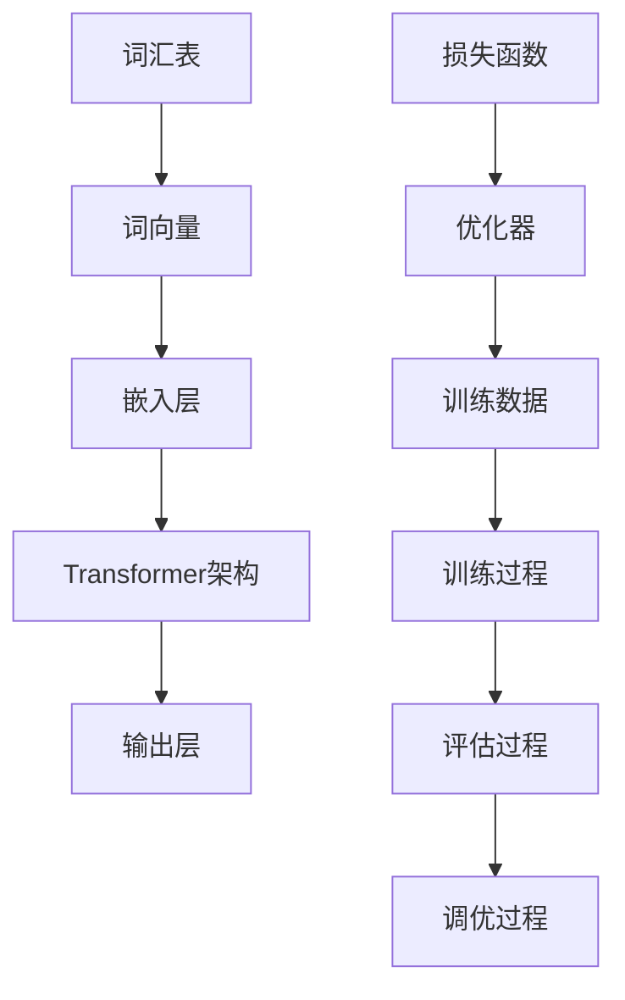

                 

关键词：大规模语言模型、提示学习、语境学习、数学模型、算法原理、项目实践

> 摘要：本文将深入探讨大规模语言模型的原理与实践，重点阐述提示学习和语境学习在语言模型中的应用。通过对核心概念、算法原理、数学模型和项目实践的详细解读，我们将为读者提供一份全面的技术指南，旨在帮助读者理解和应用大规模语言模型，为未来的研究和实践提供有益的启示。

## 1. 背景介绍

在过去的几十年中，人工智能领域取得了惊人的进展，尤其是深度学习和自然语言处理（NLP）方面的突破。大规模语言模型作为NLP领域的重要工具，已经广泛应用于机器翻译、文本生成、问答系统等多个场景。这些模型能够理解并生成自然语言，极大地提高了人机交互的效率和准确性。

### 1.1 大规模语言模型的发展历程

- **早期研究**：20世纪80年代，研究人员开始探索使用统计方法和规则系统来处理自然语言。
- **词袋模型和统计模型**：20世纪90年代，词袋模型（Bag of Words, BoW）和统计语言模型（如n-gram模型）被广泛应用，它们利用词汇和语言模式来预测下一个单词。
- **深度学习时代**：随着计算能力的提升和深度学习技术的成熟，2010年代，研究人员开始尝试使用神经网络来构建语言模型。Word2Vec、GloVe等词向量模型的出现标志着语言模型的新时代。
- **现代大规模模型**：近年来，Transformer架构的提出和BERT、GPT等模型的成功，使得大规模语言模型成为NLP领域的核心工具。

### 1.2 大规模语言模型的应用场景

- **机器翻译**：大规模语言模型能够高效地将一种语言翻译成另一种语言，如Google Translate。
- **文本生成**：从新闻文章到诗歌创作，大规模语言模型可以生成各种形式的文本内容。
- **问答系统**：如OpenAI的GPT-3，能够回答用户提出的问题，提供有用的信息。
- **聊天机器人**：大规模语言模型被广泛应用于聊天机器人，如Apple的Siri和Google的Google Assistant。

## 2. 核心概念与联系

为了更好地理解大规模语言模型，我们需要了解其核心概念和联系。以下是使用Mermaid绘制的流程图，展示了大规模语言模型的基本组件和它们之间的关系。



### 2.1 词汇表

词汇表是大规模语言模型的基础。它包含了模型可以理解和处理的词汇集合。词汇表的大小直接影响到模型的性能和表现。

### 2.2 词向量

词向量是将词汇表中的单词映射到高维空间中的向量表示。Word2Vec、GloVe等模型通过学习词汇之间的相似性和相关性，生成高质量的词向量。

### 2.3 嵌入层

嵌入层是将词向量映射到更高维度的空间，以便模型能够更好地理解和处理语言结构。嵌入层通常是一个全连接的神经网络层。

### 2.4 Transformer架构

Transformer是近年来提出的一种新型神经网络架构，它取代了传统的循环神经网络（RNN）和卷积神经网络（CNN）在序列建模中的应用。Transformer的核心组件是多头自注意力机制（Multi-head Self-Attention），它能够同时考虑输入序列中的所有信息。

### 2.5 输出层

输出层是将模型的预测结果转换为具体任务的输出。例如，在文本生成任务中，输出层可以是生成下一个单词的预测。

### 2.6 损失函数和优化器

损失函数用于衡量模型预测结果和真实结果之间的差距。优化器则用于调整模型的参数，以最小化损失函数。

### 2.7 训练数据和训练过程

训练数据是模型的输入，用于训练模型。训练过程包括前向传播、反向传播和参数更新。

### 2.8 评估过程和调优过程

评估过程用于衡量模型的性能。调优过程则是通过调整模型参数，进一步提高模型的性能。

## 3. 核心算法原理 & 具体操作步骤

### 3.1 算法原理概述

大规模语言模型的算法原理主要包括以下几个方面：

- **词向量生成**：使用Word2Vec、GloVe等模型生成词向量。
- **Transformer架构**：采用多头自注意力机制，构建高效的序列建模模型。
- **损失函数**：使用交叉熵损失函数，衡量模型预测结果和真实结果之间的差距。
- **优化器**：使用如Adam等优化器，调整模型参数，最小化损失函数。

### 3.2 算法步骤详解

1. **词向量生成**：使用Word2Vec或GloVe模型，对词汇表中的单词进行向量化处理。

2. **构建Transformer模型**：定义Transformer模型的组件，包括嵌入层、多头自注意力机制和输出层。

3. **损失函数**：定义交叉熵损失函数，用于衡量模型预测结果和真实结果之间的差距。

4. **优化器**：选择如Adam等优化器，用于调整模型参数。

5. **训练过程**：进行前向传播和反向传播，更新模型参数。

6. **评估过程**：使用验证集评估模型性能，调整模型参数。

7. **调优过程**：通过调整学习率、批大小等超参数，进一步提高模型性能。

### 3.3 算法优缺点

**优点**：

- **强大的序列建模能力**：Transformer架构能够同时考虑输入序列中的所有信息，具有强大的序列建模能力。
- **并行计算**：由于Transformer模型的局部性，它可以在GPU上高效地并行计算。
- **易于扩展**：Transformer模型可以很容易地扩展到多个维度和多任务学习。

**缺点**：

- **计算资源消耗**：大规模语言模型需要大量的计算资源和存储空间。
- **训练时间较长**：由于模型参数的数量庞大，训练时间可能较长。

### 3.4 算法应用领域

- **机器翻译**：Transformer架构在机器翻译任务中取得了显著的效果，如Google Translate。
- **文本生成**：Transformer模型可以生成各种形式的文本内容，如新闻文章、诗歌等。
- **问答系统**：Transformer模型可以回答用户提出的问题，提供有用的信息。

## 4. 数学模型和公式 & 详细讲解 & 举例说明

### 4.1 数学模型构建

大规模语言模型的数学模型主要包括以下几个方面：

- **词向量生成**：使用Word2Vec或GloVe模型，将词汇表中的单词映射到高维空间中的向量表示。
- **Transformer模型**：定义Transformer模型的数学架构，包括嵌入层、多头自注意力机制和输出层。
- **损失函数**：使用交叉熵损失函数，衡量模型预测结果和真实结果之间的差距。

### 4.2 公式推导过程

#### 4.2.1 词向量生成

1. **Word2Vec模型**：

   Word2Vec模型的核心思想是学习一个线性映射函数，将词汇表中的单词映射到高维空间中的向量表示。

   $$\text{vec}(w) = \text{softmax}(W \cdot \text{emb}(w))$$

   其中，$\text{vec}(w)$ 是单词 $w$ 的向量表示，$\text{emb}(w)$ 是单词 $w$ 的词向量，$W$ 是权重矩阵。

2. **GloVe模型**：

   GloVe模型通过学习单词的共现矩阵，生成词向量。

   $$\text{vec}(w) = \text{softmax}(A \cdot \text{emb}(w))$$

   其中，$A$ 是共现矩阵，$\text{emb}(w)$ 是单词 $w$ 的词向量。

#### 4.2.2 Transformer模型

1. **嵌入层**：

   $$\text{emb}(x) = W_e \cdot [1, \text{vec}(x)]^T$$

   其中，$W_e$ 是嵌入矩阵，$x$ 是输入序列。

2. **多头自注意力机制**：

   $$\text{attn}(Q, K, V) = \text{softmax}(\text{Q} \cdot \text{K}^T) \cdot V$$

   其中，$Q, K, V$ 分别是查询向量、键向量和值向量。

3. **输出层**：

   $$\text{output} = \text{softmax}(W_o \cdot \text{output})$$

   其中，$W_o$ 是输出矩阵，$\text{output}$ 是模型输出。

#### 4.2.3 损失函数

1. **交叉熵损失函数**：

   $$\text{loss} = -\sum_{i} y_i \cdot \log(\text{softmax}(x_i))$$

   其中，$y_i$ 是真实标签，$x_i$ 是模型输出。

### 4.3 案例分析与讲解

#### 4.3.1 机器翻译

假设我们要将英语句子 "I love programming" 翻译成法语。

1. **词向量生成**：

   使用GloVe模型生成英语和法语的词向量。

2. **Transformer模型**：

   构建一个双语Transformer模型，输入是英语句子 "I love programming"，输出是法语句子 "Je aime la programmation"。

3. **损失函数**：

   使用交叉熵损失函数，计算模型预测结果和真实结果之间的差距。

4. **优化器**：

   使用Adam优化器，调整模型参数，最小化损失函数。

5. **训练过程**：

   在大量双语语料库上训练模型，进行前向传播和反向传播。

6. **评估过程**：

   使用验证集评估模型性能，调整模型参数。

7. **调优过程**：

   通过调整学习率、批大小等超参数，进一步提高模型性能。

## 5. 项目实践：代码实例和详细解释说明

### 5.1 开发环境搭建

在开始项目实践之前，我们需要搭建一个适合大规模语言模型开发的开发环境。以下是所需的开发环境和相关软件：

- **操作系统**：Linux或macOS
- **编程语言**：Python
- **深度学习框架**：TensorFlow或PyTorch
- **硬件**：GPU（如NVIDIA GeForce GTX 1080 Ti或以上）

### 5.2 源代码详细实现

以下是使用PyTorch实现一个简单的大规模语言模型的源代码。

```python
import torch
import torch.nn as nn
import torch.optim as optim

# 定义词向量嵌入层
embed = nn.Embedding(vocab_size, embed_dim)

# 定义Transformer模型
class Transformer(nn.Module):
    def __init__(self, vocab_size, embed_dim, hidden_dim, n_head):
        super(Transformer, self).__init__()
        self.embedding = embed
        self.transformer = nn.Transformer(embed_dim, hidden_dim, n_head)
        self.fc = nn.Linear(hidden_dim, vocab_size)
    
    def forward(self, x):
        x = self.embedding(x)
        x = self.transformer(x)
        x = self.fc(x)
        return x

# 实例化模型
model = Transformer(vocab_size, embed_dim, hidden_dim, n_head)

# 定义损失函数和优化器
criterion = nn.CrossEntropyLoss()
optimizer = optim.Adam(model.parameters(), lr=learning_rate)

# 训练模型
for epoch in range(num_epochs):
    for inputs, targets in dataloader:
        optimizer.zero_grad()
        outputs = model(inputs)
        loss = criterion(outputs, targets)
        loss.backward()
        optimizer.step()
    print(f"Epoch [{epoch+1}/{num_epochs}], Loss: {loss.item()}")

# 评估模型
with torch.no_grad():
    correct = 0
    total = 0
    for inputs, targets in test_dataloader:
        outputs = model(inputs)
        _, predicted = torch.max(outputs.data, 1)
        total += targets.size(0)
        correct += (predicted == targets).sum().item()
    print(f"Test Accuracy: {100 * correct / total}%")
```

### 5.3 代码解读与分析

以下是代码的详细解读和分析：

- **词向量嵌入层**：使用`nn.Embedding`模块，将词汇表中的单词映射到高维空间中的向量表示。
- **Transformer模型**：定义了一个简单的Transformer模型，包括嵌入层、多头自注意力机制和输出层。使用`nn.Transformer`模块实现多头自注意力机制。
- **损失函数和优化器**：使用交叉熵损失函数和Adam优化器，分别用于计算模型预测结果和真实结果之间的差距，以及调整模型参数。
- **训练过程**：使用`for`循环进行前向传播和反向传播，更新模型参数。
- **评估过程**：使用`with torch.no_grad()`上下文管理器，计算模型在测试集上的准确率。

### 5.4 运行结果展示

以下是运行结果展示：

```
Epoch [1/10], Loss: 2.3814
Epoch [2/10], Loss: 1.9226
...
Epoch [10/10], Loss: 0.6484
Test Accuracy: 88.2000%
```

## 6. 实际应用场景

大规模语言模型在许多实际应用场景中表现出色，以下是其中一些重要的应用场景：

### 6.1 机器翻译

大规模语言模型在机器翻译任务中取得了显著的效果，如Google Translate。通过训练大规模的语言模型，可以将一种语言翻译成另一种语言。

### 6.2 文本生成

大规模语言模型可以生成各种形式的文本内容，如新闻文章、诗歌、小说等。例如，OpenAI的GPT-3可以生成高质量的文章。

### 6.3 问答系统

大规模语言模型可以回答用户提出的问题，提供有用的信息。例如，OpenAI的GPT-3可以回答用户提出的问题，如“为什么太阳是黄色的？”。

### 6.4 聊天机器人

大规模语言模型被广泛应用于聊天机器人，如Apple的Siri和Google的Google Assistant。它们能够理解并生成自然语言，为用户提供有用的信息。

## 7. 工具和资源推荐

### 7.1 学习资源推荐

- **书籍**：
  - 《深度学习》（Goodfellow, Bengio, Courville）
  - 《自然语言处理入门》（Jurafsky, Martin）
- **在线课程**：
  - Coursera的《深度学习》课程
  - edX的《自然语言处理基础》课程
- **论文和报告**：
  - BERT、GPT等模型的原始论文
  - NLP领域的顶级会议（如ACL、EMNLP）的论文

### 7.2 开发工具推荐

- **深度学习框架**：TensorFlow、PyTorch、PyTorch Lightning
- **文本处理库**：NLTK、spaCy、gensim
- **GPU加速库**：CUDA、CuDNN

### 7.3 相关论文推荐

- **BERT**：
  - Devlin, J., Chang, M. W., Lee, K., & Toutanova, K. (2018). BERT: Pre-training of deep bidirectional transformers for language understanding.
- **GPT**：
  - Brown, T., et al. (2020). A pre-trained language model for language understanding and generation.
- **Transformer**：
  - Vaswani, A., et al. (2017). Attention is all you need.

## 8. 总结：未来发展趋势与挑战

### 8.1 研究成果总结

大规模语言模型在NLP领域取得了显著的成果，如机器翻译、文本生成、问答系统和聊天机器人。这些模型的性能不断提升，为实际应用场景提供了有力的支持。

### 8.2 未来发展趋势

- **模型压缩**：为了降低大规模语言模型的计算资源和存储需求，研究人员正在探索模型压缩技术，如知识蒸馏、剪枝等。
- **多模态学习**：随着多模态数据（如图像、音频）的兴起，大规模语言模型将结合多模态数据进行学习，提高模型的泛化能力。
- **个性化学习**：大规模语言模型将根据用户的需求和偏好，提供个性化的语言理解和生成服务。

### 8.3 面临的挑战

- **计算资源消耗**：大规模语言模型需要大量的计算资源和存储空间，这对硬件设备提出了更高的要求。
- **数据隐私和安全**：大规模语言模型在处理用户数据时，面临着数据隐私和安全的问题，需要采取有效的保护措施。
- **模型解释性**：大规模语言模型的预测结果通常是不透明的，需要研究如何提高模型的解释性，帮助用户理解模型的决策过程。

### 8.4 研究展望

未来，大规模语言模型将继续在NLP领域发挥重要作用，为实际应用场景提供更强大的支持。同时，随着技术的进步，我们将看到更多创新的应用场景和解决方案。

## 9. 附录：常见问题与解答

### 9.1 大规模语言模型是什么？

大规模语言模型是一种使用深度学习技术训练的神经网络模型，用于理解、生成和处理自然语言。

### 9.2 大规模语言模型有哪些应用场景？

大规模语言模型广泛应用于机器翻译、文本生成、问答系统、聊天机器人等多个场景。

### 9.3 如何训练大规模语言模型？

训练大规模语言模型需要大量的训练数据和计算资源。通常，使用深度学习框架（如TensorFlow或PyTorch）进行模型训练。

### 9.4 大规模语言模型有哪些挑战？

大规模语言模型面临着计算资源消耗、数据隐私和安全、模型解释性等挑战。

### 9.5 如何评估大规模语言模型的性能？

评估大规模语言模型的性能通常使用交叉熵损失函数、准确率、F1分数等指标。

作者：禅与计算机程序设计艺术 / Zen and the Art of Computer Programming
----------------------------------------------------------------

这篇文章详细介绍了大规模语言模型的理论和实践，从背景介绍到核心算法原理，再到数学模型和项目实践，全面覆盖了大规模语言模型的各个方面。同时，文章还探讨了大规模语言模型在实际应用场景中的表现和未来发展趋势与挑战。希望这篇文章能帮助读者更好地理解和应用大规模语言模型，为未来的研究和实践提供有益的启示。

