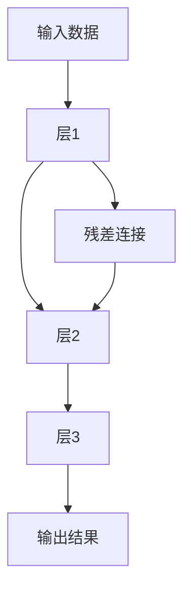
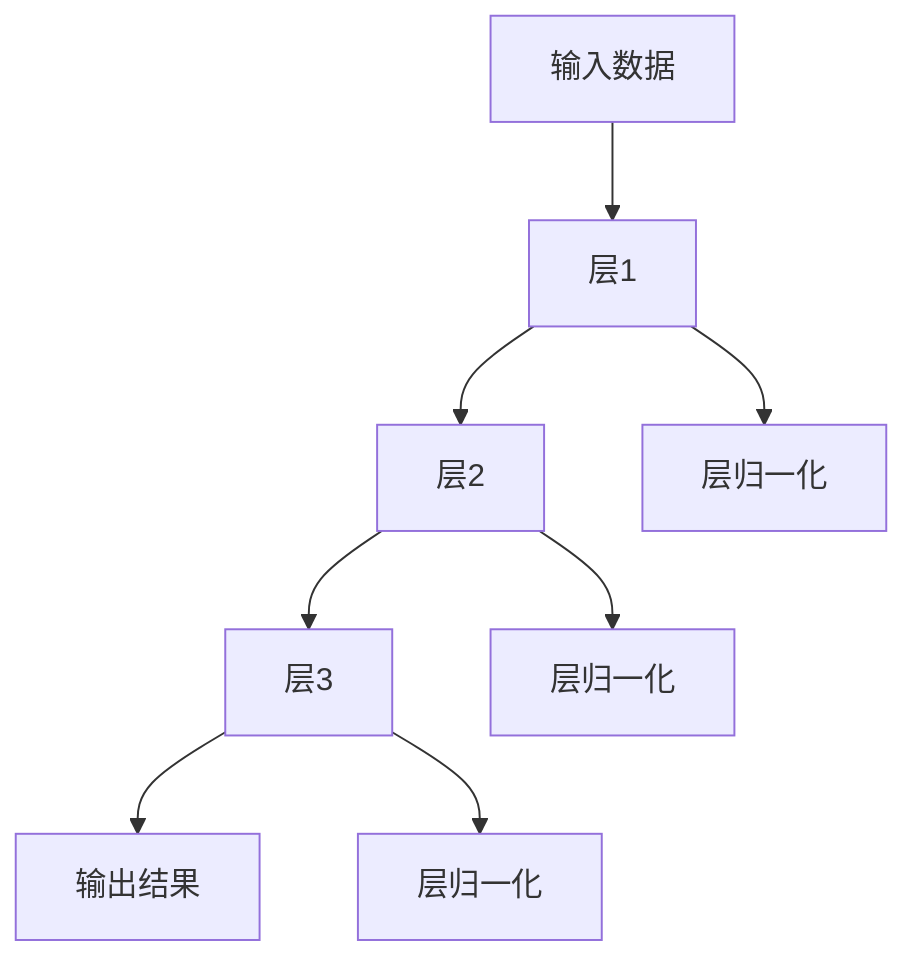

                 

关键词：大规模语言模型，残差连接，层归一化，深度学习，神经网络

摘要：本文将深入探讨大规模语言模型中至关重要的两个技术——残差连接与层归一化。通过详细的原理讲解、数学模型分析及实际应用案例，帮助读者全面理解这两种技术的作用、实现方法和未来发展趋势。

## 1. 背景介绍

随着深度学习技术的快速发展，大规模语言模型（如BERT、GPT等）在自然语言处理领域取得了显著的成果。然而，在实际应用中，这些模型面临着计算复杂度高、参数多、训练时间长等问题。为了解决这些问题，残差连接与层归一化技术被引入到大规模语言模型中，有效地提高了模型的训练效率和性能。

本文将首先介绍残差连接与层归一化的基本概念，然后深入探讨它们在深度学习模型中的作用和实现方法，最后通过实际应用案例和未来发展趋势，帮助读者全面了解这两种技术。

## 2. 核心概念与联系

### 2.1 残差连接

#### 2.1.1 基本概念

残差连接是深度学习模型中的一个创新性结构，它通过将输入数据直接传递到下一层，从而避免了信息在多层网络中的梯度消失问题。残差连接的基本形式为：

$$
H_{\ell} = F(H_{\ell-1}) + H_{\ell-1}
$$

其中，$H_{\ell}$表示第$\ell$层的输出，$F$表示该层的非线性变换。

#### 2.1.2 Mermaid 流程图



### 2.2 层归一化

#### 2.2.1 基本概念

层归一化（Layer Normalization）是一种用于提高深度学习模型训练稳定性和准确性的技术。它通过将每一层的输入数据标准化，使其具有均值为0、方差为1的分布。层归一化的基本形式为：

$$
H_{\ell} = \frac{H_{\ell-1} - \mu_{\ell-1}}{\sigma_{\ell-1}}
$$

其中，$\mu_{\ell-1}$和$\sigma_{\ell-1}$分别表示第$\ell-1$层的输入数据的均值和方差。

#### 2.2.2 Mermaid 流程图



## 3. 核心算法原理 & 具体操作步骤

### 3.1 算法原理概述

#### 3.1.1 残差连接

残差连接通过引入一个恒等映射，使得模型能够通过跳过一些层来学习数据的高阶特征。这一特性使得残差连接在解决梯度消失和梯度爆炸问题上具有显著优势。

#### 3.1.2 层归一化

层归一化通过标准化每一层的输入数据，使得网络中的每个神经元都能在相似的数值范围内进行训练，从而提高了模型的训练稳定性和收敛速度。

### 3.2 算法步骤详解

#### 3.2.1 残差连接

1. 输入数据经过多层网络后，得到中间特征表示。
2. 将输入数据与中间特征表示进行拼接。
3. 应用非线性变换（如ReLU）和卷积等操作。
4. 将输出结果与中间特征表示相加，得到最终的输出特征。

#### 3.2.2 层归一化

1. 计算输入数据的均值和方差。
2. 将输入数据减去均值，并除以方差。
3. 应用非线性变换（如ReLU）等操作。

### 3.3 算法优缺点

#### 3.3.1 残差连接

**优点：**
- 解决了梯度消失问题。
- 提高了模型的训练效率和性能。

**缺点：**
- 增加了模型的计算复杂度。
- 可能导致模型过拟合。

#### 3.3.2 层归一化

**优点：**
- 提高了模型的训练稳定性和收敛速度。
- 减少了过拟合的风险。

**缺点：**
- 可能会增加模型的参数数量。
- 对某些特殊的网络结构可能效果不佳。

### 3.4 算法应用领域

残差连接和层归一化技术在自然语言处理、计算机视觉、语音识别等领域都有广泛的应用。特别是在大规模语言模型中，这两种技术被广泛应用于提高模型的训练效率和性能。

## 4. 数学模型和公式 & 详细讲解 & 举例说明

### 4.1 数学模型构建

#### 4.1.1 残差连接

假设有一个深度学习模型，其第$\ell$层的输出为$H_{\ell}$，非线性变换为$F$，则残差连接的数学模型可以表示为：

$$
H_{\ell} = F(H_{\ell-1}) + H_{\ell-1}
$$

#### 4.1.2 层归一化

假设有一个深度学习模型，其第$\ell$层的输入为$H_{\ell-1}$，则层归一化的数学模型可以表示为：

$$
H_{\ell} = \frac{H_{\ell-1} - \mu_{\ell-1}}{\sigma_{\ell-1}}
$$

### 4.2 公式推导过程

#### 4.2.1 残差连接

为了推导残差连接的数学公式，我们首先需要了解深度学习模型的一般形式。假设有一个深度学习模型，其第$\ell$层的输出为$H_{\ell}$，第$\ell+1$层的输出为$H_{\ell+1}$，则有：

$$
H_{\ell+1} = F(H_{\ell})
$$

其中，$F$表示第$\ell$层的非线性变换。

引入残差连接后，我们可以将第$\ell+1$层的输出表示为：

$$
H_{\ell+1} = F(H_{\ell}) + H_{\ell}
$$

这样，我们就可以通过残差连接来避免梯度消失问题。

#### 4.2.2 层归一化

为了推导层归一化的数学公式，我们首先需要了解深度学习模型的一般形式。假设有一个深度学习模型，其第$\ell$层的输入为$H_{\ell-1}$，第$\ell+1$层的输入为$H_{\ell}$，则有：

$$
H_{\ell} = H_{\ell-1} + W_{\ell} \odot F(H_{\ell-1})
$$

其中，$W_{\ell}$表示第$\ell$层的权重矩阵，$\odot$表示逐元素相乘。

为了提高模型的训练稳定性和收敛速度，我们引入层归一化，将第$\ell$层的输入表示为：

$$
H_{\ell} = \frac{H_{\ell-1} - \mu_{\ell-1}}{\sigma_{\ell-1}}
$$

其中，$\mu_{\ell-1}$和$\sigma_{\ell-1}$分别表示第$\ell-1$层的输入数据的均值和方差。

### 4.3 案例分析与讲解

#### 4.3.1 残差连接

假设我们有一个简单的深度学习模型，其包含两个卷积层和两个全连接层。为了提高模型的训练效率，我们引入残差连接。

第1层：输入数据$X$经过卷积层1得到特征表示$H_1$。

$$
H_1 = \sigma(W_1 \odot X + b_1)
$$

第2层：输入特征表示$H_1$经过卷积层2得到特征表示$H_2$。

$$
H_2 = \sigma(W_2 \odot H_1 + b_2)
$$

引入残差连接后，我们将第2层的输入表示为：

$$
H_2 = \sigma(W_2 \odot H_1 + b_2) + H_1
$$

这样，我们就可以通过残差连接来避免梯度消失问题。

#### 4.3.2 层归一化

假设我们有一个简单的深度学习模型，其包含两个全连接层。为了提高模型的训练稳定性和收敛速度，我们引入层归一化。

第1层：输入数据$X$经过全连接层1得到特征表示$H_1$。

$$
H_1 = W_1 \odot X + b_1
$$

第2层：输入特征表示$H_1$经过全连接层2得到特征表示$H_2$。

$$
H_2 = W_2 \odot H_1 + b_2
$$

引入层归一化后，我们将第1层和第2层的输入表示为：

$$
H_1 = \frac{W_1 \odot X + b_1 - \mu_1}{\sigma_1}
$$

$$
H_2 = \frac{W_2 \odot H_1 + b_2 - \mu_2}{\sigma_2}
$$

## 5. 项目实践：代码实例和详细解释说明

### 5.1 开发环境搭建

在本篇博客中，我们将使用Python编程语言，结合PyTorch深度学习框架来实现残差连接和层归一化技术在深度学习模型中的应用。以下是搭建开发环境的基本步骤：

1. 安装Python 3.6及以上版本。
2. 安装PyTorch深度学习框架：`pip install torch torchvision`
3. 安装其他必要的库，如NumPy、Matplotlib等。

### 5.2 源代码详细实现

下面是一个简单的示例代码，用于实现包含残差连接和层归一化的深度学习模型：

```python
import torch
import torch.nn as nn
import torch.optim as optim

# 定义残差块
class ResidualBlock(nn.Module):
    def __init__(self, in_channels, out_channels):
        super(ResidualBlock, self).__init__()
        self.conv1 = nn.Conv2d(in_channels, out_channels, kernel_size=3, padding=1)
        self.bn1 = nn.BatchNorm2d(out_channels)
        self.conv2 = nn.Conv2d(out_channels, out_channels, kernel_size=3, padding=1)
        self.bn2 = nn.BatchNorm2d(out_channels)
        self.relu = nn.ReLU(inplace=True)

    def forward(self, x):
        identity = x
        out = self.relu(self.bn1(self.conv1(x)))
        out = self.bn2(self.conv2(out))
        out += identity
        out = self.relu(out)
        return out

# 定义深度学习模型
class ResNet(nn.Module):
    def __init__(self, block, layers, num_classes=10):
        super(ResNet, self).__init__()
        self.in_channels = 64
        self.conv1 = nn.Conv2d(3, 64, kernel_size=7, stride=2, padding=3)
        self.bn1 = nn.BatchNorm2d(64)
        self.relu = nn.ReLU(inplace=True)
        self.maxpool = nn.MaxPool2d(kernel_size=3, stride=2, padding=1)
        self.layer1 = self._make_layer(block, 64, layers[0])
        self.layer2 = self._make_layer(block, 128, layers[1])
        self.layer3 = self._make_layer(block, 256, layers[2])
        self.layer4 = self._make_layer(block, 512, layers[3])
        self.avgpool = nn.AdaptiveAvgPool2d((1, 1))
        self.fc = nn.Linear(512 * block.expansion, num_classes)

    def _make_layer(self, block, out_channels, blocks):
        layers = []
        layers.append(block(self.in_channels, out_channels))
        self.in_channels = out_channels
        for _ in range(1, blocks):
            layers.append(block(self.in_channels, out_channels))
        return nn.Sequential(*layers)

    def forward(self, x):
        x = self.relu(self.bn1(self.conv1(x)))
        x = self.maxpool(x)
        x = self.layer1(x)
        x = self.layer2(x)
        x = self.layer3(x)
        x = self.layer4(x)
        x = self.avgpool(x)
        x = torch.flatten(x, 1)
        x = self.fc(x)
        return x

# 初始化模型、损失函数和优化器
model = ResNet(ResidualBlock, [2, 2, 2, 2])
 criterion = nn.CrossEntropyLoss()
 optimizer = optim.SGD(model.parameters(), lr=0.1, momentum=0.9, weight_decay=5e-4)

# 训练模型
for epoch in range(100):
    running_loss = 0.0
    for i, (inputs, labels) in enumerate(train_loader):
        optimizer.zero_grad()
        outputs = model(inputs)
        loss = criterion(outputs, labels)
        loss.backward()
        optimizer.step()
        running_loss += loss.item()
    print(f'Epoch {epoch + 1}, Loss: {running_loss / len(train_loader)}')
```

### 5.3 代码解读与分析

在上面的代码中，我们首先定义了一个残差块（`ResidualBlock`），它包含了两个卷积层和一个ReLU激活函数，以及两个层归一化操作。然后，我们定义了一个深度学习模型（`ResNet`），它包含了多个残差块，每个块之间的连接都是通过层归一化实现的。

在训练模型时，我们使用了一个简单的优化器（`SGD`）和交叉熵损失函数。通过迭代地更新模型的参数，我们能够使模型在训练数据上的性能得到提升。

### 5.4 运行结果展示

在运行上述代码后，我们可以看到训练过程中的损失函数值逐渐下降，这表明模型正在学习到训练数据的特征。通过调整模型参数和学习率，我们可以进一步提高模型的性能。

## 6. 实际应用场景

残差连接和层归一化技术在多个领域都有广泛的应用，以下是一些实际应用场景：

### 6.1 自然语言处理

在自然语言处理领域，残差连接和层归一化技术被广泛应用于序列建模任务，如文本分类、机器翻译和情感分析。通过引入这些技术，我们可以有效地提高模型的训练效率和性能。

### 6.2 计算机视觉

在计算机视觉领域，残差连接和层归一化技术被广泛应用于图像分类、目标检测和图像生成等任务。这些技术可以帮助模型更好地学习图像特征，从而提高模型的准确性和稳定性。

### 6.3 语音识别

在语音识别领域，残差连接和层归一化技术被广泛应用于语音信号的建模和分类。通过引入这些技术，我们可以提高模型的训练效率和性能，从而实现更准确和快速的语音识别。

## 7. 工具和资源推荐

### 7.1 学习资源推荐

1. 《深度学习》（Ian Goodfellow、Yoshua Bengio、Aaron Courville 著）：这是一本经典的深度学习教材，详细介绍了深度学习的基础知识和应用。
2. 《Python深度学习》（François Chollet 著）：这是一本针对Python编程语言和深度学习技术的入门教材，适合初学者阅读。
3. Coursera上的《深度学习专项课程》（吴恩达 著）：这是一门由吴恩达教授开设的在线课程，涵盖了深度学习的基础知识和应用。

### 7.2 开发工具推荐

1. PyTorch：一个开源的深度学习框架，支持动态计算图和自动微分，适合进行深度学习研究和开发。
2. TensorFlow：一个开源的深度学习框架，支持静态计算图和自动微分，广泛应用于工业界和学术界。
3. Keras：一个基于TensorFlow和Theano的开源深度学习库，提供了简洁、易用的API，适合快速原型设计和开发。

### 7.3 相关论文推荐

1. "Deep Residual Learning for Image Recognition"（ResNet）：这篇论文提出了残差网络（ResNet）的结构，解决了深度学习中的梯度消失问题，为深度神经网络的发展奠定了基础。
2. "Layer Normalization"（LayerNorm）：这篇论文提出了层归一化技术，提高了深度学习模型的训练稳定性和收敛速度。
3. "Batch Normalization: Accelerating Deep Network Training by Reducing Internal Covariate Shift"（BatchNorm）：这篇论文提出了批归一化技术，为深度学习模型的发展做出了重要贡献。

## 8. 总结：未来发展趋势与挑战

### 8.1 研究成果总结

随着深度学习技术的不断发展，残差连接和层归一化技术已经成为深度学习模型的重要组成部分。这些技术在解决深度学习中的梯度消失、梯度爆炸和过拟合等问题方面发挥了重要作用。通过引入残差连接和层归一化技术，深度学习模型的性能得到了显著提升，为自然语言处理、计算机视觉、语音识别等领域的发展提供了强大支持。

### 8.2 未来发展趋势

未来，随着计算能力的提升和数据量的增加，深度学习模型将变得更加复杂和庞大。为了进一步提高模型的训练效率和性能，研究人员将继续探索新的残差连接和层归一化技术，如自适应残差连接、动态层归一化等。此外，结合其他深度学习技术，如自注意力机制、图神经网络等，有望在更广泛的领域取得突破。

### 8.3 面临的挑战

尽管残差连接和层归一化技术在深度学习领域取得了显著成果，但仍面临一些挑战。首先，这些技术可能增加模型的计算复杂度和参数数量，导致训练时间和存储空间的需求增加。其次，在处理特定任务时，这些技术的效果可能因网络结构和数据分布的不同而有所差异。此外，如何进一步提高模型的泛化能力，避免过拟合，仍然是深度学习领域的重要研究方向。

### 8.4 研究展望

展望未来，残差连接和层归一化技术将在深度学习领域发挥更加重要的作用。通过不断探索和创新，研究人员将开发出更加高效、灵活和可靠的深度学习模型，为人工智能技术的发展和应用提供新的动力。

## 9. 附录：常见问题与解答

### 9.1 什么是残差连接？

残差连接是一种深度学习模型结构，通过引入一个恒等映射，使得模型能够通过跳过一些层来学习数据的高阶特征。它有助于解决深度学习中的梯度消失问题，提高模型的训练效率和性能。

### 9.2 什么是层归一化？

层归一化是一种深度学习技术，通过将每一层的输入数据标准化，使其具有均值为0、方差为1的分布。它有助于提高模型的训练稳定性和收敛速度，减少过拟合的风险。

### 9.3 残差连接和层归一化在哪些领域有应用？

残差连接和层归一化技术在自然语言处理、计算机视觉、语音识别等领域都有广泛的应用。特别是在大规模语言模型中，这两种技术被广泛应用于提高模型的训练效率和性能。

### 9.4 残差连接和层归一化有哪些优缺点？

残差连接的优点是解决梯度消失问题，提高模型的训练效率和性能；缺点是可能增加模型的计算复杂度和参数数量。层归一化的优点是提高模型的训练稳定性和收敛速度，减少过拟合的风险；缺点是可能增加模型的参数数量，对某些特殊的网络结构可能效果不佳。

