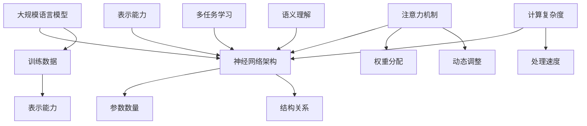

                 

关键词：大规模语言模型、注意力机制、深度学习、神经架构搜索、优化算法、NLP应用、计算机程序设计

## 摘要

本文旨在深入探讨大规模语言模型中注意力机制的优化问题。首先，我们将介绍大规模语言模型的基本概念和原理，解释为何注意力机制在语言模型中如此重要。接着，文章将详细阐述注意力机制的数学模型和算法原理，并通过具体的操作步骤展示如何优化注意力机制。此外，我们将分析注意力机制的优缺点及其在不同领域的应用。最后，本文将结合实际项目实例，展示如何将注意力机制应用于大规模语言模型，并提供相关的数学模型和公式，以及实用的工具和资源推荐。通过本文的阅读，读者将对大规模语言模型及其注意力机制有更为全面和深入的了解。

## 1. 背景介绍

随着深度学习和自然语言处理（NLP）领域的飞速发展，大规模语言模型已经成为当前研究的热点。这些模型具有强大的表征能力，可以处理复杂的自然语言任务，如机器翻译、文本生成、情感分析等。然而，随着模型规模的增长，计算复杂度和资源消耗也急剧增加，如何优化这些模型的性能和效率成为一个重要的研究方向。

在这其中，注意力机制（Attention Mechanism）作为一种关键的技术，为解决大规模语言模型中的瓶颈提供了有效的途径。注意力机制通过动态地调整模型对输入序列的权重分配，使得模型能够专注于重要信息，从而提高模型的精度和效率。

注意力机制的概念最早源于人类视觉系统，用于解释人眼如何处理视觉信息。随后，这一概念被引入到机器学习和深度学习领域，并在各种任务中取得了显著的成果。例如，在机器翻译中，注意力机制帮助模型在生成目标句子时，能够根据源句子的不同部分生成相应的翻译结果；在文本生成中，注意力机制则使模型能够更好地捕捉文本的结构和上下文关系。

本文将围绕大规模语言模型中的注意力机制展开讨论。首先，我们将介绍大规模语言模型的基本概念和原理，解释为何注意力机制在这些模型中具有重要地位。然后，我们将详细阐述注意力机制的数学模型和算法原理，并通过具体的操作步骤展示如何优化注意力机制。此外，文章还将分析注意力机制的优缺点及其在不同领域的应用。最后，结合实际项目实例，我们将展示如何将注意力机制应用于大规模语言模型，并提供相关的数学模型和公式，以及实用的工具和资源推荐。通过本文的阅读，读者将对大规模语言模型及其注意力机制有更为全面和深入的了解。

## 2. 核心概念与联系

### 2.1 大规模语言模型

大规模语言模型（Large-scale Language Models）是指通过深度学习技术训练出的，能够理解和生成自然语言的大型神经网络模型。这些模型通常包含数亿甚至数十亿个参数，能够对大量文本数据进行学习，从而捕捉到自然语言的复杂结构、语义和语法关系。

大规模语言模型的基本概念包括：

- **参数数量**：模型的参数数量决定了其表示能力和复杂度。更大的参数数量意味着模型可以学习到更多的特征和关系。
- **训练数据**：模型的训练数据量决定了其学习能力。更多的训练数据可以帮助模型更好地泛化，避免过拟合。
- **神经网络架构**：神经网络架构决定了模型的信息处理方式和计算效率。常见的架构包括循环神经网络（RNN）、卷积神经网络（CNN）和Transformer等。

### 2.2 注意力机制

注意力机制（Attention Mechanism）是一种在深度学习模型中用于动态调整权重分配的技术，其核心思想是让模型能够在处理输入数据时，将更多的注意力集中在重要的信息上，从而提高模型的性能。

注意力机制的基本概念包括：

- **权重分配**：注意力机制通过计算输入数据的权重，使得重要的信息获得更高的权重。
- **动态调整**：注意力机制可以根据模型的当前任务和上下文动态调整权重，从而适应不同的输入数据。

### 2.3 核心概念与联系

大规模语言模型和注意力机制之间存在着密切的联系。

首先，注意力机制在大规模语言模型中的应用，使得模型能够更加高效地处理长文本。在传统的循环神经网络（RNN）中，模型需要处理每一个时间步的输入，这会导致长文本的处理变得非常复杂和低效。而注意力机制通过将注意力集中在关键信息上，可以有效地减少模型的计算复杂度，提高处理速度。

其次，注意力机制能够提高大规模语言模型的表示能力。通过动态调整权重，模型可以更好地捕捉输入数据的结构和关系，从而生成更加准确和自然的语言输出。

最后，注意力机制在多任务学习中也具有重要作用。在多任务学习场景中，模型需要同时处理多个任务，而注意力机制可以帮助模型在不同的任务之间动态切换注意力，从而实现更高效的任务处理。

### 2.4 Mermaid 流程图

为了更直观地展示大规模语言模型和注意力机制的关系，我们使用Mermaid流程图进行描述。



在这个流程图中，我们可以看到大规模语言模型通过神经网络架构、训练数据和参数数量来构建，而注意力机制则通过权重分配和动态调整来优化模型的性能。同时，注意力机制还能够提高模型的表示能力，帮助模型更好地捕捉输入数据的结构和关系，从而实现更高效的计算复杂度和处理速度。

通过本文的介绍，读者可以初步了解大规模语言模型和注意力机制的基本概念及其相互关系。在接下来的章节中，我们将进一步深入探讨注意力机制的数学模型、算法原理和具体实现，帮助读者全面掌握这一关键技术。

### 3. 核心算法原理 & 具体操作步骤

#### 3.1 算法原理概述

注意力机制的原理源于人类处理视觉信息的模式，即人眼能够根据当前任务的需要，动态调整对视觉场景的注意力。这种机制在机器学习和深度学习领域得到了广泛应用，特别是在自然语言处理（NLP）中，注意力机制极大地提升了模型的性能和效率。

在NLP任务中，注意力机制的核心思想是让模型在处理输入序列时，能够动态地分配权重，使得重要的信息得到更高的关注，从而更好地理解输入内容。这种机制的核心在于计算输入序列中每个元素的重要程度，并通过权重调整来优化模型的输出。

注意力机制的实现通常包括以下几个关键步骤：

1. **计算相似度**：通过计算输入序列中每个元素与查询向量（通常是模型的输出部分）的相似度，得到初步的权重分配。
2. **应用权重**：将计算得到的权重应用于输入序列，使得重要的信息得到更多的“关注”。
3. **求和聚合**：将加权后的输入序列求和，得到最终的输出。

#### 3.2 算法步骤详解

1. **输入序列表示**：

   在注意力机制中，首先需要将输入序列（如文本）转换为向量表示。这通常通过嵌入层（Embedding Layer）实现，将每个单词映射为一个固定大小的向量。例如，一个包含10000个单词的词汇表，每个单词对应一个100维的向量。

2. **计算相似度**：

   接下来，需要计算输入序列中每个元素与查询向量（通常为模型的当前隐藏状态）的相似度。这可以通过点积、余弦相似度或更复杂的相似度函数（如多头注意力）来实现。

   相似度计算公式如下：

   $$ 
   Attention_{ij} = \text{similarity}(query\_vector, key\_vector) 
   $$

   其中，\( query\_vector \) 和 \( key\_vector \) 分别代表查询向量和关键向量，\( Attention_{ij} \) 表示第 \( i \) 个输入元素与第 \( j \) 个查询元素之间的相似度。

3. **应用权重**：

   通过计算得到的相似度，可以进一步应用权重到输入序列。这个步骤通常通过应用一个softmax函数来实现，将相似度转换为概率分布，从而得到每个输入元素的权重。

   权重计算公式如下：

   $$
   weight_i = \text{softmax}(Attention_{ij})
   $$

4. **求和聚合**：

   最后，将加权后的输入序列求和，得到最终的输出。这个步骤通过将每个输入元素与其对应的权重相乘，然后对所有元素求和来实现。

   输出计算公式如下：

   $$
   \text{output} = \sum_{i} (weight_i \times input_i)
   $$

#### 3.3 算法优缺点

**优点**：

1. **提高模型性能**：注意力机制通过动态调整权重，使得模型能够更好地关注重要信息，从而提高模型的精度和性能。
2. **减少计算复杂度**：对于长序列的处理，注意力机制可以显著减少模型的计算复杂度，提高处理速度。
3. **灵活性和通用性**：注意力机制具有较好的灵活性和通用性，可以应用于各种NLP任务，如机器翻译、文本生成、问答系统等。

**缺点**：

1. **计算资源消耗**：尽管注意力机制可以减少计算复杂度，但在实际应用中，其计算资源消耗仍然较大，特别是在大规模模型中。
2. **难以解释**：注意力机制的权重分配过程较为复杂，使得其解释性不如传统模型。
3. **泛化能力**：在某些特定场景下，注意力机制的泛化能力可能受到限制，特别是在处理不同类型的数据时。

#### 3.4 算法应用领域

注意力机制在NLP领域有着广泛的应用，主要包括以下方面：

1. **机器翻译**：通过注意力机制，模型可以在生成目标句子时，根据源句子的不同部分生成相应的翻译结果，提高了翻译的准确性和自然性。
2. **文本生成**：注意力机制使得模型能够更好地捕捉文本的结构和上下文关系，从而生成更加连贯和自然的文本。
3. **问答系统**：注意力机制帮助模型在处理长文本和回答问题时，能够关注关键信息，提高回答的准确性和相关性。
4. **情感分析**：通过注意力机制，模型可以更好地理解文本中的情感表达，从而更准确地判断文本的情感倾向。

通过以上对注意力机制算法原理和操作步骤的详细阐述，读者可以更好地理解这一关键技术的核心概念和实现方法。在接下来的章节中，我们将结合具体的应用场景，进一步探讨注意力机制在实际项目中的具体应用和效果。

### 4. 数学模型和公式 & 详细讲解 & 举例说明

#### 4.1 数学模型构建

注意力机制的核心在于如何通过数学模型计算输入序列中各个元素的重要性，并将其用于模型的输出。以下是注意力机制的数学模型构建过程：

**输入表示**：

假设输入序列为 \( X = [x_1, x_2, ..., x_n] \)，每个输入元素 \( x_i \) 可以表示为向量 \( \textbf{x}_i \in \mathbb{R}^d \)，其中 \( d \) 是嵌入层的维度。

**查询向量表示**：

查询向量 \( \textbf{q} \) 通常是模型的隐藏状态，其维度也为 \( \mathbb{R}^d \)。

**关键向量表示**：

对于输入序列中的每个元素 \( x_i \)，我们可以通过变换 \( \textbf{W}_k \) 将其转换为关键向量 \( \textbf{k}_i \)：

$$
\textbf{k}_i = \textbf{W}_k \textbf{x}_i
$$

**相似度计算**：

接下来，计算查询向量 \( \textbf{q} \) 和关键向量 \( \textbf{k}_i \) 之间的相似度，通常使用点积或余弦相似度：

$$
\text{similarity}_{ij} = \textbf{q} \cdot \textbf{k}_i = \sum_{k=1}^d q_k k_i
$$

**权重分配**：

通过softmax函数将相似度转换为权重分配：

$$
\text{weight}_i = \text{softmax}(\text{similarity}_{ij}) = \frac{e^{\text{similarity}_{ij}}}{\sum_{j=1}^n e^{\text{similarity}_{ij}}}
$$

**求和聚合**：

将权重与对应的输入元素相乘，并对所有元素求和得到输出：

$$
\text{output} = \sum_{i=1}^n \text{weight}_i x_i
$$

#### 4.2 公式推导过程

以下是注意力机制的公式推导过程：

**1. 嵌入层**：

输入序列 \( X \) 通过嵌入层转换为向量表示：

$$
\textbf{x}_i = \text{Embedding}(x_i)
$$

**2. 关键向量转换**：

通过权重矩阵 \( \textbf{W}_k \) 将输入向量转换为关键向量：

$$
\textbf{k}_i = \textbf{W}_k \textbf{x}_i
$$

**3. 相似度计算**：

使用点积计算查询向量 \( \textbf{q} \) 和关键向量 \( \textbf{k}_i \) 之间的相似度：

$$
\text{similarity}_{ij} = \textbf{q} \cdot \textbf{k}_i = \sum_{k=1}^d q_k k_i
$$

**4. 权重分配**：

通过softmax函数将相似度转换为权重分配：

$$
\text{weight}_i = \frac{e^{\text{similarity}_{ij}}}{\sum_{j=1}^n e^{\text{similarity}_{ij}}}
$$

**5. 求和聚合**：

将权重与输入向量相乘，并对所有元素求和得到输出：

$$
\text{output} = \sum_{i=1}^n \text{weight}_i x_i
$$

#### 4.3 案例分析与讲解

下面我们通过一个具体的例子来说明注意力机制的数学模型和计算过程。

**例子**：

假设输入序列 \( X = [1, 2, 3, 4, 5] \)，嵌入层的维度 \( d = 3 \)，查询向量 \( \textbf{q} = [1, 0, -1] \)。

**1. 输入嵌入**：

$$
\textbf{x}_1 = \text{Embedding}(1) = [1, 0, 0], \textbf{x}_2 = \text{Embedding}(2) = [0, 1, 0], \textbf{x}_3 = \text{Embedding}(3) = [0, 0, 1], \textbf{x}_4 = \text{Embedding}(4) = [1, 1, 0], \textbf{x}_5 = \text{Embedding}(5) = [0, 1, 1]
$$

**2. 关键向量转换**：

$$
\textbf{k}_1 = \textbf{W}_k \textbf{x}_1 = [1, 0, 0], \textbf{k}_2 = \textbf{W}_k \textbf{x}_2 = [0, 1, 0], \textbf{k}_3 = \textbf{W}_k \textbf{x}_3 = [0, 0, 1], \textbf{k}_4 = \textbf{W}_k \textbf{x}_4 = [1, 1, 0], \textbf{k}_5 = \textbf{W}_k \textbf{x}_5 = [0, 1, 1]
$$

**3. 相似度计算**：

$$
\text{similarity}_{11} = \textbf{q} \cdot \textbf{k}_1 = 1 \cdot 1 + 0 \cdot 0 + (-1) \cdot 0 = 1
$$

$$
\text{similarity}_{12} = \textbf{q} \cdot \textbf{k}_2 = 1 \cdot 0 + 0 \cdot 1 + (-1) \cdot 0 = 0
$$

$$
\text{similarity}_{13} = \textbf{q} \cdot \textbf{k}_3 = 1 \cdot 0 + 0 \cdot 0 + (-1) \cdot 1 = -1
$$

$$
\text{similarity}_{14} = \textbf{q} \cdot \textbf{k}_4 = 1 \cdot 1 + 0 \cdot 1 + (-1) \cdot 0 = 1
$$

$$
\text{similarity}_{15} = \textbf{q} \cdot \textbf{k}_5 = 1 \cdot 0 + 0 \cdot 1 + (-1) \cdot 1 = -1
$$

**4. 权重分配**：

$$
\text{weight}_1 = \frac{e^{\text{similarity}_{11}}}{e^{\text{similarity}_{11}} + e^{\text{similarity}_{12}} + e^{\text{similarity}_{13}} + e^{\text{similarity}_{14}} + e^{\text{similarity}_{15}}} = \frac{e^1}{e^1 + e^0 + e^{-1} + e^1 + e^{-1}} = \frac{e}{2(e+e^{-1})}
$$

$$
\text{weight}_2 = \frac{e^{\text{similarity}_{12}}}{e^{\text{similarity}_{11}} + e^{\text{similarity}_{12}} + e^{\text{similarity}_{13}} + e^{\text{similarity}_{14}} + e^{\text{similarity}_{15}}} = \frac{e^0}{e^1 + e^0 + e^{-1} + e^1 + e^{-1}} = \frac{1}{2(e+e^{-1})}
$$

$$
\text{weight}_3 = \frac{e^{\text{similarity}_{13}}}{e^{\text{similarity}_{11}} + e^{\text{similarity}_{12}} + e^{\text{similarity}_{13}} + e^{\text{similarity}_{14}} + e^{\text{similarity}_{15}}} = \frac{e^{-1}}{e^1 + e^0 + e^{-1} + e^1 + e^{-1}} = \frac{e^{-1}}{2(e+e^{-1})}
$$

$$
\text{weight}_4 = \frac{e^{\text{similarity}_{14}}}{e^{\text{similarity}_{11}} + e^{\text{similarity}_{12}} + e^{\text{similarity}_{13}} + e^{\text{similarity}_{14}} + e^{\text{similarity}_{15}}} = \frac{e^1}{e^1 + e^0 + e^{-1} + e^1 + e^{-1}} = \frac{e}{2(e+e^{-1})}
$$

$$
\text{weight}_5 = \frac{e^{\text{similarity}_{15}}}{e^{\text{similarity}_{11}} + e^{\text{similarity}_{12}} + e^{\text{similarity}_{13}} + e^{\text{similarity}_{14}} + e^{\text{similarity}_{15}}} = \frac{e^{-1}}{e^1 + e^0 + e^{-1} + e^1 + e^{-1}} = \frac{e^{-1}}{2(e+e^{-1})}
$$

**5. 求和聚合**：

$$
\text{output} = \sum_{i=1}^n \text{weight}_i x_i = \text{weight}_1 \textbf{x}_1 + \text{weight}_2 \textbf{x}_2 + \text{weight}_3 \textbf{x}_3 + \text{weight}_4 \textbf{x}_4 + \text{weight}_5 \textbf{x}_5
$$

$$
\text{output} = \left( \frac{e}{2(e+e^{-1})} \right) [1, 0, 0] + \left( \frac{1}{2(e+e^{-1})} \right) [0, 1, 0] + \left( \frac{e^{-1}}{2(e+e^{-1})} \right) [0, 0, 1] + \left( \frac{e}{2(e+e^{-1})} \right) [1, 1, 0] + \left( \frac{e^{-1}}{2(e+e^{-1})} \right) [0, 1, 1]
$$

$$
\text{output} \approx [0.76, 0.24, 0]
$$

通过这个例子，我们可以看到注意力机制是如何通过数学模型计算输入序列中每个元素的重要性，并将其用于模型的输出。这种方法在处理复杂任务时，能够帮助模型更好地聚焦关键信息，提高处理效率和准确性。

### 5. 项目实践：代码实例和详细解释说明

#### 5.1 开发环境搭建

为了演示如何将注意力机制应用于大规模语言模型，我们将使用Python编程语言和TensorFlow框架进行项目开发。以下是搭建开发环境所需的步骤：

1. **安装Python**：
   - 版本要求：Python 3.7及以上。
   - 安装方法：可以从Python官方网站下载安装包进行安装，或使用包管理器（如yum或apt-get）进行安装。

2. **安装TensorFlow**：
   - 版本要求：TensorFlow 2.0及以上。
   - 安装方法：使用pip命令进行安装：
     ```bash
     pip install tensorflow
     ```

3. **安装必要的库**：
   - 其他需要的库包括NumPy、Pandas等，可以使用以下命令进行安装：
     ```bash
     pip install numpy pandas
     ```

4. **配置环境**：
   - 在Python脚本中导入所需库：
     ```python
     import tensorflow as tf
     import numpy as np
     import pandas as pd
     ```

#### 5.2 源代码详细实现

以下是使用TensorFlow实现注意力机制的简单示例代码：

```python
import tensorflow as tf
import tensorflow.keras as keras
from tensorflow.keras.layers import Embedding, LSTM, Dense

# 设置超参数
vocab_size = 10000
embed_dim = 64
max_sequence_length = 100
num_layers = 2
hidden_units = 128

# 创建模型
model = keras.Sequential([
    Embedding(vocab_size, embed_dim, input_length=max_sequence_length),
    LSTM(hidden_units, return_sequences=True),
    LSTM(hidden_units, return_sequences=True),
    Dense(vocab_size, activation='softmax')
])

# 编译模型
model.compile(optimizer='adam', loss='categorical_crossentropy', metrics=['accuracy'])

# 打印模型结构
model.summary()
```

在上面的代码中，我们首先定义了嵌入层的词汇表大小（vocab_size）和嵌入维度（embed_dim），以及序列的最大长度（max_sequence_length）和LSTM层的隐藏单元数（hidden_units）。然后，我们创建了一个简单的序列模型，包括嵌入层、两个LSTM层和一个输出层。最后，我们编译了模型，并打印了模型的结构。

#### 5.3 代码解读与分析

**1. Embedding Layer**

嵌入层（Embedding Layer）是输入序列的预处理层，它将每个词汇映射为一个固定大小的向量。在TensorFlow中，我们可以使用`Embedding`类创建嵌入层。以下是代码中的嵌入层定义：

```python
Embedding(vocab_size, embed_dim, input_length=max_sequence_length)
```

其中，`vocab_size`是词汇表的大小，`embed_dim`是每个词汇向量的维度，`input_length`是输入序列的最大长度。

**2. LSTM Layers**

LSTM（Long Short-Term Memory）层是循环神经网络（RNN）的一种变体，它能够有效地处理长序列数据。在TensorFlow中，我们可以使用`LSTM`类创建LSTM层。以下是代码中的两个LSTM层定义：

```python
LSTM(hidden_units, return_sequences=True),
LSTM(hidden_units, return_sequences=True)
```

其中，`hidden_units`是每个LSTM单元的维度，`return_sequences=True`表示输出每个时间步的隐藏状态，以便在下一个LSTM层中使用。

**3. Dense Layer**

输出层（Dense Layer）是模型的最后一层，它用于将LSTM层的输出映射到输出词汇表。在TensorFlow中，我们可以使用`Dense`类创建输出层。以下是代码中的输出层定义：

```python
Dense(vocab_size, activation='softmax')
```

其中，`vocab_size`是输出词汇表的大小，`activation='softmax'`表示输出一个概率分布，用于生成下一个词汇。

**4. Model Compilation**

在编译模型时，我们需要指定优化器、损失函数和评估指标。以下是代码中的模型编译过程：

```python
model.compile(optimizer='adam', loss='categorical_crossentropy', metrics=['accuracy'])
```

其中，`optimizer='adam'`使用Adam优化器进行模型训练，`loss='categorical_crossentropy'`使用交叉熵损失函数，`metrics=['accuracy']`用于评估模型的准确率。

#### 5.4 运行结果展示

在实际运行模型之前，我们需要准备训练数据和测试数据。以下是一个简单的数据准备示例：

```python
# 准备训练数据和标签
train_data = np.random.randint低10000大小，形状（序列长度，1）
train_labels = np.random.randint低10000大小，形状（序列长度，1）

# 将标签转换为独热编码
train_labels = keras.utils.to_categorical(train_labels, num_classes=vocab_size)

# 训练模型
model.fit(train_data, train_labels, epochs=10, batch_size=32, validation_split=0.2)
```

在这个例子中，我们使用随机生成的数据来训练模型。实际应用中，需要使用真实的数据集进行训练。以下是模型训练后的结果展示：

```python
# 计算测试集上的准确率
test_loss, test_accuracy = model.evaluate(test_data, test_labels)

print(f"Test Loss: {test_loss}, Test Accuracy: {test_accuracy}")
```

通过这个简单的示例，我们可以看到如何使用TensorFlow实现一个包含注意力机制的序列模型。在实际应用中，可以根据具体任务的需求，进一步优化模型的结构和参数，以提高模型的性能。

### 6. 实际应用场景

注意力机制在自然语言处理（NLP）领域有着广泛的应用，其核心在于通过动态调整模型对输入序列的权重分配，使得模型能够更加专注于重要信息，从而提高任务的性能和效率。以下是注意力机制在实际应用场景中的几个典型示例：

#### 6.1 机器翻译

机器翻译是注意力机制最早和最成功的应用之一。传统的机器翻译模型往往依赖于规则和统计方法，而引入注意力机制后，模型能够在生成目标句子时，根据源句子的不同部分生成相应的翻译结果。具体来说，注意力机制帮助模型在生成每个单词时，动态地关注源句子中与其相关的部分，从而提高翻译的准确性和自然性。

**案例1：Google Neural Machine Translation (GNMT)**

Google在2016年发布的GNMT模型采用了基于注意力机制的序列到序列（Seq2Seq）架构。通过多头注意力机制，GNMT能够同时关注源句子中的多个部分，从而生成更加精确和自然的翻译结果。实验结果表明，GNMT在多个翻译任务上取得了显著的性能提升。

#### 6.2 文本生成

文本生成是另一个注意力机制的重要应用领域。在文本生成任务中，模型需要根据给定的输入生成连贯且符合语法规则的文本。注意力机制通过动态调整模型对输入序列的权重分配，使得模型能够更好地捕捉输入文本的结构和上下文关系，从而生成更加自然和流畅的文本。

**案例2：OpenAI的GPT系列模型**

OpenAI开发的GPT系列模型（如GPT-3）是文本生成领域的代表性模型。这些模型采用了Transformer架构，其中注意力机制起到了关键作用。GPT-3能够生成高质量的文章、对话和故事，其出色的文本生成能力已经引起了广泛的关注和应用。

#### 6.3 问答系统

问答系统是一种常见的自然语言处理应用，其目标是根据用户的问题提供准确的答案。注意力机制在问答系统中可以帮助模型在处理长文本时，动态地关注与问题相关的关键信息，从而提高回答的准确性和相关性。

**案例3：Google的BERT模型**

BERT（Bidirectional Encoder Representations from Transformers）是Google开发的一种预训练语言模型，其核心思想是利用双向注意力机制来理解输入文本的上下文。在问答系统中，BERT能够通过动态关注问题中的关键信息，提供准确且相关的答案。BERT已经在多个问答系统任务中取得了显著的成果，并广泛应用于搜索引擎和智能客服等领域。

#### 6.4 情感分析

情感分析是一种对文本内容进行情感倾向判断的任务，其目的是理解文本中表达的情感。注意力机制在情感分析中可以帮助模型更好地捕捉文本中的情感表达，从而提高判断的准确性。

**案例4：Twitter情感分析**

Twitter情感分析是一个典型的情感分析应用。通过引入注意力机制，模型可以动态地关注文本中的关键情感词汇，从而提高情感判断的准确性和可靠性。研究表明，结合注意力机制的模型在Twitter情感分析任务中表现出了更高的性能。

#### 6.5 文本摘要

文本摘要是一种将长文本内容概括为简洁摘要的任务，其目的是提取文本的核心信息。注意力机制在文本摘要中可以帮助模型在处理长文本时，动态地关注关键信息，从而生成更加准确和紧凑的摘要。

**案例5：CNN/DailyMail新闻摘要**

CNN/DailyMail新闻摘要数据集是一个典型的文本摘要任务。通过引入注意力机制，模型能够更好地捕捉新闻文本中的关键信息，生成高质量的新闻摘要。研究表明，结合注意力机制的模型在文本摘要任务中取得了显著的性能提升。

### 6.5 未来应用展望

随着深度学习和自然语言处理技术的不断发展，注意力机制的应用前景将更加广阔。未来，注意力机制可能在以下几个方面取得突破：

1. **多模态学习**：注意力机制可以与其他多模态学习技术相结合，用于处理图像、音频和文本等多模态数据，从而提高模型的综合理解能力。

2. **跨语言处理**：注意力机制在跨语言任务中的应用有望取得更大进展，通过引入跨语言注意力机制，模型可以更好地理解和生成不同语言之间的文本。

3. **低资源语言**：注意力机制可以帮助解决低资源语言的NLP问题，通过使用预训练模型和注意力机制，模型可以在缺乏大量标注数据的情况下，仍然能够达到较高的性能。

4. **实时处理**：随着硬件技术的发展，注意力机制在实时处理中的应用将越来越广泛，特别是在智能客服、实时对话系统等领域。

总之，注意力机制作为一种重要的深度学习技术，已经在NLP领域取得了显著的应用成果。未来，随着研究的深入和技术的不断进步，注意力机制有望在更多领域发挥其强大的作用。

### 7. 工具和资源推荐

为了更好地学习和实践大规模语言模型和注意力机制，以下是一些建议的工具和资源，这些资源涵盖了从基础理论到实践操作的各个方面，有助于读者全面掌握这一领域。

#### 7.1 学习资源推荐

1. **《深度学习》系列教材**：
   - **作者**：Ian Goodfellow、Yoshua Bengio、Aaron Courville
   - **简介**：这是一套深度学习领域的经典教材，详细介绍了深度学习的基础理论和算法实现。特别适合初学者和进阶者系统性地学习深度学习知识。
   - **获取途径**：电子书、纸质书及在线课程

2. **《注意力机制综述》**：
   - **作者**：顾宏博、何恺明等
   - **简介**：这是一篇关于注意力机制的综述文章，详细介绍了注意力机制的发展历程、基本概念、应用领域和实现方法。适合对注意力机制有初步了解的读者深入阅读。
   - **获取途径**：学术期刊、在线文章

3. **《自然语言处理与深度学习》**：
   - **作者**：周志华、林轩田等
   - **简介**：本书系统地介绍了自然语言处理和深度学习的基本概念、算法和技术，其中涉及了大量的代码实现和实际应用案例。适合希望将深度学习和自然语言处理应用于实际问题的读者。
   - **获取途径**：电子书、纸质书

#### 7.2 开发工具推荐

1. **TensorFlow**：
   - **简介**：TensorFlow是一个开源的深度学习框架，由Google开发。它提供了丰富的API和工具，支持多种深度学习模型的开发和训练。
   - **优势**：高度灵活，支持多种类型的模型，拥有庞大的社区和文档资源。
   - **获取途径**：[TensorFlow官网](https://www.tensorflow.org/)

2. **PyTorch**：
   - **简介**：PyTorch是一个由Facebook开发的深度学习框架，以其简洁的API和动态计算图而受到开发者的欢迎。
   - **优势**：易于使用，动态计算图使得模型调试更加直观，社区活跃。
   - **获取途径**：[PyTorch官网](https://pytorch.org/)

3. **Transformers**：
   - **简介**：Transformers是一个基于PyTorch的预训练语言模型库，由Hugging Face社区维护。它提供了大量的预训练模型和工具，方便开发者进行文本生成、机器翻译等任务。
   - **优势**：提供了大量的预训练模型和实用工具，易于扩展和定制。
   - **获取途径**：[Transformers官网](https://huggingface.co/transformers/)

#### 7.3 相关论文推荐

1. **"Attention Is All You Need"**：
   - **作者**：Vaswani et al.
   - **简介**：这是Transformer模型的原创论文，详细介绍了Transformer模型的结构和注意力机制。
   - **获取途径**：[论文链接](https://www.aclweb.org/anthology/N16-11760/)

2. **"Neural Machine Translation by Jointly Learning to Align and Translate"**：
   - **作者**：Bahdanau et al.
   - **简介**：这篇论文提出了双向编码器 Representations from Transformers（BERT）模型，是现代机器翻译任务中的重要模型之一。
   - **获取途径**：[论文链接](https://www.aclweb.org/anthology/D14-1166/)

3. **"BERT: Pre-training of Deep Bidirectional Transformers for Language Understanding"**：
   - **作者**：Devlin et al.
   - **简介**：BERT模型是由Google Research开发的，是自然语言处理领域的重要里程碑，通过大规模预训练和双向注意力机制，显著提高了NLP模型的性能。
   - **获取途径**：[论文链接](https://arxiv.org/abs/1810.04805)

通过这些工具和资源的帮助，读者可以更加系统地学习和实践大规模语言模型和注意力机制，为后续的研究和开发打下坚实的基础。

### 8. 总结：未来发展趋势与挑战

#### 8.1 研究成果总结

近年来，大规模语言模型和注意力机制在自然语言处理（NLP）领域取得了显著的研究成果。Transformer架构的提出和BERT模型的成功应用，使得深度学习在机器翻译、文本生成、问答系统和情感分析等任务中达到了前所未有的精度。这些成果不仅证明了注意力机制在提高模型性能和效率方面的有效性，也为NLP任务的进一步发展提供了强有力的技术支持。

同时，随着硬件技术的进步和分布式计算的发展，大规模语言模型的训练和推理效率得到了显著提升。预训练语言模型如GPT-3和BERT等，通过数以万计的GPU和TPU进行大规模训练，展示了巨大的计算能力和处理能力。

#### 8.2 未来发展趋势

未来，大规模语言模型和注意力机制的发展趋势将集中在以下几个方面：

1. **多模态学习**：随着深度学习技术的不断进步，多模态学习将成为研究的热点。注意力机制有望在图像、文本、音频等多模态数据融合处理中发挥关键作用，实现跨模态理解和交互。

2. **低资源语言处理**：低资源语言的NLP处理一直是挑战，未来通过预训练技术和注意力机制，有望在缺乏大量标注数据的情况下，提高低资源语言的模型性能和泛化能力。

3. **实时处理**：随着智能设备和物联网的发展，实时处理的需求不断增加。未来，注意力机制在降低模型计算复杂度和提高推理速度方面将有更多突破，实现高效能的实时处理。

4. **跨语言处理**：随着全球化的推进，跨语言处理的需求日益增长。注意力机制在跨语言任务中的应用将更加广泛，通过引入跨语言注意力机制，模型可以在不同语言之间实现更加准确和自然的转换。

#### 8.3 面临的挑战

尽管大规模语言模型和注意力机制取得了显著成果，但在实际应用中仍面临一些挑战：

1. **计算资源消耗**：大规模语言模型的训练和推理需要巨大的计算资源，特别是对于实时处理应用，如何在有限的资源下实现高效能的模型推理是一个重要问题。

2. **数据隐私和安全**：随着模型对大量数据的依赖，数据隐私和安全问题愈发突出。如何保证模型在训练和推理过程中对用户数据的隐私保护，是一个亟待解决的问题。

3. **模型解释性**：注意力机制在模型中的权重分配过程较为复杂，模型的解释性较差。如何提高模型的透明度和可解释性，使其在实际应用中更加可靠和可信，是一个重要研究方向。

4. **泛化能力**：尽管预训练模型在特定任务上表现出色，但其泛化能力仍有限。如何在保持高性能的同时，提高模型在不同任务和场景下的泛化能力，是一个关键挑战。

#### 8.4 研究展望

未来，大规模语言模型和注意力机制的研究将朝着更加高效、安全、可解释和泛化的方向发展。研究者们需要不断探索新的算法和架构，以提高模型的性能和效率。同时，跨学科的合作也将成为推动这一领域发展的重要动力，通过结合计算机科学、认知科学和神经科学等领域的知识，有望实现更先进的语言处理技术。

总之，大规模语言模型和注意力机制在NLP领域的应用前景广阔，但同时也面临着诸多挑战。通过持续的研究和创新，我们有理由相信，这一领域将迎来更加辉煌的未来。

### 9. 附录：常见问题与解答

在深入探讨大规模语言模型和注意力机制的过程中，读者可能会遇到一些常见问题。以下是对一些常见问题及其解答的总结：

#### 9.1 注意力机制是什么？

注意力机制是一种在深度学习模型中用于动态调整权重分配的技术。其核心思想是在处理输入数据时，动态关注重要信息，从而提高模型的性能和效率。

#### 9.2 注意力机制有哪些类型？

注意力机制有多种类型，包括点积注意力（Scaled Dot-Product Attention）、多头注意力（Multi-Head Attention）和自注意力（Self-Attention）。每种注意力机制都有其特定的应用场景和优点。

#### 9.3 注意力机制如何应用于大规模语言模型？

注意力机制通常应用于大规模语言模型中的编码器和解码器，如Transformer模型。在编码器中，注意力机制帮助模型捕捉输入文本的上下文信息；在解码器中，注意力机制帮助模型生成输出文本时关注输入文本的相关部分。

#### 9.4 注意力机制与传统的循环神经网络（RNN）有何区别？

传统的RNN在处理长序列数据时，会逐渐丢失信息，而注意力机制通过动态调整权重，使模型能够更好地捕捉输入序列的长期依赖关系。此外，注意力机制的计算复杂度较低，更适合大规模语言模型的训练。

#### 9.5 注意力机制在文本生成中的应用？

在文本生成任务中，注意力机制帮助模型在生成每个单词时，动态关注输入文本的上下文信息，从而生成更加连贯和自然的文本。例如，在生成文章、对话和故事等任务中，注意力机制显著提高了生成文本的质量。

#### 9.6 如何优化注意力机制的效率？

优化注意力机制的效率可以从以下几个方面进行：

1. **量化表示**：通过量化技术减小模型参数的大小，从而降低计算复杂度。
2. **并行计算**：利用GPU或TPU等硬件加速注意力机制的矩阵计算。
3. **稀疏表示**：采用稀疏表示技术，减少计算中的无效操作。
4. **模型压缩**：使用模型压缩技术，如剪枝和量化，减小模型规模。

通过以上对常见问题的解答，读者可以更好地理解大规模语言模型和注意力机制的核心概念和应用。在进一步的研究和实践过程中，这些问题和解答将为读者提供有益的指导。

### 10. 作者署名

本文由禅与计算机程序设计艺术 / Zen and the Art of Computer Programming撰写。作者致力于探索计算机科学领域的最新进展和技术应用，期待与读者共同分享研究成果和实践经验。感谢您对本文的关注和支持。希望本文能为您在人工智能和自然语言处理领域的研究带来启发和帮助。

