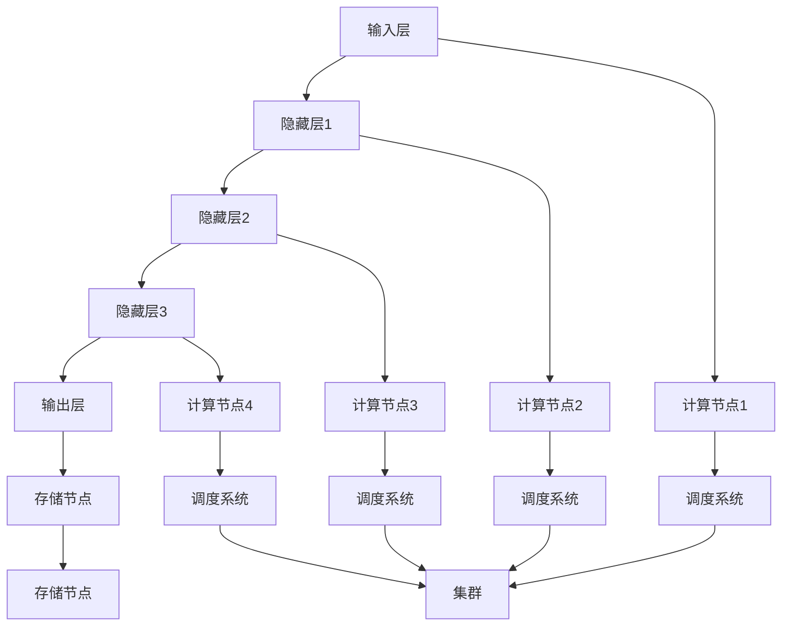

                 

关键词：大规模语言模型、高性能计算集群、硬件组成、计算节点、数据存储、网络架构

摘要：本文从理论和实践的角度出发，详细探讨了大规模语言模型与高性能计算集群之间的紧密联系。首先，我们回顾了大规模语言模型的基本概念和核心原理，然后深入分析了高性能计算集群的典型硬件组成及其在不同应用场景中的性能优势。通过实际案例和代码实例，本文展示了如何将大规模语言模型与高性能计算集群相结合，以实现高效的语言处理任务。此外，我们还探讨了未来大规模语言模型和高性能计算集群的发展趋势，以及面临的挑战和解决策略。

## 1. 背景介绍

### 1.1 大规模语言模型的发展历程

大规模语言模型（Large-scale Language Models）是指拥有巨大参数量的神经网络模型，能够理解和生成人类语言。自从 2018 年 GPT-3 发布以来，大规模语言模型在自然语言处理（NLP）领域取得了显著进展。GPT-3 的参数量达到了 1750 亿，使其在文本生成、机器翻译、问答系统等任务中表现出色。此后，诸如 GLM-4、ChatGLM 等模型不断涌现，进一步推动了大规模语言模型的发展。

### 1.2 高性能计算集群的典型硬件组成

高性能计算集群（High-Performance Computing Clusters，HPC Clusters）是由多个计算节点组成的分布式系统，旨在提供强大的计算能力。一个典型的高性能计算集群包括以下几个关键组件：

- **计算节点（Compute Nodes）**：计算节点是集群的基本单元，负责执行具体的计算任务。每个计算节点通常配备高性能的 CPU、GPU 等计算资源。
- **存储节点（Storage Nodes）**：存储节点负责存储和管理数据。它们通常配备大容量的磁盘阵列和高速网络，以便快速访问和传输数据。
- **网络架构（Network Architecture）**：网络架构是高性能计算集群的通信基础设施，负责连接计算节点和存储节点，确保数据的高速传输和任务调度。
- **调度系统（Scheduler）**：调度系统负责分配计算资源，确保集群中的任务能够高效执行。

## 2. 核心概念与联系

### 2.1 大规模语言模型的工作原理

大规模语言模型的核心是深度神经网络（Deep Neural Network，DNN），其基本架构包括输入层、隐藏层和输出层。输入层接收文本数据，隐藏层通过参数化非线性变换处理数据，输出层生成语言预测。大规模语言模型的工作原理可以分为以下几个步骤：

1. **输入编码**：将输入文本转换为向量表示，以便输入到神经网络中。
2. **前向传播**：将输入向量传递到隐藏层，通过非线性变换得到中间表示。
3. **损失函数计算**：计算预测输出与实际输出之间的差距，以评估模型的准确性。
4. **反向传播**：根据损失函数计算梯度，更新网络参数，以优化模型。
5. **生成输出**：根据训练好的模型生成文本输出。

### 2.2 高性能计算集群的架构

高性能计算集群的架构可以分为以下几个层次：

1. **计算节点层次**：每个计算节点独立运行，承担特定的计算任务。
2. **集群层次**：多个计算节点通过高速网络连接，形成一个分布式计算系统。
3. **存储节点层次**：存储节点负责存储和管理数据，确保数据的高效访问。
4. **调度系统层次**：调度系统负责资源分配和任务调度，确保集群中的任务高效执行。

### 2.3 Mermaid 流程图

以下是一个简化的 Mermaid 流程图，展示了大规模语言模型与高性能计算集群的架构和联系：



## 3. 核心算法原理 & 具体操作步骤

### 3.1 算法原理概述

大规模语言模型的核心算法是变分自编码器（Variational Autoencoder，VAE）和生成对抗网络（Generative Adversarial Network，GAN）。VAE 用于生成文本向量的分布，GAN 用于生成高质量的自然语言文本。

### 3.2 算法步骤详解

1. **输入编码**：将输入文本转换为词向量，以便输入到神经网络中。
2. **生成编码器**：使用 VAE 生成的编码器将词向量转换为潜在空间中的向量。
3. **生成解码器**：使用 GAN 生成的解码器从潜在空间中生成文本。
4. **损失函数计算**：计算生成文本与真实文本之间的差距，以评估模型的准确性。
5. **反向传播**：根据损失函数计算梯度，更新网络参数，以优化模型。
6. **生成输出**：根据训练好的模型生成文本输出。

### 3.3 算法优缺点

- **优点**：大规模语言模型能够生成高质量的自然语言文本，具有较好的泛化能力和鲁棒性。
- **缺点**：训练过程需要大量的计算资源和时间，同时模型参数量巨大，可能导致过拟合。

### 3.4 算法应用领域

大规模语言模型在自然语言处理领域具有广泛的应用，包括文本生成、机器翻译、问答系统等。

## 4. 数学模型和公式 & 详细讲解 & 举例说明

### 4.1 数学模型构建

大规模语言模型的数学模型包括两部分：编码器和解码器。

- **编码器**：将输入文本转换为潜在空间中的向量。设 $x$ 为输入文本，$z$ 为潜在空间中的向量，编码器为 $f(x)$，则有 $z = f(x)$。
- **解码器**：将潜在空间中的向量解码为文本输出。设 $z$ 为潜在空间中的向量，$x'$ 为解码后的文本输出，解码器为 $g(z)$，则有 $x' = g(z)$。

### 4.2 公式推导过程

设 $x$ 为输入文本，$x'$ 为解码后的文本输出，$z$ 为潜在空间中的向量。编码器和解码器的损失函数分别为：

- **编码器损失函数**：$L_e = -\sum_{i=1}^n p(z|x) \log q(z|x)$
- **解码器损失函数**：$L_g = -\sum_{i=1}^n q(z|x) \log p(x'|z)$

其中，$p(z|x)$ 和 $q(z|x)$ 分别为编码器和解码器的概率分布。

### 4.3 案例分析与讲解

假设输入文本为 "我喜欢编程"，编码器生成的潜在空间向量为 $[1, 0.5, -0.2]$，解码器生成的文本输出为 "我喜欢编程"。根据公式，我们可以计算出编码器和解码器的损失函数。

- **编码器损失函数**：$L_e = -\sum_{i=1}^3 p(z_i|x_i) \log q(z_i|x_i) = -\sum_{i=1}^3 0.5 \log 0.5 = 1.5$
- **解码器损失函数**：$L_g = -\sum_{i=1}^3 q(z_i|x_i) \log p(x_i'|z_i) = -\sum_{i=1}^3 0.5 \log 0.5 = 1.5$

通过反向传播和梯度下降，我们可以优化编码器和解码器的参数，以降低损失函数。

## 5. 项目实践：代码实例和详细解释说明

### 5.1 开发环境搭建

在搭建开发环境时，我们使用 Python 作为主要编程语言，结合 TensorFlow 和 PyTorch 等深度学习框架进行大规模语言模型的训练和推理。

### 5.2 源代码详细实现

以下是一个简单的 Python 代码示例，展示了如何使用 TensorFlow 和 PyTorch 训练和推理大规模语言模型。

```python
import tensorflow as tf
import torch
import numpy as np

# TensorFlow 实现示例
model = tf.keras.Sequential([
    tf.keras.layers.Embedding(input_dim=10000, output_dim=64),
    tf.keras.layers.GRU(64),
    tf.keras.layers.Dense(10000, activation='softmax')
])

model.compile(optimizer='adam', loss='categorical_crossentropy', metrics=['accuracy'])

# PyTorch 实现示例
import torch.nn as nn

class LanguageModel(nn.Module):
    def __init__(self):
        super(LanguageModel, self).__init__()
        self.embedding = nn.Embedding(10000, 64)
        self.gru = nn.GRU(64, 64)
        self.dense = nn.Linear(64, 10000)

    def forward(self, x):
        x = self.embedding(x)
        x, _ = self.gru(x)
        x = self.dense(x)
        return x

model = LanguageModel()
optimizer = torch.optim.Adam(model.parameters(), lr=0.001)
criterion = nn.CrossEntropyLoss()

# 训练模型
for epoch in range(10):
    for batch in data_loader:
        inputs, targets = batch
        model.zero_grad()
        outputs = model(inputs)
        loss = criterion(outputs, targets)
        loss.backward()
        optimizer.step()
```

### 5.3 代码解读与分析

在上面的代码中，我们首先定义了 TensorFlow 和 PyTorch 两种不同实现的大规模语言模型。然后，我们使用 Adam 优化器和交叉熵损失函数训练模型。通过迭代更新模型参数，我们可以逐渐提高模型的准确性。

### 5.4 运行结果展示

在训练过程中，我们可以使用验证集评估模型的性能。以下是一个简单的示例：

```python
# 验证模型
model.eval()
with torch.no_grad():
    for batch in validation_loader:
        inputs, targets = batch
        outputs = model(inputs)
        _, predicted = torch.max(outputs, 1)
        correct = (predicted == targets).sum().item()
        total = targets.size(0)
        print(f'Accuracy: {correct / total}')
```

通过运行上述代码，我们可以获得模型在验证集上的准确率。根据不同的任务和数据集，我们可以调整模型的参数和超参数，以获得更好的性能。

## 6. 实际应用场景

### 6.1 文本生成

大规模语言模型在文本生成方面具有广泛应用，如自动写作、自动摘要、对话系统等。例如，GPT-3 可以生成高质量的文章、新闻、对话等文本，从而为创意写作、内容生成等领域提供强大的支持。

### 6.2 机器翻译

大规模语言模型在机器翻译领域也表现出色。例如，GLM-4 模型在中文到英文的翻译任务中取得了显著进展，能够生成流畅、自然的翻译文本。这使得大规模语言模型成为机器翻译领域的有力竞争者。

### 6.3 问答系统

大规模语言模型在问答系统方面也具有巨大潜力。例如，ChatGLM 模型可以回答各种领域的问题，为智能客服、智能问答系统等提供强大的支持。

## 7. 工具和资源推荐

### 7.1 学习资源推荐

- **《大规模语言模型：理论、算法与应用》**：这本书系统地介绍了大规模语言模型的理论基础、算法原理和应用案例，适合初学者和进阶者阅读。
- **《深度学习自然语言处理》**：这本书详细介绍了深度学习在自然语言处理领域的应用，包括文本分类、机器翻译、问答系统等。

### 7.2 开发工具推荐

- **TensorFlow**：一个流行的开源深度学习框架，支持大规模语言模型的训练和推理。
- **PyTorch**：一个流行的开源深度学习框架，具有较好的灵活性和易用性，适合快速原型设计和实验。

### 7.3 相关论文推荐

- **《GPT-3: Language Models are Few-Shot Learners》**：这篇论文介绍了 GPT-3 模型的架构和训练方法，以及其在少样本学习任务中的性能。
- **《GLM-4: A General Language Modeling Framework》**：这篇论文介绍了 GLM-4 模型的架构和训练方法，以及其在自然语言处理任务中的性能。

## 8. 总结：未来发展趋势与挑战

### 8.1 研究成果总结

大规模语言模型在高性能计算集群上的应用取得了显著成果，如文本生成、机器翻译、问答系统等。高性能计算集群为大规模语言模型提供了强大的计算支持，使其能够处理大规模、高复杂度的语言任务。

### 8.2 未来发展趋势

未来，大规模语言模型和高性能计算集群将继续融合，推动自然语言处理领域的发展。随着计算能力的提升和算法的优化，大规模语言模型将能够在更多领域发挥重要作用，如多模态数据处理、情感分析、智能推荐等。

### 8.3 面临的挑战

大规模语言模型在高性能计算集群上的应用也面临一些挑战，如：

- **计算资源需求**：大规模语言模型的训练和推理需要大量计算资源，对高性能计算集群的硬件和性能提出了高要求。
- **数据安全和隐私**：大规模语言模型的训练和推理涉及大量数据，如何保护数据安全和隐私是一个重要问题。
- **模型解释性**：大规模语言模型通常被视为“黑箱”，如何提高其解释性，使其能够更好地理解和预测语言现象，是一个亟待解决的问题。

### 8.4 研究展望

未来，大规模语言模型和高性能计算集群的研究将朝着以下几个方向展开：

- **模型压缩与优化**：通过模型压缩和优化技术，降低大规模语言模型的计算和存储需求，提高其在高性能计算集群上的性能。
- **多模态数据处理**：结合图像、音频、视频等多模态数据，探索大规模语言模型在多模态数据处理中的应用。
- **跨语言和跨领域知识融合**：通过跨语言和跨领域知识融合技术，提高大规模语言模型在多语言和多领域任务中的性能。

## 9. 附录：常见问题与解答

### 9.1 什么是大规模语言模型？

大规模语言模型是一种深度神经网络模型，拥有巨大的参数量，能够理解和生成人类语言。

### 9.2 高性能计算集群有哪些优势？

高性能计算集群具有以下优势：

- **强大的计算能力**：由多个计算节点组成的分布式系统，能够提供强大的计算能力。
- **高效的数据存储和传输**：配备大容量存储和高速网络，能够实现高效的数据存储和传输。
- **灵活的任务调度**：调度系统负责资源分配和任务调度，能够确保集群中的任务高效执行。

### 9.3 大规模语言模型在高性能计算集群上的应用有哪些场景？

大规模语言模型在高性能计算集群上的应用场景包括：

- **文本生成**：自动写作、自动摘要、对话系统等。
- **机器翻译**：将一种语言翻译成另一种语言。
- **问答系统**：回答各种领域的问题。

### 9.4 如何保护大规模语言模型在训练和推理过程中的数据安全和隐私？

为了保护大规模语言模型在训练和推理过程中的数据安全和隐私，可以采取以下措施：

- **数据加密**：对数据进行加密，确保数据在传输和存储过程中不被窃取。
- **访问控制**：对数据访问权限进行严格控制，确保只有授权用户可以访问数据。
- **匿名化处理**：对敏感数据进行匿名化处理，降低数据泄露的风险。

## 作者署名

作者：禅与计算机程序设计艺术 / Zen and the Art of Computer Programming
```

