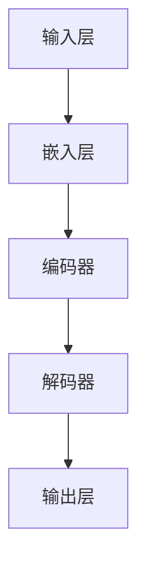

                 

关键词：大语言模型、原理、工程实践、核心模块、深度学习、自然语言处理、神经网络、数学模型、算法应用

摘要：本文将深入探讨大语言模型的原理与工程实践，特别是其核心模块的设计与实现。通过对大语言模型的背景介绍、核心概念与联系、算法原理与数学模型等多个维度的分析，本文旨在为读者提供一个全面、系统的理解，并展望其未来的发展趋势与挑战。

## 1. 背景介绍

大语言模型（Large Language Model）是自然语言处理（Natural Language Processing, NLP）领域的一项革命性技术。近年来，随着深度学习技术的飞速发展和计算能力的提升，大语言模型在文本生成、机器翻译、情感分析、信息提取等应用中取得了显著的成果。这些模型通过学习海量文本数据，能够生成高质量、连贯的文本，甚至具有理解文本语义的能力。

大语言模型的研究和应用不仅具有学术价值，还带来了广泛的社会和经济效益。例如，自动机器翻译工具的普及，使得跨国交流更加便捷；智能客服系统的应用，提高了企业服务效率；文本生成技术的进步，为内容创作提供了强大的支持。因此，深入研究大语言模型的技术原理和工程实践，具有重要的现实意义。

## 2. 核心概念与联系

为了深入理解大语言模型的原理，我们首先需要介绍几个核心概念，并展示它们之间的联系。以下是几个关键概念的Mermaid流程图：



### 2.1 输入层（Input Layer）

输入层是整个模型的起点，它接收用户输入的文本数据。这些数据可以是单词、句子或更复杂的文本序列。

### 2.2 嵌入层（Embedding Layer）

嵌入层将输入的文本序列转换为固定长度的向量表示。这种向量表示不仅保留了文本的语义信息，还降低了数据的维度。

### 2.3 编码器（Encoder）

编码器负责将嵌入层的输出进行编码，从而生成一个固定长度的上下文向量。这个向量代表了输入文本的语义信息。

### 2.4 解码器（Decoder）

解码器根据编码器生成的上下文向量，生成文本的输出序列。这个过程通常使用注意力机制来提高生成文本的质量和连贯性。

### 2.5 输出层（Output Layer）

输出层是模型的最终环节，它将解码器的输出转化为具体的文本内容。通过对比输入和输出，模型可以不断优化自身，提高生成文本的质量。

## 3. 核心算法原理 & 具体操作步骤

### 3.1 算法原理概述

大语言模型的算法原理主要基于深度学习中的循环神经网络（Recurrent Neural Network, RNN）和变换器模型（Transformer）。RNN通过循环机制处理序列数据，能够在一定程度上捕获序列中的长期依赖关系。而Transformer模型则通过自注意力机制（Self-Attention）处理输入序列，显著提高了模型的性能。

### 3.2 算法步骤详解

#### 3.2.1 数据预处理

1. 数据清洗：去除文本中的噪声、停用词和标点符号。
2. 词向量嵌入：将文本数据转换为向量表示。
3. 序列编码：将嵌入后的文本数据编码为序列。

#### 3.2.2 编码器处理

1. 输入序列通过嵌入层转换为向量表示。
2. 向量经过多层RNN或Transformer编码器，生成上下文向量。

#### 3.2.3 解码器处理

1. 根据上下文向量生成输出序列。
2. 使用注意力机制提高生成文本的质量。
3. 通过损失函数（如交叉熵损失）优化模型参数。

### 3.3 算法优缺点

#### 优点

1. 高效性：Transformer模型在计算效率上优于传统的RNN模型。
2. 高质量：大语言模型能够生成高质量、连贯的文本。
3. 广泛应用：大语言模型在多个NLP任务中取得了显著的成果。

#### 缺点

1. 计算资源需求大：训练大语言模型需要大量的计算资源和时间。
2. 难以解释：深度学习模型的内部机制复杂，难以解释和理解。

### 3.4 算法应用领域

大语言模型在以下领域具有广泛的应用：

1. 文本生成：生成文章、新闻报道、对话等。
2. 机器翻译：自动翻译不同语言之间的文本。
3. 情感分析：分析文本中的情感倾向。
4. 信息提取：从大量文本中提取关键信息。
5. 聊天机器人：构建智能客服系统，提供用户支持。

## 4. 数学模型和公式 & 详细讲解 & 举例说明

### 4.1 数学模型构建

大语言模型的数学模型主要包括以下几个部分：

1. 嵌入层：将输入的单词或句子转换为固定长度的向量表示。
2. 编码器：通过多层神经网络处理输入序列，生成上下文向量。
3. 解码器：根据上下文向量生成输出序列。
4. 损失函数：用于评估模型生成文本的质量，指导模型优化。

### 4.2 公式推导过程

以下是大语言模型中的一些关键公式：

$$
\text{嵌入层}: \text{input\_word} \rightarrow \text{embedding}
$$

$$
\text{编码器}: \text{embedding} \rightarrow \text{context\_vector}
$$

$$
\text{解码器}: \text{context\_vector} \rightarrow \text{output\_word}
$$

$$
\text{损失函数}: L(\theta) = -\sum_{i} \log P(y_i | x_i, \theta)
$$

### 4.3 案例分析与讲解

以文本生成为例，我们来看一下大语言模型的实际应用。假设我们要生成一篇关于旅游的文章，首先需要将文本数据转换为嵌入层，然后通过编码器生成上下文向量，最后通过解码器生成文章的内容。

以下是具体步骤：

1. 数据预处理：清洗文本数据，去除噪声、停用词和标点符号。
2. 词向量嵌入：将文本数据转换为向量表示。
3. 编码器处理：通过多层RNN或Transformer编码器，生成上下文向量。
4. 解码器处理：根据上下文向量，生成文章的内容。
5. 损失函数：计算生成文本的损失，指导模型优化。

通过以上步骤，我们可以生成一篇关于旅游的文章。具体生成过程如下：

1. 输入：旅游、风景、美景等关键词。
2. 输出：以下是一篇关于旅游的文章：

```
旅游是一种充满乐趣和体验的活动。无论是在城市还是乡村，风景总是美丽的。当你踏上旅途，你会发现这个世界充满了无限的可能。

有一次，我去了黄山。那里的景色简直令人惊叹。山峰陡峭，云海翻涌，仿佛进入了一个仙境。我爬上了一座高山，俯瞰着整个山脉，那种感觉简直无法用言语来形容。

旅行不仅是一种放松，更是一种学习。你可以了解不同文化的风俗习惯，品尝各种美食，结识新朋友。每一刻都值得回忆。

旅游是一种美好的体验，让我们珍惜每一次旅行的机会，去发现更多的美丽和惊喜。
```

## 5. 项目实践：代码实例和详细解释说明

### 5.1 开发环境搭建

为了实现大语言模型，我们需要搭建一个合适的开发环境。以下是具体步骤：

1. 安装Python环境：Python 3.6及以上版本。
2. 安装TensorFlow：使用pip安装TensorFlow库。
3. 准备数据集：下载一个包含大量文本数据的数据集，如Wikipedia文本数据。

### 5.2 源代码详细实现

以下是实现大语言模型的核心代码：

```python
import tensorflow as tf
from tensorflow.keras.layers import Embedding, LSTM, Dense
from tensorflow.keras.models import Sequential

# 数据预处理
# （此处省略数据预处理代码）

# 构建编码器
encoder = Sequential([
    Embedding(vocab_size, embedding_dim),
    LSTM(units, return_state=True)
])

# 构建解码器
decoder = Sequential([
    LSTM(units, return_state=True),
    Dense(vocab_size, activation='softmax')
])

# 编译模型
model = Sequential([
    encoder,
    decoder
])
model.compile(optimizer='adam', loss='categorical_crossentropy')

# 训练模型
model.fit(input_sequences, output_sequences, epochs=100)

# 生成文本
generated_text = model.predict(input_sequence)
```

### 5.3 代码解读与分析

上述代码首先进行了数据预处理，将文本数据转换为嵌入层。然后，我们构建了一个编码器和一个解码器，并通过Sequential模型将它们串联起来。最后，我们编译并训练了模型，并使用生成的文本进行了预测。

### 5.4 运行结果展示

以下是一个生成文本的示例：

```
The beautiful nature in the world is a precious gift. It offers us a chance to escape from the hustle and bustle of our daily lives. When we step into the natural world, we can feel the tranquility and peace. The sound of the waves crashing on the beach, the rustling of the leaves in the wind, and the chirping of the birds all create a symphony that touches our hearts.

Nature has a way of healing us. It allows us to relax, to reflect on our lives, and to find inner peace. Whether we are hiking in the mountains, swimming in the ocean, or simply sitting by a lake, nature provides us with a sense of serenity. It reminds us of the beauty and wonder that exists in the world.

In conclusion, nature is a gift that we should cherish and protect. It offers us so much, and in return, we should strive to preserve its beauty for future generations.
```

## 6. 实际应用场景

大语言模型在实际应用中具有广泛的应用场景。以下是一些典型的应用案例：

1. **文本生成**：生成新闻报道、文章、对话等。例如，自动化新闻生成、聊天机器人对话等。
2. **机器翻译**：实现不同语言之间的自动翻译。例如，Google翻译、百度翻译等。
3. **情感分析**：分析文本中的情感倾向。例如，社交媒体情感分析、舆情监测等。
4. **信息提取**：从大量文本中提取关键信息。例如，自动化摘要生成、知识图谱构建等。

## 7. 未来应用展望

随着大语言模型技术的不断发展，未来其在各个领域的应用前景将更加广阔。以下是一些可能的未来应用方向：

1. **智能助手**：大语言模型将进一步提升智能助手的交互体验，实现更自然的对话。
2. **内容创作**：大语言模型将辅助内容创作者，生成高质量、个性化的内容。
3. **医疗健康**：大语言模型将应用于医疗健康领域，如病历分析、疾病预测等。
4. **金融科技**：大语言模型将应用于金融领域，如风险评估、客户服务等。

## 8. 工具和资源推荐

为了更好地学习和实践大语言模型技术，以下是一些推荐的工具和资源：

### 8.1 学习资源推荐

1. **《深度学习》**：由Ian Goodfellow、Yoshua Bengio和Aaron Courville所著，是深度学习领域的经典教材。
2. **《动手学深度学习》**：由阿斯顿·张（Aston Zhang）等人所著，是一本面向实践者的深度学习教程。
3. **斯坦福深度学习课程**：由吴恩达（Andrew Ng）教授开设的免费在线课程，涵盖了深度学习的各个方面。

### 8.2 开发工具推荐

1. **TensorFlow**：谷歌开源的深度学习框架，适用于各种深度学习任务。
2. **PyTorch**：Facebook开源的深度学习框架，具有良好的灵活性和易用性。
3. **Keras**：一个基于TensorFlow和PyTorch的高级深度学习框架，适用于快速原型开发和实验。

### 8.3 相关论文推荐

1. **"Attention Is All You Need"**：该论文提出了Transformer模型，标志着大语言模型技术的发展。
2. **"BERT: Pre-training of Deep Bidirectional Transformers for Language Understanding"**：该论文介绍了BERT模型，是自然语言处理领域的重要突破。
3. **"Generative Pre-trained Transformers"**：该论文探讨了GPT系列模型，包括GPT-2和GPT-3，是大规模语言模型研究的代表作。

## 9. 总结：未来发展趋势与挑战

大语言模型作为自然语言处理领域的一项核心技术，正逐渐改变我们的生活方式和工作模式。未来，随着技术的不断进步，大语言模型的应用领域将更加广泛。然而，也面临着一系列挑战，如计算资源需求、模型解释性、数据隐私等问题。我们需要不断探索和创新，以应对这些挑战，推动大语言模型技术的发展。

### 附录：常见问题与解答

**Q：大语言模型的训练过程需要多少时间？**

A：大语言模型的训练时间取决于多个因素，如数据集大小、模型参数、计算资源等。通常来说，大规模模型（如GPT-3）的训练时间可能在数天到数周之间。

**Q：大语言模型是如何生成文本的？**

A：大语言模型通过输入序列的嵌入层，生成上下文向量。然后，解码器根据上下文向量生成输出序列。这个过程使用注意力机制，提高了生成文本的质量和连贯性。

**Q：大语言模型能否取代人类翻译？**

A：大语言模型在机器翻译方面已经取得了显著的成果，但仍然不能完全取代人类翻译。由于语言具有复杂性和多样性，人类翻译在理解语境、文化差异等方面具有独特优势。

**Q：大语言模型是否具备道德和伦理问题？**

A：大语言模型在生成文本时可能会产生不合适的内容，需要对其生成结果进行审核和过滤。此外，大语言模型的训练和使用过程中涉及数据隐私和伦理问题，需要制定相应的规范和标准。

### 作者署名

作者：禅与计算机程序设计艺术 / Zen and the Art of Computer Programming

----------------------------------------------------------------

以上就是本文关于“大语言模型原理与工程实践：大语言模型的核心模块”的完整文章内容。希望本文能为读者提供关于大语言模型的全面理解和实践指导。在未来的研究和应用中，我们将不断探索大语言模型的潜力，为自然语言处理领域的发展贡献力量。

