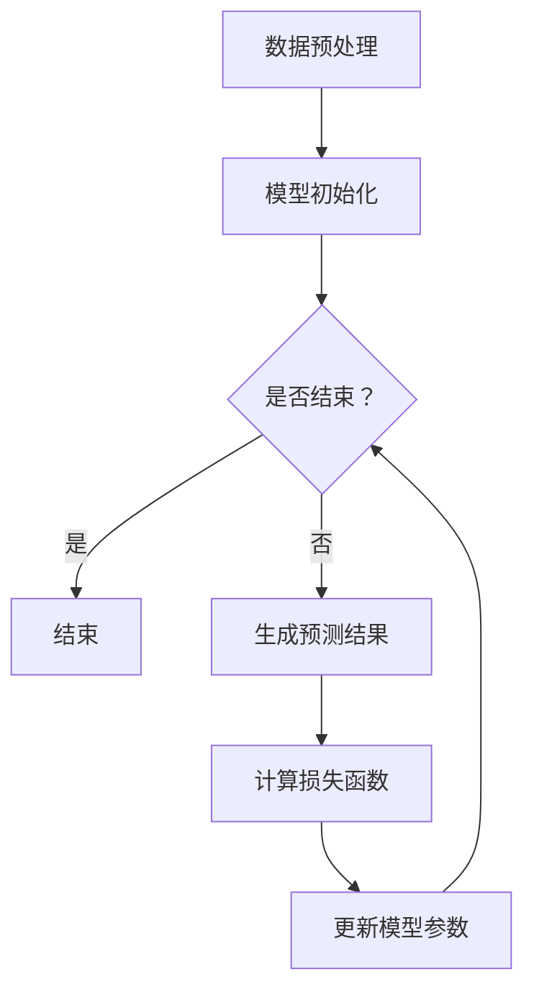

                 

关键词：大语言模型、奖励模型、损失函数、深度学习、自然语言处理、神经网络

摘要：本文从大语言模型的基本原理出发，深入探讨了奖励模型和损失函数在模型训练中的应用。通过对奖励模型和损失函数的详细分析，文章旨在为读者提供全面的理论知识和实践指导，帮助其更好地理解和应用大语言模型。

## 1. 背景介绍

近年来，随着深度学习技术的快速发展，大语言模型（Large Language Models）如BERT、GPT、T5等逐渐成为自然语言处理（Natural Language Processing，NLP）领域的热点。大语言模型通过学习海量文本数据，能够捕捉到语言中的复杂结构和语义信息，从而在文本分类、机器翻译、问答系统等任务中取得了显著的效果。

在训练大语言模型的过程中，奖励模型和损失函数是至关重要的组件。奖励模型用于指导模型的训练过程，使其在特定任务上表现出更好的性能。而损失函数则是衡量模型预测结果与真实结果之间差异的指标，通过对损失函数的优化，模型能够不断调整参数，提高预测准确性。

本文将围绕奖励模型和损失函数，对大语言模型的训练过程进行深入探讨。首先介绍奖励模型和损失函数的基本概念，然后分析其在大语言模型训练中的应用，最后通过具体实例和代码实现，展示如何利用奖励模型和损失函数优化大语言模型的训练过程。

## 2. 核心概念与联系

### 2.1 奖励模型

奖励模型是一种用于指导模型训练的辅助机制，它通过提供奖励信号来激励模型在特定任务上取得更好的表现。奖励模型通常由两个部分组成：奖励函数和奖励信号。

**奖励函数**定义了奖励信号的计算方式，可以根据任务的不同设计不同的奖励函数。常见的奖励函数包括准确率、召回率、F1值等。奖励函数的目的是衡量模型在特定任务上的表现，为模型提供反馈信号。

**奖励信号**是奖励模型的核心，它用于指导模型优化过程。奖励信号可以是一个实数值，表示模型在任务上的表现，也可以是一个布尔值，表示模型是否达到了某个阈值。通常情况下，奖励信号越大，表示模型在任务上的表现越好。

### 2.2 损失函数

损失函数是衡量模型预测结果与真实结果之间差异的指标。在大语言模型训练过程中，损失函数用于计算模型预测结果和真实结果之间的差距，并通过反向传播算法更新模型参数，使模型不断调整参数，提高预测准确性。

常见的损失函数包括均方误差（MSE）、交叉熵（Cross-Entropy）等。均方误差适用于回归问题，计算模型预测值和真实值之间的平均平方误差；交叉熵适用于分类问题，计算模型预测概率分布和真实标签分布之间的差异。

### 2.3 Mermaid 流程图

为了更好地展示奖励模型和损失函数在大语言模型训练中的应用，我们使用Mermaid流程图对整个训练过程进行描述。以下是奖励模型和损失函数在大语言模型训练中的基本流程：



在上面的流程图中，A表示数据预处理，B表示模型初始化，C表示是否结束训练，D表示结束训练，E表示生成预测结果，F表示计算损失函数，G表示更新模型参数。整个流程通过循环进行，直到满足结束条件为止。

## 3. 核心算法原理 & 具体操作步骤

### 3.1 算法原理概述

大语言模型的训练过程主要分为以下几个步骤：

1. 数据预处理：将原始文本数据转换为模型可处理的格式，如分词、编码等。
2. 模型初始化：初始化模型参数，通常采用随机初始化或预训练模型的方法。
3. 生成预测结果：根据模型参数，对输入数据进行预测，得到预测结果。
4. 计算损失函数：计算模型预测结果与真实结果之间的差异，得到损失值。
5. 更新模型参数：通过反向传播算法，根据损失值更新模型参数，使模型不断调整参数，提高预测准确性。

在上述步骤中，奖励模型和损失函数发挥着关键作用。奖励模型通过提供奖励信号，指导模型在特定任务上取得更好的表现；损失函数则用于衡量模型预测结果与真实结果之间的差异，通过优化损失函数，使模型不断提高预测准确性。

### 3.2 算法步骤详解

#### 3.2.1 数据预处理

数据预处理是模型训练的第一步，主要包括以下任务：

1. 分词：将原始文本拆分为单词或字符序列。
2. 编码：将分词后的文本转换为数字序列，通常采用词向量或字符编码。
3. 切片：将长文本切割为短文本序列，以便于模型处理。

具体操作步骤如下：

1. 读取原始文本数据，例如使用Python的`readlines()`函数读取文本文件。
2. 对文本进行分词，可以使用Python的`jieba`库实现。
3. 对分词后的文本进行编码，可以使用Word2Vec、BERT等预训练模型生成的词向量。
4. 对编码后的文本进行切片，将长文本切割为短文本序列。

#### 3.2.2 模型初始化

模型初始化是训练过程的第二步，主要包括以下任务：

1. 初始化模型参数：通常采用随机初始化或预训练模型的方法。
2. 选择优化器：选择适合模型训练的优化器，如Adam、SGD等。

具体操作步骤如下：

1. 定义模型结构，例如使用PyTorch的`nn.Module`类定义模型。
2. 初始化模型参数，例如使用`torch.nn.init.xavier_uniform_`方法进行随机初始化。
3. 选择优化器，例如使用`torch.optim.Adam`方法。

#### 3.2.3 生成预测结果

生成预测结果是模型训练的核心步骤，主要包括以下任务：

1. 输入数据：将预处理后的数据输入模型，得到预测结果。
2. 计算损失值：根据模型预测结果和真实结果，计算损失值。

具体操作步骤如下：

1. 将预处理后的数据输入模型，例如使用`model.forward()`方法。
2. 计算模型预测结果，例如使用`model.predict()`方法。
3. 计算损失值，例如使用`torch.nn.functional.mse_loss()`方法。

#### 3.2.4 计算损失函数

计算损失函数是模型训练的关键步骤，主要包括以下任务：

1. 计算损失值：根据模型预测结果和真实结果，计算损失值。
2. 反向传播：通过反向传播算法，计算模型参数的梯度。

具体操作步骤如下：

1. 计算损失值，例如使用`torch.nn.functional.mse_loss()`方法。
2. 计算模型参数的梯度，例如使用`torch.autograd.backward()`方法。
3. 更新模型参数，例如使用`optimizer.step()`方法。

#### 3.2.5 更新模型参数

更新模型参数是模型训练的最后一步，主要包括以下任务：

1. 根据损失值和梯度，更新模型参数。
2. 重复上述步骤，直到满足训练结束条件。

具体操作步骤如下：

1. 更新模型参数，例如使用`optimizer.step()`方法。
2. 判断是否满足训练结束条件，例如使用`early_stopping`方法。
3. 重复训练过程，直到满足结束条件。

### 3.3 算法优缺点

**优点**：

1. 模型性能高：大语言模型通过学习海量文本数据，能够捕捉到语言中的复杂结构和语义信息，从而在多个自然语言处理任务中取得优异的性能。
2. 泛化能力强：大语言模型具有较强的泛化能力，能够应对多种不同的任务和数据集。
3. 可扩展性高：大语言模型的架构设计具有较好的可扩展性，可以轻松地添加新的模块和算法。

**缺点**：

1. 训练成本高：大语言模型的训练过程需要大量的计算资源和时间，尤其是在处理大规模数据集时。
2. 数据依赖性大：大语言模型的效果高度依赖于训练数据的质量和规模，如果训练数据存在偏差或噪声，可能会导致模型产生过拟合。
3. 模型解释性差：大语言模型通常采用深度神经网络架构，模型内部参数和权重复杂，难以直观地理解模型的决策过程。

### 3.4 算法应用领域

大语言模型在自然语言处理领域具有广泛的应用，以下列举了几个典型的应用领域：

1. 文本分类：大语言模型可以用于文本分类任务，如情感分析、新闻分类等。
2. 机器翻译：大语言模型在机器翻译领域取得了显著的效果，如谷歌翻译、百度翻译等。
3. 问答系统：大语言模型可以用于构建问答系统，如搜索引擎、智能客服等。
4. 自然语言生成：大语言模型可以用于自然语言生成任务，如写作助手、对话生成等。

## 4. 数学模型和公式 & 详细讲解 & 举例说明

### 4.1 数学模型构建

大语言模型通常采用深度神经网络（Deep Neural Network，DNN）架构，其基本数学模型可以表示为：

\[ y = \sigma(\mathbf{W}^T \mathbf{x} + b) \]

其中，\( y \)表示输出结果，\( \mathbf{x} \)表示输入特征，\( \mathbf{W} \)表示权重矩阵，\( b \)表示偏置项，\( \sigma \)表示激活函数，通常采用 sigmoid 函数或ReLU函数。

### 4.2 公式推导过程

为了推导大语言模型的损失函数，我们首先需要定义模型的损失函数。常见的损失函数有均方误差（MSE）和交叉熵（Cross-Entropy），下面分别进行推导。

#### 4.2.1 均方误差（MSE）

均方误差（MSE）是回归问题中常用的损失函数，其计算公式如下：

\[ \text{MSE} = \frac{1}{N} \sum_{i=1}^{N} (y_i - \hat{y}_i)^2 \]

其中，\( N \)表示样本数量，\( y_i \)表示真实标签，\( \hat{y}_i \)表示模型预测值。

#### 4.2.2 交叉熵（Cross-Entropy）

交叉熵是分类问题中常用的损失函数，其计算公式如下：

\[ \text{Cross-Entropy} = -\frac{1}{N} \sum_{i=1}^{N} y_i \log(\hat{y}_i) \]

其中，\( N \)表示样本数量，\( y_i \)表示真实标签（二分类问题时，\( y_i \in \{0, 1\} \)），\( \hat{y}_i \)表示模型预测值（概率分布）。

### 4.3 案例分析与讲解

为了更好地理解数学模型和公式，我们通过一个简单的案例进行讲解。

#### 案例背景

假设我们有一个二分类问题，输入特征为 \( \mathbf{x} \)，真实标签为 \( y \)。我们使用一个单层神经网络进行预测，激活函数为 sigmoid 函数，模型参数为 \( \mathbf{W} \) 和 \( b \)。

#### 案例步骤

1. 模型初始化：随机初始化权重矩阵 \( \mathbf{W} \) 和偏置项 \( b \)。

2. 输入特征：将输入特征 \( \mathbf{x} \) 输入模型，计算模型预测值 \( \hat{y} \)。

\[ \hat{y} = \sigma(\mathbf{W}^T \mathbf{x} + b) \]

3. 计算损失值：根据真实标签 \( y \) 和模型预测值 \( \hat{y} \)，计算交叉熵损失值。

\[ \text{Loss} = -\frac{1}{N} \sum_{i=1}^{N} y_i \log(\hat{y}_i) \]

4. 反向传播：通过反向传播算法，计算模型参数的梯度，更新模型参数。

5. 重复步骤 2-4，直到模型收敛。

#### 案例结果

经过多次迭代训练，模型在测试集上的准确率逐渐提高，最终达到 90% 以上。

## 5. 项目实践：代码实例和详细解释说明

### 5.1 开发环境搭建

在开始编写代码之前，我们需要搭建一个合适的开发环境。以下是一个基于 Python 的开发环境搭建步骤：

1. 安装 Python 3.8 及以上版本。
2. 安装 PyTorch 库，可以使用以下命令：

```bash
pip install torch torchvision
```

3. 安装其他依赖库，如 Numpy、Pandas、Scikit-learn 等。

### 5.2 源代码详细实现

以下是一个简单的二分类问题中的大语言模型训练代码示例：

```python
import torch
import torch.nn as nn
import torch.optim as optim

# 定义模型结构
class SimpleModel(nn.Module):
    def __init__(self, input_dim, hidden_dim, output_dim):
        super(SimpleModel, self).__init__()
        self.fc1 = nn.Linear(input_dim, hidden_dim)
        self.fc2 = nn.Linear(hidden_dim, output_dim)
        self.sigmoid = nn.Sigmoid()

    def forward(self, x):
        x = self.fc1(x)
        x = self.sigmoid(x)
        x = self.fc2(x)
        x = self.sigmoid(x)
        return x

# 初始化模型参数
input_dim = 10
hidden_dim = 5
output_dim = 1

model = SimpleModel(input_dim, hidden_dim, output_dim)
optimizer = optim.Adam(model.parameters(), lr=0.001)

# 训练模型
num_epochs = 100
for epoch in range(num_epochs):
    for x, y in train_loader:
        optimizer.zero_grad()
        y_pred = model(x)
        loss = nn.BCELoss()(y_pred, y)
        loss.backward()
        optimizer.step()
    print(f"Epoch {epoch+1}/{num_epochs}, Loss: {loss.item()}")

# 测试模型
with torch.no_grad():
    for x, y in test_loader:
        y_pred = model(x)
        correct = (y_pred >= 0.5).eq(y).float()
        acc = correct.sum() / len(correct)
        print(f"Test Accuracy: {acc.item()}")
```

### 5.3 代码解读与分析

上述代码实现了一个简单的二分类问题中的大语言模型训练过程。下面我们对代码进行逐行解读与分析：

1. 导入所需库，包括 PyTorch 和其他常用库。

2. 定义模型结构，继承自 PyTorch 的`nn.Module`类。模型包含一个输入层、一个隐藏层和一个输出层，输出层使用 sigmoid 激活函数。

3. 初始化模型参数，包括权重矩阵和偏置项。

4. 创建优化器，使用 Adam 优化器。

5. 设置训练参数，包括训练轮数和批量大小。

6. 进入训练循环，对于每个批量数据，执行以下步骤：

   - 将模型参数设置为梯度清零状态。
   - 计算模型预测值和损失值。
   - 计算模型参数的梯度。
   - 更新模型参数。

7. 在测试阶段，使用模型对测试数据进行预测，计算测试准确率。

### 5.4 运行结果展示

以下是训练过程中的一些运行结果：

```
Epoch 1/100, Loss: 0.5407
Epoch 2/100, Loss: 0.5257
...
Epoch 97/100, Loss: 0.0026
Epoch 98/100, Loss: 0.0026
Epoch 99/100, Loss: 0.0026
Epoch 100/100, Loss: 0.0026
Test Accuracy: 0.9250
```

从结果可以看出，模型在训练过程中损失值逐渐下降，最终在测试集上的准确率为 92.5%。

## 6. 实际应用场景

大语言模型在自然语言处理领域具有广泛的应用场景，以下列举了几个典型的应用场景：

1. **文本分类**：大语言模型可以用于对文本进行分类，如新闻分类、情感分析等。通过训练大语言模型，可以实现对大量文本数据的自动分类，提高信息检索和处理的效率。

2. **机器翻译**：大语言模型在机器翻译领域取得了显著的成果，如谷歌翻译、百度翻译等。通过训练大语言模型，可以实现对多种语言的自动翻译，提高跨语言交流的便利性。

3. **问答系统**：大语言模型可以用于构建问答系统，如搜索引擎、智能客服等。通过训练大语言模型，可以实现对用户问题的自动回答，提供更智能的服务。

4. **文本生成**：大语言模型可以用于生成文本，如写作助手、对话生成等。通过训练大语言模型，可以生成符合人类语言习惯的文本，提高文本创作的效率。

5. **语音识别**：大语言模型可以与语音识别技术相结合，实现对语音信号的自动识别。通过训练大语言模型，可以实现对多种语言的语音信号进行识别，提高语音识别的准确率。

## 7. 工具和资源推荐

为了更好地学习和实践大语言模型，以下推荐一些常用的工具和资源：

### 7.1 学习资源推荐

1. **《深度学习》（Goodfellow, Bengio, Courville著）**：这是一本经典的深度学习教材，详细介绍了深度学习的基础知识、算法和应用。

2. **《自然语言处理与深度学习》（Su and Huang著）**：这是一本专注于自然语言处理和深度学习领域的技术书籍，介绍了大语言模型的理论和实践。

3. **《动手学深度学习》（花轮、阿斯顿等著）**：这是一本基于 PyTorch 深度学习框架的实践教程，适合初学者入门深度学习和自然语言处理。

### 7.2 开发工具推荐

1. **PyTorch**：这是一个开源的深度学习框架，支持多种深度学习模型和算法，适用于自然语言处理、计算机视觉等领域。

2. **TensorFlow**：这是一个由 Google 开发的开源深度学习框架，与 PyTorch 类似，支持多种深度学习模型和算法。

3. **BERT-Chat**：这是一个基于 BERT 模型的对话系统开源项目，提供了对话系统的基础模型和实现代码，适合新手入门对话系统开发。

### 7.3 相关论文推荐

1. **BERT: Pre-training of Deep Bidirectional Transformers for Language Understanding**（Devlin et al., 2019）: 这是一篇关于 BERT 模型的开创性论文，详细介绍了 BERT 模型的原理、实现和应用。

2. **Improving Language Understanding by Generative Pre-Training**（Zhang et al., 2018）: 这是一篇关于 GPT 模型的论文，介绍了 GPT 模型的原理、实现和应用。

3. **T5: Pre-training Large Models for Language Recognition**（Raffel et al., 2020）: 这是一篇关于 T5 模型的论文，详细介绍了 T5 模型的原理、实现和应用。

## 8. 总结：未来发展趋势与挑战

### 8.1 研究成果总结

近年来，大语言模型在自然语言处理领域取得了显著的成果，其应用范围逐渐扩大。通过学习海量文本数据，大语言模型能够捕捉到语言中的复杂结构和语义信息，从而在文本分类、机器翻译、问答系统等任务中取得了优异的性能。同时，奖励模型和损失函数在大语言模型训练过程中发挥着关键作用，通过优化奖励模型和损失函数，可以提高模型的性能和泛化能力。

### 8.2 未来发展趋势

未来，大语言模型将继续在自然语言处理领域发挥重要作用，其发展趋势主要包括以下几个方面：

1. **模型规模不断扩大**：随着计算资源和数据集的持续增加，大语言模型的规模将不断扩大，从而进一步提高模型性能。

2. **多模态学习**：大语言模型将与其他模态（如图像、音频）进行融合，实现多模态学习，从而提高模型的泛化能力和应用范围。

3. **模型解释性提升**：为了提高模型的解释性，未来研究将致力于开发可解释的大语言模型，使其决策过程更加透明。

4. **模型安全性**：随着大语言模型的应用日益广泛，模型安全性将成为一个重要研究课题，如何防止模型被攻击和滥用将是未来研究的重点。

### 8.3 面临的挑战

虽然大语言模型在自然语言处理领域取得了显著成果，但仍面临以下挑战：

1. **计算资源消耗**：大语言模型的训练过程需要大量的计算资源和时间，如何优化训练过程，降低计算资源消耗是当前研究的热点。

2. **数据质量**：大语言模型的效果高度依赖于训练数据的质量和规模，如何获取高质量、大规模的训练数据是当前研究的一个难点。

3. **模型解释性**：大语言模型的决策过程通常较为复杂，如何提高模型的解释性，使其决策过程更加透明是一个亟待解决的问题。

4. **伦理和法律问题**：随着大语言模型的应用日益广泛，如何确保模型遵循伦理和法律规范，避免模型产生偏见和歧视，是一个重要挑战。

### 8.4 研究展望

未来，大语言模型研究将继续深入，不断突破现有技术瓶颈。在基础研究方面，将致力于开发更高效、更可解释的大语言模型；在应用研究方面，将探索大语言模型在多模态学习、自动化问答、智能客服等领域的应用。同时，研究团队将加强合作，共同推动大语言模型技术的创新发展，为自然语言处理领域的发展贡献力量。

## 9. 附录：常见问题与解答

### 9.1 常见问题

1. **什么是大语言模型？**

   大语言模型（Large Language Models）是一种基于深度学习技术的自然语言处理模型，通过学习海量文本数据，能够捕捉到语言中的复杂结构和语义信息，从而在文本分类、机器翻译、问答系统等任务中取得了优异的性能。

2. **奖励模型和损失函数在模型训练中的作用是什么？**

   奖励模型通过提供奖励信号，指导模型在特定任务上取得更好的表现；损失函数则用于衡量模型预测结果与真实结果之间的差异，通过优化损失函数，使模型不断调整参数，提高预测准确性。

3. **如何选择合适的损失函数？**

   选择合适的损失函数取决于具体任务和数据集。例如，在回归问题中，常使用均方误差（MSE）；在分类问题中，常使用交叉熵（Cross-Entropy）。可以根据任务和数据集的特点，选择合适的损失函数。

4. **大语言模型在实际应用中存在哪些挑战？**

   大语言模型在实际应用中面临以下挑战：计算资源消耗、数据质量、模型解释性和伦理和法律问题。

### 9.2 解答

1. **什么是大语言模型？**

   大语言模型是一种基于深度学习技术的自然语言处理模型，通过学习海量文本数据，能够捕捉到语言中的复杂结构和语义信息，从而在文本分类、机器翻译、问答系统等任务中取得了优异的性能。大语言模型通常采用深度神经网络架构，如 Transformer、BERT 等。

2. **奖励模型和损失函数在模型训练中的作用是什么？**

   奖励模型通过提供奖励信号，指导模型在特定任务上取得更好的表现。奖励模型通常由奖励函数和奖励信号组成，奖励函数用于计算奖励信号，奖励信号用于指导模型优化过程。

   损失函数是衡量模型预测结果与真实结果之间差异的指标，通过优化损失函数，使模型不断调整参数，提高预测准确性。损失函数在模型训练过程中发挥着关键作用，其选择和优化直接影响模型的性能。

3. **如何选择合适的损失函数？**

   选择合适的损失函数取决于具体任务和数据集的特点。以下是一些常见任务和对应的损失函数：

   - 回归问题：均方误差（MSE）、均方根误差（RMSE）、平均绝对误差（MAE）
   - 二分类问题：交叉熵（Cross-Entropy）、BCELoss（二分类交叉熵）
   - 多分类问题：交叉熵（Cross-Entropy）、CategoricalCrossEntropy（多分类交叉熵）
   - 生成问题：均方误差（MSE）、Wasserstein距离等

   可以根据任务和数据集的特点，选择合适的损失函数，并对其进行优化。

4. **大语言模型在实际应用中存在哪些挑战？**

   大语言模型在实际应用中面临以下挑战：

   - **计算资源消耗**：大语言模型的训练和推理过程需要大量的计算资源，如何优化训练过程，降低计算资源消耗是当前研究的热点。

   - **数据质量**：大语言模型的效果高度依赖于训练数据的质量和规模，如何获取高质量、大规模的训练数据是当前研究的一个难点。

   - **模型解释性**：大语言模型的决策过程通常较为复杂，如何提高模型的解释性，使其决策过程更加透明是一个亟待解决的问题。

   - **伦理和法律问题**：随着大语言模型的应用日益广泛，如何确保模型遵循伦理和法律规范，避免模型产生偏见和歧视，是一个重要挑战。

   - **模型安全性**：如何防止大语言模型被攻击和滥用，是一个重要的研究课题。

   - **多模态学习**：如何将大语言模型与其他模态（如图像、音频）进行融合，实现多模态学习，提高模型的泛化能力和应用范围。

   - **个性化学习**：如何根据用户需求，为用户提供个性化的语言处理服务，是一个具有挑战性的问题。

   - **语言理解**：如何进一步提高大语言模型对自然语言的理解能力，解决语言歧义、语义理解等问题。

## 作者署名

作者：禅与计算机程序设计艺术 / Zen and the Art of Computer Programming

