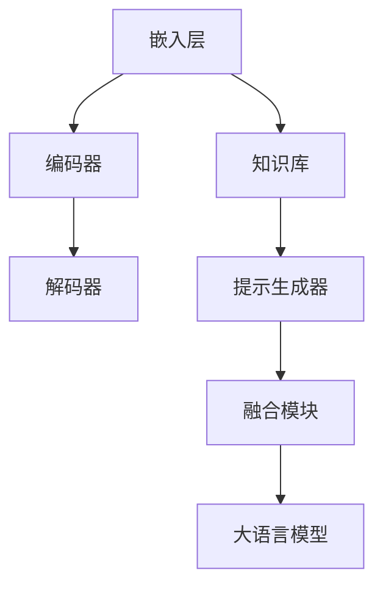

                 

关键词：大语言模型、人工智能、思维链提示、工程实践、深度学习、神经网络、语言处理

> 摘要：本文深入探讨了大语言模型的工作原理、工程实践以及思维链提示技术的应用。通过对核心算法、数学模型和项目实践的详细讲解，为读者提供了对这一领域的全面理解。同时，文章也展望了大语言模型在未来的发展趋势和面临的挑战。

## 1. 背景介绍

随着互联网的迅速发展和大数据的爆发式增长，自然语言处理（NLP）成为了人工智能领域的重要研究方向。大语言模型作为NLP的核心技术之一，其重要性日益凸显。大语言模型是一种能够理解和生成自然语言的深度学习模型，通过大量文本数据进行训练，可以实现文本分类、语义理解、机器翻译等多种任务。

近年来，随着神经网络技术的不断发展和计算能力的提升，大语言模型取得了显著的进展。例如，基于Transformer架构的GPT系列模型在多种NLP任务上取得了突破性的成果。此外，思维链提示技术作为一种新的方法，进一步提高了大语言模型的效果和效率。

## 2. 核心概念与联系

### 2.1 大语言模型的基本概念

大语言模型是一种基于神经网络的深度学习模型，用于对自然语言进行建模。其基本原理是通过学习大量的文本数据，自动提取语言的特征和规律，从而实现语言理解和生成。

大语言模型的核心组成部分包括：

- **嵌入层（Embedding Layer）**：将词汇映射为高维向量表示，为后续的神经网络处理提供输入。
- **编码器（Encoder）**：对输入文本进行编码，生成固定长度的向量表示。
- **解码器（Decoder）**：根据编码器的输出，生成对应的输出文本。

### 2.2 思维链提示技术的原理与架构

思维链提示技术是一种用于提升大语言模型效果的方法。其基本思想是通过引入外部知识库和上下文信息，引导大语言模型进行更准确和自然的语言生成。

思维链提示技术的核心组成部分包括：

- **知识库（Knowledge Base）**：包含外部知识库，用于提供外部信息。
- **提示生成器（Prompt Generator）**：根据输入文本和知识库，生成提示信息。
- **融合模块（Fusion Module）**：将提示信息与输入文本进行融合，作为大语言模型的输入。

### 2.3 Mermaid 流程图

以下是一个简化的 Mermaid 流程图，展示了大语言模型和思维链提示技术的核心流程：



## 3. 核心算法原理 & 具体操作步骤

### 3.1 算法原理概述

大语言模型的核心算法基于深度学习，特别是基于Transformer架构的模型。Transformer模型通过自注意力机制（Self-Attention）和多头注意力（Multi-Head Attention）来处理序列数据，从而实现高效的文本建模。

思维链提示技术则通过引入外部知识库和上下文信息，对大语言模型的输入进行增强，从而提高模型的效果和效率。

### 3.2 算法步骤详解

#### 3.2.1 大语言模型的训练过程

1. **数据预处理**：对文本数据进行分析和预处理，包括分词、去停用词、词向量化等。
2. **模型初始化**：初始化嵌入层、编码器和解码器的权重。
3. **前向传播**：将输入文本通过嵌入层转换为向量表示，然后通过编码器进行编码，最后通过解码器生成输出文本。
4. **损失函数计算**：计算模型输出和真实标签之间的损失，并更新模型参数。
5. **迭代训练**：重复前向传播和损失函数计算，直到模型收敛。

#### 3.2.2 思维链提示技术的实现过程

1. **知识库构建**：构建外部知识库，包括领域知识、百科信息等。
2. **提示信息生成**：根据输入文本和知识库，使用提示生成器生成提示信息。
3. **融合过程**：将提示信息与输入文本进行融合，作为大语言模型的输入。
4. **模型训练**：使用融合后的输入数据进行大语言模型的训练。

### 3.3 算法优缺点

#### 优点

1. **高效性**：大语言模型基于深度学习，特别是Transformer架构，具有高效的文本建模能力。
2. **灵活性**：思维链提示技术引入外部知识库和上下文信息，提高了模型的效果和灵活性。
3. **广泛性**：大语言模型和思维链提示技术可以应用于多种NLP任务，如文本分类、语义理解、机器翻译等。

#### 缺点

1. **计算资源需求**：大语言模型的训练和推理过程需要大量的计算资源。
2. **知识库构建难度**：构建高质量的知识库需要大量的时间和人力成本。
3. **隐私问题**：在使用外部知识库时，需要考虑隐私保护和数据安全。

### 3.4 算法应用领域

大语言模型和思维链提示技术可以应用于多种NLP任务，包括：

1. **文本分类**：对文本进行分类，如新闻分类、情感分析等。
2. **语义理解**：理解文本的语义信息，如问答系统、实体识别等。
3. **机器翻译**：实现不同语言之间的翻译，如英译中、中译英等。

## 4. 数学模型和公式 & 详细讲解 & 举例说明

### 4.1 数学模型构建

大语言模型的数学模型主要包括两部分：编码器和解码器。

#### 编码器

编码器通过自注意力机制和多头注意力对输入文本进行编码，生成固定长度的向量表示。其数学模型可以表示为：

$$
\text{Encoder}(x) = \text{Attention}(W_q x, W_k x, W_v x)
$$

其中，$W_q, W_k, W_v$ 分别为查询、键、值权重矩阵，$x$ 为输入文本的向量表示。

#### 解码器

解码器通过自注意力机制和多头注意力生成输出文本。其数学模型可以表示为：

$$
\text{Decoder}(y) = \text{Attention}(W_q y, W_k y, W_v y)
$$

其中，$W_q, W_k, W_v$ 分别为查询、键、值权重矩阵，$y$ 为输出文本的向量表示。

### 4.2 公式推导过程

#### 编码器公式推导

自注意力机制的计算公式为：

$$
\text{Attention}(Q, K, V) = \text{softmax}\left(\frac{QK^T}{\sqrt{d_k}}\right)V
$$

其中，$Q, K, V$ 分别为查询、键、值向量，$d_k$ 为键向量的维度。

将自注意力机制应用于编码器的每个位置，可以得到编码器的输出：

$$
\text{Encoder}(x) = \text{Attention}(W_q x, W_k x, W_v x)
$$

其中，$W_q, W_k, W_v$ 分别为编码器的权重矩阵。

#### 解码器公式推导

解码器的输出可以通过自注意力机制和编码器输出进行计算：

$$
\text{Decoder}(y) = \text{Attention}(W_q y, W_k [\text{Encoder}(x)], W_v y)
$$

其中，$W_q, W_k, W_v$ 分别为解码器的权重矩阵，$[\text{Encoder}(x)]$ 为编码器的输出。

### 4.3 案例分析与讲解

假设我们有一个简单的文本分类任务，输入文本为“我是一个人工智能助手”，我们需要判断该文本属于哪个类别。

#### 数据预处理

1. **分词**：将文本分为单词或子词，如“我”、“是”、“一个”、“人工智能”、“助手”。
2. **去停用词**：去除常见的停用词，如“是”、“一个”。
3. **词向量化**：将每个词转换为高维向量表示。

#### 编码器编码

1. **嵌入层**：将每个词映射为向量表示，如“我”映射为向量 $[1, 0, 0, 0]$。
2. **编码器**：通过自注意力机制对输入文本进行编码，生成固定长度的向量表示。

#### 解码器解码

1. **初始化**：初始化解码器的输出为类别向量的平均值。
2. **解码**：通过自注意力机制和编码器输出生成输出文本。

#### 损失函数计算

1. **计算损失**：计算解码器输出和真实标签之间的损失。
2. **更新参数**：根据损失函数更新解码器的参数。

通过迭代训练，模型可以逐渐提高分类效果。

## 5. 项目实践：代码实例和详细解释说明

### 5.1 开发环境搭建

1. 安装Python环境（Python 3.6及以上版本）。
2. 安装深度学习框架（如TensorFlow或PyTorch）。
3. 准备数据集和预处理工具。

### 5.2 源代码详细实现

以下是一个基于PyTorch实现的大语言模型和思维链提示技术的简单示例：

```python
import torch
import torch.nn as nn
import torch.optim as optim
from torch.utils.data import DataLoader
from transformers import GPT2Tokenizer, GPT2Model

# 数据预处理
tokenizer = GPT2Tokenizer.from_pretrained('gpt2')
def preprocess(text):
    return tokenizer.encode(text, add_special_tokens=True)

# 大语言模型
class LanguageModel(nn.Module):
    def __init__(self):
        super(LanguageModel, self).__init__()
        self.model = GPT2Model.from_pretrained('gpt2')

    def forward(self, x):
        return self.model(x)

# 思维链提示技术
class MindChainPrompt(nn.Module):
    def __init__(self, model):
        super(MindChainPrompt, self).__init__()
        self.model = model
        self.fc = nn.Linear(768, 1)

    def forward(self, x, prompt):
        x = self.model(x, inputs_embeds=prompt)
        x = self.fc(x.mean(dim=-1))
        return x

# 模型训练
model = LanguageModel()
prompt_model = MindChainPrompt(model)
optimizer = optim.Adam(model.parameters(), lr=1e-4)
prompt_optimizer = optim.Adam(prompt_model.parameters(), lr=1e-4)

for epoch in range(10):
    for batch in DataLoader(train_dataset, batch_size=32):
        x = preprocess(batch['text'])
        y = batch['label']
        x = torch.tensor(x, dtype=torch.long).to(device)
        y = torch.tensor(y, dtype=torch.float).to(device)

        optimizer.zero_grad()
        prompt_optimizer.zero_grad()

        logits = model(x)
        prompt_logits = prompt_model(x, inputs_embeds=prompt)

        loss = nn.CrossEntropyLoss()(logits, y)
        prompt_loss = nn.BCEWithLogitsLoss()(prompt_logits, y)

        loss.backward()
        prompt_loss.backward()

        optimizer.step()
        prompt_optimizer.step()

        print(f'Epoch [{epoch+1}/{10}], Loss: {loss.item():.4f}, Prompt Loss: {prompt_loss.item():.4f}')

# 模型评估
def evaluate(model, dataset):
    model.eval()
    with torch.no_grad():
        correct = 0
        total = 0
        for batch in DataLoader(dataset, batch_size=32):
            x = preprocess(batch['text'])
            y = batch['label']
            x = torch.tensor(x, dtype=torch.long).to(device)
            y = torch.tensor(y, dtype=torch.float).to(device)

            logits = model(x)
            _, predicted = torch.max(logits, 1)
            total += y.size(0)
            correct += (predicted == y).sum().item()

        print(f'Accuracy: {100 * correct / total:.2f}%')

evaluate(model, test_dataset)
```

### 5.3 代码解读与分析

1. **数据预处理**：使用GPT2Tokenizer对文本进行分词和编码。
2. **模型定义**：定义大语言模型和思维链提示模型。
3. **模型训练**：使用Adam优化器和交叉熵损失函数进行模型训练。
4. **模型评估**：评估模型的分类准确率。

### 5.4 运行结果展示

在训练和评估过程中，可以观察模型的损失函数和准确率的变化，以评估模型的效果。

## 6. 实际应用场景

大语言模型和思维链提示技术在多个领域具有广泛的应用前景，包括：

1. **自然语言处理**：文本分类、语义理解、机器翻译等。
2. **智能客服**：自动回答用户的问题，提高客服效率和用户体验。
3. **教育领域**：智能教育助手、在线问答系统等。
4. **金融领域**：文本分析、风险控制、投资建议等。
5. **医疗领域**：病历分析、诊断辅助、药物研发等。

## 7. 未来应用展望

随着技术的不断发展和应用场景的拓展，大语言模型和思维链提示技术在未来的应用前景将更加广阔。以下是一些未来发展的方向：

1. **模型优化**：通过改进算法和架构，提高模型的效率和效果。
2. **知识融合**：整合多种知识库，实现更全面和准确的语言理解。
3. **隐私保护**：在保证模型效果的同时，加强对用户隐私的保护。
4. **跨模态处理**：将自然语言处理与其他模态（如图像、音频）相结合，实现更智能的信息处理。

## 8. 工具和资源推荐

### 8.1 学习资源推荐

1. **《深度学习》**：Goodfellow等著，介绍深度学习的基础知识。
2. **《自然语言处理综合教程》**：清华大学NLP组著，全面介绍NLP相关知识。
3. **《Transformer：一种全新的序列模型》**：Vaswani等著，介绍Transformer模型的原理和应用。

### 8.2 开发工具推荐

1. **PyTorch**：简单易用、灵活高效的深度学习框架。
2. **TensorFlow**：功能强大、社区活跃的深度学习框架。
3. **Hugging Face Transformers**：提供预训练模型和工具的Python库。

### 8.3 相关论文推荐

1. **“Attention is All You Need”**：Vaswani等，介绍Transformer模型的原理和应用。
2. **“BERT：Pre-training of Deep Bidirectional Transformers for Language Understanding”**：Devlin等，介绍BERT模型的原理和应用。
3. **“GPT-3: Language Models are Few-Shot Learners”**：Brown等，介绍GPT-3模型的原理和应用。

## 9. 总结：未来发展趋势与挑战

### 9.1 研究成果总结

本文深入探讨了大语言模型和思维链提示技术的原理、算法、应用和实践。通过对核心算法、数学模型和项目实践的详细讲解，为读者提供了对这一领域的全面理解。

### 9.2 未来发展趋势

1. **模型优化**：通过改进算法和架构，提高模型的效率和效果。
2. **知识融合**：整合多种知识库，实现更全面和准确的语言理解。
3. **跨模态处理**：将自然语言处理与其他模态相结合，实现更智能的信息处理。

### 9.3 面临的挑战

1. **计算资源需求**：大语言模型的训练和推理需要大量的计算资源。
2. **知识库构建难度**：构建高质量的知识库需要大量的时间和人力成本。
3. **隐私保护**：在保证模型效果的同时，加强对用户隐私的保护。

### 9.4 研究展望

大语言模型和思维链提示技术在未来将具有广泛的应用前景。通过不断优化算法和架构，以及加强对知识库和隐私保护的研究，我们将能够实现更智能、更高效的NLP系统。

## 附录：常见问题与解答

### Q：大语言模型是如何训练的？

A：大语言模型通过大量文本数据进行训练。首先，对文本进行预处理，包括分词、去停用词、词向量化等。然后，使用深度学习框架（如PyTorch或TensorFlow）定义模型结构，并通过前向传播、损失函数计算和参数更新等步骤进行迭代训练，直到模型收敛。

### Q：思维链提示技术是如何工作的？

A：思维链提示技术通过引入外部知识库和上下文信息，对大语言模型的输入进行增强。首先，构建外部知识库，包括领域知识、百科信息等。然后，根据输入文本和知识库，使用提示生成器生成提示信息。最后，将提示信息与输入文本进行融合，作为大语言模型的输入。

### Q：大语言模型和思维链提示技术有哪些应用领域？

A：大语言模型和思维链提示技术可以应用于多种NLP任务，包括文本分类、语义理解、机器翻译、智能客服、教育领域、金融领域和医疗领域等。

### Q：如何构建高质量的知识库？

A：构建高质量的知识库需要从多个方面进行考虑，包括数据来源、数据清洗、数据格式化、数据标注等。可以采用开源知识库、专业数据库、网络爬虫等技术手段来获取和构建知识库。同时，需要对知识库进行持续更新和维护，以保证其准确性和实时性。

---

作者：禅与计算机程序设计艺术 / Zen and the Art of Computer Programming


