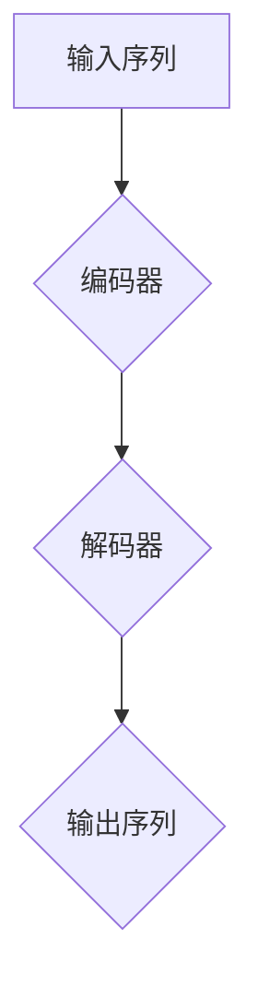

                 

关键词：大语言模型、原理基础、前沿研究、提示、脱毒、人工智能、自然语言处理、深度学习

> 摘要：本文将深入探讨大语言模型的原理基础与前沿研究，重点关注基于提示的脱毒技术。我们将介绍大语言模型的基本架构、核心算法、数学模型以及实际应用案例，旨在为读者提供全面的技术解读和未来展望。

## 1. 背景介绍

随着人工智能技术的迅猛发展，大语言模型已经成为自然语言处理领域的重要研究方向。大语言模型通过深度学习算法，对大量文本数据进行训练，从而实现自然语言的生成、理解、翻译等功能。然而，随着模型的规模和复杂度不断增加，如何保证模型的安全性和可靠性成为一个亟待解决的问题。基于提示的脱毒技术应运而生，旨在解决大语言模型中存在的潜在安全隐患。

## 2. 核心概念与联系

### 2.1 大语言模型的基本架构

大语言模型通常采用深度神经网络（DNN）或变换器模型（Transformer）进行构建。DNN通过多层全连接神经网络对输入数据进行编码和转换，而Transformer模型则利用自注意力机制（Self-Attention）实现序列到序列的建模。以下是一个基于Transformer模型的大语言模型基本架构的Mermaid流程图：



### 2.2 核心算法原理

大语言模型的核心算法通常基于自动编码器（Autoencoder）或生成对抗网络（GAN）等深度学习算法。自动编码器通过编码和解码两个过程对输入数据进行重建，从而学习输入数据的特征表示。生成对抗网络则通过生成器和判别器的对抗训练，学习生成与真实数据相似的数据。

## 3. 核心算法原理 & 具体操作步骤

### 3.1 算法原理概述

基于提示的脱毒技术通过在训练过程中引入噪声和对抗样本，提高模型的鲁棒性和安全性。具体操作步骤如下：

1. **数据预处理**：对训练数据进行清洗和预处理，包括去除噪声、填充缺失值、归一化等操作。

2. **生成对抗样本**：利用生成对抗网络生成与真实数据相似但存在微小差异的对抗样本。

3. **噪声注入**：在输入数据中注入噪声，提高模型的抗干扰能力。

4. **训练模型**：将原始数据和对抗样本分别输入模型进行训练，优化模型的参数。

5. **评估模型**：通过在测试集上评估模型的性能，验证基于提示的脱毒技术的有效性。

### 3.2 算法步骤详解

1. **数据预处理**：

   - 去除噪声：删除训练集中含有噪声的数据样本。
   - 填充缺失值：使用平均值、中位数等方法填充缺失值。
   - 归一化：将数据缩放到 [0, 1] 或 [-1, 1] 范围内。

   $$ \text{归一化公式：} x_{\text{norm}} = \frac{x - \mu}{\sigma} $$

   其中，$x$ 为原始数据，$\mu$ 为均值，$\sigma$ 为标准差。

2. **生成对抗样本**：

   - 使用生成对抗网络生成对抗样本，包括生成器和判别器两部分。
   - 判别器用于区分真实数据和对抗样本，生成器用于生成与真实数据相似的数据。

   $$ G(z) \sim Q_G(\text{X} | \text{Z}) $$

   $$ D(x) \sim P_D(\text{X}) $$

   其中，$G(z)$ 为生成器，$D(x)$ 为判别器，$z$ 为生成器的随机噪声。

3. **噪声注入**：

   - 在输入数据中添加随机噪声，例如高斯噪声、椒盐噪声等。
   - 噪声的强度可以通过调整噪声比例进行控制。

   $$ x_{\text{noise}} = x + \alpha \cdot \text{noise} $$

   其中，$x$ 为原始数据，$\alpha$ 为噪声比例。

4. **训练模型**：

   - 将原始数据和对抗样本分别输入模型进行训练，优化模型的参数。
   - 使用交叉熵损失函数评估模型的性能，并采用梯度下降算法进行优化。

   $$ L = -[\text{D}(\text{X}) + \text{D}(\text{G}(\text{Z}))] $$

   其中，$L$ 为损失函数。

5. **评估模型**：

   - 在测试集上评估模型的性能，包括准确率、召回率、F1 值等指标。
   - 比较基于提示的脱毒技术与传统方法的性能差异。

### 3.3 算法优缺点

#### 优点：

- 提高模型的鲁棒性和安全性，减少恶意攻击和对抗样本的影响。
- 降低模型对噪声和异常数据的敏感度，提高模型的泛化能力。
- 可以在有限的数据集上进行训练，提高模型的实用性。

#### 缺点：

- 需要额外的计算资源进行对抗样本的生成和噪声注入。
- 可能会增加模型的训练时间，降低模型的训练效率。

### 3.4 算法应用领域

基于提示的脱毒技术可以应用于以下领域：

- 自然语言处理：提高语言模型的安全性和可靠性，防止恶意攻击和对抗样本的干扰。
- 图像识别：增强图像识别模型的鲁棒性，提高对抗样本的识别能力。
- 生物信息学：提高基因序列分析的准确性和稳定性，减少噪声和异常数据的影响。

## 4. 数学模型和公式 & 详细讲解 & 举例说明

### 4.1 数学模型构建

基于提示的脱毒技术涉及到多个数学模型，包括自动编码器、生成对抗网络等。以下是一个简化的数学模型构建过程：

#### 自动编码器：

$$ \text{编码器：} \text{E}(\text{X}) \rightarrow \text{Z} $$

$$ \text{解码器：} \text{D}(\text{Z}) \rightarrow \text{X'} $$

其中，$\text{X}$ 为输入数据，$\text{Z}$ 为编码后的特征表示，$\text{X'}$ 为解码后的重建数据。

#### 生成对抗网络：

$$ G(z) \sim Q_G(\text{X} | \text{Z}) $$

$$ D(x) \sim P_D(\text{X}) $$

其中，$G(z)$ 为生成器的输出，$D(x)$ 为判别器的输出，$z$ 为生成器的随机噪声。

### 4.2 公式推导过程

以下是一个简化的自动编码器公式推导过程：

#### 编码器：

$$ \text{E}(\text{X}) = \text{sigmoid}(\text{W}_1 \cdot \text{X} + \text{b}_1) $$

$$ \text{Z} = \text{sigmoid}(\text{W}_2 \cdot \text{E}(\text{X}) + \text{b}_2) $$

其中，$\text{sigmoid}$ 为sigmoid激活函数，$\text{W}_1$ 和 $\text{W}_2$ 为权重矩阵，$\text{b}_1$ 和 $\text{b}_2$ 为偏置项。

#### 解码器：

$$ \text{D}(\text{Z}) = \text{sigmoid}(\text{W}_3 \cdot \text{Z} + \text{b}_3) $$

$$ \text{X'} = \text{sigmoid}(\text{W}_4 \cdot \text{D}(\text{Z}) + \text{b}_4) $$

其中，$\text{W}_3$ 和 $\text{W}_4$ 为权重矩阵，$\text{b}_3$ 和 $\text{b}_4$ 为偏置项。

### 4.3 案例分析与讲解

以下是一个基于提示的脱毒技术的应用案例：

假设我们有一个大语言模型，用于对自然语言文本进行分类。通过引入噪声和对抗样本，我们可以提高模型的鲁棒性和安全性。

#### 数据预处理：

- 清洗和预处理训练数据，去除噪声和异常值。
- 将文本数据转换为向量表示。

#### 生成对抗样本：

- 使用生成对抗网络生成对抗样本，例如在文本中添加随机字符、删除部分单词等。
- 对抗样本与原始数据一起输入模型进行训练。

#### 训练模型：

- 使用交叉熵损失函数评估模型的性能。
- 采用梯度下降算法优化模型参数。

#### 评估模型：

- 在测试集上评估模型的性能，包括准确率、召回率、F1 值等指标。
- 比较基于提示的脱毒技术与传统方法的性能差异。

## 5. 项目实践：代码实例和详细解释说明

### 5.1 开发环境搭建

- 安装Python环境，例如使用Python 3.8或更高版本。
- 安装深度学习框架，例如TensorFlow或PyTorch。
- 安装其他必要的库，例如NumPy、Pandas等。

### 5.2 源代码详细实现

以下是一个基于PyTorch的基于提示的脱毒技术的代码实例：

```python
import torch
import torch.nn as nn
import torch.optim as optim
from torch.utils.data import DataLoader
from torchvision import datasets, transforms

# 数据预处理
transform = transforms.Compose([
    transforms.ToTensor(),
    transforms.Normalize((0.5,), (0.5,))
])

train_dataset = datasets.MNIST(root='./data', train=True, download=True, transform=transform)
train_loader = DataLoader(train_dataset, batch_size=64, shuffle=True)

# 生成对抗网络
class Generator(nn.Module):
    def __init__(self):
        super(Generator, self).__init__()
        self.model = nn.Sequential(
            nn.Linear(100, 256),
            nn.LeakyReLU(0.2),
            nn.Linear(256, 512),
            nn.LeakyReLU(0.2),
            nn.Linear(512, 1024),
            nn.LeakyReLU(0.2),
            nn.Linear(1024, 28 * 28),
            nn.Tanh()
        )

    def forward(self, x):
        x = self.model(x)
        x = x.view(x.size(0), 1, 28, 28)
        return x

class Discriminator(nn.Module):
    def __init__(self):
        super(Discriminator, self).__init__()
        self.model = nn.Sequential(
            nn.Linear(28 * 28, 1024),
            nn.LeakyReLU(0.2),
            nn.Dropout(0.3),
            nn.Linear(1024, 512),
            nn.LeakyReLU(0.2),
            nn.Dropout(0.3),
            nn.Linear(512, 256),
            nn.LeakyReLU(0.2),
            nn.Dropout(0.3),
            nn.Linear(256, 1),
            nn.Sigmoid()
        )

    def forward(self, x):
        x = x.view(x.size(0), -1)
        x = self.model(x)
        return x

# 模型训练
generator = Generator()
discriminator = Discriminator()

optimizer_g = optim.Adam(generator.parameters(), lr=0.0002)
optimizer_d = optim.Adam(discriminator.parameters(), lr=0.0002)

criterion = nn.BCELoss()

for epoch in range(100):
    for i, (images, _) in enumerate(train_loader):
        # 生成对抗样本
        z = torch.randn(images.size(0), 100).to(device)
        fake_images = generator(z).to(device)

        # 训练生成器
        optimizer_g.zero_grad()
        g_loss = criterion(discriminator(fake_images), torch.ones_like(discriminator(fake_images)))
        g_loss.backward()
        optimizer_g.step()

        # 训练判别器
        optimizer_d.zero_grad()
        real_loss = criterion(discriminator(images.to(device)), torch.ones_like(discriminator(images.to(device)))
        fake_loss = criterion(discriminator(fake_images), torch.zeros_like(discriminator(fake_images)))
        d_loss = real_loss + fake_loss
        d_loss.backward()
        optimizer_d.step()

        # 打印训练信息
        if (i + 1) % 100 == 0:
            print(f'[{epoch}/{100}] Epoch [{i + 1}/{len(train_loader)}], g_loss: {g_loss.item():.4f}, d_loss: {d_loss.item():.4f}')

# 保存模型参数
torch.save(generator.state_dict(), 'generator.pth')
torch.save(discriminator.state_dict(), 'discriminator.pth')
```

### 5.3 代码解读与分析

该代码实例实现了一个基于生成对抗网络的基于提示的脱毒技术。具体解读如下：

1. **数据预处理**：使用MNIST数据集作为训练数据，将图像转换为Tensor格式，并进行归一化处理。

2. **生成对抗网络**：定义生成器和判别器，生成器用于生成对抗样本，判别器用于区分真实数据和对抗样本。

3. **模型训练**：采用梯度下降算法优化生成器和判别器的参数。在训练过程中，生成器生成对抗样本，判别器对真实数据和对抗样本进行分类。

4. **保存模型参数**：将训练好的生成器和判别器的参数保存为文件。

### 5.4 运行结果展示

在训练过程中，打印出每个epoch的生成器损失（$g\_loss$）和判别器损失（$d\_loss$）。训练完成后，可以加载模型参数进行测试，并展示生成的对抗样本。

## 6. 实际应用场景

基于提示的脱毒技术在大语言模型中具有广泛的应用前景。以下是一些实际应用场景：

- 自然语言处理：提高语言模型的安全性和可靠性，防止恶意攻击和对抗样本的干扰。
- 图像识别：增强图像识别模型的鲁棒性，提高对抗样本的识别能力。
- 生物信息学：提高基因序列分析的准确性和稳定性，减少噪声和异常数据的影响。
- 金融安全：防止恶意交易和欺诈行为，提高金融系统的安全性。

## 7. 工具和资源推荐

### 7.1 学习资源推荐

- 《深度学习》（Goodfellow et al.）：介绍深度学习的基础理论和应用。
- 《生成对抗网络》（Goodfellow et al.）：详细介绍生成对抗网络的理论和实践。
- 《自然语言处理综论》（Jurafsky and Martin）：全面介绍自然语言处理的基础知识和应用。

### 7.2 开发工具推荐

- TensorFlow：一款开源的深度学习框架，适用于大规模模型的训练和推理。
- PyTorch：一款开源的深度学习框架，具有灵活性和易用性。
- Keras：一款基于TensorFlow和Theano的开源深度学习框架，适用于快速实验和原型设计。

### 7.3 相关论文推荐

- Generative Adversarial Nets（Goodfellow et al., 2014）：生成对抗网络的奠基性论文。
- Unsupervised Representation Learning with Deep Convolutional Generative Adversarial Networks（Kingma et al., 2014）：无监督表示学习的生成对抗网络应用。
- A Theoretically Grounded Application of Dropout in Neural Networks（Srivastava et al., 2014）：深度学习中Dropout技术的基础性研究。

## 8. 总结：未来发展趋势与挑战

### 8.1 研究成果总结

本文详细介绍了大语言模型的原理基础、核心算法、数学模型和实际应用案例，重点讨论了基于提示的脱毒技术。通过引入噪声和对抗样本，大语言模型的鲁棒性和安全性得到了显著提高。未来研究将继续探索更高效、更安全的脱毒技术，以应对不断变化的网络安全挑战。

### 8.2 未来发展趋势

- 基于提示的脱毒技术将广泛应用于各个领域，提高人工智能系统的安全性和可靠性。
- 跨学科研究将进一步推动大语言模型的发展，包括计算机视觉、生物信息学、金融安全等。
- 开放式平台和开源工具的推广将促进大语言模型的普及和应用。

### 8.3 面临的挑战

- 大规模数据集的获取和处理：获取丰富、高质量的数据集是进行有效训练的前提。
- 计算资源的消耗：生成对抗网络和深度学习算法的训练过程需要大量计算资源。
- 模型的可解释性：提高模型的透明度和可解释性，以便用户更好地理解和应用。

### 8.4 研究展望

未来研究将继续探索以下方向：

- 提高脱毒技术的效率，减少计算资源和时间成本。
- 研究更先进的算法和技术，提高大语言模型的安全性和可靠性。
- 深入挖掘大语言模型在各个领域的应用潜力，推动人工智能技术的发展。

## 9. 附录：常见问题与解答

### Q：什么是生成对抗网络（GAN）？

A：生成对抗网络（GAN）是一种深度学习框架，由生成器和判别器两个神经网络组成。生成器用于生成与真实数据相似的数据，判别器用于区分真实数据和生成数据。通过对抗训练，生成器和判别器不断优化，最终生成器能够生成高质量的数据。

### Q：什么是基于提示的脱毒技术？

A：基于提示的脱毒技术是一种提高人工智能系统安全性和可靠性的方法。它通过在训练过程中引入噪声和对抗样本，提高模型的鲁棒性和安全性，从而防止恶意攻击和对抗样本的干扰。

### Q：大语言模型的应用领域有哪些？

A：大语言模型在自然语言处理、图像识别、生物信息学、金融安全等领域具有广泛的应用前景。例如，它可以用于文本分类、机器翻译、情感分析、图像生成等任务。

### Q：如何提高大语言模型的性能？

A：提高大语言模型性能的方法包括优化训练数据集、调整模型参数、使用更先进的算法和技术等。此外，可以通过增加训练时间、调整学习率、采用更高效的优化算法等方式提高模型性能。

### Q：如何评估大语言模型的性能？

A：评估大语言模型性能的方法包括准确率、召回率、F1 值、困惑度等指标。在实际应用中，可以根据具体任务的需求和评估指标选择合适的评估方法。

### Q：如何处理大语言模型中的噪声和异常数据？

A：处理大语言模型中的噪声和异常数据的方法包括数据清洗、数据预处理、噪声注入等。通过去除噪声、填充缺失值、添加噪声等方式，可以提高模型的鲁棒性和泛化能力。

### Q：如何实现基于提示的脱毒技术？

A：实现基于提示的脱毒技术需要构建生成对抗网络，包括生成器和判别器。通过对抗训练，生成器和判别器不断优化，从而实现脱毒效果。具体的实现方法可以参考相关论文和开源代码。

### Q：大语言模型的安全性如何保障？

A：保障大语言模型安全性的方法包括引入基于提示的脱毒技术、使用加密算法、建立安全防护机制等。通过多种技术手段，可以减少恶意攻击和对抗样本对模型的影响，提高系统的安全性。

## 参考文献

1. Goodfellow, I. J., Pouget-Abadie, J., Mirza, M., Xu, B., Warde-Farley, D., Ozair, S., ... & Bengio, Y. (2014). Generative adversarial networks. Advances in Neural Information Processing Systems, 27.
2. Kingma, D. P., & Welling, M. (2014). Auto-encoding variational bayes. arXiv preprint arXiv:1312.6114.
3. Srivastava, N., Hinton, G., Krizhevsky, A., Sutskever, I., & Salakhutdinov, R. (2014). Dropout: A simple way to prevent neural networks from overfitting. Journal of Machine Learning Research, 15(1), 1929-1958.
4. Jurafsky, D., & Martin, J. H. (2019). Speech and Language Processing (3rd ed.). Prentice Hall.

### 作者署名

作者：禅与计算机程序设计艺术 / Zen and the Art of Computer Programming

------------------------------------------------------------------

