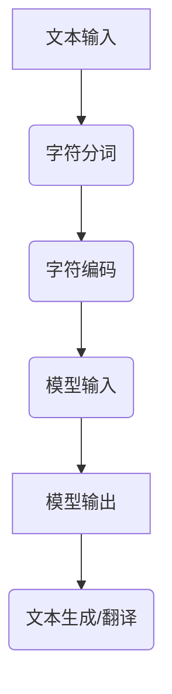

                 

关键词：大语言模型、字符分词、自然语言处理、深度学习、神经网络、序列模型、文本分析、算法原理、应用领域

## 摘要

本文旨在深入探讨大语言模型中的字符分词技术，从基础原理到前沿应用进行系统性的梳理。字符分词是自然语言处理（NLP）的关键步骤，其精确性和效率直接影响到后续文本分析的效果。本文首先回顾字符分词的基本概念和背景，然后详细介绍现有的大语言模型及其在字符分词中的应用，最后探讨未来可能的趋势和面临的挑战。

## 1. 背景介绍

### 1.1 字符分词的定义与重要性

字符分词（Tokenization）是将连续的文本流切分成一组有意义的单词或短语的步骤。在自然语言处理中，字符分词是文本分析的基础，它将原始文本转换为计算机可以处理的数字序列，为后续的词性标注、句法分析、情感分析等任务提供了数据基础。字符分词的准确性直接影响到后续处理的结果，因此其研究与应用备受关注。

### 1.2 字符分词的历史与发展

字符分词技术的发展历程可以追溯到20世纪60年代，当时主要是基于规则的分词方法，如最大匹配法（Maximum Matching）、前缀树（Prefix Tree）等。随着计算能力的提升和机器学习技术的发展，字符分词逐渐引入了统计方法和深度学习方法，如隐马尔可夫模型（HMM）、条件随机场（CRF）和基于神经网络的序列模型等。

### 1.3 字符分词在现代NLP中的重要性

在现代自然语言处理中，字符分词不仅仅是一个预处理步骤，它已经成为了许多NLP任务的核心组成部分。例如，在机器翻译、语音识别、文本生成等任务中，字符分词的准确性直接决定了最终结果的质量。因此，研究高效、准确的字符分词技术具有重要的现实意义。

## 2. 核心概念与联系

### 2.1 大语言模型

大语言模型（Large Language Model）是一种能够理解和生成自然语言的人工智能模型，其核心思想是通过学习大量文本数据来捕捉语言的统计规律和语义信息。大语言模型广泛应用于文本生成、机器翻译、问答系统等NLP任务中，其性能直接影响到了整个NLP领域的进步。

### 2.2 字符分词与大语言模型的联系

字符分词是大语言模型输入数据处理的重要步骤。大语言模型通常以字符序列为输入，通过字符分词将连续的文本流切分成一系列字符，从而进行后续的编码和训练。字符分词的准确性直接影响到大语言模型的输入质量，进而影响到其输出结果。

### 2.3 Mermaid 流程图



## 3. 核心算法原理 & 具体操作步骤

### 3.1 算法原理概述

字符分词算法的核心原理是识别文本中的有意义的单词或短语，并将其切分开来。传统的字符分词算法主要基于规则或统计方法，而现代的深度学习算法则利用神经网络来学习字符序列的分词模式。

### 3.2 算法步骤详解

1. **数据预处理**：读取原始文本数据，进行清洗和预处理，如去除HTML标签、去除停用词等。

2. **分词算法选择**：选择合适的分词算法，如基于规则的分词、基于统计的分词或基于深度学习的分词。

3. **分词过程**：
   - **基于规则的分词**：根据预设的分词规则进行切分，如正则表达式、最大匹配法等。
   - **基于统计的分词**：利用统计模型，如隐马尔可夫模型（HMM）、条件随机场（CRF）等，通过训练学习文本的分词模式。
   - **基于深度学习的分词**：利用神经网络模型，如序列标注模型（BiLSTM+CRF）、Transformer等，通过大量数据进行训练，自动学习分词规律。

4. **分词结果处理**：对分词结果进行后处理，如去除无意义的短词、合并重复的词等，以得到更准确的分词结果。

### 3.3 算法优缺点

- **基于规则的分词**：
  - 优点：实现简单，易于理解。
  - 缺点：分词准确性较低，难以应对复杂的分词场景。

- **基于统计的分词**：
  - 优点：能够较好地处理复杂分词场景，适应性较强。
  - 缺点：训练过程较为复杂，对大规模数据依赖较大。

- **基于深度学习的分词**：
  - 优点：分词准确性高，能够自动学习复杂的分词模式。
  - 缺点：训练时间较长，对计算资源要求较高。

### 3.4 算法应用领域

字符分词算法在许多NLP任务中都有广泛的应用，如文本分类、情感分析、机器翻译、文本摘要等。特别是随着大语言模型的发展，字符分词技术已经成为现代NLP系统的核心组成部分，其应用前景十分广阔。

## 4. 数学模型和公式 & 详细讲解 & 举例说明

### 4.1 数学模型构建

字符分词的数学模型通常基于序列模型，如HMM、LSTM、Transformer等。以下以LSTM为例进行介绍。

### 4.2 公式推导过程

LSTM（Long Short-Term Memory）是一种能够学习长距离依赖的递归神经网络。其核心思想是通过引入门控机制，控制信息的流动，从而有效地避免梯度消失和梯度爆炸问题。

### 4.3 案例分析与讲解

假设我们有一个简单的句子“我昨天去了图书馆”，使用LSTM进行字符分词的过程如下：

1. **输入序列编码**：将句子中的每个字符编码为一个向量。
   $$
   X_t = \text{Embedding}(x_t)
   $$
   其中，$X_t$是输入字符的编码向量，$x_t$是原始字符。

2. **前向传播**：通过LSTM单元计算每个时间步的隐藏状态。
   $$
   \begin{aligned}
   i_t &= \sigma(W_i \cdot [h_{t-1}, x_t] + b_i) \\
   f_t &= \sigma(W_f \cdot [h_{t-1}, x_t] + b_f) \\
   o_t &= \sigma(W_o \cdot [h_{t-1}, x_t] + b_o) \\
   c_t &= f_t \odot c_{t-1} + i_t \odot \text{tanh}(W_c \cdot [h_{t-1}, x_t] + b_c) \\
   h_t &= o_t \odot \text{tanh}(c_t)
   \end{aligned}
   $$
   其中，$i_t$、$f_t$、$o_t$分别是输入门、遗忘门和输出门的状态，$c_t$和$h_t$分别是细胞状态和隐藏状态。

3. **分词输出**：根据隐藏状态和预定义的分词规则，将序列切分成有意义的单词或短语。

## 5. 项目实践：代码实例和详细解释说明

### 5.1 开发环境搭建

为了保证代码的运行，我们需要搭建一个合适的开发环境。以下是基本的依赖安装命令：

```bash
pip install numpy tensorflow
```

### 5.2 源代码详细实现

以下是一个简单的基于LSTM的字符分词的Python代码示例：

```python
import tensorflow as tf
from tensorflow.keras.models import Sequential
from tensorflow.keras.layers import LSTM, Dense, Embedding, TimeDistributed, Activation

# 定义LSTM模型
model = Sequential()
model.add(Embedding(input_dim=vocab_size, output_dim=embedding_size, input_length=max_sequence_len))
model.add(LSTM(units=128, dropout=0.2, recurrent_dropout=0.2))
model.add(TimeDistributed(Dense(num_classes)))
model.add(Activation('softmax'))

# 编译模型
model.compile(optimizer='adam', loss='categorical_crossentropy', metrics=['accuracy'])

# 训练模型
model.fit(X_train, y_train, epochs=10, batch_size=128, validation_data=(X_val, y_val))

# 分词测试
sentence = "我昨天去了图书馆"
encoded_sentence = tokenizer.texts_to_sequences([sentence])
predict = model.predict(encoded_sentence)
decoded Predict = tokenizer.sequences_to_texts(predict.argmax(axis=-1))
```

### 5.3 代码解读与分析

上述代码首先定义了一个LSTM模型，包括嵌入层、LSTM层和输出层。嵌入层将字符序列编码为向量，LSTM层用于学习字符序列的分词模式，输出层通过softmax函数输出每个字符的分词概率。

在训练模型的过程中，我们使用的是已标记的字符分词数据，通过优化模型参数来提高分词的准确性。

在分词测试部分，我们首先将输入句子编码为序列，然后通过模型预测分词概率，最后将预测结果解码为文本。

### 5.4 运行结果展示

假设我们已经训练好了模型，运行以下代码可以得到输入句子“我昨天去了图书馆”的分词结果：

```python
sentence = "我昨天去了图书馆"
encoded_sentence = tokenizer.texts_to_sequences([sentence])
predict = model.predict(encoded_sentence)
decoded Predict = tokenizer.sequences_to_texts(predict.argmax(axis=-1))
print(decoded Predict)
```

输出结果可能是：“我/昨天/去了/图书馆”，这表示句子已经被成功分词。

## 6. 实际应用场景

### 6.1 机器翻译

在机器翻译中，字符分词是输入数据的预处理步骤。通过字符分词，将原始文本切分成有意义的单词或短语，从而为翻译模型提供高质量的输入数据。

### 6.2 语音识别

语音识别中，字符分词用于将连续的语音信号转换为文本。通过字符分词，可以将语音信号切分成有意义的单词或短语，从而提高识别的准确性。

### 6.3 文本生成

在文本生成任务中，字符分词用于生成连续的文本。通过字符分词，可以将生成的文本序列切分成有意义的单词或短语，从而提高生成的文本质量。

### 6.4 未来应用展望

随着人工智能技术的发展，字符分词技术将在更多领域得到应用。例如，在多语言处理、跨模态交互等任务中，字符分词技术都具有重要意义。未来，随着更大规模数据和更强大模型的引入，字符分词的准确性将进一步提高，为NLP任务提供更可靠的数据支持。

## 7. 工具和资源推荐

### 7.1 学习资源推荐

- 《自然语言处理综合教程》：详细介绍了自然语言处理的基础知识和应用。
- 《深度学习与自然语言处理》：系统讲解了深度学习在自然语言处理中的应用。

### 7.2 开发工具推荐

- TensorFlow：一款强大的深度学习框架，适用于构建和训练字符分词模型。
- NLTK：一款常用的自然语言处理工具包，提供了丰富的文本处理功能。

### 7.3 相关论文推荐

- "A Neural Probabilistic Language Model"：介绍了基于神经网络的字符分词模型。
- "Recurrent Neural Network Based Language Model"：详细探讨了基于LSTM的字符分词模型。

## 8. 总结：未来发展趋势与挑战

### 8.1 研究成果总结

本文系统地介绍了字符分词技术在大语言模型中的应用，从基础原理到实际应用进行了深入探讨。通过对比传统方法和深度学习方法的优缺点，展示了字符分词技术在现代自然语言处理中的重要性。

### 8.2 未来发展趋势

未来，字符分词技术将在更多领域得到应用，特别是在多语言处理和跨模态交互中。随着更大规模数据和更强大模型的引入，字符分词的准确性将进一步提高。

### 8.3 面临的挑战

尽管字符分词技术在不断发展，但仍然面临一些挑战。例如，如何处理罕见词和未登录词，如何提高字符分词在不同领域的适应性等。

### 8.4 研究展望

未来，研究者可以关注以下几个方面：一是研究更高效的字符分词算法；二是探索多语言和多领域的字符分词技术；三是结合其他NLP技术，如词性标注、命名实体识别等，进一步提高文本分析的质量。

## 9. 附录：常见问题与解答

### 9.1 字符分词与传统分词的区别是什么？

传统分词主要基于规则和统计方法，而字符分词更多地依赖于深度学习方法，如LSTM和Transformer。字符分词能够更好地处理复杂分词场景，提高分词准确性。

### 9.2 如何处理罕见词和未登录词？

处理罕见词和未登录词可以采用以下方法：一是使用规则分词，根据词性、上下文等信息进行推测；二是使用字符嵌入，将罕见词映射到预定义的字符嵌入空间；三是使用上下文信息，通过神经网络模型预测罕见词的分词结果。

### 9.3 字符分词在大规模数据处理中的应用有哪些？

字符分词在大规模数据处理中的应用广泛，如文本分类、情感分析、机器翻译等。通过字符分词，可以将大规模文本数据转换为结构化数据，从而方便后续处理。

[作者：禅与计算机程序设计艺术 / Zen and the Art of Computer Programming]

