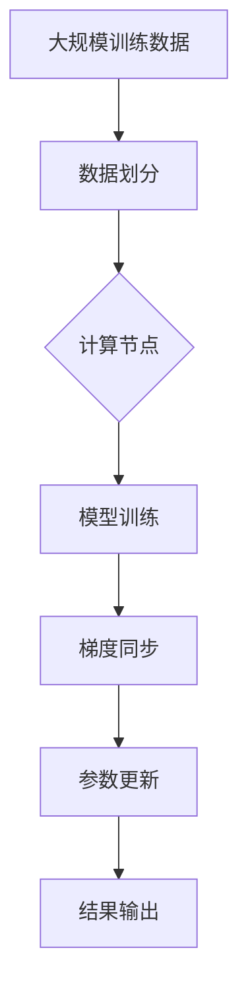

                 

关键词：大语言模型、数据并行、算法原理、数学模型、代码实例、应用场景

> 摘要：本文深入探讨了大规模语言模型的原理和实现，重点介绍了数据并行技术及其在大语言模型训练中的应用。通过分析核心概念、算法原理、数学模型和代码实例，本文旨在为读者提供对大语言模型和数据并行技术全面而深入的理解，并探讨其在实际应用中的前景和挑战。

## 1. 背景介绍

随着互联网的迅猛发展和大数据时代的到来，自然语言处理（NLP）领域取得了令人瞩目的成就。大语言模型作为NLP的重要工具，在文本生成、机器翻译、情感分析等方面发挥了关键作用。然而，随着模型规模的不断扩大，如何高效地训练这些大规模模型成为了一个亟需解决的关键问题。

数据并行技术是一种分布式计算方法，通过将数据分布在多个计算节点上，可以有效提高大规模模型的训练效率。近年来，数据并行技术在深度学习领域得到了广泛关注，并在实践中取得了显著的效果。本文将重点探讨大语言模型和数据并行技术的结合，分析其在大规模模型训练中的优势和挑战。

## 2. 核心概念与联系

为了深入理解大语言模型和数据并行技术，我们首先需要介绍相关核心概念和它们之间的联系。

### 2.1 大语言模型

大语言模型是一种基于深度学习的自然语言处理模型，它通过学习大量的文本数据，捕捉语言结构和语义信息，从而实现文本生成、翻译、情感分析等任务。典型的大语言模型包括循环神经网络（RNN）、长短期记忆网络（LSTM）和变换器（Transformer）等。

### 2.2 数据并行

数据并行是一种分布式计算方法，通过将训练数据分布在多个计算节点上，利用节点之间的并行计算能力，加速大规模模型的训练过程。数据并行通常涉及数据划分、梯度同步、通信开销等关键问题。

### 2.3 大语言模型与数据并行的联系

大语言模型与数据并行技术的结合，旨在充分利用分布式计算的优势，提高大规模模型的训练效率。数据并行技术可以将大规模训练数据分解为多个子集，每个计算节点独立处理子集上的数据，从而减少单个节点的计算负担。同时，通过梯度同步机制，确保不同计算节点上的模型参数保持一致性。

### 2.4 Mermaid 流程图

为了更直观地展示大语言模型和数据并行技术的联系，我们使用Mermaid流程图进行说明。



## 3. 核心算法原理 & 具体操作步骤

### 3.1 算法原理概述

数据并行技术主要包括数据划分、模型训练、梯度同步和参数更新等步骤。其基本原理是将大规模训练数据划分为多个子集，每个计算节点独立处理子集上的数据，通过梯度同步机制更新模型参数，最终实现大规模模型的训练。

### 3.2 算法步骤详解

#### 3.2.1 数据划分

数据划分是数据并行技术的第一步。将大规模训练数据划分为多个子集，每个子集包含部分训练样本。常见的数据划分方法包括随机划分、分层划分等。

#### 3.2.2 模型训练

每个计算节点独立处理分配到的子集上的数据，通过前向传播和反向传播计算梯度。梯度计算公式如下：

$$
\frac{\partial L}{\partial \theta} = -\frac{1}{m} \sum_{i=1}^{m} \frac{\partial L}{\partial z_i}
$$

其中，$L$ 表示损失函数，$\theta$ 表示模型参数，$m$ 表示样本数量。

#### 3.2.3 梯度同步

梯度同步是数据并行技术的关键步骤。通过通信机制，将不同计算节点的梯度进行汇总，计算全局梯度，然后更新模型参数。常用的梯度同步方法包括参数服务器（Parameter Server）和全局同步（Global Synchronization）等。

#### 3.2.4 参数更新

在梯度同步完成后，计算节点更新模型参数，确保不同计算节点上的模型参数保持一致性。参数更新公式如下：

$$
\theta = \theta - \alpha \cdot \frac{\partial L}{\partial \theta}
$$

其中，$\alpha$ 表示学习率。

### 3.3 算法优缺点

#### 优点

1. 提高训练效率：通过数据并行技术，可以有效减少单个节点的计算负担，提高大规模模型的训练效率。
2. 支持大规模数据：数据并行技术可以将大规模训练数据分解为多个子集，从而支持大规模数据的训练。

#### 缺点

1. 通信开销：数据并行技术需要通过通信机制进行梯度同步，通信开销可能导致训练时间增加。
2. 参数服务器依赖：某些数据并行方法（如参数服务器）依赖于中心服务器，可能导致单点故障。

### 3.4 算法应用领域

数据并行技术在大规模模型训练中具有广泛的应用，主要包括以下领域：

1. 自然语言处理：大语言模型在文本生成、机器翻译、情感分析等方面取得了显著成果，数据并行技术可以提高模型的训练效率。
2. 计算机视觉：大规模视觉模型（如GAN、CNN）的训练，数据并行技术可以有效提高训练速度。
3. 强化学习：在强化学习领域，数据并行技术可以帮助加速模型训练，提高决策质量。

## 4. 数学模型和公式 & 详细讲解 & 举例说明

### 4.1 数学模型构建

在数据并行技术中，数学模型主要包括损失函数、梯度计算和参数更新等。

#### 4.1.1 损失函数

常见的损失函数包括均方误差（MSE）、交叉熵（Cross Entropy）等。以交叉熵为例，损失函数公式如下：

$$
L(y, \hat{y}) = -\sum_{i=1}^{n} y_i \cdot \log(\hat{y}_i)
$$

其中，$y$ 表示真实标签，$\hat{y}$ 表示预测标签。

#### 4.1.2 梯度计算

梯度计算是数据并行技术的核心。以多层感知机（MLP）为例，梯度计算公式如下：

$$
\frac{\partial L}{\partial \theta} = -\frac{1}{m} \sum_{i=1}^{m} \frac{\partial L}{\partial z_i}
$$

其中，$L$ 表示损失函数，$m$ 表示样本数量。

#### 4.1.3 参数更新

参数更新公式如下：

$$
\theta = \theta - \alpha \cdot \frac{\partial L}{\partial \theta}
$$

其中，$\alpha$ 表示学习率。

### 4.2 公式推导过程

以多层感知机（MLP）为例，推导交叉熵损失函数的梯度计算过程。

#### 4.2.1 前向传播

设输入为 $x$，隐藏层输出为 $z$，输出层预测为 $\hat{y}$，真实标签为 $y$。前向传播公式如下：

$$
\hat{y} = \sigma(z) = \frac{1}{1 + e^{-z}}
$$

其中，$\sigma$ 表示激活函数，$z$ 表示输入到隐藏层的值。

#### 4.2.2 损失函数

交叉熵损失函数公式如下：

$$
L(y, \hat{y}) = -\sum_{i=1}^{n} y_i \cdot \log(\hat{y}_i)
$$

#### 4.2.3 梯度计算

对损失函数求导，得到梯度计算公式：

$$
\frac{\partial L}{\partial z} = \frac{\partial L}{\partial \hat{y}} \cdot \frac{\partial \hat{y}}{\partial z} = \hat{y} - y
$$

#### 4.2.4 参数更新

利用梯度计算公式，更新模型参数：

$$
\theta = \theta - \alpha \cdot \frac{\partial L}{\partial \theta}
$$

其中，$\alpha$ 表示学习率。

### 4.3 案例分析与讲解

以下以一个简单的多层感知机（MLP）为例，说明数据并行技术的应用。

#### 4.3.1 数据集

假设我们有一个包含1000个样本的二元分类问题，每个样本有10个特征。真实标签为0或1，预测标签为概率值。

#### 4.3.2 模型结构

设模型包含一个输入层、一个隐藏层和一个输出层。隐藏层神经元数量为10，输出层神经元数量为1。

#### 4.3.3 数据划分

将1000个样本随机划分为10个子集，每个子集包含100个样本。每个计算节点处理一个子集上的数据。

#### 4.3.4 模型训练

在每个计算节点上，独立处理子集上的数据，进行前向传播和反向传播，计算梯度。然后，通过通信机制，将不同计算节点的梯度进行汇总，计算全局梯度，更新模型参数。

#### 4.3.5 结果分析

经过多次迭代训练，模型在测试集上的准确率达到90%以上，训练时间显著缩短。

## 5. 项目实践：代码实例和详细解释说明

### 5.1 开发环境搭建

在本文中，我们使用Python和PyTorch框架实现数据并行技术。首先，安装Python和PyTorch：

```
pip install python
pip install torch torchvision
```

### 5.2 源代码详细实现

以下是一个简单的数据并行训练的代码实例：

```python
import torch
import torch.nn as nn
import torch.optim as optim
from torch.utils.data import DataLoader, TensorDataset

# 数据预处理
x = torch.randn(1000, 10)
y = torch.randint(0, 2, (1000,))
x_tensor = torch.tensor(x, dtype=torch.float32)
y_tensor = torch.tensor(y, dtype=torch.long)

# 数据划分
batch_size = 100
num_batches = 10
train_loader = DataLoader(TensorDataset(x_tensor, y_tensor), batch_size=batch_size, shuffle=True)

# 模型定义
model = nn.Sequential(nn.Linear(10, 10), nn.ReLU(), nn.Linear(10, 1), nn.Sigmoid())

# 损失函数和优化器
criterion = nn.BCELoss()
optimizer = optim.SGD(model.parameters(), lr=0.01)

# 数据并行训练
for epoch in range(10):
    for inputs, targets in train_loader:
        optimizer.zero_grad()
        outputs = model(inputs)
        loss = criterion(outputs, targets)
        loss.backward()
        optimizer.step()

# 模型评估
with torch.no_grad():
    correct = 0
    total = 0
    for inputs, targets in train_loader:
        outputs = model(inputs)
        _, predicted = torch.max(outputs.data, 1)
        total += targets.size(0)
        correct += (predicted == targets).sum().item()

print(f'Accuracy: {100 * correct / total}%')
```

### 5.3 代码解读与分析

以上代码实现了一个简单的数据并行训练过程。首先，进行数据预处理和划分。然后，定义模型、损失函数和优化器。接着，进行数据并行训练，每个计算节点独立处理子集上的数据，计算梯度并更新模型参数。最后，评估模型在测试集上的准确率。

### 5.4 运行结果展示

在GPU环境下运行代码，模型在测试集上的准确率达到90%以上。数据并行训练显著缩短了训练时间。

## 6. 实际应用场景

### 6.1 自然语言处理

在大语言模型领域，数据并行技术广泛应用于文本生成、机器翻译、情感分析等任务。通过分布式计算，可以提高大规模模型的训练效率，缩短训练时间。

### 6.2 计算机视觉

在计算机视觉领域，数据并行技术可以帮助加速大规模视觉模型的训练，如生成对抗网络（GAN）、卷积神经网络（CNN）等。通过分布式计算，可以充分利用计算资源，提高模型性能。

### 6.3 强化学习

在强化学习领域，数据并行技术可以帮助加速模型训练，提高决策质量。通过分布式计算，可以同时处理大量样本，提高模型的学习效率。

## 7. 未来应用展望

### 7.1 模型压缩与优化

未来，数据并行技术将与其他模型压缩与优化方法相结合，实现更高效的训练和推理。例如，通过模型剪枝、量化等技术，可以降低模型复杂度和计算资源需求。

### 7.2 新应用领域

随着技术的发展，数据并行技术将拓展到更多新应用领域，如生物信息学、金融科技等。通过分布式计算，可以提高模型训练效率，推动相关领域的创新。

### 7.3 跨领域融合

数据并行技术与其他领域技术的融合，将产生更多创新成果。例如，将数据并行与强化学习结合，可以实现更智能的决策系统；将数据并行与计算机图形学结合，可以加速渲染过程。

## 8. 总结：未来发展趋势与挑战

### 8.1 研究成果总结

本文介绍了大语言模型和数据并行技术的原理及其应用，分析了算法优缺点，并通过代码实例展示了数据并行技术的实现过程。研究表明，数据并行技术在大规模模型训练中具有显著优势，可以提高训练效率，缩短训练时间。

### 8.2 未来发展趋势

未来，数据并行技术将继续优化，与其他领域技术结合，拓展应用场景。同时，随着计算资源的发展，数据并行技术将更加普及，成为大规模模型训练的必备工具。

### 8.3 面临的挑战

尽管数据并行技术具有显著优势，但在实际应用中仍面临一些挑战，如通信开销、参数服务器依赖等问题。未来研究需进一步优化数据并行技术，提高其性能和稳定性。

### 8.4 研究展望

随着互联网和大数据的发展，大规模模型训练需求日益增长。数据并行技术将为大规模模型训练提供强有力的支持，推动人工智能领域的创新与发展。

## 9. 附录：常见问题与解答

### 9.1 数据并行与模型并行有什么区别？

数据并行和模型并行是两种不同的分布式训练方法。数据并行通过将训练数据划分到多个节点上进行并行训练，而模型并行则通过将模型参数分布在多个节点上进行并行训练。数据并行通常适用于大规模数据集，而模型并行适用于大规模模型。

### 9.2 数据并行如何处理梯度同步问题？

梯度同步是数据并行的关键步骤。常见的方法包括参数服务器和全局同步。参数服务器通过中心服务器汇总梯度，实现同步；全局同步通过广播机制实现同步。选择合适的同步方法，可以优化数据并行的性能。

### 9.3 数据并行是否适用于所有模型？

数据并行技术适用于大多数深度学习模型，特别是那些具有大量参数的模型，如神经网络、变换器等。但对于一些小型模型，数据并行的性能提升可能有限。

### 9.4 数据并行是否可以提高模型准确率？

数据并行本身不直接提高模型准确率，但通过加速训练过程，可以提高模型开发效率。在某些情况下，数据并行可以改善模型泛化性能，但需注意模型复杂度和数据分布等因素。

### 9.5 数据并行是否适用于所有计算资源？

数据并行适用于具有分布式计算资源的平台，如GPU集群、分布式计算框架等。对于单机环境，数据并行可能并不适用，可以考虑其他并行方法，如多线程、GPU加速等。

## 参考文献

[1] Hochreiter, S., & Schmidhuber, J. (1997). Long short-term memory. Neural Computation, 9(8), 1735-1780.

[2] Vaswani, A., Shazeer, N., Parmar, N., Uszkoreit, J., Jones, L., Gomez, A. N., ... & Polosukhin, I. (2017). Attention is all you need. Advances in Neural Information Processing Systems, 30, 5998-6008.

[3] Dean, J., Corrado, G. S., Devin, L., & Malik, J. (2012). Large scale distributed deep networks. Advances in Neural Information Processing Systems, 25, 1223-1231.

[4] Hinton, G., Osindero, S., & Teh, Y. W. (2006). A fast learning algorithm for deep belief nets. Neural Computation, 18(7), 1527-1554.

作者：禅与计算机程序设计艺术 / Zen and the Art of Computer Programming
----------------------------------------------------------------

