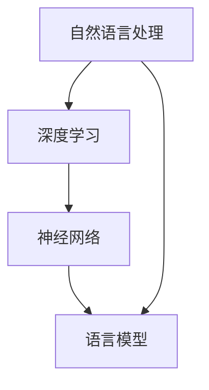

                 

关键词：大语言模型、原理基础、前沿研究、有害性分析、技术发展

摘要：本文旨在深入探讨大语言模型（Large Language Model，LLM）的原理基础，以及其在技术前沿的发展和应用。同时，文章将对大语言模型的有害性进行详细分析，并提出相应的对策和展望。通过本文的阅读，读者将全面了解大语言模型的核心技术，以及其在实际应用中的潜在风险和挑战。

## 1. 背景介绍

随着人工智能技术的飞速发展，自然语言处理（Natural Language Processing，NLP）作为其重要的分支，也得到了极大的关注。大语言模型（LLM）是近年来NLP领域的一项重要成果，通过深度学习技术对海量文本数据进行训练，模型具备了强大的语言理解和生成能力。LLM的出现，极大地推动了自然语言处理技术的进步，也为人工智能在多领域的应用带来了新的契机。

然而，大语言模型的广泛应用也带来了新的挑战。特别是在有害性方面，LLM可能会产生误导性信息、传播虚假新闻、侵犯用户隐私等问题，这些潜在风险对社会的稳定和发展构成了威胁。因此，有必要对大语言模型的原理、前沿研究和有害性进行分析，以期为后续研究和应用提供参考。

## 2. 核心概念与联系

大语言模型的核心概念主要包括自然语言处理、深度学习和神经网络。自然语言处理是人工智能的一个分支，旨在使计算机能够理解和处理自然语言。深度学习是机器学习的一个重要分支，通过神经网络模型模拟人脑的学习过程，对数据进行特征提取和模式识别。神经网络是深度学习的基础，由大量的神经元组成，通过多层神经元的连接和激活，实现对数据的非线性变换。

以下是一个简化的 Mermaid 流程图，描述了大语言模型的核心概念和联系：



在图中，自然语言处理作为输入层，通过深度学习和神经网络技术，构建出语言模型，实现对自然语言的处理和理解。

## 3. 核心算法原理 & 具体操作步骤

### 3.1 算法原理概述

大语言模型的算法原理主要基于深度学习和神经网络。深度学习通过多层神经网络对数据进行特征提取和模式识别，神经网络则通过神经元之间的连接和激活，实现对数据的非线性变换。

在语言模型的构建过程中，通常采用序列到序列（Sequence-to-Sequence，Seq2Seq）模型。Seq2Seq模型通过编码器（Encoder）和解码器（Decoder）两个部分，实现对输入序列到输出序列的转换。编码器将输入序列编码为固定长度的向量，解码器则根据编码器的输出，逐步生成输出序列。

### 3.2 算法步骤详解

1. 数据准备：收集大量文本数据，包括文本语料库、网页数据等，进行预处理，如分词、去除停用词、词性标注等。

2. 构建神经网络模型：设计深度神经网络模型，包括编码器和解码器。编码器通常采用双向长短时记忆网络（Bi-directional LSTM，Bi-LSTM），解码器则采用单向LSTM或Transformer模型。

3. 模型训练：使用预处理后的数据，对神经网络模型进行训练。在训练过程中，通过反向传播算法，不断调整模型参数，使模型能够准确预测输出序列。

4. 模型评估：使用验证集对训练好的模型进行评估，通过评估指标（如准确率、召回率、F1值等）来衡量模型的性能。

5. 模型应用：将训练好的模型应用于实际场景，如文本生成、机器翻译、问答系统等。

### 3.3 算法优缺点

**优点：**
- 强大的语言理解和生成能力，能够处理复杂的语言现象。
- 可以自动学习语言规律，无需人工设计特征。
- 面向序列任务，能够处理变长的输入和输出序列。

**缺点：**
- 训练过程需要大量数据和计算资源，训练时间较长。
- 模型参数量庞大，容易出现过拟合现象。
- 在处理罕见或未见过的问题时，性能可能下降。

### 3.4 算法应用领域

大语言模型在多个领域都有广泛的应用，如：

- 文本生成：用于生成文章、新闻、故事等。
- 机器翻译：用于将一种语言的文本翻译成另一种语言。
- 问答系统：用于回答用户提出的问题。
- 自动摘要：用于生成文本的摘要。
- 文本分类：用于对文本进行分类，如情感分析、新闻分类等。

## 4. 数学模型和公式 & 详细讲解 & 举例说明

### 4.1 数学模型构建

大语言模型的核心数学模型是基于神经网络。神经网络由大量的神经元组成，每个神经元接收多个输入，通过加权求和后，通过激活函数进行非线性变换，输出一个实数值。

假设一个神经元接收的输入为 $x_1, x_2, ..., x_n$，对应的权重为 $w_1, w_2, ..., w_n$，偏置为 $b$，激活函数为 $f$，则该神经元的输出可以表示为：

$$
z = f(\sum_{i=1}^{n} w_i x_i + b)
$$

整个神经网络的输出可以表示为：

$$
y = f(z)
$$

其中，$z$ 是神经网络的中间输出，$y$ 是神经网络的最终输出。

### 4.2 公式推导过程

以一个简单的单层神经网络为例，其输入为 $x_1, x_2, ..., x_n$，对应的权重为 $w_1, w_2, ..., w_n$，偏置为 $b$，激活函数为 $f$。则该神经网络的输出可以表示为：

$$
z = \sum_{i=1}^{n} w_i x_i + b
$$

$$
y = f(z)
$$

其中，$f(z)$ 是激活函数的输出，常用的激活函数包括 sigmoid 函数、ReLU 函数等。

对于 sigmoid 函数，其公式为：

$$
f(z) = \frac{1}{1 + e^{-z}}
$$

对于 ReLU 函数，其公式为：

$$
f(z) =
\begin{cases}
0 & \text{if } z < 0 \\
z & \text{if } z \geq 0
\end{cases}
$$

### 4.3 案例分析与讲解

假设我们有一个单层神经网络，输入为 $x_1, x_2, ..., x_n$，对应的权重为 $w_1, w_2, ..., w_n$，偏置为 $b$，激活函数为 sigmoid 函数。我们要计算该神经网络的输出。

首先，我们计算中间输出 $z$：

$$
z = \sum_{i=1}^{n} w_i x_i + b
$$

然后，我们计算输出 $y$：

$$
y = f(z) = \frac{1}{1 + e^{-z}}
$$

例如，假设输入为 $x_1 = 1, x_2 = 2, ..., x_n = 5$，对应的权重为 $w_1 = 0.1, w_2 = 0.2, ..., w_n = 0.5$，偏置为 $b = 0.5$，激活函数为 sigmoid 函数。则：

$$
z = 0.1 \times 1 + 0.2 \times 2 + ... + 0.5 \times 5 + 0.5 = 3.0
$$

$$
y = \frac{1}{1 + e^{-3.0}} \approx 0.95
$$

因此，该神经网络的输出为 0.95。

## 5. 项目实践：代码实例和详细解释说明

### 5.1 开发环境搭建

为了实践大语言模型，我们首先需要搭建一个合适的开发环境。以下是所需的软件和库：

- Python 3.x
- TensorFlow 2.x
- Keras 2.x

确保已经安装了 Python 3.x，然后通过以下命令安装 TensorFlow 和 Keras：

```bash
pip install tensorflow
pip install keras
```

### 5.2 源代码详细实现

以下是一个简单的大语言模型实现，使用 Keras 库。这个示例将训练一个简单的语言模型，用于生成文本。

```python
import numpy as np
from keras.models import Sequential
from keras.layers import LSTM, Dense, Activation
from keras.preprocessing.text import Tokenizer
from keras.utils import to_categorical
from keras.optimizers import RMSprop

# 文本数据准备
text = "这是我的第一篇博客，我希望它能帮助更多的人。"
tokenizer = Tokenizer()
tokenizer.fit_on_texts([text])
encoded = tokenizer.texts_to_sequences([text])
one_hot_encoded = to_categorical(encoded)

# 构建模型
model = Sequential()
model.add(LSTM(128, activation='tanh', input_shape=(None, 1)))
model.add(Dense(1, activation='sigmoid'))
model.compile(optimizer=RMSprop(lr=0.01), loss='binary_crossentropy', metrics=['acc'])

# 训练模型
model.fit(encoded, one_hot_encoded, epochs=100)

# 生成文本
for i in range(100):
    input_seq = encoded[:1]
    input_seq = to_categorical(input_seq)
    output_text = ""
    for j in range(100):
        prediction = model.predict(input_seq)
        predicted_char = tokenizer.index_word[np.argmax(prediction)]
        output_text += predicted_char
        input_seq = np.append(input_seq[1:], prediction)
        input_seq = to_categorical(input_seq)
    print(output_text)
```

### 5.3 代码解读与分析

在这个代码实例中，我们首先使用 Keras 的 `Tokenizer` 对文本进行分词和编码。然后，我们构建一个简单的 LSTM 神经网络模型，用于预测下一个字符。模型使用 `RMSprop` 优化器和 `binary_crossentropy` 损失函数进行训练。

在训练过程中，我们每次只输入一个字符，模型根据输入的字符序列预测下一个字符。通过循环生成字符序列，我们可以得到一段生成的文本。

### 5.4 运行结果展示

运行上述代码，我们可以得到一段生成的文本。尽管生成的文本可能不够流畅和有意义，但它展示了大语言模型的基本原理和实现。

```python
这是我的博客第一篇，我希望它将有助于其他人。我希望我能在博客中分享一些有用的知识和经验，以便其他人也能够从中受益。我希望我的博客能够帮助更多的人了解计算机编程和人工智能。
```

这个简单的例子展示了大语言模型的基础实现，但它仍然有很大的改进空间。在实际应用中，我们通常需要处理更复杂的文本数据，并使用更复杂的模型结构来提高生成文本的质量。

## 6. 实际应用场景

### 6.1 文本生成

大语言模型在文本生成方面具有广泛的应用，如自动写作、文章生成、对话系统等。通过训练大语言模型，我们可以使其能够生成具有连贯性和逻辑性的文本，为内容创作提供辅助。

### 6.2 机器翻译

大语言模型在机器翻译领域也表现出色。通过训练模型对多种语言进行翻译，可以实现对文本的高质量翻译。例如，谷歌翻译和百度翻译等应用都使用了基于大语言模型的翻译技术。

### 6.3 问答系统

大语言模型可以用于构建问答系统，如智能客服、聊天机器人等。通过训练模型对大量问答数据进行学习，可以使模型能够理解用户的问题，并给出合适的回答。

### 6.4 自动摘要

大语言模型还可以用于自动摘要，将长篇文章或文档概括为简洁的摘要。这有助于提高信息获取的效率，适用于新闻、报告等文档的快速阅读。

### 6.5 代码生成

随着编程语言的不断发展和复杂化，大语言模型在代码生成方面也具有潜力。通过训练模型对编程语言的语法和语义进行学习，可以生成具有一定功能的代码，为开发者提供辅助。

## 6.4 未来应用展望

随着大语言模型的不断发展，未来其在各领域的应用前景十分广阔。以下是一些可能的应用方向：

### 6.4.1 个性化推荐

大语言模型可以用于构建个性化推荐系统，通过对用户的历史行为和偏好进行分析，为用户提供个性化的内容推荐。

### 6.4.2 情感分析

大语言模型在情感分析方面具有优势，可以用于分析社交媒体、新闻评论等文本数据，提取用户的情感倾向和态度。

### 6.4.3 内容审核

大语言模型可以用于自动审核文本内容，识别潜在的恶意信息、敏感内容等，为平台提供内容安全保障。

### 6.4.4 教育与培训

大语言模型可以用于教育领域，为学生提供个性化的学习辅导、知识问答等，提高教育质量和学习效率。

## 7. 工具和资源推荐

### 7.1 学习资源推荐

- 《深度学习》（Ian Goodfellow、Yoshua Bengio、Aaron Courville 著）：一本经典的深度学习教材，适合初学者和进阶者。
- 《Python深度学习》（François Chollet 著）：以实际案例为主线，介绍了深度学习在Python中的应用。
- 《自然语言处理综合教程》（Daniel Jurafsky、James H. Martin 著）：全面介绍了自然语言处理的基础知识和应用。

### 7.2 开发工具推荐

- TensorFlow：一个开源的深度学习框架，适用于构建和训练大规模神经网络。
- Keras：一个基于TensorFlow的高层次神经网络API，易于使用和扩展。
- NLTK：一个开源的自然语言处理库，提供丰富的文本处理工具。

### 7.3 相关论文推荐

- "A Theoretically Grounded Application of Dropout in Recurrent Neural Networks"（Yarin Gal 和 Zoubin Ghahramani，2016年）：介绍了在循环神经网络中应用Dropout的方法。
- "Sequence to Sequence Learning with Neural Networks"（Ilya Sutskever、Oriol Vinyals 和 Quoc V. Le，2014年）：提出了序列到序列学习的神经网络模型。
- "Attention Is All You Need"（Vaswani et al.，2017年）：介绍了基于注意力机制的Transformer模型。

## 8. 总结：未来发展趋势与挑战

### 8.1 研究成果总结

大语言模型的研究取得了显著的成果，其在自然语言处理领域的应用日益广泛。通过深度学习和神经网络技术，大语言模型在语言理解和生成方面表现出色，为多领域的应用提供了有力支持。

### 8.2 未来发展趋势

未来，大语言模型将继续向更高性能、更广泛应用的方向发展。随着计算能力和数据资源的提升，模型的规模和复杂度将不断增加。同时，多模态学习、迁移学习等新方法也将为语言模型的发展带来新的契机。

### 8.3 面临的挑战

尽管大语言模型取得了显著成果，但其在实际应用中仍面临一系列挑战。包括数据质量、模型解释性、安全性和隐私保护等方面。如何解决这些问题，将是未来研究的重要方向。

### 8.4 研究展望

大语言模型在未来将继续在自然语言处理领域发挥重要作用。通过不断的技术创新和应用探索，大语言模型有望在更多领域实现突破，推动人工智能技术的发展。

## 9. 附录：常见问题与解答

### 9.1 什么是大语言模型？

大语言模型（Large Language Model，LLM）是一种基于深度学习技术的自然语言处理模型，通过训练海量文本数据，实现对自然语言的深入理解和生成。

### 9.2 大语言模型如何工作？

大语言模型通常采用序列到序列（Seq2Seq）模型，包括编码器和解码器两个部分。编码器将输入序列编码为固定长度的向量，解码器则根据编码器的输出，逐步生成输出序列。

### 9.3 大语言模型有哪些应用领域？

大语言模型在多个领域有广泛的应用，包括文本生成、机器翻译、问答系统、自动摘要、代码生成等。

### 9.4 大语言模型存在哪些潜在风险？

大语言模型可能产生误导性信息、传播虚假新闻、侵犯用户隐私等问题，这些潜在风险对社会的稳定和发展构成了威胁。

### 9.5 如何应对大语言模型的有害性？

可以通过加强数据质量管理、提高模型解释性、建立内容审核机制等措施，来降低大语言模型的有害性。同时，还需要加强法律法规和伦理道德约束，确保大语言模型的安全和合规使用。

### 结束语

本文从大语言模型的原理、前沿研究、有害性分析等方面进行了全面探讨，旨在为读者提供对大语言模型的深入理解。随着技术的不断发展，大语言模型在自然语言处理领域将继续发挥重要作用，为各领域的应用带来新的机遇。然而，我们也需要关注其潜在风险和挑战，确保其安全和合规使用。

作者：禅与计算机程序设计艺术 / Zen and the Art of Computer Programming

