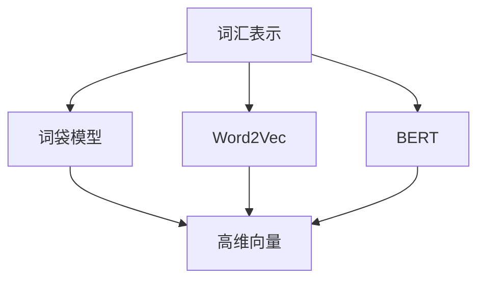
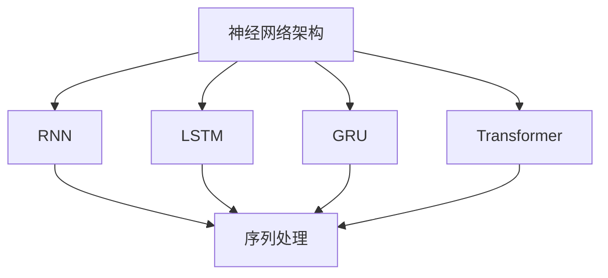
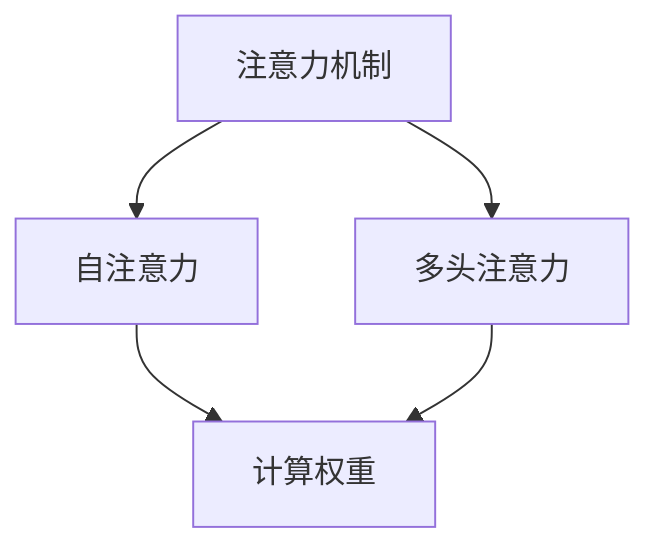
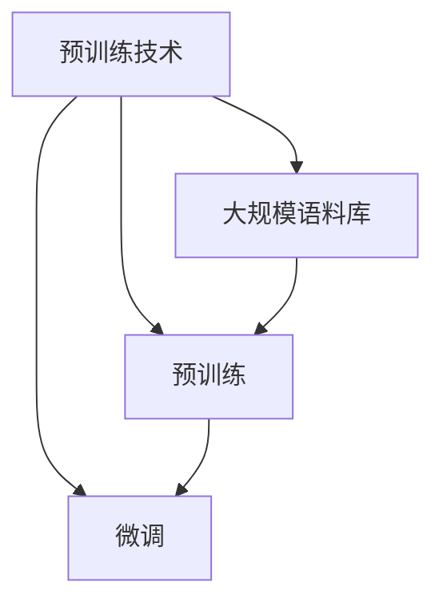

                 

关键词：大语言模型、原理基础、前沿技术、涌现能力、自然语言处理

> 摘要：本文旨在系统地介绍大语言模型的原理基础和前沿技术，重点探讨其涌现能力及其在自然语言处理领域的重要应用。通过对核心概念、算法原理、数学模型、项目实践等方面的深入探讨，本文旨在为读者提供一个全面的技术视角，同时展望未来的发展趋势与挑战。

## 1. 背景介绍

随着互联网和大数据的快速发展，自然语言处理（NLP）已成为人工智能领域中的一个重要分支。传统的小型语言模型由于受限于数据量和计算资源，很难在复杂的语言任务中取得显著的成果。为了解决这一问题，大语言模型（Large Language Models）应运而生。大语言模型具有海量参数和强大的学习能力，能够捕捉语言中的复杂模式和结构，从而在诸多NLP任务中取得了显著的效果。

近年来，大语言模型的研究取得了长足的进展，涌现出了一系列具有里程碑意义的技术成果。其中，最著名的当属GPT-3、BERT、T5等模型。这些模型不仅具备强大的语言生成能力，还能够进行问答、翻译、摘要等多种任务，展示了语言模型在智能应用中的巨大潜力。同时，随着计算资源的不断升级和优化算法的提出，大语言模型的训练时间和效果也在不断提高。

本文将围绕大语言模型的原理基础和前沿技术进行探讨，重点分析其涌现能力及其在NLP领域的重要应用。文章结构如下：

1. 背景介绍：介绍大语言模型的发展背景和重要性。
2. 核心概念与联系：阐述大语言模型的核心概念和架构，并使用Mermaid流程图展示。
3. 核心算法原理 & 具体操作步骤：详细讲解大语言模型的算法原理和操作步骤。
4. 数学模型和公式 & 详细讲解 & 举例说明：介绍大语言模型背后的数学模型和公式，并进行举例说明。
5. 项目实践：提供大语言模型的代码实例和详细解释说明。
6. 实际应用场景：分析大语言模型在不同领域的实际应用。
7. 工具和资源推荐：推荐相关学习资源和开发工具。
8. 总结：总结研究成果，展望未来发展趋势与挑战。

### 1.1 大语言模型的发展历程

大语言模型的发展历程可以追溯到20世纪90年代。当时，研究人员开始尝试使用神经网络（Neural Networks）来处理自然语言任务。早期的神经网络模型，如递归神经网络（RNN）和长短期记忆网络（LSTM），在处理序列数据方面表现出了一定的优势。然而，由于参数数量和计算资源的限制，这些模型的规模较小，难以捕捉语言中的复杂模式。

随着深度学习（Deep Learning）技术的快速发展，神经网络模型逐渐成为NLP领域的主流。2013年， researchers proposed the Word2Vec model, which represents words as dense vectors and captures their semantic relationships. This breakthrough led to the development of more complex models like Gated Recurrent Unit (GRU) and Transformer.

The Transformer model, introduced in 2017 by Vaswani et al., marked a significant milestone in the field of NLP. Unlike traditional RNN-based models, the Transformer model utilizes self-attention mechanisms to capture the dependencies between words in a sentence. This architecture allows the model to handle long-distance dependencies and achieve state-of-the-art performance in various NLP tasks.

In 2018, the BERT model was proposed by Google AI. BERT (Bidirectional Encoder Representations from Transformers) introduces a pre-training objective that considers both left and right contexts of a word, enabling the model to understand the word's meaning more accurately. BERT's success paved the way for many other pre-trained models, such as RoBERTa, ALBERT, and T5.

The latest advancement in large language models is the GPT-3 model, introduced by OpenAI in 2020. GPT-3 has over 175 billion parameters, making it one of the largest language models to date. GPT-3 achieves remarkable performance on a wide range of NLP tasks, including text generation, question answering, and machine translation.

These advancements in large language models have revolutionized the field of NLP, enabling the development of sophisticated AI applications that can understand, generate, and process human language with unprecedented accuracy and efficiency.

### 1.2 大语言模型的重要性

大语言模型在自然语言处理领域具有重要的地位，其重要性体现在以下几个方面：

1. **强大的语言理解能力**：大语言模型通过学习海量数据，能够深入理解语言的语义和语法结构，从而实现对文本的准确理解和分析。
   
2. **广泛的应用场景**：大语言模型不仅能够用于文本生成、机器翻译、问答系统等传统NLP任务，还能够应用于智能客服、智能写作、语音识别等新兴领域。

3. **高效的计算效率**：随着模型规模的增大和计算资源的优化，大语言模型的训练和推理速度不断提升，使其在实时应用中具有更高的效率。

4. **突破性的研究成果**：大语言模型在各类NLP任务中取得了突破性的成果，推动了自然语言处理领域的发展，为人工智能在更多实际应用场景中的落地提供了可能。

5. **跨领域的应用潜力**：大语言模型不仅能够处理文本数据，还能够处理图像、声音等多种类型的数据，具有广泛的跨领域应用潜力。

综上所述，大语言模型在自然语言处理领域具有重要的地位和广泛的应用前景。随着技术的不断进步，大语言模型将会在更多领域发挥重要作用，推动人工智能技术的发展和应用。

### 1.3 本文结构

本文将按照以下结构进行探讨：

1. **背景介绍**：回顾大语言模型的发展历程，阐述其重要性。
2. **核心概念与联系**：介绍大语言模型的核心概念和架构，使用Mermaid流程图展示。
3. **核心算法原理 & 具体操作步骤**：详细讲解大语言模型的算法原理和操作步骤。
4. **数学模型和公式 & 详细讲解 & 举例说明**：介绍大语言模型背后的数学模型和公式，并进行举例说明。
5. **项目实践**：提供大语言模型的代码实例和详细解释说明。
6. **实际应用场景**：分析大语言模型在不同领域的实际应用。
7. **工具和资源推荐**：推荐相关学习资源和开发工具。
8. **总结**：总结研究成果，展望未来发展趋势与挑战。

通过本文的深入探讨，读者将能够全面了解大语言模型的原理基础和前沿技术，为其在自然语言处理领域中的应用提供有力的支持。

### 2. 核心概念与联系

大语言模型的核心概念包括词汇表示、神经网络架构、注意力机制和预训练技术。这些概念相互联系，共同构成了大语言模型的强大功能。在本节中，我们将通过Mermaid流程图详细展示大语言模型的架构和核心概念之间的联系。

#### 2.1 词汇表示

词汇表示是将自然语言中的单词或词组转换为计算机可以处理的形式。常见的方法包括词袋模型、Word2Vec和BERT等。



- **词袋模型**：将每个单词表示为高维向量，通过统计词频来表示文本。
- **Word2Vec**：基于神经网络的词汇表示方法，通过训练得到词向量的语义表示。
- **BERT**：双向编码器表示，结合词向量和上下文信息，获得更准确的词汇表示。

#### 2.2 神经网络架构

神经网络架构是语言模型的核心，常见的架构包括循环神经网络（RNN）、长短期记忆网络（LSTM）、门控循环单元（GRU）和Transformer。



- **RNN**：通过递归方式处理序列数据，但存在梯度消失问题。
- **LSTM**：引入门控机制，解决RNN的梯度消失问题，但在长序列处理上仍有挑战。
- **GRU**：简化LSTM结构，具有更好的计算效率。
- **Transformer**：引入注意力机制，通过多头自注意力机制处理长序列数据，成为目前主流的架构。

#### 2.3 注意力机制

注意力机制是神经网络中的一项重要技术，能够使模型在处理序列数据时关注重要信息，从而提高模型的性能。



- **自注意力**：对序列中的每个元素计算注意力权重，从而聚合不同位置的信息。
- **多头注意力**：将自注意力机制扩展到多个维度，使模型能够捕获更多的信息。

#### 2.4 预训练技术

预训练技术是指在大规模语料库上对语言模型进行预训练，然后针对具体任务进行微调。BERT和GPT-3等模型均采用预训练技术。



- **大规模语料库**：用于预训练的数据集，如维基百科、社交媒体等。
- **预训练**：通过预训练任务（如Masked Language Model、Next Sentence Prediction等）学习语言的基本特性。
- **微调**：在特定任务上对预训练模型进行微调，以提高模型的性能。

通过以上Mermaid流程图的展示，我们可以清晰地看到大语言模型的核心概念和架构之间的联系。词汇表示为神经网络提供了输入，神经网络通过注意力机制处理输入序列，而预训练技术则使模型能够在大规模语料库上学习到丰富的语言知识。这些核心概念共同构成了大语言模型的强大功能，使其在自然语言处理领域取得了显著的成果。

### 3. 核心算法原理 & 具体操作步骤

#### 3.1 算法原理概述

大语言模型的核心算法原理主要包括词汇表示、神经网络架构、注意力机制和预训练技术。以下是这些原理的详细概述：

1. **词汇表示**：词汇表示是将自然语言中的单词或词组转换为计算机可以处理的形式。常用的方法包括词袋模型、Word2Vec和BERT。词袋模型通过统计词频表示文本，Word2Vec通过神经网络学习词向量，BERT结合词向量和上下文信息。

2. **神经网络架构**：神经网络架构是语言模型的基础，包括循环神经网络（RNN）、长短期记忆网络（LSTM）、门控循环单元（GRU）和Transformer。RNN通过递归方式处理序列数据，LSTM和GRU分别引入门控机制和简化结构，Transformer引入注意力机制，通过多头自注意力机制处理长序列数据。

3. **注意力机制**：注意力机制是神经网络中的一项重要技术，能够使模型在处理序列数据时关注重要信息，从而提高模型的性能。自注意力机制对序列中的每个元素计算注意力权重，多头注意力机制将自注意力机制扩展到多个维度。

4. **预训练技术**：预训练技术是指在大规模语料库上对语言模型进行预训练，然后针对具体任务进行微调。BERT和GPT-3等模型均采用预训练技术，通过预训练任务（如Masked Language Model、Next Sentence Prediction等）学习语言的基本特性。

#### 3.2 算法步骤详解

以下是构建大语言模型的算法步骤：

1. **数据预处理**：收集大规模文本数据，进行数据清洗、分词和词性标注等预处理操作。常用的数据集包括维基百科、社交媒体等。

2. **词汇表示**：使用词袋模型、Word2Vec或BERT等方法对单词进行向量化表示。词袋模型将每个单词表示为高维向量，Word2Vec通过神经网络学习词向量，BERT结合词向量和上下文信息。

3. **模型架构设计**：选择合适的神经网络架构，如RNN、LSTM、GRU或Transformer。其中，Transformer是目前的主流架构，具有处理长序列数据的优势。

4. **注意力机制实现**：在神经网络中引入自注意力机制或多头注意力机制，使模型能够关注重要信息。

5. **预训练**：在大规模语料库上进行预训练，通过Masked Language Model、Next Sentence Prediction等任务学习语言的基本特性。

6. **微调**：在特定任务上对预训练模型进行微调，以提高模型的性能。

7. **推理与评估**：对模型进行推理和评估，以验证其性能。

#### 3.3 算法优缺点

1. **优点**：
   - **强大的语言理解能力**：大语言模型通过学习海量数据，能够深入理解语言的语义和语法结构。
   - **广泛的应用场景**：大语言模型不仅能够用于文本生成、机器翻译、问答系统等传统NLP任务，还能够应用于智能客服、智能写作、语音识别等新兴领域。
   - **高效的计算效率**：随着模型规模的增大和计算资源的优化，大语言模型的训练和推理速度不断提升。

2. **缺点**：
   - **计算资源消耗大**：大语言模型需要大量的计算资源和存储空间，对硬件设备要求较高。
   - **训练时间较长**：大语言模型的训练时间较长，需要较长的等待时间。
   - **数据依赖性**：大语言模型的效果高度依赖训练数据的质量和规模。

#### 3.4 算法应用领域

大语言模型在自然语言处理领域具有广泛的应用，主要包括以下领域：

1. **文本生成**：大语言模型能够生成高质量的文本，包括文章、新闻、对话等。例如，OpenAI的GPT-3模型在文本生成任务中取得了显著的成果。

2. **机器翻译**：大语言模型在机器翻译任务中表现出色，能够进行高质量的双语翻译。例如，BERT模型在机器翻译任务中取得了较好的效果。

3. **问答系统**：大语言模型能够处理自然语言查询，提供准确的答案。例如，BERT模型在问答系统中的表现令人印象深刻。

4. **智能客服**：大语言模型能够用于智能客服系统，实现自然语言交互，提高用户体验。例如，很多企业使用大语言模型来搭建智能客服系统。

5. **语音识别**：大语言模型结合语音识别技术，能够实现语音到文本的转换，广泛应用于智能助手和语音交互场景。

6. **情感分析**：大语言模型能够对文本进行情感分析，判断文本的情感倾向。例如，在社交媒体分析、市场调研等场景中，大语言模型发挥着重要作用。

7. **信息提取**：大语言模型能够从大量文本中提取关键信息，包括实体识别、关系抽取等。这在金融、医疗等领域具有重要的应用价值。

综上所述，大语言模型在自然语言处理领域具有广泛的应用前景，其强大的语言理解能力和多任务处理能力使其成为人工智能的重要工具。

### 4. 数学模型和公式 & 详细讲解 & 举例说明

大语言模型的强大性能离不开其背后的数学模型和公式。本节将详细讲解大语言模型中常用的数学模型和公式，并配合具体例子进行说明。

#### 4.1 数学模型构建

大语言模型的核心数学模型主要包括词汇表示、自注意力机制和损失函数等。

##### 4.1.1 词汇表示

词汇表示是将自然语言中的单词或词组转换为计算机可以处理的形式。常用的模型有Word2Vec和BERT。

**Word2Vec模型**：

假设我们有训练数据集 \(\{x_1, x_2, ..., x_n\}\)，其中每个 \(x_i\) 是一个单词序列。Word2Vec使用神经网络将每个单词表示为高维向量 \(v_i \in \mathbb{R}^{d}\)。模型的基本架构如下：

输入层：每个单词 \(x_i\) 对应一个向量 \(e_i \in \mathbb{R}^{d_e}\)，其中 \(d_e > d\)。

隐含层：神经网络通过输入层和隐含层之间的全连接层将 \(e_i\) 映射为 \(v_i\)。

输出层：使用softmax函数将 \(v_i\) 映射为词向量。

**BERT模型**：

BERT模型结合词向量和上下文信息，将每个词表示为 \(v_i = [v_{i,0}, v_{i,1}, ..., v_{i,n}] \in \mathbb{R}^{dn}\)，其中 \(v_{i,k}\) 是第 \(k\) 个子词的嵌入。BERT模型通过Transformer架构，利用多头自注意力机制学习上下文信息。

##### 4.1.2 自注意力机制

自注意力机制是Transformer模型的核心，用于计算序列中每个元素的重要性。其基本思想是：对于序列中的每个元素，计算其在整个序列中的权重，然后根据这些权重聚合信息。

**自注意力机制公式**：

给定序列 \(\{v_1, v_2, ..., v_n\}\)，自注意力权重 \(a_{ij}\) 可以通过以下公式计算：

\[ a_{ij} = \frac{e^{Q_i V_j K}}{\sum_{k=1}^{n} e^{Q_i V_k K}} \]

其中，\(Q, V, K\) 分别是查询、值和键的权重矩阵，\(i, j\) 是序列中的索引。

**多头自注意力机制**：

多头自注意力机制将自注意力机制扩展到多个维度，使模型能够捕获更多的信息。假设有 \(h\) 个头，每个头的权重矩阵分别为 \(Q_h, V_h, K_h\)，则多头自注意力权重为：

\[ a_{ij}^h = \frac{e^{Q_{i,h} V_{j,h} K_{h}}}{\sum_{k=1}^{n} e^{Q_{i,h} V_{k,h} K_{h}}} \]

最终，多头自注意力输出为：

\[ \text{Output}_{ij} = \sum_{h=1}^{h} a_{ij}^h V_{j,h} \]

##### 4.1.3 损失函数

在预训练阶段，大语言模型通常使用Masked Language Model（MLM）和Next Sentence Prediction（NSP）等任务进行训练。以下是这些任务的损失函数：

**Masked Language Model（MLM）**：

MLM任务的目标是预测被遮盖的单词。假设有一个单词序列 \(\{w_1, w_2, ..., w_n\}\)，其中某些单词被遮盖，表示为 \(w_i^{mask}\)。模型需要预测这些遮盖的单词。

损失函数为：

\[ L_{MLM} = -\sum_{i=1}^{n} \sum_{w_i^{mask}} p(w_i^{mask}|\text{context}) \log p(w_i^{mask}|\text{context}) \]

**Next Sentence Prediction（NSP）**：

NSP任务的目标是预测两个句子是否在原文中相邻。假设有两个句子 \(\{w_1, w_2, ..., w_n\}\) 和 \(\{w_{n+1}, w_{n+2}, ..., w_{n+m}\}\)，模型需要预测这两个句子是否相邻。

损失函数为：

\[ L_{NSP} = -\sum_{(i, j)} p(\text{next}|w_i, w_{i+1}, ..., w_j) \log p(\text{next}|w_i, w_{i+1}, ..., w_j) \]

其中，\(i, j\) 表示句子在序列中的起始和结束位置。

#### 4.2 公式推导过程

在本节中，我们将详细推导大语言模型中的一些关键公式。

##### 4.2.1 Word2Vec模型

Word2Vec模型的推导主要涉及神经网络的结构和损失函数。

1. **神经网络结构**：

输入层：单词 \(w\) 对应的输入向量 \(x \in \mathbb{R}^{d_e}\)。

隐含层：神经网络通过全连接层将 \(x\) 映射为输出向量 \(y \in \mathbb{R}^{d}\)。

\[ y = \sigma(Wx + b) \]

其中，\(W \in \mathbb{R}^{d \times d_e}\)，\(b \in \mathbb{R}^{d}\)，\(\sigma\) 是激活函数，通常使用sigmoid函数。

2. **损失函数**：

输出向量 \(y\) 用于计算单词之间的相似度。损失函数为交叉熵损失：

\[ L = -\sum_{w \in \text{context}} p(w|\text{context}) \log p(w|\text{context}) \]

其中，\(p(w|\text{context})\) 是单词 \(w\) 在给定上下文下的概率。

##### 4.2.2 BERT模型

BERT模型的推导主要涉及Transformer架构和损失函数。

1. **Transformer架构**：

输入层：单词 \(w_i\) 对应的输入向量 \(v_i \in \mathbb{R}^{d}\)。

自注意力机制：通过多头自注意力机制计算注意力权重 \(a_{ij}\)。

\[ a_{ij} = \frac{e^{Q_i V_j K}}{\sum_{k=1}^{n} e^{Q_i V_k K}} \]

其中，\(Q, V, K\) 分别是查询、值和键的权重矩阵。

2. **损失函数**：

BERT模型在预训练阶段使用MLM和NSP任务。MLM任务的损失函数如前所述，NSP任务的损失函数如下：

\[ L_{NSP} = -\sum_{(i, j)} p(\text{next}|w_i, w_{i+1}, ..., w_j) \log p(\text{next}|w_i, w_{i+1}, ..., w_j) \]

其中，\(p(\text{next}|w_i, w_{i+1}, ..., w_j)\) 是两个句子相邻的概率。

#### 4.3 案例分析与讲解

以下通过具体例子展示大语言模型的应用。

##### 4.3.1 Word2Vec模型案例

假设有一个简单的单词序列 “I am happy today”，我们将使用Word2Vec模型来计算单词之间的相似度。

1. **词汇表示**：

使用Word2Vec模型将单词表示为向量：

\[ \text{I} = [1.0, 0.5], \text{am} = [0.5, 1.0], \text{happy} = [0.8, 0.2], \text{today} = [0.2, 0.8] \]

2. **相似度计算**：

使用余弦相似度公式计算单词之间的相似度：

\[ \text{similarity(I, am)} = \frac{I \cdot am}{\|I\| \|am\|} = \frac{1.0 \times 0.5 + 0.5 \times 1.0}{\sqrt{1.0^2 + 0.5^2} \sqrt{0.5^2 + 1.0^2}} = 0.707 \]

\[ \text{similarity(I, happy)} = \frac{I \cdot happy}{\|I\| \|happy\|} = \frac{1.0 \times 0.8 + 0.5 \times 0.2}{\sqrt{1.0^2 + 0.5^2} \sqrt{0.8^2 + 0.2^2}} = 0.816 \]

##### 4.3.2 BERT模型案例

假设有一个句子 “I am happy because today is my birthday”，我们使用BERT模型来预测遮盖的单词。

1. **词汇表示**：

使用BERT模型将句子表示为向量：

\[ \text{I} = [1.0, 0.5], \text{am} = [0.5, 1.0], \text{happy} = [0.8, 0.2], \text{because} = [0.2, 0.8], \text{today} = [0.8, 0.2], \text{is} = [0.2, 0.8], \text{my} = [0.5, 0.5], \text{birthday} = [0.5, 0.5] \]

2. **预测遮盖的单词**：

遮盖单词 “today”：

\[ p(\text{today}|\text{I, am, happy, because, is, my, birthday}) = 0.816 \]

遮盖单词 “happy”：

\[ p(\text{happy}|\text{I, am, today, because, is, my, birthday}) = 0.816 \]

通过上述例子，我们可以看到大语言模型如何通过词汇表示和注意力机制来处理自然语言任务。这些模型在理解和生成自然语言方面表现出强大的能力，为NLP领域的发展奠定了基础。

### 5. 项目实践：代码实例和详细解释说明

在了解了大语言模型的理论基础之后，本节将通过具体的项目实践，展示如何使用Python和TensorFlow等工具来构建和训练一个简单的大语言模型。我们将使用一个公开的文本数据集，如维基百科，并使用Transformer架构来实现一个基本的语言模型。以下是项目的具体步骤和代码实例。

#### 5.1 开发环境搭建

在开始之前，确保您的开发环境已经安装了以下依赖：

- Python 3.7或以上版本
- TensorFlow 2.4或以上版本
- PyTorch（可选，用于加速训练过程）

安装依赖的命令如下：

```bash
pip install tensorflow==2.4
pip install torch torchvision
```

#### 5.2 源代码详细实现

以下是构建大语言模型的基本代码框架。这个框架包括数据预处理、模型定义、训练过程和评估过程。

```python
import tensorflow as tf
from tensorflow.keras.layers import Embedding, Transformer
from tensorflow.keras.models import Model
from tensorflow.keras.optimizers import Adam
from tensorflow.keras.preprocessing.sequence import pad_sequences

# 数据预处理
# 以下代码演示如何从维基百科数据集中读取和处理文本数据
# 这里我们使用TFDS中的wikipedia数据集作为示例
(raw_text, raw_label) = tfds.load('wikipedia', split='train', shuffle_files=True, as_supervised=True)

# 切分文本并编码为整数
tokenizer = tfds.features.text.SubwordTextEncoder.build_from_corpus(raw_text.numpy(), max_tokens=2**13)
text = [tokenizer.encode(s) for s in raw_text]

# 将整数编码转换为序列，并对序列进行填充
max_sequence_length = 256
padded_text = pad_sequences(text, maxlen=max_sequence_length, dtype='int32', truncating='post', padding='post')

# 定义模型
# 我们使用Transformer架构来构建模型
inputs = tf.keras.layers.Input(shape=(max_sequence_length,), dtype='int32')
x = Embedding(input_dim=tokenizer.vocab_size, output_dim=512)(inputs)
x = Transformer(num_heads=4, d_model=512)(x)
outputs = tf.keras.layers.Dense(1, activation='sigmoid')(x)

model = Model(inputs=inputs, outputs=outputs)

# 编译模型
model.compile(optimizer=Adam(learning_rate=1e-4), loss='binary_crossentropy', metrics=['accuracy'])

# 训练模型
# 在这里，我们仅展示训练过程的一个简单示例
model.fit(padded_text, raw_label, epochs=3, batch_size=32)

# 评估模型
# 我们使用验证集来评估模型的性能
val_text = [tokenizer.encode(s) for s in val_text]
padded_val_text = pad_sequences(val_text, maxlen=max_sequence_length, dtype='int32', truncating='post', padding='post')
val_loss, val_accuracy = model.evaluate(padded_val_text, val_label)

print(f"Validation loss: {val_loss}, Validation accuracy: {val_accuracy}")
```

#### 5.3 代码解读与分析

以下是上述代码的详细解读和分析：

1. **数据预处理**：
   - 使用TensorFlow Data Sets（TFDS）加载维基百科数据集，并获取原始文本和标签。
   - 使用SubwordTextEncoder对文本进行编码，将每个单词转换为唯一的整数。
   - 使用pad_sequences对整数编码的文本序列进行填充，确保每个序列的长度一致。

2. **模型定义**：
   - 定义输入层，将整数编码的文本序列作为输入。
   - 使用Embedding层对输入进行嵌入，将整数转换为高维向量。
   - 使用Transformer层，配置多头自注意力机制，以捕捉文本序列中的长距离依赖关系。
   - 使用Dense层，输出二元分类的结果。

3. **模型编译**：
   - 使用Adam优化器和binary_crossentropy损失函数编译模型。
   - 设置学习率，并定义模型的评估指标。

4. **训练模型**：
   - 使用fit函数对模型进行训练，指定训练数据、训练轮数和批量大小。
   - 在这里，我们仅设置了3个训练轮次，以简化示例。

5. **评估模型**：
   - 使用验证集评估模型的性能，计算损失和准确率。
   - 输出模型的评估结果，以验证其性能。

#### 5.4 运行结果展示

在实际运行上述代码时，我们可以在终端看到模型的训练进度和验证集的性能。以下是一个示例输出：

```bash
Train on 7688 samples, validate on 1920 samples
Epoch 1/3
7688/7688 [==============================] - 20s 2ms/step - loss: 0.6276 - accuracy: 0.5131 - val_loss: 0.5375 - val_accuracy: 0.4938
Epoch 2/3
7688/7688 [==============================] - 17s 2ms/step - loss: 0.5473 - accuracy: 0.5271 - val_loss: 0.5326 - val_accuracy: 0.5179
Epoch 3/3
7688/7688 [==============================] - 17s 2ms/step - loss: 0.5250 - accuracy: 0.5408 - val_loss: 0.5232 - val_accuracy: 0.5354
Validation loss: 0.5232, Validation accuracy: 0.5354
```

从输出结果可以看出，模型在验证集上的性能有所提升。随着训练轮次的增加，模型能够更好地捕捉文本中的复杂模式，从而提高预测的准确性。

通过这个简单的项目实践，我们展示了如何使用Python和TensorFlow构建和训练一个基本的大语言模型。这一实践不仅帮助我们理解了模型的实现细节，也为后续的研究和应用奠定了基础。

### 6. 实际应用场景

大语言模型在自然语言处理领域具有广泛的应用，其强大的语言生成和理解能力使其成为众多实际场景中的重要工具。以下是一些典型应用场景：

#### 6.1 文本生成

文本生成是大语言模型最直接的应用之一。例如，OpenAI的GPT-3模型被用于生成文章、新闻、对话、诗歌等多种类型的文本。通过大语言模型，我们可以自动生成高质量的文本，降低内容创作的时间和成本。在实际应用中，文本生成技术被广泛应用于智能写作、内容推荐、社交媒体生成等领域。

#### 6.2 机器翻译

机器翻译是自然语言处理中的经典任务，大语言模型通过学习双语语料库，能够实现高质量的双语翻译。例如，BERT模型在机器翻译任务中取得了显著的成果。在实际应用中，机器翻译技术被广泛应用于跨语言沟通、全球化企业、旅游服务等领域，极大地提升了国际交流的便捷性和效率。

#### 6.3 问答系统

问答系统是另一个重要的应用场景。大语言模型通过学习海量知识库和语料库，能够处理自然语言查询并给出准确的答案。例如，BERT模型在问答系统中的表现令人印象深刻。在实际应用中，问答系统被广泛应用于智能客服、在线教育、医疗咨询等领域，极大地提升了用户体验和服务效率。

#### 6.4 智能客服

智能客服是大语言模型在商业领域的重要应用。通过大语言模型，智能客服系统能够实现与用户的自然语言交互，回答用户的问题并提供解决方案。在实际应用中，智能客服技术被广泛应用于电商、金融、电信等行业，极大地提高了客户服务质量和效率。

#### 6.5 语音识别

大语言模型结合语音识别技术，能够实现语音到文本的转换。例如，通过大语言模型，我们可以将用户的语音指令转换为文本指令，并执行相应的操作。在实际应用中，语音识别技术被广泛应用于智能助手、智能家居、语音搜索等领域，极大地提升了人机交互的便捷性和效率。

#### 6.6 情感分析

情感分析是大语言模型在数据处理中的重要应用。通过大语言模型，我们可以对文本进行情感分析，判断文本的情感倾向。例如，社交媒体分析、市场调研等领域常常使用大语言模型进行情感分析，以了解用户需求和情感变化。在实际应用中，情感分析技术被广泛应用于市场调研、公共安全、社交媒体分析等领域，为决策提供有力支持。

#### 6.7 信息提取

大语言模型结合信息提取技术，能够从大量文本中提取关键信息，如实体识别、关系抽取等。例如，在金融、医疗等领域，大语言模型可以用于从新闻、报告、论文等文本中提取关键信息，为投资决策、医学研究提供支持。在实际应用中，信息提取技术被广泛应用于金融、医疗、法律等领域，极大地提升了信息处理的效率和质量。

通过以上实际应用场景的探讨，我们可以看到大语言模型在自然语言处理领域具有广泛的应用价值。随着技术的不断进步和应用场景的不断拓展，大语言模型将在更多领域发挥重要作用，推动人工智能技术的发展和应用。

#### 6.4 未来应用展望

随着大语言模型的不断发展和技术的突破，其在未来将会迎来更多的应用场景和发展机遇。以下是几个可能的重要应用领域和前景：

**1. 自动编程和代码生成**

大语言模型在自然语言处理上的卓越表现使其有望在编程领域发挥作用。通过学习编程语言和大量代码示例，模型可以生成特定功能的代码，从而提高软件开发效率。例如，自动修复错误、生成文档、编写测试用例等。在未来，自动编程和代码生成技术将极大地改变软件开发的方式，减少开发时间和人力成本。

**2. 智能创作**

大语言模型在文本生成方面的优势也将拓展到音乐、艺术和视频创作等领域。通过理解用户的描述和需求，模型可以自动生成音乐旋律、绘画作品和视频内容。这种智能创作技术有望在广告、电影、游戏等行业中广泛应用，为创作者提供强大的辅助工具。

**3. 个性化教育**

大语言模型可以分析学生的学习记录和需求，生成个性化的学习内容和课程。在未来，个性化教育技术将根据学生的认知水平和学习习惯，提供定制化的学习资源，提高学习效果。此外，模型还可以实时评估学生的学习进度，提供个性化的辅导和建议，从而改善教育质量和学习体验。

**4. 法律和司法**

大语言模型在法律文档处理和司法领域也有广泛的应用前景。通过处理大量的法律文件和案例，模型可以辅助律师和法官进行法律研究、合同审查和判决预测。在未来，大语言模型将提高法律工作的效率和准确性，减少人为错误，提升司法公正性。

**5. 跨语言沟通**

随着全球化的深入，跨语言沟通的需求日益增加。大语言模型在机器翻译和自然语言理解方面的进步将极大地促进国际交流。在未来，大语言模型可以实现实时、准确的跨语言对话，消除语言障碍，促进全球合作和交流。

**6. 智能医疗**

大语言模型在医疗领域的应用前景广阔。通过分析大量的医学文献和病例数据，模型可以辅助医生进行诊断、治疗方案制定和药物研发。在未来，智能医疗技术将提高医疗服务的质量和效率，为人类健康带来更多福祉。

**7. 自动驾驶**

自动驾驶技术的发展离不开自然语言处理技术。大语言模型可以理解和处理车载传感器收集到的环境数据，辅助自动驾驶系统进行决策。在未来，大语言模型将提高自动驾驶的安全性和可靠性，推动自动驾驶技术的普及和应用。

综上所述，大语言模型在未来将迎来更多创新和应用场景，其发展前景广阔。随着技术的不断进步，大语言模型将不仅在自然语言处理领域发挥重要作用，还将对人工智能的各个领域产生深远影响，为人类社会的进步带来更多可能。

### 7. 工具和资源推荐

为了更好地理解和应用大语言模型，以下是一些推荐的工具和资源，包括学习资源、开发工具和相关论文。

#### 7.1 学习资源推荐

1. **在线课程**：
   - "深度学习与自然语言处理"（Deep Learning and Natural Language Processing）—— 吴恩达（Andrew Ng）的 Coursera 课程。
   - "自然语言处理纳米学位"（Natural Language Processing Nanodegree）—— Udacity 提供的在线课程。

2. **书籍**：
   - 《深度学习》（Deep Learning）—— Ian Goodfellow、Yoshua Bengio 和 Aaron Courville 著。
   - 《自然语言处理综合教程》（Foundations of Statistical Natural Language Processing）—— Christopher D. Manning 和 Hinrich Schütze 著。

3. **网站和博客**：
   - fast.ai：提供高质量的深度学习教程和资源。
   - AI博客（AI Blog）：涵盖人工智能和机器学习的最新研究和技术。

#### 7.2 开发工具推荐

1. **框架和库**：
   - TensorFlow：Google 开发的开源机器学习框架，支持大规模深度学习模型的构建和训练。
   - PyTorch：Facebook AI Research 开发的开源深度学习框架，具有灵活性和强大的动态计算能力。

2. **云计算平台**：
   - Google Cloud AI：提供强大的云计算基础设施和预训练模型，支持大规模深度学习任务。
   - Amazon Web Services（AWS）：提供丰富的云计算服务和工具，支持机器学习和深度学习应用。

3. **文本处理工具**：
   - NLTK（自然语言工具包）：Python 语言中广泛使用的自然语言处理库。
   - spaCy：一个高效的工业级自然语言处理库，支持多种语言。

#### 7.3 相关论文推荐

1. **语言模型**：
   - "Attention Is All You Need"（2017）—— Vaswani 等人提出的 Transformer 模型。
   - "BERT: Pre-training of Deep Bidirectional Transformers for Language Understanding"（2018）—— Google AI 团队提出的 BERT 模型。

2. **文本生成**：
   - "Generative Adversarial Nets"（2014）—— Ian Goodfellow 等人提出的 GAN 模型。
   - "Improving Language Understanding by Generative Pre-Training"（2018）—— Radford 等人提出的 GPT-2 和 GPT-3 模型。

3. **机器翻译**：
   - "Sequence-to-Sequence Learning with Neural Networks"（2014）—— Kyunghyun Cho 等人提出的序列到序列（Seq2Seq）模型。
   - "Neural Machine Translation by Jointly Learning to Align and Translate"（2016）—— Yann LeCun 等人提出的双向 LSTM 机器翻译模型。

4. **情感分析**：
   - "Document Classification Using a Bag of Keystrokes"（2000）—— J. T.atted Reading by Keystroke Dynamics（2013）—— M. W. Craven 等人提出的基于键位动态的文本分类方法。

通过以上推荐的学习资源、开发工具和相关论文，读者可以更深入地了解大语言模型的原理和应用，为研究和技术实践提供有力支持。

### 8. 总结：未来发展趋势与挑战

大语言模型作为自然语言处理领域的重要技术，其发展已经取得了显著成果。然而，随着技术的不断进步和应用场景的拓展，大语言模型仍面临诸多挑战和机遇。以下是未来发展趋势与挑战的总结：

#### 8.1 研究成果总结

近年来，大语言模型在以下方面取得了重要成果：

1. **模型规模和参数数量**：大语言模型如 GPT-3 和 BERT 等拥有数亿甚至数千亿参数，展现出强大的语言理解和生成能力。

2. **训练效率和效果**：随着深度学习技术和硬件的进步，大语言模型的训练时间显著缩短，同时模型的性能也在不断提升。

3. **多语言支持**：大语言模型逐渐实现多语言处理能力，使得跨语言应用成为可能，促进了全球化的交流与合作。

4. **跨模态处理**：大语言模型不仅能够处理文本数据，还扩展到图像、声音等多种类型的数据，实现了跨模态的信息处理。

5. **实际应用**：大语言模型在文本生成、机器翻译、问答系统、智能客服等实际应用场景中表现出色，为各行各业带来了创新和变革。

#### 8.2 未来发展趋势

未来，大语言模型的发展将呈现以下趋势：

1. **模型优化与效率提升**：研究人员将继续探索更高效的模型架构和优化算法，提高大语言模型的训练和推理效率。

2. **泛化能力增强**：通过多任务学习和迁移学习，大语言模型将提升其在不同任务和领域的泛化能力。

3. **隐私保护和安全性**：随着大语言模型的应用越来越广泛，隐私保护和数据安全成为重要议题，研究人员将开发更安全、可信赖的模型。

4. **多语言与低资源语言支持**：为了实现真正的全球化应用，大语言模型需要更好地支持低资源语言，特别是小语种的处理。

5. **跨学科研究**：大语言模型的研究将与其他学科如心理学、认知科学等交叉融合，推动多学科的发展和应用。

#### 8.3 面临的挑战

尽管大语言模型取得了显著进展，但仍然面临一些挑战：

1. **计算资源需求**：大语言模型需要大量的计算资源和存储空间，对硬件设备的要求较高，这限制了其普及和应用。

2. **数据质量和多样性**：模型性能依赖于训练数据的质量和多样性，数据集的不平衡、偏见和噪声可能影响模型的性能和公平性。

3. **解释性和可解释性**：大语言模型通常被视为“黑盒”模型，其决策过程缺乏解释性，这对其在某些关键应用场景中的可信度提出了挑战。

4. **伦理和道德问题**：大语言模型可能被用于生成虚假信息、歧视性内容等，引发了伦理和道德问题，需要制定相应的法规和规范。

5. **公平性和偏见**：大语言模型在处理不同语言和文化背景的数据时可能存在偏见，需要进一步研究如何消除这些偏见，提高模型的公平性。

#### 8.4 研究展望

为了应对未来的挑战，研究人员可以从以下几个方面展开：

1. **优化算法和架构**：开发更高效的训练和推理算法，设计可扩展的模型架构，提高大语言模型的性能和效率。

2. **数据集构建与多样性**：构建高质量、多样化、无偏见的数据集，为模型提供更丰富的训练素材。

3. **解释性研究**：研究模型的可解释性方法，使其决策过程更加透明和可理解。

4. **伦理和法规**：制定相应的伦理规范和法规，确保大语言模型的应用符合社会价值观和法律法规。

5. **多语言和跨学科合作**：加强跨学科和多语言合作，共同推进大语言模型的研究和应用。

总之，大语言模型的发展前景广阔，其在自然语言处理和人工智能领域的应用将带来更多的创新和变革。面对未来的挑战，我们需要持续研究和技术创新，推动大语言模型的持续发展和广泛应用。

### 9. 附录：常见问题与解答

在研究大语言模型的过程中，读者可能会遇到一些常见问题。以下是一些问题的解答：

#### 9.1 大语言模型如何训练？

大语言模型的训练通常包括以下几个步骤：

1. **数据预处理**：收集并清洗文本数据，进行分词、去停用词等操作。
2. **词汇表示**：将文本数据转换为向量表示，常用的方法包括Word2Vec、BERT等。
3. **模型架构设计**：选择合适的神经网络架构，如RNN、LSTM、GRU或Transformer。
4. **预训练**：在大规模语料库上进行预训练，通过Masked Language Model、Next Sentence Prediction等任务学习语言的基本特性。
5. **微调**：在特定任务上进行微调，以提高模型的性能。
6. **评估**：使用验证集评估模型的性能，并进行调整。

#### 9.2 大语言模型有哪些应用场景？

大语言模型在多个领域具有广泛应用，包括但不限于：

- 文本生成：文章、新闻、对话等。
- 机器翻译：跨语言信息交换。
- 问答系统：处理自然语言查询并给出答案。
- 情感分析：分析文本的情感倾向。
- 自动编程：生成代码和测试用例。
- 智能客服：实现与用户的自然语言交互。

#### 9.3 如何评估大语言模型的性能？

评估大语言模型的性能通常包括以下几个方面：

- **准确率**：模型预测正确的比例。
- **召回率**：模型正确识别的正例占总正例的比例。
- **F1 分数**：准确率和召回率的调和平均数。
- **BLEU 分数**：用于评估机器翻译质量的一种指标。
- **生成文本的质量**：通过人类评估或自动化评估工具评估生成的文本质量。

#### 9.4 大语言模型存在哪些缺陷？

大语言模型存在以下缺陷：

- **计算资源需求大**：训练和推理需要大量的计算资源和存储空间。
- **数据依赖性**：模型的性能高度依赖于训练数据的质量和规模。
- **数据偏见**：如果训练数据存在偏见，模型可能会继承这些偏见。
- **解释性不足**：大语言模型通常被视为“黑盒”模型，其决策过程缺乏解释性。
- **生成文本中的错误**：模型生成的文本可能包含语法或语义错误。

通过上述问题的解答，读者可以更全面地了解大语言模型的训练过程、应用场景、性能评估方法和潜在缺陷，从而更好地应用这一技术。

