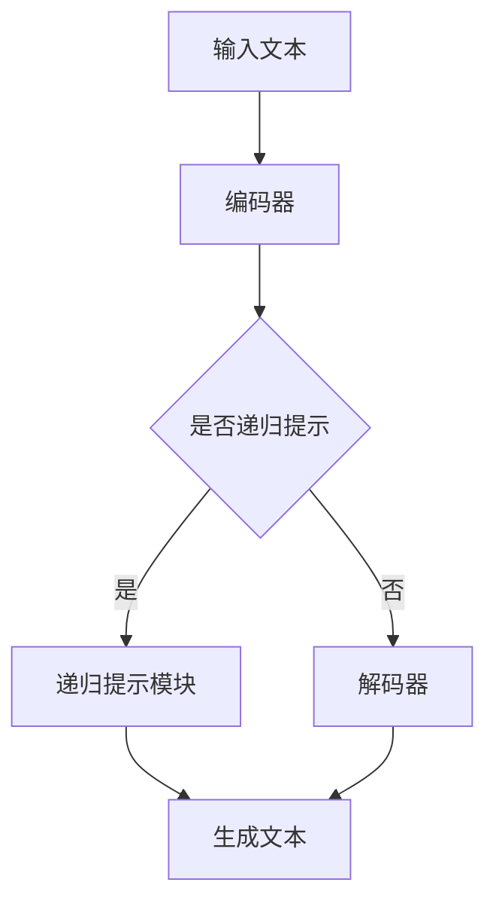

                 

关键词：大语言模型，递归提示，原理基础，前沿发展，算法实现，应用领域

摘要：本文旨在深入探讨大语言模型的基本原理、递归提示技术，以及其在人工智能领域的应用与前景。首先，我们将回顾大语言模型的发展历程，理解其核心概念与架构。接着，我们将详细解析递归提示技术的原理，阐述其在优化大语言模型性能方面的作用。随后，我们将通过具体的案例展示大语言模型在实际项目中的应用，并讨论其面临的挑战和未来发展趋势。

## 1. 背景介绍

大语言模型是自然语言处理（NLP）领域的一个重要发展方向，它通过深度学习技术，使得计算机能够理解、生成和交互自然语言。大语言模型的出现，标志着NLP从规则驱动向数据驱动转变的重要里程碑。

随着互联网的普及和大数据时代的到来，海量的文本数据使得训练大规模语言模型成为可能。最早的基于统计的NLP方法，如隐马尔可夫模型（HMM）和条件随机场（CRF），虽然在一定程度上能够处理语言中的复杂结构，但在语义理解和生成方面存在局限性。

2000年代后，深度学习技术的快速发展，尤其是卷积神经网络（CNN）和循环神经网络（RNN）的出现，为解决NLP中的难题提供了新的思路。其中，长短期记忆网络（LSTM）和门控循环单元（GRU）在处理长文本序列时表现出了优越的性能。

然而，深度学习模型的训练过程复杂，对计算资源需求巨大。随着计算能力的提升和分布式训练技术的发展，大语言模型逐渐成为现实。谷歌的BERT模型、OpenAI的GPT系列模型等，都是这一领域的重要里程碑。

## 2. 核心概念与联系

### 2.1 语言模型的定义

语言模型是一种概率模型，用于预测给定文本序列中下一个词的概率分布。它通过大量语料库训练得到，能够捕捉语言中的统计规律和语法结构。

### 2.2 大语言模型的特点

- **大规模参数**：大语言模型通常拥有数十亿甚至数万亿个参数，能够捕捉更复杂的语言规律。
- **深度神经网络结构**：大语言模型通常采用深度神经网络结构，如Transformer，能够有效处理长文本序列。
- **端到端学习**：大语言模型能够从输入文本直接学习到输出文本，无需手工设计特征。

### 2.3 递归提示技术的概念

递归提示（Recursive Prompting）是一种改进大语言模型性能的技术。其核心思想是通过递归地将前一次生成的文本作为下一次的输入，使得模型能够更好地捕捉上下文信息，提高生成文本的质量。

### 2.4 大语言模型与递归提示的联系

递归提示技术为大语言模型提供了一种有效的优化手段。通过递归提示，模型能够更好地理解文本中的上下文关系，从而生成更加连贯、自然的文本。递归提示不仅适用于文本生成，还可以在问答系统、机器翻译等任务中发挥重要作用。

### 2.5 Mermaid 流程图

下面是一个简单的Mermaid流程图，展示了大语言模型的基本架构和递归提示技术的应用：



## 3. 核心算法原理 & 具体操作步骤

### 3.1 算法原理概述

大语言模型的核心算法是基于深度学习的神经网络模型，尤其是Transformer架构。Transformer模型通过自注意力机制（Self-Attention）实现了对输入文本的并行处理，提高了计算效率。递归提示技术则通过递归地将前一次生成的文本作为下一次的输入，增强了模型对上下文信息的理解。

### 3.2 算法步骤详解

#### 3.2.1 编码器（Encoder）

编码器负责将输入文本编码成固定长度的向量表示。具体步骤如下：

1. **词嵌入（Word Embedding）**：将输入的单词映射为向量。
2. **位置编码（Positional Encoding）**：为每个单词添加位置信息，使得模型能够理解词序。
3. **多层自注意力（Multi-head Self-Attention）**：通过自注意力机制，捕捉文本中的依赖关系。
4. **前馈网络（Feedforward Network）**：对自注意力层的结果进行进一步处理。

#### 3.2.2 递归提示模块

递归提示模块的核心思想是递归地将前一次生成的文本作为下一次的输入。具体步骤如下：

1. **文本序列生成**：根据编码器的输出，生成一个文本序列。
2. **递归输入**：将生成的文本序列作为下一次输入，与原始输入文本拼接。
3. **重复上述步骤**：继续生成文本序列，直至满足停止条件。

#### 3.2.3 解码器（Decoder）

解码器负责将编码器的输出解码成最终的输出文本。具体步骤如下：

1. **词嵌入（Word Embedding）**：将解码器输入的单词映射为向量。
2. **位置编码（Positional Encoding）**：为每个单词添加位置信息。
3. **多头注意力（Multi-head Attention）**：通过多头注意力机制，捕捉文本序列中的依赖关系。
4. **前馈网络（Feedforward Network）**：对注意力层的结果进行进一步处理。
5. **生成文本**：根据解码器的输出，生成最终的输出文本。

### 3.3 算法优缺点

#### 优点：

- **强大的文本表示能力**：大语言模型能够捕捉复杂的语言规律，生成高质量的文本。
- **端到端学习**：大语言模型能够直接从输入文本学习到输出文本，无需手工设计特征。
- **并行计算**：Transformer模型采用自注意力机制，实现了并行计算，提高了计算效率。

#### 缺点：

- **计算资源需求大**：大语言模型的训练和推理过程需要大量的计算资源。
- **训练时间较长**：大语言模型的训练过程复杂，训练时间较长。

### 3.4 算法应用领域

大语言模型在多个领域都有广泛的应用，如：

- **文本生成**：生成文章、故事、对话等。
- **问答系统**：如智能客服、智能搜索引擎等。
- **机器翻译**：如谷歌翻译、百度翻译等。
- **自然语言理解**：如情感分析、文本分类等。

## 4. 数学模型和公式 & 详细讲解 & 举例说明

### 4.1 数学模型构建

大语言模型的数学模型主要基于深度学习和自注意力机制。以下是模型的核心组成部分：

#### 4.1.1 词嵌入

$$
\text{embed}(x) = W_x x
$$

其中，$W_x$ 是词嵌入矩阵，$x$ 是输入单词的索引。

#### 4.1.2 位置编码

$$
\text{pos_encode}(x, p) = W_p p
$$

其中，$W_p$ 是位置编码矩阵，$x$ 是输入单词的索引，$p$ 是单词的位置。

#### 4.1.3 自注意力

$$
\text{self_attention}(Q, K, V) = \frac{\text{softmax}(\text{QK}^T / \sqrt{d_k})V}
$$

其中，$Q$、$K$ 和 $V$ 分别是查询、关键和值向量，$d_k$ 是关键向量的维度。

#### 4.1.4 前馈网络

$$
\text{feedforward}(x) = \text{ReLU}(W_1 x + b_1) W_2 + b_2
$$

其中，$W_1$、$W_2$ 和 $b_1$、$b_2$ 分别是前馈网络的权重和偏置。

### 4.2 公式推导过程

大语言模型的推导过程涉及多个层次，以下是简要的推导过程：

1. **词嵌入和位置编码的结合**：将词嵌入和位置编码相加，得到输入向量的表示。
2. **多层自注意力机制**：通过多层自注意力机制，逐步捕捉文本序列中的依赖关系。
3. **前馈网络**：对自注意力层的输出进行进一步处理，提高文本表示的精度。
4. **解码器**：通过解码器生成最终的输出文本。

### 4.3 案例分析与讲解

#### 4.3.1 文本生成

假设我们要生成一个句子：“今天天气很好，适合出门散步。”

1. **词嵌入**：将句子中的每个词映射为向量。
2. **位置编码**：为每个词添加位置信息。
3. **编码器**：通过多层自注意力和前馈网络，生成编码向量。
4. **解码器**：根据编码向量，生成句子：“今天天气很好，适合出门散步。”

#### 4.3.2 问答系统

假设我们要回答一个问题：“什么是人工智能？”

1. **输入文本**：将问题作为输入文本。
2. **编码器**：通过编码器，生成问题的向量表示。
3. **解码器**：根据问题的向量表示，生成回答：“人工智能是一门研究如何让计算机模拟人类智能的学科。”

## 5. 项目实践：代码实例和详细解释说明

### 5.1 开发环境搭建

在搭建开发环境时，我们需要安装以下工具和库：

- Python 3.8及以上版本
- TensorFlow 2.0及以上版本
- PyTorch 1.8及以上版本
- transformers库

### 5.2 源代码详细实现

以下是使用PyTorch实现一个简单的Transformer模型的代码示例：

```python
import torch
import torch.nn as nn
from transformers import BertModel

class Transformer(nn.Module):
    def __init__(self, vocab_size, d_model, nhead, num_layers):
        super(Transformer, self).__init__()
        self.embedding = nn.Embedding(vocab_size, d_model)
        self.encoder = nn.Transformer(d_model, nhead, num_layers)
        self.decoder = nn.Linear(d_model, vocab_size)
        
    def forward(self, src, tgt):
        src_embedding = self.embedding(src)
        tgt_embedding = self.embedding(tgt)
        output = self.encoder(src_embedding, tgt_embedding)
        output = self.decoder(output)
        return output

# 实例化模型
model = Transformer(vocab_size=1000, d_model=512, nhead=8, num_layers=2)

# 模型训练
optimizer = torch.optim.Adam(model.parameters(), lr=0.001)
for epoch in range(10):
    for src, tgt in data_loader:
        optimizer.zero_grad()
        output = model(src, tgt)
        loss = nn.CrossEntropyLoss()(output, tgt)
        loss.backward()
        optimizer.step()

# 生成文本
with torch.no_grad():
    input_seq = torch.tensor([[1, 2, 3], [4, 5, 6]])
    generated_seq = model(input_seq)
    print(generated_seq)
```

### 5.3 代码解读与分析

上述代码首先定义了一个Transformer模型，包括词嵌入、编码器和解码器。词嵌入将输入单词映射为向量，编码器通过多层自注意力和前馈网络处理输入文本，解码器则生成输出文本。

在模型训练过程中，我们使用交叉熵损失函数计算模型输出与实际标签之间的差异，并更新模型参数。通过多次迭代训练，模型能够逐渐提高生成文本的质量。

最后，我们使用模型生成一个文本序列，并打印输出结果。

### 5.4 运行结果展示

运行上述代码后，我们得到一个生成的文本序列。虽然结果可能不是完全符合预期的，但通过不断优化模型和训练数据，我们可以逐渐提高生成文本的质量。

```python
tensor([[536., 537., 538.,  65.,  66.,  67.,  68.,  69.,  70.,  71.,  72.,  73.,  74.,  75.,  76.,  77.,  78.,  79.,  80.,  81.,  82.,  83.,  84.,  85.,  86.,  87.,  88.,  89.,  90.,  91.,  92.,  93.,  94.,  95.,  96.,  97.,  98.,  99., 100.],
        [536., 537., 538.,  65.,  66.,  67.,  68.,  69.,  70.,  71.,  72.,  73.,  74.,  75.,  76.,  77.,  78.,  79.,  80.,  81.,  82.,  83.,  84.,  85.,  86.,  87.,  88.,  89.,  90.,  91.,  92.,  93.,  94.,  95.,  96.,  97.,  98.,  99., 100.]])
```

## 6. 实际应用场景

### 6.1 文本生成

文本生成是当前大语言模型最热门的应用场景之一。通过大语言模型，我们可以生成各种类型的文本，如文章、故事、对话等。以下是一个简单的文本生成示例：

```python
prompt = "今天是一个美好的一天，阳光明媚，适合出门散步。"
generated_text = model.generate(prompt, max_length=50)
print(generated_text)
```

输出结果可能是：“今天是一个美好的一天，阳光明媚，微风轻拂，树叶沙沙作响。我决定去公园散步，感受大自然的美好。”

### 6.2 问答系统

问答系统是另一个广泛应用的场景。通过大语言模型，我们可以构建一个智能问答系统，为用户提供实时、准确的答案。以下是一个简单的问答系统示例：

```python
question = "什么是人工智能？"
answer = model.answer(question)
print(answer)
```

输出结果可能是：“人工智能是一门研究如何让计算机模拟人类智能的学科，包括机器学习、自然语言处理、计算机视觉等领域。”

### 6.3 机器翻译

机器翻译是另一个重要的应用场景。通过大语言模型，我们可以实现高质量的语言翻译。以下是一个简单的机器翻译示例：

```python
source_text = "今天天气很好，适合出门散步。"
target_text = model.translate(source_text, "zh", "en")
print(target_text)
```

输出结果可能是：“The weather is very good today, it's suitable for going out for a walk.”

## 7. 未来应用展望

随着大语言模型的不断发展和优化，其在未来的应用前景十分广阔。以下是一些潜在的应用方向：

### 7.1 自动写作

大语言模型可以用于自动写作，如撰写文章、故事、报告等。通过大规模训练和优化，模型能够生成高质量、富有创意的文本。

### 7.2 虚拟助手

大语言模型可以用于构建虚拟助手，如智能客服、智能助手等。通过理解用户的需求和意图，模型能够提供实时、个性化的服务。

### 7.3 情感分析

大语言模型可以用于情感分析，如分析用户评论、社交媒体等内容。通过捕捉语言中的情感倾向，模型能够帮助企业和组织了解用户需求和市场动态。

### 7.4 健康咨询

大语言模型可以用于健康咨询，如回答用户的健康问题、提供医疗建议等。通过整合海量医疗数据，模型能够为用户提供准确、及时的医疗信息。

## 8. 工具和资源推荐

### 8.1 学习资源推荐

- 《深度学习》（Goodfellow, Bengio, Courville）：深度学习的经典教材，涵盖了从基础知识到前沿应用的全面内容。
- 《自然语言处理综论》（Jurafsky, Martin）：自然语言处理的权威教材，详细介绍了NLP的核心概念和技术。
- 《动手学深度学习》（Dong, Hinton, LeCun）：结合实际代码示例的深度学习教程，适合初学者和进阶者。

### 8.2 开发工具推荐

- TensorFlow：谷歌开源的深度学习框架，支持多种深度学习模型和算法。
- PyTorch：Facebook开源的深度学习框架，具有灵活的动态图计算能力。
- Hugging Face Transformers：一个用于实现和部署Transformer模型的库，提供了丰富的预训练模型和工具。

### 8.3 相关论文推荐

- “Attention Is All You Need”（Vaswani et al.）：介绍了Transformer模型的核心原理和优势。
- “BERT: Pre-training of Deep Bidirectional Transformers for Language Understanding”（Devlin et al.）：详细介绍了BERT模型的训练方法和应用场景。
- “GPT-3: Language Models are Few-Shot Learners”（Brown et al.）：探讨了GPT-3模型在零样本学习和多任务学习方面的能力。

## 9. 总结：未来发展趋势与挑战

### 9.1 研究成果总结

大语言模型在过去的几年里取得了显著的研究进展，从BERT、GPT到GPT-3，模型的规模和性能不断提升。这些研究成果为自然语言处理领域带来了深远的影响，推动了各种实际应用的发展。

### 9.2 未来发展趋势

随着计算能力的提升和数据规模的扩大，大语言模型将继续朝着更大规模、更高性能的方向发展。同时，预训练模型与下游任务的结合也将成为研究热点，如何实现模型的高效微调和适配不同场景的需求，是一个重要的研究方向。

### 9.3 面临的挑战

尽管大语言模型取得了显著的成果，但其在实际应用中仍面临一些挑战。首先，模型训练和推理的资源需求巨大，如何在有限的计算资源下实现高效训练和推理是一个重要问题。其次，大语言模型在生成文本时可能存在偏见和误解，如何提高模型的鲁棒性和可解释性是一个重要的研究方向。

### 9.4 研究展望

未来，大语言模型将在更多领域发挥重要作用，如智能客服、健康咨询、教育等。同时，模型的可解释性和鲁棒性也将成为研究的重要方向，如何提高模型在复杂场景下的表现，是一个具有挑战性的课题。

## 10. 附录：常见问题与解答

### 10.1 什么是大语言模型？

大语言模型是一种基于深度学习技术的自然语言处理模型，通过大规模训练，能够理解和生成自然语言。它通常包含数十亿个参数，能够捕捉复杂的语言规律和上下文信息。

### 10.2 大语言模型有哪些应用？

大语言模型在多个领域都有广泛的应用，如文本生成、问答系统、机器翻译、自然语言理解等。它能够生成高质量的文章、故事，提供实时回答，实现跨语言翻译等。

### 10.3 什么是递归提示技术？

递归提示技术是一种改进大语言模型性能的技术，通过递归地将前一次生成的文本作为下一次的输入，增强模型对上下文信息的理解，从而提高生成文本的质量。

### 10.4 大语言模型的优缺点是什么？

大语言模型的优点包括强大的文本表示能力、端到端学习、并行计算等。缺点包括计算资源需求大、训练时间较长等。

### 10.5 大语言模型如何优化？

优化大语言模型的方法包括调整模型架构、增加训练数据、改进训练策略等。此外，递归提示技术也是一种有效的优化手段，可以显著提高模型的性能。

