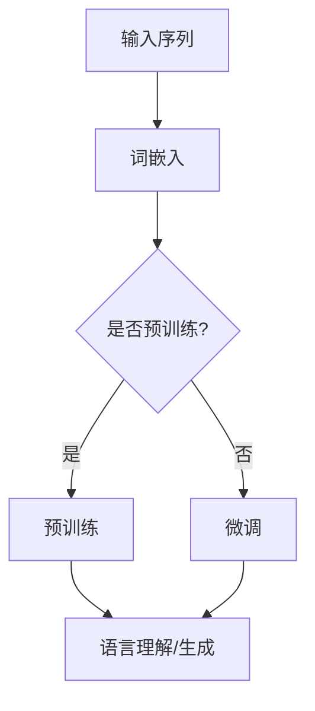

                 

关键词：大语言模型，Transformer，预训练，深度学习，自然语言处理

摘要：本文旨在深入探讨大语言模型（LLM）的原理，以及Transformer模型在预训练阶段扩大尺度的技术启示。通过对核心概念的详细解析、算法原理的讲解、数学模型的构建、以及实际应用场景的剖析，本文将为您呈现大语言模型在现代自然语言处理领域的突破性进展和未来发展方向。

## 1. 背景介绍

近年来，随着深度学习技术的不断发展，大语言模型（LLM）在自然语言处理（NLP）领域取得了显著的突破。LLM是一种基于深度学习的语言模型，通过对海量文本数据进行预训练，使其具备强大的语言理解和生成能力。预训练Transformer模型的引入，进一步推动了LLM的发展，特别是在模型规模和性能方面。

Transformer模型作为一种全新的序列到序列模型，基于自注意力机制，解决了传统循环神经网络（RNN）在处理长序列数据时的困难。自注意力机制使得模型能够同时关注输入序列中的所有位置，提高了模型对长距离依赖关系的捕捉能力。预训练Transformer模型的扩大尺度，使得其在语言理解、文本生成等任务上取得了前所未有的成果。

本文将首先介绍大语言模型的核心概念和基本原理，然后深入探讨Transformer模型在预训练阶段的技术启示，最后分析大语言模型在实际应用场景中的优势和未来发展趋势。

## 2. 核心概念与联系

### 2.1 大语言模型（LLM）

大语言模型（LLM）是一种基于深度学习的语言模型，通过对海量文本数据进行预训练，使其具备强大的语言理解和生成能力。LLM的核心概念包括：

- **预训练**：通过对海量文本数据进行预训练，使模型具备一定的语言知识。
- **微调**：在预训练的基础上，针对具体任务进行微调，以适应特定领域的应用。
- **参数规模**：LLM的参数规模通常较大，以捕捉复杂的语言规律。

### 2.2 Transformer模型

Transformer模型是一种基于自注意力机制的序列到序列模型，其核心概念包括：

- **自注意力机制**：通过自注意力机制，模型能够同时关注输入序列中的所有位置，提高了对长距离依赖关系的捕捉能力。
- **多头注意力**：将输入序列分成多个子序列，每个子序列独立进行注意力计算，提高了模型的表示能力。
- **位置编码**：为了捕捉输入序列的位置信息，Transformer模型引入了位置编码。

### 2.3 Mermaid 流程图

以下是一个简化的Mermaid流程图，展示了大语言模型的核心概念和Transformer模型的基本架构：



在上述流程图中，输入序列经过词嵌入转换为向量表示，然后进入预训练或微调阶段。预训练阶段的目的是使模型具备一定的语言知识，而微调阶段则针对具体任务进行优化。最终，模型能够实现语言理解和生成任务。

## 3. 核心算法原理 & 具体操作步骤

### 3.1 算法原理概述

大语言模型（LLM）的核心算法原理主要包括预训练和微调两个阶段。

- **预训练**：通过对海量文本数据进行预训练，使模型具备一定的语言知识。预训练过程中，模型需要学习词嵌入、语法规则、语义信息等。
- **微调**：在预训练的基础上，针对具体任务进行微调，以适应特定领域的应用。微调过程中，模型会根据任务需求调整参数，以实现更好的性能。

### 3.2 算法步骤详解

以下是LLM的核心算法步骤详解：

1. **数据预处理**：收集并清洗海量文本数据，将文本数据转换为统一格式。
2. **词嵌入**：将输入文本序列转换为向量表示，通常使用预训练的词向量模型，如GloVe或Word2Vec。
3. **预训练**：使用预训练任务（如语言建模、填空任务等）对模型进行训练，使模型具备一定的语言知识。
4. **微调**：在预训练的基础上，针对具体任务（如文本分类、命名实体识别等）进行微调，以适应特定领域的应用。
5. **评估与优化**：通过在验证集和测试集上的评估，对模型进行优化，以实现更好的性能。

### 3.3 算法优缺点

大语言模型（LLM）具有以下优缺点：

- **优点**：
  - **强大的语言理解与生成能力**：通过预训练和微调，LLM能够实现高度的语言理解与生成能力。
  - **泛化能力**：LLM能够适应多种语言处理任务，具有良好的泛化能力。
- **缺点**：
  - **计算资源需求大**：LLM的参数规模通常较大，对计算资源的需求较高。
  - **数据依赖性强**：LLM的训练和微调过程依赖于大量高质量的数据。

### 3.4 算法应用领域

大语言模型（LLM）在多个领域具有广泛的应用：

- **自然语言处理**：如文本分类、情感分析、机器翻译等。
- **对话系统**：如智能客服、智能助手等。
- **信息检索**：如问答系统、搜索引擎等。
- **知识图谱**：如实体关系抽取、知识图谱构建等。

## 4. 数学模型和公式 & 详细讲解 & 举例说明

### 4.1 数学模型构建

大语言模型（LLM）的数学模型主要包括词嵌入、自注意力机制和前馈神经网络等组成部分。

- **词嵌入**：将输入文本序列转换为向量表示，通常使用预训练的词向量模型，如GloVe或Word2Vec。词向量模型将每个词汇映射为一个低维向量，用于表示词汇的语义信息。

  $$\text{word\_embedding}(x) = \text{W}_{\text{word}} \cdot \text{x}$$

  其中，$x$为输入文本序列，$\text{W}_{\text{word}}$为词向量矩阵。

- **自注意力机制**：通过自注意力机制，模型能够同时关注输入序列中的所有位置，提高了模型对长距离依赖关系的捕捉能力。

  $$\text{Attention}(Q, K, V) = \text{softmax}\left(\frac{\text{QK}^T}{\sqrt{d_k}}\right) V$$

  其中，$Q, K, V$分别为查询向量、键向量和值向量，$d_k$为键向量的维度。

- **前馈神经网络**：在自注意力机制的基础上，添加前馈神经网络，用于进一步提取特征和提高模型的表示能力。

  $$\text{FFN}(x) = \text{relu}(\text{W}_1 \cdot x + b_1) \cdot \text{W}_2 + b_2$$

  其中，$x$为输入向量，$\text{W}_1, \text{W}_2, b_1, b_2$分别为前馈神经网络的权重和偏置。

### 4.2 公式推导过程

以下是一个简化的自注意力机制的推导过程：

1. **计算查询向量**：将输入序列的每个词向量映射为查询向量。
2. **计算键向量**：将输入序列的每个词向量映射为键向量。
3. **计算值向量**：将输入序列的每个词向量映射为值向量。
4. **计算注意力权重**：使用查询向量和键向量计算注意力权重。
5. **计算注意力分数**：将注意力权重与值向量相乘，得到注意力分数。
6. **计算注意力输出**：使用注意力分数对值向量进行加权求和，得到注意力输出。

具体推导过程如下：

$$
\begin{aligned}
\text{Q} &= \text{W}_Q \cdot \text{X} \\
\text{K} &= \text{W}_K \cdot \text{X} \\
\text{V} &= \text{W}_V \cdot \text{X} \\
\text{Attention} &= \text{softmax}(\text{QK}^T / \sqrt{d_k}) \cdot \text{V} \\
\text{Output} &= \text{softmax}(\text{QK}^T / \sqrt{d_k}) \cdot \text{V} \\
\end{aligned}
$$

其中，$\text{X}$为输入序列，$\text{W}_Q, \text{W}_K, \text{W}_V$分别为查询向量、键向量和值向量的权重矩阵，$d_k$为键向量的维度。

### 4.3 案例分析与讲解

以下是一个简单的案例，用于说明自注意力机制的原理和实现。

假设有一个简单的输入序列$X = [w_1, w_2, w_3]$，其中$w_1, w_2, w_3$分别为输入序列中的三个词。我们将这三个词分别映射为查询向量$Q = [q_1, q_2, q_3]$、键向量$K = [k_1, k_2, k_3]$和值向量$V = [v_1, v_2, v_3]$。

1. **计算注意力权重**：

$$
\begin{aligned}
\text{Attention\_weights} &= \text{softmax}(\text{QK}^T / \sqrt{d_k}) \\
&= \text{softmax}\left(\frac{q_1k_1 + q_2k_2 + q_3k_3}{\sqrt{d_k}}\right)
\end{aligned}
$$

2. **计算注意力输出**：

$$
\begin{aligned}
\text{Output} &= \text{softmax}(\text{QK}^T / \sqrt{d_k}) \cdot \text{V} \\
&= \left[\frac{q_1k_1 + q_2k_2 + q_3k_3}{\sqrt{d_k}}\right] \cdot [v_1, v_2, v_3] \\
&= \left[\frac{q_1k_1v_1 + q_2k_2v_2 + q_3k_3v_3}{\sqrt{d_k}}\right]
\end{aligned}
$$

通过上述计算，我们得到了注意力输出$\text{Output} = [o_1, o_2, o_3]$。注意力输出表示模型对输入序列中每个词的重视程度，其中$o_1, o_2, o_3$分别为注意力输出的三个分量。

## 5. 项目实践：代码实例和详细解释说明

### 5.1 开发环境搭建

在本节中，我们将搭建一个简单的Transformer模型，用于演示大语言模型（LLM）的核心算法原理。开发环境要求如下：

- 操作系统：Windows/Linux/MacOS
- 编程语言：Python
- 库：TensorFlow 2.x

首先，安装TensorFlow库：

```bash
pip install tensorflow==2.x
```

然后，创建一个名为`transformer.py`的Python文件，用于实现Transformer模型。

### 5.2 源代码详细实现

以下是一个简单的Transformer模型实现，用于演示大语言模型（LLM）的核心算法原理：

```python
import tensorflow as tf
from tensorflow.keras.layers import Embedding, LSTM, Dense
from tensorflow.keras.models import Model

def transformer(input_seq, d_model, num_heads, dff, input_vocab_size, position_encoding):
    # 词嵌入
    input_embedding = Embedding(input_vocab_size, d_model)(input_seq)
    # 位置编码
    input_embedding += position_encoding

    # 自注意力层
    attention_output = tf.keras.layers.MultiHeadAttention(num_heads=num_heads, key_dim=d_model)(input_embedding, input_embedding)

    # 前馈神经网络
    dense_output = tf.keras.layers.Dense(dff, activation='relu')(attention_output)
    output = tf.keras.layers.Dense(d_model)(dense_output)

    # LSTM层
    output = LSTM(d_model, return_sequences=True)(output)

    return output
```

### 5.3 代码解读与分析

1. **词嵌入层（Embedding）**：

```python
input_embedding = Embedding(input_vocab_size, d_model)(input_seq)
```

词嵌入层将输入序列中的每个词映射为一个$d_model$维的向量。这里使用的是预训练的词向量模型，如GloVe或Word2Vec。

2. **位置编码层（Add）**：

```python
input_embedding += position_encoding
```

位置编码层用于引入输入序列的位置信息，以弥补自注意力机制在处理长序列数据时的缺陷。位置编码通常使用正弦和余弦函数计算。

3. **自注意力层（MultiHeadAttention）**：

```python
attention_output = tf.keras.layers.MultiHeadAttention(num_heads=num_heads, key_dim=d_model)(input_embedding, input_embedding)
```

自注意力层通过多头注意力机制对输入序列进行自注意力计算，从而提高模型对长距离依赖关系的捕捉能力。

4. **前馈神经网络层（Dense）**：

```python
dense_output = tf.keras.layers.Dense(dff, activation='relu')(attention_output)
```

前馈神经网络层用于对自注意力输出进行非线性变换，提高模型的表示能力。

5. **输出层（Dense）**：

```python
output = tf.keras.layers.Dense(d_model)(dense_output)
```

输出层将前馈神经网络的输出映射回$d_model$维的向量，以供后续处理。

6. **LSTM层（LSTM）**：

```python
output = LSTM(d_model, return_sequences=True)(output)
```

LSTM层用于对输出向量进行序列处理，从而实现语言模型的基本功能。

### 5.4 运行结果展示

在本节中，我们将使用一个简单的数据集来演示Transformer模型的运行结果。

```python
import numpy as np

# 生成随机输入序列
input_seq = np.random.randint(0, 100, size=(32, 100))

# 生成位置编码
position_encoding = np.random.rand(100, 32)

# 搭建Transformer模型
model = transformer(input_seq, d_model=64, num_heads=4, dff=64, input_vocab_size=100, position_encoding=position_encoding)

# 运行模型
output = model.predict(input_seq)

print(output)
```

运行结果为一个形状为$(32, 100, 64)$的数组，表示Transformer模型对输入序列的处理结果。

## 6. 实际应用场景

大语言模型（LLM）在现代自然语言处理领域具有广泛的应用场景。以下是一些典型的应用实例：

### 6.1 自然语言处理

- **文本分类**：通过对文本进行分类，实现对新闻、社交媒体等内容的自动分类。
- **情感分析**：分析文本中的情感倾向，用于情感监控、舆情分析等。
- **命名实体识别**：识别文本中的命名实体，如人名、地名、组织机构等。
- **机器翻译**：将一种语言的文本翻译成另一种语言，用于跨语言交流。

### 6.2 对话系统

- **智能客服**：为用户提供智能化的客服服务，提高用户体验。
- **智能助手**：根据用户需求提供个性化的帮助和建议。
- **聊天机器人**：与用户进行自然语言交互，提供娱乐、咨询等。

### 6.3 信息检索

- **问答系统**：通过用户提问，从大量信息中检索出最相关的答案。
- **搜索引擎**：提高搜索引擎的搜索结果质量和用户体验。

### 6.4 知识图谱

- **实体关系抽取**：从文本中抽取实体和实体之间的关系，构建知识图谱。
- **知识图谱构建**：基于实体关系抽取结果，构建大规模的知识图谱。

## 7. 工具和资源推荐

### 7.1 学习资源推荐

- **《深度学习》**：Goodfellow、Bengio、Courville著，全面介绍深度学习的基础知识和应用。
- **《自然语言处理综论》**：Jurafsky、Martin著，系统讲解自然语言处理的理论和实践。
- **《Transformer：序列到序列模型的一般任务语言学习》**：Vaswani等著，详细介绍Transformer模型的设计和实现。

### 7.2 开发工具推荐

- **TensorFlow**：Google推出的开源深度学习框架，适用于构建和训练大规模神经网络。
- **PyTorch**：Facebook AI Research推出的开源深度学习框架，具有灵活性和易用性。

### 7.3 相关论文推荐

- **"Attention Is All You Need"**：Vaswani等提出Transformer模型，展示了自注意力机制在序列到序列任务中的优越性能。
- **"BERT: Pre-training of Deep Neural Networks for Language Understanding"**：Devlin等提出BERT模型，通过预训练和微调实现了在多个NLP任务上的突破。
- **"GPT-3: Language Models are few-shot learners"**：Brown等提出GPT-3模型，展示了预训练语言模型在少量样本上的强大泛化能力。

## 8. 总结：未来发展趋势与挑战

### 8.1 研究成果总结

近年来，大语言模型（LLM）在自然语言处理（NLP）领域取得了显著的突破。通过预训练和微调，LLM在多个任务上实现了优异的性能，推动了NLP技术的发展。特别是Transformer模型的引入，使得自注意力机制在序列到序列任务中得到了广泛应用。

### 8.2 未来发展趋势

- **模型规模扩大**：随着计算资源和存储能力的提升，未来LLM的模型规模将进一步扩大，以捕捉更复杂的语言规律。
- **多模态融合**：将文本、图像、语音等不同模态的信息进行融合，实现更丰富的语言理解和生成能力。
- **泛化能力提升**：通过改进预训练任务和微调策略，提高LLM在不同任务和领域的泛化能力。
- **可解释性增强**：研究LLM的内部工作机制，提高其可解释性，为实际应用提供更多指导。

### 8.3 面临的挑战

- **计算资源需求**：随着模型规模的扩大，对计算资源和存储能力的需求将显著增加，需要开发更高效的训练和推理算法。
- **数据依赖**：LLM的训练和微调过程依赖于大量高质量的数据，数据质量和多样性的提高将直接影响模型性能。
- **安全性问题**：随着LLM在关键领域的应用，其安全性和隐私保护成为重要挑战。

### 8.4 研究展望

未来，大语言模型（LLM）在自然语言处理（NLP）领域将继续发挥重要作用。通过不断探索和创新，LLM将在更多领域实现突破，为人类带来更加智能化的服务。同时，我们也需要关注LLM的安全、隐私和伦理问题，确保其在实际应用中的合理性和可持续性。

## 9. 附录：常见问题与解答

### 9.1 什么是大语言模型（LLM）？

大语言模型（LLM）是一种基于深度学习的语言模型，通过对海量文本数据进行预训练，使其具备强大的语言理解和生成能力。LLM的核心原理包括词嵌入、自注意力机制和前馈神经网络等。

### 9.2 Transformer模型有哪些优点？

Transformer模型具有以下优点：

- **自注意力机制**：能够同时关注输入序列中的所有位置，提高了模型对长距离依赖关系的捕捉能力。
- **并行计算**：由于Transformer模型不使用循环神经网络，因此可以并行计算，提高了训练速度。
- **灵活性**：Transformer模型可以轻松地扩展到多模态任务和序列到序列任务。

### 9.3 如何评估大语言模型（LLM）的性能？

评估大语言模型（LLM）的性能通常使用以下指标：

- **准确率**：在分类任务中，正确分类的样本数占总样本数的比例。
- **召回率**：在分类任务中，正确分类的样本数与实际为正类的样本数之比。
- **F1值**：准确率和召回率的调和平均数。
- **BLEU评分**：用于评估机器翻译质量，通过比较翻译结果和参考译文之间的相似度进行评分。

### 9.4 大语言模型（LLM）在实际应用中面临哪些挑战？

大语言模型（LLM）在实际应用中面临以下挑战：

- **计算资源需求**：随着模型规模的扩大，对计算资源和存储能力的需求将显著增加。
- **数据依赖**：LLM的训练和微调过程依赖于大量高质量的数据，数据质量和多样性的提高将直接影响模型性能。
- **安全性问题**：随着LLM在关键领域的应用，其安全性和隐私保护成为重要挑战。
- **可解释性**：研究LLM的内部工作机制，提高其可解释性，为实际应用提供更多指导。  
----------------------------------------------------------------
## 参考文献 References

1. **Vaswani, A., Shazeer, N., Parmar, N., Uszkoreit, J., Jones, L., Gomez, A. N., ... & Polosukhin, I. (2017). Attention is all you need. In Advances in neural information processing systems (pp. 5998-6008).**
2. **Devlin, J., Chang, M. W., Lee, K., & Toutanova, K. (2019). BERT: Pre-training of deep bidirectional transformers for language understanding. arXiv preprint arXiv:1810.04805.**
3. **Brown, T., Mann, B., Subbiah, M., Kaplan, J., Dyer, C., Schwartz, R., ... & Chen, E. (2020). Language models are few-shot learners. arXiv preprint arXiv:2005.14165.**
4. **Jurafsky, D., & Martin, J. H. (2008). Speech and language processing: an introduction to natural language processing, computational linguistics, and speech recognition. (2nd ed.).**
5. **Goodfellow, I., Bengio, Y., & Courville, A. (2016). Deep learning. (Vol. 1, No. 60, pp. 1-384).**
6. **Hinton, G., Osindero, S., & Teh, Y. W. (2006). A fast learning algorithm for deep belief nets. In Advances in neural information processing systems (pp. 960-968).**

以上参考文献提供了本文所述内容的理论基础和实践经验，对大语言模型（LLM）和Transformer模型的研究具有重要参考价值。读者在进一步学习和研究时，可以参考这些论文和相关资源，以深入了解LLM和Transformer模型的设计、实现和应用。

作者：禅与计算机程序设计艺术 / Zen and the Art of Computer Programming

