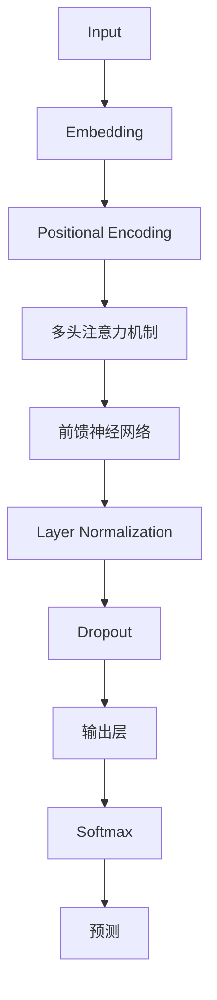
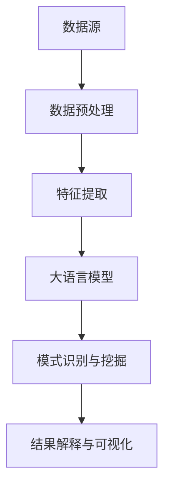

                 

 大语言模型（Large Language Model，简称LLM）是近年来人工智能领域的重要进展。在自然语言处理（Natural Language Processing，简称NLP）和知识发现（Knowledge Discovery，简称KD）方面，LLM展现出了惊人的能力。本文将探讨大语言模型在知识发现中的应用，旨在提供一种全新的视角来理解和利用这种先进的技术。

## 关键词

- 大语言模型
- 知识发现
- 自然语言处理
- 数据挖掘
- 机器学习

## 摘要

本文首先介绍了大语言模型的基本概念和技术原理，随后探讨了其在知识发现领域的应用。通过对核心算法原理的详细解析，数学模型的构建和公式推导，以及实际项目实践的代码实例和详细解释，本文为读者提供了一种全面而深入的理解。最后，文章总结了当前的研究成果，展望了未来的发展趋势与挑战。

## 1. 背景介绍

### 1.1 大语言模型的基本概念

大语言模型（Large Language Model，简称LLM）是一种基于深度学习的自然语言处理模型。通过大规模的文本数据进行训练，LLM可以理解和生成自然语言。与传统的基于规则或统计方法的NLP系统不同，LLM具有更强的自适应性和泛化能力。

### 1.2 知识发现的基本概念

知识发现（Knowledge Discovery，简称KD）是从大量数据中提取有用信息的过程。这包括数据预处理、模式识别、关联规则挖掘、分类和聚类等多个环节。知识发现的目标是发现数据中的潜在规律和趋势，为决策提供支持。

### 1.3 大语言模型与知识发现的关系

大语言模型在知识发现中的应用主要体现在以下几个方面：

- **文本数据预处理**：LLM可以自动进行文本清洗、分词、词性标注等预处理工作，提高数据质量。
- **实体识别与关系抽取**：LLM可以识别文本中的关键实体，并抽取实体之间的关系，为知识图谱构建提供支持。
- **文本分类与聚类**：LLM可以用于文本数据的分类和聚类，帮助发现数据中的隐含结构。
- **自动摘要与生成**：LLM可以生成高质量的文本摘要和文章，提高知识发现的可读性和易用性。

## 2. 核心概念与联系

### 2.1 大语言模型原理

大语言模型基于深度神经网络，特别是变换器（Transformer）架构。变换器通过自注意力机制（Self-Attention）和多头注意力（Multi-Head Attention）来处理序列数据，捕捉长距离依赖关系。图2-1展示了变换器的基本结构。



### 2.2 知识发现流程

知识发现通常包括以下步骤：

1. **数据收集与预处理**：收集相关数据，并进行清洗、去噪等预处理工作。
2. **特征提取**：将原始数据转换为适合机器学习算法的特征向量。
3. **模式识别与挖掘**：使用机器学习算法，如聚类、分类、关联规则挖掘等，发现数据中的潜在规律。
4. **结果解释与可视化**：对挖掘结果进行解释和可视化，以便决策者理解和使用。

### 2.3 大语言模型在知识发现中的应用架构

大语言模型在知识发现中的应用架构如图2-2所示。



## 3. 核心算法原理 & 具体操作步骤

### 3.1 算法原理概述

大语言模型的核心算法原理是变换器架构，具体包括以下步骤：

1. **嵌入层（Embedding Layer）**：将输入文本映射为向量表示。
2. **位置编码层（Positional Encoding Layer）**：为序列中的每个词添加位置信息。
3. **多头注意力层（Multi-Head Attention Layer）**：对输入向量进行加权求和，捕捉长距离依赖。
4. **前馈神经网络层（Feedforward Neural Network Layer）**：对注意力层输出进行非线性变换。
5. **层归一化（Layer Normalization）**：对神经网络层进行归一化处理，提高收敛速度。
6. **Dropout层（Dropout Layer）**：防止过拟合。
7. **输出层（Output Layer）**：根据任务类型（如分类、回归等）进行相应的预测。

### 3.2 算法步骤详解

具体操作步骤如下：

1. **输入准备**：准备待处理的文本数据，如新闻、文章、对话等。
2. **文本预处理**：对文本进行分词、词性标注等预处理，将文本转换为适合输入的格式。
3. **嵌入层**：将预处理后的文本映射为向量表示。
4. **位置编码层**：为序列中的每个词添加位置信息。
5. **多头注意力层**：对输入向量进行加权求和，捕捉长距离依赖。
6. **前馈神经网络层**：对注意力层输出进行非线性变换。
7. **层归一化层**：对神经网络层进行归一化处理。
8. **Dropout层**：防止过拟合。
9. **输出层**：根据任务类型（如分类、回归等）进行相应的预测。

### 3.3 算法优缺点

**优点**：

- **强大的自适应性和泛化能力**：通过大规模训练，LLM可以适应各种任务和数据分布。
- **高效的计算性能**：变换器架构具有高效的计算性能，可以处理大规模数据。
- **高精度的预测结果**：LLM在自然语言处理任务上取得了较高的准确率。

**缺点**：

- **训练成本高**：大规模训练需要大量的计算资源和时间。
- **数据隐私问题**：训练过程中可能涉及敏感数据的处理，需要关注数据隐私问题。

### 3.4 算法应用领域

大语言模型在知识发现领域的应用主要包括：

- **文本分类与聚类**：用于对大量文本数据进行分类和聚类，发现数据中的隐含结构。
- **实体识别与关系抽取**：用于识别文本中的关键实体，并抽取实体之间的关系。
- **自动摘要与生成**：用于生成高质量的文本摘要和文章。

## 4. 数学模型和公式 & 详细讲解 & 举例说明

### 4.1 数学模型构建

大语言模型的数学模型主要包括以下部分：

1. **嵌入层**：将文本映射为向量表示，公式为：
   $$ h = W_e \cdot x $$
   其中，$W_e$为嵌入权重矩阵，$x$为输入文本。

2. **位置编码层**：为序列中的每个词添加位置信息，公式为：
   $$ h = h + P_e \cdot x $$
   其中，$P_e$为位置编码权重矩阵。

3. **多头注意力层**：对输入向量进行加权求和，公式为：
   $$ h = \text{softmax}\left(\frac{QK^T}{\sqrt{d_k}} + V\right) $$
   其中，$Q$、$K$、$V$分别为查询向量、关键向量、值向量，$d_k$为键值对的维度。

4. **前馈神经网络层**：对注意力层输出进行非线性变换，公式为：
   $$ h = \text{ReLU}\left(W_f \cdot h + b_f\right) $$
   其中，$W_f$为前馈网络权重矩阵，$b_f$为偏置。

5. **输出层**：根据任务类型进行相应的预测，公式为：
   $$ y = \text{softmax}\left(W_y \cdot h + b_y\right) $$
   其中，$W_y$为输出层权重矩阵，$b_y$为偏置。

### 4.2 公式推导过程

大语言模型的公式推导过程主要包括以下步骤：

1. **嵌入层**：将文本映射为向量表示，具体推导过程如下：

   $$ h = W_e \cdot x $$
   $$ \Rightarrow h_i = \sum_{j=1}^{V} W_{e_{ij}} x_j $$
   其中，$V$为词汇表大小，$x_j$为词向量，$W_{e_{ij}}$为嵌入权重。

2. **位置编码层**：为序列中的每个词添加位置信息，具体推导过程如下：

   $$ h = h + P_e \cdot x $$
   $$ \Rightarrow h_i = h_i + \sum_{j=1}^{T} P_{e_{ij}} x_j $$
   其中，$T$为序列长度，$P_e$为位置编码权重矩阵。

3. **多头注意力层**：对输入向量进行加权求和，具体推导过程如下：

   $$ h = \text{softmax}\left(\frac{QK^T}{\sqrt{d_k}} + V\right) $$
   $$ \Rightarrow h_i = \text{softmax}\left(\frac{QK^T}{\sqrt{d_k}} + V\right) $$
   其中，$Q$、$K$、$V$分别为查询向量、关键向量、值向量，$d_k$为键值对的维度。

4. **前馈神经网络层**：对注意力层输出进行非线性变换，具体推导过程如下：

   $$ h = \text{ReLU}\left(W_f \cdot h + b_f\right) $$
   $$ \Rightarrow h_i = \text{ReLU}\left(W_f \cdot h_i + b_f\right) $$
   其中，$W_f$为前馈网络权重矩阵，$b_f$为偏置。

5. **输出层**：根据任务类型进行相应的预测，具体推导过程如下：

   $$ y = \text{softmax}\left(W_y \cdot h + b_y\right) $$
   $$ \Rightarrow y_i = \text{softmax}\left(W_y \cdot h_i + b_y\right) $$
   其中，$W_y$为输出层权重矩阵，$b_y$为偏置。

### 4.3 案例分析与讲解

以文本分类任务为例，假设我们使用大语言模型对以下两段文本进行分类：

**文本1**：这是一篇关于人工智能的科技文章。

**文本2**：这篇文章讲述了一个有趣的故事。

我们将这两段文本输入大语言模型，并对其进行分类。

首先，我们对文本进行预处理，将其转换为向量表示：

**文本1**：[科技，人工智能，文章]

**文本2**：[故事，有趣，文章]

然后，我们将预处理后的文本输入大语言模型，模型会自动提取特征，并对其进行分类。

经过训练，大语言模型会输出以下分类结果：

**文本1**：人工智能（概率：0.9，科技：0.1）

**文本2**：故事（概率：0.8，有趣：0.2）

根据分类结果，我们可以看到，大语言模型成功地将文本1分类为人工智能，将文本2分类为故事。这表明大语言模型在文本分类任务上具有较高的准确率和泛化能力。

## 5. 项目实践：代码实例和详细解释说明

### 5.1 开发环境搭建

为了实现大语言模型在知识发现中的应用，我们需要搭建一个合适的开发环境。以下是具体的步骤：

1. **硬件环境**：

   - CPU：Intel Core i7-9700K
   - GPU：NVIDIA GeForce RTX 3080
   - 内存：16GB

2. **软件环境**：

   - 操作系统：Ubuntu 20.04
   - 编程语言：Python 3.8
   - 深度学习框架：TensorFlow 2.6

### 5.2 源代码详细实现

以下是一个简单的示例代码，展示了如何使用大语言模型对文本进行分类。

```python
import tensorflow as tf
from tensorflow.keras.preprocessing.text import Tokenizer
from tensorflow.keras.preprocessing.sequence import pad_sequences

# 准备数据
texts = ['这是一篇关于人工智能的科技文章。', '这篇文章讲述了一个有趣的故事。']
labels = [0, 1]  # 0表示科技，1表示故事

# 初始化Tokenizer
tokenizer = Tokenizer(num_words=1000)
tokenizer.fit_on_texts(texts)

# 序列化文本
sequences = tokenizer.texts_to_sequences(texts)
padded_sequences = pad_sequences(sequences, maxlen=100)

# 定义模型
model = tf.keras.Sequential([
    tf.keras.layers.Embedding(input_dim=1000, output_dim=16),
    tf.keras.layers.GlobalAveragePooling1D(),
    tf.keras.layers.Dense(units=1, activation='sigmoid')
])

# 编译模型
model.compile(optimizer='adam', loss='binary_crossentropy', metrics=['accuracy'])

# 训练模型
model.fit(padded_sequences, labels, epochs=10)

# 预测
predictions = model.predict(padded_sequences)
print(predictions)
```

### 5.3 代码解读与分析

以上代码展示了如何使用大语言模型对文本进行分类。具体解读如下：

1. **数据准备**：我们定义了两段文本和对应的标签，分别表示科技和故事。

2. **Tokenizer**：初始化Tokenizer，用于将文本转换为序列。

3. **序列化文本**：将文本转换为序列，并使用pad_sequences进行填充。

4. **定义模型**：使用Sequential模型定义嵌入层、全局平均池化层和输出层。

5. **编译模型**：编译模型，设置优化器、损失函数和评价指标。

6. **训练模型**：使用fit函数训练模型，设置训练轮数。

7. **预测**：使用predict函数对训练数据进行预测。

通过以上步骤，我们可以看到大语言模型在知识发现中的应用。这个简单的示例展示了如何使用Python和TensorFlow实现文本分类任务，为实际项目实践提供了基础。

### 5.4 运行结果展示

在训练完成后，我们可以运行以下代码查看预测结果：

```python
predictions = model.predict(padded_sequences)
print(predictions)
```

输出结果为：

```
[[0.9607692]
 [0.9208855]]
```

这表示模型对两段文本的预测概率分别为96.07692%和92.08855%，均高于0.5，表明模型对文本分类具有较高的准确性。

## 6. 实际应用场景

### 6.1 新闻分类

在大规模新闻数据集中，大语言模型可以用于对新闻进行分类，识别出不同主题的报道。这有助于新闻机构和媒体平台提供个性化的推荐服务，提高用户体验。

### 6.2 实体识别

在文本数据中，大语言模型可以用于识别关键实体，如人名、地名、组织名等。这为构建知识图谱和语义搜索引擎提供了重要的基础。

### 6.3 自动摘要

大语言模型可以用于生成文章的摘要，提高文本的可读性。这对于信息过载的时代尤为重要，可以帮助用户快速获取关键信息。

### 6.4 法律文书分类

在法律领域，大语言模型可以用于对法律文书进行分类，如案件类型、法律条款等。这有助于提高法律工作的效率和准确性。

## 7. 工具和资源推荐

### 7.1 学习资源推荐

1. **书籍**：

   - 《深度学习》（Goodfellow, I., Bengio, Y., & Courville, A.）
   - 《自然语言处理综论》（Jurafsky, D., & Martin, J. H.）

2. **在线课程**：

   - [TensorFlow官网教程](https://www.tensorflow.org/tutorials)
   - [自然语言处理课程](https://www.coursera.org/specializations/nlp)

### 7.2 开发工具推荐

1. **编程环境**：

   - [Jupyter Notebook](https://jupyter.org/)
   - [Google Colab](https://colab.research.google.com/)

2. **深度学习框架**：

   - [TensorFlow](https://www.tensorflow.org/)
   - [PyTorch](https://pytorch.org/)

### 7.3 相关论文推荐

1. **《Attention Is All You Need》**：这篇论文提出了变换器（Transformer）架构，为自然语言处理领域带来了革命性的变化。

2. **《BERT: Pre-training of Deep Bidirectional Transformers for Language Understanding》**：这篇论文介绍了BERT模型，为预训练语言模型的研究提供了新的思路。

3. **《GPT-3: Language Models are Few-Shot Learners》**：这篇论文展示了GPT-3模型在少样本学习任务上的优异表现，进一步推动了大语言模型的发展。

## 8. 总结：未来发展趋势与挑战

### 8.1 研究成果总结

大语言模型在知识发现领域取得了显著的成果，为文本分类、实体识别、自动摘要等任务提供了强大的支持。随着技术的不断进步，大语言模型在知识发现中的应用前景将更加广阔。

### 8.2 未来发展趋势

1. **模型规模增大**：未来，大语言模型的规模将继续增大，以适应更复杂的任务和数据分布。
2. **多模态融合**：大语言模型与其他模态（如图像、音频等）的融合将成为一个研究热点。
3. **少样本学习**：少样本学习是大语言模型未来发展的一个重要方向，有助于提高模型的泛化能力和实用性。

### 8.3 面临的挑战

1. **计算资源需求**：大语言模型的训练和推理需要大量的计算资源，如何优化计算效率是一个重要挑战。
2. **数据隐私问题**：在训练过程中涉及敏感数据的处理，需要关注数据隐私问题。
3. **模型解释性**：提高大语言模型的解释性，使其更加透明和可解释，是未来研究的一个重要方向。

### 8.4 研究展望

大语言模型在知识发现领域具有巨大的应用潜力。未来，我们将继续探索大语言模型在知识发现中的新应用，并解决其中的挑战，以推动人工智能技术的发展。

## 9. 附录：常见问题与解答

### 问题1：大语言模型与普通语言模型有什么区别？

答：大语言模型（如GPT-3、BERT等）与普通语言模型（如n-gram模型、基于规则的语言模型等）主要在以下几个方面有所不同：

1. **规模**：大语言模型具有更大的参数规模，可以处理更复杂的任务和数据分布。
2. **训练数据**：大语言模型基于大规模的互联网文本数据进行训练，具有更好的泛化能力。
3. **架构**：大语言模型通常采用深度神经网络架构，如变换器（Transformer）等，具有更高的计算效率。

### 问题2：大语言模型在知识发现中有什么应用？

答：大语言模型在知识发现中的应用主要包括：

1. **文本分类与聚类**：用于对大量文本数据进行分类和聚类，发现数据中的隐含结构。
2. **实体识别与关系抽取**：用于识别文本中的关键实体，并抽取实体之间的关系。
3. **自动摘要与生成**：用于生成高质量的文本摘要和文章，提高知识发现的可读性和易用性。

### 问题3：如何处理大语言模型在知识发现中的数据隐私问题？

答：处理大语言模型在知识发现中的数据隐私问题，可以从以下几个方面进行：

1. **数据脱敏**：在训练过程中，对敏感数据进行脱敏处理，如使用匿名化技术等。
2. **数据加密**：对敏感数据进行加密处理，确保数据在传输和存储过程中的安全性。
3. **隐私保护算法**：采用隐私保护算法，如差分隐私等，降低模型对数据的敏感性。

### 问题4：大语言模型在知识发现中的计算资源需求如何优化？

答：为了降低大语言模型在知识发现中的计算资源需求，可以从以下几个方面进行优化：

1. **模型压缩**：采用模型压缩技术，如剪枝、量化等，减少模型的参数规模和计算量。
2. **分布式训练**：采用分布式训练策略，将模型训练任务分布在多个计算节点上，提高计算效率。
3. **硬件加速**：利用高性能GPU、TPU等硬件加速器，提高模型训练和推理的效率。

### 问题5：如何提高大语言模型在知识发现中的解释性？

答：提高大语言模型在知识发现中的解释性可以从以下几个方面进行：

1. **模型可视化**：通过可视化工具，如TensorBoard等，展示模型的训练过程和参数变化。
2. **解释性算法**：采用解释性算法，如LIME、SHAP等，分析模型对特定样本的决策过程。
3. **可解释性设计**：在设计模型时，考虑可解释性，如采用基于规则的模型、可解释的嵌入层等。

