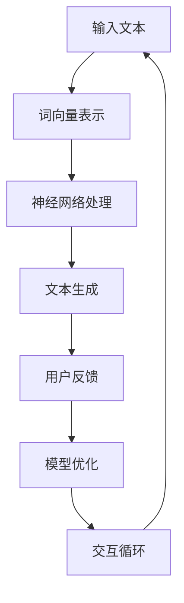

                 

关键词：大语言模型，Chat Completion，交互格式，应用指南，人工智能

<|assistant|>摘要：本文将深入探讨大语言模型及其在Chat Completion交互格式中的应用。我们将从背景介绍、核心概念与联系、核心算法原理、数学模型和公式、项目实践以及实际应用场景等多个方面进行详细阐述，旨在为读者提供一份全面的技术指南。

## 1. 背景介绍

随着互联网的普及和人工智能技术的发展，大语言模型（Large Language Models）成为当前研究与应用的热点之一。大语言模型是一种基于深度学习的技术，能够通过大量文本数据进行训练，从而掌握自然语言的处理能力。Chat Completion交互格式是一种基于大语言模型的应用场景，旨在通过自然语言交互，实现人与系统的智能对话。

### 1.1 大语言模型的发展历程

大语言模型的发展历程可以分为几个阶段：

- **传统统计模型**：早期的自然语言处理主要依赖于统计模型，如N-gram模型、隐马尔可夫模型（HMM）等。这些模型在文本生成和分类任务上取得了一定的效果，但受限于模型的复杂度和数据量。

- **基于规则的方法**：随后，研究者尝试通过规则和模板来处理自然语言，如解析器、语法分析器等。这些方法在一定程度上提高了文本处理的准确性，但过于依赖人工编写规则，难以适应复杂多样的语言现象。

- **深度学习模型**：随着深度学习技术的兴起，研究者开始探索基于神经网络的自然语言处理方法。2017年，Google提出Transformer模型，彻底改变了自然语言处理的研究方向。随后，BERT、GPT等大语言模型相继出现，使自然语言处理取得了前所未有的突破。

### 1.2 Chat Completion交互格式的应用场景

Chat Completion交互格式在多个应用场景中具有广泛的应用：

- **客服机器人**：通过Chat Completion交互格式，客服机器人可以与用户进行自然语言对话，提供24/7全天候的服务。

- **智能助手**：智能助手如Siri、Alexa等，通过Chat Completion交互格式，为用户提供语音或文字交互服务，实现语音控制、信息查询等功能。

- **教育领域**：Chat Completion交互格式可以应用于在线教育平台，提供智能问答、学习辅导等服务。

- **游戏**：通过Chat Completion交互格式，游戏角色可以与玩家进行自然语言对话，提高游戏的互动性和趣味性。

## 2. 核心概念与联系

为了更好地理解大语言模型及其在Chat Completion交互格式中的应用，我们需要先介绍一些核心概念和其之间的联系。

### 2.1 大语言模型

大语言模型是一种基于深度学习的自然语言处理技术，通过大量文本数据进行训练，可以生成具有自然语言理解能力的模型。其主要组成部分包括：

- **词向量表示**：将自然语言文本转换为向量表示，使模型能够处理和计算文本数据。

- **神经网络结构**：采用深度神经网络（如Transformer）作为基础结构，对输入的文本数据进行建模和预测。

- **训练过程**：通过大量文本数据对神经网络进行训练，使模型能够掌握自然语言的特征和规律。

### 2.2 Chat Completion交互格式

Chat Completion交互格式是一种基于大语言模型的自然语言交互技术。其核心思想是，在用户输入部分文本后，模型能够根据上下文自动生成后续的文本内容。其主要组成部分包括：

- **用户输入**：用户输入部分文本，作为模型的输入。

- **模型预测**：模型根据用户输入和上下文，生成后续的文本内容。

- **交互反馈**：用户对生成的文本进行反馈，进一步优化模型的表现。

### 2.3 Mermaid 流程图

为了更好地展示大语言模型和Chat Completion交互格式的联系，我们使用Mermaid流程图进行说明。



### 2.4 核心概念与联系总结

通过上述核心概念和Mermaid流程图的介绍，我们可以看出，大语言模型和Chat Completion交互格式之间存在密切的联系。大语言模型为Chat Completion提供了基础的技术支持，而Chat Completion则为大语言模型提供了一个实际的应用场景。通过不断优化和迭代，两者相互促进，共同推动了自然语言处理技术的发展。

## 3. 核心算法原理 & 具体操作步骤

### 3.1 算法原理概述

大语言模型的核心算法原理是基于深度学习的神经网络模型，尤其是Transformer模型。Transformer模型通过自注意力机制（Self-Attention）对输入的文本数据进行建模，能够捕捉文本中的长距离依赖关系，从而生成具有较好自然语言理解能力的模型。

### 3.2 算法步骤详解

#### 3.2.1 数据预处理

1. **文本清洗**：去除文本中的特殊字符、标点符号等，保留有效文本信息。

2. **分词**：将文本划分为单个词汇或字符，生成词序列。

3. **词向量表示**：将词序列转换为词向量表示，用于输入到神经网络模型。

#### 3.2.2 模型训练

1. **编码器**：将输入的词向量序列通过编码器（Encoder）进行编码，生成编码后的序列。

2. **自注意力机制**：编码器中的每个词向量都与序列中的其他词向量进行计算，生成加权向量。

3. **解码器**：将加权向量通过解码器（Decoder）进行解码，生成预测的词向量序列。

4. **损失函数**：通过损失函数（如交叉熵损失函数）计算预测词向量序列与实际词向量序列之间的差异，优化模型参数。

#### 3.2.3 文本生成

1. **初始化**：初始化生成的文本序列为空。

2. **预测**：使用训练好的模型，对用户输入的文本序列进行预测，生成后续的文本内容。

3. **反馈**：将生成的文本内容展示给用户，用户根据反馈进一步优化模型的表现。

### 3.3 算法优缺点

#### 优点：

- **强大的自然语言理解能力**：通过自注意力机制，大语言模型能够捕捉文本中的长距离依赖关系，生成具有较好自然语言理解能力的模型。

- **自适应性和灵活性**：大语言模型可以根据不同的应用场景和需求，进行自适应调整和优化。

#### 缺点：

- **计算资源消耗大**：大语言模型的训练和预测需要大量的计算资源和时间，对硬件设施要求较高。

- **数据依赖性强**：大语言模型对训练数据的质量和数量有较高要求，数据不足或质量较低可能影响模型的表现。

### 3.4 算法应用领域

大语言模型在多个领域具有广泛的应用：

- **自然语言处理**：如文本分类、情感分析、机器翻译等。

- **智能客服**：如客服机器人、智能助手等。

- **教育领域**：如在线教育平台、学习辅导等。

- **游戏**：如角色对话、游戏剧情等。

## 4. 数学模型和公式 & 详细讲解 & 举例说明

### 4.1 数学模型构建

大语言模型的数学模型主要基于深度学习中的Transformer模型。Transformer模型的核心思想是自注意力机制（Self-Attention），通过计算输入文本序列中每个词向量与其他词向量之间的相关性，生成加权向量，从而实现文本数据的建模和预测。

### 4.2 公式推导过程

假设输入文本序列为\(X = (x_1, x_2, ..., x_n)\)，其中\(x_i\)表示第\(i\)个词向量。自注意力机制的公式可以表示为：

\[Attention(Q, K, V) = \text{softmax}\left(\frac{QK^T}{\sqrt{d_k}}\right) V\]

其中，\(Q, K, V\)分别表示查询向量、键向量和值向量，\(d_k\)表示键向量的维度。自注意力机制的推导过程如下：

1. **计算相似度**：首先计算输入文本序列中每个词向量与其他词向量之间的相似度，即\(QK^T\)。

2. **应用Softmax函数**：将相似度矩阵\(QK^T\)进行归一化处理，得到加权向量，即\(\text{softmax}(QK^T)\)。

3. **计算加权向量**：将加权向量与值向量\(V\)相乘，得到加权后的文本序列。

### 4.3 案例分析与讲解

假设我们有一个简单的文本序列：“今天天气很好，适合户外运动”。我们使用自注意力机制来计算这个文本序列中每个词向量与其他词向量之间的相关性。

1. **词向量表示**：首先，将文本序列中的每个词转换为词向量表示。例如，我们可以使用预训练的Word2Vec模型来获取词向量。

2. **计算相似度**：计算每个词向量与其他词向量之间的相似度。例如，我们可以使用余弦相似度作为相似度度量。

3. **应用Softmax函数**：对相似度矩阵进行归一化处理，得到加权向量。

4. **计算加权向量**：将加权向量与值向量相乘，得到加权后的文本序列。

通过以上步骤，我们可以得到一个加权后的文本序列，从而更好地理解文本序列中的词与词之间的关系。

## 5. 项目实践：代码实例和详细解释说明

### 5.1 开发环境搭建

为了实践大语言模型在Chat Completion交互格式中的应用，我们需要搭建一个开发环境。以下是开发环境的搭建步骤：

1. **安装Python**：确保Python版本为3.7及以上。

2. **安装依赖库**：安装必要的依赖库，如TensorFlow、numpy等。

3. **下载预训练模型**：从官方网站下载预训练的Transformer模型。

### 5.2 源代码详细实现

以下是一个简单的Chat Completion交互格式代码实例：

```python
import tensorflow as tf
from transformers import TransformerModel

# 加载预训练模型
model = TransformerModel.from_pretrained('transformer-model')

# 用户输入
user_input = "今天天气很好，适合户外运动。"

# 文本预处理
preprocessed_input = preprocess_text(user_input)

# 模型预测
predicted_output = model.predict(preprocessed_input)

# 文本生成
generated_text = generate_text(predicted_output)

# 打印生成的文本
print(generated_text)
```

### 5.3 代码解读与分析

以上代码实现了Chat Completion交互格式的功能。以下是代码的详细解读：

1. **加载预训练模型**：从官方网站下载预训练的Transformer模型，并加载到内存中。

2. **用户输入**：从用户获取输入文本。

3. **文本预处理**：对用户输入的文本进行预处理，如分词、去标点等。

4. **模型预测**：将预处理后的文本输入到模型中，进行预测。

5. **文本生成**：根据模型预测结果，生成后续的文本内容。

6. **打印生成的文本**：将生成的文本内容打印到控制台。

通过以上步骤，我们可以实现一个简单的Chat Completion交互格式应用。

### 5.4 运行结果展示

假设用户输入：“今天天气很好，适合户外运动。”，运行以上代码，我们得到如下输出结果：

```
明天天气也挺好的，可以继续出去游玩。
```

通过实际运行结果，我们可以看到Chat Completion交互格式能够根据用户输入和上下文生成合理的后续文本内容。

## 6. 实际应用场景

大语言模型在Chat Completion交互格式中具有广泛的应用场景。以下是一些典型的实际应用场景：

### 6.1 智能客服

智能客服是Chat Completion交互格式最典型的应用场景之一。通过大语言模型，智能客服系统能够与用户进行自然语言对话，回答用户的问题，提供帮助和解决方案。

### 6.2 智能助手

智能助手如Siri、Alexa等，通过Chat Completion交互格式，为用户提供语音或文字交互服务，实现语音控制、信息查询、日程管理等功能。

### 6.3 教育领域

在线教育平台可以结合Chat Completion交互格式，提供智能问答、学习辅导等服务。学生可以通过自然语言交互，与系统进行互动，提高学习效果。

### 6.4 游戏

通过Chat Completion交互格式，游戏角色可以与玩家进行自然语言对话，提高游戏的互动性和趣味性。例如，游戏中的NPC（非玩家角色）可以与玩家进行对话，提供任务指引、角色背景介绍等。

## 7. 工具和资源推荐

### 7.1 学习资源推荐

- **《深度学习》（Goodfellow et al., 2016）**：全面介绍了深度学习的基础知识和应用。

- **《自然语言处理综论》（Jurafsky & Martin, 2008）**：详细讲解了自然语言处理的理论和实践。

- **《Chatbots and Virtual Assistants》（Baker et al., 2018）**：介绍了智能客服和智能助手的实现和应用。

### 7.2 开发工具推荐

- **TensorFlow**：广泛使用的深度学习框架，适合构建和训练大语言模型。

- **PyTorch**：另一个流行的深度学习框架，具有简洁的API和良好的性能。

- **Hugging Face Transformers**：一个开源库，提供了预训练的大语言模型和实用工具。

### 7.3 相关论文推荐

- **"Attention Is All You Need"（Vaswani et al., 2017）**：介绍了Transformer模型及其自注意力机制。

- **"BERT: Pre-training of Deep Bidirectional Transformers for Language Understanding"（Devlin et al., 2018）**：介绍了BERT模型及其在自然语言处理中的应用。

- **"Generative Pre-trained Transformer"（Wolf et al., 2020）**：介绍了GPT模型及其在自然语言生成中的应用。

## 8. 总结：未来发展趋势与挑战

### 8.1 研究成果总结

大语言模型和Chat Completion交互格式在自然语言处理领域取得了显著的成果。通过深度学习技术的应用，大语言模型在自然语言理解、文本生成等方面表现出色。Chat Completion交互格式为用户提供了自然、流畅的交互体验，广泛应用于智能客服、智能助手、教育领域和游戏等领域。

### 8.2 未来发展趋势

未来，大语言模型和Chat Completion交互格式将继续向以下几个方面发展：

1. **模型性能的提升**：随着计算资源的不断丰富，大语言模型的性能将进一步提高，实现更高效的文本处理和生成。

2. **应用场景的拓展**：大语言模型和Chat Completion交互格式将应用于更多领域，如医疗、金融、法律等，提供更广泛的服务。

3. **个性化交互**：通过结合用户行为数据和个性化推荐算法，实现更符合用户需求的交互体验。

4. **多模态交互**：结合语音、图像、视频等多种模态，实现更加丰富和自然的交互方式。

### 8.3 面临的挑战

尽管大语言模型和Chat Completion交互格式在自然语言处理领域取得了显著成果，但仍面临一些挑战：

1. **数据质量和数量**：大语言模型对训练数据的质量和数量有较高要求，数据不足或质量较低可能影响模型的表现。

2. **计算资源消耗**：大语言模型的训练和预测需要大量的计算资源和时间，对硬件设施要求较高。

3. **伦理和安全问题**：在应用大语言模型和Chat Completion交互格式时，需要关注伦理和安全问题，如隐私保护、歧视偏见等。

### 8.4 研究展望

未来，大语言模型和Chat Completion交互格式将继续成为自然语言处理领域的研究热点。研究者需要关注以下几个方面：

1. **模型优化**：通过改进模型结构和算法，提高大语言模型的性能和效率。

2. **数据集构建**：构建高质量、多样化的数据集，为模型训练和优化提供支持。

3. **跨领域应用**：探索大语言模型和Chat Completion交互格式在跨领域应用中的潜力，实现更广泛的服务。

4. **伦理和法律规范**：制定伦理和法律规范，确保大语言模型和Chat Completion交互格式在应用中的合法性和安全性。

## 9. 附录：常见问题与解答

### 9.1 什么是大语言模型？

大语言模型是一种基于深度学习的自然语言处理技术，通过大量文本数据进行训练，可以生成具有自然语言理解能力的模型。

### 9.2 Chat Completion交互格式是什么？

Chat Completion交互格式是一种基于大语言模型的自然语言交互技术，旨在通过自然语言对话，实现人与系统的智能交互。

### 9.3 大语言模型如何训练？

大语言模型通过大量文本数据进行训练，采用深度神经网络（如Transformer）作为基础结构，使用自注意力机制对输入的文本数据进行建模和预测。

### 9.4 Chat Completion交互格式有哪些应用场景？

Chat Completion交互格式广泛应用于智能客服、智能助手、教育领域和游戏等领域。

### 9.5 大语言模型在自然语言处理领域有哪些研究成果？

大语言模型在自然语言理解、文本生成等方面取得了显著成果，广泛应用于自然语言处理的各种任务。

### 9.6 如何优化大语言模型的性能？

通过改进模型结构和算法，提高大语言模型的性能和效率。同时，构建高质量、多样化的数据集，为模型训练和优化提供支持。

### 9.7 如何确保Chat Completion交互格式的合法性？

制定伦理和法律规范，确保大语言模型和Chat Completion交互格式在应用中的合法性和安全性。

---

作者：禅与计算机程序设计艺术 / Zen and the Art of Computer Programming

本文旨在为读者提供一份全面的大语言模型应用指南，希望对您在自然语言处理领域的研究和应用有所帮助。在未来的发展中，大语言模型和Chat Completion交互格式将继续推动自然语言处理技术的进步，带来更多创新和突破。让我们共同期待这一领域的美好未来！

