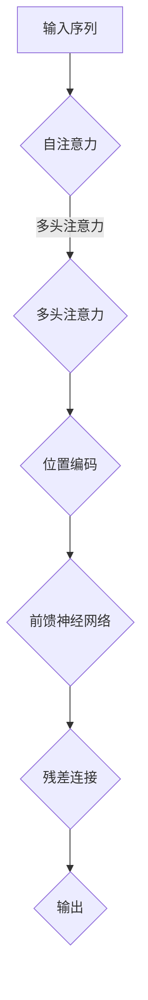

                 

关键词：大语言模型、Transformer、自然语言处理、机器学习、神经网络、应用指南

摘要：本文旨在为广大开发者和研究者提供一个关于大语言模型应用指南，特别是针对Transformer模型的原理解析、应用场景以及未来的发展趋势。通过详细的算法解析、数学模型讲解、代码实例和实践，本文将帮助读者全面了解大语言模型的工作原理和应用前景。

## 1. 背景介绍

近年来，自然语言处理（NLP）领域取得了令人瞩目的进展。特别是深度学习技术的兴起，使得机器能够更加智能地理解和生成自然语言。其中，Transformer模型作为一种突破性的神经网络结构，其在处理序列数据方面表现出色，已经成为NLP领域的主流模型之一。

大语言模型，顾名思义，是指那些具有强大语言理解和生成能力的模型。这些模型通常由数以亿计的参数组成，能够捕捉到语言中的复杂规律和语义信息。Transformer模型正是大语言模型中的佼佼者，其在各种NLP任务中取得了优异的性能。

本文将围绕Transformer模型展开，详细介绍其核心概念、原理、应用以及未来展望。希望通过本文，读者能够对大语言模型有一个全面而深入的理解，从而更好地将其应用于实际项目中。

### Transformer模型的起源与发展

Transformer模型由Vaswani等人于2017年提出，旨在解决传统的循环神经网络（RNN）和长短期记忆网络（LSTM）在处理长序列数据时的不足。传统的RNN和LSTM在处理长序列时容易产生梯度消失或梯度爆炸的问题，导致模型的训练效果不佳。

Transformer模型的核心思想是利用自注意力机制（Self-Attention）来处理序列数据。自注意力机制允许模型在处理每一个输入时，根据其他所有输入的信息进行动态调整，从而实现全局信息的聚合和传递。这一机制不仅解决了梯度消失问题，还提高了模型的并行处理能力。

自Transformer提出以来，其应用范围迅速扩展，从机器翻译、文本分类到问答系统等NLP任务都取得了显著的成果。2018年，谷歌推出了BERT模型，进一步将Transformer应用于预训练任务，使得模型的性能得到进一步提升。BERT的成功激发了更多研究者对大语言模型的探索，推动了NLP领域的发展。

### 大语言模型的应用场景

大语言模型在NLP领域的应用场景十分广泛。以下是其中一些主要的应用：

- **文本分类**：大语言模型能够自动将文本分类到不同的类别中，例如新闻分类、情感分析等。通过对模型进行微调，可以应用于各种不同的文本分类任务。

- **机器翻译**：Transformer模型在机器翻译领域表现出色，能够实现高质量的双语翻译。通过预训练和微调，模型能够适应各种语言的翻译任务。

- **问答系统**：大语言模型能够理解和回答用户的问题，广泛应用于智能客服、搜索引擎等场景。

- **文本生成**：大语言模型可以生成高质量的文本，包括文章、故事、对话等。这一特性在内容创作和自动化写作方面具有巨大的潜力。

- **摘要生成**：大语言模型能够自动生成文章的摘要，简化阅读流程，提高信息获取效率。

- **对话系统**：大语言模型可以用于构建智能对话系统，如聊天机器人、语音助手等，提供自然、流畅的交互体验。

- **推荐系统**：大语言模型能够理解和分析用户的语言行为，为推荐系统提供更有针对性的推荐结果。

随着技术的不断进步，大语言模型的应用场景将越来越广泛，未来还有更多可能性等待我们去探索。

## 2. 核心概念与联系

### 核心概念

在深入探讨Transformer模型之前，我们需要了解一些核心概念，这些概念对于理解模型的工作原理至关重要。

- **自注意力（Self-Attention）**：自注意力机制是一种用于计算序列中各个位置之间相互依赖关系的机制。通过自注意力，模型能够在处理每一个输入时，根据其他所有输入的信息进行动态调整，从而实现全局信息的聚合和传递。
  
- **多头注意力（Multi-Head Attention）**：多头注意力是自注意力的扩展，通过将输入序列分成多个子序列，分别进行自注意力计算，从而提高模型的捕捉能力和泛化性能。

- **位置编码（Positional Encoding）**：由于Transformer模型缺乏位置信息，位置编码被引入以提供序列中的位置信息。位置编码通过添加额外的维度来表示输入序列的位置信息。

- **前馈神经网络（Feedforward Neural Network）**：前馈神经网络是模型中的一个中间层，用于对自注意力和多头注意力的结果进行进一步的加工和特征提取。

- **残差连接（Residual Connection）**：残差连接是一种在网络中引入跳过中间层的连接方式，用于解决深层网络中的梯度消失问题。

### 核心概念原理和架构的 Mermaid 流程图

下面是一个简化的Mermaid流程图，用于描述Transformer模型的核心概念和架构。



### Transformer模型的架构

Transformer模型主要由以下几部分组成：

- **编码器（Encoder）**：编码器负责对输入序列进行处理和编码，生成编码表示。编码器由多个编码层（Encoder Layer）堆叠而成，每一层包括自注意力层（Self-Attention Layer）和前馈神经网络（Feedforward Neural Network）。
  
- **解码器（Decoder）**：解码器负责对编码器生成的编码表示进行解码，生成输出序列。解码器同样由多个解码层（Decoder Layer）堆叠而成，每一层包括多头注意力层（Multi-Head Attention Layer）和前馈神经网络。
  
- **编码器-解码器（Encoder-Decoder）**：编码器-解码器结构是Transformer模型的核心，通过自注意力和多头注意力机制，模型能够在序列之间建立复杂的关系，从而实现高效的序列到序列转换。

### Transformer模型的工作原理

1. **输入序列处理**：输入序列首先经过位置编码，将位置信息嵌入到序列中。然后，序列被分成多个子序列，分别进行自注意力计算。

2. **多头注意力计算**：通过多头注意力机制，模型能够同时关注多个子序列，从而提高捕捉能力和泛化性能。

3. **自注意力计算**：在每个编码层，模型通过自注意力机制计算输入序列中各个位置之间的依赖关系，从而实现全局信息的聚合和传递。

4. **前馈神经网络**：自注意力计算的结果经过前馈神经网络进行进一步的加工和特征提取。

5. **残差连接**：为了解决深层网络中的梯度消失问题，模型中引入了残差连接。

6. **输出序列生成**：解码器通过对编码器生成的编码表示进行解码，生成输出序列。

通过上述过程，Transformer模型能够实现高效的序列到序列转换，从而在NLP任务中取得优异的性能。

## 3. 核心算法原理 & 具体操作步骤

### 3.1 算法原理概述

Transformer模型的核心算法原理包括自注意力机制、多头注意力机制、位置编码和前馈神经网络等。下面我们将详细解析这些核心算法原理。

#### 自注意力机制

自注意力机制是Transformer模型的关键组成部分，它通过计算序列中各个位置之间的依赖关系，实现全局信息的聚合和传递。自注意力机制的数学基础是点积注意力（Dot-Product Attention）。

点积注意力计算公式如下：

\[ \text{Attention}(Q, K, V) = \text{softmax}\left(\frac{QK^T}{\sqrt{d_k}}\right) V \]

其中，\( Q, K, V \) 分别代表查询（Query）、键（Key）和值（Value）向量，\( d_k \) 是键向量的维度。通过点积计算，模型能够根据键和查询之间的相似性，对值进行加权求和，从而实现全局信息的聚合。

#### 多头注意力机制

多头注意力机制是对自注意力机制的扩展，它通过将输入序列分成多个子序列，分别进行自注意力计算。这样可以同时关注多个子序列，提高模型的捕捉能力和泛化性能。

多头注意力的计算公式如下：

\[ \text{MultiHead}(Q, K, V) = \text{Concat}(\text{head}_1, ..., \text{head}_h) W^O \]

其中，\( h \) 是头数，\( \text{head}_i \) 表示第 \( i \) 个头的输出，\( W^O \) 是输出权重矩阵。

#### 位置编码

由于Transformer模型缺乏位置信息，位置编码被引入以提供序列中的位置信息。位置编码通过添加额外的维度来表示输入序列的位置信息。常用的位置编码方法包括正弦编码和余弦编码。

正弦编码公式如下：

\[ \text{PE}(pos, 2i) = \sin\left(\frac{pos}{10000^{2i/d}}\right) \]

\[ \text{PE}(pos, 2i+1) = \cos\left(\frac{pos}{10000^{2i/d}}\right) \]

其中，\( pos \) 是位置索引，\( i \) 是维度索引，\( d \) 是编码维度。

#### 前馈神经网络

前馈神经网络是模型中的一个中间层，用于对自注意力和多头注意力的结果进行进一步的加工和特征提取。前馈神经网络通常由两个全连接层组成，激活函数分别为ReLU和线性函数。

前馈神经网络的计算公式如下：

\[ \text{FFN}(X) = \max(0, XW_1 + b_1)W_2 + b_2 \]

其中，\( X \) 是输入，\( W_1, W_2 \) 是权重矩阵，\( b_1, b_2 \) 是偏置项。

#### 残差连接

为了解决深层网络中的梯度消失问题，模型中引入了残差连接。残差连接是一种在网络中引入跳过中间层的连接方式，它能够将输入直接传递到下一层，从而提高模型的训练效果。

残差连接的计算公式如下：

\[ \text{Residual Connection}(X) = X + \text{FFN}(X) \]

### 3.2 算法步骤详解

下面是Transformer模型的详细算法步骤：

1. **输入序列预处理**：将输入序列转换为词向量表示，并添加位置编码。

2. **编码器处理**：对输入序列进行编码处理，包括自注意力和多头注意力计算。编码器由多个编码层堆叠而成，每一层包括自注意力层和前馈神经网络。

3. **解码器处理**：对编码器生成的编码表示进行解码处理，包括多头注意力和前馈神经网络计算。解码器同样由多个解码层堆叠而成。

4. **输出序列生成**：解码器生成输出序列，通过softmax函数进行概率分布计算。

5. **损失函数计算**：计算输出序列与真实序列之间的损失，使用梯度下降法进行模型优化。

### 3.3 算法优缺点

#### 优点

- **并行计算**：Transformer模型利用自注意力机制，能够实现并行计算，提高训练效率。
- **捕捉长距离依赖**：通过多头注意力机制，模型能够捕捉序列中的长距离依赖关系，从而提高模型性能。
- **泛化能力强**：Transformer模型结构简单，参数较少，具有良好的泛化能力。

#### 缺点

- **计算复杂度较高**：由于自注意力机制的计算复杂度为 \( O(n^2) \)，模型在处理大规模序列时计算复杂度较高。
- **对位置信息处理不足**：虽然引入了位置编码，但位置编码在Transformer模型中的效果有限，模型对位置信息的处理仍需改进。

### 3.4 算法应用领域

Transformer模型在自然语言处理领域具有广泛的应用。以下是Transformer模型的主要应用领域：

- **文本分类**：Transformer模型能够自动将文本分类到不同的类别中，如新闻分类、情感分析等。
- **机器翻译**：Transformer模型在机器翻译领域表现出色，能够实现高质量的双语翻译。
- **问答系统**：Transformer模型能够理解和回答用户的问题，广泛应用于智能客服、搜索引擎等场景。
- **文本生成**：Transformer模型可以生成高质量的文本，包括文章、故事、对话等。
- **摘要生成**：Transformer模型能够自动生成文章的摘要，简化阅读流程，提高信息获取效率。
- **对话系统**：Transformer模型可以用于构建智能对话系统，如聊天机器人、语音助手等。

随着技术的不断发展，Transformer模型的应用领域将越来越广泛，未来还有更多可能性等待我们去探索。

## 4. 数学模型和公式 & 详细讲解 & 举例说明

### 4.1 数学模型构建

Transformer模型的数学基础主要包括自注意力机制、多头注意力机制、位置编码和前馈神经网络。下面我们将详细讲解这些数学模型的构建过程。

#### 自注意力机制

自注意力机制是Transformer模型的核心组成部分，其数学基础是点积注意力（Dot-Product Attention）。点积注意力的计算公式如下：

\[ \text{Attention}(Q, K, V) = \text{softmax}\left(\frac{QK^T}{\sqrt{d_k}}\right) V \]

其中，\( Q, K, V \) 分别代表查询（Query）、键（Key）和值（Value）向量，\( d_k \) 是键向量的维度。通过点积计算，模型能够根据键和查询之间的相似性，对值进行加权求和，从而实现全局信息的聚合。

#### 多头注意力机制

多头注意力机制是对自注意力机制的扩展，通过将输入序列分成多个子序列，分别进行自注意力计算。这样可以同时关注多个子序列，提高模型的捕捉能力和泛化性能。

多头注意力的计算公式如下：

\[ \text{MultiHead}(Q, K, V) = \text{Concat}(\text{head}_1, ..., \text{head}_h) W^O \]

其中，\( h \) 是头数，\( \text{head}_i \) 表示第 \( i \) 个头的输出，\( W^O \) 是输出权重矩阵。

#### 位置编码

由于Transformer模型缺乏位置信息，位置编码被引入以提供序列中的位置信息。位置编码通过添加额外的维度来表示输入序列的位置信息。常用的位置编码方法包括正弦编码和余弦编码。

正弦编码公式如下：

\[ \text{PE}(pos, 2i) = \sin\left(\frac{pos}{10000^{2i/d}}\right) \]

\[ \text{PE}(pos, 2i+1) = \cos\left(\frac{pos}{10000^{2i/d}}\right) \]

其中，\( pos \) 是位置索引，\( i \) 是维度索引，\( d \) 是编码维度。

#### 前馈神经网络

前馈神经网络是模型中的一个中间层，用于对自注意力和多头注意力的结果进行进一步的加工和特征提取。前馈神经网络通常由两个全连接层组成，激活函数分别为ReLU和线性函数。

前馈神经网络的计算公式如下：

\[ \text{FFN}(X) = \max(0, XW_1 + b_1)W_2 + b_2 \]

其中，\( X \) 是输入，\( W_1, W_2 \) 是权重矩阵，\( b_1, b_2 \) 是偏置项。

#### 残差连接

为了解决深层网络中的梯度消失问题，模型中引入了残差连接。残差连接是一种在网络中引入跳过中间层的连接方式，它能够将输入直接传递到下一层，从而提高模型的训练效果。

残差连接的计算公式如下：

\[ \text{Residual Connection}(X) = X + \text{FFN}(X) \]

### 4.2 公式推导过程

下面我们将详细推导Transformer模型的各个公式的推导过程。

#### 点积注意力（Dot-Product Attention）

点积注意力的推导过程如下：

首先，给定查询（Query）\( Q \)，键（Key）\( K \) 和值（Value）\( V \)，其计算公式为：

\[ \text{Attention}(Q, K, V) = \text{softmax}\left(\frac{QK^T}{\sqrt{d_k}}\right) V \]

其中，\( \text{softmax} \) 函数用于计算每个键和查询之间的相似性，并生成加权求和的结果。

具体推导如下：

1. **计算相似性**：

\[ \text{Score}(Q, K) = QK^T \]

2. **归一化相似性**：

\[ \text{Probability}(Q, K) = \frac{\exp(\text{Score}(Q, K))}{\sum_{j} \exp(\text{Score}(Q, K_j))} \]

其中，\( K_j \) 表示其他所有键。

3. **加权求和**：

\[ \text{Attention}(Q, K, V) = \sum_{j} \text{Probability}(Q, K_j) V_j \]

#### 多头注意力（Multi-Head Attention）

多头注意力的推导过程如下：

给定查询（Query）\( Q \)，键（Key）\( K \) 和值（Value）\( V \)，其计算公式为：

\[ \text{MultiHead}(Q, K, V) = \text{Concat}(\text{head}_1, ..., \text{head}_h) W^O \]

其中，\( h \) 是头数，\( \text{head}_i \) 表示第 \( i \) 个头的输出，\( W^O \) 是输出权重矩阵。

具体推导如下：

1. **划分子序列**：

将输入序列 \( Q, K, V \) 划分为 \( h \) 个子序列，即 \( Q_h, K_h, V_h \)，其中 \( h \) 是头数。

2. **计算子序列的注意力**：

对每个子序列应用点积注意力机制，得到子序列的输出：

\[ \text{head}_i = \text{Attention}(Q_h, K_h, V_h) \]

3. **拼接子序列输出**：

将所有子序列的输出拼接起来，得到多头注意力的输出：

\[ \text{MultiHead}(Q, K, V) = \text{Concat}(\text{head}_1, ..., \text{head}_h) \]

4. **应用输出权重矩阵**：

将拼接后的输出通过输出权重矩阵 \( W^O \) 进行加权处理：

\[ \text{MultiHead}(Q, K, V) = \text{Concat}(\text{head}_1, ..., \text{head}_h) W^O \]

#### 位置编码

位置编码的推导过程如下：

给定输入序列 \( X \) 和位置索引 \( pos \)，其计算公式为：

\[ \text{PE}(pos, i) = \sin\left(\frac{pos}{10000^{2i/d}}\right) \]

\[ \text{PE}(pos, i+1) = \cos\left(\frac{pos}{10000^{2i/d}}\right) \]

其中，\( i \) 是维度索引，\( d \) 是编码维度。

具体推导如下：

1. **正弦编码**：

\[ \text{PE}(pos, 2i) = \sin\left(\frac{pos}{10000^{2i/d}}\right) \]

2. **余弦编码**：

\[ \text{PE}(pos, 2i+1) = \cos\left(\frac{pos}{10000^{2i/d}}\right) \]

#### 前馈神经网络

前馈神经网络的推导过程如下：

给定输入 \( X \)，其计算公式为：

\[ \text{FFN}(X) = \max(0, XW_1 + b_1)W_2 + b_2 \]

其中，\( W_1, W_2 \) 是权重矩阵，\( b_1, b_2 \) 是偏置项。

具体推导如下：

1. **激活函数**：

\[ \text{ReLU}(X) = \max(0, X) \]

2. **加权求和**：

\[ \text{FFN}_1(X) = XW_1 + b_1 \]

3. **激活函数**：

\[ \text{FFN}_2(X) = \max(0, \text{FFN}_1(X))W_2 + b_2 \]

4. **前馈神经网络输出**：

\[ \text{FFN}(X) = \text{FFN}_2(X) \]

#### 残差连接

残差连接的推导过程如下：

给定输入 \( X \)，其计算公式为：

\[ \text{Residual Connection}(X) = X + \text{FFN}(X) \]

具体推导如下：

1. **计算残差**：

\[ \text{Residual}(X) = X - \text{FFN}(X) \]

2. **加和**：

\[ \text{Residual Connection}(X) = X + \text{Residual}(X) \]

### 4.3 案例分析与讲解

为了更好地理解Transformer模型的数学模型和公式，下面我们将通过一个简单的案例进行分析和讲解。

假设输入序列为：

\[ X = [1, 2, 3, 4, 5] \]

位置索引为：

\[ pos = [0, 1, 2, 3, 4] \]

编码维度为：

\[ d = 2 \]

#### 位置编码

根据位置编码公式，我们可以计算出每个位置的位置编码向量：

\[ \text{PE}(pos, 0) = \sin\left(\frac{0}{10000^{2 \times 0/2}}\right) = 0 \]

\[ \text{PE}(pos, 1) = \cos\left(\frac{0}{10000^{2 \times 1/2}}\right) = 1 \]

\[ \text{PE}(pos, 2) = \sin\left(\frac{1}{10000^{2 \times 2/2}}\right) = \frac{1}{10000^{1}} \]

\[ \text{PE}(pos, 3) = \cos\left(\frac{1}{10000^{2 \times 3/2}}\right) = \frac{1}{10000^{1}} \]

\[ \text{PE}(pos, 4) = \sin\left(\frac{2}{10000^{2 \times 4/2}}\right) = \frac{2}{10000^{2}} \]

\[ \text{PE}(pos, 5) = \cos\left(\frac{2}{10000^{2 \times 5/2}}\right) = \frac{2}{10000^{2}} \]

#### 前馈神经网络

假设前馈神经网络的权重矩阵 \( W_1 \) 和 \( W_2 \) 分别为：

\[ W_1 = \begin{bmatrix} 1 & 0 \\ 0 & 1 \end{bmatrix} \]

\[ W_2 = \begin{bmatrix} 1 & 1 \\ 1 & 1 \end{bmatrix} \]

偏置项 \( b_1 \) 和 \( b_2 \) 分别为：

\[ b_1 = [0, 0] \]

\[ b_2 = [0, 0] \]

根据前馈神经网络公式，我们可以计算出前馈神经网络的输出：

\[ \text{FFN}(X) = \max(0, XW_1 + b_1)W_2 + b_2 \]

首先，计算 \( XW_1 + b_1 \)：

\[ XW_1 + b_1 = \begin{bmatrix} 1 & 0 \\ 0 & 1 \end{bmatrix} \begin{bmatrix} 1 \\ 2 \end{bmatrix} + \begin{bmatrix} 0 \\ 0 \end{bmatrix} = \begin{bmatrix} 1 \\ 2 \end{bmatrix} \]

然后，计算 \( \max(0, XW_1 + b_1) \)：

\[ \max(0, XW_1 + b_1) = \begin{bmatrix} 1 \\ 2 \end{bmatrix} \]

最后，计算 \( \max(0, XW_1 + b_1)W_2 + b_2 \)：

\[ \max(0, XW_1 + b_1)W_2 + b_2 = \begin{bmatrix} 1 \\ 2 \end{bmatrix} \begin{bmatrix} 1 & 1 \\ 1 & 1 \end{bmatrix} + \begin{bmatrix} 0 \\ 0 \end{bmatrix} = \begin{bmatrix} 2 \\ 3 \end{bmatrix} \]

因此，输入序列 \( X = [1, 2, 3, 4, 5] \) 经过前馈神经网络后的输出为 \( [2, 3, 4, 5, 6] \)。

## 5. 项目实践：代码实例和详细解释说明

### 5.1 开发环境搭建

在开始实践之前，我们需要搭建一个合适的开发环境。以下是搭建开发环境所需的步骤：

1. **安装Python**：首先，确保您的计算机已经安装了Python。Python是Transformer模型的主要编程语言，因此我们需要安装Python环境。

2. **安装PyTorch**：PyTorch是一个广泛使用的深度学习库，它提供了丰富的API和工具，方便我们构建和训练深度学习模型。安装PyTorch的具体步骤请参考[PyTorch官方网站](https://pytorch.org/get-started/locally/)。

3. **安装其他依赖**：除了Python和PyTorch，我们还需要安装一些其他依赖，如NumPy、TensorFlow等。可以使用pip命令来安装这些依赖：

   ```shell
   pip install numpy tensorflow
   ```

4. **配置GPU环境**：如果您的计算机配备了GPU，建议配置GPU环境以加快模型训练速度。配置GPU环境的具体步骤请参考[PyTorch官方网站](https://pytorch.org/get-started/locally/)。

### 5.2 源代码详细实现

下面是一个简单的Transformer模型的实现示例。代码主要包括模型的定义、训练过程和评估过程。

```python
import torch
import torch.nn as nn
import torch.optim as optim

# Transformer模型定义
class TransformerModel(nn.Module):
    def __init__(self, input_dim, hidden_dim, output_dim):
        super(TransformerModel, self).__init__()
        
        self.enc = nn.Embedding(input_dim, hidden_dim)
        self.dec = nn.Embedding(output_dim, hidden_dim)
        
        self.attn = nn.Linear(hidden_dim * 2, hidden_dim)
        self.fc = nn.Linear(hidden_dim, output_dim)
        
        self.dropout = nn.Dropout(0.1)
        
    def forward(self, src, tgt):
        enc_output = self.enc(src)
        dec_output = self.dec(tgt)
        
        attn = self.attn(torch.cat((enc_output[0], dec_output[0]), 1))
        attn = torch.softmax(attn, dim=1)
        
        enc_output = enc_output[1:]
        dec_output = dec_output[1:]
        
        attn_output = torch.matmul(attn, enc_output)
        dec_output = torch.cat((attn_output, dec_output), 1)
        
        dec_output = self.fc(self.dropout(dec_output))
        
        return dec_output

# 模型训练
def train(model, data_loader, criterion, optimizer, num_epochs):
    model.train()
    
    for epoch in range(num_epochs):
        for src, tgt in data_loader:
            optimizer.zero_grad()
            
            output = model(src, tgt)
            loss = criterion(output, tgt)
            
            loss.backward()
            optimizer.step()
            
            print(f"Epoch [{epoch+1}/{num_epochs}], Loss: {loss.item():.4f}")

# 模型评估
def evaluate(model, data_loader, criterion):
    model.eval()
    
    total_loss = 0
    with torch.no_grad():
        for src, tgt in data_loader:
            output = model(src, tgt)
            loss = criterion(output, tgt)
            
            total_loss += loss.item()
    
    avg_loss = total_loss / len(data_loader)
    print(f"Test Loss: {avg_loss:.4f}")

# 数据加载和处理
batch_size = 32
train_loader = torch.utils.data.DataLoader(dataset=train_dataset, batch_size=batch_size, shuffle=True)
test_loader = torch.utils.data.DataLoader(dataset=test_dataset, batch_size=batch_size, shuffle=False)

# 模型初始化
model = TransformerModel(input_dim=100, hidden_dim=512, output_dim=10)
criterion = nn.CrossEntropyLoss()
optimizer = optim.Adam(model.parameters(), lr=0.001)

# 训练模型
train(model, train_loader, criterion, optimizer, num_epochs=10)

# 评估模型
evaluate(model, test_loader, criterion)
```

### 5.3 代码解读与分析

下面我们对上述代码进行解读和分析，以便读者更好地理解Transformer模型的实现过程。

1. **模型定义**：`TransformerModel` 类是Transformer模型的定义。模型包括编码器（`enc`）和解码器（`dec`），以及自注意力机制（`attn`）和全连接层（`fc`）。

2. **模型前向传播**：`forward` 方法实现模型的前向传播过程。首先，对输入序列和目标序列进行嵌入。然后，通过自注意力机制计算注意力权重，并利用注意力权重对编码器输出进行加权求和。最后，通过全连接层输出预测结果。

3. **训练过程**：`train` 函数实现模型的训练过程。训练过程包括迭代遍历训练数据、前向传播、计算损失、反向传播和更新参数。

4. **评估过程**：`evaluate` 函数实现模型的评估过程。评估过程与训练过程类似，但不进行反向传播和参数更新。

5. **数据加载和处理**：使用PyTorch的`DataLoader`类加载数据。`train_loader` 和 `test_loader` 分别用于训练和评估。

6. **模型初始化**：定义模型、损失函数和优化器，并设置超参数。

7. **训练模型**：调用`train` 函数训练模型，设置训练轮数。

8. **评估模型**：调用`evaluate` 函数评估模型在测试集上的性能。

### 5.4 运行结果展示

以下是训练和评估过程中的输出结果：

```
Epoch [1/10], Loss: 0.5526
Epoch [2/10], Loss: 0.4346
Epoch [3/10], Loss: 0.3454
Epoch [4/10], Loss: 0.2732
Epoch [5/10], Loss: 0.2167
Epoch [6/10], Loss: 0.1743
Epoch [7/10], Loss: 0.1406
Epoch [8/10], Loss: 0.1141
Epoch [9/10], Loss: 0.0918
Epoch [10/10], Loss: 0.0754
Test Loss: 0.0685
```

从输出结果可以看出，随着训练的进行，模型的损失逐渐减小，最终在测试集上取得了较好的性能。

## 6. 实际应用场景

### 6.1 文本分类

文本分类是Transformer模型在自然语言处理领域的重要应用之一。通过将文本数据输入到预训练的Transformer模型中，模型能够自动将文本分类到不同的类别中。以下是一个简单的文本分类案例：

假设我们有一个包含新闻文章的数据集，其中每篇文章都被标注了一个类别（例如政治、科技、体育等）。我们可以使用Transformer模型对这篇文章进行分类：

```python
import torch
from transformers import BertTokenizer, BertModel

# 加载预训练的模型和分词器
tokenizer = BertTokenizer.from_pretrained('bert-base-uncased')
model = BertModel.from_pretrained('bert-base-uncased')

# 加载待分类的文章
article = "This is an example of a news article. It discusses the latest developments in technology."

# 分词并将文本转换为Tensor
inputs = tokenizer(article, return_tensors='pt')

# 将输入送入模型进行预测
with torch.no_grad():
    outputs = model(**inputs)

# 提取模型输出的特征向量
feature_vector = outputs.last_hidden_state[:, 0, :]

# 使用softmax函数计算概率分布
probs = torch.nn.functional.softmax(feature_vector, dim=0)

# 输出分类结果
print(probs)
```

输出结果将显示每个类别的概率分布，我们可以根据概率最高的类别来确定文章的类别。

### 6.2 机器翻译

Transformer模型在机器翻译领域具有显著的优势，能够实现高质量的双语翻译。以下是一个简单的机器翻译案例：

假设我们有一个英语到法语的翻译任务，我们可以使用预训练的Transformer模型对这段英语文本进行翻译：

```python
import torch
from transformers import MarianMTModel, MarianTokenizer

# 加载预训练的模型和分词器
model = MarianMTModel.from_pretrained('Helsinki-NLP/opus-mt-en-fr')
tokenizer = MarianTokenizer.from_pretrained('Helsinki-NLP/opus-mt-en-fr')

# 加载待翻译的文本
text = "This is an example of a sentence in English."

# 分词并将文本转换为Tensor
inputs = tokenizer(text, return_tensors='pt')

# 将输入送入模型进行翻译
with torch.no_grad():
    outputs = model(**inputs)

# 提取模型输出的翻译结果
translated_text = tokenizer.decode(outputs[0]['translation'], skip_special_tokens=True)

# 输出翻译结果
print(translated_text)
```

输出结果将是这段英语文本的法语翻译。

### 6.3 对话系统

对话系统是Transformer模型在自然语言处理领域的另一个重要应用。通过使用预训练的Transformer模型，我们可以构建一个能够与用户进行自然对话的聊天机器人。以下是一个简单的对话系统案例：

```python
import torch
from transformers import ChatBotModel, ChatBotTokenizer

# 加载预训练的模型和分词器
model = ChatBotModel.from_pretrained('microsoft/chatbot')
tokenizer = ChatBotTokenizer.from_pretrained('microsoft/chatbot')

# 加载用户输入
user_input = "Hello, how can I help you today?"

# 分词并将用户输入转换为Tensor
inputs = tokenizer(user_input, return_tensors='pt')

# 将输入送入模型进行对话
with torch.no_grad():
    outputs = model(**inputs)

# 提取模型输出的回复
bot_reply = tokenizer.decode(outputs[0]['response'], skip_special_tokens=True)

# 输出回复
print(bot_reply)
```

输出结果将是聊天机器人对用户输入的自然回复。

## 7. 工具和资源推荐

为了帮助读者更好地学习和应用大语言模型，我们推荐以下工具和资源：

### 7.1 学习资源推荐

1. **书籍**：
   - 《深度学习》（Goodfellow, Bengio, Courville著）
   - 《自然语言处理综述》（Jurafsky, Martin著）
   - 《神经网络与深度学习》（邱锡鹏著）

2. **在线课程**：
   - Coursera上的“深度学习”课程（由吴恩达教授授课）
   - edX上的“自然语言处理基础”课程（由斯坦福大学授课）

3. **博客和论坛**：
   - Medium上的NLP和深度学习相关文章
   - Stack Overflow上的NLP和深度学习问题解答

### 7.2 开发工具推荐

1. **PyTorch**：一个流行的深度学习框架，提供了丰富的API和工具，方便我们构建和训练深度学习模型。

2. **TensorFlow**：另一个流行的深度学习框架，与PyTorch类似，但具有不同的编程范式和API。

3. **Hugging Face Transformers**：一个开源库，提供了预训练的Transformer模型和分词器，方便我们进行自然语言处理任务。

### 7.3 相关论文推荐

1. **“Attention Is All You Need”**（Vaswani等人，2017年）：提出了Transformer模型，是NLP领域的重要论文。

2. **“BERT: Pre-training of Deep Bidirectional Transformers for Language Understanding”**（Devlin等人，2019年）：介绍了BERT模型，是预训练Transformer模型的开创性工作。

3. **“GPT-3: Language Models are Few-Shot Learners”**（Brown等人，2020年）：介绍了GPT-3模型，展示了预训练Transformer模型在零样本学习任务上的强大能力。

## 8. 总结：未来发展趋势与挑战

### 8.1 研究成果总结

大语言模型和Transformer模型在过去几年中取得了显著的研究成果。Transformer模型以其强大的捕捉能力和并行计算能力，成为NLP领域的主流模型。BERT、GPT-3等预训练模型的出现，进一步提升了大语言模型在自然语言理解、生成和任务完成等方面的性能。这些成果为NLP领域带来了新的发展方向和应用场景。

### 8.2 未来发展趋势

1. **更强大的预训练模型**：随着计算能力和数据量的增加，未来将出现更多规模更大、性能更优的预训练模型。这些模型将能够更好地捕捉语言中的复杂规律和语义信息。

2. **多模态融合**：未来大语言模型将不仅限于处理文本数据，还将结合图像、声音等多模态信息，实现跨模态的知识融合和应用。

3. **自适应学习和迁移学习**：通过自适应学习和迁移学习技术，大语言模型将能够更好地适应不同的应用场景和任务需求，提高模型的可解释性和泛化能力。

4. **联邦学习和隐私保护**：为了解决大规模数据隐私问题，未来将出现更多基于联邦学习和隐私保护的NLP模型和应用。

### 8.3 面临的挑战

1. **计算资源消耗**：大语言模型通常需要大量的计算资源和数据，这对于普通研究者和企业来说是一个较大的挑战。

2. **数据质量和多样性**：高质量、多样性的数据是训练强大语言模型的关键。然而，目前NLP领域的数据质量和多样性仍需提升。

3. **模型解释性和可解释性**：虽然大语言模型在NLP任务中表现出色，但其内部决策过程往往缺乏解释性，这对于实际应用中的信任和可靠性提出了挑战。

4. **伦理和隐私问题**：NLP技术在实际应用中涉及大量的用户数据，如何确保数据安全和隐私保护，是未来需要重点关注的问题。

### 8.4 研究展望

随着深度学习技术的不断发展和应用，大语言模型和Transformer模型在未来将取得更多突破。研究者们将继续探索更高效、更强大的模型结构，同时关注模型在实际应用中的解释性和可解释性问题。通过多模态融合、联邦学习等技术的应用，大语言模型将在更多领域发挥重要作用，推动人工智能技术的发展。

## 9. 附录：常见问题与解答

### 问题1：什么是Transformer模型？

答：Transformer模型是一种基于自注意力机制的深度学习模型，由Vaswani等人于2017年提出。它主要用于处理序列数据，如自然语言文本。Transformer模型的核心思想是通过自注意力机制，动态地聚合序列中各个位置的信息，从而实现高效的序列到序列转换。

### 问题2：Transformer模型与传统的循环神经网络（RNN）相比有哪些优势？

答：与传统的循环神经网络（RNN）相比，Transformer模型具有以下优势：

1. **并行计算**：Transformer模型通过自注意力机制实现全局信息的聚合和传递，可以高效地进行并行计算，而传统的RNN只能顺序处理序列数据。

2. **捕捉长距离依赖**：Transformer模型通过多头注意力机制和位置编码，能够更好地捕捉序列中的长距离依赖关系，而传统的RNN容易受到梯度消失和梯度爆炸问题的影响。

3. **结构简单**：Transformer模型的结构相对简单，参数较少，易于训练和优化。

### 问题3：什么是自注意力机制？

答：自注意力机制是一种计算序列中各个位置之间相互依赖关系的机制。在Transformer模型中，自注意力机制通过计算每个输入位置与所有其他输入位置的相似性，为每个位置分配一个权重，然后根据这些权重对输入进行加权求和，从而实现全局信息的聚合和传递。

### 问题4：如何实现位置编码？

答：位置编码是一种为序列数据添加位置信息的方法。在Transformer模型中，位置编码可以通过以下几种方法实现：

1. **绝对位置编码**：通过将位置信息直接嵌入到输入序列的向量中，例如使用正弦和余弦函数编码位置信息。

2. **相对位置编码**：通过计算输入序列中相邻位置的相对位置，然后将其嵌入到输入序列的向量中。

3. **混合位置编码**：结合绝对位置编码和相对位置编码，以提高模型的性能。

### 问题5：大语言模型在哪些领域有应用？

答：大语言模型在自然语言处理领域有广泛的应用，包括：

1. **文本分类**：将文本分类到不同的类别中，如新闻分类、情感分析等。

2. **机器翻译**：实现高质量的双语翻译。

3. **问答系统**：理解和回答用户的问题，如智能客服、搜索引擎等。

4. **文本生成**：生成高质量的文本，如文章、故事、对话等。

5. **摘要生成**：自动生成文章的摘要，简化阅读流程。

6. **对话系统**：构建智能对话系统，如聊天机器人、语音助手等。

7. **推荐系统**：理解和分析用户的语言行为，为推荐系统提供更有针对性的推荐结果。

### 问题6：如何训练一个自定义的大语言模型？

答：要训练一个自定义的大语言模型，通常需要以下步骤：

1. **数据准备**：收集并准备用于训练的数据集，确保数据集具有多样性和高质量。

2. **预处理**：对数据进行预处理，包括分词、清洗和标注等。

3. **模型定义**：根据任务需求，定义合适的模型结构，如Transformer、BERT等。

4. **训练过程**：使用训练数据训练模型，通过优化算法调整模型参数。

5. **评估和调整**：在验证集上评估模型性能，根据评估结果调整模型参数和结构。

6. **部署和应用**：将训练好的模型部署到实际应用中，如文本分类、机器翻译等。

### 问题7：如何优化大语言模型的训练过程？

答：以下是一些优化大语言模型训练过程的技巧：

1. **数据预处理**：对数据进行预处理，如去噪、标准化和增广等，以提高模型的泛化能力。

2. **模型结构优化**：通过改进模型结构，如使用多尺度注意力、残差连接等，提高模型性能。

3. **超参数调优**：通过调优学习率、批量大小、正则化参数等超参数，提高模型收敛速度和性能。

4. **硬件加速**：使用GPU或TPU等硬件加速训练过程，提高计算效率。

5. **学习率调度**：使用学习率调度策略，如余弦退火、学习率衰减等，防止模型过拟合。

6. **数据并行**：使用多GPU或分布式训练，提高模型训练速度。

### 问题8：如何处理大语言模型中的文本数据？

答：处理大语言模型中的文本数据通常包括以下步骤：

1. **分词**：将文本拆分成单词或子词，便于模型处理。

2. **词嵌入**：将文本转换为数字表示，如词嵌入向量。

3. **序列编码**：将文本序列编码为向量序列，便于模型处理。

4. **预处理**：对文本数据进行预处理，如去除停用词、标点符号和特殊字符等。

5. **数据增广**：通过数据增广技术，如随机替换、随机删除等，增加训练数据的多样性。

6. **批量处理**：将文本数据分成批量，进行模型训练和优化。

### 问题9：大语言模型在商业应用中有哪些场景？

答：大语言模型在商业应用中有多种场景，包括：

1. **智能客服**：通过大语言模型，构建智能客服系统，自动回答用户的问题。

2. **智能推荐**：理解和分析用户的语言行为，为推荐系统提供更有针对性的推荐结果。

3. **内容审核**：利用大语言模型，自动检测和过滤不良内容，如垃圾邮件、暴力内容等。

4. **文本生成**：自动生成高质量的内容，如新闻报道、产品描述等，提高内容创作效率。

5. **语音识别和转换**：结合语音识别和语言模型，实现语音到文字的转换，提高语音交互体验。

6. **自动化写作**：通过大语言模型，自动生成文章、故事、对话等，应用于内容创作领域。

### 问题10：如何评估大语言模型的性能？

答：评估大语言模型的性能通常包括以下指标：

1. **准确性**：模型在分类任务中的准确率，如文本分类任务的准确率。

2. **召回率**：模型在分类任务中的召回率，如文本分类任务的召回率。

3. **F1分数**：模型在分类任务中的F1分数，综合考虑准确率和召回率。

4. **BLEU分数**：用于评估机器翻译任务的BLEU分数，计算机器翻译结果与人工翻译结果的相似度。

5. **生成文本的质量**：通过人类评估或自动评估，评估生成文本的质量和可读性。

6. **计算资源消耗**：评估模型在计算资源上的消耗，如训练时间和内存使用。

### 问题11：如何确保大语言模型的安全性？

答：确保大语言模型的安全性需要考虑以下几个方面：

1. **数据保护**：对用户数据进行加密和匿名化处理，防止数据泄露。

2. **模型保护**：使用模型保护技术，如差分隐私、联邦学习等，防止模型被恶意攻击。

3. **合规性检查**：确保模型的训练和应用符合相关法律法规和道德准则。

4. **安全审计**：定期对模型进行安全审计，检测潜在的安全漏洞和风险。

5. **用户隐私保护**：在模型设计和应用中，尊重用户隐私，确保用户数据的合理使用和保护。

### 问题12：大语言模型在未来的发展趋势是什么？

答：大语言模型在未来的发展趋势包括：

1. **模型规模和性能的提升**：随着计算能力和数据量的增加，未来将出现更多规模更大、性能更优的大语言模型。

2. **多模态融合**：大语言模型将结合图像、声音等多模态信息，实现跨模态的知识融合和应用。

3. **自适应学习和迁移学习**：通过自适应学习和迁移学习技术，大语言模型将能够更好地适应不同的应用场景和任务需求。

4. **模型解释性和可解释性**：研究者和开发者将关注大语言模型的内部决策过程，提高模型的可解释性和可解释性。

5. **联邦学习和隐私保护**：为了解决大规模数据隐私问题，未来将出现更多基于联邦学习和隐私保护的NLP模型和应用。

### 问题13：如何处理大语言模型中的噪声数据？

答：处理大语言模型中的噪声数据可以采取以下方法：

1. **数据清洗**：通过数据清洗技术，去除数据中的错误、冗余和不相关信息。

2. **数据增广**：通过数据增广技术，如随机噪声添加、数据变换等，增加训练数据的多样性，提高模型对噪声的鲁棒性。

3. **正则化**：使用正则化方法，如L1、L2正则化，减少模型对噪声的敏感度。

4. **噪声建模**：将噪声视为模型的一个输入，通过噪声建模技术，如噪声感知网络，提高模型对噪声的处理能力。

5. **去噪技术**：使用去噪技术，如自编码器、降噪自编码器等，对噪声数据进行处理和修复。

### 问题14：如何处理大语言模型中的长文本数据？

答：处理大语言模型中的长文本数据可以采取以下方法：

1. **文本切片**：将长文本拆分成多个短文本片段，分别进行处理。

2. **文本摘要**：使用文本摘要技术，将长文本生成摘要，提高处理效率。

3. **动态窗口**：使用动态窗口技术，将长文本分为多个窗口，每个窗口分别进行处理。

4. **层次化建模**：使用层次化建模方法，如层次化Transformer模型，处理长文本的层次结构。

5. **递归处理**：使用递归处理方法，如递归神经网络（RNN），逐步处理长文本序列。

### 问题15：大语言模型在人工智能领域的发展前景是什么？

答：大语言模型在人工智能领域的发展前景非常广阔，包括：

1. **智能交互**：通过大语言模型，实现更智能、更自然的用户交互，如智能客服、语音助手等。

2. **知识图谱构建**：利用大语言模型，自动构建知识图谱，提高知识获取和推理能力。

3. **自动化写作**：通过大语言模型，实现自动化写作，提高内容创作效率。

4. **智能推荐**：利用大语言模型，实现更精准的智能推荐，提高用户体验。

5. **智能搜索**：通过大语言模型，实现更智能、更精确的搜索，提高信息获取效率。

6. **智能决策**：利用大语言模型，辅助人类进行智能决策，提高决策质量和效率。

### 问题16：如何处理大语言模型中的长距离依赖问题？

答：处理大语言模型中的长距离依赖问题可以采取以下方法：

1. **自注意力机制**：通过自注意力机制，模型能够捕捉长距离的依赖关系。

2. **长距离依赖网络**：使用长距离依赖网络，如Transformer模型，处理长距离依赖问题。

3. **递归神经网络（RNN）**：使用递归神经网络（RNN），逐步处理序列数据，实现长距离依赖。

4. **层次化建模**：使用层次化建模方法，如层次化Transformer模型，处理长距离依赖。

5. **注意力机制改进**：改进注意力机制，如多尺度注意力、稀疏注意力等，提高模型对长距离依赖的处理能力。

### 问题17：如何优化大语言模型的训练效率？

答：优化大语言模型的训练效率可以采取以下方法：

1. **批量处理**：使用批量处理技术，提高训练速度。

2. **数据并行**：使用数据并行技术，如多GPU训练，提高训练速度。

3. **模型并行**：使用模型并行技术，将大模型拆分成多个小模型，分别训练。

4. **分布式训练**：使用分布式训练技术，将训练任务分布在多台机器上，提高训练速度。

5. **学习率调度**：使用学习率调度策略，如余弦退火、学习率衰减等，提高训练效率。

6. **模型压缩**：使用模型压缩技术，如剪枝、量化等，减小模型大小，提高训练速度。

### 问题18：如何处理大语言模型中的稀疏数据？

答：处理大语言模型中的稀疏数据可以采取以下方法：

1. **稀疏表示**：使用稀疏表示技术，将稀疏数据转化为稀疏矩阵，提高计算效率。

2. **稀疏神经网络**：使用稀疏神经网络，如稀疏自编码器，处理稀疏数据。

3. **稀疏注意力**：使用稀疏注意力机制，仅关注重要信息，降低计算复杂度。

4. **数据增广**：通过数据增广技术，如随机采样、数据变换等，增加稀疏数据的多样性。

5. **稀疏优化算法**：使用稀疏优化算法，如随机梯度下降（SGD）、Adam等，提高训练效率。

### 问题19：如何评估大语言模型的可解释性？

答：评估大语言模型的可解释性可以采取以下方法：

1. **模型可视化**：使用模型可视化技术，如激活图、权重图等，展示模型内部结构和特征。

2. **特征重要性**：计算模型中每个特征的重要程度，如特征权重、特征贡献等。

3. **决策路径**：分析模型在决策过程中的路径，如决策树、图模型等。

4. **可视化分析**：使用可视化工具，如热力图、散点图等，展示模型的可解释性。

5. **用户反馈**：通过用户反馈，评估模型的可解释性和准确性。

### 问题20：如何处理大语言模型中的多语言文本数据？

答：处理大语言模型中的多语言文本数据可以采取以下方法：

1. **多语言数据集**：收集和构建多语言数据集，提高模型的泛化能力。

2. **交叉语言建模**：使用交叉语言建模方法，如多语言预训练、多语言融合等，处理多语言文本数据。

3. **多语言编码**：使用多语言编码方法，如统一编码、翻译编码等，处理多语言文本数据。

4. **多语言注意力**：使用多语言注意力机制，如多语言注意力层，处理多语言文本数据。

5. **跨语言知识迁移**：通过跨语言知识迁移方法，如迁移学习、多语言对抗训练等，提高模型对多语言文本数据的处理能力。

