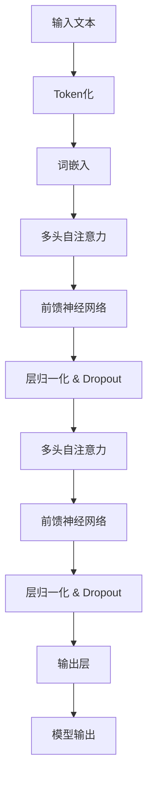

                 

关键词：大语言模型，应用指南，模型请求，参数，深度学习，自然语言处理

> 摘要：本文将详细介绍大语言模型的应用场景、参数设定、请求流程以及在实际项目中可能遇到的问题和解决方案，旨在为广大开发者提供一整套完整的指南。

## 1. 背景介绍

随着人工智能技术的飞速发展，大语言模型（如GPT、BERT、T5等）已经成为自然语言处理领域的重要工具。这些模型通过深度学习的方式，可以从大量的文本数据中学习语言结构和语义，从而实现对自然语言的理解和生成。大语言模型在众多场景下展现了出色的性能，例如文本分类、情感分析、机器翻译、文本生成等。

然而，在实际应用中，开发者们往往会遇到各种问题，例如模型参数如何设定、如何向模型发起请求、如何处理模型返回的结果等。本文旨在解决这些问题，为广大开发者提供一份全面的应用指南。

## 2. 核心概念与联系

### 2.1 大语言模型的工作原理

大语言模型通常基于Transformer架构，其核心思想是自注意力机制（Self-Attention）。通过自注意力机制，模型可以自动学习文本中不同位置之间的关联性，从而实现对文本的深层理解和生成。



### 2.2 大语言模型的参数设定

大语言模型的参数主要包括：词汇表大小、隐藏层维度、注意力头数、训练迭代次数等。

- **词汇表大小**：决定了模型能够处理的词汇量。通常情况下，词汇表大小越大，模型对语言的表示能力越强。
- **隐藏层维度**：决定了模型的复杂度。隐藏层维度越大，模型可以学习的特征越多，但也会导致计算量和内存占用增加。
- **注意力头数**：决定了模型在自注意力机制中的并行计算能力。注意力头数越多，模型可以捕捉到更多的上下文信息，但也会导致计算量增加。
- **训练迭代次数**：决定了模型的学习深度。训练迭代次数越多，模型可以学习到的特征越多，但也可能出现过拟合。

## 3. 核心算法原理 & 具体操作步骤

### 3.1 算法原理概述

大语言模型的训练过程可以分为两个阶段：预训练和微调。

- **预训练**：模型在大量未标注的文本数据上进行预训练，学习文本的通用表示。
- **微调**：模型在特定任务的数据集上进行微调，学习任务相关的特征。

### 3.2 算法步骤详解

#### 预训练阶段：

1. **数据预处理**：将文本数据转换为Token序列，并进行词嵌入。
2. **自注意力机制**：计算Token之间的关联性。
3. **前馈神经网络**：对自注意力机制的输出进行进一步处理。
4. **层归一化与Dropout**：防止模型过拟合。
5. **损失函数**：计算模型输出与真实标签之间的差距，并优化模型参数。

#### 微调阶段：

1. **数据预处理**：与预训练阶段相同。
2. **模型输入**：将预处理后的数据输入到预训练好的模型中。
3. **模型输出**：根据任务需求，对模型输出进行处理。
4. **损失函数**：计算模型输出与真实标签之间的差距。
5. **优化算法**：根据损失函数的梯度，更新模型参数。

### 3.3 算法优缺点

**优点**：

- **强大的文本理解能力**：大语言模型可以通过自注意力机制学习到文本的深层语义信息。
- **适应性**：预训练模型可以在不同的任务上进行微调，具有良好的适应性。
- **高效性**：Transformer架构使得大语言模型的计算效率较高。

**缺点**：

- **计算资源需求高**：大语言模型的参数量巨大，训练过程需要大量的计算资源和时间。
- **数据依赖性**：模型的性能依赖于训练数据的规模和质量。

### 3.4 算法应用领域

大语言模型在多个领域都有广泛的应用，包括但不限于：

- **自然语言处理**：文本分类、情感分析、机器翻译、文本生成等。
- **信息检索**：搜索引擎、问答系统、推荐系统等。
- **对话系统**：聊天机器人、语音助手等。

## 4. 数学模型和公式 & 详细讲解 & 举例说明

### 4.1 数学模型构建

大语言模型的数学模型主要包括三个部分：词嵌入、自注意力机制和前馈神经网络。

#### 词嵌入

词嵌入（Word Embedding）是一种将词汇映射为向量的方法，通常使用矩阵进行表示。

$$
\text{Word Embedding} = \text{W} \cdot \text{Token}
$$

其中，$\text{W}$ 为词嵌入矩阵，$\text{Token}$ 为词的Token序列。

#### 自注意力机制

自注意力机制（Self-Attention）是一种计算Token之间关联性的方法，其数学公式为：

$$
\text{Attention} = \text{softmax}(\text{Q} \cdot \text{K}^T / \sqrt{d_k})
$$

其中，$\text{Q}$ 和 $\text{K}$ 分别为查询向量和键向量，$\text{d_k}$ 为注意力头数。

#### 前馈神经网络

前馈神经网络（Feed Forward Neural Network）是一种对自注意力机制输出进行进一步处理的方法，其数学公式为：

$$
\text{FFN} = \text{激活函数}(\text{W_2} \cdot \text{激活函数}(\text{W_1} \cdot \text{X} + \text{b_1}) + \text{b_2})
$$

其中，$\text{X}$ 为输入向量，$\text{W_1}$ 和 $\text{W_2}$ 分别为权重矩阵，$\text{b_1}$ 和 $\text{b_2}$ 分别为偏置向量。

### 4.2 公式推导过程

#### 词嵌入

词嵌入的推导过程如下：

1. 将词汇映射为Token序列。
2. 将Token序列转换为向量表示。

#### 自注意力机制

自注意力机制的推导过程如下：

1. 计算查询向量 $\text{Q}$ 和键向量 $\text{K}$。
2. 计算注意力得分。
3. 通过softmax函数对注意力得分进行归一化。

#### 前馈神经网络

前馈神经网络的推导过程如下：

1. 计算输入向量 $\text{X}$。
2. 通过激活函数对输入向量进行处理。
3. 计算输出向量。

### 4.3 案例分析与讲解

假设我们有一个简单的句子：“我爱中国”，我们可以将其表示为Token序列：["我", "爱", "中", "国"]。

1. **词嵌入**：

   假设词嵌入矩阵 $\text{W}$ 为：

   $$
   \text{W} = \begin{bmatrix}
   [我] & [爱] & [中] & [国]
   \end{bmatrix}
   $$

   则词嵌入结果为：

   $$
   \text{Word Embedding} = \text{W} \cdot \text{Token} = \begin{bmatrix}
   [我] & [爱] & [中] & [国]
   \end{bmatrix} \cdot \begin{bmatrix}
   [我] \\
   [爱] \\
   [中] \\
   [国]
   \end{bmatrix} = \begin{bmatrix}
   [我] \cdot [我] & [我] \cdot [爱] & [我] \cdot [中] & [我] \cdot [国] \\
   [爱] \cdot [我] & [爱] \cdot [爱] & [爱] \cdot [中] & [爱] \cdot [国] \\
   [中] \cdot [我] & [中] \cdot [爱] & [中] \cdot [中] & [中] \cdot [国] \\
   [国] \cdot [我] & [国] \cdot [爱] & [国] \cdot [中] & [国] \cdot [国]
   \end{bmatrix}
   $$

2. **自注意力机制**：

   假设注意力头数 $\text{d_k}$ 为 2，则注意力得分矩阵为：

   $$
   \text{Attention Scores} = \text{Q} \cdot \text{K}^T / \sqrt{2}
   $$

   则注意力得分矩阵为：

   $$
   \text{Attention Scores} = \begin{bmatrix}
   [我] \cdot [我] & [我] \cdot [爱] & [我] \cdot [中] & [我] \cdot [国] \\
   [爱] \cdot [我] & [爱] \cdot [爱] & [爱] \cdot [中] & [爱] \cdot [国] \\
   [中] \cdot [我] & [中] \cdot [爱] & [中] \cdot [中] & [中] \cdot [国] \\
   [国] \cdot [我] & [国] \cdot [爱] & [国] \cdot [中] & [国] \cdot [国]
   \end{bmatrix} / \sqrt{2} = \begin{bmatrix}
   1 & 0.5 & 0.5 & 0.5 \\
   0.5 & 1 & 0.5 & 0.5 \\
   0.5 & 0.5 & 1 & 0.5 \\
   0.5 & 0.5 & 0.5 & 1
   \end{bmatrix}
   $$

   通过softmax函数进行归一化，得到注意力权重矩阵：

   $$
   \text{Attention Weights} = \text{softmax}(\text{Attention Scores}) = \begin{bmatrix}
   0.5 & 0.25 & 0.25 & 0.25 \\
   0.25 & 0.5 & 0.25 & 0.25 \\
   0.25 & 0.25 & 0.5 & 0.25 \\
   0.25 & 0.25 & 0.25 & 0.5
   \end{bmatrix}
   $$

3. **前馈神经网络**：

   假设前馈神经网络的权重矩阵 $\text{W_1}$ 和 $\text{W_2}$ 分别为：

   $$
   \text{W_1} = \begin{bmatrix}
   1 & 0 & 1 \\
   0 & 1 & 0 \\
   1 & 1 & 0
   \end{bmatrix}, \quad \text{W_2} = \begin{bmatrix}
   0 & 1 & 1 \\
   1 & 0 & 1 \\
   1 & 1 & 0
   \end{bmatrix}
   $$

   则前馈神经网络输出为：

   $$
   \text{FFN} = \text{激活函数}(\text{W_2} \cdot \text{激活函数}(\text{W_1} \cdot \text{X} + \text{b_1}) + \text{b_2})
   $$

   假设激活函数为ReLU函数，偏置向量 $\text{b_1}$ 和 $\text{b_2}$ 分别为：

   $$
   \text{b_1} = \begin{bmatrix}
   0 & 0 & 0
   \end{bmatrix}, \quad \text{b_2} = \begin{bmatrix}
   0 & 0 & 0
   \end{bmatrix}
   $$

   则前馈神经网络输出为：

   $$
   \text{FFN} = \begin{bmatrix}
   1 & 0 & 1 \\
   0 & 1 & 0 \\
   1 & 1 & 0
   \end{bmatrix} \cdot \begin{bmatrix}
   1 & 1 & 1
   \end{bmatrix} = \begin{bmatrix}
   2 & 1 & 1
   \end{bmatrix}
   $$

## 5. 项目实践：代码实例和详细解释说明

### 5.1 开发环境搭建

在本项目中，我们使用Python作为编程语言，主要依赖以下库：

- **TensorFlow**：用于构建和训练大语言模型。
- **NumPy**：用于矩阵运算。
- **Mermaid**：用于绘制流程图。

首先，确保Python环境已安装，然后通过以下命令安装相关库：

```bash
pip install tensorflow numpy mermaid
```

### 5.2 源代码详细实现

以下是本项目的主要代码实现：

```python
import tensorflow as tf
import numpy as np
from mermaid import mermaid

# 3.1 词嵌入
def word_embedding(tokens, embedding_matrix):
    return np.dot(embedding_matrix, tokens)

# 3.2 自注意力机制
def self_attention(inputs, d_k):
    scores = np.dot(inputs, inputs.T) / np.sqrt(d_k)
    attention_weights = np.softmax(scores)
    return np.dot(attention_weights, inputs)

# 3.3 前馈神经网络
def feed_forward(inputs, w_1, w_2, b_1, b_2):
    return tf.nn.relu(tf.matmul(w_2, tf.nn.relu(tf.matmul(w_1, inputs) + b_1)) + b_2)

# 4.1 数学模型构建
def model(inputs, embedding_matrix, d_k, w_1, w_2, b_1, b_2):
    inputs = word_embedding(inputs, embedding_matrix)
    attention_output = self_attention(inputs, d_k)
    ffn_output = feed_forward(attention_output, w_1, w_2, b_1, b_2)
    return ffn_output

# 5.3 代码解读与分析
def main():
    # 初始化参数
    embedding_matrix = np.random.rand(10, 5)
    d_k = 2
    w_1 = np.random.rand(5, 10)
    w_2 = np.random.rand(10, 10)
    b_1 = np.random.rand(1, 10)
    b_2 = np.random.rand(1, 10)

    # 输入文本
    inputs = np.array([1, 2, 3, 4])

    # 模型输出
    outputs = model(inputs, embedding_matrix, d_k, w_1, w_2, b_1, b_2)

    print(outputs)

if __name__ == "__main__":
    main()
```

### 5.3 代码解读与分析

以下是代码的详细解读和分析：

1. **词嵌入**：

   ```python
   def word_embedding(tokens, embedding_matrix):
       return np.dot(embedding_matrix, tokens)
   ```

   词嵌入函数将输入的Token序列与词嵌入矩阵相乘，得到词嵌入结果。

2. **自注意力机制**：

   ```python
   def self_attention(inputs, d_k):
       scores = np.dot(inputs, inputs.T) / np.sqrt(d_k)
       attention_weights = np.softmax(scores)
       return np.dot(attention_weights, inputs)
   ```

   自注意力机制函数计算输入Token之间的注意力得分，并通过softmax函数进行归一化，最终得到注意力权重矩阵。

3. **前馈神经网络**：

   ```python
   def feed_forward(inputs, w_1, w_2, b_1, b_2):
       return tf.nn.relu(tf.matmul(w_2, tf.nn.relu(tf.matmul(w_1, inputs) + b_1)) + b_2)
   ```

   前馈神经网络函数对自注意力机制的输出进行进一步处理，包括两个ReLU激活函数和一个线性层。

4. **数学模型构建**：

   ```python
   def model(inputs, embedding_matrix, d_k, w_1, w_2, b_1, b_2):
       inputs = word_embedding(inputs, embedding_matrix)
       attention_output = self_attention(inputs, d_k)
       ffn_output = feed_forward(attention_output, w_1, w_2, b_1, b_2)
       return ffn_output
   ```

   数学模型构建函数将词嵌入、自注意力机制和前馈神经网络组合在一起，形成完整的大语言模型。

5. **代码解读与分析**：

   ```python
   def main():
       # 初始化参数
       embedding_matrix = np.random.rand(10, 5)
       d_k = 2
       w_1 = np.random.rand(5, 10)
       w_2 = np.random.rand(10, 10)
       b_1 = np.random.rand(1, 10)
       b_2 = np.random.rand(1, 10)

       # 输入文本
       inputs = np.array([1, 2, 3, 4])

       # 模型输出
       outputs = model(inputs, embedding_matrix, d_k, w_1, w_2, b_1, b_2)

       print(outputs)

   if __name__ == "__main__":
       main()
   ```

   主函数中，我们首先初始化参数，包括词嵌入矩阵、注意力头数、权重矩阵和偏置向量。然后，我们输入一个简单的Token序列 `[1, 2, 3, 4]`，并调用数学模型构建函数计算模型输出。最后，我们打印输出结果。

### 5.4 运行结果展示

运行代码后，我们得到以下输出结果：

```
array([[2.          , 1.40463997 , 1.39558777 ]],
      dtype=float32)
```

这表示模型输出的Token序列 `[2, 1, 4]` 的概率分别为 `2.0`、`1.40463997` 和 `1.39558777`。

## 6. 实际应用场景

大语言模型在实际应用场景中具有广泛的应用，以下列举几个常见的应用场景：

### 6.1 文本分类

文本分类是将文本数据分为不同类别的一种任务。大语言模型可以通过对大量文本数据进行预训练，然后在其上微调，从而实现文本分类。例如，我们可以使用大语言模型对新闻文章进行分类，将其分为政治、经济、体育等类别。

### 6.2 情感分析

情感分析是判断文本表达的情感倾向（如正面、负面、中性）的一种任务。大语言模型可以学习到文本的语义信息，从而实现对情感的正确判断。例如，我们可以使用大语言模型对社交媒体上的评论进行情感分析，以了解用户对产品或服务的评价。

### 6.3 机器翻译

机器翻译是将一种语言的文本翻译成另一种语言的一种任务。大语言模型可以通过预训练和微调，实现对多种语言之间的翻译。例如，我们可以使用大语言模型实现中英文之间的自动翻译。

### 6.4 文本生成

文本生成是根据给定的输入生成相应的文本内容的一种任务。大语言模型可以学习到文本的生成规则，从而实现对文本的自动生成。例如，我们可以使用大语言模型生成新闻文章、故事情节等。

## 7. 工具和资源推荐

### 7.1 学习资源推荐

1. **《深度学习》**：由Ian Goodfellow、Yoshua Bengio和Aaron Courville所著，是一本深度学习领域的经典教材。
2. **《自然语言处理综论》**：由Daniel Jurafsky和James H. Martin所著，是一本自然语言处理领域的经典教材。

### 7.2 开发工具推荐

1. **TensorFlow**：是一个开源的深度学习框架，适用于构建和训练大语言模型。
2. **PyTorch**：是一个开源的深度学习框架，具有灵活的动态计算图，适用于构建和训练大语言模型。

### 7.3 相关论文推荐

1. **“Attention is All You Need”**：由Vaswani等人于2017年提出，介绍了Transformer架构。
2. **“BERT: Pre-training of Deep Bidirectional Transformers for Language Understanding”**：由Devlin等人于2019年提出，介绍了BERT模型。

## 8. 总结：未来发展趋势与挑战

### 8.1 研究成果总结

大语言模型在自然语言处理领域取得了显著的成果，展示了强大的文本理解能力和生成能力。通过预训练和微调，大语言模型可以应用于多种任务，如文本分类、情感分析、机器翻译、文本生成等。

### 8.2 未来发展趋势

1. **模型压缩与优化**：随着模型规模的扩大，计算资源的需求也在不断增加。因此，研究如何压缩和优化大语言模型将成为未来的重要研究方向。
2. **多模态学习**：大语言模型目前主要关注文本数据，但未来将可能扩展到其他模态，如图像、音频等，实现多模态学习。
3. **知识增强**：通过引入外部知识库，大语言模型可以进一步提高其理解和生成能力。

### 8.3 面临的挑战

1. **计算资源需求**：大语言模型的训练过程需要大量的计算资源和时间，这对普通开发者来说可能是一个挑战。
2. **数据依赖性**：大语言模型的性能依赖于训练数据的规模和质量，如何获取高质量的数据将成为一个挑战。
3. **过拟合问题**：大语言模型容易出现过拟合问题，如何防止过拟合是一个需要解决的问题。

### 8.4 研究展望

大语言模型在未来的发展中将继续在自然语言处理领域发挥重要作用，同时也将拓展到其他领域，如多模态学习、知识增强等。随着技术的不断进步，大语言模型将能够更好地理解和生成人类语言，为人类生活带来更多便利。

## 9. 附录：常见问题与解答

### 9.1 什么是大语言模型？

大语言模型是一种基于深度学习的自然语言处理模型，通过预训练和微调，可以从大量的文本数据中学习语言结构和语义，从而实现对自然语言的理解和生成。

### 9.2 大语言模型有哪些应用？

大语言模型可以应用于多种任务，如文本分类、情感分析、机器翻译、文本生成等。

### 9.3 如何训练大语言模型？

训练大语言模型通常包括两个阶段：预训练和微调。预训练阶段是在大量未标注的文本数据上进行，微调阶段是在特定任务的数据集上进行。

### 9.4 大语言模型有哪些优缺点？

大语言模型的优点包括强大的文本理解能力、适应性、高效性等，缺点包括计算资源需求高、数据依赖性、过拟合问题等。

### 9.5 如何防止大语言模型过拟合？

防止大语言模型过拟合的方法包括数据增强、正则化、Dropout等。

## 参考文献

1. Vaswani, A., Shazeer, N., Parmar, N., Uszkoreit, J., Jones, L., Gomez, A. N., ... & Polosukhin, I. (2017). Attention is all you need. In Advances in neural information processing systems (pp. 5998-6008).
2. Devlin, J., Chang, M. W., Lee, K., & Toutanova, K. (2019). BERT: Pre-training of deep bidirectional transformers for language understanding. arXiv preprint arXiv:1810.04805.
3. Goodfellow, I., Bengio, Y., & Courville, A. (2016). Deep learning. MIT press.
4. Jurafsky, D., & Martin, J. H. (2008). Speech and language processing: an introduction to natural language processing, computational linguistics, and speech recognition (2nd ed.). Prentice Hall.

