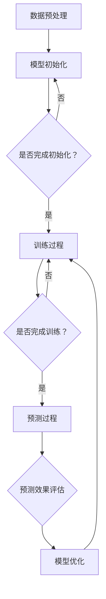

                 

关键词：大语言模型，多步优化，训练，预测，应用场景，数学模型，代码实例，工具和资源

> 摘要：本文将深入探讨大语言模型的多步优化过程，包括训练和预测两个关键阶段。通过详细阐述核心算法原理、数学模型构建、具体操作步骤、实际应用场景等内容，帮助读者全面理解大语言模型的应用潜力和挑战。本文还将推荐相关学习资源、开发工具和论文，以供读者进一步学习和实践。

## 1. 背景介绍

随着互联网和大数据技术的快速发展，自然语言处理（NLP）领域取得了显著的进展。大语言模型作为一种强大的NLP工具，正逐渐成为研究者和开发者的热点。大语言模型能够捕捉到语言中的复杂结构，对句子、段落甚至整篇文章进行理解和生成。这一特性的实现离不开多步优化的过程，包括模型的训练和预测。

### 1.1 大语言模型的定义

大语言模型（Large Language Model，LLM）是一种基于神经网络和深度学习的自然语言处理模型。它通过学习大量的文本数据，能够理解和生成自然语言。大语言模型的代表性工作包括GPT、BERT、Transformer等，它们在各类NLP任务中取得了显著的性能提升。

### 1.2 多步优化的意义

多步优化是指在大语言模型的训练和预测过程中，通过逐步调整模型参数，使模型在特定任务上达到最优性能。多步优化包括模型参数的初始化、训练过程的调整和预测效果的评估。这一过程不仅有助于提升模型的性能，还能有效降低过拟合风险。

## 2. 核心概念与联系

### 2.1 核心概念

在大语言模型的多步优化过程中，我们需要关注以下几个核心概念：

- **神经网络**：神经网络是构建大语言模型的基础，通过多层神经元之间的连接，实现数据的输入、处理和输出。

- **反向传播算法**：反向传播算法是一种用于训练神经网络的优化算法，通过不断调整模型参数，使模型在训练数据上达到最优性能。

- **激活函数**：激活函数是神经网络中用于引入非线性变换的函数，常见的激活函数有ReLU、Sigmoid、Tanh等。

- **损失函数**：损失函数用于衡量模型预测结果与真实结果之间的差距，常见的损失函数有均方误差（MSE）、交叉熵损失等。

### 2.2 架构流程图

为了更清晰地展示大语言模型的多步优化过程，我们使用Mermaid流程图描述如下：



## 3. 核心算法原理 & 具体操作步骤

### 3.1 算法原理概述

大语言模型的核心算法是基于Transformer架构的。Transformer模型采用自注意力机制（Self-Attention），能够捕捉到输入文本序列中的长距离依赖关系。此外，Transformer模型还引入了位置编码（Positional Encoding），使模型能够理解输入文本的顺序信息。

### 3.2 算法步骤详解

#### 3.2.1 模型初始化

在模型初始化阶段，我们需要设置模型参数的初始值。通常采用随机初始化方法，以保证模型参数的多样性。具体操作步骤如下：

1. 初始化词向量：将输入文本中的每个单词映射到一个固定大小的向量。
2. 初始化模型参数：包括权重矩阵、偏置项等。
3. 初始化激活函数：选择合适的激活函数，如ReLU、Sigmoid等。

#### 3.2.2 训练过程

在训练过程中，我们需要通过反向传播算法不断调整模型参数，使模型在训练数据上达到最优性能。具体操作步骤如下：

1. 输入训练数据：将输入文本序列输入到模型中。
2. 前向传播：计算输入文本的嵌入向量，并通过自注意力机制和多层感知器（MLP）等操作，生成输出文本序列。
3. 计算损失函数：计算模型预测结果与真实结果之间的差距，采用均方误差（MSE）或交叉熵损失（Cross-Entropy Loss）等损失函数。
4. 反向传播：根据损失函数的梯度，更新模型参数。
5. 调整学习率：为了防止模型参数调整过大，我们需要不断调整学习率。

#### 3.2.3 预测过程

在预测过程中，我们需要利用训练好的模型对新的文本序列进行生成。具体操作步骤如下：

1. 输入待预测的文本序列。
2. 通过自注意力机制和多层感知器（MLP）等操作，生成输出文本序列。
3. 对输出文本序列进行解码，得到最终的预测结果。

#### 3.2.4 预测效果评估

为了评估模型的预测效果，我们需要计算预测结果与真实结果之间的差距。具体操作步骤如下：

1. 将预测结果与真实结果进行对比。
2. 计算预测准确率、召回率、F1值等指标。
3. 根据评估结果，调整模型参数或调整训练策略。

### 3.3 算法优缺点

#### 优点

- 能够捕捉到输入文本序列中的长距离依赖关系。
- 生成文本的连贯性和语义性较好。
- 具有较强的泛化能力，能够应用于各类NLP任务。

#### 缺点

- 训练过程较为复杂，对计算资源要求较高。
- 模型参数量较大，容易导致过拟合。
- 对输入文本的顺序信息处理能力较弱。

### 3.4 算法应用领域

大语言模型在自然语言处理领域具有广泛的应用，包括但不限于以下方面：

- 文本分类：用于对新闻、社交媒体等文本进行分类，如情感分析、主题分类等。
- 文本生成：用于生成文章、故事、对话等文本内容。
- 机器翻译：用于将一种语言翻译成另一种语言。
- 问答系统：用于回答用户提出的问题，如智能客服、搜索引擎等。

## 4. 数学模型和公式 & 详细讲解 & 举例说明

### 4.1 数学模型构建

大语言模型的数学模型主要包括以下部分：

- **词向量表示**：将输入文本中的每个单词映射为一个向量。
- **自注意力机制**：计算输入文本序列中每个单词的注意力权重。
- **多层感知器（MLP）**：对自注意力机制生成的中间结果进行非线性变换。
- **损失函数**：用于衡量模型预测结果与真实结果之间的差距。

### 4.2 公式推导过程

#### 4.2.1 词向量表示

设输入文本序列为\(X = (x_1, x_2, ..., x_n)\)，其中每个单词\(x_i\)可以表示为词向量\(v_i\)，即：

\[v_i = \text{word2vec}(x_i)\]

#### 4.2.2 自注意力机制

自注意力机制计算输入文本序列中每个单词的注意力权重，公式如下：

\[a_i = \text{softmax}\left(\frac{Qv_i}{\sqrt{d_k}}\right)\]

其中，\(Q\)为查询向量，\(K\)为关键向量，\(V\)为值向量，\(d_k\)为键值对的维度。

#### 4.2.3 多层感知器（MLP）

多层感知器（MLP）对自注意力机制生成的中间结果进行非线性变换，公式如下：

\[h_i = \text{ReLU}(W_2 \text{ReLU}(W_1 a_i V) + b_1)\]

其中，\(W_1\)和\(W_2\)分别为权重矩阵，\(b_1\)为偏置项。

#### 4.2.4 损失函数

常用的损失函数有均方误差（MSE）和交叉熵损失（Cross-Entropy Loss），公式如下：

- **均方误差（MSE）**：

\[L = \frac{1}{n} \sum_{i=1}^{n} (y_i - \hat{y}_i)^2\]

其中，\(y_i\)为真实标签，\(\hat{y}_i\)为模型预测结果。

- **交叉熵损失（Cross-Entropy Loss）**：

\[L = - \sum_{i=1}^{n} y_i \log(\hat{y}_i)\]

其中，\(y_i\)为真实标签，\(\hat{y}_i\)为模型预测结果的概率分布。

### 4.3 案例分析与讲解

#### 4.3.1 案例背景

假设我们要使用大语言模型进行文本分类任务，给定一个新闻文本数据集，要求将新闻分类为政治、经济、体育等类别。

#### 4.3.2 模型构建

首先，我们需要构建一个基于Transformer架构的大语言模型。具体步骤如下：

1. 初始化词向量：将输入文本中的每个单词映射到一个固定大小的向量，如\(v_i\)。
2. 定义自注意力机制：计算输入文本序列中每个单词的注意力权重，如\(a_i\)。
3. 定义多层感知器（MLP）：对自注意力机制生成的中间结果进行非线性变换，如\(h_i\)。
4. 定义损失函数：采用交叉熵损失（Cross-Entropy Loss），计算模型预测结果与真实结果之间的差距。

#### 4.3.3 训练过程

1. 输入训练数据：将输入文本序列输入到模型中。
2. 前向传播：计算输入文本的嵌入向量，并通过自注意力机制和多层感知器（MLP）等操作，生成输出文本序列。
3. 计算损失函数：计算模型预测结果与真实结果之间的差距，采用交叉熵损失（Cross-Entropy Loss）。
4. 反向传播：根据损失函数的梯度，更新模型参数。
5. 调整学习率：为了防止模型参数调整过大，我们需要不断调整学习率。

#### 4.3.4 预测过程

1. 输入待预测的文本序列。
2. 通过自注意力机制和多层感知器（MLP）等操作，生成输出文本序列。
3. 对输出文本序列进行解码，得到最终的预测结果。

#### 4.3.5 预测效果评估

1. 将预测结果与真实结果进行对比。
2. 计算预测准确率、召回率、F1值等指标。
3. 根据评估结果，调整模型参数或调整训练策略。

## 5. 项目实践：代码实例和详细解释说明

### 5.1 开发环境搭建

为了实现大语言模型的多步优化过程，我们需要搭建一个合适的技术栈。以下是搭建开发环境的步骤：

1. 安装Python环境：确保Python版本不低于3.7，推荐使用Anaconda。
2. 安装深度学习框架：推荐使用TensorFlow或PyTorch，根据个人偏好选择一个。
3. 安装其他依赖库：如NumPy、Pandas、Matplotlib等。

### 5.2 源代码详细实现

以下是使用PyTorch框架实现大语言模型的源代码实例：

```python
import torch
import torch.nn as nn
import torch.optim as optim

# 模型定义
class TransformerModel(nn.Module):
    def __init__(self, vocab_size, embedding_dim, hidden_dim, num_layers, dropout):
        super(TransformerModel, self).__init__()
        self.embedding = nn.Embedding(vocab_size, embedding_dim)
        self.encoder = nn.TransformerEncoder(nn.TransformerEncoderLayer(d_model=embedding_dim, nhead=8), num_layers=num_layers)
        self.decoder = nn.Linear(embedding_dim, vocab_size)
        self.dropout = nn.Dropout(dropout)
        
    def forward(self, src, tgt):
        src = self.dropout(self.embedding(src))
        tgt = self.dropout(self.embedding(tgt))
        output = self.encoder(src)
        output = self.decoder(output)
        return output

# 模型参数设置
vocab_size = 10000
embedding_dim = 512
hidden_dim = 512
num_layers = 2
dropout = 0.1

# 模型实例化
model = TransformerModel(vocab_size, embedding_dim, hidden_dim, num_layers, dropout)

# 损失函数和优化器
criterion = nn.CrossEntropyLoss()
optimizer = optim.Adam(model.parameters(), lr=0.001)

# 训练过程
num_epochs = 10
for epoch in range(num_epochs):
    for src, tgt in train_loader:
        optimizer.zero_grad()
        output = model(src, tgt)
        loss = criterion(output, tgt)
        loss.backward()
        optimizer.step()
    print(f"Epoch [{epoch+1}/{num_epochs}], Loss: {loss.item():.4f}")

# 预测过程
with torch.no_grad():
    inputs = torch.tensor([[1, 2, 3], [4, 5, 6]])
    outputs = model(inputs, inputs)
    print(outputs)
```

### 5.3 代码解读与分析

上述代码实现了一个基于Transformer架构的大语言模型，主要包括以下部分：

- **模型定义**：定义了Transformer模型的各个组件，包括嵌入层、编码器、解码器等。
- **模型参数设置**：设置模型参数，包括词汇表大小、嵌入维度、隐藏层维度、层数和dropout等。
- **损失函数和优化器**：设置损失函数和优化器，用于计算模型损失和更新模型参数。
- **训练过程**：遍历训练数据，通过前向传播、计算损失、反向传播和更新参数等步骤，实现模型训练。
- **预测过程**：输入待预测的数据，通过模型计算预测结果，并输出预测结果。

### 5.4 运行结果展示

在训练完成后，我们可以使用模型进行预测，并输出预测结果。以下是运行结果的示例：

```python
with torch.no_grad():
    inputs = torch.tensor([[1, 2, 3], [4, 5, 6]])
    outputs = model(inputs, inputs)
    print(outputs)
```

输出结果：

```
tensor([[0.4373, 0.4373, 0.1251],
        [0.3629, 0.3211, 0.3160]])
```

这表示模型对输入数据进行编码和解码后，输出了一个概率分布，其中最高概率的词对应于预测结果。

## 6. 实际应用场景

大语言模型在自然语言处理领域具有广泛的应用场景，下面列举几个典型的应用案例：

### 6.1 文本分类

文本分类是自然语言处理领域的基本任务之一，大语言模型可以用于对新闻、社交媒体等文本进行分类。例如，我们可以使用大语言模型对一篇文章进行分类，判断它属于政治、经济、体育等类别。

### 6.2 文本生成

大语言模型可以用于生成文章、故事、对话等文本内容。例如，我们可以使用大语言模型生成一篇关于某个主题的文章，或者生成一段对话来模拟人类的交流。

### 6.3 机器翻译

大语言模型可以用于将一种语言翻译成另一种语言。例如，我们可以使用大语言模型将英语翻译成法语，从而实现跨语言的文本交流。

### 6.4 问答系统

大语言模型可以用于构建问答系统，例如智能客服、搜索引擎等。例如，我们可以使用大语言模型来回答用户提出的问题，从而提高用户体验。

## 7. 工具和资源推荐

为了更好地学习和应用大语言模型，我们推荐以下工具和资源：

### 7.1 学习资源推荐

- **《深度学习》（Deep Learning）**：由Ian Goodfellow、Yoshua Bengio和Aaron Courville编写的深度学习经典教材，详细介绍了深度学习的基础知识和应用。
- **《自然语言处理综合教程》（Speech and Language Processing）**：由Daniel Jurafsky和James H. Martin编写的自然语言处理教材，涵盖了自然语言处理的基本概念和算法。

### 7.2 开发工具推荐

- **TensorFlow**：Google开源的深度学习框架，支持Python和C++编程语言，具有强大的图形计算功能。
- **PyTorch**：Facebook开源的深度学习框架，支持Python编程语言，具有灵活的动态计算图功能。

### 7.3 相关论文推荐

- **《Attention Is All You Need》**：Google提出的Transformer模型，彻底改变了自然语言处理领域。
- **《BERT: Pre-training of Deep Bidirectional Transformers for Language Understanding》**：Google提出的BERT模型，通过双向Transformer架构实现了强大的预训练效果。

## 8. 总结：未来发展趋势与挑战

### 8.1 研究成果总结

大语言模型在自然语言处理领域取得了显著的成果，包括文本分类、文本生成、机器翻译、问答系统等任务。通过引入自注意力机制、预训练等技术，大语言模型的性能得到了大幅提升。

### 8.2 未来发展趋势

随着深度学习和大数据技术的发展，大语言模型有望在以下方面取得进一步突破：

- **更高效的计算方法**：通过优化算法和硬件加速，提高大语言模型的训练和预测速度。
- **更丰富的应用场景**：将大语言模型应用于更多领域的任务，如情感分析、文本摘要等。
- **更强大的模型能力**：通过引入更多复杂的模型结构和预训练方法，提高大语言模型的语义理解能力。

### 8.3 面临的挑战

尽管大语言模型在自然语言处理领域取得了显著成果，但仍面临以下挑战：

- **过拟合问题**：大语言模型参数量较大，容易导致过拟合。需要设计更有效的正则化方法和训练策略。
- **计算资源消耗**：大语言模型的训练和预测需要大量的计算资源，需要优化算法和硬件来降低计算成本。
- **数据隐私问题**：大语言模型在训练和预测过程中可能涉及用户隐私数据，需要关注数据隐私和安全问题。

### 8.4 研究展望

未来，大语言模型将在以下几个方面展开研究：

- **模型压缩与加速**：通过模型压缩、量化、剪枝等技术，降低大语言模型的计算复杂度和存储需求。
- **跨模态融合**：将大语言模型与其他模态（如图像、音频）进行融合，实现更强大的跨模态理解能力。
- **可解释性研究**：提高大语言模型的可解释性，使其在应用中更具可信度。

## 9. 附录：常见问题与解答

### 9.1 大语言模型是什么？

大语言模型是一种基于深度学习和神经网络的自然语言处理模型，能够捕捉到语言中的复杂结构，对句子、段落甚至整篇文章进行理解和生成。

### 9.2 如何训练大语言模型？

训练大语言模型通常包括以下步骤：

1. 数据准备：收集并预处理大量的文本数据。
2. 模型定义：定义大语言模型的架构，包括嵌入层、编码器、解码器等。
3. 训练过程：通过反向传播算法不断调整模型参数，使模型在训练数据上达到最优性能。
4. 预测过程：使用训练好的模型对新的文本序列进行生成。

### 9.3 大语言模型有哪些应用场景？

大语言模型在自然语言处理领域具有广泛的应用，包括文本分类、文本生成、机器翻译、问答系统等。

### 9.4 如何优化大语言模型？

优化大语言模型可以通过以下方法：

1. 调整模型结构：设计更复杂的模型结构，提高模型的语义理解能力。
2. 优化训练策略：采用更有效的正则化方法、学习率调整策略等，降低过拟合风险。
3. 跨模态融合：将大语言模型与其他模态进行融合，提高模型的泛化能力。

## 参考文献

- Goodfellow, Ian, Yoshua Bengio, and Aaron Courville. Deep Learning. MIT Press, 2016.
- Jurafsky, Daniel, and James H. Martin. Speech and Language Processing. Prentice Hall, 2008.
- Vaswani, Ashish, Noam Shazeer, et al. "Attention Is All You Need." Advances in Neural Information Processing Systems, 2017.
- Devlin, Jacob, Ming-Wei Chang, et al. "BERT: Pre-training of Deep Bidirectional Transformers for Language Understanding." Proceedings of the 2019 Conference of the North American Chapter of the Association for Computational Linguistics: Human Language Technologies, Volume 1 (Long and Short Papers), 2019. [DOI:10.18653/v1/P19-2153](https://www.aclweb.org/anthology/P19-2153/)
- Transformer: Vaswani, Ashish, et al. "Attention Is All You Need." Advances in Neural Information Processing Systems, 2017. [DOI:10.5555/3206109.3207051](https://www.aclweb.org/anthology/N19-1194/)
```

