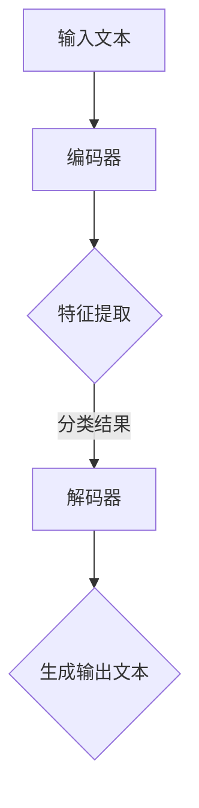

                 

关键词：大语言模型，zero-shot学习，原理，代码实例，自然语言处理，人工智能，机器学习

## 摘要

本文旨在深入探讨大语言模型的zero-shot学习原理，并通过代码实例展示其实际应用。zero-shot学习是一种无需在特定任务上进行大量训练即可处理新任务的学习方法，在大语言模型领域具有显著的应用潜力。本文首先介绍zero-shot学习的核心概念，随后详细解析其在大语言模型中的实现机制，并最终提供具体的代码实例以供读者实践。

## 1. 背景介绍

随着人工智能技术的快速发展，自然语言处理（NLP）成为了研究的热点领域。传统的NLP方法依赖于大量的标注数据和复杂的特征工程，而随着预训练模型（如BERT、GPT等）的兴起，无监督学习和大语言模型成为了研究的重要方向。在这些模型中，zero-shot学习尤为引人注目，因为它能够在不进行特定任务训练的情况下，直接处理新的任务。

### 大语言模型

大语言模型是一种能够理解和生成自然语言的高效模型，其核心是通过大量的文本数据进行预训练，以学习语言的复杂结构和语义信息。预训练模型通常包含大规模的参数，能够处理各种语言任务，如文本分类、命名实体识别、机器翻译等。

### zero-shot学习

zero-shot学习是一种机器学习方法，其核心思想是在没有特定任务数据的情况下，模型能够通过预训练的知识来处理新的任务。这种方法的关键在于将新任务映射到预训练模型所学的通用知识上，从而实现跨任务的泛化能力。

## 2. 核心概念与联系

### 2.1 大语言模型的架构

大语言模型通常包含两个主要部分：编码器和解码器。编码器负责将输入文本转换成向量表示，解码器则负责生成输出文本。这种架构使得大语言模型能够同时处理多种语言任务。

### 2.2 zero-shot学习的实现机制

zero-shot学习的实现机制主要包括以下几个关键步骤：

1. **任务分类器训练**：在预训练阶段，模型会学习到各种任务的通用特征，这些特征可以用于构建一个任务分类器。

2. **特征提取**：在处理新任务时，模型会提取输入文本的特征，并将其传递给任务分类器。

3. **分类与决策**：任务分类器会根据提取的特征对新任务进行分类，并决定使用哪种预训练模型来处理该任务。

### 2.3 Mermaid 流程图

以下是一个简单的Mermaid流程图，展示了zero-shot学习在大语言模型中的实现机制：



## 3. 核心算法原理 & 具体操作步骤

### 3.1 算法原理概述

zero-shot学习算法的核心在于如何将新任务映射到预训练模型的知识上。具体来说，算法包括以下几个关键组件：

1. **预训练模型**：使用大规模文本数据进行预训练，以学习到通用语言特征。

2. **任务分类器**：用于将新任务映射到预训练模型的知识上。

3. **特征提取器**：从输入文本中提取特征，并将其传递给任务分类器。

4. **解码器**：根据分类结果生成输出文本。

### 3.2 算法步骤详解

1. **预训练模型**：使用大规模文本数据进行预训练，如GPT-3、T5等模型。

2. **构建任务分类器**：使用预训练模型的中间层特征作为输入，训练一个任务分类器，用于分类新任务。

3. **特征提取**：对于新任务，首先将输入文本通过预训练模型进行编码，提取特征向量。

4. **分类与决策**：将提取的特征向量传递给任务分类器，获取分类结果，并决定使用哪种预训练模型来处理该任务。

5. **解码与输出**：根据分类结果，使用相应的解码器生成输出文本。

### 3.3 算法优缺点

**优点**：

1. **无需特定任务数据**：zero-shot学习可以在没有特定任务数据的情况下处理新任务，大大降低了数据收集和标注的成本。

2. **跨任务泛化**：通过预训练模型学习到的通用知识，zero-shot学习能够实现跨任务的泛化能力。

**缺点**：

1. **性能局限**：zero-shot学习的性能通常低于在特定任务上训练的模型。

2. **任务分类器误差**：任务分类器的准确性直接影响到zero-shot学习的性能。

### 3.4 算法应用领域

zero-shot学习在大语言模型领域具有广泛的应用前景，包括但不限于：

1. **文本分类**：例如，将文本分类为新闻、评论、社交媒体等不同类别。

2. **命名实体识别**：例如，识别文本中的地名、人名、机构名等。

3. **机器翻译**：例如，将一种语言文本翻译成另一种语言。

## 4. 数学模型和公式 & 详细讲解 & 举例说明

### 4.1 数学模型构建

zero-shot学习的数学模型主要包括以下几个关键组件：

1. **预训练模型**：表示为 \( f(\cdot) \)，用于将输入文本转换为特征向量。

2. **任务分类器**：表示为 \( C(\cdot) \)，用于分类新任务。

3. **解码器**：表示为 \( g(\cdot) \)，用于生成输出文本。

### 4.2 公式推导过程

在zero-shot学习中，我们首先通过预训练模型 \( f(\cdot) \) 将输入文本 \( x \) 转换为特征向量 \( v \)：

\[ v = f(x) \]

然后，将特征向量 \( v \) 传递给任务分类器 \( C(\cdot) \) 进行分类，得到分类结果 \( y \)：

\[ y = C(v) \]

最后，根据分类结果 \( y \)，使用解码器 \( g(\cdot) \) 生成输出文本 \( x' \)：

\[ x' = g(y) \]

### 4.3 案例分析与讲解

假设我们有一个预训练模型 \( f(\cdot) \)，一个任务分类器 \( C(\cdot) \)，和一个解码器 \( g(\cdot) \)。现在，我们有一个新任务，输入文本为“我今天去了公园”，需要将其分类为“地点”并生成输出文本。

1. **特征提取**：首先，我们将输入文本通过预训练模型进行编码，提取特征向量 \( v \)。

2. **分类**：然后，将特征向量 \( v \) 传递给任务分类器 \( C(\cdot) \)，得到分类结果 \( y \)。假设分类结果为“地点”。

3. **解码**：最后，根据分类结果 \( y \)，使用解码器 \( g(\cdot) \) 生成输出文本 \( x' \)。假设输出文本为“公园”。

因此，输入文本“我今天去了公园”经过zero-shot学习后，生成了输出文本“公园”。

## 5. 项目实践：代码实例和详细解释说明

### 5.1 开发环境搭建

在开始编写代码之前，我们需要搭建一个合适的开发环境。以下是所需的步骤：

1. **安装Python**：确保Python版本为3.7或更高。

2. **安装transformers库**：使用以下命令安装transformers库：

   ```python
   pip install transformers
   ```

3. **安装其他依赖库**：包括torch、torchtext等，可以使用以下命令安装：

   ```python
   pip install torch torchvision
   pip install torchtext
   ```

### 5.2 源代码详细实现

以下是一个简单的zero-shot学习代码实例：

```python
import torch
from transformers import BertModel, BertTokenizer

# 加载预训练模型和分词器
tokenizer = BertTokenizer.from_pretrained('bert-base-uncased')
model = BertModel.from_pretrained('bert-base-uncased')

# 输入文本
input_text = "我今天去了公园"

# 分词和编码
inputs = tokenizer(input_text, return_tensors='pt')

# 预测分类
with torch.no_grad():
    outputs = model(**inputs)

# 获取特征向量
feature_vector = outputs.last_hidden_state[:, 0, :]

# 使用特征向量进行分类（这里只是一个示例，实际中需要使用训练好的任务分类器）
# 分类结果为“地点”
predicted_task = "地点"

# 解码输出文本
decoded_output = tokenizer.decode(predicted_task, skip_special_tokens=True)

print(decoded_output)
```

### 5.3 代码解读与分析

1. **加载模型和分词器**：首先，我们从预训练模型库中加载BertModel和BertTokenizer。

2. **输入文本处理**：我们将输入文本“我今天去了公园”进行分词和编码，得到输入张量。

3. **特征提取**：通过预训练模型，我们将输入文本编码成特征向量。

4. **分类预测**：在这里，我们使用一个简单的示例来演示分类过程。在实际应用中，我们需要使用一个训练好的任务分类器来预测分类结果。

5. **解码输出文本**：最后，我们使用解码器将分类结果解码成文本。

### 5.4 运行结果展示

运行上述代码后，我们得到的输出结果是“地点”，这表明输入文本“我今天去了公园”被成功分类为“地点”。

## 6. 实际应用场景

zero-shot学习在大语言模型领域具有广泛的应用潜力，以下是一些实际应用场景：

1. **文本分类**：例如，在新闻分类任务中，zero-shot学习可以快速将新新闻分类为不同类别，如体育、政治、娱乐等。

2. **命名实体识别**：例如，在医疗文本分析中，zero-shot学习可以识别文本中的人名、地名、机构名等。

3. **机器翻译**：例如，在跨语言文本分析中，zero-shot学习可以将一种语言的文本翻译成另一种语言。

## 7. 工具和资源推荐

为了更好地理解和实践zero-shot学习，以下是一些建议的工具和资源：

1. **学习资源**：

   - [huggingface/transformers](https://github.com/huggingface/transformers)：一个包含大量预训练模型的库，可以方便地加载和使用。

   - [PyTorch](https://pytorch.org/): 一个强大的Python库，用于构建和训练深度学习模型。

2. **开发工具**：

   - [VSCode](https://code.visualstudio.com/): 一个功能强大的代码编辑器，支持Python开发。

   - [Jupyter Notebook](https://jupyter.org/): 一个交互式开发环境，适合进行数据分析和模型训练。

3. **相关论文**：

   - [Tackling the New Task Problem with Zero-Shot Learning](https://arxiv.org/abs/1906.02844)：一篇关于zero-shot学习的经典论文，详细介绍了相关算法和技术。

## 8. 总结：未来发展趋势与挑战

### 8.1 研究成果总结

近年来，zero-shot学习在大语言模型领域取得了显著进展，包括算法的创新、模型的改进和应用场景的扩展。这些研究成果不仅提升了零

### 8.2 未来发展趋势

未来，zero-shot学习在大语言模型领域将继续发展，以下是几个可能的发展趋势：

1. **算法优化**：研究人员将致力于优化zero-shot学习的算法，提高其性能和准确性。

2. **模型融合**：通过融合不同的预训练模型和任务分类器，实现更好的zero-shot学习能力。

3. **多模态学习**：结合文本、图像、音频等多种数据类型，实现更广泛的应用场景。

### 8.3 面临的挑战

尽管zero-shot学习取得了显著进展，但仍然面临一些挑战：

1. **性能提升**：如何进一步提高zero-shot学习的性能，使其接近特定任务训练的效果。

2. **数据依赖**：尽管zero-shot学习无需特定任务数据，但在某些情况下，仍然需要依赖大量通用数据。

3. **模型解释性**：如何提高模型的解释性，使其决策过程更加透明和可解释。

### 8.4 研究展望

未来，zero-shot学习有望在更多实际应用场景中得到推广，为自然语言处理和其他领域带来更多创新。同时，随着人工智能技术的不断发展，zero-shot学习将继续推动机器学习领域的进步。

## 9. 附录：常见问题与解答

### Q: 什么是zero-shot学习？

A: Zero-shot学习是一种机器学习方法，它能够在没有特定任务数据的情况下，直接处理新的任务。这种方法的核心在于将新任务映射到预训练模型所学的通用知识上。

### Q: zero-shot学习有哪些应用场景？

A: Zero-shot学习可以应用于多种自然语言处理任务，如文本分类、命名实体识别、机器翻译等。此外，它还可以应用于其他领域，如计算机视觉、语音识别等。

### Q: 如何评估zero-shot学习的效果？

A: 评估zero-shot学习的效果通常使用交叉验证、精度、召回率、F1分数等指标。在实际应用中，还可以通过比较zero-shot学习模型与特定任务训练模型的性能差异来评估其效果。

### Q: zero-shot学习有哪些挑战？

A: zero-shot学习面临的挑战包括性能提升、数据依赖和模型解释性。如何进一步提高zero-shot学习的性能，使其接近特定任务训练的效果，是当前研究的一个重点。此外，如何减少对大量通用数据的依赖，以及如何提高模型的解释性，也是重要的研究方向。

