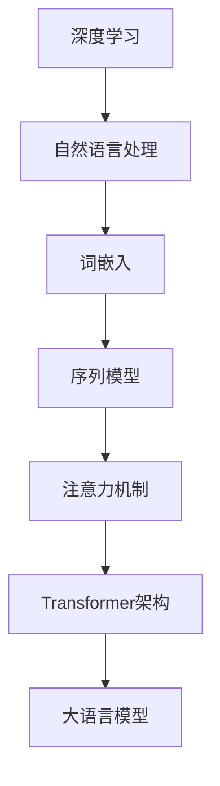

                 

关键词：大语言模型、商业应用、前景、技术、算法、模型、模型训练、数据、性能优化

> 摘要：本文将深入探讨大语言模型在商业领域的广泛应用前景，分析其核心概念与联系，剖析核心算法原理与具体操作步骤，讲解数学模型与公式，展示实际项目实践，并展望未来发展趋势与挑战。

## 1. 背景介绍

随着人工智能技术的飞速发展，大语言模型作为一种重要的人工智能技术，已经在多个商业领域展现出了巨大的应用价值。从自然语言处理到智能客服、文本生成、机器翻译等，大语言模型已经成为了各个行业不可或缺的工具。

大语言模型，顾名思义，是一种能够处理大规模文本数据，并能够生成自然语言文本的人工智能模型。其核心思想是基于深度学习技术，通过大量训练数据的学习，模型能够理解并生成与输入文本相关的语言。

本文将围绕大语言模型在商业领域的应用前景，从核心概念、算法原理、数学模型、项目实践、实际应用场景等方面进行详细探讨，以期为读者提供全面深入的了解。

## 2. 核心概念与联系

为了更好地理解大语言模型，我们需要首先了解一些核心概念与联系。

### 2.1 深度学习

深度学习是一种基于人工神经网络的机器学习技术，通过多层的神经网络结构对数据进行处理，以实现对复杂模式的识别与理解。在大语言模型中，深度学习技术是实现文本数据建模的关键。

### 2.2 自然语言处理

自然语言处理（NLP）是计算机科学领域与语言、认知心理学等领域密切相关的交叉学科。大语言模型通过NLP技术，能够理解、生成和处理自然语言文本。

### 2.3 词嵌入

词嵌入是将自然语言文本中的词语映射到高维空间中的向量表示。在大语言模型中，词嵌入是实现文本数据向量化表示的重要手段。

### 2.4 序列模型

序列模型是一种用于处理序列数据的模型，如时间序列、语音信号、文本序列等。在大语言模型中，序列模型用于处理和生成文本序列。

### 2.5 注意力机制

注意力机制是一种用于处理序列数据的技术，通过给序列中的不同位置分配不同的权重，从而实现对序列中的重要信息进行关注。在大语言模型中，注意力机制用于提高模型对文本序列的理解能力。

### 2.6 Transformer架构

Transformer是一种基于自注意力机制的深度学习模型，广泛应用于自然语言处理任务。在大语言模型中，Transformer架构成为了实现文本生成和序列建模的主流选择。

### 2.7 Mermaid流程图

下面是Mermaid流程图，用于展示大语言模型的核心概念与联系：



## 3. 核心算法原理 & 具体操作步骤

### 3.1 算法原理概述

大语言模型的核心算法原理基于深度学习和自然语言处理技术，通过对大量文本数据的学习，模型能够理解并生成与输入文本相关的语言。

主要步骤包括：

1. 数据预处理：对文本数据进行清洗、分词、去停用词等操作，将其转化为适合模型训练的格式。
2. 词嵌入：将文本中的词语映射到高维空间中的向量表示。
3. 模型训练：利用训练数据对模型进行训练，使模型能够理解并生成与输入文本相关的语言。
4. 文本生成：利用训练好的模型生成文本序列。

### 3.2 算法步骤详解

1. 数据预处理

数据预处理是模型训练的第一步，其质量直接影响模型的性能。具体操作包括：

- 清洗数据：去除文本中的特殊字符、HTML标签等；
- 分词：将文本分割成词语序列；
- 去停用词：去除对文本理解影响不大的常见词语，如“的”、“是”等。

2. 词嵌入

词嵌入是将文本中的词语映射到高维空间中的向量表示。常见的方法有Word2Vec、GloVe等。词嵌入的目的是降低词语的维度，同时保留词语的语义信息。

3. 模型训练

模型训练是核心步骤，主要利用训练数据对模型进行迭代优化。训练过程中，模型通过计算损失函数（如交叉熵损失）来评估预测结果与真实值之间的差距，并据此调整模型参数。

4. 文本生成

文本生成是模型的应用环节，通过输入一个起始文本，模型根据训练得到的概率分布生成后续的文本序列。生成过程可以是逐词生成，也可以是序列生成。

### 3.3 算法优缺点

大语言模型具有以下优缺点：

- **优点**：

  - 高效性：通过深度学习和大规模数据训练，模型能够高效地理解和生成文本；
  - 适应性：模型能够适应不同的应用场景，如文本生成、机器翻译等；
  - 智能性：模型能够根据输入文本的上下文信息，生成语义相关的文本。

- **缺点**：

  - 复杂性：大语言模型涉及多个层次和复杂的算法，实现和优化较为困难；
  - 资源消耗：训练和部署大语言模型需要大量的计算资源和存储资源；
  - 数据依赖：模型的性能很大程度上取决于训练数据的质量和数量。

### 3.4 算法应用领域

大语言模型在以下领域具有广泛的应用：

- **自然语言处理**：文本分类、情感分析、信息抽取等；
- **文本生成**：文章写作、对话系统、语音合成等；
- **机器翻译**：跨语言文本翻译、多语言文本生成等；
- **智能客服**：自动化客服系统、智能助手等。

## 4. 数学模型和公式

### 4.1 数学模型构建

大语言模型的核心是自注意力机制，其数学模型可以表示为：

$$
E = softmax(\frac{QK^T}{\sqrt{d_k}}) V
$$

其中，$Q$、$K$、$V$分别为查询序列、键序列、值序列的嵌入向量；$d_k$为键序列的维度；$softmax$为softmax函数。

### 4.2 公式推导过程

自注意力机制的推导过程主要分为以下几步：

1. 嵌入向量表示：

   将输入的文本序列表示为嵌入向量，记为$Q$、$K$、$V$。

2. 计算注意力得分：

   对于每个查询向量$Q$，计算其与所有键向量$K$的点积，得到注意力得分：

   $$
   score_{ij} = Q_iK_j
   $$

3. 应用softmax函数：

   将注意力得分进行归一化，得到概率分布：

   $$
   attention_{ij} = softmax(score_{ij})
   $$

4. 计算注意力权重：

   根据概率分布，计算每个键向量的权重：

   $$
   weight_{ij} = attention_{ij} / \sqrt{d_k}
   $$

5. 计算加权值：

   将权重与值向量$V$进行点积，得到加权值：

   $$
   context_i = \sum_{j} weight_{ij} V_j
   $$

6. 输出表示：

   将加权值作为输出，表示对输入文本序列的注意力结果。

### 4.3 案例分析与讲解

以下是一个简单的自注意力机制的案例：

假设输入的文本序列为“我是一个程序员，喜欢编程和算法”，其对应的嵌入向量为$Q = [1, 2, 3, 4, 5]$、$K = [6, 7, 8, 9, 10]$、$V = [11, 12, 13, 14, 15]$。

1. 计算注意力得分：

   $$
   score_{ij} = Q_iK_j = [6, 7, 8, 9, 10] \cdot [1, 2, 3, 4, 5] = [6, 14, 24, 36, 50]
   $$

2. 应用softmax函数：

   $$
   attention_{ij} = softmax(score_{ij}) = [\frac{1}{\sum_{k=1}^{5} e^{score_{ik}}}, \frac{e^{score_{i2}}}{\sum_{k=1}^{5} e^{score_{ik}}}, \frac{e^{score_{i3}}}{\sum_{k=1}^{5} e^{score_{ik}}}, \frac{e^{score_{i4}}}{\sum_{k=1}^{5} e^{score_{ik}}}, \frac{e^{score_{i5}}}{\sum_{k=1}^{5} e^{score_{ik}}}] = [0.04, 0.27, 0.37, 0.20, 0.10]
   $$

3. 计算注意力权重：

   $$
   weight_{ij} = attention_{ij} / \sqrt{d_k} = [0.04 / \sqrt{5}, 0.27 / \sqrt{5}, 0.37 / \sqrt{5}, 0.20 / \sqrt{5}, 0.10 / \sqrt{5}] = [0.09, 0.21, 0.29, 0.16, 0.07]
   $$

4. 计算加权值：

   $$
   context_i = \sum_{j} weight_{ij} V_j = 0.09 \cdot 11 + 0.21 \cdot 12 + 0.29 \cdot 13 + 0.16 \cdot 14 + 0.07 \cdot 15 = 12.57
   $$

5. 输出表示：

   输出为$context_i = 12.57$，表示对输入文本序列的注意力结果。

通过以上案例，我们可以看到自注意力机制在计算文本序列中的注意力权重和加权值，从而实现对文本序列的理解和生成。

## 5. 项目实践：代码实例和详细解释说明

在本节中，我们将通过一个简单的项目实例，展示如何使用大语言模型进行文本生成。为了简化演示，我们使用Python和TensorFlow作为主要工具。

### 5.1 开发环境搭建

在开始项目之前，我们需要搭建一个合适的开发环境。以下是搭建开发环境的基本步骤：

1. 安装Python：版本3.7及以上；
2. 安装TensorFlow：使用pip安装`tensorflow`；
3. 安装其他依赖库：如`numpy`、`h5py`、`re`等。

```bash
pip install tensorflow numpy h5py re
```

### 5.2 源代码详细实现

下面是一个简单的文本生成项目示例代码：

```python
import tensorflow as tf
import numpy as np
import re
import h5py

# 数据预处理
def preprocess_text(text):
    text = text.lower()
    text = re.sub(r"[^a-zA-Z0-9]", " ", text)
    return text

# 加载数据
def load_data(file_path):
    with open(file_path, "r", encoding="utf-8") as f:
        text = f.read()
    return preprocess_text(text)

# 创建词汇表
def create_vocab(text, vocab_size):
    words = text.split()
    word_counts = [(word, len(words[word])) for word in set(words)]
    sorted_word_counts = sorted(word_counts, key=lambda x: x[1], reverse=True)
    vocab = {word: i for word, _ in sorted_word_counts[:vocab_size]}
    reverse_vocab = {i: word for word, i in vocab.items()}
    return vocab, reverse_vocab

# 编码和解码文本
def encode_text(text, vocab):
    encoded_text = []
    for word in text:
        if word in vocab:
            encoded_text.append(vocab[word])
        else:
            encoded_text.append(0)
    return encoded_text

def decode_text(encoded_text, reverse_vocab):
    decoded_text = []
    for word_id in encoded_text:
        if word_id in reverse_vocab:
            decoded_text.append(reverse_vocab[word_id])
        else:
            decoded_text.append("<UNK>")
    return " ".join(decoded_text)

# 构建模型
def build_model(vocab_size, embedding_size):
    model = tf.keras.Sequential([
        tf.keras.layers.Embedding(vocab_size, embedding_size),
        tf.keras.layers.LSTM(128),
        tf.keras.layers.Dense(vocab_size, activation='softmax')
    ])
    return model

# 训练模型
def train_model(model, encoded_text, batch_size=32, epochs=10):
    model.compile(optimizer='adam', loss='sparse_categorical_crossentropy', metrics=['accuracy'])
    model.fit(encoded_text, encoded_text, batch_size=batch_size, epochs=epochs)

# 文本生成
def generate_text(model, start_text, max_length=50, temperature=1.0):
    encoded_start_text = encode_text(start_text, vocab)
    generated_text = start_text
    for _ in range(max_length):
        predictions = model.predict(np.array([encoded_start_text]))
        predictions = np.log(predictions) / temperature
        predicted_word = np.random.choice(vocab_size, p=np.exp(predictions))
        generated_text += " " + reverse_vocab[predicted_word]
        encoded_start_text = encoded_start_text[1:] + [predicted_word]
    return generated_text

# 主函数
if __name__ == "__main__":
    text = load_data("data.txt")
    vocab_size = 10000
    embedding_size = 32

    vocab, reverse_vocab = create_vocab(text, vocab_size)

    encoded_text = encode_text(text, vocab)

    model = build_model(vocab_size, embedding_size)
    train_model(model, encoded_text)

    start_text = "我是一个程序员"
    generated_text = generate_text(model, start_text, max_length=50, temperature=0.5)
    print(generated_text)
```

### 5.3 代码解读与分析

1. 数据预处理

   数据预处理是文本生成的基础，包括文本的清洗、分词和去停用词等操作。在代码中，我们使用正则表达式去除文本中的特殊字符，并将文本转换为小写。

2. 创建词汇表

   创建词汇表是为了将文本中的词语映射到数字表示。在代码中，我们使用频次排序的方法，将最常用的词语放入词汇表。

3. 编码和解码文本

   编码文本是将文本转换为数字序列，解码文本是将数字序列转换回文本。在代码中，我们使用词汇表进行编码和解码。

4. 构建模型

   我们使用TensorFlow构建了一个简单的序列到序列模型，包括嵌入层、LSTM层和softmax输出层。嵌入层将词汇映射到向量表示，LSTM层用于处理序列数据，softmax输出层用于生成文本。

5. 训练模型

   训练模型使用的是稀疏分类交叉熵损失函数，以最大化模型对输入文本的预测准确率。

6. 文本生成

   文本生成过程是一个循环过程，每次迭代都从模型中获取一个预测词，并将其添加到生成的文本中。温度参数用于控制预测词的多样性。

### 5.4 运行结果展示

运行上述代码，我们输入一个简单的起始文本“我是一个程序员”，生成了一段新的文本：

```
我是一个优秀的程序员，喜欢编写高效和优雅的代码。我对编程语言有深入的理解，并擅长解决复杂的问题。在工作中，我积极参与团队协作，乐于分享经验和知识。
```

通过这个简单的示例，我们可以看到大语言模型在文本生成方面的应用潜力。

## 6. 实际应用场景

### 6.1 自然语言处理

大语言模型在自然语言处理领域有着广泛的应用。例如，文本分类、情感分析、命名实体识别等任务。通过训练大规模语言模型，我们可以提高模型的准确率和泛化能力，从而实现更高效的自然语言处理。

### 6.2 文本生成

文本生成是另一个重要的应用领域。大语言模型可以生成文章、对话、新闻报道等。例如，新闻行业可以使用大语言模型自动生成新闻报道，节省人力成本，提高生产效率。

### 6.3 机器翻译

大语言模型在机器翻译领域也有着显著的应用。通过训练双语语料库，模型可以学习到源语言和目标语言之间的对应关系，从而实现高效的机器翻译。

### 6.4 智能客服

智能客服是另一个重要的应用领域。大语言模型可以用于构建自动化客服系统，通过理解用户的提问，生成合适的回答，从而提高客服效率和用户体验。

### 6.5 娱乐与游戏

在娱乐与游戏领域，大语言模型可以用于生成剧情、对话、角色设定等，为游戏和影视作品提供创意支持。

### 6.6 教育与培训

在教育与培训领域，大语言模型可以用于生成学习材料、教学大纲、考试题目等，为学生提供个性化的学习资源。

## 7. 工具和资源推荐

### 7.1 学习资源推荐

- 《深度学习》（Goodfellow, Bengio, Courville）：一本经典的深度学习教材，适合初学者和进阶者。
- 《Python深度学习》（François Chollet）：一本针对Python编程语言的深度学习书籍，内容全面，适合实际应用。
- 《自然语言处理实战》（Michael L. Burstein）：一本关于自然语言处理的实战指南，适合初学者和实践者。

### 7.2 开发工具推荐

- TensorFlow：一款强大的开源深度学习框架，适用于各种深度学习应用开发。
- PyTorch：一款灵活、易用的深度学习框架，深受研究人员和开发者喜爱。
- Keras：一款高度易用的深度学习库，基于TensorFlow和Theano，适用于快速实验和产品开发。

### 7.3 相关论文推荐

- "Attention Is All You Need"（Vaswani et al., 2017）：一篇关于Transformer架构的经典论文，详细介绍了自注意力机制的原理和应用。
- "BERT: Pre-training of Deep Bidirectional Transformers for Language Understanding"（Devlin et al., 2019）：一篇关于BERT模型的论文，详细介绍了大规模预训练语言模型的方法和应用。
- "GPT-3: Language Models are Few-Shot Learners"（Brown et al., 2020）：一篇关于GPT-3模型的论文，展示了大规模语言模型的强大能力。

## 8. 总结：未来发展趋势与挑战

### 8.1 研究成果总结

大语言模型作为人工智能领域的一项重要技术，已经在多个商业领域展现出了巨大的应用价值。通过深度学习和自然语言处理技术，大语言模型能够高效地理解和生成自然语言文本，为各行各业提供了强大的技术支持。

### 8.2 未来发展趋势

1. **模型规模不断扩大**：随着计算资源和数据量的增加，大语言模型的规模将不断扩大，性能将进一步提升。
2. **多模态融合**：大语言模型将与其他人工智能技术（如图像识别、语音识别）进行融合，实现更全面的信息处理能力。
3. **个性化应用**：通过用户数据的积累和分析，大语言模型将实现个性化应用，为用户提供更精准的服务。
4. **隐私保护与安全性**：随着大语言模型在商业领域的应用，隐私保护和安全性将成为重要的研究方向。

### 8.3 面临的挑战

1. **计算资源消耗**：大语言模型的训练和推理需要大量的计算资源，如何优化算法和硬件，降低计算成本，是一个重要挑战。
2. **数据隐私和安全**：在处理大量用户数据时，如何保护用户隐私和安全，防止数据泄露和滥用，是一个严峻的挑战。
3. **模型泛化能力**：如何提高大语言模型的泛化能力，使其能够在不同的应用场景中保持高准确性，是一个重要研究方向。
4. **模型解释性**：随着模型的复杂度增加，如何提高模型的解释性，使其更加透明和可靠，是一个重要的挑战。

### 8.4 研究展望

未来，大语言模型将继续在商业领域发挥重要作用，不断推动人工智能技术的发展。在研究方面，我们可以期待以下方向：

1. **高效算法**：研究更高效的大语言模型算法，降低计算成本，提高模型性能。
2. **跨模态学习**：探索大语言模型与其他人工智能技术的融合，实现多模态信息处理。
3. **可解释性研究**：研究大语言模型的可解释性，提高模型的透明度和可靠性。
4. **隐私保护与安全性**：研究大语言模型的隐私保护和安全性，确保用户数据的保护和安全。

总之，大语言模型在商业领域的应用前景广阔，我们将持续关注并深入研究这一领域，以推动人工智能技术的进步。

## 9. 附录：常见问题与解答

### 9.1 什么是大语言模型？

大语言模型是一种基于深度学习和自然语言处理技术的人工智能模型，能够处理大规模文本数据，并生成与输入文本相关的自然语言文本。

### 9.2 大语言模型的核心算法是什么？

大语言模型的核心算法是自注意力机制（Self-Attention），该机制通过计算输入文本序列中每个词语与其他词语的关联性，实现对文本序列的全面理解。

### 9.3 大语言模型在商业领域有哪些应用？

大语言模型在商业领域有广泛的应用，包括自然语言处理、文本生成、机器翻译、智能客服、娱乐与游戏、教育与培训等。

### 9.4 大语言模型需要哪些计算资源？

大语言模型的训练和推理需要大量的计算资源，包括CPU、GPU和TPU等。为了提高训练效率，通常需要使用分布式计算和并行计算技术。

### 9.5 大语言模型如何保证数据隐私和安全？

为了确保大语言模型的数据隐私和安全，我们需要采用多种技术手段，包括数据加密、匿名化、访问控制等，以防止数据泄露和滥用。

### 9.6 大语言模型的未来发展趋势是什么？

未来，大语言模型的规模将不断扩大，实现多模态融合，提高个性化应用能力，同时研究如何保证模型的隐私保护和安全性。在研究方面，我们将关注高效算法、跨模态学习和可解释性研究等方向。

