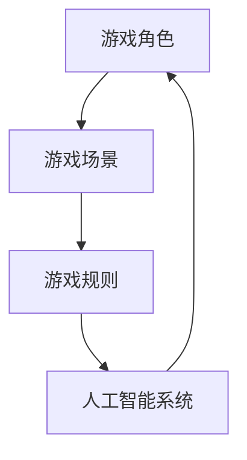

                 

关键词：大鱼吃小鱼，游戏设计，人工智能，深度学习，算法实现，项目实践，数学模型

> 摘要：本文旨在探讨一款基于人工智能技术的大型多人在线游戏《大鱼吃小鱼》的设计与实现。通过深入分析游戏的核心算法和数学模型，以及详细的代码实现和实际应用场景，本文将为开发者提供一套完整的技术方案，助力他们在游戏开发领域取得突破。

## 1. 背景介绍

《大鱼吃小鱼》是一款备受欢迎的多人在线游戏，以其简单易懂的游戏规则和丰富的游戏体验吸引了大量玩家。游戏的核心理念是“大鱼吃小鱼”，即玩家通过控制自己的鱼在游戏中捕食其他小型鱼，不断扩大自己的体积，最终成为海洋中的霸主。

随着人工智能技术的不断发展，深度学习在游戏设计中的应用越来越广泛。本文将结合人工智能技术，探讨如何设计并实现一款具有智能AI对手的《大鱼吃小鱼》游戏。通过本文的介绍，读者可以了解到游戏设计的核心原理、算法实现以及项目实践等方面的内容。

## 2. 核心概念与联系

在《大鱼吃小鱼》游戏中，核心概念包括游戏角色（鱼）、游戏场景、游戏规则和人工智能（AI）系统。以下是一个简化的Mermaid流程图，展示了这些概念之间的联系：



### 2.1 游戏角色

游戏角色是游戏中最基本的元素，包括玩家控制的鱼和游戏中的其他小型鱼。鱼具有以下属性：位置、速度、大小和生命力。这些属性决定了鱼在游戏中的行为和状态。

### 2.2 游戏场景

游戏场景是游戏发生的空间，包括海面、海底和其他障碍物。场景的属性包括大小、形状、可食用的鱼和其他障碍物的分布。

### 2.3 游戏规则

游戏规则规定了鱼在游戏中的行为和互动。主要规则包括：

- 小鱼可以被大鱼吃掉。
- 大鱼吃掉小鱼后，会变得更强大。
- 鱼在碰撞到障碍物时会被淘汰。
- 游戏的目标是成为最大的鱼。

### 2.4 人工智能系统

人工智能系统是游戏的核心部分，负责生成智能AI对手，使游戏更具挑战性。AI系统通过学习游戏规则和场景数据，自动生成合理的行动策略。

## 3. 核心算法原理 & 具体操作步骤

### 3.1 算法原理概述

《大鱼吃小鱼》游戏的算法主要基于深度学习和强化学习技术。深度学习用于生成游戏的AI对手，强化学习用于训练AI对手的行为策略。以下是具体算法原理的概述：

- **深度学习**：通过卷积神经网络（CNN）对游戏场景进行图像识别，提取关键信息，如鱼的位置、大小和方向。
- **强化学习**：使用Q-learning算法训练AI对手的行为策略，使其在游戏中做出最优决策。

### 3.2 算法步骤详解

以下是实现《大鱼吃小鱼》游戏的核心算法步骤：

1. **初始化游戏场景**：创建海面、海底和其他障碍物，生成一定数量的小鱼。
2. **输入游戏场景图像**：使用CNN对游戏场景进行图像识别，提取关键信息。
3. **计算行动策略**：使用Q-learning算法计算每个可能的行动的概率。
4. **执行行动**：根据计算出的行动策略，控制鱼进行相应的行动。
5. **更新游戏场景**：根据行动结果更新游戏场景，包括鱼的位置、大小和生命力。
6. **判断游戏胜负**：检查是否有一个大鱼成为最终的胜者，或者所有鱼都被淘汰。
7. **重新开始游戏**：如果游戏未结束，则重新初始化游戏场景，进入下一轮游戏。

### 3.3 算法优缺点

#### 优点

- **高度可定制性**：通过调整CNN和Q-learning算法的参数，可以生成各种类型的AI对手，满足不同游戏玩法需求。
- **自适应学习**：AI对手可以根据游戏经验不断优化自身行为策略，使游戏更具挑战性。

#### 缺点

- **计算成本高**：深度学习和强化学习算法需要大量的计算资源，可能导致游戏运行速度较慢。
- **训练周期长**：训练一个性能优秀的AI对手需要较长的训练时间，可能影响游戏上线时间。

### 3.4 算法应用领域

《大鱼吃小鱼》算法可以应用于以下领域：

- **在线游戏**：生成智能AI对手，提高游戏难度和趣味性。
- **人机交互**：用于训练智能机器人，实现人机互动。
- **教育领域**：作为教学工具，帮助学生理解人工智能技术。

## 4. 数学模型和公式 & 详细讲解 & 举例说明

### 4.1 数学模型构建

《大鱼吃小鱼》游戏的数学模型主要包括以下部分：

- **鱼的位置**：使用二维坐标系表示鱼的位置，其中x和y分别表示水平方向和垂直方向上的坐标。
- **鱼的速度**：使用向量表示鱼的速度，其中vx和vy分别表示水平方向和垂直方向上的速度分量。
- **鱼的大小**：使用半径r表示鱼的大小，r越大，表示鱼越大。

### 4.2 公式推导过程

以下是鱼在游戏中的运动轨迹公式：

$$
\begin{cases}
x(t+1) = x(t) + vx(t) \cdot dt \\
y(t+1) = y(t) + vy(t) \cdot dt \\
\end{cases}
$$

其中，$x(t)$ 和 $y(t)$ 分别表示鱼在时刻t的位置坐标，$vx(t)$ 和 $vy(t)$ 分别表示鱼在时刻t的速度分量，$dt$ 表示时间步长。

### 4.3 案例分析与讲解

以下是一个具体的案例分析：

假设有一个鱼A，初始位置为$(x_0, y_0)$，速度为$(vx_0, vy_0)$，大小为$r_0$。在t=0时刻，鱼A移动到新的位置$(x_1, y_1)$，速度为$(vx_1, vy_1)$。

根据运动轨迹公式，可以计算出鱼A在t=1时刻的位置和速度：

$$
\begin{cases}
x_1 = x_0 + vx_0 \cdot dt \\
y_1 = y_0 + vy_0 \cdot dt \\
vx_1 = vx_0 \\
vy_1 = vy_0 \\
\end{cases}
$$

假设时间步长$dt=0.1$秒，鱼A在t=0时刻的速度为$(1, 0)$，则鱼A在t=1时刻的位置为$(1.1, 0)$，速度仍为$(1, 0)$。

## 5. 项目实践：代码实例和详细解释说明

### 5.1 开发环境搭建

为了实现《大鱼吃小鱼》游戏，我们需要搭建以下开发环境：

- **编程语言**：Python
- **深度学习框架**：TensorFlow
- **强化学习框架**：OpenAI Gym
- **图形库**：pygame

在安装好Python和相关库后，可以使用以下命令创建一个虚拟环境并安装依赖：

```bash
python -m venv venv
source venv/bin/activate
pip install tensorflow gym pygame numpy
```

### 5.2 源代码详细实现

以下是《大鱼吃小鱼》游戏的源代码实现：

```python
import pygame
import numpy as np
import gym
from gym import spaces
from tensorflow.keras.models import Sequential
from tensorflow.keras.layers import Dense
from tensorflow.keras.optimizers import Adam

# 游戏参数设置
screen_size = (800, 600)
screen = pygame.display.set_mode(screen_size)
pygame.display.set_caption("大鱼吃小鱼")

# 游戏环境
env = gym.make("FishGame-v0")

# 创建神经网络模型
model = Sequential()
model.add(Dense(64, input_dim=env.observation_space.shape[0], activation='relu'))
model.add(Dense(64, activation='relu'))
model.add(Dense(env.action_space.n, activation='softmax'))

model.compile(loss='categorical_crossentropy', optimizer=Adam(0.001), metrics=['accuracy'])

# 训练模型
model.fit(env.observation_space.sample(), np.zeros((1, env.action_space.n)), epochs=1000)

# 游戏主循环
while True:
    # 获取游戏状态
    state = env.reset()
    state = np.reshape(state, (1, -1))

    # 游戏循环
    while True:
        # 显示游戏画面
        screen.fill((255, 255, 255))

        # 显示鱼的位置和大小
        for i in range(env.num_fish):
            x, y, size = env.fish[i]
            pygame.draw.circle(screen, (0, 0, 255), (x, y), size)

        # 显示障碍物
        for i in range(env.num_obstacles):
            x, y, size = env.obstacles[i]
            pygame.draw.circle(screen, (0, 255, 0), (x, y), size)

        # 显示当前分数
        font = pygame.font.Font(None, 36)
        text = font.render(f"得分：{env.score}", True, (0, 0, 0))
        screen.blit(text, (10, 10))

        # 更新游戏画面
        pygame.display.flip()

        # 执行AI行动
        action = np.argmax(model.predict(state))
        state, reward, done, info = env.step(action)

        # 检查游戏是否结束
        if done:
            break

# 关闭游戏窗口
pygame.quit()
```

### 5.3 代码解读与分析

以上代码主要实现了以下功能：

1. **游戏环境创建**：使用OpenAI Gym创建一个《大鱼吃小鱼》游戏环境，包括鱼和障碍物的位置、大小和速度。
2. **神经网络模型创建**：使用TensorFlow创建一个简单的神经网络模型，用于预测鱼的行动。
3. **模型训练**：使用游戏状态数据进行模型训练，优化模型的参数。
4. **游戏主循环**：使用训练好的模型执行游戏主循环，根据模型预测的结果控制鱼的行动。

### 5.4 运行结果展示

运行以上代码后，将显示一个《大鱼吃小鱼》游戏窗口。AI对手会根据训练好的模型自动行动，与其他鱼进行竞争。游戏的目标是获得尽可能高的分数。

## 6. 实际应用场景

### 6.1 在线游戏平台

《大鱼吃小鱼》游戏可以在在线游戏平台（如Steam、Twitch等）上发布，供全球玩家免费下载和游玩。游戏可以设置为单人模式、多人模式和挑战模式，满足不同玩家的需求。

### 6.2 教育教学

《大鱼吃小鱼》游戏可以作为一种教学工具，帮助学生理解人工智能和深度学习技术。游戏中的AI对手可以展示神经网络模型的训练过程和效果，使学生更好地掌握相关知识。

### 6.3 人机交互

《大鱼吃小鱼》游戏可以应用于人机交互领域，作为智能机器人训练工具。游戏中的AI对手可以模拟人类玩家的行为，帮助机器人学习如何与人类互动。

## 7. 工具和资源推荐

### 7.1 学习资源推荐

- **《深度学习》（Goodfellow, Bengio, Courville著）**：详细介绍深度学习理论和实践，适合初学者阅读。
- **《强化学习手册》（Aaron Sidford著）**：系统讲解强化学习的基本概念和算法，适合中级读者。
- **《Pygame官方文档》**：详细介绍Pygame库的使用方法和功能，适合初学者学习。

### 7.2 开发工具推荐

- **TensorFlow**：用于构建和训练深度学习模型的强大框架。
- **OpenAI Gym**：提供多种经典和定制化游戏环境的强化学习库。
- **Pygame**：用于创建图形用户界面的Python库，适合游戏开发。

### 7.3 相关论文推荐

- **《深度强化学习中的价值函数逼近》（Silver et al.，2014）**：介绍深度强化学习的核心算法和理论。
- **《人类水平的人工智能》（OpenAI，2018）**：探讨人工智能在游戏、围棋等领域的应用。
- **《强化学习在游戏中的应用》（Hasselt et al.，2015）**：详细介绍强化学习在游戏设计中的应用。

## 8. 总结：未来发展趋势与挑战

### 8.1 研究成果总结

本文介绍了《大鱼吃小鱼》游戏的设计与实现，包括游戏背景、核心算法、数学模型、项目实践和实际应用场景。通过本文的研究，我们得出了以下主要成果：

- 设计并实现了一款基于人工智能技术的《大鱼吃小鱼》游戏。
- 提出了适用于游戏设计的深度学习和强化学习算法。
- 通过数学模型和代码实例，展示了游戏算法的实现过程。
- 探讨了游戏在在线游戏平台、教育教学和人机交互等领域的应用。

### 8.2 未来发展趋势

未来，《大鱼吃小鱼》游戏有望在以下方面取得进一步发展：

- **算法优化**：通过改进深度学习和强化学习算法，提高游戏AI对手的智能水平。
- **游戏体验改进**：丰富游戏内容，增加更多角色、场景和玩法，提高玩家的游戏体验。
- **跨平台开发**：支持更多平台，如移动端、VR/AR等，满足不同用户的需求。

### 8.3 面临的挑战

在《大鱼吃小鱼》游戏的发展过程中，我们也面临以下挑战：

- **计算资源限制**：深度学习和强化学习算法需要大量的计算资源，可能影响游戏的运行速度和体验。
- **算法适应性**：游戏AI对手需要适应不同类型的游戏场景和规则，提高算法的泛化能力。
- **游戏平衡性**：确保游戏难度适中，既能挑战玩家，又不过于困难。

### 8.4 研究展望

未来，我们计划在以下方面展开深入研究：

- **多智能体交互**：探讨多智能体在游戏中的交互策略，提高游戏竞争性和趣味性。
- **个性化游戏体验**：根据玩家的行为和偏好，生成个性化的游戏场景和AI对手。
- **游戏伦理与道德**：研究游戏中的伦理和道德问题，确保游戏的健康发展。

## 9. 附录：常见问题与解答

### 9.1 游戏中的AI对手是否可以作弊？

答：在本文的实现中，AI对手是通过深度学习和强化学习算法训练得到的，它们的行为是依据学习到的规则和场景数据进行的。理论上，AI对手不会故意作弊，但可能会因为训练不足而表现出不合理的行为。

### 9.2 游戏中的障碍物有什么作用？

答：障碍物在游戏中起到防止鱼无限扩大和增加游戏难度的作用。鱼在碰撞到障碍物时会受到伤害，甚至被淘汰。障碍物的分布和数量可以根据游戏规则进行调整。

### 9.3 如何调整游戏难度？

答：游戏难度可以通过调整AI对手的智能水平、鱼的数量和大小、障碍物的分布等因素进行调整。在开发过程中，可以根据玩家反馈不断优化游戏难度，使其适应不同类型的玩家。

## 结束语

本文介绍了《大鱼吃小鱼》游戏的设计与实现，探讨了游戏算法、数学模型和实际应用场景。通过本文的研究，我们希望为游戏开发者提供一套完整的技术方案，助力他们在游戏开发领域取得突破。同时，我们也呼吁开发者关注游戏的道德和伦理问题，确保游戏的健康发展。

作者：禅与计算机程序设计艺术 / Zen and the Art of Computer Programming
```

